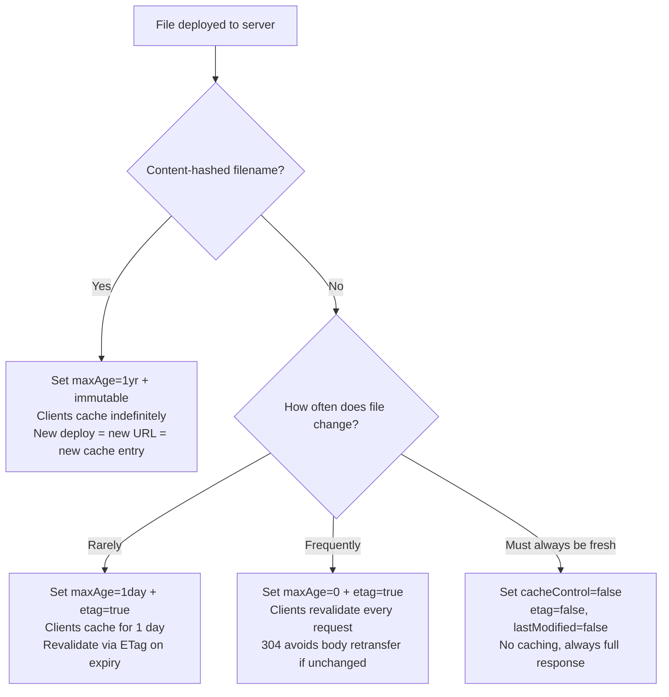
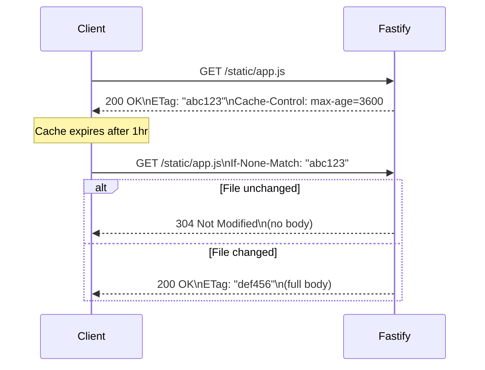

## Caching Headers

### Overview

`@fastify/static` provides built-in support for HTTP caching headers via options passed at plugin registration. These headers — `Cache-Control`, `ETag`, and `Last-Modified` — allow clients and intermediary caches (CDNs, proxies) to avoid redundant transfers. The underlying implementation delegates to the `send` package, which handles conditional request logic and header assembly.

---

### HTTP Caching Fundamentals

Before covering the options, understanding the two caching strategies is necessary:

**Freshness-based caching** — the server tells the client how long a response is valid. The client does not re-request the file until that duration expires.
- Headers: `Cache-Control: max-age`, `Expires`

**Validation-based caching** — the client caches the response but revalidates with the server on subsequent requests. The server responds with `304 Not Modified` if the resource has not changed, saving response body transfer.
- Headers: `ETag` / `If-None-Match`, `Last-Modified` / `If-Modified-Since`

Both strategies can be combined.

---

### Options Overview

| Option | Type | Default | Controls |
|---|---|---|---|
| `etag` | `boolean` | `true` | `ETag` response header generation |
| `lastModified` | `boolean` | `true` | `Last-Modified` response header |
| `maxAge` | `number` | `0` | `Cache-Control: max-age` (milliseconds) |
| `immutable` | `boolean` | `false` | Appends `immutable` to `Cache-Control` |
| `cacheControl` | `boolean` | `true` | Enables/disables `Cache-Control` header entirely |

---

### `etag`

When `true`, `@fastify/static` generates an `ETag` header for each served file. The ETag is a fingerprint of the file content or metadata. On subsequent requests, the client sends `If-None-Match: <etag>`. If the file has not changed, the server responds with `304 Not Modified` and no body.

```js
await app.register(fastifyStatic, {
  root: path.join(__dirname, 'public'),
  etag: true, // default
})
```

**Example exchange:**

First request:
```
GET /static/app.js HTTP/1.1

HTTP/1.1 200 OK
ETag: "abc123"
Content-Length: 4092
```

Second request:
```
GET /static/app.js HTTP/1.1
If-None-Match: "abc123"

HTTP/1.1 304 Not Modified
```

**Key Points:**
- ETag generation is handled by the `send` package. [Unverified] The exact algorithm (weak vs strong ETag, inode-based vs content-based) depends on the `send` version in use. Verify with `npm ls send`.
- Disable ETags only if you have a deliberate reason — for example, when serving behind a CDN that manages its own ETag strategy and conflicts arise.

```js
etag: false
```

---

### `lastModified`

When `true`, sets the `Last-Modified` header to the file's `mtime` (filesystem modification time). On subsequent requests, clients send `If-Modified-Since: <date>`. If `mtime` has not advanced, the server responds with `304 Not Modified`.

```js
await app.register(fastifyStatic, {
  root: path.join(__dirname, 'public'),
  lastModified: true, // default
})
```

**Example exchange:**

First request:
```
GET /static/styles.css HTTP/1.1

HTTP/1.1 200 OK
Last-Modified: Tue, 01 Jan 2025 12:00:00 GMT
```

Second request:
```
GET /static/styles.css HTTP/1.1
If-Modified-Since: Tue, 01 Jan 2025 12:00:00 GMT

HTTP/1.1 304 Not Modified
```

**Key Points:**
- `Last-Modified` precision is limited to one-second resolution. Files modified multiple times within one second may not trigger a cache miss.
- `ETag` is generally more reliable than `Last-Modified` for detecting file changes. Using both (the default) allows clients to use either mechanism.
- [Inference] In containerized or CI/CD deployments, filesystem `mtime` values may be reset to build time or epoch on each deployment. Verify that `mtime` reflects actual file changes in your environment.

---

### `maxAge`

Sets `Cache-Control: max-age=<seconds>`. The value is specified in **milliseconds** at the option level and converted to seconds in the header.

```js
await app.register(fastifyStatic, {
  root: path.join(__dirname, 'public'),
  maxAge: 86400000, // 1 day in ms → Cache-Control: max-age=86400
})
```

**Key Points:**
- Default is `0`, which results in `Cache-Control: public, max-age=0` — effectively no client-side caching.
- A `max-age` greater than `0` tells the client (and intermediary caches) the file is fresh for that duration. The client will not re-request the file until the duration expires, even if the file changes on the server.
- [Inference] Setting a high `maxAge` without content-hashed filenames means clients may serve stale assets after a deployment. This is a common production misconfiguration.

**Common `maxAge` values:**

| Duration | Milliseconds |
|---|---|
| 1 hour | `3600000` |
| 1 day | `86400000` |
| 1 week | `604800000` |
| 1 year | `31536000000` |

---

### `immutable`

Appends the `immutable` directive to `Cache-Control`. Tells the client the file will never change for the duration of `max-age` — the client should not revalidate even when the cache would normally do so.

```js
await app.register(fastifyStatic, {
  root: path.join(__dirname, 'dist'),
  maxAge: 31536000000, // 1 year
  immutable: true,
})
```

Resulting header:
```
Cache-Control: public, max-age=31536000, immutable
```

**Key Points:**
- `immutable` is meaningful only when combined with a non-zero `maxAge`.
- `immutable` should only be used with **content-hashed filenames** — filenames that include a hash of the file's contents (e.g., `app.3f9c1a.js`, `styles.d4e8b2.css`). When the file content changes, the filename changes, breaking the cache entry naturally.
- Using `immutable` without content hashing will cause clients to serve stale files for the full `max-age` duration after a deployment, with no mechanism to force a refresh short of clearing the browser cache.
- [Inference] Most modern frontend build tools (Vite, webpack, esbuild) generate content-hashed output filenames by default. Verify your build configuration produces hashed filenames before enabling `immutable`.

---

### `cacheControl`

Controls whether the `Cache-Control` header is emitted at all.

```js
await app.register(fastifyStatic, {
  root: path.join(__dirname, 'public'),
  cacheControl: false, // suppress Cache-Control entirely
})
```

**Key Points:**
- Setting `cacheControl: false` does not disable `ETag` or `Last-Modified`. Those headers remain active and conditional requests (`304`) still function.
- Use `cacheControl: false` when an upstream proxy or CDN manages `Cache-Control` independently and you want to avoid conflicting directives.
- `maxAge: 0` does not remove the `Cache-Control` header — it sets `max-age=0`. To fully suppress the header, use `cacheControl: false`.

---

### Combining Options — Common Patterns

#### Pattern 1: Aggressive caching for hashed assets

```js
await app.register(fastifyStatic, {
  root: path.join(__dirname, 'dist'),
  prefix: '/assets/',
  maxAge: 31536000000,  // 1 year
  immutable: true,
  etag: true,
  lastModified: true,
})
```

Use when: serving content-hashed build output. Files never change at a given URL; stale cache is never an issue because changed files get new URLs.

---

#### Pattern 2: Short-lived cache with revalidation

```js
await app.register(fastifyStatic, {
  root: path.join(__dirname, 'public'),
  prefix: '/static/',
  maxAge: 3600000,      // 1 hour
  immutable: false,
  etag: true,
  lastModified: true,
})
```

Use when: files may change between deployments but do not have content-hashed names. The client caches for 1 hour, then revalidates. ETags enable `304` responses to minimize data transfer.

---

#### Pattern 3: No caching — always revalidate

```js
await app.register(fastifyStatic, {
  root: path.join(__dirname, 'public'),
  maxAge: 0,
  etag: true,
  lastModified: true,
})
```

Resulting headers:
```
Cache-Control: public, max-age=0
ETag: "abc123"
Last-Modified: ...
```

Use when: files change frequently and stale responses are unacceptable. `ETag`/`Last-Modified` still allow `304` responses to avoid body transfer on unchanged files.

---

#### Pattern 4: No caching at all

```js
await app.register(fastifyStatic, {
  root: path.join(__dirname, 'public'),
  maxAge: 0,
  cacheControl: false,
  etag: false,
  lastModified: false,
})
```

Use when: assets must always be fetched fresh, with no conditional request optimization — for example, dynamically generated files served as static, or debugging environments.

---

### `setHeaders` — Per-File Header Customization

For per-file or per-extension caching logic not expressible via global options, use `setHeaders`:

```js
await app.register(fastifyStatic, {
  root: path.join(__dirname, 'public'),
  setHeaders: (res, filePath, stat) => {
    if (filePath.endsWith('.html')) {
      // HTML files: no caching — always revalidate
      res.setHeader('Cache-Control', 'no-cache')
    } else if (filePath.match(/\.[a-f0-9]{8}\.(js|css)$/)) {
      // Content-hashed assets: cache aggressively
      res.setHeader('Cache-Control', 'public, max-age=31536000, immutable')
    }
  },
})
```

**Key Points:**
- `res` is the raw Node.js `http.ServerResponse` — use `res.setHeader()`, not Fastify's `reply.header()`.
- Headers set via `setHeaders` override those generated by `etag`, `lastModified`, `maxAge`, and `cacheControl` options for that file. [Unverified] Confirm override precedence in your `@fastify/static` version.
- `setHeaders` runs synchronously before the response is flushed. Do not call `res.end()` or perform async operations inside it.

---

### Cache-Control Directives — Reference

| Directive | Set by | Meaning |
|---|---|---|
| `public` | `send` package | Response may be cached by any cache |
| `max-age=N` | `maxAge` option | Cache is fresh for N seconds |
| `immutable` | `immutable` option | Cache entry will not change during `max-age` |
| `no-cache` | `setHeaders` (manual) | Cache must revalidate before using stored response |
| `no-store` | `setHeaders` (manual) | Do not cache at all |
| `private` | `setHeaders` (manual) | Only user's browser may cache; no CDN/proxy |

**Key Points:**
- `@fastify/static` natively generates `public, max-age=N` and optionally `immutable`. All other directives require manual `setHeaders` or a separate hook.
- [Inference] For `private` or `no-store` directives — e.g., for authenticated user-specific files — use `setHeaders` or a route-level `onSend` hook to set headers before the response flushes.

---

### Caching Behavior Across Deployment



---

### Conditional Request Flow



---

### Interaction with `send` Package Options

Caching-related options can also be passed via the `send` sub-option, which is forwarded directly to the `send` package. This gives access to lower-level controls not exposed as top-level options.

```js
await app.register(fastifyStatic, {
  root: path.join(__dirname, 'public'),
  send: {
    etag: true,
    lastModified: true,
    maxAge: '1d',           // send accepts ms-compatible strings
    immutable: false,
  },
})
```

**Key Points:**
- Top-level options (`etag`, `maxAge`, etc.) are preferred for clarity.
- The `send` sub-option is available as an escape hatch for options not surfaced at the top level.
- [Unverified] When both top-level and `send`-level options overlap, precedence behavior should be verified against your installed version. Avoid setting the same option in both places.

---

**Related Topics:**
- Content-hashed filenames and frontend build tool configuration (Vite, webpack, esbuild)
- `setHeaders` callback — per-file and per-extension header logic
- `ETag` internals and the `send` package
- CDN integration — cache header strategies for CloudFront, Cloudflare, Fastly
- `Cache-Control: no-store` and `private` for authenticated static content
- `acceptRanges` and partial content responses
- HTTP conditional requests — `If-None-Match`, `If-Modified-Since` in depth