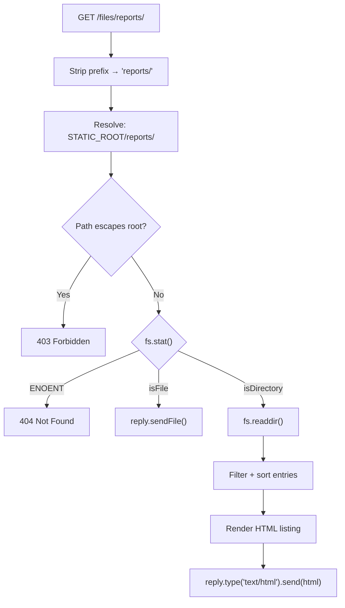

## Directory Listing

### Overview

`@fastify/static` does not support directory listing natively. By default, a request to a directory path either serves a configured index file or returns a 404. Directory listing — rendering an HTML page of directory contents — requires either a separate plugin (`@fastify/autoload` is unrelated; the correct option is `fastify-dirlist` or a manual implementation) or a custom route handler. This topic covers the default behavior, available options that interact with directory resolution, and patterns for implementing directory listing manually or via plugin.

---

### Default Directory Request Behavior

When a request targets a path that resolves to a directory (not a file), `@fastify/static` applies the following resolution sequence:

```
Request: GET /files/
  ↓
Is 'files/' a directory? Yes
  ↓
Is 'index' option set? Yes (default: 'index.html')
  ↓
Does 'files/index.html' exist? 
  → Yes → serve it
  → No  → 404 Not Found
```

No directory listing is rendered at any point in this flow.

```js
await app.register(fastifyStatic, {
  root: path.join(__dirname, 'public'),
  prefix: '/files/',
  // index: 'index.html' (default)
})
```

**Key Points:**
- There is no `list: true` or `autoIndex` option in `@fastify/static`. Directory listing is explicitly not a built-in feature.
- [Inference] This is a deliberate design decision — automatic directory listing is a common source of unintended filesystem exposure in production servers.

---

### `index` Option — Directory Index File

Controls what file is served when a directory path is requested.

```js
await app.register(fastifyStatic, {
  root: path.join(__dirname, 'public'),
  index: 'index.html',         // default
})
```

Multiple fallback candidates:

```js
index: ['index.html', 'index.htm', 'default.html']
```

Resolution attempts each candidate in order. First match is served.

Disable index resolution entirely:

```js
index: false
```

When `index: false`, directory requests return 404 unconditionally — no file is attempted.

**Key Points:**
- `index: false` is required for SPA fallback patterns where a `setNotFoundHandler` must handle all unmatched paths.
- With `index: false`, only exact file paths are resolved. Requesting a directory path never serves a file, even if `index.html` exists in that directory.

---

### `redirect` Option — Directory Trailing Slash

When `redirect: true`, a request to a directory path without a trailing slash is redirected to the trailing-slash form before index resolution.

```js
await app.register(fastifyStatic, {
  root: path.join(__dirname, 'public'),
  redirect: true,
})
```

**Example:**

```
GET /docs         → 301 Redirect → /docs/
GET /docs/        → attempts docs/index.html
```

Without `redirect: true`:

```
GET /docs         → attempts docs as a file → 404 (if no file named 'docs')
```

**Key Points:**
- Without `redirect: true`, a missing trailing slash on a directory request may produce a 404 even if the directory and its index file exist.
- `redirect: true` has no effect on requests that already end with `/`.
- [Inference] Enabling `redirect: true` is advisable when serving multi-page static sites where users or links may omit trailing slashes. Verify that redirect behavior does not conflict with application routes under the same prefix.

---

### Manual Directory Listing Implementation

Since `@fastify/static` does not provide directory listing, it must be implemented manually using Node's `fs` API. The following pattern reads directory contents and renders an HTML response.

```js
import fs from 'fs/promises'
import path from 'path'
import { fileURLToPath } from 'url'
import Fastify from 'fastify'
import fastifyStatic from '@fastify/static'

const __dirname = path.dirname(fileURLToPath(import.meta.url))
const STATIC_ROOT = path.join(__dirname, 'public')

const app = Fastify()

await app.register(fastifyStatic, {
  root: STATIC_ROOT,
  prefix: '/files/',
  serve: true,
  index: false,       // disable index serving — we handle directories manually
  wildcard: false,    // disable wildcard — we register routes manually
})

// Directory listing route
app.get('/files/*', async (req, reply) => {
  const requestedPath = req.params['*'] ?? ''

  // Resolve and validate path — prevent traversal
  const resolved = path.resolve(STATIC_ROOT, requestedPath)
  if (!resolved.startsWith(STATIC_ROOT)) {
    return reply.code(403).send('Forbidden')
  }

  let stat
  try {
    stat = await fs.stat(resolved)
  } catch {
    return reply.code(404).send('Not Found')
  }

  if (!stat.isDirectory()) {
    // Serve the file directly
    return reply.sendFile(requestedPath)
  }

  // Read directory entries
  const entries = await fs.readdir(resolved, { withFileTypes: true })

  const rows = entries
    .map((entry) => {
      const href = `/files/${requestedPath ? requestedPath + '/' : ''}${entry.name}`
      const label = entry.isDirectory() ? `${entry.name}/` : entry.name
      return `<li><a href="${href}">${label}</a></li>`
    })
    .join('\n')

  const html = `<!DOCTYPE html>
<html>
<head><title>Index of /${requestedPath}</title></head>
<body>
  <h1>Index of /${requestedPath}</h1>
  <ul>
    ${requestedPath ? '<li><a href="..">../</a></li>' : ''}
    ${rows}
  </ul>
</body>
</html>`

  return reply.type('text/html').send(html)
})

await app.listen({ port: 3000 })
```

**Key Points:**
- Path traversal check (`resolved.startsWith(STATIC_ROOT)`) is mandatory. Without it, crafted paths like `../../etc/passwd` could escape the static root. [Unverified] This check alone may not be sufficient in all environments — verify against your Node.js version and filesystem.
- `wildcard: false` and `index: false` are set to prevent the static plugin's automatic route from interfering with the manual handler.
- HTML is rendered inline. In production, use a templating engine or a pre-built HTML string with proper escaping of filenames to prevent XSS from malicious filenames.
- [Inference] Filenames containing `<`, `>`, `&`, or `"` characters could inject HTML if not escaped. Sanitize all directory entry names before rendering.

---

### Escaping Directory Entry Names

```js
function escapeHtml(str) {
  return str
    .replace(/&/g, '&amp;')
    .replace(/</g, '&lt;')
    .replace(/>/g, '&gt;')
    .replace(/"/g, '&quot;')
}

const rows = entries.map((entry) => {
  const name = escapeHtml(entry.name)
  const href = escapeHtml(`/files/${requestedPath ? requestedPath + '/' : ''}${entry.name}`)
  const label = entry.isDirectory() ? `${name}/` : name
  return `<li><a href="${href}">${label}</a></li>`
}).join('\n')
```

---

### Using `fastify-dirlist` Plugin

`fastify-dirlist` is a community plugin that adds directory listing to `@fastify/static`. It is not an official Fastify plugin.

```bash
npm install fastify-dirlist
```

```js
import fastifyStatic from '@fastify/static'
import dirlist from 'fastify-dirlist'

await app.register(fastifyStatic, {
  root: path.join(__dirname, 'public'),
  prefix: '/files/',
})

await app.register(dirlist, {
  // fastify-dirlist hooks into @fastify/static's reply decoration
})
```

**Key Points:**
- [Unverified] `fastify-dirlist` compatibility with current `@fastify/static` and Fastify 4.x/5.x versions should be verified before use. Check the plugin's repository for current maintenance status and peer dependency ranges.
- Community plugins are not maintained by the Fastify core team. Audit the source before use in production.
- [Inference] For production use cases, a manual implementation with explicit security controls (path validation, HTML escaping, access control) is advisable over a community plugin of uncertain maintenance status.

---

### Access Control for Directory Listing

If directory listing is exposed, restrict access with a `preHandler` hook:

```js
async function requireAuth(req, reply) {
  const token = req.headers['authorization']
  if (!token || !isValidToken(token)) {
    return reply.code(401).send('Unauthorized')
  }
}

app.get('/files/*', { preHandler: [requireAuth] }, async (req, reply) => {
  // directory listing logic
})
```

**Key Points:**
- Directory listing in production without access control exposes full filesystem structure under the root to any client.
- [Inference] Even with `allowedPath` filtering, directory listing reveals filenames. Access control must be enforced at the route level, not solely via `@fastify/static` options.

---

### Filtering Hidden and System Files

```js
const entries = await fs.readdir(resolved, { withFileTypes: true })

const visible = entries.filter((entry) => {
  // Exclude dotfiles
  if (entry.name.startsWith('.')) return false
  // Exclude system files
  if (entry.name === 'Thumbs.db' || entry.name === 'desktop.ini') return false
  return true
})
```

---

### Sorting Directory Entries

```js
const sorted = entries.sort((a, b) => {
  // Directories first, then files
  if (a.isDirectory() && !b.isDirectory()) return -1
  if (!a.isDirectory() && b.isDirectory()) return 1
  return a.name.localeCompare(b.name)
})
```

---

### Enriched Directory Listing with File Metadata

```js
const entries = await fs.readdir(resolved, { withFileTypes: true })

const enriched = await Promise.all(
  entries.map(async (entry) => {
    const fullPath = path.join(resolved, entry.name)
    const stat = await fs.stat(fullPath)
    return {
      name: entry.name,
      isDir: entry.isDirectory(),
      size: stat.size,
      mtime: stat.mtime,
    }
  })
)

const rows = enriched.map((entry) => {
  const name = escapeHtml(entry.name)
  const size = entry.isDir ? '-' : `${(entry.size / 1024).toFixed(1)} KB`
  const modified = entry.mtime.toUTCString()
  const label = entry.isDir ? `${name}/` : name
  return `<tr>
    <td><a href="${name}">${label}</a></td>
    <td>${size}</td>
    <td>${modified}</td>
  </tr>`
}).join('\n')
```

---

### Directory Resolution Flow



---

### Security Summary

| Risk | Mitigation |
|---|---|
| Path traversal | `path.resolve()` + `startsWith(STATIC_ROOT)` check |
| XSS via filenames | Escape all entry names with `escapeHtml()` |
| Unauthorized access | `preHandler` authentication hook |
| Dotfile exposure | Filter entries starting with `.` |
| Symlink escape | [Unverified] Check whether `fs.stat()` follows symlinks out of root; consider `fs.lstat()` + symlink detection |
| Information disclosure | Restrict listing to intentional directories only; avoid exposing root-level listing |

---

**Related Topics:**
- `index` option and multi-candidate index file resolution
- `redirect` option and trailing slash normalization
- `allowedPath` for path-level access filtering
- `serve: false` and `wildcard: false` for fully manual route control
- `setNotFoundHandler` and SPA fallback patterns
- XSS prevention in server-rendered HTML
- `preHandler` hooks for route-level authentication
- `@fastify/autoload` — auto-registering route files (distinct from directory listing)