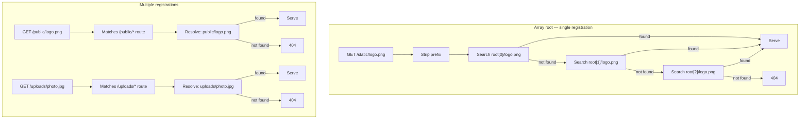
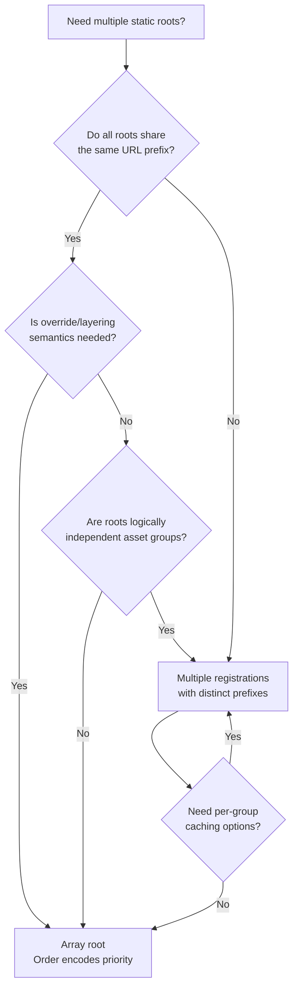

## Multiple Static Roots

### Overview

`@fastify/static` supports serving files from more than one filesystem directory. This is achieved through two distinct mechanisms: passing an array to the `root` option within a single registration, or registering the plugin multiple times with different `root` and `prefix` values. Each mechanism has different semantics, use cases, and interaction with `reply.sendFile()` and decorator scoping. Choosing the wrong mechanism for a given use case is a frequent source of routing and resolution bugs.

---

### Mechanism 1 — Array `root` (Single Registration)

A single plugin registration accepts an array of absolute paths as `root`. All roots share the same `prefix`. File resolution searches each root in order; the first root containing the matching file wins.

```js
await app.register(fastifyStatic, {
  root: [
    path.join(__dirname, 'public'),
    path.join(__dirname, 'assets'),
    path.join(__dirname, 'vendor'),
  ],
  prefix: '/static/',
})
```

**Resolution order for `GET /static/logo.png`:**
1. `public/logo.png` — found → serve, stop
2. `assets/logo.png` — not reached if step 1 matched
3. `vendor/logo.png` — not reached if step 1 or 2 matched

**Key Points:**
- All roots in the array share one `prefix` and one set of caching/header options.
- Files present in multiple roots are always served from the earliest root in the array. Later roots are silently shadowed with no warning or error.
- `reply.sendFile(filename)` resolves against the array in the same order — first root containing the file wins.
- This mechanism registers a single wildcard route (`/static/*`), not one per root.

---

### Mechanism 2 — Multiple Registrations (Different Prefixes)

Register `@fastify/static` once per logical asset group, each with a distinct `root` and `prefix`. Each registration is fully independent — separate caching options, separate URL namespaces.

```js
// First registration — decorates reply
await app.register(fastifyStatic, {
  root: path.join(__dirname, 'public'),
  prefix: '/public/',
})

// Second registration
await app.register(fastifyStatic, {
  root: path.join(__dirname, 'uploads'),
  prefix: '/uploads/',
  decorateReply: false,
})

// Third registration
await app.register(fastifyStatic, {
  root: path.join(__dirname, 'docs'),
  prefix: '/docs/',
  decorateReply: false,
})
```

**Key Points:**
- Each registration creates an independent wildcard route under its prefix.
- `decorateReply: false` is required on all registrations after the first to avoid `FST_ERR_DEC_ALREADY_PRESENT`.
- Independent caching options per registration:

```js
await app.register(fastifyStatic, {
  root: path.join(__dirname, 'dist'),
  prefix: '/assets/',
  maxAge: 31536000000,
  immutable: true,
})

await app.register(fastifyStatic, {
  root: path.join(__dirname, 'uploads'),
  prefix: '/uploads/',
  maxAge: 0,
  decorateReply: false,
})
```

---

### Mechanism Comparison

| Concern | Array `root` | Multiple Registrations |
|---|---|---|
| URL prefix | Shared across all roots | Independent per registration |
| Caching options | Shared across all roots | Independent per registration |
| `decorateReply` | Once, on the single registration | Only on first registration |
| File shadowing | Silent — first root wins | No shadowing — different prefixes |
| Route count | One wildcard route | One wildcard route per registration |
| `reply.sendFile()` resolution | Searches array in order | Resolves against first-registered root unless `altRoot` passed |
| Use case | Layered/override asset resolution | Distinct asset namespaces |

---

### `reply.sendFile()` Across Multiple Roots

`reply.sendFile()` always resolves against the root of the **first registration** that decorated the reply, regardless of which registration's prefix matches the current request URL.

```js
await app.register(fastifyStatic, {
  root: path.join(__dirname, 'public'),   // ← sendFile default root
  prefix: '/public/',
})

await app.register(fastifyStatic, {
  root: path.join(__dirname, 'uploads'),
  prefix: '/uploads/',
  decorateReply: false,
})

app.get('/serve-upload/:file', async (req, reply) => {
  // Resolves against 'public/' — incorrect for uploads
  return reply.sendFile(req.params.file)

  // Correct: explicit altRoot
  return reply.sendFile(req.params.file, path.join(__dirname, 'uploads'))
})
```

**Key Points:**
- Pass an explicit `altRoot` as the second argument to `reply.sendFile()` whenever targeting a non-primary root.
- [Inference] This behavior is counterintuitive in multi-registration setups. Establish a team convention of always passing `altRoot` explicitly in manual route handlers, even for the primary root, to make resolution intent visible in code.

---

### Array Root with `reply.sendFile()`

With array `root`, `reply.sendFile()` searches the same array in order:

```js
await app.register(fastifyStatic, {
  root: [
    path.join(__dirname, 'public'),
    path.join(__dirname, 'assets'),
  ],
  prefix: '/static/',
})

app.get('/manual/:file', async (req, reply) => {
  // Searches public/ first, then assets/
  return reply.sendFile(req.params.file)
})
```

To target a specific root within the array, pass it as `altRoot`:

```js
return reply.sendFile(req.params.file, path.join(__dirname, 'assets'))
```

**Key Points:**
- `altRoot` bypasses the array entirely and resolves only against the specified directory.
- [Inference] When the array is large, `altRoot` may improve resolution performance by avoiding unnecessary filesystem checks, though this is not confirmed by the plugin documentation.

---

### Layered Override Pattern

Array `root` is well-suited for layered asset resolution — environment, tenant, or theme overrides applied on top of a base asset set.

```js
const tenantId = process.env.TENANT_ID ?? 'default'

await app.register(fastifyStatic, {
  root: [
    path.join(__dirname, 'tenants', tenantId),  // tenant-specific overrides
    path.join(__dirname, 'themes', 'base'),      // shared theme assets
    path.join(__dirname, 'public'),              // application defaults
  ],
  prefix: '/static/',
})
```

**Resolution for `GET /static/logo.png`:**
1. `tenants/acme/logo.png` — if exists, serve tenant logo
2. `themes/base/logo.png` — fallback to theme logo
3. `public/logo.png` — fallback to application default

**Key Points:**
- This pattern requires no conditional logic in route handlers — resolution order encodes the override hierarchy.
- [Inference] Tenant directories must exist on disk at registration time or the plugin will throw `ENOENT`. If tenant directories are created dynamically, validate existence before building the `root` array.
- Shadowing is silent. If a tenant file incorrectly shadows a base file, there is no log output. Verify resolution behavior in development with explicit test requests.

---

### Conditional Root Array Construction

Build the `root` array dynamically based on environment or configuration:

```js
const roots = []

if (process.env.TENANT_ASSETS_DIR) {
  roots.push(path.resolve(process.env.TENANT_ASSETS_DIR))
}

if (process.env.NODE_ENV === 'development') {
  roots.push(path.join(__dirname, 'src', 'public'))
}

roots.push(path.join(__dirname, 'public')) // always-present base

await app.register(fastifyStatic, {
  root: roots,
  prefix: '/static/',
})
```

**Key Points:**
- All paths in the array must be absolute and must exist on disk. Validate paths before passing to the plugin.
- `path.resolve()` on an environment variable value converts relative paths to absolute safely.

---

### Encapsulation-Scoped Multiple Roots

Multiple registrations can be scoped using Fastify's plugin encapsulation. Each scope independently registers static routes:

```js
// Admin section — own static assets
await app.register(async (adminScope) => {
  await adminScope.register(fastifyStatic, {
    root: path.join(__dirname, 'admin-assets'),
    prefix: '/assets/',
  })

  adminScope.get('/dashboard', async (req, reply) => {
    return reply.sendFile('dashboard.html')
  })
}, { prefix: '/admin' })

// Public section — own static assets
await app.register(async (publicScope) => {
  await publicScope.register(fastifyStatic, {
    root: path.join(__dirname, 'public-assets'),
    prefix: '/assets/',
    decorateReply: false,
  })
}, { prefix: '/app' })
```

Effective routes:
```
GET /admin/assets/*  → admin-assets/
GET /app/assets/*    → public-assets/
```

**Key Points:**
- Both scopes use `prefix: '/assets/'` but compose with different encapsulation prefixes, producing distinct effective routes.
- `decorateReply: false` is still required on the second registration even across scopes, because decorators in Fastify propagate to child scopes from ancestors. [Inference] If both registrations are in sibling scopes (neither is an ancestor of the other), the decorator collision may not occur — but this should be verified empirically, as scope isolation behavior depends on plugin registration order and Fastify's internal plugin graph.

---

### Serving User Uploads Alongside Application Assets

A common production pattern separates application assets (versioned, immutable) from user-uploaded content (dynamic, no caching):

```js
await app.register(fastifyStatic, {
  root: path.join(__dirname, 'dist'),
  prefix: '/assets/',
  maxAge: 31536000000,
  immutable: true,
})

await app.register(fastifyStatic, {
  root: path.join(__dirname, 'uploads'),
  prefix: '/uploads/',
  maxAge: 0,
  etag: true,
  decorateReply: false,
})
```

**Key Points:**
- Application assets under `/assets/` are cached aggressively — content-hashed filenames mean stale cache is never an issue.
- User uploads under `/uploads/` are never cached client-side — content is dynamic and identity-linked.
- [Inference] User upload directories should not share a root with application assets. A path conflict (e.g., a user uploading a file named `app.js`) could shadow application files in an array-root setup. Use separate registrations with distinct prefixes.

---

### Resolution Diagram — Array Root vs Multiple Registrations



---

### Common Errors and Causes

| Error | Cause | Fix |
|---|---|---|
| `ENOENT` at registration | A path in the `root` array does not exist | Validate all paths before building the array |
| `FST_ERR_DEC_ALREADY_PRESENT` | `decorateReply: true` on a second registration | Set `decorateReply: false` on all registrations after the first |
| `reply.sendFile()` resolves wrong file | Resolving against first-registered root, not intended root | Pass explicit `altRoot` as second argument |
| Silent wrong file served | Array root shadowing — earlier root has a file with same name | Audit overlapping filenames; reorder array or use separate registrations |
| Route not matched | Encapsulation prefix + plugin prefix not composing as expected | Inspect with `app.printRoutes()`; check scope nesting |

---

### Choosing Between Mechanisms — Decision Guide



---

**Related Topics:**
- `decorateReply` scoping and `FST_ERR_DEC_ALREADY_PRESENT` resolution
- `reply.sendFile()` `altRoot` argument — per-call root override
- `prefix` composition with Fastify encapsulation scopes
- Layered asset resolution for multi-tenant applications
- Separating user upload serving from application asset serving
- `allowedPath` filtering per registration
- `app.printRoutes()` for debugging composed route trees
- Per-registration cache header configuration