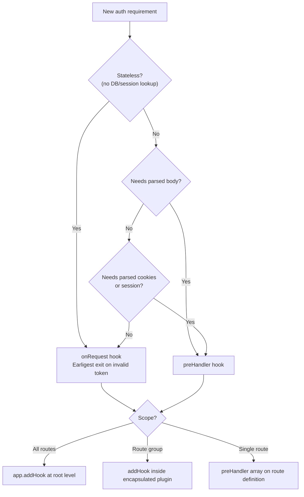

## Authentication Strategies Overview

### Overview

Fastify has no built-in authentication system. Authentication is implemented through a combination of plugins, hooks, and decorators. The ecosystem provides well-maintained official and community plugins covering the most common strategies: API keys, HTTP Basic, session-based, JWT, and OAuth2. All strategies integrate with Fastify's `preHandler` or `onRequest` hook pipeline and Fastify's decorator system for attaching identity context to requests.

---

### Core Integration Points

Before covering individual strategies, understanding where authentication logic attaches in Fastify is necessary.

#### Hooks

| Hook | Stage | Typical Use |
|---|---|---|
| `onRequest` | Earliest — before body parsing | Token extraction, IP allowlisting |
| `preParsing` | Before body is parsed | Rarely used for auth |
| `preHandler` | After parsing, before handler | Most auth logic, session validation |

```js
// Route-level preHandler
app.get('/protected', {
  preHandler: [authenticate],
}, async (req, reply) => {
  return { user: req.user }
})

// Global onRequest hook
app.addHook('onRequest', async (req, reply) => {
  // runs for every request
})
```

**Key Points:**
- `onRequest` fires before the body is read — safe for stateless token checks that do not need body content.
- `preHandler` fires after body parsing — use when authentication depends on body content (rare) or when plugins that require parsed state must run first.
- [Inference] Prefer `onRequest` for stateless strategies (JWT, API key) to exit the pipeline as early as possible on invalid requests, avoiding body parsing overhead.

#### Decorators

Request decorators attach identity context for downstream handlers:

```js
app.decorateRequest('user', null)

app.addHook('onRequest', async (req, reply) => {
  req.user = await resolveUser(req.headers.authorization)
})

app.get('/me', async (req, reply) => {
  return req.user
})
```

**Key Points:**
- Decorators must be declared before use. Calling `decorateRequest` after the hook or route that uses `req.user` will throw.
- Initialize with `null` (not `undefined`) for object-type decorators to satisfy Fastify's internal checks.

---

### Strategy 1 — API Key Authentication

The simplest stateless strategy. A secret key is passed in a request header (commonly `x-api-key` or `Authorization: Bearer`). The server validates the key against a known set.

```js
const VALID_KEYS = new Set(process.env.API_KEYS?.split(',') ?? [])

app.decorateRequest('apiKey', null)

async function apiKeyAuth(req, reply) {
  const key = req.headers['x-api-key']
  if (!key || !VALID_KEYS.has(key)) {
    return reply.code(401).send({ error: 'Unauthorized' })
  }
  req.apiKey = key
}

app.get('/data', { preHandler: [apiKeyAuth] }, async (req, reply) => {
  return { data: 'protected' }
})
```

**Key Points:**
- Key comparison should be constant-time to resist timing attacks. JavaScript's `===` is not constant-time. For sensitive applications, use `crypto.timingSafeEqual()`:

```js
import { timingSafeEqual, createHash } from 'crypto'

function safeCompare(a, b) {
  const ha = createHash('sha256').update(a).digest()
  const hb = createHash('sha256').update(b).digest()
  return ha.length === hb.length && timingSafeEqual(ha, hb)
}
```

- Store API keys hashed at rest. Compare against the hash, not plaintext.
- [Inference] API key authentication is appropriate for server-to-server communication. It is not appropriate as the sole mechanism for user-facing clients where key exposure is likely.

---

### Strategy 2 — HTTP Basic Authentication

Credentials are base64-encoded in the `Authorization: Basic <base64(user:pass)>` header. `@fastify/basic-auth` provides a plugin wrapper.

```bash
npm install @fastify/basic-auth
```

```js
import basicAuth from '@fastify/basic-auth'

await app.register(basicAuth, {
  validate: async (username, password, req, reply) => {
    // Return undefined to allow, throw/return error to deny
    if (username !== 'admin' || password !== 'secret') {
      return new Error('Invalid credentials')
    }
  },
  authenticate: { realm: 'MyApp' },
})

app.get('/admin', {
  onRequest: app.basicAuth,
}, async (req, reply) => {
  return { status: 'ok' }
})
```

**Key Points:**
- HTTP Basic transmits credentials on every request. Use only over HTTPS.
- `authenticate: { realm: '...' }` causes the plugin to send `WWW-Authenticate: Basic realm="MyApp"` on 401 responses, prompting browser credential dialogs.
- [Inference] HTTP Basic is suitable for internal tools, development environments, or simple admin interfaces. It is not appropriate for consumer-facing applications — there is no session, no logout mechanism, and credentials are re-sent on every request.

---

### Strategy 3 — Session-Based Authentication

A session identifier is stored in a cookie. The server maintains session state (in-memory, Redis, database). `@fastify/session` (or `@fastify/secure-session`) handles session management. `@fastify/cookie` is a required peer.

```bash
npm install @fastify/cookie @fastify/session
```

```js
import fastifyCookie from '@fastify/cookie'
import fastifySession from '@fastify/session'

await app.register(fastifyCookie)

await app.register(fastifySession, {
  secret: process.env.SESSION_SECRET, // min 32 characters
  cookie: {
    secure: process.env.NODE_ENV === 'production',
    httpOnly: true,
    sameSite: 'lax',
    maxAge: 86400, // seconds
  },
  saveUninitialized: false,
})

// Login route
app.post('/login', async (req, reply) => {
  const { username, password } = req.body
  const user = await validateCredentials(username, password)
  if (!user) return reply.code(401).send({ error: 'Invalid credentials' })

  req.session.userId = user.id
  return { ok: true }
})

// Auth guard
async function requireSession(req, reply) {
  if (!req.session.userId) {
    return reply.code(401).send({ error: 'Unauthorized' })
  }
}

app.get('/profile', { preHandler: [requireSession] }, async (req, reply) => {
  const user = await getUserById(req.session.userId)
  return user
})

// Logout
app.post('/logout', async (req, reply) => {
  await req.session.destroy()
  return { ok: true }
})
```

**Key Points:**
- `secure: true` must be set in production — session cookies over HTTP are trivially hijacked.
- `httpOnly: true` prevents JavaScript from reading the cookie — mitigates XSS-based session theft.
- `sameSite: 'lax'` mitigates CSRF for most use cases. Use `'strict'` for higher security; use `'none'` (with `secure: true`) only when cross-site cookie sharing is required (e.g., embedded widgets).
- `@fastify/session` stores sessions in-memory by default. In-memory sessions are lost on restart and cannot be shared across multiple server instances. Use a store adapter (e.g., `connect-redis`) for production:

```js
import { RedisStore } from 'connect-redis'
import { createClient } from 'redis'

const redisClient = createClient()
await redisClient.connect()

await app.register(fastifySession, {
  secret: process.env.SESSION_SECRET,
  store: new RedisStore({ client: redisClient }),
  cookie: { secure: true, httpOnly: true },
})
```

- [Inference] Session-based auth is appropriate for traditional web applications with server-rendered pages. For APIs consumed by non-browser clients, JWT is more portable.

---

### Strategy 4 — JWT Authentication

A signed token encodes user identity claims. The server signs tokens on login; clients include the token in subsequent requests. `@fastify/jwt` wraps the `fast-jwt` library.

```bash
npm install @fastify/jwt
```

```js
import fastifyJwt from '@fastify/jwt'

await app.register(fastifyJwt, {
  secret: process.env.JWT_SECRET,
})

app.decorateRequest('user', null)

// Login — issue token
app.post('/login', async (req, reply) => {
  const { username, password } = req.body
  const user = await validateCredentials(username, password)
  if (!user) return reply.code(401).send({ error: 'Invalid credentials' })

  const token = await reply.jwtSign(
    { sub: user.id, role: user.role },
    { expiresIn: '1h' }
  )
  return { token }
})

// Auth guard
async function requireJwt(req, reply) {
  try {
    await req.jwtVerify()
    req.user = req.user // jwtVerify populates req.user with decoded payload
  } catch (err) {
    return reply.code(401).send({ error: 'Unauthorized' })
  }
}

app.get('/me', { onRequest: [requireJwt] }, async (req, reply) => {
  return req.user
})
```

**Key Points:**
- `req.jwtVerify()` verifies signature and expiry, and populates `req.user` with the decoded payload. [Unverified] Exact population behavior depends on `@fastify/jwt` version — verify in your version's documentation.
- JWT secrets should be long, random, and stored in environment variables — never hardcoded.
- Use RS256 (asymmetric) over HS256 (symmetric) when multiple services need to verify tokens without sharing the signing secret:

```js
await app.register(fastifyJwt, {
  secret: {
    private: fs.readFileSync('./private.key'),
    public: fs.readFileSync('./public.key'),
  },
  sign: { algorithm: 'RS256' },
})
```

- JWTs cannot be invalidated server-side before expiry without a token blocklist (e.g., storing revoked JTIs in Redis). A short `expiresIn` (15m–1h) limits the damage window for compromised tokens.
- [Inference] Store JWTs in `httpOnly` cookies rather than `localStorage` for browser clients. `localStorage` is accessible to JavaScript and is vulnerable to XSS. Cookie-stored JWTs are not accessible to JavaScript but require CSRF protection.

#### Access and Refresh Token Pattern

```js
// Issue short-lived access token + long-lived refresh token
app.post('/login', async (req, reply) => {
  const user = await validateCredentials(req.body.username, req.body.password)
  if (!user) return reply.code(401).send({ error: 'Invalid credentials' })

  const accessToken = await reply.jwtSign({ sub: user.id }, { expiresIn: '15m' })
  const refreshToken = await reply.jwtSign({ sub: user.id, type: 'refresh' }, { expiresIn: '14d' })

  reply.setCookie('refreshToken', refreshToken, {
    httpOnly: true,
    secure: true,
    sameSite: 'strict',
    path: '/auth/refresh',
  })

  return { accessToken }
})

// Refresh endpoint
app.post('/auth/refresh', async (req, reply) => {
  const refreshToken = req.cookies.refreshToken
  if (!refreshToken) return reply.code(401).send({ error: 'No refresh token' })

  try {
    const payload = await req.jwtVerify({ onlyCookie: false })
    if (payload.type !== 'refresh') throw new Error('Invalid token type')

    const accessToken = await reply.jwtSign({ sub: payload.sub }, { expiresIn: '15m' })
    return { accessToken }
  } catch {
    return reply.code(401).send({ error: 'Invalid refresh token' })
  }
})
```

---

### Strategy 5 — OAuth2 / OpenID Connect

Delegates authentication to an external provider (Google, GitHub, Okta, Auth0, etc.). `@fastify/oauth2` implements the OAuth2 authorization code flow.

```bash
npm install @fastify/oauth2
```

```js
import fastifyOauth2 from '@fastify/oauth2'

await app.register(fastifyOauth2, {
  name: 'googleOAuth2',
  scope: ['profile', 'email'],
  credentials: {
    client: {
      id: process.env.GOOGLE_CLIENT_ID,
      secret: process.env.GOOGLE_CLIENT_SECRET,
    },
    auth: fastifyOauth2.GOOGLE_CONFIGURATION,
  },
  startRedirectPath: '/auth/google',
  callbackUri: 'https://myapp.com/auth/google/callback',
})

// Callback route — exchange code for token
app.get('/auth/google/callback', async (req, reply) => {
  const { token } = await app.googleOAuth2.getAccessTokenFromAuthorizationCodeFlow(req)

  // Fetch user profile from provider
  const profile = await fetch('https://www.googleapis.com/oauth2/v2/userinfo', {
    headers: { Authorization: `Bearer ${token.access_token}` },
  }).then(r => r.json())

  // Upsert user in database, create local session or JWT
  const user = await upsertUser({ email: profile.email, name: profile.name })
  req.session.userId = user.id

  return reply.redirect('/dashboard')
})
```

**Key Points:**
- `@fastify/oauth2` handles redirect construction and authorization code exchange. It does not manage sessions — after token exchange, persist identity via session or JWT using the patterns above.
- `callbackUri` must exactly match the redirect URI registered with the OAuth2 provider.
- [Inference] OpenID Connect (OIDC) providers return an `id_token` (a JWT) alongside the access token. Verifying and decoding the `id_token` gives user claims without a separate profile API call. Verify OIDC token handling against your provider's documentation.
- State parameter (CSRF protection for OAuth2 flows) is handled automatically by `@fastify/oauth2`. [Unverified] Confirm state validation behavior in your installed version.

---

### Composing Multiple Strategies

Multiple strategies can coexist. Route-level `preHandler` selects the applicable strategy:

```js
// API routes — JWT
app.register(async (apiScope) => {
  apiScope.addHook('onRequest', requireJwt)

  apiScope.get('/users', async (req, reply) => {
    return getUsers()
  })
}, { prefix: '/api' })

// Admin routes — session
app.register(async (adminScope) => {
  adminScope.addHook('preHandler', requireSession)

  adminScope.get('/admin/dashboard', async (req, reply) => {
    return getDashboard()
  })
}, { prefix: '/admin' })

// Webhook routes — API key
app.post('/webhooks/stripe', {
  onRequest: [apiKeyAuth],
}, async (req, reply) => {
  return handleWebhook(req.body)
})
```

**Key Points:**
- Scoped hooks (`addHook` inside an encapsulated plugin) apply only within that scope.
- Global hooks (`app.addHook` at root level) apply to all routes. Avoid global auth hooks unless all routes require authentication.
- [Inference] A common pattern is to apply a global `onRequest` hook that attempts token extraction and sets `req.user` if a token is present, without rejecting the request. Route-level `preHandler` then enforces the requirement:

```js
// Global — extract if present, do not reject
app.addHook('onRequest', async (req) => {
  try {
    await req.jwtVerify()
  } catch {
    // No valid token — req.user remains null
  }
})

// Route — enforce
async function requireAuth(req, reply) {
  if (!req.user) return reply.code(401).send({ error: 'Unauthorized' })
}
```

---

### Plugin Summary

| Strategy | Plugin | Notes |
|---|---|---|
| API Key | None (manual) | Implement with hook + `crypto.timingSafeEqual` |
| HTTP Basic | `@fastify/basic-auth` | Official plugin |
| Session | `@fastify/session` + `@fastify/cookie` | Requires store for production |
| Secure Session | `@fastify/secure-session` | Stateless encrypted cookie alternative to `@fastify/session` |
| JWT | `@fastify/jwt` | Official plugin; wraps `fast-jwt` |
| OAuth2 | `@fastify/oauth2` | Official plugin; handles authorization code flow |
| Passport.js | `@fastify/passport` | Official plugin; wraps Passport strategy ecosystem |

---

### Hook Placement Decision Guide



---

**Related Topics:**
- `@fastify/jwt` — full configuration, asymmetric keys, cookie mode
- `@fastify/session` and `@fastify/secure-session` — differences and store adapters
- `@fastify/passport` — integrating Passport.js strategies
- `@fastify/oauth2` — provider configuration, PKCE, token refresh
- CSRF protection with `@fastify/csrf-protection`
- Role-based access control (RBAC) with request decorators
- `@fastify/rate-limit` — brute-force mitigation for auth endpoints
- Token revocation and JWT blocklist patterns with Redis
- `preHandler` vs `onRequest` — performance implications