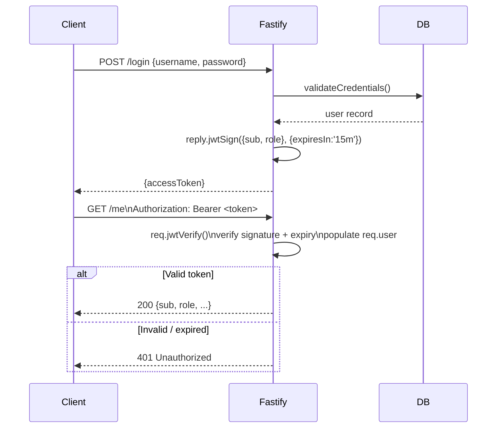
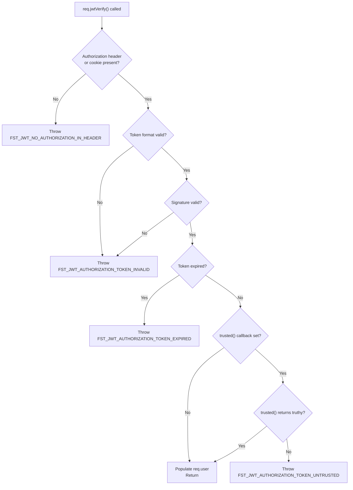

## JWT Authentication with @fastify/jwt

### Overview

`@fastify/jwt` is the official Fastify plugin for JSON Web Token authentication. It wraps `fast-jwt` and decorates the Fastify instance with `app.jwt`, and request/reply objects with `req.jwtVerify()` and `reply.jwtSign()`. It supports symmetric (HS256, HS384, HS512) and asymmetric (RS256, ES256, etc.) algorithms, cookie-mode token storage, multiple secrets, token decoration, and namespace-scoped multi-instance registration.

---

### Installation

```bash
npm install @fastify/jwt
```

Requires Fastify 4.x or 5.x. `@fastify/jwt` v8.x targets Fastify 5.x; v7.x targets Fastify 4.x. Verify peer dependency ranges with `npm info @fastify/jwt peerDependencies`.

---

### Basic Registration — Symmetric Secret

```js
import Fastify from 'fastify'
import fastifyJwt from '@fastify/jwt'

const app = Fastify()

await app.register(fastifyJwt, {
  secret: process.env.JWT_SECRET, // min 32 characters for HS256
})
```

**Key Points:**
- `secret` is required. Passing an empty string or short secret does not throw at registration — it produces weak tokens. Use a minimum of 32 random bytes for HS256.
- Generate a suitable secret: `node -e "console.log(require('crypto').randomBytes(32).toString('hex'))"`
- [Inference] Hardcoding secrets in source is a critical security risk. Always source from environment variables or a secrets manager (Vault, AWS Secrets Manager, etc.).

---

### Decorators Added by Registration

| Decorator | Location | Purpose |
|---|---|---|
| `app.jwt` | Fastify instance | Access to `sign`, `verify`, `decode` directly |
| `reply.jwtSign(payload, options?)` | Reply | Sign and serialize a JWT |
| `req.jwtVerify(options?)` | Request | Verify incoming token; populate `req.user` |
| `req.jwtDecode(options?)` | Request | Decode without verification |

---

### Signing Tokens — `reply.jwtSign()`

```js
app.post('/login', async (req, reply) => {
  const { username, password } = req.body
  const user = await validateCredentials(username, password)
  if (!user) return reply.code(401).send({ error: 'Invalid credentials' })

  const token = await reply.jwtSign(
    { sub: user.id, role: user.role, email: user.email },
    { expiresIn: '1h' }
  )

  return { token }
})
```

**Key Points:**
- `reply.jwtSign(payload, options)` is async. Always `await` it.
- The payload is the JWT claims object. Standard claims (`sub`, `iss`, `aud`, `exp`, `iat`, `jti`) have defined semantics per RFC 7519.
- `expiresIn` accepts a number (seconds) or a string (`'15m'`, `'1h'`, `'7d'`).
- `iat` (issued at) is added automatically.
- Do not include sensitive data (passwords, raw PII) in the payload — JWTs are base64-encoded, not encrypted. Anyone with the token can decode the payload.

#### Signing Directly via `app.jwt.sign()`

```js
const token = app.jwt.sign(
  { sub: user.id },
  { expiresIn: 3600 }
)
// Synchronous when using HS* algorithms with fast-jwt
```

**Key Points:**
- `app.jwt.sign()` may be synchronous or asynchronous depending on the algorithm and `fast-jwt` configuration. [Unverified] Confirm sync/async behavior for your algorithm in your installed version.
- `reply.jwtSign()` is always async and integrates with Fastify's reply lifecycle — prefer it in route handlers.

---

### Verifying Tokens — `req.jwtVerify()`

```js
async function authenticate(req, reply) {
  try {
    await req.jwtVerify()
  } catch (err) {
    return reply.code(401).send({ error: 'Unauthorized', message: err.message })
  }
}

app.get('/me', { onRequest: [authenticate] }, async (req, reply) => {
  return req.user // populated by jwtVerify()
})
```

**Key Points:**
- `req.jwtVerify()` extracts the token from the `Authorization: Bearer <token>` header by default, verifies signature and expiry, and populates `req.user` with the decoded payload.
- On failure, `jwtVerify()` throws. Always wrap in `try/catch` or handle via Fastify's error handler.
- `req.user` is populated only after a successful `jwtVerify()` call. Accessing it before verification returns `null` (or the decorator's initial value).

#### Token Extraction Sources

By default, tokens are extracted from the `Authorization` header. Configure alternate or additional sources:

```js
await app.register(fastifyJwt, {
  secret: process.env.JWT_SECRET,
  // Extract from cookie named 'token' as fallback
  cookie: {
    cookieName: 'token',
    signed: false,
  },
})
```

With cookie mode enabled, `req.jwtVerify()` checks the `Authorization` header first, then the cookie. Requires `@fastify/cookie` to be registered before `@fastify/jwt`.

---

### `req.user` Population and Decoration

`@fastify/jwt` automatically decorates `req.user` with the decoded payload after `jwtVerify()`. The decorator is added at plugin registration; it does not need to be declared manually.

```js
// After req.jwtVerify():
console.log(req.user)
// { sub: '123', role: 'admin', email: 'user@example.com', iat: 1700000000, exp: 1700003600 }
```

#### Transforming the Decoded Payload

Use the `decoratorName` option to rename `req.user`, or use `trusted` to transform the payload before assignment:

```js
await app.register(fastifyJwt, {
  secret: process.env.JWT_SECRET,
  decoratorName: 'identity', // req.identity instead of req.user
})
```

To augment or transform the payload during verification:

```js
await app.register(fastifyJwt, {
  secret: process.env.JWT_SECRET,
  trusted: async (request, decodedToken) => {
    // Return falsy to reject; return the token or a modified object to accept
    const user = await db.users.findById(decodedToken.sub)
    if (!user || user.tokenVersion !== decodedToken.version) return false
    return decodedToken
  },
})
```

**Key Points:**
- `trusted` runs on every `jwtVerify()` call. Keep it fast — database lookups here add latency to every authenticated request.
- [Inference] `trusted` is the correct hook for token revocation via a version counter stored in the database, without maintaining a full token blocklist.

---

### Algorithm Configuration

#### Symmetric — HS256 (Default)

```js
await app.register(fastifyJwt, {
  secret: process.env.JWT_SECRET,
  sign: { algorithm: 'HS256' }, // default
})
```

#### Asymmetric — RS256

Use when multiple services need to verify tokens without sharing the signing secret. The signing service holds the private key; verifying services hold only the public key.

```js
import fs from 'fs'

await app.register(fastifyJwt, {
  secret: {
    private: fs.readFileSync('./keys/private.pem'),
    public: fs.readFileSync('./keys/public.pem'),
  },
  sign: { algorithm: 'RS256' },
})
```

Generate RSA key pair:
```bash
openssl genrsa -out private.pem 2048
openssl rsa -in private.pem -pubout -out public.pem
```

#### Asymmetric — ES256 (ECDSA)

Shorter keys and signatures than RSA for equivalent security:

```bash
openssl ecparam -name prime256v1 -genkey -noout -out ec-private.pem
openssl ec -in ec-private.pem -pubout -out ec-public.pem
```

```js
await app.register(fastifyJwt, {
  secret: {
    private: fs.readFileSync('./keys/ec-private.pem'),
    public: fs.readFileSync('./keys/ec-public.pem'),
  },
  sign: { algorithm: 'ES256' },
})
```

**Key Points:**
- HS256 is appropriate for monolithic applications or when all services share the secret securely.
- RS256/ES256 is appropriate for microservice architectures where token issuance and verification are separated.
- [Inference] ES256 produces smaller tokens and faster operations than RS256 at equivalent security levels, though operational familiarity with RSA is more widespread. Choose based on your team's tooling and key management infrastructure.

---

### Global Registration Options

```js
await app.register(fastifyJwt, {
  secret: process.env.JWT_SECRET,

  // Default sign options applied to all reply.jwtSign() calls
  sign: {
    algorithm: 'HS256',
    expiresIn: '1h',
    issuer: 'myapp',
    audience: 'myapp-client',
  },

  // Default verify options applied to all req.jwtVerify() calls
  verify: {
    issuer: 'myapp',
    audience: 'myapp-client',
    allowedSub: undefined,
  },

  // Decoder options (fast-jwt)
  decode: {
    complete: false, // if true, returns { header, payload, signature }
  },
})
```

**Key Points:**
- `issuer` and `audience` claims add an extra layer of validation — tokens issued for a different service are rejected even if the signature is valid.
- Per-call options passed to `reply.jwtSign(payload, options)` or `req.jwtVerify(options)` override global defaults for that call only.

---

### Access and Refresh Token Pattern

```js
await app.register(fastifyJwt, {
  secret: process.env.JWT_SECRET,
})

await app.register(fastifyCookie)

app.post('/login', async (req, reply) => {
  const user = await validateCredentials(req.body.username, req.body.password)
  if (!user) return reply.code(401).send({ error: 'Invalid credentials' })

  // Short-lived access token
  const accessToken = await reply.jwtSign(
    { sub: user.id, role: user.role },
    { expiresIn: '15m' }
  )

  // Long-lived refresh token
  const refreshToken = await reply.jwtSign(
    { sub: user.id, type: 'refresh', version: user.tokenVersion },
    { expiresIn: '14d' }
  )

  // Store refresh token in httpOnly cookie
  reply.setCookie('refreshToken', refreshToken, {
    httpOnly: true,
    secure: process.env.NODE_ENV === 'production',
    sameSite: 'strict',
    path: '/auth/refresh',   // scope cookie to refresh endpoint only
    maxAge: 60 * 60 * 24 * 14,
  })

  return { accessToken }
})

app.post('/auth/refresh', async (req, reply) => {
  const refreshToken = req.cookies?.refreshToken
  if (!refreshToken) return reply.code(401).send({ error: 'No refresh token' })

  let payload
  try {
    payload = await req.jwtVerify({ onlyCookie: true })
  } catch {
    return reply.code(401).send({ error: 'Invalid refresh token' })
  }

  if (payload.type !== 'refresh') {
    return reply.code(401).send({ error: 'Invalid token type' })
  }

  const user = await db.users.findById(payload.sub)
  if (!user || user.tokenVersion !== payload.version) {
    return reply.code(401).send({ error: 'Token revoked' })
  }

  const accessToken = await reply.jwtSign(
    { sub: user.id, role: user.role },
    { expiresIn: '15m' }
  )

  return { accessToken }
})

app.post('/auth/logout', async (req, reply) => {
  reply.clearCookie('refreshToken', { path: '/auth/refresh' })
  return { ok: true }
})
```

**Key Points:**
- Access tokens are short-lived (15m) and stored in memory on the client (not in a cookie) to reduce CSRF risk when sent in the `Authorization` header.
- Refresh tokens are long-lived, stored in `httpOnly` cookies scoped to `/auth/refresh`, inaccessible to JavaScript.
- `path: '/auth/refresh'` scopes the cookie so it is not sent on every request — only when the client calls the refresh endpoint.
- `tokenVersion` in the database enables instant refresh token revocation by incrementing the version — issued refresh tokens with an old version are rejected by the `trusted` check or explicit comparison.
- [Inference] This pattern does not prevent access token misuse during the 15-minute window after revocation. For stricter revocation, use a Redis blocklist indexed by `jti` (JWT ID claim).

---

### Token Revocation with Redis Blocklist

```js
import { createClient } from 'redis'

const redis = createClient()
await redis.connect()

await app.register(fastifyJwt, {
  secret: process.env.JWT_SECRET,
  sign: { expiresIn: '1h', jwtid: () => crypto.randomUUID() }, // add jti
  trusted: async (req, decodedToken) => {
    if (!decodedToken.jti) return false
    const revoked = await redis.get(`blocklist:${decodedToken.jti}`)
    return !revoked
  },
})

// Revoke a token
app.post('/auth/revoke', { onRequest: [authenticate] }, async (req, reply) => {
  const { jti, exp } = req.user
  const ttl = exp - Math.floor(Date.now() / 1000)
  if (ttl > 0) {
    await redis.setEx(`blocklist:${jti}`, ttl, '1')
  }
  return { ok: true }
})
```

**Key Points:**
- `jti` (JWT ID) uniquely identifies each token. Store revoked JTIs in Redis with a TTL matching the token's remaining lifetime — entries expire automatically when the token would have expired anyway.
- The `trusted` callback runs on every `jwtVerify()`. A Redis lookup adds ~1ms latency per request. [Inference] For high-throughput APIs, this overhead is acceptable. For extremely latency-sensitive paths, evaluate whether token revocation is required for all routes or only sensitive ones.
- [Unverified] The `jwtid` sign option behavior — whether it accepts a function — should be verified against your installed `@fastify/jwt` version. Alternatively, add `jti` manually to the payload: `{ sub: user.id, jti: crypto.randomUUID() }`.

---

### Multiple JWT Instances — Namespacing

Register `@fastify/jwt` multiple times using `namespace` to support multiple token types (e.g., access vs refresh with different secrets or algorithms):

```js
await app.register(fastifyJwt, {
  secret: process.env.ACCESS_SECRET,
  namespace: 'access',
  jwtVerify: 'accessVerify',
  jwtSign: 'accessSign',
})

await app.register(fastifyJwt, {
  secret: process.env.REFRESH_SECRET,
  namespace: 'refresh',
  jwtVerify: 'refreshVerify',
  jwtSign: 'refreshSign',
})

app.post('/login', async (req, reply) => {
  const user = await validateCredentials(req.body.username, req.body.password)

  const accessToken = await reply.accessSign({ sub: user.id }, { expiresIn: '15m' })
  const refreshToken = await reply.refreshSign({ sub: user.id }, { expiresIn: '14d' })

  return { accessToken, refreshToken }
})

app.get('/protected', async (req, reply) => {
  await req.accessVerify()
  return req.user
})
```

**Key Points:**
- `namespace` isolates the `app.jwt` instance. `jwtVerify` and `jwtSign` override the method names added to `req` and `reply`.
- Each namespace can have independent secrets, algorithms, and sign/verify defaults.
- [Inference] Namespaced registration is preferable to the single-registration access/refresh pattern for projects that require strict secret isolation between token types.

---

### Cookie Mode

Store and verify JWTs in cookies rather than the `Authorization` header:

```js
import fastifyCookie from '@fastify/cookie'

await app.register(fastifyCookie)

await app.register(fastifyJwt, {
  secret: process.env.JWT_SECRET,
  cookie: {
    cookieName: 'accessToken',
    signed: false,
  },
})

app.post('/login', async (req, reply) => {
  const user = await validateCredentials(req.body.username, req.body.password)
  const token = await reply.jwtSign({ sub: user.id }, { expiresIn: '15m' })

  reply.setCookie('accessToken', token, {
    httpOnly: true,
    secure: true,
    sameSite: 'strict',
    path: '/',
  })

  return { ok: true }
})

// jwtVerify() reads from cookie automatically when Authorization header is absent
app.get('/me', { onRequest: [authenticate] }, async (req, reply) => {
  return req.user
})
```

**Key Points:**
- `@fastify/cookie` must be registered before `@fastify/jwt` when using cookie mode.
- `signed: true` uses `@fastify/cookie`'s cookie signing — adds an HMAC signature to detect tampering. [Unverified] Behavior with `signed: true` in combination with JWT signature verification should be tested in your version.
- Cookie-stored JWTs require CSRF protection since cookies are sent automatically by browsers on cross-origin requests. Use `sameSite: 'strict'` or `'lax'` and pair with `@fastify/csrf-protection` for sensitive mutations.

---

### Error Handling

`@fastify/jwt` throws typed errors on verification failure:

| Error code | Cause |
|---|---|
| `FST_JWT_NO_AUTHORIZATION_IN_HEADER` | No `Authorization` header present |
| `FST_JWT_AUTHORIZATION_TOKEN_INVALID` | Malformed token |
| `FST_JWT_AUTHORIZATION_TOKEN_EXPIRED` | Token past `exp` claim |
| `FST_JWT_AUTHORIZATION_TOKEN_UNTRUSTED` | `trusted` callback returned falsy |

Handle globally via Fastify's error handler:

```js
app.setErrorHandler((err, req, reply) => {
  if (err.statusCode === 401) {
    return reply.code(401).send({ error: 'Unauthorized', code: err.code })
  }
  reply.send(err)
})
```

Or per-route:

```js
async function authenticate(req, reply) {
  try {
    await req.jwtVerify()
  } catch (err) {
    const code = err.code ?? 'FST_JWT_ERROR'
    return reply.code(401).send({ error: 'Unauthorized', code })
  }
}
```

---

### JWT Lifecycle Diagram



---

### Token Verification Flow



---

### Security Checklist

| Concern | Mitigation |
|---|---|
| Weak secret | Use `crypto.randomBytes(32)` minimum for HS256 |
| Secret in source | Source from environment variable or secrets manager |
| Long-lived tokens | Set short `expiresIn` (15m–1h for access tokens) |
| No revocation | Use `trusted` callback with Redis blocklist or version counter |
| XSS token theft | Store in `httpOnly` cookie, not `localStorage` |
| CSRF on cookie auth | `sameSite: 'strict'` + `@fastify/csrf-protection` |
| Sensitive payload data | Never include passwords or unmasked PII in claims |
| Algorithm confusion | Set `algorithm` explicitly; do not accept `none` |
| Multi-service secrets | Use RS256/ES256 asymmetric keys |

---

**Related Topics:**
- `@fastify/oauth2` — delegating authentication to external providers
- `@fastify/csrf-protection` — CSRF defense for cookie-mode JWT
- `@fastify/secure-session` — stateless encrypted cookie sessions as JWT alternative
- `@fastify/rate-limit` — brute-force protection for `/login` and `/auth/refresh`
- `trusted` callback patterns — token versioning and database-backed revocation
- Redis-backed JWT blocklist implementation
- RS256 key rotation strategies
- JWKS (JSON Web Key Sets) endpoint for public key distribution
- Role-based access control using JWT claims