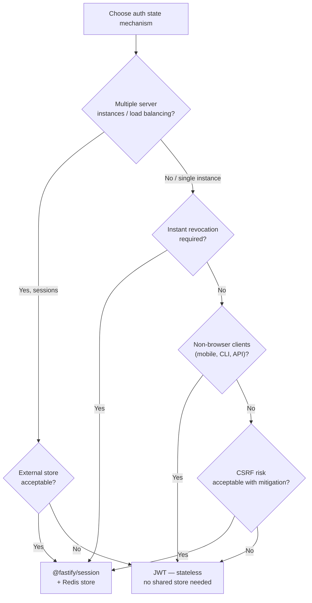

## Session-Based Authentication with @fastify/session

### Overview

`@fastify/session` provides server-side session management for Fastify. A session identifier is stored in a client cookie; session data lives on the server in a configurable store. On each request, the session ID is read from the cookie, the corresponding session data is loaded from the store, and the data is made available on `req.session`. This contrasts with JWT, where all state is encoded in the token itself. Server-side sessions allow instant invalidation, mutable server-controlled state, and no token exposure risk — at the cost of server-side storage and a store lookup on every request.

---

### Installation

```bash
npm install @fastify/session @fastify/cookie
```

`@fastify/cookie` is a required peer — `@fastify/session` reads and writes cookies through it. Register `@fastify/cookie` before `@fastify/session`.

---

### Basic Registration

```js
import Fastify from 'fastify'
import fastifyCookie from '@fastify/cookie'
import fastifySession from '@fastify/session'

const app = Fastify()

await app.register(fastifyCookie)

await app.register(fastifySession, {
  secret: process.env.SESSION_SECRET, // min 32 characters
  cookie: {
    secure: process.env.NODE_ENV === 'production',
    httpOnly: true,
    sameSite: 'lax',
    maxAge: 86400,            // seconds — 1 day
  },
  saveUninitialized: false,
})
```

**Key Points:**
- `secret` is used to sign the session cookie via HMAC. Min 32 characters; generate with `node -e "console.log(require('crypto').randomBytes(32).toString('hex'))"`.
- `saveUninitialized: false` prevents empty sessions from being persisted to the store. A session is saved only after data is written to it. Recommended for most applications — reduces store writes and avoids creating sessions for unauthenticated requests.
- `secure: true` in production restricts the cookie to HTTPS connections. Over HTTP, the session cookie can be intercepted in transit.
- `httpOnly: true` prevents JavaScript from reading the cookie — mitigates XSS-based session hijacking.

---

### Plugin Options Reference

| Option | Type | Default | Description |
|---|---|---|---|
| `secret` | `string \| string[]` | required | HMAC signing secret(s) for cookie |
| `cookieName` | `string` | `'sessionId'` | Name of the session cookie |
| `cookie` | `object` | `{ path: '/' }` | Cookie options forwarded to `@fastify/cookie` |
| `store` | `SessionStore` | In-memory | Session data store |
| `saveUninitialized` | `boolean` | `true` | Persist session before data is written |
| `rolling` | `boolean` | `false` | Reset cookie expiry on every request |
| `idGenerator` | `function` | UUID v4 | Custom session ID generator |

---

### `req.session` Interface

After registration, `req.session` is available on every request:

| Property / Method | Type | Description |
|---|---|---|
| `req.session.sessionId` | `string` | Current session ID |
| `req.session.encryptedSessionId` | `string` | Signed session ID (as stored in cookie) |
| `req.session.cookie` | `object` | Cookie options for this session |
| `req.session.touch()` | `function` | Reset the session expiry |
| `req.session.destroy()` | `async function` | Delete session from store and clear cookie |
| `req.session.save()` | `async function` | Force-save session to store immediately |
| `req.session.reload()` | `async function` | Re-read session from store into `req.session` |
| `req.session.regenerate()` | `async function` | Issue new session ID, preserve data |

Custom session data is stored as direct properties:

```js
req.session.userId = user.id
req.session.role = user.role
req.session.cart = { items: [] }
```

---

### Login — Creating a Session

```js
app.post('/login', async (req, reply) => {
  const { username, password } = req.body

  const user = await db.users.findByUsername(username)
  if (!user || !await verifyPassword(password, user.passwordHash)) {
    return reply.code(401).send({ error: 'Invalid credentials' })
  }

  // Write identity into session
  req.session.userId = user.id
  req.session.role = user.role
  req.session.createdAt = Date.now()

  return { ok: true }
})
```

**Key Points:**
- Session data is saved to the store automatically at the end of the request lifecycle via `@fastify/session`'s `onSend` hook. Calling `req.session.save()` manually is not required in most cases.
- [Inference] If the response is sent before the session has been written — for example, in a plugin that intercepts `onSend` early — the session may not persist. In those cases, call `await req.session.save()` explicitly before the reply is flushed.
- Never store passwords, raw PII, or secrets in session data. Store only identity references (user ID, role) and look up full records from the database when needed.

---

### Session Guard — Protecting Routes

```js
async function requireSession(req, reply) {
  if (!req.session.userId) {
    return reply.code(401).send({ error: 'Unauthorized' })
  }
}

app.get('/profile', { preHandler: [requireSession] }, async (req, reply) => {
  const user = await db.users.findById(req.session.userId)
  return user
})
```

Applying globally to a route group via a scoped hook:

```js
await app.register(async (protectedScope) => {
  protectedScope.addHook('preHandler', requireSession)

  protectedScope.get('/dashboard', async (req, reply) => {
    return { userId: req.session.userId }
  })

  protectedScope.get('/settings', async (req, reply) => {
    return getSettings(req.session.userId)
  })
}, { prefix: '/app' })
```

---

### Logout — Destroying a Session

```js
app.post('/logout', async (req, reply) => {
  await req.session.destroy()
  return { ok: true }
})
```

**Key Points:**
- `req.session.destroy()` deletes the session from the store and clears the cookie from the client response.
- After `destroy()`, accessing `req.session` properties in the same request handler returns `undefined`. Do not read session data after calling `destroy()`.
- [Inference] `destroy()` only clears the server-side record and instructs the browser to delete the cookie. If the client ignores the `Set-Cookie: sessionId=; Max-Age=0` directive (rare but possible in non-browser clients), the old session ID may be re-sent. Since the store record is deleted, re-sent IDs are treated as unknown sessions and produce a fresh, empty session.

---

### Session Regeneration — Preventing Session Fixation

After privilege escalation (login, role change), regenerate the session ID while preserving session data:

```js
app.post('/login', async (req, reply) => {
  const user = await validateCredentials(req.body.username, req.body.password)
  if (!user) return reply.code(401).send({ error: 'Invalid credentials' })

  // Regenerate ID before writing identity — prevents session fixation
  await req.session.regenerate()

  req.session.userId = user.id
  req.session.role = user.role

  return { ok: true }
})
```

**Key Points:**
- Session fixation attacks occur when an attacker plants a known session ID on a victim, then waits for the victim to authenticate — the attacker's known ID then becomes authenticated.
- `req.session.regenerate()` issues a new session ID, invalidating the pre-authentication ID. Data written to `req.session` after `regenerate()` is stored under the new ID.
- [Inference] `regenerate()` should also be called on role escalation (e.g., when a user is promoted to admin mid-session) to prevent privilege escalation via session fixation.

---

### Session Store — In-Memory (Default)

The default store holds sessions in a JavaScript `Map`. It requires no configuration but has severe limitations:

**Key Points:**
- Sessions are lost on process restart.
- Sessions are not shared across multiple server instances or worker threads.
- Memory grows unboundedly unless sessions expire and are evicted.
- [Inference] The in-memory store is suitable only for local development and single-process prototypes. Any production deployment with load balancing, clustering, or restart expectations requires an external store.

---

### Session Store — Redis

The most common production store. `connect-redis` provides a Redis-backed store compatible with `@fastify/session`.

```bash
npm install connect-redis redis
```

```js
import { createClient } from 'redis'
import { RedisStore } from 'connect-redis'

const redisClient = createClient({
  url: process.env.REDIS_URL,
})

redisClient.on('error', (err) => app.log.error({ err }, 'Redis client error'))

await redisClient.connect()

await app.register(fastifySession, {
  secret: process.env.SESSION_SECRET,
  store: new RedisStore({
    client: redisClient,
    prefix: 'sess:',           // key prefix in Redis
    ttl: 86400,                // session TTL in seconds
  }),
  cookie: {
    secure: true,
    httpOnly: true,
    sameSite: 'lax',
    maxAge: 86400,
  },
  saveUninitialized: false,
})
```

**Key Points:**
- `prefix` scopes session keys in Redis — useful when Redis is shared across services.
- `ttl` in `RedisStore` controls the Redis key expiry. It should match or exceed `cookie.maxAge` to prevent the store record expiring while the cookie is still valid.
- Redis connection errors should be handled — a failing store causes session reads to fail and can produce 500 errors for all authenticated requests.
- [Unverified] `connect-redis` v7+ requires `redis` v4+. Verify version compatibility with `npm info connect-redis peerDependencies`.

---

### Session Store — Custom Implementation

Implement a custom store by providing an object with `get`, `set`, and `destroy` methods:

```js
const customStore = {
  async get(sessionId, callback) {
    try {
      const data = await db.sessions.findById(sessionId)
      callback(null, data ?? null)
    } catch (err) {
      callback(err)
    }
  },

  async set(sessionId, session, callback) {
    try {
      await db.sessions.upsert({
        id: sessionId,
        data: session,
        expiresAt: new Date(Date.now() + 86400 * 1000),
      })
      callback(null)
    } catch (err) {
      callback(err)
    }
  },

  async destroy(sessionId, callback) {
    try {
      await db.sessions.deleteById(sessionId)
      callback(null)
    } catch (err) {
      callback(err)
    }
  },
}

await app.register(fastifySession, {
  secret: process.env.SESSION_SECRET,
  store: customStore,
})
```

**Key Points:**
- The store interface uses Node.js-style error-first callbacks, not Promises, matching the `express-session` store API.
- `get` must call `callback(null, null)` (not an error) when the session is not found — returning `null` causes `@fastify/session` to initialize a new session.
- [Inference] A database-backed store is appropriate when sessions must be inspectable or manageable (e.g., listing active sessions for a user, forcing logout from an admin panel).

---

### Secret Rotation

`secret` accepts an array of strings. The first secret is used for signing new sessions; all secrets are accepted for verification. This enables zero-downtime secret rotation.

```js
await app.register(fastifySession, {
  secret: [
    process.env.SESSION_SECRET_NEW,   // current — used for signing
    process.env.SESSION_SECRET_OLD,   // previous — still accepted for verification
  ],
  cookie: { secure: true, httpOnly: true },
})
```

**Key Points:**
- Deploy with `[newSecret, oldSecret]`. Sessions signed with `oldSecret` remain valid.
- After sufficient time (longer than your session `maxAge`), remove `oldSecret` from the array. All active sessions will have been re-signed with `newSecret` by then.
- [Inference] The re-signing of existing sessions with the new key happens implicitly on each request — `@fastify/session` re-writes the signed cookie on every response. Sessions not accessed during the rotation window remain signed with the old key until they expire.

---

### `rolling` — Sliding Session Expiry

When `rolling: true`, the cookie's `maxAge` is reset on every response, extending the session as long as the user remains active.

```js
await app.register(fastifySession, {
  secret: process.env.SESSION_SECRET,
  rolling: true,
  cookie: {
    secure: true,
    httpOnly: true,
    maxAge: 1800,   // 30 minutes — resets on each request
  },
  saveUninitialized: false,
})
```

**Key Points:**
- Without `rolling`, a session expires `maxAge` seconds after it was created, regardless of activity.
- With `rolling`, a session expires `maxAge` seconds after the last request that carried a valid session cookie.
- `rolling: true` increases store writes — the session is re-saved on every request to update the expiry. [Inference] With a Redis store this is a fast `SET` call; with a database store it may add meaningful latency per request.

---

### Storing Minimal Session Data

Session data should be kept small — it is serialized and deserialized on every request.

**Recommended:**
```js
req.session.userId = user.id         // reference only
req.session.role = user.role         // fast-changing auth context
req.session.csrfToken = token        // ephemeral values
```

**Not recommended:**
```js
req.session.user = fullUserObject    // large object — serialized on every request
req.session.permissions = largeAcl  // better fetched from DB/cache
req.session.cart = hugeCartObject   // consider dedicated cart store
```

**Key Points:**
- Fetch full user records from a database or cache inside route handlers using `req.session.userId` as the key.
- [Inference] Redis stores serialize session data as JSON. Large session objects increase Redis memory usage, network transfer size per request, and JSON parse/stringify time. Keep sessions under 1KB where possible.

---

### CSRF Protection with Sessions

Session-based auth is vulnerable to CSRF — cookies are sent automatically by browsers on cross-origin requests. Pair with `@fastify/csrf-protection`:

```bash
npm install @fastify/csrf-protection
```

```js
import fastifyCsrf from '@fastify/csrf-protection'

await app.register(fastifyCookie)
await app.register(fastifySession, {
  secret: process.env.SESSION_SECRET,
  cookie: { secure: true, httpOnly: true, sameSite: 'lax' },
})
await app.register(fastifyCsrf, {
  sessionPlugin: '@fastify/session',
})

// Issue CSRF token
app.get('/csrf-token', async (req, reply) => {
  const token = await reply.generateCsrfToken()
  return { csrfToken: token }
})

// Protected mutation — CSRF token required
app.post('/transfer', async (req, reply) => {
  // @fastify/csrf-protection validates automatically via onRequest hook
  return performTransfer(req.body)
})
```

**Key Points:**
- `sameSite: 'lax'` provides partial CSRF protection for top-level navigations but does not cover all attack vectors. Explicit CSRF token validation is the reliable defense.
- `sameSite: 'strict'` provides stronger CSRF protection but breaks flows where the user arrives from an external link (e.g., email links to authenticated pages).
- [Inference] `sameSite: 'strict'` is appropriate for highly sensitive applications (banking, admin panels). `'lax'` is appropriate for most general web applications.

---

### Session Invalidation — Force Logout

To invalidate all sessions for a user (e.g., after password change or account compromise), sessions must be addressable by user ID in the store. With Redis:

```js
// On login, index the session by user ID
app.post('/login', async (req, reply) => {
  const user = await validateCredentials(req.body.username, req.body.password)
  if (!user) return reply.code(401).send({ error: 'Invalid credentials' })

  await req.session.regenerate()
  req.session.userId = user.id

  // Track session ID under user key for bulk invalidation
  await redisClient.sAdd(`user-sessions:${user.id}`, req.session.sessionId)

  return { ok: true }
})

// Force logout all sessions for a user
async function invalidateAllSessions(userId) {
  const sessionIds = await redisClient.sMembers(`user-sessions:${userId}`)
  await Promise.all(
    sessionIds.map((id) => redisClient.del(`sess:${id}`))
  )
  await redisClient.del(`user-sessions:${userId}`)
}
```

**Key Points:**
- `@fastify/session` does not natively track sessions by user. The index must be maintained manually.
- Deleting the Redis key directly (bypassing the store's `destroy` method) removes the session from the store. The client's cookie remains but the server no longer recognizes the session ID — any subsequent request with that ID initializes a new, empty session.
- [Inference] The `user-sessions:` index set in Redis can grow unboundedly if sessions are not cleaned up on expiry. Add TTL management or use Redis keyspace notifications to prune expired entries from the index.

---

### Full Authentication Flow Diagram

```mermaid
sequenceDiagram
    participant Client
    participant Fastify
    participant Store

    Client->>Fastify: POST /login {username, password}
    Fastify->>Fastify: validateCredentials()
    Fastify->>Fastify: req.session.regenerate()
    Fastify->>Fastify: req.session.userId = user.id
    Fastify->>Store: save(sessionId, {userId})
    Fastify-->>Client: 200 OK\nSet-Cookie: sessionId=<signed-id>

    Client->>Fastify: GET /profile\nCookie: sessionId=<signed-id>
    Fastify->>Fastify: verify cookie signature
    Fastify->>Store: get(sessionId)
    Store-->>Fastify: {userId: '123'}
    Fastify->>Fastify: req.session.userId = '123'
    Fastify-->>Client: 200 {profile data}

    Client->>Fastify: POST /logout\nCookie: sessionId=<signed-id>
    Fastify->>Store: destroy(sessionId)
    Fastify-->>Client: 200 OK\nSet-Cookie: sessionId=; Max-Age=0
```

---

### Session vs JWT — Decision Guide



---

### Common Errors and Causes

| Error | Cause | Fix |
|---|---|---|
| `session.destroy is not a function` | `@fastify/cookie` not registered before `@fastify/session` | Register `@fastify/cookie` first |
| Session not persisted after login | `saveUninitialized: false` and no data written before response | Write at least one property to `req.session` before reply |
| Session data missing on second request | In-memory store + multiple processes or restarts | Use Redis or another external store |
| `FST_ERR_DEC_ALREADY_PRESENT` | `@fastify/session` registered twice in same scope | Register once at root level |
| Cookie not sent by browser | `secure: true` over HTTP in development | Set `secure: false` in development or use HTTPS locally |
| Sessions not invalidated after logout | Client ignores `Max-Age=0` directive | Store record is deleted — re-sent ID produces a new empty session, which is safe |

---

**Related Topics:**
- `@fastify/secure-session` — stateless encrypted cookie sessions (no store required)
- `@fastify/csrf-protection` — CSRF token generation and validation
- `@fastify/cookie` — cookie parsing, signing, and configuration
- Redis session store with `connect-redis` — TTL management and clustering
- Session fixation and regeneration patterns
- Bulk session invalidation — force logout on password change
- `rolling` sessions and sliding expiry
- `@fastify/jwt` — stateless alternative for API and mobile clients
- `@fastify/rate-limit` — brute-force protection for login endpoints
- Session data encryption at rest