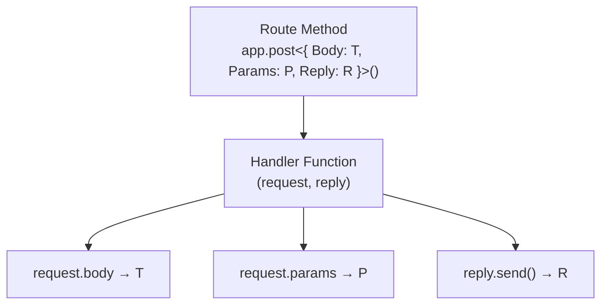

## Generic Types for Request and Reply

### Overview

`FastifyRequest` and `FastifyReply` are the two core objects passed into every route handler and hook. Both are generic types — they accept type parameters that tell TypeScript the shape of the incoming data (body, params, querystring, headers) and the outgoing response. Getting these generics right is the foundation of type-safe route handling in Fastify.

---

### The `FastifyRequest` Generic

The full generic signature of `FastifyRequest` is:

```typescript
FastifyRequest
  RouteGeneric,     // Shape of route-specific data
  RawServer,        // Underlying HTTP server type
  RawRequest,       // Underlying request type (http.IncomingMessage)
  SchemaCompiler,   // Schema compiler type
  TypeProvider,     // Type provider
  ContextConfig,    // Context config type
  Logger            // Logger type
>
```

In practice, only `RouteGeneric` is commonly specified. The rest are inferred from the instance.

---

### The `RouteGeneric` Interface

`RouteGeneric` is the primary generic you interact with. It is an interface with five optional keys:

```typescript
interface RouteGenericInterface {
  Body?:       unknown
  Querystring?: unknown
  Params?:     unknown
  Headers?:    unknown
  Reply?:      unknown
}
```

Each key corresponds to a part of the HTTP request or response:

| Key | Typed Property | HTTP Concept |
|---|---|---|
| `Body` | `request.body` | Request payload (POST, PUT, PATCH) |
| `Querystring` | `request.query` | URL query parameters |
| `Params` | `request.params` | URL path parameters |
| `Headers` | `request.headers` | Request headers |
| `Reply` | `reply.send()` | Response body type |

---

### Declaring Route-Level Generics

The most common pattern is to pass the generic directly on the route method:

```typescript
import Fastify, { FastifyRequest, FastifyReply } from 'fastify'

const app = Fastify()

interface CreatePostBody {
  title: string
  content: string
  published: boolean
}

interface PostParams {
  id: string
}

interface PostQuerystring {
  page?: number
  limit?: number
}

app.post<{
  Body: CreatePostBody
  Params: PostParams
  Querystring: PostQuerystring
}>(
  '/posts/:id',
  async (request, reply) => {
    const { title, content, published } = request.body   // CreatePostBody
    const { id } = request.params                        // PostParams
    const { page = 1, limit = 10 } = request.query      // PostQuerystring

    return reply.status(201).send({ id, title })
  }
)
```

**Key Points:**
- TypeScript infers `request.body`, `request.params`, and `request.query` from the generic — no explicit annotation on `request` itself is needed inside the handler
- Only the keys you declare are typed; omitted keys fall back to their defaults (`unknown` or the framework default)

---

### Typing Request and Reply Explicitly in Handler Functions

When extracting the handler into a standalone function, annotate `request` and `reply` explicitly using `FastifyRequest<...>` and `FastifyReply`:

```typescript
import { FastifyRequest, FastifyReply } from 'fastify'

interface UpdateUserBody {
  name?: string
  email?: string
}

interface UserParams {
  id: string
}

type UpdateUserRequest = FastifyRequest<{
  Body: UpdateUserBody
  Params: UserParams
}>

async function updateUserHandler(
  request: UpdateUserRequest,
  reply: FastifyReply
): Promise<void> {
  const { id } = request.params
  const { name, email } = request.body

  await reply.send({ id, name, email })
}

app.put<{ Body: UpdateUserBody; Params: UserParams }>(
  '/users/:id',
  updateUserHandler
)
```

**Key Points:**
- The generic on the route method and the annotation on the handler function must be consistent — TypeScript will raise an error if the shapes are incompatible
- `FastifyReply` is typically left without a generic for the handler parameter; the `Reply` generic is more commonly used at the route definition level

---

### The `Reply` Generic Key

The `Reply` key in `RouteGeneric` types what `reply.send()` accepts. This is distinct from `FastifyReply`'s own generic, which is rarely needed directly.

```typescript
interface HealthResponse {
  status: string
  uptime: number
}

app.get<{ Reply: HealthResponse }>(
  '/health',
  async (request, reply) => {
    // reply.send() now only accepts HealthResponse shape
    return reply.send({
      status: 'ok',
      uptime: process.uptime()
    })
  }
)
```

If you attempt to send a shape that does not match `HealthResponse`, TypeScript will raise a type error.

**Key Points:**
- The `Reply` generic provides compile-time enforcement of response shapes, but Fastify's actual serialization is governed by JSON Schema at runtime — the two must be kept in sync manually [Inference]
- Behavior at runtime is determined by the schema serializer, not by TypeScript types

---

### Typing Headers

Custom or expected headers can be typed via the `Headers` key. Note that `request.headers` already contains all standard HTTP headers typed by Node.js — the `Headers` generic *extends* or *overrides* those types:

```typescript
interface AuthHeaders {
  authorization: string
  'x-request-id'?: string
}

app.get<{ Headers: AuthHeaders }>(
  '/protected',
  async (request, reply) => {
    const token = request.headers.authorization  // typed as string
    const reqId = request.headers['x-request-id'] // typed as string | undefined

    return { token }
  }
)
```

**Key Points:**
- Header names in HTTP are case-insensitive, but the Node.js `IncomingMessage` normalizes them to lowercase — your interface keys should use lowercase
- TypeScript will not enforce that the client actually sends these headers at runtime; that is a validation concern, not a type concern [Inference]

---

### Combining All Generic Keys

A fully annotated route with all generic keys specified:

```typescript
interface SearchBody {
  filters: string[]
}

interface SearchParams {
  category: string
}

interface SearchQuerystring {
  q: string
  page?: number
}

interface SearchHeaders {
  'x-api-key': string
}

interface SearchReply {
  results: Array<{ id: string; title: string }>
  total: number
}

app.post<{
  Body: SearchBody
  Params: SearchParams
  Querystring: SearchQuerystring
  Headers: SearchHeaders
  Reply: SearchReply
}>(
  '/search/:category',
  async (request, reply) => {
    const { filters } = request.body
    const { category } = request.params
    const { q, page = 1 } = request.query
    const apiKey = request.headers['x-api-key']

    return reply.send({
      results: [{ id: '1', title: 'Example' }],
      total: 1
    })
  }
)
```

---

### `FastifyReply` Generic

`FastifyReply` has its own generic signature:

```typescript
FastifyReply
  RawServer,
  RawRequest,
  RawReply,
  RouteGeneric,
  ContextConfig,
  SchemaCompiler,
  TypeProvider
>
```

Again, only `RouteGeneric` is commonly relevant in day-to-day use. When you pass `Reply` inside `RouteGeneric`, `reply.send()` becomes typed accordingly.

**Direct `FastifyReply` generic annotation** (less common, but valid):

```typescript
import { FastifyReply, RouteGenericInterface } from 'fastify'

interface MyReply extends RouteGenericInterface {
  Reply: { message: string }
}

async function handler(
  request: FastifyRequest,
  reply: FastifyReply
    import('http').Server,
    import('http').IncomingMessage,
    import('http').ServerResponse,
    MyReply
  >
) {
  reply.send({ message: 'hello' })
}
```

[Inference] This verbose form is rarely necessary in practice. The route-level generic approach propagates types to both `request` and `reply` automatically and is the idiomatic pattern.

---

### Reusable Route Generic Types

For APIs with recurring shapes (e.g., consistent pagination, shared auth headers), define reusable generic interfaces:

```typescript
interface Paginated {
  page?: number
  limit?: number
}

interface WithAuthHeader {
  authorization: string
}

interface IdParam {
  id: string
}

// Compose them per route
app.get<{
  Params: IdParam
  Querystring: Paginated
  Headers: WithAuthHeader
}>(
  '/items/:id',
  async (request) => {
    const { id } = request.params
    const { page, limit } = request.query
    const auth = request.headers.authorization
    return { id, page, limit }
  }
)
```

---

### How Generics Flow Through the Route Definition

The diagram below shows how a single route generic propagates to `request` and `reply`:



---

### Default Types When Generics Are Omitted

When no generic is provided, Fastify falls back to these defaults:

| Property | Default Type |
|---|---|
| `request.body` | `unknown` |
| `request.params` | `unknown` |
| `request.query` | `unknown` |
| `request.headers` | `http.IncomingHttpHeaders` |
| `reply.send()` | accepts `any` |

`unknown` for `body`, `params`, and `query` means TypeScript will require you to narrow or assert the type before use — which is intentional and safe behavior, not an error.

---

### Type Assertions vs. Generics

Avoid using type assertions (`as`) in place of proper generics:

```typescript
// Discouraged — bypasses type checking
const body = request.body as CreatePostBody

// Preferred — types are checked at the route definition level
app.post<{ Body: CreatePostBody }>('/posts', async (request) => {
  const body = request.body // already CreatePostBody
})
```

**Key Points:**
- Type assertions suppress errors without verifying correctness — a mismatch between the assertion and the actual runtime data will not be caught by TypeScript
- Using generics ensures the declared shape is consistent with how the route is registered and (optionally) validated by a JSON schema

---

### Interaction with JSON Schema Validation

When you add a JSON Schema to a route, Fastify validates the incoming data at runtime. TypeScript generics and JSON Schema are independent — they must be kept consistent manually unless a type provider (TypeBox, Zod) is used to derive both from a single source of truth.

```typescript
const schema = {
  body: {
    type: 'object',
    required: ['title'],
    properties: {
      title: { type: 'string' }
    }
  }
}

interface CreatePostBody {
  title: string
}

// Schema handles runtime validation
// Generic handles compile-time type safety
// Both must agree — no automatic link between them here
app.post<{ Body: CreatePostBody }>(
  '/posts',
  { schema },
  async (request) => {
    const { title } = request.body
    return { title }
  }
)
```

[Inference] Type providers (covered separately) close this gap by generating TypeScript types directly from the schema definition, making manual synchronization unnecessary.

---

**Related Topics:**

- Type providers: TypeBox and `@fastify/type-provider-typebox`
- Type providers: Zod with `fastify-type-provider-zod`
- JSON Schema validation and its relationship to TypeScript types
- Typing hooks (`onRequest`, `preHandler`, `onSend`) with `FastifyRequest`
- Declaration merging for `FastifyRequest` (adding custom properties via decorators)
- Typed error handling with `FastifyError`
- Response serialization and the `Reply` generic in depth
- Shared schema definitions and `$ref` in typed routes