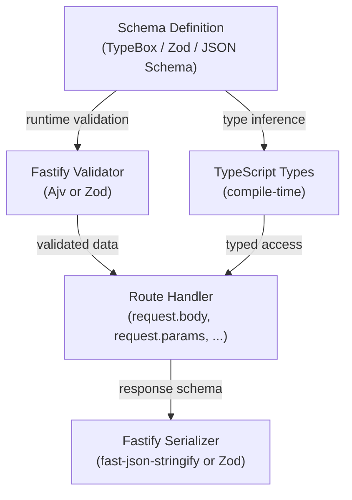

## Typing Route Schemas

### What Route Schema Typing Means

Fastify accepts a `schema` object on each route that drives two distinct runtime behaviors: **validation** (incoming request data is checked before the handler runs) and **serialization** (outgoing response data is processed through a fast serializer). TypeScript generics, by contrast, operate only at compile time and have no runtime effect.

"Typing route schemas" refers to the practice of connecting these two layers — making the TypeScript types for `request.body`, `request.params`, `request.query`, and `reply.send()` consistent with, or directly derived from, the JSON Schema definitions passed to Fastify. Without this connection, the two layers can silently diverge.

---

### The Default Gap Between Schema and Types

Without a type provider, Fastify's schema and TypeScript generics are entirely independent:

```typescript
const schema = {
  body: {
    type: 'object',
    required: ['email', 'password'],
    properties: {
      email:    { type: 'string', format: 'email' },
      password: { type: 'string', minLength: 8 }
    }
  }
}

interface LoginBody {
  email: string
  password: string
}

// The schema validates at runtime
// The generic types at compile time
// No mechanism links them — they can drift apart silently
app.post<{ Body: LoginBody }>(
  '/login',
  { schema },
  async (request) => {
    const { email, password } = request.body
    return { email }
  }
)
```

If you add a field to `schema` but forget to update `LoginBody` (or vice versa), neither TypeScript nor Fastify will warn you. This is the core problem that type providers solve.

---

### The `schema` Option Structure

Before addressing type safety, the full shape of the `schema` option is:

```typescript
interface RouteSchema {
  body?:        object   // validates request.body
  querystring?: object   // validates request.query
  params?:      object   // validates request.params
  headers?:     object   // validates request.headers
  response?:    {        // serializes reply by status code
    [statusCode: number | string]: object
  }
  tags?:        string[] // OpenAPI metadata
  summary?:     string   // OpenAPI metadata
  description?: string   // OpenAPI metadata
}
```

**Example — full schema with all keys:**

```typescript
const userSchema = {
  params: {
    type: 'object',
    required: ['id'],
    properties: {
      id: { type: 'string', format: 'uuid' }
    }
  },
  querystring: {
    type: 'object',
    properties: {
      verbose: { type: 'boolean', default: false }
    }
  },
  headers: {
    type: 'object',
    required: ['authorization'],
    properties: {
      authorization: { type: 'string' }
    }
  },
  response: {
    200: {
      type: 'object',
      properties: {
        id:    { type: 'string' },
        email: { type: 'string' }
      }
    },
    404: {
      type: 'object',
      properties: {
        message: { type: 'string' }
      }
    }
  }
}
```

---

### Approach 1 — Manual Synchronization (No Type Provider)

The simplest approach: write JSON Schema and TypeScript interfaces separately, and keep them in sync manually. This is viable for small projects or when type providers are not an option.

```typescript
// schemas/user.schema.ts
export const getUserSchema = {
  params: {
    type: 'object',
    required: ['id'],
    properties: {
      id: { type: 'string' }
    }
  },
  response: {
    200: {
      type: 'object',
      properties: {
        id:    { type: 'string' },
        name:  { type: 'string' },
        email: { type: 'string' }
      }
    }
  }
}

// types/user.types.ts
export interface GetUserParams  { id: string }
export interface GetUserReply   { id: string; name: string; email: string }
```

```typescript
// routes/user.route.ts
import { getUserSchema } from '../schemas/user.schema'
import { GetUserParams, GetUserReply } from '../types/user.types'

app.get<{ Params: GetUserParams; Reply: GetUserReply }>(
  '/users/:id',
  { schema: getUserSchema },
  async (request, reply) => {
    const { id } = request.params
    return reply.send({ id, name: 'Alice', email: 'alice@example.com' })
  }
)
```

**Key Points:**
- This approach requires discipline — schema and types are two sources of truth
- Any drift between them is undetected at compile time and may only surface as runtime mismatches or incorrect serialization behavior [Inference]

---

### Approach 2 — `json-schema-to-ts` (Derive Types from Schema)

The `json-schema-to-ts` package infers TypeScript types directly from a JSON Schema object using `FromSchema`. This eliminates the manually written interface while keeping plain JSON Schema.

**Installation:**

```bash
npm install json-schema-to-ts
```

**Usage:**

```typescript
import { FromSchema } from 'json-schema-to-ts'

const bodySchema = {
  type: 'object',
  required: ['username', 'password'],
  properties: {
    username: { type: 'string' },
    password: { type: 'string' }
  },
  additionalProperties: false
} as const   // 'as const' is required for inference to work

type LoginBody = FromSchema<typeof bodySchema>
// Inferred: { username: string; password: string }

app.post<{ Body: LoginBody }>(
  '/login',
  { schema: { body: bodySchema } },
  async (request) => {
    const { username, password } = request.body  // fully typed
    return { success: true }
  }
)
```

**Key Points:**
- `as const` is mandatory — without it, TypeScript widens the schema to `string` and inference collapses
- The schema remains a plain object — no build step or code generation is required
- The `FromSchema` type and the runtime schema are the same object, so they cannot drift apart
- Complex schema features (`$ref`, `allOf`, `oneOf`) are supported but may require additional `FromSchema` options [Inference]

---

### Approach 3 — TypeBox (Recommended for Full Integration)

TypeBox (`@sinclair/typebox`) generates objects that are simultaneously valid JSON Schema and TypeScript types. Combined with `@fastify/type-provider-typebox`, it wires both layers together at the instance level — no manual generic declarations needed on individual routes.

**Installation:**

```bash
npm install @sinclair/typebox @fastify/type-provider-typebox
```

**Wiring the type provider to the instance:**

```typescript
import Fastify from 'fastify'
import { TypeBoxTypeProvider } from '@fastify/type-provider-typebox'

const app = Fastify().withTypeProvider<TypeBoxTypeProvider>()
```

**Defining schemas with TypeBox:**

```typescript
import { Type, Static } from '@sinclair/typebox'

const CreateUserBody = Type.Object({
  name:  Type.String(),
  email: Type.String({ format: 'email' }),
  age:   Type.Optional(Type.Integer({ minimum: 0 }))
})

const UserParams = Type.Object({
  id: Type.String({ format: 'uuid' })
})

const UserReply = Type.Object({
  id:    Type.String(),
  name:  Type.String(),
  email: Type.String()
})

// Static<T> extracts the TypeScript type from a TypeBox schema
type CreateUserBodyType = Static<typeof CreateUserBody>
// { name: string; email: string; age?: number }
```

**Using TypeBox schemas on a route:**

```typescript
app.post(
  '/users',
  {
    schema: {
      body:     CreateUserBody,
      response: { 201: UserReply }
    }
  },
  async (request, reply) => {
    // request.body is typed as { name: string; email: string; age?: number }
    // No explicit generic needed — the type provider infers it from the schema
    const { name, email } = request.body

    return reply.status(201).send({
      id:    '123',
      name,
      email
    })
  }
)
```

**Key Points:**
- With `TypeBoxTypeProvider`, the generic on the route method is inferred automatically from the schema — you do not need to write `app.post<{ Body: ... }>` manually
- `Static<T>` gives you the TypeScript type separately when you need it outside of a route (e.g., in a service layer)
- TypeBox schemas are valid JSON Schema Draft 7 objects at runtime, so Fastify's Ajv validator processes them without any transformation

---

### Approach 4 — Zod with `fastify-type-provider-zod`

Zod is a schema validation library with its own type inference. The `fastify-type-provider-zod` package bridges Zod schemas into Fastify's type provider system.

**Installation:**

```bash
npm install zod fastify-type-provider-zod
```

**Setup:**

```typescript
import Fastify from 'fastify'
import { ZodTypeProvider } from 'fastify-type-provider-zod'
import { serializerCompiler, validatorCompiler } from 'fastify-type-provider-zod'

const app = Fastify().withTypeProvider<ZodTypeProvider>()

// Required: replace Fastify's default Ajv compilers with Zod-based ones
app.setValidatorCompiler(validatorCompiler)
app.setSerializerCompiler(serializerCompiler)
```

**Defining schemas with Zod:**

```typescript
import { z } from 'zod'

const CreateItemBody = z.object({
  name:     z.string().min(1),
  quantity: z.number().int().positive(),
  tags:     z.array(z.string()).optional()
})

const ItemParams = z.object({
  id: z.string().uuid()
})

const ItemReply = z.object({
  id:       z.string(),
  name:     z.string(),
  quantity: z.number()
})
```

**Using Zod schemas on a route:**

```typescript
app.post(
  '/items/:id',
  {
    schema: {
      params: ItemParams,
      body:   CreateItemBody,
      response: { 200: ItemReply }
    }
  },
  async (request, reply) => {
    const { id }             = request.params   // typed as { id: string }
    const { name, quantity } = request.body     // typed from Zod schema

    return reply.send({ id, name, quantity })
  }
)
```

**Key Points:**
- Zod replaces Ajv entirely — the `validatorCompiler` and `serializerCompiler` must be set or validation will not work correctly [Inference]
- Zod's validation error format differs from Ajv's — error responses will have a different structure by default, which may require custom error handling
- Zod schemas are not JSON Schema objects — they cannot be used directly with tools that expect JSON Schema (e.g., Swagger plugins) without an additional conversion layer

---

### Response Schema and Serialization

The `response` key in `schema` is handled differently from the others. It does not perform validation — it drives Fastify's fast-json-stringify serializer, which can significantly improve response throughput.

```typescript
const responseSchema = {
  response: {
    200: {
      type: 'object',
      properties: {
        id:   { type: 'string' },
        name: { type: 'string' }
      }
    },
    '4xx': {   // Wildcard — matches 400, 401, 403, 404, etc.
      type: 'object',
      properties: {
        message: { type: 'string' },
        code:    { type: 'number' }
      }
    }
  }
}
```

**Key Points:**
- Properties not listed in the response schema are stripped from the output by the serializer — this is intentional and acts as an allowlist
- Wildcard status codes (`2xx`, `4xx`, `5xx`) are supported
- TypeScript's `Reply` generic should match what the response schema allows, but no tooling enforces this automatically unless a type provider is used [Inference]

---

### Shared Schema with `$ref`

Fastify allows schemas to be registered globally and referenced by `$id` using `$ref`. This avoids duplication across routes.

```typescript
app.addSchema({
  $id: 'UserSchema',
  type: 'object',
  properties: {
    id:    { type: 'string' },
    name:  { type: 'string' },
    email: { type: 'string' }
  }
})

app.get(
  '/users/:id',
  {
    schema: {
      response: {
        200: { $ref: 'UserSchema#' }
      }
    }
  },
  async (request, reply) => {
    return reply.send({ id: '1', name: 'Alice', email: 'alice@example.com' })
  }
)
```

**Key Points:**
- `$ref`-based schemas work at runtime but do not automatically produce TypeScript types — you still need to declare interfaces or use `FromSchema` with reference resolution
- `json-schema-to-ts` supports `$ref` resolution via `References` option, which can bridge this gap [Inference]
- TypeBox supports references via `Type.Ref()`, though it requires careful registration to match Fastify's `addSchema` behavior

---

### Comparison of Approaches

| Approach | Single Source of Truth | Requires Build Step | Ajv Compatible | Type Inference |
|---|---|---|---|---|
| Manual sync | No | No | Yes | Manual |
| `json-schema-to-ts` | Yes (schema → type) | No | Yes | Automatic |
| TypeBox | Yes (schema = type) | No | Yes | Automatic |
| Zod | Yes (schema = type) | No | No (replaces Ajv) | Automatic |

---

### How the Layers Interact



---

**Related Topics:**

- TypeBox in depth: `Type.Union`, `Type.Intersect`, `Type.Ref`, and advanced schemas
- Zod integration: custom error formatting and coercion
- `json-schema-to-ts` with `$ref` and `References`
- Shared schemas with `addSchema` and `$ref` resolution
- OpenAPI/Swagger generation from typed schemas with `@fastify/swagger`
- Custom Ajv keywords and formats in TypeScript
- Response serialization performance with `fast-json-stringify`
- Validating nested and recursive schemas