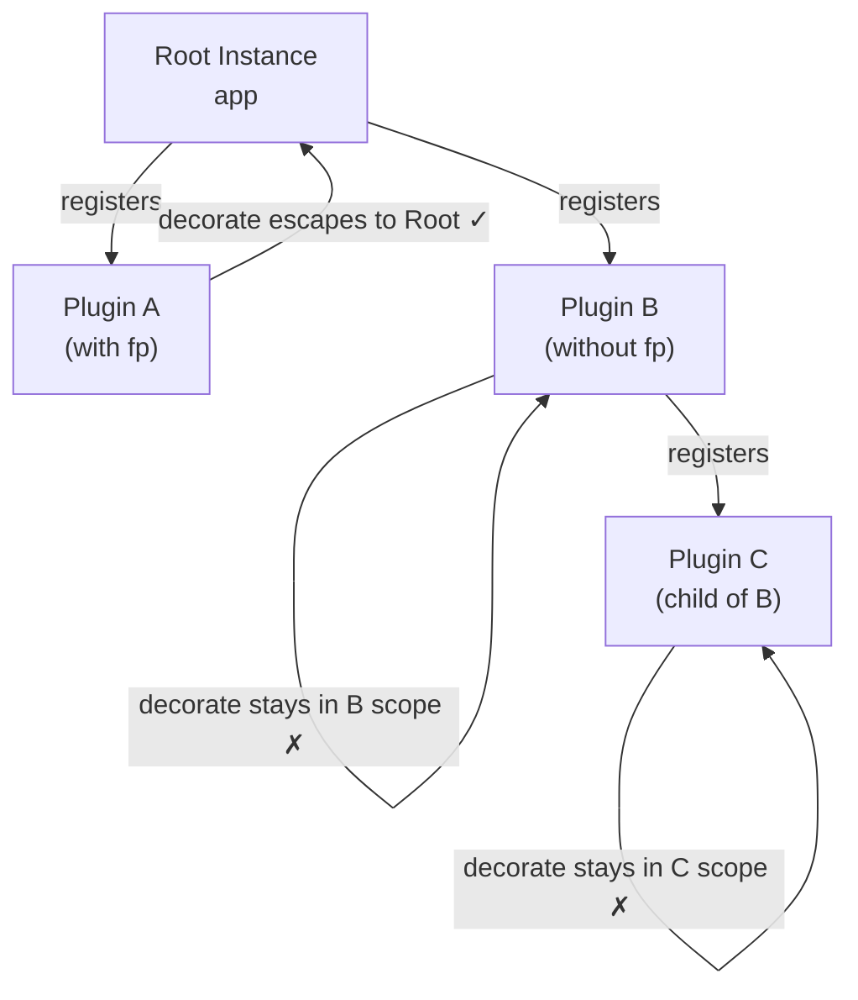

## Typing Plugins and Decorators

### Why This Is Nontrivial

Fastify's plugin system is built on encapsulation — each plugin receives a scoped child instance, and anything registered inside that scope (routes, decorators, hooks) is invisible outside it by default. This encapsulation is a runtime behavior, not a compile-time one. TypeScript has no native mechanism to represent "this property exists on the instance only after this plugin has been registered," so bridging the gap requires deliberate use of declaration merging, module augmentation, and `fastify-plugin`.

Understanding how these pieces interact is essential for building type-safe, modular Fastify applications.

---

### Fastify's Three Decorator Targets

Fastify supports decorating three objects:

| Method | Decorates | Typed Interface |
|---|---|---|
| `app.decorate()` | The Fastify instance | `FastifyInstance` |
| `app.decorateRequest()` | `FastifyRequest` | `FastifyRequest` |
| `app.decorateReply()` | `FastifyReply` | `FastifyReply` |

Each requires its own module augmentation to be visible to TypeScript.

---

### Declaration Merging and Module Augmentation

TypeScript allows you to extend existing interfaces from external modules using `declare module`. Fastify exposes `FastifyInstance`, `FastifyRequest`, and `FastifyReply` specifically to support this pattern.

The augmentation must be placed in a file that is a **module** — it must contain at least one top-level `import` or `export` statement. Without this, the declaration affects the global scope instead of the module.

**Basic structure:**

```typescript
import { FastifyInstance, FastifyRequest, FastifyReply } from 'fastify'

declare module 'fastify' {
  interface FastifyInstance {
    // new properties on app.*
  }

  interface FastifyRequest {
    // new properties on request.*
  }

  interface FastifyReply {
    // new properties on reply.*
  }
}
```

---

### Typing `app.decorate()`

`app.decorate()` adds a property to the Fastify instance. Without augmentation, TypeScript does not know about it.

**Without augmentation (error):**

```typescript
app.decorate('config', { db_url: 'postgres://localhost/mydb' })

console.log(app.config) // TS Error: Property 'config' does not exist on type 'FastifyInstance'
```

**With module augmentation:**

```typescript
// plugins/config.ts
import fp from 'fastify-plugin'
import { FastifyPluginAsync } from 'fastify'

interface AppConfig {
  db_url:     string
  jwt_secret: string
  port:       number
}

declare module 'fastify' {
  interface FastifyInstance {
    config: AppConfig
  }
}

const configPlugin: FastifyPluginAsync = async (app) => {
  const config: AppConfig = {
    db_url:     process.env.DATABASE_URL ?? '',
    jwt_secret: process.env.JWT_SECRET   ?? '',
    port:       Number(process.env.PORT) || 3000
  }

  app.decorate('config', config)
}

export default fp(configPlugin)
```

After this plugin is registered, `app.config` is recognized everywhere `FastifyInstance` is used:

```typescript
// anywhere in the app
app.log.info(`Connecting to ${app.config.db_url}`)
```

---

### Typing `app.decorateRequest()`

`decorateRequest()` adds a property to every `FastifyRequest` object. The canonical use case is attaching authenticated user data after a hook runs.

```typescript
// plugins/auth.ts
import fp from 'fastify-plugin'
import { FastifyPluginAsync } from 'fastify'

interface AuthUser {
  id:    string
  email: string
  roles: string[]
}

declare module 'fastify' {
  interface FastifyRequest {
    user: AuthUser | null
  }
}

const authPlugin: FastifyPluginAsync = async (app) => {
  // Initialize with null — required for Fastify's reference-sharing optimization
  app.decorateRequest('user', null)

  app.addHook('onRequest', async (request, reply) => {
    const token = request.headers.authorization?.replace('Bearer ', '')

    if (!token) {
      request.user = null
      return
    }

    // [Inference] token verification logic would go here
    request.user = {
      id:    'user-123',
      email: 'alice@example.com',
      roles: ['admin']
    }
  })
}

export default fp(authPlugin)
```

After registration, `request.user` is typed across all route handlers:

```typescript
app.get('/profile', async (request, reply) => {
  if (!request.user) {
    return reply.status(401).send({ message: 'Unauthorized' })
  }

  const { email, roles } = request.user  // typed as AuthUser
  return { email, roles }
})
```

**Key Points:**
- Fastify requires that `decorateRequest()` is called with an initial value — for objects or arrays, this must be `null` (not `{}` or `[]`), to prevent reference sharing across requests
- The initial value type and the augmented interface type may differ (e.g., initial `null`, interface `AuthUser | null`) — TypeScript does not verify that `decorate*()` call arguments match the augmented interface [Inference]
- Runtime behavior depends on the actual value assigned; TypeScript types alone do not enforce correctness

---

### Typing `app.decorateReply()`

Less common than the other two, `decorateReply()` adds a method or property to every `FastifyReply` object:

```typescript
// plugins/reply-helpers.ts
import fp from 'fastify-plugin'
import { FastifyPluginAsync } from 'fastify'

declare module 'fastify' {
  interface FastifyReply {
    sendSuccess(data: unknown): FastifyReply
    sendError(message: string, statusCode?: number): FastifyReply
  }
}

const replyHelpersPlugin: FastifyPluginAsync = async (app) => {
  app.decorateReply('sendSuccess', function (this: FastifyReply, data: unknown) {
    return this.status(200).send({ success: true, data })
  })

  app.decorateReply('sendError', function (
    this: FastifyReply,
    message: string,
    statusCode = 400
  ) {
    return this.status(statusCode).send({ success: false, message })
  })
}

export default fp(replyHelpersPlugin)
```

**Usage in routes:**

```typescript
app.get('/items', async (request, reply) => {
  const items = await fetchItems()
  return reply.sendSuccess(items)
})

app.get('/broken', async (request, reply) => {
  return reply.sendError('Something went wrong', 500)
})
```

**Key Points:**
- When decorating with functions, use `function` (not arrow functions) so that `this` refers to the reply instance
- Arrow functions do not bind `this`, making `this.status(...)` undefined at runtime

---

### Plugin Typing with `FastifyPluginAsync` and `FastifyPluginCallback`

Fastify provides two generic types for typing plugin functions:

```typescript
FastifyPluginAsync<Options = Record<never, never>, Server = RawServerDefault>
FastifyPluginCallback<Options = Record<never, never>, Server = RawServerDefault>
```

**Async plugin (most common):**

```typescript
import { FastifyPluginAsync } from 'fastify'

const myPlugin: FastifyPluginAsync = async (app, opts) => {
  app.get('/hello', async () => ({ hello: 'world' }))
}

export default myPlugin
```

**Plugin with typed options:**

```typescript
import { FastifyPluginAsync } from 'fastify'

interface MyPluginOptions {
  prefix:    string
  secretKey: string
}

const myPlugin: FastifyPluginAsync<MyPluginOptions> = async (app, opts) => {
  // opts is typed as MyPluginOptions
  console.log(opts.prefix)
  console.log(opts.secretKey)

  app.get(`${opts.prefix}/health`, async () => ({ status: 'ok' }))
}

export default myPlugin
```

**Registering with options:**

```typescript
app.register(myPlugin, {
  prefix:    '/api/v1',
  secretKey: 'abc123'
})
```

TypeScript will verify that the options object matches `MyPluginOptions`.

---

### `fastify-plugin` and Scope Escape

By default, anything registered inside a plugin is encapsulated — decorators, hooks, and routes added inside the plugin are not visible to the parent instance or sibling plugins. `fastify-plugin` (`fp`) breaks encapsulation, making the plugin's decorations available on the parent instance.

```
Without fp:                        With fp:

root instance                      root instance
├── app.decorate('db', ...)  ✗     ├── app.decorate('db', ...)  ✓
│   (invisible outside plugin)     │   (visible everywhere)
└── routes                         └── routes
```

**Without `fastify-plugin` — decorator invisible outside:**

```typescript
// plugin registers WITHOUT fp
app.register(async (instance) => {
  instance.decorate('db', dbClient)
})

// Later — TS error AND runtime error
app.db.query(...)  // Property 'db' does not exist
```

**With `fastify-plugin` — decorator escapes scope:**

```typescript
import fp from 'fastify-plugin'

app.register(fp(async (instance) => {
  instance.decorate('db', dbClient)
}))

// Now accessible on parent
app.db.query(...)  // works at runtime AND TypeScript knows about it (via augmentation)
```

**Key Points:**
- `fastify-plugin` is a runtime mechanism — it tells Fastify not to create a new scope for this plugin
- Module augmentation is a compile-time mechanism — it tells TypeScript the property exists
- Both are required for a fully type-safe decorator: `fp` for runtime visibility, augmentation for compile-time visibility
- Using augmentation without `fp` means TypeScript accepts the code but it may fail at runtime [Inference]

---

### Organizing Augmentations

For larger projects, centralizing augmentations avoids repetition and makes the additions discoverable.

**`src/types/fastify.d.ts`**

```typescript
import { FastifyInstance, FastifyRequest, FastifyReply } from 'fastify'

declare module 'fastify' {
  interface FastifyInstance {
    config: {
      db_url:     string
      jwt_secret: string
      port:       number
    }
    db: import('../db/client').DatabaseClient
  }

  interface FastifyRequest {
    user:      import('../types/auth').AuthUser | null
    requestId: string
  }

  interface FastifyReply {
    sendSuccess(data: unknown): FastifyReply
    sendError(message: string, status?: number): FastifyReply
  }
}
```

Include this file in `tsconfig.json`'s `include` array, or ensure it is part of the compiled source tree. No explicit import is needed — declaration merging applies globally across the compilation unit once the file is included.

---

### Plugin with Both Options and Decorators

A complete, realistic plugin combining options typing, decoration, and augmentation:

```typescript
// plugins/database.ts
import fp from 'fastify-plugin'
import { FastifyPluginAsync } from 'fastify'

interface DatabaseClient {
  query<T>(sql: string, params?: unknown[]): Promise<T[]>
  close(): Promise<void>
}

interface DatabasePluginOptions {
  connectionString: string
  poolSize?:        number
}

declare module 'fastify' {
  interface FastifyInstance {
    db: DatabaseClient
  }
}

const databasePlugin: FastifyPluginAsync<DatabasePluginOptions> = async (
  app,
  opts
) => {
  const client: DatabaseClient = await createDatabaseClient({
    connectionString: opts.connectionString,
    poolSize:         opts.poolSize ?? 10
  })

  app.decorate('db', client)

  app.addHook('onClose', async () => {
    await client.close()
  })
}

export default fp(databasePlugin, {
  name:     'database',
  fastify:  '4.x'   // optional: declare Fastify version compatibility
})
```

**Registration:**

```typescript
// app.ts
import databasePlugin from './plugins/database'

app.register(databasePlugin, {
  connectionString: 'postgres://localhost/mydb',
  poolSize:         20
})

// app.db is now typed everywhere
app.get('/users', async () => {
  const users = await app.db.query('SELECT * FROM users')
  return users
})
```

---

### Plugin Encapsulation Diagram



---

### Common Pitfalls

**1. Augmentation in a non-module file**

If a `.d.ts` or `.ts` file has no `import`/`export`, augmentation becomes a global declaration and may conflict with other definitions. Always ensure the file is a module.

**2. Forgetting `fp` while relying on augmentation**

TypeScript accepts `app.db` (from augmentation), but at runtime the property does not exist because the plugin was encapsulated. This produces a silent type-correct runtime error. [Inference]

**3. Using arrow functions in `decorateReply`/`decorateRequest`**

Arrow functions do not bind `this`. Any decorator that needs to call other methods on the request or reply object must use a regular `function`.

**4. Mutable object as initial value in `decorateRequest`**

```typescript
// Dangerous — all requests share the same object reference
app.decorateRequest('meta', {})

// Correct — null is safe; assign a fresh object per request in a hook
app.decorateRequest('meta', null)
```

**5. Augmenting the wrong interface**

`decorateRequest` augments `FastifyRequest`. `decorate` augments `FastifyInstance`. Augmenting the wrong interface produces TypeScript satisfaction but a runtime mismatch. [Inference]

---

### Summary Table

| Goal | Runtime Tool | Compile-time Tool |
|---|---|---|
| Add property to instance | `app.decorate()` + `fp` | `declare module 'fastify' { interface FastifyInstance }` |
| Add property to request | `app.decorateRequest()` | `declare module 'fastify' { interface FastifyRequest }` |
| Add property to reply | `app.decorateReply()` | `declare module 'fastify' { interface FastifyReply }` |
| Typed plugin options | `app.register(plugin, opts)` | `FastifyPluginAsync<Options>` |
| Escape plugin scope | `fastify-plugin` (`fp`) | Not applicable (runtime only) |

---

**Related Topics:**

- Typed hooks with augmented `FastifyRequest` properties
- Plugin dependency declaration with `fastify-plugin` metadata
- Typing database clients and ORM integrations as decorators
- JWT and session plugins with typed `request.user`
- Testing plugins in isolation with `fastify.inject()`
- Plugin load order and decorator availability timing
- Typed environment variable plugins with `@fastify/env`
- Composing multiple plugins with shared type augmentations