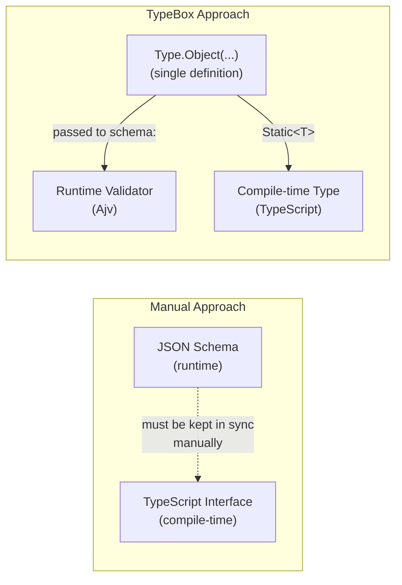

## TypeBox for Schema and Type Sharing

### What TypeBox Is

TypeBox is a TypeScript library by Sinclair that constructs objects which are simultaneously valid JSON Schema (Draft 7) and TypeScript types — from a single definition. There is no code generation step, no build pipeline, and no synchronization required between a schema file and a types file. The same object is handed to Fastify's validator at runtime and used by TypeScript's compiler at compile time.

This makes TypeBox the most direct solution to the dual-layer problem described in the previous topic: one definition, two consumers.

---

### Installation

```bash
npm install @sinclair/typebox
npm install @fastify/type-provider-typebox
```

`@sinclair/typebox` provides the schema builders and type extractors. `@fastify/type-provider-typebox` wires TypeBox into Fastify's type provider system so that route-level types are inferred automatically from schemas.

---

### Core Concepts

#### `Type.*` — Schema Builders

Every TypeBox schema is created through the `Type` namespace. Each builder produces a plain JavaScript object that satisfies both the JSON Schema specification and TypeBox's internal type structure.

```typescript
import { Type } from '@sinclair/typebox'

const StringSchema  = Type.String()
const NumberSchema  = Type.Number()
const BooleanSchema = Type.Boolean()
const NullSchema    = Type.Null()
const AnySchema     = Type.Any()
const UnknownSchema = Type.Unknown()
```

#### `Static<T>` — Type Extraction

`Static<T>` is a TypeScript utility type that extracts the TypeScript type from a TypeBox schema. This is how you get a usable type for use in non-route contexts (service layers, function parameters, etc.).

```typescript
import { Type, Static } from '@sinclair/typebox'

const UserSchema = Type.Object({
  id:    Type.String(),
  email: Type.String(),
  age:   Type.Number()
})

type User = Static<typeof UserSchema>
// Equivalent to: { id: string; email: string; age: number }
```

---

### Primitive and Common Schemas

```typescript
import { Type } from '@sinclair/typebox'

// Primitives
Type.String()
Type.Number()
Type.Integer()
Type.Boolean()
Type.Null()
Type.Undefined()
Type.BigInt()
Type.Symbol()

// With constraints
Type.String({ minLength: 1, maxLength: 255 })
Type.String({ format: 'email' })
Type.String({ format: 'uuid' })
Type.String({ pattern: '^[a-z]+$' })
Type.Number({ minimum: 0, maximum: 100 })
Type.Integer({ minimum: 1 })

// Literals
Type.Literal('admin')
Type.Literal(42)
Type.Literal(true)
```

---

### Object Schemas

```typescript
import { Type, Static } from '@sinclair/typebox'

const AddressSchema = Type.Object({
  street:  Type.String(),
  city:    Type.String(),
  country: Type.String({ minLength: 2, maxLength: 2 }),
  zip:     Type.Optional(Type.String())
})

type Address = Static<typeof AddressSchema>
// {
//   street:  string
//   city:    string
//   country: string
//   zip?:    string
// }
```

**Controlling additional properties:**

```typescript
// Allows additional properties (default)
const LooseSchema = Type.Object({ name: Type.String() })

// Rejects additional properties at validation time
const StrictSchema = Type.Object(
  { name: Type.String() },
  { additionalProperties: false }
)
```

**Key Points:**
- `Type.Optional()` wraps a field to make it optional (`?`) in the inferred TypeScript type and marks it as not `required` in JSON Schema
- `additionalProperties: false` is enforced at runtime by Ajv — it strips or rejects unknown fields depending on Ajv configuration; it does not affect the TypeScript type [Inference]

---

### Array, Tuple, and Enum Schemas

**Arrays:**

```typescript
const TagsSchema    = Type.Array(Type.String())
const MatrixSchema  = Type.Array(Type.Array(Type.Number()))
const BoundedArray  = Type.Array(Type.String(), { minItems: 1, maxItems: 10 })
```

**Tuples:**

```typescript
const CoordinateSchema = Type.Tuple([Type.Number(), Type.Number()])
type Coordinate = Static<typeof CoordinateSchema>
// [number, number]
```

**Enums:**

```typescript
// TypeBox native enum (recommended)
const RoleSchema = Type.Union([
  Type.Literal('admin'),
  Type.Literal('user'),
  Type.Literal('guest')
])
type Role = Static<typeof RoleSchema>
// 'admin' | 'user' | 'guest'

// TypeScript enum (also supported)
enum Direction { Up = 'UP', Down = 'DOWN' }
const DirectionSchema = Type.Enum(Direction)
```

---

### Composition: Union, Intersect, and Extend

**Union (`oneOf` in JSON Schema):**

```typescript
const StringOrNumber = Type.Union([Type.String(), Type.Number()])
type StringOrNumber  = Static<typeof StringOrNumber>
// string | number
```

**Intersect (`allOf` in JSON Schema):**

```typescript
const BaseEntity = Type.Object({
  id:        Type.String({ format: 'uuid' }),
  createdAt: Type.String({ format: 'date-time' })
})

const UserBase = Type.Object({
  name:  Type.String(),
  email: Type.String({ format: 'email' })
})

const UserWithMeta = Type.Intersect([BaseEntity, UserBase])
type UserWithMeta  = Static<typeof UserWithMeta>
// { id: string; createdAt: string; name: string; email: string }
```

**Extend (Object spread — preferred over Intersect for objects):**

```typescript
const CreateUserBody = Type.Object({
  name:  Type.String(),
  email: Type.String({ format: 'email' })
})

const UpdateUserBody = Type.Composite([
  Type.Partial(CreateUserBody),   // all fields optional
  Type.Object({ updatedAt: Type.String() })
])

type UpdateUserBody = Static<typeof UpdateUserBody>
// { name?: string; email?: string; updatedAt: string }
```

---

### Utility Types

TypeBox mirrors TypeScript's built-in utility types:

```typescript
const UserSchema = Type.Object({
  id:       Type.String(),
  name:     Type.String(),
  email:    Type.String(),
  password: Type.String()
})

// Makes all fields optional
const PartialUser = Type.Partial(UserSchema)

// Makes all fields required (removes Optional wrappers)
const RequiredUser = Type.Required(UserSchema)

// Pick specific fields
const PublicUser = Type.Pick(UserSchema, ['id', 'name', 'email'])
type PublicUser  = Static<typeof PublicUser>
// { id: string; name: string; email: string }

// Omit specific fields
const SafeUser  = Type.Omit(UserSchema, ['password'])
type SafeUser   = Static<typeof SafeUser>
// { id: string; name: string; email: string }

// Record type
const ScoresMap = Type.Record(Type.String(), Type.Number())
type ScoresMap  = Static<typeof ScoresMap>
// Record<string, number>
```

---

### Wiring TypeBox to Fastify

#### Setting Up the Type Provider

```typescript
import Fastify from 'fastify'
import { TypeBoxTypeProvider } from '@fastify/type-provider-typebox'

const app = Fastify({ logger: true }).withTypeProvider<TypeBoxTypeProvider>()
```

`withTypeProvider<TypeBoxTypeProvider>()` returns a new instance reference with the provider baked into the instance's generic signature. All routes registered on this instance automatically infer `request.body`, `request.params`, `request.query`, and `reply.send()` from the TypeBox schemas passed in the `schema` option.

**Key Points:**
- The original `app` reference before `.withTypeProvider()` does not carry the provider type — use the returned value
- If you pass the instance to plugins or helper functions, annotate the parameter with the full typed instance type or use `FastifyInstance` with the provider generic

#### Typed Instance Type

For passing the typed instance around:

```typescript
import { FastifyInstance } from 'fastify'
import { TypeBoxTypeProvider } from '@fastify/type-provider-typebox'

type App = FastifyInstance
  import('http').Server,
  import('http').IncomingMessage,
  import('http').ServerResponse,
  import('fastify').FastifyBaseLogger,
  TypeBoxTypeProvider
>
```

Or more concisely using `typeof`:

```typescript
const app = Fastify().withTypeProvider<TypeBoxTypeProvider>()
type App  = typeof app
```

---

### Route-Level Type Inference

With the provider wired, route handlers infer types from schemas automatically — no explicit route generic required:

```typescript
import { Type } from '@sinclair/typebox'

const CreatePostBody = Type.Object({
  title:   Type.String({ minLength: 1 }),
  content: Type.String(),
  tags:    Type.Optional(Type.Array(Type.String()))
})

const PostParams = Type.Object({
  id: Type.String({ format: 'uuid' })
})

const PostReply = Type.Object({
  id:        Type.String(),
  title:     Type.String(),
  createdAt: Type.String()
})

app.post(
  '/posts/:id',
  {
    schema: {
      params:   PostParams,
      body:     CreatePostBody,
      response: { 201: PostReply }
    }
  },
  async (request, reply) => {
    // All types inferred — no generics written manually
    const { id }             = request.params   // string
    const { title, content, tags } = request.body  // string, string, string[] | undefined

    return reply.status(201).send({
      id,
      title,
      createdAt: new Date().toISOString()
    })
  }
)
```

If `reply.send()` receives a shape that does not match `PostReply`, TypeScript raises a compile error.

---

### Sharing Schemas Across Layers

The main value of TypeBox in a larger application is that the same schema object is usable everywhere — routes, service functions, tests, and data access layers — with a single `Static<T>` extraction.

**`src/schemas/user.schema.ts`**

```typescript
import { Type, Static } from '@sinclair/typebox'

export const UserIdParam = Type.Object({
  id: Type.String({ format: 'uuid' })
})

export const CreateUserBody = Type.Object({
  name:     Type.String({ minLength: 1, maxLength: 100 }),
  email:    Type.String({ format: 'email' }),
  password: Type.String({ minLength: 8 }),
  role:     Type.Union([
    Type.Literal('admin'),
    Type.Literal('user')
  ])
})

export const UserReply = Type.Object({
  id:        Type.String(),
  name:      Type.String(),
  email:     Type.String(),
  role:      Type.String(),
  createdAt: Type.String()
})

export const UpdateUserBody = Type.Partial(
  Type.Pick(CreateUserBody, ['name', 'email', 'role'])
)

// Extracted TypeScript types
export type UserIdParamType   = Static<typeof UserIdParam>
export type CreateUserBodyType = Static<typeof CreateUserBody>
export type UserReplyType      = Static<typeof UserReply>
export type UpdateUserBodyType = Static<typeof UpdateUserBody>
```

**`src/services/user.service.ts`** — uses extracted types, no Fastify dependency:

```typescript
import { CreateUserBodyType, UserReplyType } from '../schemas/user.schema'

export async function createUser(data: CreateUserBodyType): Promise<UserReplyType> {
  // data is fully typed: { name, email, password, role }
  return {
    id:        'generated-uuid',
    name:      data.name,
    email:     data.email,
    role:      data.role,
    createdAt: new Date().toISOString()
  }
}
```

**`src/routes/user.route.ts`** — uses schemas on the route:

```typescript
import { FastifyPluginAsync } from 'fastify'
import { TypeBoxTypeProvider } from '@fastify/type-provider-typebox'
import {
  UserIdParam,
  CreateUserBody,
  UserReply
} from '../schemas/user.schema'
import { createUser } from '../services/user.service'

const userRoutes: FastifyPluginAsync = async (app) => {
  const server = app.withTypeProvider<TypeBoxTypeProvider>()

  server.post(
    '/users',
    {
      schema: {
        body:     CreateUserBody,
        response: { 201: UserReply }
      }
    },
    async (request, reply) => {
      const user = await createUser(request.body)
      return reply.status(201).send(user)
    }
  )
}

export default userRoutes
```

---

### Shared Schema Registry with `Type.Ref()`

For large APIs where the same schema appears in multiple routes or response definitions, TypeBox supports references via `Type.Ref()`. This mirrors Fastify's `addSchema` + `$ref` mechanism.

```typescript
import { Type, Static } from '@sinclair/typebox'

// Define a reusable schema with an $id
const ErrorSchema = Type.Object({
  message:    Type.String(),
  statusCode: Type.Number()
}, { $id: 'Error' })

type ErrorType = Static<typeof ErrorSchema>

// Reference it in another schema
const NotFoundResponse = Type.Ref(ErrorSchema)

// Register with Fastify
app.addSchema(ErrorSchema)

// Use $ref in route response schemas
app.get(
  '/items/:id',
  {
    schema: {
      response: {
        200: Type.Object({ id: Type.String(), name: Type.String() }),
        404: Type.Ref(ErrorSchema)
      }
    }
  },
  async (request, reply) => {
    return reply.status(404).send({ message: 'Not found', statusCode: 404 })
  }
)
```

**Key Points:**
- `$id` must be unique across all registered schemas
- `app.addSchema()` must be called before any route that uses `Type.Ref()` to that schema, or Fastify's validator will not resolve the reference at runtime [Inference]
- Type inference through `Type.Ref()` requires `TypeBoxTypeProvider` — without it, the inferred type may fall back to `unknown`

---

### Recursive Schemas

TypeBox supports recursive schemas (e.g., tree structures) via `Type.Recursive()`:

```typescript
import { Type, Static } from '@sinclair/typebox'

const CategorySchema = Type.Recursive(Self =>
  Type.Object({
    id:       Type.String(),
    name:     Type.String(),
    children: Type.Array(Self)
  }),
  { $id: 'Category' }
)

type Category = Static<typeof CategorySchema>
// { id: string; name: string; children: Category[] }
```

---

### TypeBox vs. Manual JSON Schema — Comparison



---

### Common Patterns and Pitfalls

**Always use `as const` when not using TypeBox builders:**
If you mix plain JSON Schema objects with TypeBox, `as const` is needed for `FromSchema` inference. With TypeBox builders, `as const` is not needed — TypeBox handles narrowing internally.

**Do not destructure `Type`:**

```typescript
// Avoid — may lose internal TypeBox metadata
const { Object, String } = Type

// Prefer — use through the namespace
Type.Object({ name: Type.String() })
```

**`Type.Any()` disables inference:**
Using `Type.Any()` for a field effectively makes that field `any` in the inferred type — TypeScript will not check assignments to or from it.

**`Type.Unsafe<T>(schema)`:**
When you need a schema that TypeBox cannot express but want to supply a manual TypeScript type:

```typescript
const DateString = Type.Unsafe<Date>({ type: 'string', format: 'date-time' })
type DateString  = Static<typeof DateString>
// Date (manually specified, not derived from schema)
```

[Inference] This breaks the single-source-of-truth guarantee — the TypeScript type and the JSON Schema are manually paired and can drift.

---

### Summary Table

| TypeBox Builder | JSON Schema Equivalent | TypeScript Output |
|---|---|---|
| `Type.String()` | `{ type: 'string' }` | `string` |
| `Type.Number()` | `{ type: 'number' }` | `number` |
| `Type.Integer()` | `{ type: 'integer' }` | `number` |
| `Type.Boolean()` | `{ type: 'boolean' }` | `boolean` |
| `Type.Object({})` | `{ type: 'object', properties: {} }` | `{ ... }` |
| `Type.Array(T)` | `{ type: 'array', items: T }` | `T[]` |
| `Type.Optional(T)` | removes from `required` | `T \| undefined` (optional) |
| `Type.Union([A, B])` | `{ oneOf: [A, B] }` | `A \| B` |
| `Type.Intersect([A, B])` | `{ allOf: [A, B] }` | `A & B` |
| `Type.Literal('x')` | `{ const: 'x' }` | `'x'` |
| `Type.Partial(T)` | all properties optional | `Partial<T>` |
| `Type.Pick(T, keys)` | filtered properties | `Pick<T, keys>` |
| `Type.Omit(T, keys)` | excluded properties | `Omit<T, keys>` |
| `Type.Record(K, V)` | `{ additionalProperties: V }` | `Record<K, V>` |
| `Type.Ref(T)` | `{ $ref: T.$id }` | inferred from `T` |

---

**Related Topics:**

- Zod as an alternative type provider with `fastify-type-provider-zod`
- `@fastify/swagger` with TypeBox schemas for automatic OpenAPI generation
- TypeBox `Value` module for runtime parsing and value transformations
- Custom TypeBox formats and keywords with Ajv
- TypeBox `Type.Ref()` and `addSchema` for large schema registries
- Recursive and self-referencing schemas in depth
- Migrating from manual JSON Schema to TypeBox
- Using `Static<T>` in testing and mock data generation