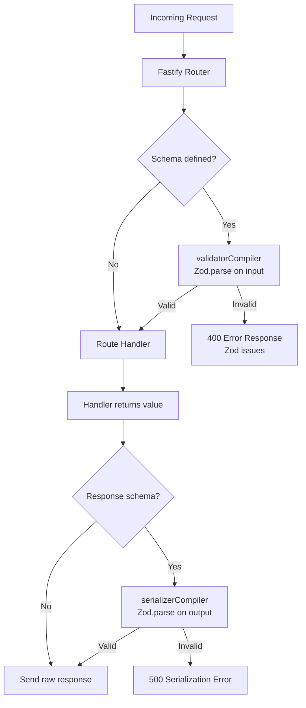

## Zod Integration for Validation

Fastify's native validation uses JSON Schema with Ajv. Zod operates on a different paradigm — it is a TypeScript-first schema library that produces types and validators from the same declaration. Bridging the two requires an adapter layer. The standard approach is `fastify-type-provider-zod`, which connects Zod schemas to Fastify's type provider system.

---

### Why Zod Instead of Raw JSON Schema

Fastify's built-in JSON Schema validation is fast and well-supported, but it has no native TypeScript inference. You write a schema object, then separately write or cast a type — these can drift apart silently.

Zod solves this by making the schema the single source of truth: the TypeScript type is derived from the schema, not written separately.

**Key Points:**
- One schema declaration produces both the runtime validator and the compile-time type
- Schema and type cannot drift apart
- Zod schemas are composable and reusable as plain TypeScript values
- Error messages are structured and detailed by default

---

### Installation

```bash
npm install zod fastify-type-provider-zod
```

`fastify-type-provider-zod` is not an official Fastify plugin but is the widely adopted community solution. [Inference] It is maintained separately from the Fastify core team; check its repository for version compatibility with your Fastify version.

---

### Registering the Zod Type Provider

Fastify's type provider system is configured via `.withTypeProvider<T>()`. This call does not change runtime behavior — it only informs TypeScript which provider is active for inference.

```typescript
import Fastify from 'fastify';
import { ZodTypeProvider } from 'fastify-type-provider-zod';

const app = Fastify().withTypeProvider<ZodTypeProvider>();
```

**Key Points:**
- `.withTypeProvider<ZodTypeProvider>()` returns a typed instance; assign it or chain from it
- The original `fastify` instance is not mutated with the new type; always use the returned value
- Without this call, TypeScript will not infer request types from Zod schemas

---

### Registering the Serializer and Validator

At runtime, Fastify still needs to know how to use Zod schemas for validation and serialization. The `serializerCompiler` and `validatorCompiler` from `fastify-type-provider-zod` handle this.

```typescript
import Fastify from 'fastify';
import {
  ZodTypeProvider,
  serializerCompiler,
  validatorCompiler,
} from 'fastify-type-provider-zod';

const app = Fastify().withTypeProvider<ZodTypeProvider>();

app.setValidatorCompiler(validatorCompiler);
app.setSerializerCompiler(serializerCompiler);
```

**Key Points:**
- `setValidatorCompiler` replaces Ajv with Zod for incoming request validation
- `setSerializerCompiler` uses Zod to validate and serialize outgoing responses
- Both must be set before routes are registered for them to apply
- Omitting `setSerializerCompiler` means response schemas are ignored at runtime, even if TypeScript sees them

---

### Defining Route Schemas with Zod

Once the provider is registered, route schemas accept Zod objects directly in the `schema` option.

```typescript
import { z } from 'zod';

app.post(
  '/users',
  {
    schema: {
      body: z.object({
        name: z.string().min(1),
        age: z.number().int().positive(),
      }),
      response: {
        201: z.object({
          id: z.string().uuid(),
          name: z.string(),
        }),
      },
    },
  },
  async (request, reply) => {
    // request.body is fully typed: { name: string; age: number }
    const { name, age } = request.body;

    return reply.status(201).send({ id: 'some-uuid', name });
  }
);
```

**Key Points:**
- `request.body`, `request.params`, `request.query`, and `request.headers` are all inferred from their respective Zod schemas
- The response schema is keyed by HTTP status code
- If the response does not match the schema, [Inference] Zod will throw a validation error before the response is sent; behavior may vary depending on how `serializerCompiler` is implemented in the version you use

---

### Params, Query, and Headers

All four input positions support Zod schemas.

```typescript
app.get(
  '/users/:id',
  {
    schema: {
      params: z.object({
        id: z.string().uuid(),
      }),
      querystring: z.object({
        includeDeleted: z.coerce.boolean().optional(),
      }),
    },
  },
  async (request) => {
    const { id } = request.params;           // string (UUID)
    const { includeDeleted } = request.query; // boolean | undefined
    return { id, includeDeleted };
  }
);
```

**Key Points:**
- Query string values arrive as strings; use `z.coerce.boolean()` or `z.coerce.number()` to convert them
- `z.coerce` performs type coercion at the Zod level before TypeScript sees the value
- Without coercion, `z.boolean()` on a query param [Inference] will likely fail at runtime because query values are always strings

---

### Reusing Schemas

Zod schemas are plain TypeScript values and can be declared once and reused across routes, utilities, and tests.

```typescript
// schemas/user.ts
import { z } from 'zod';

export const UserBody = z.object({
  name: z.string().min(1),
  email: z.string().email(),
});

export const UserResponse = z.object({
  id: z.string().uuid(),
  name: z.string(),
  email: z.string().email(),
});

export type UserBodyType = z.infer<typeof UserBody>;
export type UserResponseType = z.infer<typeof UserResponse>;
```

```typescript
// routes/users.ts
import { UserBody, UserResponse } from '../schemas/user';

app.post(
  '/users',
  { schema: { body: UserBody, response: { 201: UserResponse } } },
  async (request, reply) => {
    // request.body: UserBodyType
    reply.status(201).send({ id: 'uuid', ...request.body });
  }
);
```

---

### Inferring Types with `z.infer`

`z.infer<typeof Schema>` extracts the TypeScript type from a Zod schema. This is the primary mechanism for deriving types without duplication.

```typescript
const ProductSchema = z.object({
  sku: z.string(),
  price: z.number().positive(),
  tags: z.array(z.string()).optional(),
});

type Product = z.infer<typeof ProductSchema>;
// { sku: string; price: number; tags?: string[] | undefined }
```

You can use these inferred types in service layers, database functions, or anywhere outside the route handler without importing Fastify types.

---

### Validation Error Handling

When Zod validation fails on an incoming request, `fastify-type-provider-zod` converts the Zod error into a Fastify-compatible error response. [Inference] By default this produces a 400 response, but the exact shape of the error body depends on the version of `fastify-type-provider-zod` in use — verify against your installed version's documentation or source.

To customize error responses globally:

```typescript
import { hasZodFastifySchemaValidationErrors, isResponseSerializationError } from 'fastify-type-provider-zod';

app.setErrorHandler((error, request, reply) => {
  if (hasZodFastifySchemaValidationErrors(error)) {
    return reply.status(400).send({
      statusCode: 400,
      error: 'Validation Error',
      issues: error.validation,
    });
  }

  if (isResponseSerializationError(error)) {
    return reply.status(500).send({
      statusCode: 500,
      error: 'Response Serialization Error',
      message: error.message,
    });
  }

  reply.send(error);
});
```

**Key Points:**
- `hasZodFastifySchemaValidationErrors` narrows the error type to one containing Zod issues
- `isResponseSerializationError` catches failures during response serialization — this indicates a mismatch between what your handler returns and what the response schema expects
- Separating the two gives distinct error messages for client errors vs. server-side schema bugs

---

### Composing Schemas

Zod's composition operators work normally inside Fastify schemas.

```typescript
const BaseEntity = z.object({
  id: z.string().uuid(),
  createdAt: z.string().datetime(),
});

const ArticleBody = z.object({
  title: z.string().min(1).max(200),
  content: z.string(),
});

const ArticleResponse = BaseEntity.merge(ArticleBody);
// { id: string; createdAt: string; title: string; content: string }
```

**Key Points:**
- `.merge()` combines two object schemas
- `.extend()` adds fields to an existing schema
- `.pick()` and `.omit()` create subsets
- `.partial()` makes all fields optional
- These are standard Zod operations; they compose before being passed to Fastify, so Fastify receives the final resolved schema

---

### OpenAPI / Swagger Integration

`fastify-type-provider-zod` provides a `jsonSchemaTransform` utility that converts Zod schemas to JSON Schema format for use with `@fastify/swagger`.

```typescript
import { jsonSchemaTransform } from 'fastify-type-provider-zod';
import fastifySwagger from '@fastify/swagger';
import fastifySwaggerUi from '@fastify/swagger-ui';

await app.register(fastifySwagger, {
  openapi: {
    info: { title: 'My API', version: '1.0.0' },
  },
  transform: jsonSchemaTransform,
});

await app.register(fastifySwaggerUi, { routePrefix: '/docs' });
```

**Key Points:**
- `jsonSchemaTransform` converts each route's Zod schemas to JSON Schema at documentation generation time
- Not all Zod features map cleanly to JSON Schema; [Inference] some Zod refinements or transforms may produce incomplete or lossy JSON Schema output — verify generated docs against your actual schemas
- This integration does not affect runtime validation; it only affects the documentation output

---

### Diagram: Request Lifecycle with Zod Provider



---

### Known Limitations

| Area | Limitation |
|---|---|
| Performance | [Inference] Zod validation is slower than Ajv; for high-throughput routes, benchmark against your requirements |
| JSON Schema output | Zod-to-JSON Schema conversion via `jsonSchemaTransform` may not represent all Zod features accurately |
| Coercion | Query and param values require explicit `z.coerce` — Zod does not coerce by default |
| Transforms | `z.transform()` in response schemas [Speculation] may interact unexpectedly with serialization; test explicitly |
| Library maturity | `fastify-type-provider-zod` is a community library, not part of Fastify core; API may change across versions |

---

**Related Topics:**
- `fastify-type-provider-typebox` — alternative type provider using TypeBox (JSON Schema native, better performance profile)
- Ajv custom keywords — extending the default validator when staying with JSON Schema
- `@fastify/swagger` + `jsonSchemaTransform` deep dive — full OpenAPI generation workflow
- Zod `.superRefine()` and async validation — advanced validation logic within Zod schemas
- Response serialization and `fast-json-stringify` — understanding the serialization pipeline Zod replaces
- Schema modularity patterns — organizing schemas across a large Fastify codebase