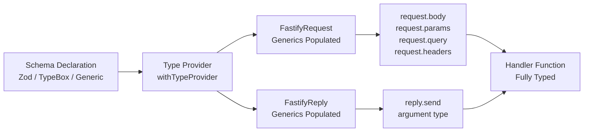

## Type-Safe Route Handlers

Type safety in Fastify route handlers means that `request.body`, `request.params`, `request.query`, `request.headers`, and `reply.send()` are all statically typed — the compiler rejects mismatches before runtime. This is achieved through the interaction of Fastify's generic system, the active type provider, and the schema declared on the route.

---

### How Fastify Infers Handler Types

Fastify's route method is generic. When a schema is provided, the type provider translates that schema into TypeScript types and threads them into the handler's `request` and `reply` parameters.

The chain is:

1. `.withTypeProvider<P>()` sets the active provider `P`
2. The route's `schema` option carries the schema for each input/output position
3. The type provider transforms each schema into a TypeScript type
4. Those types populate `FastifyRequest` and `FastifyReply` generics
5. The handler receives a fully typed `request` and `reply`

[Inference] If any step in this chain is broken — wrong provider, schema missing, or incorrect import — TypeScript falls back to `unknown` or `any` without necessarily emitting an error, depending on your `tsconfig` settings.

---

### With the Zod Type Provider

This builds directly on the Zod integration. With `ZodTypeProvider` active and compilers registered:

```typescript
import Fastify from 'fastify';
import { ZodTypeProvider, serializerCompiler, validatorCompiler } from 'fastify-type-provider-zod';
import { z } from 'zod';

const app = Fastify().withTypeProvider<ZodTypeProvider>();
app.setValidatorCompiler(validatorCompiler);
app.setSerializerCompiler(serializerCompiler);

app.post(
  '/articles/:id/publish',
  {
    schema: {
      params: z.object({ id: z.string().uuid() }),
      body: z.object({ scheduledAt: z.string().datetime().optional() }),
      response: {
        200: z.object({ published: z.boolean(), id: z.string() }),
      },
    },
  },
  async (request, reply) => {
    const { id } = request.params;           // string
    const { scheduledAt } = request.body;    // string | undefined
    return reply.send({ published: true, id });
  }
);
```

**Key Points:**
- `request.params`, `request.body`, and `reply.send()` argument are all typed from the Zod schema
- No type assertions or manual type annotations are needed in the handler body
- `reply.send()` accepts only values assignable to the declared response schema type; passing an incompatible shape is a compile-time error

---

### With the TypeBox Type Provider

TypeBox is the other major type provider. It uses JSON Schema as its representation, which means it is compatible with Fastify's default Ajv validator without replacing it.

```typescript
import Fastify from 'fastify';
import { TypeBoxTypeProvider } from '@fastify/type-provider-typebox';
import { Type } from '@sinclair/typebox';

const app = Fastify().withTypeProvider<TypeBoxTypeProvider>();

app.get(
  '/products/:sku',
  {
    schema: {
      params: Type.Object({ sku: Type.String() }),
      querystring: Type.Object({
        currency: Type.Optional(Type.String()),
      }),
      response: {
        200: Type.Object({
          sku: Type.String(),
          price: Type.Number(),
        }),
      },
    },
  },
  async (request, reply) => {
    const { sku } = request.params;       // string
    const { currency } = request.query;   // string | undefined
    return reply.send({ sku, price: 9.99 });
  }
);
```

**Key Points:**
- `@fastify/type-provider-typebox` is the official Fastify TypeBox provider
- TypeBox schemas are JSON Schema at runtime; no serializer/validator replacement is required
- TypeBox and Zod are not interchangeable; pick one per application instance

---

### Raw Generic Typing Without a Type Provider

Before type providers existed, Fastify exposed route-level generics directly. This approach still works but is more verbose and does not derive types from a schema — you declare types manually.

```typescript
import Fastify, { FastifyRequest, FastifyReply } from 'fastify';

type Params = { id: string };
type Body = { name: string; price: number };
type Response = { id: string; name: string };

const app = Fastify();

app.post<{ Params: Params; Body: Body; Reply: Response }>(
  '/items/:id',
  async (request: FastifyRequest<{ Params: Params; Body: Body }>, reply: FastifyReply) => {
    const { id } = request.params;   // string
    const { name } = request.body;   // string
    reply.send({ id, name });
  }
);
```

**Key Points:**
- The generic argument to `app.post<{...}>()` accepts `Params`, `Body`, `Querystring`, `Headers`, `Reply`
- These types are assertions — TypeScript trusts them but they are not derived from a runtime schema; drift between the type and the actual schema is possible
- This is the fallback when no type provider is in use; it is not recommended for new code where a provider is available

---

### Extracting Handler Types

For large codebases, it is common to define route handlers as standalone functions rather than inline closures. To type these functions correctly, use `RouteHandler` or construct the request type explicitly.

#### Using `RouteHandler`

```typescript
import { RouteHandler } from 'fastify';

type GetUserParams = { id: string };
type GetUserReply = { id: string; name: string };

const getUserHandler: RouteHandler<{
  Params: GetUserParams;
  Reply: GetUserReply;
}> = async (request, reply) => {
  const { id } = request.params;
  reply.send({ id, name: 'Luke' });
};

app.get('/users/:id', { schema: { ... } }, getUserHandler);
```

#### Using `FastifyRequest` Directly

```typescript
import { FastifyRequest, FastifyReply } from 'fastify';

type Params = { id: string };

async function deleteUser(
  request: FastifyRequest<{ Params: Params }>,
  reply: FastifyReply
): Promise<void> {
  const { id } = request.params;
  reply.status(204).send();
}
```

**Key Points:**
- `RouteHandler<T>` is a convenience type from Fastify's type definitions
- Both approaches decouple the handler function from the route registration call
- [Inference] When using a type provider, standalone handler functions may lose provider-derived inference unless the instance type is threaded through explicitly — this is a known friction point; inline handlers are simpler in this regard

---

### Threading the Typed Instance

When handlers are defined in separate modules, they often receive the Fastify instance as a parameter (plugin pattern). To preserve type provider inference, pass the typed instance.

```typescript
// types.ts
import Fastify from 'fastify';
import { ZodTypeProvider } from 'fastify-type-provider-zod';

export type App = ReturnType<typeof Fastify> extends infer F
  ? F & { withTypeProvider: () => App }
  : never;

// Simpler and more common approach:
export type ZodApp = ReturnType<typeof Fastify<any, any, any, any, ZodTypeProvider>>;
```

A common practical pattern is to avoid passing the instance entirely and instead register schemas and handlers together in a plugin:

```typescript
// routes/users.ts
import { FastifyPluginAsyncZod } from 'fastify-type-provider-zod';
import { z } from 'zod';

const usersPlugin: FastifyPluginAsyncZod = async (app) => {
  app.get(
    '/users/:id',
    {
      schema: {
        params: z.object({ id: z.string().uuid() }),
        response: { 200: z.object({ id: z.string(), name: z.string() }) },
      },
    },
    async (request) => {
      // request.params fully typed within this plugin
      return { id: request.params.id, name: 'Luke' };
    }
  );
};

export default usersPlugin;
```

**Key Points:**
- `FastifyPluginAsyncZod` is exported from `fastify-type-provider-zod` and types the plugin's `app` parameter with the Zod provider active
- This is the recommended pattern for organizing routes in separate files while preserving full type inference
- The equivalent for TypeBox is `FastifyPluginAsyncTypebox` from `@fastify/type-provider-typebox`

---

### Reply Typing and `reply.send()` vs. `return`

Fastify handlers support two equivalent patterns for sending a response:

```typescript
// Pattern A: return value
async (request, reply) => {
  return { id: '1', name: 'item' };
}

// Pattern B: reply.send()
async (request, reply) => {
  reply.send({ id: '1', name: 'item' });
}
```

Both are valid at runtime. Their type behavior differs:

| Pattern | Type checking |
|---|---|
| `return value` | TypeScript checks the return type against the handler's inferred return type |
| `reply.send(value)` | TypeScript checks the argument against `Reply` generic on `FastifyReply` |

**Key Points:**
- When a response schema is declared, both patterns receive type checking if the provider and generics are correctly configured
- `reply.send()` returns `FastifyReply`, not `void`; in async handlers, do not `await reply.send()` unless you have a specific reason — [Inference] this is generally unnecessary and may cause unexpected behavior depending on Fastify version
- Mixing both patterns in one handler (returning after `reply.send()`) is redundant but not an error

---

### Type Narrowing Within Handlers

Because handler inputs are typed, standard TypeScript narrowing applies without extra work.

```typescript
app.post(
  '/submit',
  {
    schema: {
      body: z.object({
        type: z.enum(['email', 'sms']),
        address: z.string(),
      }),
    },
  },
  async (request) => {
    const { type, address } = request.body;
    // type: "email" | "sms"

    if (type === 'email') {
      // TypeScript knows type is "email" here
    }
  }
);
```

---

### Diagram: Type Inference Flow



---

### Common Mistakes

| Mistake | Effect |
|---|---|
| Calling `.withTypeProvider<P>()` but not using the returned instance | Provider is not active; types fall back to defaults |
| Omitting `setValidatorCompiler` / `setSerializerCompiler` with Zod | Runtime validation does not use Zod; type inference still works but runtime behavior diverges |
| Using raw generic types alongside a type provider | Ambiguity; [Inference] one may silently override the other |
| Defining standalone handlers without `FastifyPluginAsyncZod` | Provider-derived inference is lost in the standalone function's scope |
| Returning `reply.send(...)` from an async handler | Redundant but not an error; TypeScript may warn about the return type depending on configuration |

---

**Related Topics:**
- `FastifyPluginAsyncZod` and `FastifyPluginAsyncTypebox` — plugin-level type provider patterns
- Decorating `FastifyRequest` — adding typed custom properties to the request object
- Decorating `FastifyInstance` — typed instance-level state and utilities
- `preHandler` and hook typing — typing hooks that receive the same request/reply generics
- Error reply typing — typing error responses alongside success responses
- `tsconfig` settings that affect Fastify type inference (`strict`, `noUncheckedIndexedAccess`)