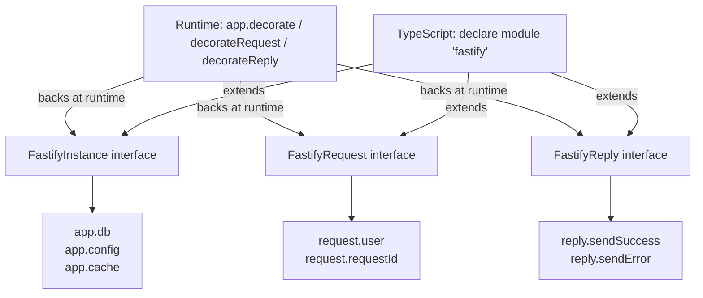

## Augmenting Fastify Types

Fastify exposes three primary extension points for TypeScript augmentation: `FastifyRequest`, `FastifyReply`, and `FastifyInstance`. Each corresponds to a decorator target at runtime. Type augmentation ensures that properties added via decorators or plugins are visible to TypeScript without casting.

---

### The Decorator–Augmentation Contract

At runtime, Fastify's `.decorate()`, `.decorateRequest()`, and `.decorateReply()` add properties to the instance, request, or reply objects. TypeScript does not know about these additions unless you explicitly extend the corresponding interface.

The pattern is always:

1. Register the decorator at runtime with Fastify's API
2. Extend the corresponding Fastify interface in TypeScript
3. The property becomes available without casting in any handler or hook that receives that object

[Inference] If either step is missing, the result is either a runtime property with no type (TypeScript uses `any` or errors), or a type with no runtime backing (access returns `undefined` silently). Both are silent failure modes.

---

### Augmenting `FastifyRequest`

The most common augmentation. Used when a hook (e.g., `preHandler`) attaches data to the request that downstream handlers consume.

#### Runtime decorator registration

```typescript
// app.ts
import Fastify from 'fastify';

const app = Fastify();

app.decorateRequest('user', null);
```

#### TypeScript interface extension

```typescript
// types/fastify.d.ts
import 'fastify';

declare module 'fastify' {
  interface FastifyRequest {
    user: {
      id: string;
      role: 'admin' | 'member';
    } | null;
  }
}
```

#### Usage in a hook and handler

```typescript
app.addHook('preHandler', async (request) => {
  // Attach user after verifying JWT, session, etc.
  request.user = { id: 'abc', role: 'admin' };
});

app.get('/profile', async (request) => {
  const user = request.user; // { id: string; role: 'admin' | 'member' } | null
  if (!user) {
    throw new Error('Unauthenticated');
  }
  return { id: user.id };
});
```

**Key Points:**
- `decorateRequest` must be called before any route or hook that reads the property
- The initial value passed to `decorateRequest` (`null` here) is used as the default for every new request; for objects, [Inference] pass `null` rather than `{}` to avoid shared mutable state across requests — Fastify's documentation warns against passing reference types as initial values
- The `.d.ts` file must be included in your `tsconfig.json`'s `include` array or be otherwise reachable by the TypeScript compiler

---

### Augmenting `FastifyReply`

Less common than request augmentation, but the pattern is identical. Useful when a plugin adds a helper method to `reply`.

#### Runtime decorator

```typescript
app.decorateReply('sendSuccess', function (this: FastifyReply, data: unknown) {
  return this.status(200).send({ success: true, data });
});
```

Note: use a regular function (not an arrow function) when using `this` to refer to the reply instance. Arrow functions do not bind `this`.

#### TypeScript interface extension

```typescript
// types/fastify.d.ts
import 'fastify';
import { FastifyReply } from 'fastify';

declare module 'fastify' {
  interface FastifyReply {
    sendSuccess(data: unknown): FastifyReply;
  }
}
```

#### Usage

```typescript
app.get('/ok', async (request, reply) => {
  return reply.sendSuccess({ status: 'running' });
});
```

---

### Augmenting `FastifyInstance`

Used when a plugin adds utilities, clients, configuration, or shared state to the application instance itself.

#### Runtime decorator

```typescript
import { PrismaClient } from '@prisma/client';

const prisma = new PrismaClient();
app.decorate('db', prisma);
```

#### TypeScript interface extension

```typescript
// types/fastify.d.ts
import 'fastify';
import { PrismaClient } from '@prisma/client';

declare module 'fastify' {
  interface FastifyInstance {
    db: PrismaClient;
  }
}
```

#### Usage in a plugin

```typescript
app.get('/users', async (request) => {
  const users = await app.db.user.findMany();
  return users;
});
```

**Key Points:**
- `app.db` is typed as `PrismaClient` without any cast
- In encapsulated plugins (using `fastify-plugin` or scoped plugins), the decorated value may not be visible on the instance depending on plugin scope — [Inference] type augmentation does not reflect plugin encapsulation boundaries; TypeScript will allow access that may not exist at runtime in a scoped context

---

### Declaring Types in a `.d.ts` File

All augmentations should live in a dedicated declaration file, not in a `.ts` source file, to avoid import side effects and keep augmentations globally available.

```
src/
  types/
    fastify.d.ts   ← all Fastify interface extensions
  routes/
    users.ts
  app.ts
tsconfig.json
```

The file must import `'fastify'` before the `declare module` block to ensure it is treated as a module augmentation rather than a global declaration:

```typescript
// src/types/fastify.d.ts
import 'fastify';

declare module 'fastify' {
  interface FastifyRequest {
    user: { id: string; role: string } | null;
    requestId: string;
  }

  interface FastifyReply {
    sendSuccess(data: unknown): FastifyReply;
    sendError(code: number, message: string): FastifyReply;
  }

  interface FastifyInstance {
    db: import('@prisma/client').PrismaClient;
    config: {
      jwtSecret: string;
      port: number;
    };
  }
}
```

**Key Points:**
- The `import 'fastify'` at the top is required; without it the file is an ambient module declaration and the augmentation semantics change
- Using `import(...)` inline (as shown for `PrismaClient`) avoids adding a top-level import that could affect module resolution
- `tsconfig.json` must include this file; the simplest way is to ensure `src/**/*.d.ts` is covered by the `include` glob

---

### Plugin-Scoped Augmentation with `fastify-plugin`

When writing a reusable plugin that decorates the instance, the conventional pattern combines the decorator call with a `.d.ts` augmentation so consumers get types automatically when they import the plugin.

```typescript
// plugins/config.ts
import fp from 'fastify-plugin';
import { FastifyPluginAsync } from 'fastify';

interface Config {
  jwtSecret: string;
  dbUrl: string;
}

declare module 'fastify' {
  interface FastifyInstance {
    config: Config;
  }
}

const configPlugin: FastifyPluginAsync = async (app) => {
  const config: Config = {
    jwtSecret: process.env.JWT_SECRET ?? '',
    dbUrl: process.env.DATABASE_URL ?? '',
  };

  app.decorate('config', config);
};

export default fp(configPlugin, { name: 'config' });
```

**Key Points:**
- Placing the `declare module` block in the same file as the plugin means the augmentation is active whenever the plugin module is imported
- `fp()` from `fastify-plugin` breaks encapsulation so the decoration is visible on the parent instance — without `fp()`, the decoration is scoped to the plugin and [Inference] TypeScript's augmentation will still expose it globally while the runtime value may not be accessible, creating a false type guarantee
- This is the recommended pattern for distributable plugins

---

### Augmenting with Generic Constraints

Some decorations are generic — for example, a caching utility that works on any type. TypeScript augmentation does not support generic interface members added via `declare module` in all cases. The practical workaround is to type the member as broadly as needed and narrow at the call site.

```typescript
declare module 'fastify' {
  interface FastifyInstance {
    cache: {
      get<T>(key: string): Promise<T | null>;
      set<T>(key: string, value: T, ttl?: number): Promise<void>;
    };
  }
}
```

Usage:

```typescript
const user = await app.cache.get<{ id: string }>('user:1');
// user: { id: string } | null
```

---

### Diagram: Augmentation Architecture



---

### Common Mistakes and Their Effects

| Mistake | Effect |
|---|---|
| Augmenting without a runtime `decorate` call | TypeScript allows access; runtime returns `undefined` |
| Runtime `decorate` without augmentation | Property exists at runtime; TypeScript errors on access |
| Using arrow function in `decorateReply` with `this` | `this` is not bound to the reply; runtime error |
| `.d.ts` file not included in `tsconfig` | Augmentation is silently ignored; types revert to base |
| Missing `import 'fastify'` at top of `.d.ts` | File treated as ambient; augmentation may not merge correctly |
| Decorating inside a scoped plugin without `fastify-plugin` | Decoration not visible on parent instance at runtime; types say it is |

---

### Checking Augmentation is Active

A quick compile-time check — if augmentation is working, hovering over `request.user` in an editor should show the declared type, not `any` or an error. At runtime:

```typescript
app.addHook('onReady', async () => {
  console.log(typeof app.db);     // should print 'object', not 'undefined'
  console.log(typeof app.config); // same
});
```

[Inference] If these print `undefined`, the runtime decorator was not registered before `app.ready()` was called, or the plugin that registers it was not loaded.

---

**Related Topics:**
- `fastify-plugin` encapsulation model — understanding scope boundaries and when decorations are visible
- Typed environment configuration plugins — combining `declare module` with env validation (e.g., `env-schema`, `dotenv`)
- Hook typing — how `preHandler`, `onRequest`, and other hooks receive augmented request/reply types
- JWT and session authentication plugins — practical example of `decorateRequest('user', null)` in production
- Writing distributable typed Fastify plugins — packaging `.d.ts` augmentations for npm