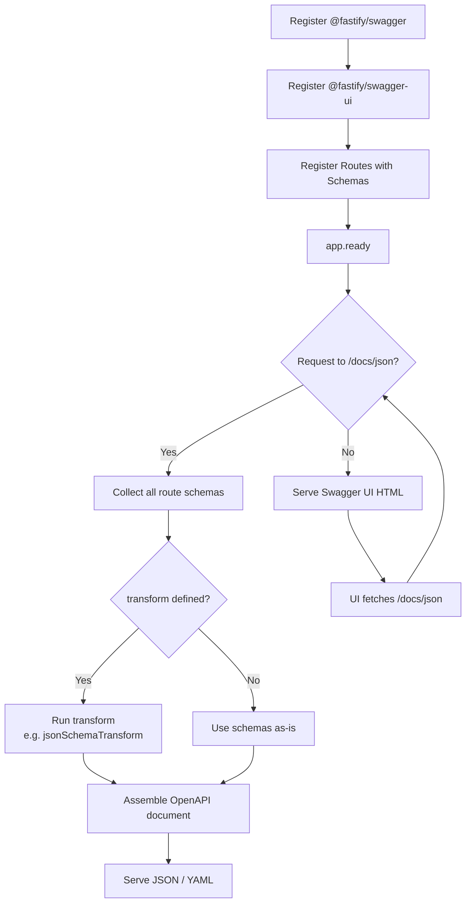

## Swagger Integration with @fastify/swagger

`@fastify/swagger` generates OpenAPI documentation from Fastify route schemas. It does not require you to write OpenAPI YAML or JSON by hand — schemas declared on routes are collected and transformed into a valid OpenAPI document at runtime. A companion plugin, `@fastify/swagger-ui`, serves the documentation as an interactive browser UI.

---

### Installation

```bash
npm install @fastify/swagger @fastify/swagger-ui
```

Both are official Fastify plugins maintained under the Fastify organization.

---

### Basic Setup

Plugins must be registered in order: `@fastify/swagger` before `@fastify/swagger-ui`, and both before routes whose schemas should appear in the documentation.

```typescript
import Fastify from 'fastify';
import fastifySwagger from '@fastify/swagger';
import fastifySwaggerUi from '@fastify/swagger-ui';

const app = Fastify({ logger: true });

await app.register(fastifySwagger, {
  openapi: {
    info: {
      title: 'My API',
      description: 'API documentation',
      version: '1.0.0',
    },
    servers: [{ url: 'http://localhost:3000' }],
  },
});

await app.register(fastifySwaggerUi, {
  routePrefix: '/docs',
});

app.get(
  '/hello',
  {
    schema: {
      response: {
        200: {
          type: 'object',
          properties: {
            message: { type: 'string' },
          },
        },
      },
    },
  },
  async () => ({ message: 'hello' })
);

await app.listen({ port: 3000 });
```

Visiting `http://localhost:3000/docs` serves the Swagger UI. The raw OpenAPI JSON is available at `http://localhost:3000/docs/json` and YAML at `http://localhost:3000/docs/yaml` by default.

**Key Points:**
- Plugin registration order matters; routes registered before `@fastify/swagger` [Inference] may not appear in the generated document
- `@fastify/swagger-ui` is optional — you can use the raw JSON/YAML output with any external OpenAPI tooling
- The `openapi` key in the swagger config selects OpenAPI 3.x format; omitting it and using `swagger: '2.0'` selects Swagger 2.0 format

---

### OpenAPI Object Structure

The `openapi` configuration block maps directly to the OpenAPI 3.x specification object.

```typescript
await app.register(fastifySwagger, {
  openapi: {
    openapi: '3.0.3',
    info: {
      title: 'Inventory API',
      description: 'Manages product inventory',
      termsOfService: 'https://example.com/terms',
      contact: {
        name: 'API Support',
        email: 'support@example.com',
      },
      license: {
        name: 'MIT',
      },
      version: '2.1.0',
    },
    servers: [
      { url: 'https://api.example.com', description: 'Production' },
      { url: 'http://localhost:3000', description: 'Local development' },
    ],
    tags: [
      { name: 'products', description: 'Product operations' },
      { name: 'orders', description: 'Order operations' },
    ],
    components: {
      securitySchemes: {
        bearerAuth: {
          type: 'http',
          scheme: 'bearer',
          bearerFormat: 'JWT',
        },
      },
    },
  },
});
```

---

### Route-Level Schema Annotations

Standard JSON Schema on route schemas is collected automatically. Additional OpenAPI-specific metadata is added via the `schema` object using keys that `@fastify/swagger` recognizes.

```typescript
app.post(
  '/products',
  {
    schema: {
      tags: ['products'],
      summary: 'Create a product',
      description: 'Creates a new product entry in the inventory.',
      security: [{ bearerAuth: [] }],
      body: {
        type: 'object',
        required: ['name', 'price'],
        properties: {
          name: { type: 'string', description: 'Product display name' },
          price: { type: 'number', minimum: 0 },
          sku: { type: 'string', description: 'Stock keeping unit' },
        },
      },
      response: {
        201: {
          description: 'Product created',
          type: 'object',
          properties: {
            id: { type: 'string', format: 'uuid' },
            name: { type: 'string' },
          },
        },
        400: {
          description: 'Validation error',
          type: 'object',
          properties: {
            error: { type: 'string' },
          },
        },
      },
    },
  },
  async (request, reply) => {
    reply.status(201).send({ id: 'some-uuid', name: request.body.name });
  }
);
```

**Key Points:**
- `tags` groups routes in the Swagger UI sidebar
- `summary` is the short one-line label shown in the route list
- `description` supports Markdown in most Swagger UI renderers
- `security` references schemes declared in `components.securitySchemes`
- Multiple response codes can be documented; each should include a `description`

---

### Reusable Schemas with `$ref`

Fastify allows registering shared schemas that can be referenced with `$ref` across routes. `@fastify/swagger` resolves these references in the output document.

```typescript
app.addSchema({
  $id: 'Product',
  type: 'object',
  properties: {
    id: { type: 'string', format: 'uuid' },
    name: { type: 'string' },
    price: { type: 'number' },
  },
});

app.get(
  '/products/:id',
  {
    schema: {
      tags: ['products'],
      params: {
        type: 'object',
        properties: {
          id: { type: 'string', format: 'uuid' },
        },
      },
      response: {
        200: { $ref: 'Product#' },
      },
    },
  },
  async (request) => {
    return { id: request.params.id, name: 'Widget', price: 9.99 };
  }
);
```

**Key Points:**
- `$id` on the schema must be unique across the application
- The `$ref` value is `'SchemaId#'` — the `#` refers to the root of the schema
- [Inference] Shared schemas registered with `addSchema` appear in the `components/schemas` section of the generated OpenAPI document; verify in the output JSON if this matters for your tooling
- Sub-paths are supported: `'Product#/properties/name'` references a nested property

---

### Zod Integration with `jsonSchemaTransform`

When using `fastify-type-provider-zod`, Zod schemas must be transformed to JSON Schema for the OpenAPI output. The `jsonSchemaTransform` utility handles this at the documentation generation stage.

```typescript
import {
  ZodTypeProvider,
  serializerCompiler,
  validatorCompiler,
  jsonSchemaTransform,
} from 'fastify-type-provider-zod';
import { z } from 'zod';

const app = Fastify().withTypeProvider<ZodTypeProvider>();
app.setValidatorCompiler(validatorCompiler);
app.setSerializerCompiler(serializerCompiler);

await app.register(fastifySwagger, {
  openapi: {
    info: { title: 'Zod API', version: '1.0.0' },
  },
  transform: jsonSchemaTransform,
});

await app.register(fastifySwaggerUi, { routePrefix: '/docs' });

app.post(
  '/items',
  {
    schema: {
      tags: ['items'],
      body: z.object({
        name: z.string().min(1),
        quantity: z.number().int().positive(),
      }),
      response: {
        201: z.object({
          id: z.string().uuid(),
          name: z.string(),
        }),
      },
    },
  },
  async (request, reply) => {
    reply.status(201).send({ id: 'uuid-here', name: request.body.name });
  }
);
```

**Key Points:**
- `transform: jsonSchemaTransform` is passed to `@fastify/swagger`, not to the Zod type provider
- The transform runs at documentation generation time, not at request time
- [Inference] Not all Zod features have clean JSON Schema equivalents; `.transform()`, `.refine()`, and some branded types may produce incomplete or simplified output in the generated document — review the `/docs/json` output to confirm accuracy
- TypeBox does not require a transform because its schemas are already JSON Schema

---

### Hiding Routes from Documentation

Routes can be excluded from the generated OpenAPI document using the `hide` property on the schema.

```typescript
app.get(
  '/internal/health',
  {
    schema: {
      hide: true,
    },
  },
  async () => ({ status: 'ok' })
);
```

Routes without any schema are [Inference] also excluded from the generated document by default, though behavior may vary across versions — explicitly setting `hide: true` is unambiguous.

---

### Security Schemes and Route-Level Security

Global security can be applied to all routes, or declared per-route.

```typescript
// Global default security (applies to all routes unless overridden)
await app.register(fastifySwagger, {
  openapi: {
    info: { title: 'Secure API', version: '1.0.0' },
    components: {
      securitySchemes: {
        apiKey: {
          type: 'apiKey',
          name: 'x-api-key',
          in: 'header',
        },
        bearerAuth: {
          type: 'http',
          scheme: 'bearer',
          bearerFormat: 'JWT',
        },
      },
    },
    security: [{ apiKey: [] }], // global default
  },
});

// Route-level override
app.get(
  '/public/status',
  {
    schema: {
      security: [], // empty array removes security requirement for this route
    },
  },
  async () => ({ status: 'ok' })
);

app.get(
  '/private/data',
  {
    schema: {
      security: [{ bearerAuth: [] }], // overrides global default
    },
  },
  async () => ({ data: 'secret' })
);
```

---

### Swagger UI Configuration

`@fastify/swagger-ui` accepts options to customize the UI behavior.

```typescript
await app.register(fastifySwaggerUi, {
  routePrefix: '/docs',
  uiConfig: {
    docExpansion: 'list',        // 'full' | 'list' | 'none'
    deepLinking: true,
    defaultModelsExpandDepth: 2,
    defaultModelExpandDepth: 2,
    displayRequestDuration: true,
    filter: true,                // enables search bar
    showExtensions: true,
  },
  uiHooks: {
    onRequest: async (request, reply) => {
      // guard the docs behind auth if needed
    },
  },
  staticCSP: true,             // adds Content-Security-Policy header
  transformStaticCSP: (header) => header,
});
```

**Key Points:**
- `uiHooks` accepts Fastify lifecycle hooks applied only to the documentation routes — useful for restricting access to `/docs` in production
- `staticCSP: true` sets a restrictive CSP; if the UI fails to load assets, [Inference] a custom `transformStaticCSP` may be needed to relax it
- `docExpansion: 'none'` collapses all routes by default, which is practical for large APIs

---

### Accessing the Generated Document Programmatically

The OpenAPI document is available on the Fastify instance after `app.ready()`.

```typescript
await app.ready();

const document = app.swagger();
// document is the full OpenAPI object as a JavaScript object

const documentJson = JSON.stringify(document, null, 2);
// write to file, send to external registry, etc.
```

**Example — writing the spec to disk during build:**

```typescript
import { writeFileSync } from 'fs';

await app.ready();
writeFileSync('./openapi.json', JSON.stringify(app.swagger(), null, 2));
await app.close();
```

**Key Points:**
- `app.swagger()` returns the document as an object; `app.swagger({ yaml: true })` returns it as a YAML string
- This pattern is useful for CI pipelines that publish the spec to an API registry or run contract tests
- The document is only complete after all plugins and routes are registered — call it after `app.ready()`

---

### Diagram: Plugin and Document Generation Flow



---

### Common Mistakes

| Mistake | Effect |
|---|---|
| Registering routes before `@fastify/swagger` | Routes [Inference] may not appear in the generated document |
| Using Zod schemas without `jsonSchemaTransform` | Raw Zod objects appear in the output; document is malformed |
| Omitting `description` on response codes | OpenAPI spec is technically invalid; some validators will reject it |
| Referencing an undeclared `securityScheme` in a route | [Inference] The UI renders the lock icon but the scheme is undefined; tooling may warn |
| Calling `app.swagger()` before `app.ready()` | Document is incomplete; missing routes registered in plugins |
| Exposing `/docs` in production without access control | API structure is visible to anyone; use `uiHooks.onRequest` to guard it |

---

**Related Topics:**
- `@fastify/swagger` `transform` API — custom schema transformation beyond Zod and TypeBox
- Contract testing with the generated OpenAPI document — using the spec output in CI with tools like Dredd or Schemathesis
- `addSchema` and `$ref` patterns — building a shared schema library across a large API
- OpenAPI 3.1 vs 3.0 differences — `@fastify/swagger` support status for 3.1 features
- Authentication plugin integration — combining `@fastify/jwt` with Swagger security schemes end-to-end
- API versioning strategies in Fastify — managing multiple OpenAPI documents for versioned routes