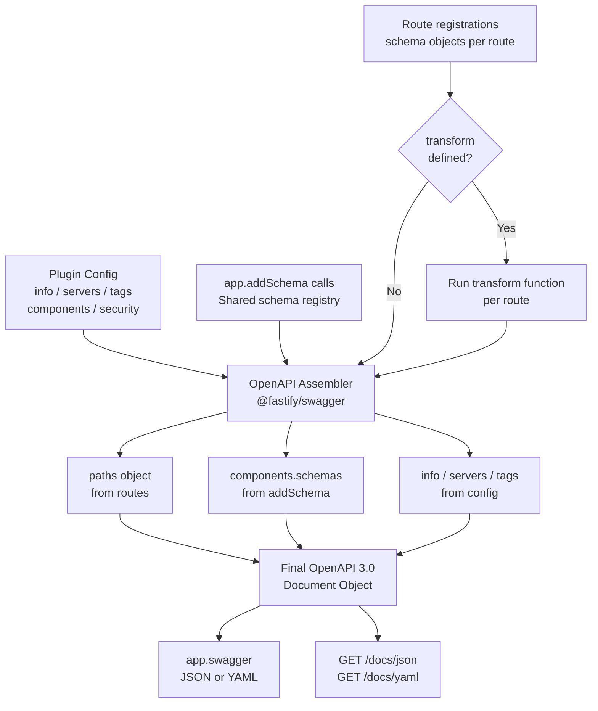

## Generating OpenAPI 3.0 Specs

`@fastify/swagger` produces an OpenAPI 3.0 document by collecting route schemas registered across the application. The output is a fully structured OpenAPI object — not a template you fill in manually, but a document assembled at runtime from schema declarations, plugin configuration, and shared schema registrations. Understanding how the assembly works lets you produce accurate, complete, and standards-compliant specs.

---

### OpenAPI 3.0 Document Structure

A valid OpenAPI 3.0 document has this top-level shape:

```
openapi: "3.0.x"
info: ...
servers: [...]
paths: { "/route": { "get": { ... } } }
components:
  schemas: { ... }
  securitySchemes: { ... }
tags: [...]
```

`@fastify/swagger` constructs each section from different sources:

| Section | Source |
|---|---|
| `openapi` | Version string from plugin config |
| `info` | `info` object in plugin config |
| `servers` | `servers` array in plugin config |
| `paths` | Assembled from registered route schemas |
| `components.schemas` | Schemas registered via `app.addSchema()` |
| `components.securitySchemes` | Declared in plugin config `components` |
| `tags` | Declared in plugin config and/or per-route `schema.tags` |

---

### Plugin Configuration for OpenAPI 3.0

```typescript
import Fastify from 'fastify';
import fastifySwagger from '@fastify/swagger';

const app = Fastify();

await app.register(fastifySwagger, {
  openapi: {
    openapi: '3.0.3',
    info: {
      title: 'Inventory API',
      description: 'Manages product inventory.\n\nSupports **Markdown** in descriptions.',
      termsOfService: 'https://example.com/terms',
      contact: {
        name: 'API Support',
        url: 'https://example.com/support',
        email: 'api@example.com',
      },
      license: {
        name: 'Apache 2.0',
        url: 'https://www.apache.org/licenses/LICENSE-2.0.html',
      },
      version: '3.1.0',
    },
    servers: [
      {
        url: 'https://api.example.com/v1',
        description: 'Production',
      },
      {
        url: 'https://staging-api.example.com/v1',
        description: 'Staging',
      },
      {
        url: 'http://localhost:3000',
        description: 'Local development',
      },
    ],
    tags: [
      { name: 'products', description: 'Product catalogue operations' },
      { name: 'orders', description: 'Order lifecycle operations' },
      { name: 'auth', description: 'Authentication endpoints' },
    ],
    components: {
      securitySchemes: {
        bearerAuth: {
          type: 'http',
          scheme: 'bearer',
          bearerFormat: 'JWT',
        },
        apiKey: {
          type: 'apiKey',
          name: 'x-api-key',
          in: 'header',
        },
        oauth2: {
          type: 'oauth2',
          flows: {
            authorizationCode: {
              authorizationUrl: 'https://auth.example.com/authorize',
              tokenUrl: 'https://auth.example.com/token',
              scopes: {
                'read:products': 'Read product data',
                'write:products': 'Create and modify products',
              },
            },
          },
        },
      },
    },
    externalDocs: {
      description: 'Full developer documentation',
      url: 'https://docs.example.com',
    },
  },
});
```

---

### Path Item Generation from Routes

Each registered route becomes a path item in the `paths` object. The HTTP method and route URL are the primary keys. Schema fields map to specific OpenAPI path item fields.

```typescript
app.put(
  '/products/:id',
  {
    schema: {
      // OpenAPI operation metadata
      operationId: 'updateProduct',
      tags: ['products'],
      summary: 'Update a product',
      description: 'Replaces all fields of an existing product.',
      deprecated: false,
      security: [{ bearerAuth: [] }],

      // Maps to OpenAPI 'parameters'
      params: {
        type: 'object',
        properties: {
          id: {
            type: 'string',
            format: 'uuid',
            description: 'The product UUID',
          },
        },
        required: ['id'],
      },

      // Maps to OpenAPI 'requestBody'
      body: {
        type: 'object',
        required: ['name', 'price'],
        properties: {
          name: { type: 'string', minLength: 1, maxLength: 200 },
          price: { type: 'number', minimum: 0, exclusiveMinimum: true },
          tags: {
            type: 'array',
            items: { type: 'string' },
            uniqueItems: true,
          },
        },
      },

      // Maps to OpenAPI 'responses'
      response: {
        200: {
          description: 'Product updated successfully',
          type: 'object',
          properties: {
            id: { type: 'string', format: 'uuid' },
            name: { type: 'string' },
            price: { type: 'number' },
          },
        },
        404: {
          description: 'Product not found',
          type: 'object',
          properties: {
            error: { type: 'string' },
            statusCode: { type: 'integer' },
          },
        },
        422: {
          description: 'Validation error',
          type: 'object',
          properties: {
            error: { type: 'string' },
            details: { type: 'array', items: { type: 'string' } },
          },
        },
      },
    },
  },
  async (request, reply) => {
    reply.send({ id: request.params.id, name: 'Updated', price: 9.99 });
  }
);
```

**Key Points:**
- `operationId` should be unique across the document; [Inference] `@fastify/swagger` does not enforce uniqueness — duplicates will produce a technically invalid document
- `deprecated: true` marks the operation in the UI with a visual indicator
- Each response code entry should include `description`; without it the document is technically non-conformant with the OpenAPI 3.0 spec
- Query string parameters use the `querystring` key in Fastify's schema but map to `parameters` with `in: 'query'` in the output document

---

### `components/schemas` via `addSchema`

Shared schemas registered with `app.addSchema()` are collected into `components/schemas` in the output document and can be referenced with `$ref`.

```typescript
// Register shared schemas before routes
app.addSchema({
  $id: 'Address',
  type: 'object',
  required: ['street', 'city', 'country'],
  properties: {
    street: { type: 'string' },
    city: { type: 'string' },
    country: { type: 'string', minLength: 2, maxLength: 2 },
    postalCode: { type: 'string' },
  },
});

app.addSchema({
  $id: 'PaginationMeta',
  type: 'object',
  properties: {
    total: { type: 'integer', minimum: 0 },
    page: { type: 'integer', minimum: 1 },
    perPage: { type: 'integer', minimum: 1 },
    totalPages: { type: 'integer', minimum: 0 },
  },
});

// Reference in a route
app.post(
  '/customers',
  {
    schema: {
      tags: ['customers'],
      body: {
        type: 'object',
        properties: {
          name: { type: 'string' },
          billingAddress: { $ref: 'Address#' },
          shippingAddress: { $ref: 'Address#' },
        },
      },
      response: {
        200: {
          type: 'object',
          properties: {
            data: {
              type: 'array',
              items: {
                type: 'object',
                properties: {
                  id: { type: 'string' },
                  name: { type: 'string' },
                },
              },
            },
            meta: { $ref: 'PaginationMeta#' },
          },
        },
      },
    },
  },
  async () => ({ data: [], meta: { total: 0, page: 1, perPage: 20, totalPages: 0 } })
);
```

**Key Points:**
- `$id` becomes the key under `components/schemas` in the output
- `$ref: 'SchemaId#'` — the `#` is required and refers to the root of the referenced schema
- Nested `$ref` paths like `$ref: 'Address#/properties/city'` reference sub-schemas
- [Inference] Schemas not referenced by any route may or may not appear in `components/schemas` depending on the version of `@fastify/swagger` — verify in the output if you depend on unreferenced schemas being present

---

### Query Parameters with Descriptions

Fastify's `querystring` schema maps to OpenAPI `parameters` with `in: 'query'`. Individual property descriptions become the parameter description.

```typescript
app.get(
  '/products',
  {
    schema: {
      tags: ['products'],
      querystring: {
        type: 'object',
        properties: {
          page: {
            type: 'integer',
            minimum: 1,
            default: 1,
            description: 'Page number (1-indexed)',
          },
          perPage: {
            type: 'integer',
            minimum: 1,
            maximum: 100,
            default: 20,
            description: 'Results per page',
          },
          search: {
            type: 'string',
            description: 'Filter by name (partial match)',
          },
          status: {
            type: 'string',
            enum: ['active', 'archived', 'draft'],
            description: 'Filter by product status',
          },
        },
      },
      response: {
        200: {
          description: 'Paginated product list',
          type: 'object',
          properties: {
            data: { type: 'array', items: { $ref: 'Product#' } },
            meta: { $ref: 'PaginationMeta#' },
          },
        },
      },
    },
  },
  async () => ({ data: [], meta: {} })
);
```

---

### Request Body Content Types

By default, `@fastify/swagger` sets `requestBody.content` to `application/json`. To document alternative content types, use the `consumes` extension or declare the body schema using OpenAPI extensions.

```typescript
app.post(
  '/uploads',
  {
    schema: {
      tags: ['files'],
      consumes: ['multipart/form-data'],
      body: {
        type: 'object',
        properties: {
          file: { type: 'string', format: 'binary' },
          description: { type: 'string' },
        },
      },
      response: {
        200: {
          description: 'Upload successful',
          type: 'object',
          properties: {
            fileId: { type: 'string' },
          },
        },
      },
    },
  },
  async () => ({ fileId: 'abc' })
);
```

**Key Points:**
- `format: 'binary'` is the OpenAPI 3.0 convention for file upload fields
- `consumes` is a Fastify-swagger extension that sets the `content` key of the `requestBody` in the output
- [Inference] Actual multipart handling at runtime is separate — `@fastify/multipart` handles the parsing; the schema here is documentation only

---

### Exporting the Document

The generated document is accessible programmatically after `app.ready()`.

```typescript
await app.ready();

// As a JavaScript object
const spec = app.swagger();

// As formatted JSON string
const specJson = JSON.stringify(spec, null, 2);

// As YAML string
const specYaml = app.swagger({ yaml: true });
```

#### Writing to disk for CI or tooling

```typescript
import { writeFileSync } from 'fs';
import path from 'path';

const app = Fastify();
// ... register plugins and routes ...

await app.ready();

const outputDir = path.resolve('./api-spec');
writeFileSync(path.join(outputDir, 'openapi.json'), JSON.stringify(app.swagger(), null, 2));
writeFileSync(path.join(outputDir, 'openapi.yaml'), app.swagger({ yaml: true }));

console.log('OpenAPI spec written.');
await app.close();
```

**Key Points:**
- `app.swagger()` must be called after `app.ready()` — plugins and routes registered in async plugins may not be loaded before that point
- The JSON output is a plain object; write it with `JSON.stringify`, not a stream
- [Inference] The YAML output requires `@fastify/swagger` to have a YAML serializer available — this is bundled with the plugin but worth verifying if using a trimmed install

---

### Using `transform` for Custom Schema Conversion

The `transform` option intercepts each route's schema before it enters the OpenAPI document. This is where Zod's `jsonSchemaTransform` hooks in, but it can also be used for custom logic.

```typescript
await app.register(fastifySwagger, {
  openapi: {
    info: { title: 'My API', version: '1.0.0' },
  },
  transform: ({ schema, url }) => {
    // schema: the raw route schema object
    // url: the route URL string

    // Example: strip internal routes from docs
    if (url.startsWith('/internal')) {
      return { schema: { ...schema, hide: true }, url };
    }

    // Example: inject a standard error response on all routes
    const transformed = {
      ...schema,
      response: {
        500: {
          description: 'Internal server error',
          type: 'object',
          properties: { error: { type: 'string' } },
        },
        ...schema.response,
      },
    };

    return { schema: transformed, url };
  },
});
```

**Key Points:**
- `transform` receives `{ schema, url }` and must return the same shape
- It runs per-route at document generation time, not at request time
- Returning `{ schema: { ...schema, hide: true }, url }` excludes the route from the document
- [Inference] Mutations inside `transform` do not affect runtime validation — only the documentation output

---

### Validating the Generated Document

The generated spec can be validated against the OpenAPI 3.0 specification using external tools.

```bash
# Using @redocly/cli
npx @redocly/cli lint openapi.json

# Using swagger-cli
npx @apidevtools/swagger-cli validate openapi.json

# Using vacuum (fast linter)
npx vacuum lint openapi.json
```

Common validation failures from Fastify-generated specs:

| Issue | Cause |
|---|---|
| Missing `description` on response codes | Response schema has no `description` field |
| Duplicate `operationId` values | Two routes share the same `operationId` string |
| Unresolved `$ref` | `addSchema` call missing or `$id` mismatch |
| Invalid `format` value | Non-standard format string used in a property |
| Missing `required` on body with required fields | JSON Schema `required` array omitted |

---

### Diagram: Document Assembly Pipeline



---

### Common Mistakes

| Mistake | Effect |
|---|---|
| Omitting `description` on response entries | Technically invalid OpenAPI 3.0; linters will flag it |
| Non-unique `operationId` values | Invalid document; code generators may error or produce collisions |
| Calling `app.swagger()` before `app.ready()` | Missing routes from async plugins; incomplete document |
| `$ref` pointing to an unregistered `$id` | Unresolved reference; linters error, UI may fail to render |
| Forgetting `required` arrays in body schemas | Fields appear optional in generated docs regardless of runtime validation |
| Using Zod schemas without `jsonSchemaTransform` | Raw Zod internals appear in the spec; document is malformed |
| Adding `servers` entries with trailing slashes | [Inference] Some tooling concatenates server URL and path verbatim, producing double slashes |

---

**Related Topics:**
- OpenAPI 3.1 differences — `nullable` removal, `$schema` keyword, JSON Schema alignment changes
- Contract testing with Schemathesis or Dredd — using the exported spec to drive integration tests
- Code generation from the spec — using `openapi-typescript`, `orval`, or `swagger-codegen` against the output
- `@fastify/swagger` `transformObject` option — modifying the entire assembled document rather than per-route schemas
- Versioned API specs — generating separate documents for `/v1` and `/v2` route namespaces
- Redoc rendering — alternative to Swagger UI for presenting the OpenAPI document