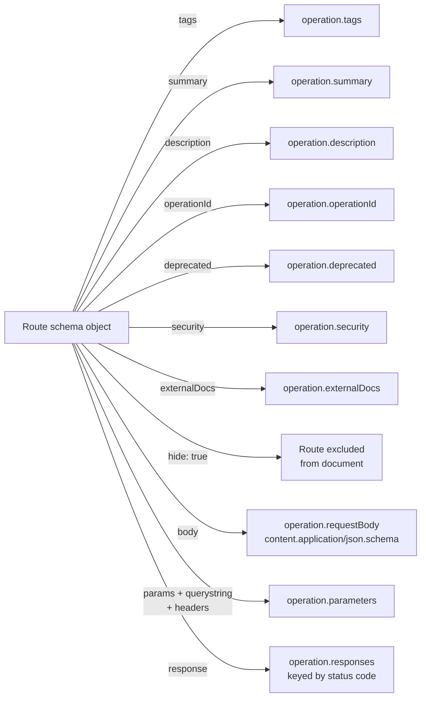

## Documenting Routes with Schema Metadata

Route schema metadata is the mechanism by which `@fastify/swagger` knows what to put in the OpenAPI document beyond the raw input/output shapes. Every piece of human-readable documentation — summaries, descriptions, examples, deprecation notices, tags — is declared inline on the route's `schema` object. This keeps documentation co-located with the route definition and eliminates the need for a separate documentation authoring step.

---

### The `schema` Object as Documentation Surface

Fastify's `schema` option serves two simultaneous purposes: runtime validation and documentation generation. The same object drives both. Fields recognized by Ajv (or the active type provider) affect validation; fields recognized by `@fastify/swagger` affect the OpenAPI output; fields recognized by both affect both.

| Field | Affects validation | Affects docs |
|---|---|---|
| `body`, `params`, `querystring`, `headers` | Yes | Yes — becomes `requestBody` / `parameters` |
| `response` | Yes (serialization) | Yes — becomes `responses` |
| `tags` | No | Yes |
| `summary` | No | Yes |
| `description` | No | Yes |
| `operationId` | No | Yes |
| `deprecated` | No | Yes |
| `security` | No | Yes |
| `hide` | No | Yes — excludes route |
| `externalDocs` | No | Yes |

---

### `summary` and `description`

`summary` is the short label shown in the operation list. `description` is the longer explanation shown when an operation is expanded. Both are plain strings; `description` supports Markdown in most renderers.

```typescript
app.get(
  '/orders/:id',
  {
    schema: {
      summary: 'Get order by ID',
      description: `Retrieves a single order by its UUID.

**Notes:**
- Archived orders are returned with \`status: "archived"\`
- Orders older than 90 days may have truncated line items
- Response time may be higher for orders with more than 50 line items`,
      tags: ['orders'],
    },
  },
  async (request) => {
    return { id: request.params.id };
  }
);
```

**Key Points:**
- `summary` should be a single line, imperative phrasing ("Get order by ID" not "This endpoint gets an order")
- `description` is optional but strongly recommended for non-trivial routes
- Markdown in `description` is rendered by Swagger UI and Redoc but is not part of the OpenAPI spec itself — [Inference] renderers that do not support Markdown will display raw Markdown syntax

---

### `tags`

Tags group operations in the Swagger UI sidebar and in generated client code. Each tag is a string that must match a tag name declared in the top-level `tags` array of the swagger plugin config to get a description — but unmatched tags still appear in the UI.

```typescript
// Declared globally in plugin config
await app.register(fastifySwagger, {
  openapi: {
    info: { title: 'Shop API', version: '1.0.0' },
    tags: [
      { name: 'products', description: 'Product catalogue management' },
      { name: 'orders', description: 'Order processing and history' },
      { name: 'auth', description: 'Authentication and token management' },
    ],
  },
});

// Used per-route
app.post('/products', { schema: { tags: ['products'], summary: 'Create product' } }, handler);
app.get('/products', { schema: { tags: ['products'], summary: 'List products' } }, handler);
app.post('/auth/login', { schema: { tags: ['auth'], summary: 'Authenticate user' } }, handler);
```

**Key Points:**
- A route can have multiple tags: `tags: ['products', 'admin']`
- Routes with no `tags` field [Inference] appear under a default ungrouped section in the UI — its label varies by renderer
- Tag order in the UI follows the order of the top-level `tags` array in the plugin config, not the order routes are registered

---

### `operationId`

`operationId` is a unique string identifier for an operation across the entire document. It is used by code generators to name generated functions or methods.

```typescript
app.get(
  '/products/:id',
  {
    schema: {
      operationId: 'getProductById',
      tags: ['products'],
      summary: 'Get product',
    },
  },
  handler
);

app.put(
  '/products/:id',
  {
    schema: {
      operationId: 'updateProduct',
      tags: ['products'],
      summary: 'Update product',
    },
  },
  handler
);
```

**Key Points:**
- Must be unique across the entire document — `@fastify/swagger` does not enforce this; duplicate `operationId` values produce a technically invalid document
- Convention is camelCase verb + noun: `getProductById`, `createOrder`, `deleteUser`
- [Inference] When using `openapi-typescript` or `orval` for client generation, `operationId` becomes the generated function name; meaningful names here directly affect the quality of generated clients
- If omitted, code generators may derive a name from the method and path, often producing verbose or inconsistent results

---

### `deprecated`

Marks an operation as deprecated in the OpenAPI document. Swagger UI renders deprecated operations with a visual strikethrough or warning.

```typescript
app.get(
  '/v1/items',
  {
    schema: {
      operationId: 'listItemsV1',
      tags: ['items'],
      summary: 'List items (deprecated)',
      description: `**Deprecated.** Use \`GET /v2/items\` instead.

This endpoint will be removed on 2026-12-01.`,
      deprecated: true,
    },
  },
  handler
);
```

---

### `externalDocs`

Links an operation to an external documentation page. Appears as a link in Swagger UI when the operation is expanded.

```typescript
app.get(
  '/webhooks/events',
  {
    schema: {
      tags: ['webhooks'],
      summary: 'List webhook event types',
      externalDocs: {
        description: 'Webhook integration guide',
        url: 'https://docs.example.com/webhooks',
      },
    },
  },
  handler
);
```

---

### `security`

Declares which security schemes apply to a specific operation. Overrides any global `security` declared in the plugin config for that operation.

```typescript
// Empty array = no security required (overrides global)
app.get(
  '/public/status',
  {
    schema: {
      tags: ['system'],
      summary: 'Health check',
      security: [],
    },
  },
  async () => ({ status: 'ok' })
);

// Single scheme
app.get(
  '/orders',
  {
    schema: {
      tags: ['orders'],
      summary: 'List orders',
      security: [{ bearerAuth: [] }],
    },
  },
  handler
);

// Multiple schemes (consumer must satisfy all)
app.delete(
  '/admin/users/:id',
  {
    schema: {
      tags: ['admin'],
      summary: 'Delete user',
      security: [{ bearerAuth: [], apiKey: [] }],
    },
  },
  handler
);

// Alternative schemes (consumer satisfies any one)
app.get(
  '/reports',
  {
    schema: {
      tags: ['reports'],
      summary: 'Get report',
      security: [{ bearerAuth: [] }, { apiKey: [] }],
    },
  },
  handler
);
```

**Key Points:**
- Multiple objects in the `security` array means OR — any one scheme is sufficient
- Multiple keys within one object means AND — all named schemes must be satisfied
- Scheme names must match keys declared in `components.securitySchemes`
- [Inference] `security: []` does not disable runtime authentication — it only affects documentation; your hooks and guards still run regardless

---

### Property-Level Descriptions and Examples

Individual schema properties accept `description`, `example`, `default`, `enum`, and other annotation keywords that appear in the generated docs.

```typescript
app.post(
  '/products',
  {
    schema: {
      tags: ['products'],
      summary: 'Create product',
      body: {
        type: 'object',
        required: ['name', 'price', 'category'],
        properties: {
          name: {
            type: 'string',
            minLength: 1,
            maxLength: 200,
            description: 'Display name shown to customers',
            example: 'Wireless Keyboard',
          },
          price: {
            type: 'number',
            minimum: 0,
            description: 'Price in USD, excluding tax',
            example: 49.99,
          },
          category: {
            type: 'string',
            enum: ['electronics', 'clothing', 'food', 'books'],
            description: 'Top-level product category',
            example: 'electronics',
          },
          sku: {
            type: 'string',
            pattern: '^[A-Z]{2}-[0-9]{6}$',
            description: 'Stock keeping unit. Format: two uppercase letters, hyphen, six digits.',
            example: 'EL-004821',
          },
          inStock: {
            type: 'boolean',
            default: true,
            description: 'Whether the product is available for purchase',
          },
          tags: {
            type: 'array',
            items: { type: 'string' },
            uniqueItems: true,
            description: 'Searchable tags attached to the product',
            example: ['wireless', 'peripherals', 'usb-c'],
          },
        },
      },
      response: {
        201: {
          description: 'Product created successfully',
          type: 'object',
          properties: {
            id: {
              type: 'string',
              format: 'uuid',
              description: 'Assigned product UUID',
              example: 'f47ac10b-58cc-4372-a567-0e02b2c3d479',
            },
            name: { type: 'string', example: 'Wireless Keyboard' },
            createdAt: {
              type: 'string',
              format: 'date-time',
              description: 'ISO 8601 timestamp of creation',
              example: '2025-03-15T09:00:00Z',
            },
          },
        },
      },
    },
  },
  handler
);
```

---

### Operation-Level `examples`

OpenAPI 3.0 supports multiple named examples per request body or response, declared at the operation level using `x-examples` or through the `examples` keyword on media type objects. `@fastify/swagger` [Inference] does not natively expose a route-schema key that maps to the `examples` field of a media type object — the `example` keyword (singular) on properties is the directly supported path. For full `examples` support, a `transform` function or direct OpenAPI extension may be needed.

The `example` keyword (singular) on a property is widely supported and sufficient for most documentation needs:

```typescript
properties: {
  status: {
    type: 'string',
    enum: ['pending', 'processing', 'shipped', 'delivered', 'cancelled'],
    example: 'processing',
  },
}
```

---

### `hide` — Excluding Routes

Setting `hide: true` on a route's schema excludes it from the generated OpenAPI document entirely. The route still functions at runtime.

```typescript
app.get(
  '/internal/metrics',
  {
    schema: {
      hide: true,
    },
  },
  async () => ({ requests: 10240 })
);

app.post(
  '/internal/flush-cache',
  {
    schema: {
      hide: true,
    },
  },
  async () => ({ flushed: true })
);
```

---

### Parameter-Level Metadata via `headers`

Request headers can be documented the same way as other parameters. This is useful for documenting API keys, tracing headers, or custom request metadata.

```typescript
app.get(
  '/feed',
  {
    schema: {
      tags: ['feed'],
      summary: 'Get personalized feed',
      headers: {
        type: 'object',
        properties: {
          'x-api-key': {
            type: 'string',
            description: 'API key for authentication',
          },
          'x-request-id': {
            type: 'string',
            format: 'uuid',
            description: 'Client-supplied request ID for tracing',
          },
          'accept-language': {
            type: 'string',
            description: 'BCP 47 language tag for response localization',
            example: 'en-US',
          },
        },
        required: ['x-api-key'],
      },
    },
  },
  handler
);
```

---

### Centralizing Metadata with Shared Route Options

For consistent documentation across many routes, common schema metadata can be factored into shared objects and spread into individual route schemas.

```typescript
const adminMeta = {
  tags: ['admin'],
  security: [{ bearerAuth: [] }],
};

const standardErrors = {
  400: {
    description: 'Bad request',
    type: 'object',
    properties: { error: { type: 'string' }, statusCode: { type: 'integer' } },
  },
  401: {
    description: 'Unauthorized',
    type: 'object',
    properties: { error: { type: 'string' } },
  },
  500: {
    description: 'Internal server error',
    type: 'object',
    properties: { error: { type: 'string' } },
  },
};

app.get(
  '/admin/users',
  {
    schema: {
      ...adminMeta,
      operationId: 'listAdminUsers',
      summary: 'List all users',
      response: {
        200: {
          description: 'User list',
          type: 'object',
          properties: {
            users: { type: 'array', items: { $ref: 'User#' } },
          },
        },
        ...standardErrors,
      },
    },
  },
  handler
);
```

**Key Points:**
- Spreading shared objects is a plain JavaScript pattern; it does not require any Fastify-specific API
- [Inference] `@fastify/swagger` processes the final merged schema object — it has no awareness that the metadata came from a shared source
- This pattern does not affect runtime validation; shared response schemas still drive serialization behavior

---

### Diagram: Metadata Fields and Their OpenAPI Destinations



---

### Common Mistakes

| Mistake | Effect |
|---|---|
| Missing `description` on response status codes | Technically invalid OpenAPI 3.0; linters flag it |
| Duplicate `operationId` across routes | Invalid document; code generators may error or produce collisions |
| Tags used in routes but not declared in plugin config | Tags appear in UI without descriptions; minor but untidy |
| `security: [{ undeclaredScheme: [] }]` | Lock icon rendered in UI with no functional definition; linters warn |
| Long prose in `summary` | UI truncates it; move detail to `description` |
| `deprecated: true` without a migration note in `description` | Consumers know the endpoint is deprecated but not what to use instead |
| Relying on `hide: true` as a security measure | Route is still fully accessible at runtime; hiding from docs is not access control |

---

**Related Topics:**
- `x-` OpenAPI extensions — attaching custom metadata outside the standard spec fields
- `transform` in `@fastify/swagger` — injecting standard metadata fields automatically across all routes
- Response schema design — structuring error responses consistently for documentation and runtime
- Code generation from `operationId` — using `orval` or `openapi-typescript` to generate typed clients
- Redoc-specific annotations — `x-codeSamples`, `x-displayName`, and other Redoc extensions surfaced through route metadata
- Schema `$ref` and `addSchema` — linking property descriptions to centrally defined schema objects