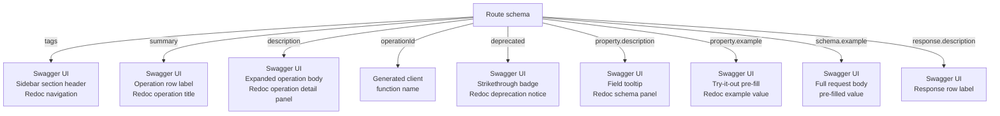

## Tags, Descriptions, and Examples

Tags, descriptions, and examples are the three primary mechanisms for making an OpenAPI document readable and usable by humans. Tags organize operations into navigable groups. Descriptions explain intent, constraints, and context. Examples show concrete values that reduce ambiguity and enable documentation-driven testing. All three are declared within route `schema` objects and plugin configuration — no separate documentation file is required.

---

### Tags

#### Global Tag Declaration

Tags should be declared globally in the `@fastify/swagger` plugin configuration before they are used on routes. A globally declared tag carries a name and an optional description that appears as a section header in Swagger UI and Redoc.

```typescript
await app.register(fastifySwagger, {
  openapi: {
    info: { title: 'Commerce API', version: '1.0.0' },
    tags: [
      {
        name: 'products',
        description: 'Product catalogue — creation, retrieval, and modification of product records.',
      },
      {
        name: 'orders',
        description: 'Order lifecycle — placing, tracking, and cancelling orders.',
      },
      {
        name: 'auth',
        description: 'Authentication — token issuance and revocation.',
        externalDocs: {
          description: 'Authentication guide',
          url: 'https://docs.example.com/auth',
        },
      },
      {
        name: 'admin',
        description: 'Administrative operations. Requires elevated privileges.',
      },
    ],
  },
});
```

**Key Points:**
- The order of entries in this array determines the order of sections in Swagger UI — declare them in the order you want them to appear
- `externalDocs` on a tag links to extended documentation for the entire group, not a single operation
- Tags declared here but unused by any route [Inference] still appear in the output document; whether they appear in the UI depends on the renderer

#### Route-Level Tag Assignment

```typescript
app.post(
  '/products',
  { schema: { tags: ['products'], summary: 'Create product' } },
  handler
);

app.get(
  '/products',
  { schema: { tags: ['products'], summary: 'List products' } },
  handler
);

// A route can belong to multiple tags
app.get(
  '/admin/products/audit-log',
  { schema: { tags: ['products', 'admin'], summary: 'Product audit log' } },
  handler
);
```

**Key Points:**
- Multiple tags on one route causes that route to appear in each tagged section
- A route with no `tags` field [Inference] appears in an untagged default section whose label varies by renderer — always assign at least one tag
- Tag strings are case-sensitive; `'Products'` and `'products'` are different tags

#### Tag Display Order in Swagger UI

Swagger UI renders tag sections in the order they appear in the top-level `tags` array. Routes within a tag section appear in registration order. [Inference] If a route carries a tag not present in the global `tags` array, it is appended at the end of the tag list in the order it is first encountered.

---

### Descriptions

Descriptions appear at four levels: operation, parameter, property, and tag. Each serves a different audience and purpose.

#### Operation Descriptions

The operation `description` field accepts Markdown. It is shown when a user expands an operation in Swagger UI or Redoc.

```typescript
app.post(
  '/orders',
  {
    schema: {
      tags: ['orders'],
      summary: 'Place an order',
      description: `Places a new order for one or more products.

## Behavior

- Stock availability is checked at the time of the request, not at checkout initiation
- Orders are confirmed synchronously; a 201 response guarantees reservation
- Payment is captured asynchronously — listen for the \`order.payment_confirmed\` webhook

## Rate Limiting

This endpoint is limited to **10 requests per minute** per API key.

## Idempotency

Supply an \`Idempotency-Key\` header to safely retry failed requests without duplicating orders.`,
    },
  },
  handler
);
```

**Key Points:**
- `summary` is the one-line label; `description` is the expanded body — do not repeat the summary verbatim in the description
- Markdown headings (`##`, `###`) within `description` render as section headers in Redoc but [Inference] may render inconsistently in Swagger UI depending on version — test in both if both are used
- Code blocks (` ``` `) work in Redoc; Swagger UI support varies

#### Parameter and Property Descriptions

Descriptions on individual schema properties explain the meaning, constraints, and format of a single field.

```typescript
body: {
  type: 'object',
  required: ['productId', 'quantity'],
  properties: {
    productId: {
      type: 'string',
      format: 'uuid',
      description: 'UUID of the product to order. Must be an active, non-archived product.',
    },
    quantity: {
      type: 'integer',
      minimum: 1,
      maximum: 999,
      description: 'Number of units to order. Cannot exceed available stock.',
    },
    couponCode: {
      type: 'string',
      pattern: '^[A-Z0-9]{6,12}$',
      description: 'Optional promotional coupon code. Applied before tax calculation.',
    },
    notes: {
      type: 'string',
      maxLength: 500,
      description: 'Free-text delivery instructions passed to the fulfillment team. Not visible to the customer.',
    },
    shippingSpeed: {
      type: 'string',
      enum: ['standard', 'express', 'overnight'],
      default: 'standard',
      description: `Delivery speed tier.

- \`standard\`: 5–7 business days
- \`express\`: 2–3 business days
- \`overnight\`: next business day (cutoff 2 PM local time)`,
    },
  },
},
```

**Key Points:**
- Property descriptions appear inline in Swagger UI next to each field — keep them concise; use the operation `description` for lengthy contextual explanation
- `enum` values benefit from descriptions that explain what each value means, not just what it is
- `default` renders visually in Swagger UI as the pre-filled value in the try-it-out form

#### Response Descriptions

Every response status code entry requires a `description`. This is mandatory per the OpenAPI 3.0 specification.

```typescript
response: {
  201: {
    description: 'Order placed successfully. The order is confirmed and stock has been reserved.',
    type: 'object',
    properties: {
      orderId: { type: 'string', format: 'uuid' },
      status: { type: 'string', enum: ['confirmed'] },
      estimatedDelivery: { type: 'string', format: 'date' },
    },
  },
  400: {
    description: 'Invalid request body. Check `details` for field-level errors.',
    type: 'object',
    properties: {
      error: { type: 'string' },
      details: { type: 'array', items: { type: 'string' } },
    },
  },
  409: {
    description: 'Insufficient stock. The requested quantity is not available.',
    type: 'object',
    properties: {
      error: { type: 'string' },
      available: { type: 'integer', description: 'Current available stock count' },
    },
  },
  429: {
    description: 'Rate limit exceeded. Retry after the duration specified in `Retry-After`.',
    type: 'object',
    properties: {
      error: { type: 'string' },
      retryAfter: { type: 'integer', description: 'Seconds until the rate limit resets' },
    },
  },
},
```

---

### Examples

Examples provide concrete, realistic values that appear in Swagger UI's try-it-out form and in Redoc's schema panels. They reduce ambiguity and help API consumers construct valid requests without reading the full documentation.

#### Property-Level `example`

The `example` keyword on a property supplies a single representative value. It is the simplest and most broadly supported form.

```typescript
properties: {
  email: {
    type: 'string',
    format: 'email',
    description: 'Primary contact email address',
    example: 'jane.doe@example.com',
  },
  birthDate: {
    type: 'string',
    format: 'date',
    description: 'Date of birth in ISO 8601 format',
    example: '1990-06-15',
  },
  score: {
    type: 'number',
    minimum: 0,
    maximum: 100,
    description: 'Normalized quality score',
    example: 87.4,
  },
  roles: {
    type: 'array',
    items: { type: 'string' },
    description: 'Assigned permission roles',
    example: ['editor', 'reviewer'],
  },
  metadata: {
    type: 'object',
    additionalProperties: { type: 'string' },
    description: 'Arbitrary key-value metadata attached to the record',
    example: { region: 'apac', tier: 'enterprise' },
  },
},
```

#### Schema-Level `example`

An `example` placed at the schema object level (not on a property) provides a complete example of the entire object. This is what Swagger UI pre-fills in the request body editor.

```typescript
body: {
  type: 'object',
  required: ['name', 'price'],
  properties: {
    name: { type: 'string' },
    price: { type: 'number' },
    category: { type: 'string', enum: ['electronics', 'clothing', 'food'] },
    tags: { type: 'array', items: { type: 'string' } },
  },
  example: {
    name: 'Wireless Keyboard',
    price: 49.99,
    category: 'electronics',
    tags: ['wireless', 'usb-c', 'compact'],
  },
},
```

**Key Points:**
- A schema-level `example` overrides property-level examples in the Swagger UI request body editor — the UI shows the whole-object example rather than assembling one from individual properties
- The example is not validated against the schema at documentation generation time; [Inference] an invalid example will appear in the UI without warning
- Provide realistic values — avoid placeholder strings like `'string'` or `0` for numeric fields, as these are uninformative and may mislead consumers

#### Multiple Named Examples with `examples`

OpenAPI 3.0 supports a named `examples` map (plural) at the media type level, allowing multiple labelled examples per request body or response. `@fastify/swagger` [Inference] does not directly map a route `schema` key to this field — it requires either the `transform` option or manual OpenAPI extension via `x-` fields.

The practical workaround is using OpenAPI extensions if your tooling supports them, or using `transform` to inject `examples` into the assembled document:

```typescript
await app.register(fastifySwagger, {
  openapi: { info: { title: 'API', version: '1.0.0' } },
  transform: ({ schema, url }) => {
    if (url === '/orders' && schema.body) {
      // Inject named examples at transform time
      (schema as any)['x-examples'] = {
        standard: {
          summary: 'Standard order',
          value: { productId: 'uuid-1', quantity: 2, shippingSpeed: 'standard' },
        },
        express: {
          summary: 'Express order with coupon',
          value: { productId: 'uuid-2', quantity: 1, shippingSpeed: 'express', couponCode: 'SAVE10AB' },
        },
      };
    }
    return { schema, url };
  },
});
```

[Unverified] Whether `x-examples` is rendered by Swagger UI or Redoc depends on the specific renderer version. Verify against your target renderer before relying on this approach.

---

### Descriptions and Examples with Zod

When using `fastify-type-provider-zod` with `jsonSchemaTransform`, Zod's `.describe()` method adds descriptions to properties in the generated JSON Schema output.

```typescript
import { z } from 'zod';

const OrderBody = z.object({
  productId: z.string().uuid().describe('UUID of the product to order'),
  quantity: z.number().int().min(1).max(999).describe('Number of units'),
  shippingSpeed: z
    .enum(['standard', 'express', 'overnight'])
    .default('standard')
    .describe('Delivery speed tier'),
});
```

**Key Points:**
- `.describe()` maps to the `description` keyword in the JSON Schema output
- Zod has no native `.example()` method — [Inference] examples must be added via a custom `transform` function that post-processes the schema after `jsonSchemaTransform` runs, or by attaching them at the route schema level outside the Zod object
- `.default()` in Zod [Inference] maps to the `default` keyword in the JSON Schema output and appears in Swagger UI's pre-filled form values

---

### Response Header Documentation

Response headers are documented using the `headers` field inside a response schema entry. This is separate from request headers.

```typescript
response: {
  200: {
    description: 'Success',
    headers: {
      'X-RateLimit-Limit': {
        schema: { type: 'integer' },
        description: 'Maximum requests allowed per window',
      },
      'X-RateLimit-Remaining': {
        schema: { type: 'integer' },
        description: 'Requests remaining in the current window',
      },
      'X-Request-Id': {
        schema: { type: 'string', format: 'uuid' },
        description: 'Server-assigned request identifier for tracing',
      },
    },
    type: 'object',
    properties: {
      data: { type: 'array', items: { $ref: 'Product#' } },
    },
  },
},
```

**Key Points:**
- Response header documentation is purely informational in the OpenAPI document — it does not cause Fastify to validate or set headers automatically
- [Inference] `@fastify/swagger` passes `headers` on response entries through to the OpenAPI output; verify in `/docs/json` that the field is present in the generated document for your version

---

### Consolidated Example: Fully Annotated Route

```typescript
app.post(
  '/products/:id/reviews',
  {
    schema: {
      operationId: 'createProductReview',
      tags: ['products'],
      summary: 'Submit a product review',
      description: `Submits a new review for a product.

Reviews are moderated before becoming publicly visible. A confirmation email is sent to the reviewer on submission.

**Constraints:**
- One review per customer per product
- Products must have been purchased by the reviewer (verified via order history)`,
      security: [{ bearerAuth: [] }],
      params: {
        type: 'object',
        required: ['id'],
        properties: {
          id: {
            type: 'string',
            format: 'uuid',
            description: 'UUID of the product being reviewed',
            example: 'f47ac10b-58cc-4372-a567-0e02b2c3d479',
          },
        },
      },
      body: {
        type: 'object',
        required: ['rating', 'body'],
        properties: {
          rating: {
            type: 'integer',
            minimum: 1,
            maximum: 5,
            description: 'Star rating from 1 (poor) to 5 (excellent)',
            example: 4,
          },
          title: {
            type: 'string',
            maxLength: 100,
            description: 'Optional short headline for the review',
            example: 'Great keyboard, minor issues with software',
          },
          body: {
            type: 'string',
            minLength: 20,
            maxLength: 2000,
            description: 'Full review text. Minimum 20 characters.',
            example: 'Build quality is excellent and the keys feel great. The companion software is a bit clunky but workable.',
          },
          verifiedPurchase: {
            type: 'boolean',
            description: 'Whether the reviewer purchased via this platform (auto-set by server; ignored if supplied)',
            example: true,
          },
        },
        example: {
          rating: 4,
          title: 'Great keyboard, minor issues with software',
          body: 'Build quality is excellent and the keys feel great. The companion software is a bit clunky but workable.',
        },
      },
      response: {
        201: {
          description: 'Review submitted and pending moderation.',
          type: 'object',
          properties: {
            reviewId: {
              type: 'string',
              format: 'uuid',
              description: 'Assigned review UUID',
              example: 'a1b2c3d4-e5f6-7890-abcd-ef1234567890',
            },
            status: {
              type: 'string',
              enum: ['pending', 'approved'],
              description: 'Moderation status at time of submission',
              example: 'pending',
            },
          },
        },
        409: {
          description: 'Reviewer has already submitted a review for this product.',
          type: 'object',
          properties: {
            error: { type: 'string', example: 'Review already exists' },
            existingReviewId: { type: 'string', format: 'uuid' },
          },
        },
      },
    },
  },
  handler
);
```

---

### Diagram: Where Metadata Fields Render



---

### Common Mistakes

| Mistake | Effect |
|---|---|
| Omitting `description` on response status codes | Invalid per OpenAPI 3.0 spec; linters flag it |
| Using placeholder examples (`'string'`, `0`, `true`) | Uninformative; consumers cannot tell what real values look like |
| Repeating `summary` text verbatim in `description` | Redundant; wastes the description field |
| Tags in routes not declared globally | Tag appears without a description; display order is uncontrolled |
| Schema-level `example` conflicting with property examples | Schema-level wins in the UI; property examples are shadowed |
| Long prose in `summary` (over ~60 characters) | Truncated in Swagger UI operation list |
| Using `deprecated: true` without a migration path in `description` | Consumers know something is deprecated but not what to do |
| Invalid values in `example` fields | No compile-time or generation-time error; consumer sees a bad example |

---

**Related Topics:**
- `x-codeSamples` Redoc extension — attaching code samples in multiple languages to operations
- `transform` in `@fastify/swagger` — injecting `examples` (plural) and other fields not directly supported by route schema keys
- OpenAPI `links` object — documenting relationships between operations (e.g., create → get)
- JSON Schema annotations — `title`, `readOnly`, `writeOnly`, `deprecated` at the property level
- Zod `.describe()` patterns — structuring schema descriptions in Zod-first codebases
- API changelog and versioning in descriptions — conventions for documenting breaking changes inline