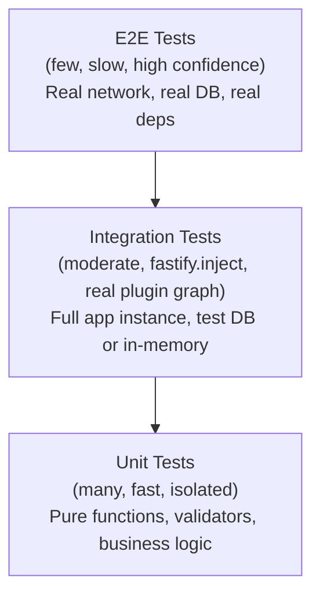
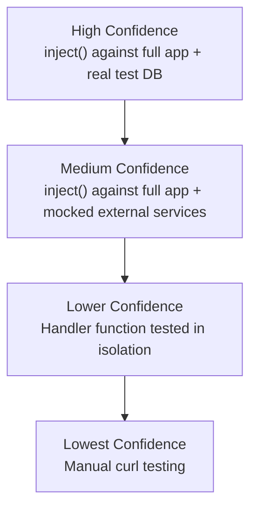

## Testing Philosophy for Fastify Apps

### Overview

Fastify is designed with testability as a first-class concern. Its encapsulation model, plugin system, and built-in `inject` method make it possible to test HTTP behavior without binding to a real network port. This document covers the principles, patterns, and tradeoffs that inform a sound testing strategy for Fastify applications.

---

### Why Fastify Is Testable by Design

Several architectural decisions in Fastify directly support testing:

- **`fastify.inject()`** — executes a simulated HTTP request through the full Fastify request lifecycle (hooks, validation, serialization, handlers) without opening a socket. No port binding is required.
- **Encapsulation** — plugins and route groups are isolated scopes. Individual scopes can be instantiated and tested without loading the entire application.
- **Explicit lifecycle** — `fastify.ready()`, `fastify.close()`, and `fastify.listen()` are explicit async calls, making setup and teardown deterministic in test runners.
- **Dependency injection via plugin options** — plugins receive configuration and dependencies through their options object, making it straightforward to substitute test doubles.

[Inference: these properties make unit and integration testing more tractable than in frameworks that couple route logic tightly to a running HTTP server, but the degree of benefit depends on how the application itself is structured.]

---

### The Testing Pyramid Applied to Fastify

The classic testing pyramid maps naturally onto Fastify's architecture:



**Key Points:**
- Unit tests validate pure logic — schema validators, utility functions, business rules — with no Fastify involvement.
- Integration tests use `fastify.inject()` to exercise the full request lifecycle against a real (but controlled) application instance.
- E2E tests bind to a real port, potentially against a staging environment, and validate behavior from the outside.

[Inference: most Fastify applications benefit most from a strong integration test layer, because Fastify's validation, serialization, and hook pipeline are where many bugs surface — and `inject()` exercises all of these without the cost of a real network.]

---

### Core Principle: Test the HTTP Contract, Not the Implementation

A handler function in isolation tells you little about whether a route behaves correctly. The HTTP contract — status codes, response shape, headers, error formats — is what consumers depend on. Fastify's `inject()` method makes it practical to test at this level without the overhead of a real server.

```typescript
// Prefer this:
const response = await app.inject({
  method: 'GET',
  url: '/users/42',
})
expect(response.statusCode).toBe(200)
expect(response.json()).toMatchObject({ id: 42, name: expect.any(String) })

// Over this (testing the handler function directly):
const result = await getUserHandler({ params: { id: '42' } } as any, {} as any)
```

**Key Points:**
- Testing the handler directly bypasses schema validation, serialization, hooks, and error handling — all of which are part of the actual behavior.
- `response.json()` parses and returns the body as an object. `response.body` returns it as a string.
- Status code assertions are the minimum. Response shape assertions provide contract coverage.

---

### Application Factory Pattern

The single most important structural decision for testability is building the Fastify instance inside a factory function rather than creating and starting it at module level.

```typescript
// src/app.ts
import Fastify, { FastifyInstance } from 'fastify'
import { FastifyServerOptions } from 'fastify'

export async function buildApp(opts: FastifyServerOptions = {}): Promise<FastifyInstance> {
  const fastify = Fastify(opts)

  await fastify.register(import('./plugins/database'))
  await fastify.register(import('./plugins/auth'))
  await fastify.register(import('./routes/users'))
  await fastify.register(import('./routes/products'))

  return fastify
}
```

```typescript
// src/server.ts  (entrypoint — not imported in tests)
import { buildApp } from './app'

const app = await buildApp({ logger: true })
await app.listen({ port: 3000 })
```

```typescript
// tests/users.test.ts
import { buildApp } from '../src/app'

let app: FastifyInstance

beforeAll(async () => {
  app = await buildApp({ logger: false })
  await app.ready()
})

afterAll(async () => {
  await app.close()
})

test('GET /users/:id returns 200', async () => {
  const response = await app.inject({ method: 'GET', url: '/users/1' })
  expect(response.statusCode).toBe(200)
})
```

**Key Points:**
- Each test file (or suite) creates its own isolated app instance — no shared global state between suites.
- `logger: false` (or `logger: { level: 'silent' }`) suppresses log output during tests.
- `app.close()` in `afterAll` tears down plugin connections (database pools, Redis clients) cleanly.

---

### Dependency Injection Strategies

Fastify does not include a DI container. Dependencies are typically injected through one of three patterns:

#### Plugin Options

```typescript
// plugins/database.ts
export default async function databasePlugin(fastify, opts: { db: Database }) {
  fastify.decorate('db', opts.db)
}

// In tests:
await fastify.register(databasePlugin, { db: fakeDatabase })
```

#### Fastify Decorators as Seams

Decorators registered before routes can be replaced with test doubles in a test-specific build:

```typescript
export async function buildApp(overrides: { db?: Database } = {}) {
  const fastify = Fastify()
  const db = overrides.db ?? createRealDatabase()
  fastify.decorate('db', db)
  await fastify.register(routes)
  return fastify
}
```

#### Environment-Driven Configuration

Some dependencies (external services, queues) are best replaced by pointing to a test instance (e.g., a local Redis, a test database) via environment variables rather than mock objects. [Inference: this approach tests more realistic behavior but requires test infrastructure setup.]

---

### What to Test at Each Layer

#### Unit Tests (no Fastify)

- Schema validation logic (if extracted into reusable validators)
- Business logic functions and domain utilities
- Serialization helpers and data transformers
- Error formatting functions

```typescript
import { validateUserPayload } from '../src/validators/user'

test('rejects payload missing required email', () => {
  const result = validateUserPayload({ name: 'Luke' })
  expect(result.valid).toBe(false)
})
```

#### Integration Tests (with `fastify.inject()`)

- Route existence and correct HTTP method binding
- Request schema validation — confirm 400 responses for invalid input
- Response schema — shape, types, required fields
- Authentication and authorization hooks — confirm 401/403 for missing or invalid credentials
- Error handler output format
- Content negotiation (Accept headers, content-type responses)
- Route parameter parsing

```typescript
test('returns 400 for missing required field', async () => {
  const response = await app.inject({
    method: 'POST',
    url: '/users',
    payload: { name: 'Luke' }, // missing email
  })
  expect(response.statusCode).toBe(400)
  expect(response.json()).toMatchObject({ message: expect.any(String) })
})
```

#### E2E Tests (real port, real network)

- Authentication flows involving cookies or redirects
- File uploads and streaming responses
- WebSocket connections
- Behavior under real TLS termination
- Third-party webhook delivery

---

### Lifecycle Management in Tests

Incorrect lifecycle management is the most common source of flaky Fastify tests.


**Key Points:**
- `fastify.ready()` must be awaited before calling `inject()`. Without it, plugins may not have finished registering.
- `fastify.close()` must be called in `afterAll` (or equivalent). Omitting it causes open handle warnings in Jest and can leak database connections between test files.
- Do not share a single app instance across multiple test files without careful isolation — plugin side effects can bleed across suites. [Inference: creating one instance per test file is safer at the cost of slightly higher setup time.]

---

### Testing Hooks in Isolation

Hooks (`onRequest`, `preHandler`, `onSend`, etc.) can be tested by registering a minimal app containing only the hook under test and a simple route:

```typescript
test('onRequest auth hook rejects missing token', async () => {
  const app = Fastify()

  app.addHook('onRequest', async (request, reply) => {
    if (!request.headers['x-api-key']) {
      reply.code(401).send({ error: 'Unauthorized' })
    }
  })

  app.get('/protected', async () => ({ ok: true }))

  await app.ready()

  const response = await app.inject({ method: 'GET', url: '/protected' })
  expect(response.statusCode).toBe(401)

  await app.close()
})
```

This pattern avoids testing the hook through the full application graph, reducing noise when diagnosing failures.

---

### Testing Plugins in Isolation

Individual Fastify plugins can be tested by mounting them on a minimal Fastify instance:

```typescript
import Fastify from 'fastify'
import myPlugin from '../src/plugins/my-plugin'

test('myPlugin decorates fastify with myService', async () => {
  const app = Fastify()
  await app.register(myPlugin, { apiKey: 'test-key' })
  await app.ready()

  expect(app.myService).toBeDefined()
  expect(typeof app.myService.fetchData).toBe('function')

  await app.close()
})
```

**Key Points:**
- Plugin isolation tests confirm that decorators, hooks, and route contributions are applied correctly without loading unrelated parts of the application.
- These tests are fast and precise — a failing plugin isolation test points directly at the plugin under test.

---

### Mocking External Services

For integration tests that involve external HTTP calls (third-party APIs, microservice dependencies), prefer intercepting at the network level rather than mocking module imports.

**`nock`** — intercepts Node.js HTTP requests:

```typescript
import nock from 'nock'

test('proxies payment service response', async () => {
  nock('https://payments.example.com')
    .post('/charge')
    .reply(200, { status: 'ok', chargeId: 'ch_123' })

  const response = await app.inject({
    method: 'POST',
    url: '/checkout',
    payload: { amount: 5000 },
  })

  expect(response.statusCode).toBe(200)
  expect(response.json().chargeId).toBe('ch_123')
})
```

**`msw` (Mock Service Worker)** — can be used in Node.js mode for the same purpose. [Inference: `msw` is increasingly preferred in projects that share mocking setup between Node.js and browser environments.]

---

### Test Runner Compatibility

Fastify's async lifecycle integrates cleanly with any test runner that supports `async/await`:

| Runner | Notes |
|--------|-------|
| **Vitest** | Recommended for new projects; fast, native ESM support, compatible with Jest API |
| **Jest** | Widely used; requires `--forceExit` or explicit `app.close()` to avoid open handle warnings |
| **Node Test Runner** (`node:test`) | Available from Node 18+; no additional dependency; lower ecosystem maturity [Inference] |
| **tap** | Historically popular in the Fastify community; used in Fastify's own test suite |

[Unverified: runner-specific behavior and compatibility with Fastify's plugin system may vary across versions. Verify against your target runtime and runner versions.]

---

### Common Anti-Patterns

| Anti-Pattern | Problem | Preferred Alternative |
|---|---|---|
| Calling `inject()` before `ready()` | Plugins may not be registered yet; behavior is undefined | Always await `ready()` first |
| Sharing one app instance across all test files | Plugin state and decorators persist; tests couple to each other | One instance per file or suite |
| Testing handler functions directly | Bypasses validation, serialization, hooks | Test via `inject()` |
| Never calling `app.close()` | Open handles, leaked connections, flaky CI | Call in `afterAll` |
| Mocking Fastify internals | Brittle; ties tests to implementation details | Test through the public HTTP interface |
| Hardcoding ports in tests | Port conflicts in parallel test runs | Use `inject()` — no port required |

---

### Confidence Hierarchy

Not all tests provide equal confidence. A rough hierarchy for Fastify apps:



[Inference: this hierarchy reflects what portions of the Fastify pipeline each approach exercises. Actual confidence depends on test quality and coverage, not just the approach used.]

---

**Related Topics**
- Writing integration tests with `fastify.inject()` — detailed patterns and assertions
- Setting up Vitest or Jest for a Fastify TypeScript project
- Testing authentication and session plugins
- Using test containers for database-backed integration tests
- Snapshot testing response shapes
- Code coverage strategies for Fastify route handlers
- Testing WebSocket and Server-Sent Event endpoints
- Contract testing with Pact or Dredd against the exported OpenAPI spec