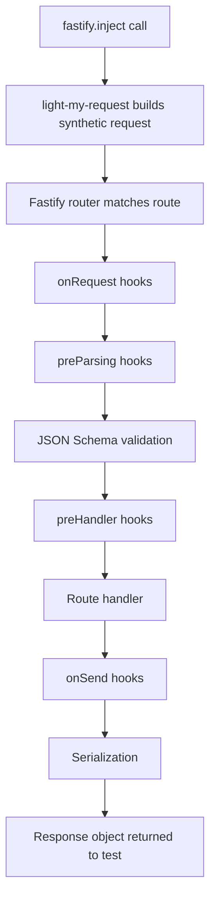

## Using fastify.inject for In-Process Testing

### Overview

`fastify.inject()` is Fastify's built-in method for simulating HTTP requests through the complete Fastify request pipeline — hooks, validation, serialization, error handling — without binding to a network port or opening a socket. It is the primary tool for integration testing Fastify applications and is provided out of the box with no additional dependencies.

---

### How inject Works Internally

`fastify.inject()` is powered by [`light-my-request`](https://github.com/fastify/light-my-request), a Fastify-maintained library that constructs a synthetic `IncomingMessage`-compatible object and routes it through Fastify's internal dispatch function.



**Key Points:**
- No TCP socket is opened. No port is bound.
- The full hook lifecycle runs — `onRequest`, `preParsing`, `preValidation`, `preHandler`, `onSend`, `onResponse`.
- JSON Schema validation and response serialization run exactly as in production.
- The response is returned as a `Response` object containing status code, headers, and body.

[Inference: because the full pipeline executes, `inject()` provides higher fidelity than testing handler functions directly. Behavior may still differ from a real HTTP client in edge cases involving low-level socket behavior, chunked encoding, or connection-level concerns.]

---

### Basic Usage

`fastify.inject()` accepts either a string URL or an options object. It returns a Promise resolving to a `LightMyRequestResponse`.

```typescript
import Fastify from 'fastify'

const app = Fastify({ logger: false })

app.get('/hello', async () => ({ message: 'Hello, world' }))

await app.ready()

const response = await app.inject({
  method: 'GET',
  url: '/hello',
})

console.log(response.statusCode)   // 200
console.log(response.json())       // { message: 'Hello, world' }
console.log(response.headers)      // { 'content-type': 'application/json; charset=utf-8', ... }

await app.close()
```

---

### The Inject Options Object

```typescript
await app.inject({
  method: 'POST',           // HTTP method — defaults to 'GET'
  url: '/users',            // Required. Path including query string if needed
  query: { page: '1' },    // Parsed separately and appended to URL
  headers: {
    'content-type': 'application/json',
    'authorization': 'Bearer test-token',
  },
  payload: {                // Request body — objects are serialized to JSON automatically
    name: 'Luke',
    email: 'luke@example.com',
  },
  cookies: {
    sessionId: 'abc123',   // Injected as Cookie header
  },
})
```

**Key Points:**
- `payload` accepts a plain object, string, or `Buffer`. When a plain object is provided and `content-type` is `application/json`, it is serialized automatically.
- `query` values must be strings or arrays of strings — numbers are not coerced automatically. [Inference: pass query params as strings to avoid unexpected behavior.]
- `cookies` is a convenience shorthand. Equivalent to setting `headers: { cookie: 'sessionId=abc123' }`.
- `method` defaults to `'GET'` if omitted.

---

### The Response Object

`fastify.inject()` resolves with a `LightMyRequestResponse` object:

| Property / Method | Type | Description |
|---|---|---|
| `statusCode` | `number` | HTTP status code |
| `headers` | `Record<string, string \| string[]>` | Response headers |
| `body` | `string` | Raw response body as a string |
| `json()` | `() => unknown` | Parses body as JSON and returns the result |
| `payload` | `string` | Alias for `body` |
| `rawPayload` | `Buffer` | Raw response body as a Buffer |
| `cookies` | `Cookie[]` | Parsed `Set-Cookie` headers |
| `trailers` | `Record<string, string>` | HTTP trailers if present |

```typescript
const response = await app.inject({ method: 'GET', url: '/users/1' })

// Body access
response.body          // '{"id":1,"name":"Luke"}'
response.payload       // same as body
response.json()        // { id: 1, name: 'Luke' }
response.rawPayload    // <Buffer 7b 22 69 64 22 ...>

// Status and headers
response.statusCode    // 200
response.headers['content-type']  // 'application/json; charset=utf-8'

// Cookies set by the response
response.cookies       // [{ name: 'session', value: 'xyz', httpOnly: true, ... }]
```

---

### Callback Style

`inject()` also accepts a Node.js callback as a second argument, though the Promise form is preferred in modern TypeScript projects:

```typescript
app.inject({ method: 'GET', url: '/hello' }, (err, response) => {
  if (err) throw err
  console.log(response.statusCode)
})
```

---

### Setting Up and Tearing Down in a Test Suite

The recommended pattern uses `beforeAll` / `afterAll` (or equivalents) to manage the app lifecycle once per suite:

```typescript
// tests/users.test.ts
import { buildApp } from '../src/app'
import type { FastifyInstance } from 'fastify'

let app: FastifyInstance

beforeAll(async () => {
  app = await buildApp({ logger: false })
  await app.ready()
})

afterAll(async () => {
  await app.close()
})

test('GET /users returns 200', async () => {
  const response = await app.inject({ method: 'GET', url: '/users' })
  expect(response.statusCode).toBe(200)
})

test('GET /users returns an array', async () => {
  const response = await app.inject({ method: 'GET', url: '/users' })
  expect(Array.isArray(response.json())).toBe(true)
})
```

**Key Points:**
- `app.ready()` must be awaited before the first `inject()` call. Skipping it may cause plugins to be unregistered at call time.
- `app.close()` in `afterAll` tears down database connections, timers, and any plugin resources that registered a `onClose` hook.
- Multiple tests within the same suite share one app instance — this is safe as long as tests do not mutate shared decorator state.

---

### Testing Route Variations

#### Query Parameters

```typescript
test('filters users by role', async () => {
  const response = await app.inject({
    method: 'GET',
    url: '/users',
    query: { role: 'admin' },
  })
  expect(response.statusCode).toBe(200)
  const body = response.json<{ users: Array<{ role: string }> }>()
  expect(body.users.every(u => u.role === 'admin')).toBe(true)
})
```

#### Route Parameters

```typescript
test('returns 404 for unknown user', async () => {
  const response = await app.inject({
    method: 'GET',
    url: '/users/99999',
  })
  expect(response.statusCode).toBe(404)
})
```

#### Request Body and Validation

```typescript
test('returns 400 when email is missing', async () => {
  const response = await app.inject({
    method: 'POST',
    url: '/users',
    headers: { 'content-type': 'application/json' },
    payload: { name: 'Luke' },  // email required but absent
  })
  expect(response.statusCode).toBe(400)
  expect(response.json()).toMatchObject({
    message: expect.stringContaining('email'),
  })
})
```

#### Authentication Headers

```typescript
test('returns 401 when Authorization header is missing', async () => {
  const response = await app.inject({
    method: 'GET',
    url: '/protected',
  })
  expect(response.statusCode).toBe(401)
})

test('returns 200 with valid bearer token', async () => {
  const response = await app.inject({
    method: 'GET',
    url: '/protected',
    headers: { authorization: 'Bearer valid-test-token' },
  })
  expect(response.statusCode).toBe(200)
})
```

#### Cookies

```typescript
test('reads session cookie correctly', async () => {
  const response = await app.inject({
    method: 'GET',
    url: '/me',
    cookies: { sessionId: 'test-session-abc' },
  })
  expect(response.statusCode).toBe(200)
})
```

#### Asserting Set-Cookie in Response

```typescript
test('login sets a session cookie', async () => {
  const response = await app.inject({
    method: 'POST',
    url: '/login',
    payload: { username: 'luke', password: 'secret' },
  })
  expect(response.statusCode).toBe(200)
  const sessionCookie = response.cookies.find(c => c.name === 'sessionId')
  expect(sessionCookie).toBeDefined()
  expect(sessionCookie?.httpOnly).toBe(true)
})
```

---

### Testing Error Responses

Fastify's default error serialization produces a consistent shape. Tests should assert on this shape rather than implementation-specific messages:

```typescript
test('error response conforms to Fastify error shape', async () => {
  const response = await app.inject({
    method: 'POST',
    url: '/users',
    payload: {},
  })
  expect(response.statusCode).toBe(400)
  expect(response.json()).toMatchObject({
    statusCode: 400,
    error: 'Bad Request',
    message: expect.any(String),
  })
})
```

If a custom error handler is registered, assert against its specific output format instead.

---

### Testing Response Headers

```typescript
test('sets correct content-type for JSON responses', async () => {
  const response = await app.inject({ method: 'GET', url: '/users' })
  expect(response.headers['content-type']).toMatch(/application\/json/)
})

test('sets cache-control header on public resources', async () => {
  const response = await app.inject({ method: 'GET', url: '/static/logo.png' })
  expect(response.headers['cache-control']).toBe('public, max-age=31536000')
})
```

---

### Chaining Requests — Simulating Multi-Step Flows

`inject()` calls can be chained to simulate multi-step interactions such as login-then-access:

```typescript
test('authenticated user can access profile', async () => {
  // Step 1: Log in and capture the session cookie
  const loginResponse = await app.inject({
    method: 'POST',
    url: '/login',
    payload: { username: 'luke', password: 'secret' },
  })
  expect(loginResponse.statusCode).toBe(200)

  const sessionCookie = loginResponse.cookies.find(c => c.name === 'sessionId')
  expect(sessionCookie).toBeDefined()

  // Step 2: Use the cookie on a protected route
  const profileResponse = await app.inject({
    method: 'GET',
    url: '/me',
    cookies: { sessionId: sessionCookie!.value },
  })
  expect(profileResponse.statusCode).toBe(200)
  expect(profileResponse.json()).toMatchObject({ username: 'luke' })
})
```

[Inference: this pattern works well for session-cookie-based auth flows. Token-based flows (JWT) are simpler — extract the token from the login response body and pass it as an `Authorization` header.]

---

### inject vs. a Real HTTP Client

| Concern | `fastify.inject()` | Real HTTP client (e.g. `undici`, `got`) |
|---|---|---|
| Port binding required | No | Yes |
| Full hook pipeline | Yes | Yes |
| Network stack involved | No | Yes |
| TLS/SSL testing | No | Yes |
| Parallel port conflicts | Not applicable | Possible |
| Speed | Faster | Slower |
| Cookie jar / redirect following | Manual | Native in some clients |
| Streaming response testing | Limited [Inference] | Full |

Use a real HTTP client only when the behavior under test is at the network or TLS layer. For all other integration testing, `inject()` is preferred.

---

### Typed json() Responses

`response.json()` accepts a generic type parameter for TypeScript callers:

```typescript
interface User {
  id: number
  name: string
  email: string
}

const response = await app.inject({ method: 'GET', url: '/users/1' })
const user = response.json<User>()

// user is typed as User
expect(user.id).toBe(1)
```

[Inference: the type is asserted, not validated at runtime — `json<User>()` does not perform schema validation against the `User` interface. Mismatches between the actual response and the type will not throw; they will silently produce a mistyped object.]

---

### Common Mistakes

**Calling `inject()` before `app.ready()`**

```typescript
// Wrong
const app = await buildApp()
const response = await app.inject({ method: 'GET', url: '/' })  // plugins may not be ready

// Correct
const app = await buildApp()
await app.ready()
const response = await app.inject({ method: 'GET', url: '/' })
```

**Not awaiting `inject()`**

```typescript
// Wrong — test may pass vacuously
test('returns 200', () => {
  const response = app.inject({ method: 'GET', url: '/' })
  expect(response.statusCode).toBe(200)  // response is a Promise, not the result
})

// Correct
test('returns 200', async () => {
  const response = await app.inject({ method: 'GET', url: '/' })
  expect(response.statusCode).toBe(200)
})
```

**Forgetting `content-type` on POST requests with string bodies**

```typescript
// May result in unexpected parsing behavior
await app.inject({
  method: 'POST',
  url: '/users',
  payload: '{"name":"Luke"}',  // string body
  // missing: headers: { 'content-type': 'application/json' }
})

// Correct
await app.inject({
  method: 'POST',
  url: '/users',
  payload: '{"name":"Luke"}',
  headers: { 'content-type': 'application/json' },
})
```

Note: when `payload` is a plain object, `inject()` sets `content-type: application/json` automatically. When it is a string or Buffer, the header must be set explicitly.

**Calling `json()` on a non-JSON response**

```typescript
// Throws if body is not valid JSON
const response = await app.inject({ method: 'GET', url: '/healthz' })
response.json()  // throws if body is 'OK' (plain text)

// Use body or payload for non-JSON responses
response.body   // 'OK'
```

---

**Related Topics**
- Structuring the application factory (`buildApp`) for testability
- Testing Fastify plugins in isolation with minimal app instances
- Mocking decorators and external dependencies in tests
- Testing authentication hooks and session flows
- Snapshot testing with `toMatchSnapshot()` against response shapes
- Using Vitest or Jest with TypeScript for Fastify test suites
- Testing streaming and multipart responses