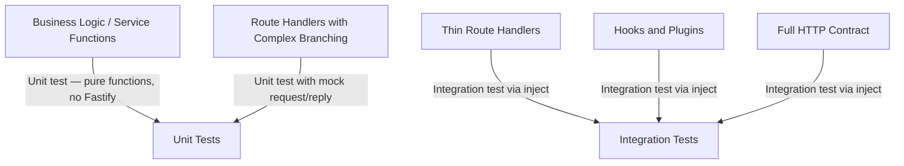

## Unit Testing Route Handlers

### Overview

Unit testing a Fastify route handler means testing the handler function in isolation — without registering it on a Fastify instance, without invoking the HTTP pipeline, and without running hooks or schema validation. The goal is to verify the handler's internal logic: branching conditions, service calls, error throwing, and return values. This complements integration tests (which test the full HTTP contract via `inject()`) rather than replacing them.

---

### When Unit Testing Handlers Makes Sense

Unit testing handlers is not always the right choice. The tradeoffs are real:

| Situation | Recommended Approach |
|---|---|
| Handler contains significant conditional logic | Unit test the handler or extract logic to a pure function |
| Handler is a thin wrapper around a service call | Integration test via `inject()` is sufficient |
| Handler behavior depends heavily on hooks or validation | Integration test — unit test will not exercise those |
| Handler has many error branches that are hard to trigger via HTTP | Unit test each branch directly |
| Performance-sensitive test suite needing fast feedback | Unit tests run faster than `inject()`-based tests |

[Inference: most Fastify handlers in real applications are thin. When a handler is doing little more than calling a service and returning its result, testing it in isolation provides limited additional confidence over an `inject()`-based test. The benefit increases proportionally with handler complexity.]

---

### The Core Problem: Handler Signatures

A Fastify route handler receives two arguments: a `FastifyRequest` and a `FastifyReply`. Both are complex objects with many properties and methods. Calling a handler in a unit test requires constructing or mocking these objects.

```typescript
// A typical handler
import type { FastifyRequest, FastifyReply } from 'fastify'

interface GetUserParams {
  id: string
}

export async function getUserHandler(
  request: FastifyRequest<{ Params: GetUserParams }>,
  reply: FastifyReply
): Promise<void> {
  const { id } = request.params
  const user = await request.server.db.getUser(Number(id))

  if (!user) {
    reply.code(404).send({ error: 'User not found' })
    return
  }

  reply.send(user)
}
```

The handler touches `request.params`, `request.server.db`, `reply.code()`, and `reply.send()`. Each of these must be present on the mock objects passed to the handler.

---

### Extracting Business Logic from Handlers

The cleanest unit-testing strategy is to keep handlers thin and move logic into pure functions or service classes that have no dependency on `FastifyRequest` or `FastifyReply`. Those functions are then trivially testable.

```typescript
// src/services/user-service.ts
export interface UserRepository {
  getUser(id: number): Promise<User | null>
  createUser(data: CreateUserData): Promise<User>
}

export async function fetchUser(
  repo: UserRepository,
  id: number
): Promise<User | null> {
  if (id <= 0) throw new Error('Invalid user ID')
  return repo.getUser(id)
}
```

```typescript
// src/routes/users.ts
export async function getUserHandler(
  request: FastifyRequest<{ Params: { id: string } }>,
  reply: FastifyReply
): Promise<void> {
  const user = await fetchUser(request.server.db, Number(request.params.id))
  if (!user) return reply.code(404).send({ error: 'Not found' })
  reply.send(user)
}
```

```typescript
// tests/services/user-service.test.ts
import { test, describe } from 'node:test'   // or Jest equivalents
import assert from 'node:assert/strict'
import { fetchUser } from '../../src/services/user-service.js'

const mockRepo = {
  getUser: async (id: number) => id === 1 ? { id: 1, name: 'Luke' } : null,
  createUser: async () => { throw new Error('not implemented') },
}

describe('fetchUser', () => {
  test('returns user when found', async () => {
    const user = await fetchUser(mockRepo, 1)
    assert.deepEqual(user, { id: 1, name: 'Luke' })
  })

  test('returns null when user does not exist', async () => {
    const user = await fetchUser(mockRepo, 999)
    assert.equal(user, null)
  })

  test('throws on invalid id', async () => {
    await assert.rejects(
      () => fetchUser(mockRepo, -1),
      { message: 'Invalid user ID' }
    )
  })
})
```

**Key Points:**
- `fetchUser` has no Fastify dependency — it takes a repository interface and a primitive value.
- The mock repository is a plain object implementing the interface. No mocking library is needed.
- All logical branches are directly reachable without constructing HTTP objects.

---

### Mocking FastifyRequest

When testing a handler directly (without extracting logic), a partial mock of `FastifyRequest` is constructed manually. TypeScript's type system requires casting:

```typescript
import type { FastifyRequest, FastifyReply } from 'fastify'

function buildMockRequest(
  overrides: Partial<FastifyRequest> = {}
): FastifyRequest {
  return {
    params: {},
    query: {},
    body: null,
    headers: {},
    log: {
      info: () => {},
      warn: () => {},
      error: () => {},
      debug: () => {},
    },
    server: {
      db: {
        getUser: async () => null,
      },
    },
    ...overrides,
  } as unknown as FastifyRequest
}
```

The `as unknown as FastifyRequest` cast is necessary because the mock does not satisfy the full interface. This is expected — the mock provides only the properties the handler actually accesses.

[Inference: the need for `as unknown as FastifyRequest` is a signal that the handler is tightly coupled to Fastify internals. Handlers that require many properties on `request` are harder to unit test cleanly than handlers that require few.]

---

### Mocking FastifyReply

`FastifyReply` is stateful — `reply.code()` returns `reply` itself for chaining, and `reply.send()` sets the response body. A minimal mock must preserve this chaining behavior:

```typescript
function buildMockReply(): FastifyReply & {
  _statusCode: number
  _payload: unknown
} {
  const reply = {
    _statusCode: 200,
    _payload: undefined as unknown,
    code(statusCode: number) {
      this._statusCode = statusCode
      return this
    },
    send(payload: unknown) {
      this._payload = payload
      return this
    },
    header() { return this },
    type() { return this },
    redirect() { return this },
  }

  return reply as unknown as FastifyReply & {
    _statusCode: number
    _payload: unknown
  }
}
```

---

### Using the Mocks in a Handler Test

```typescript
import { test, describe } from 'node:test'
import assert from 'node:assert/strict'
import { getUserHandler } from '../../src/routes/users.js'

describe('getUserHandler', () => {
  test('calls reply.send with the user when found', async () => {
    const mockUser = { id: 1, name: 'Luke' }

    const request = buildMockRequest({
      params: { id: '1' },
      server: {
        db: {
          getUser: async () => mockUser,
        },
      } as any,
    })

    const reply = buildMockReply()

    await getUserHandler(request, reply as any)

    assert.equal(reply._statusCode, 200)
    assert.deepEqual(reply._payload, mockUser)
  })

  test('sends 404 when user is not found', async () => {
    const request = buildMockRequest({
      params: { id: '999' },
      server: {
        db: {
          getUser: async () => null,
        },
      } as any,
    })

    const reply = buildMockReply()

    await getUserHandler(request, reply as any)

    assert.equal(reply._statusCode, 404)
    assert.deepEqual(reply._payload, { error: 'User not found' })
  })
})
```

---

### Using Jest Mocks for Reply Chaining

In Jest, `jest.fn()` can be used to build a chainable reply mock more concisely:

```typescript
function buildJestMockReply() {
  const reply = {
    _statusCode: 200,
    _payload: undefined as unknown,
    code: jest.fn().mockReturnThis(),
    send: jest.fn().mockImplementation(function (this: typeof reply, payload) {
      this._payload = payload
      return this
    }),
    header: jest.fn().mockReturnThis(),
    type: jest.fn().mockReturnThis(),
  }
  return reply
}

// In a test:
test('sends 404 when user not found', async () => {
  const request = buildMockRequest({ params: { id: '999' }, server: { db: { getUser: async () => null } } as any })
  const reply = buildJestMockReply()

  await getUserHandler(request as any, reply as any)

  expect(reply.code).toHaveBeenCalledWith(404)
  expect(reply.send).toHaveBeenCalledWith({ error: 'User not found' })
})
```

**Key Points:**
- `mockReturnThis()` makes the mock function return the object it belongs to, preserving the chaining behavior of `reply.code(404).send(...)`.
- `toHaveBeenCalledWith()` asserts both that `send` was called and what it was called with — more precise than checking `_payload` directly.
- [Inference: Jest mock functions provide richer introspection (call count, call arguments, call order) than a plain object mock. The tradeoff is a Jest dependency in the test file.]

---

### Testing Handlers That Use request.log

Handlers that call `request.log.info()`, `request.log.warn()`, or `request.log.error()` require a log mock:

```typescript
const mockLog = {
  info: jest.fn(),
  warn: jest.fn(),
  error: jest.fn(),
  debug: jest.fn(),
  trace: jest.fn(),
  fatal: jest.fn(),
  child: jest.fn().mockReturnThis(),
}

const request = buildMockRequest({
  log: mockLog as any,
  params: { id: '1' },
})

// After calling the handler:
expect(mockLog.warn).toHaveBeenCalledWith(
  expect.objectContaining({ userId: 1 }),
  'User not found'
)
```

---

### Testing Handlers That Throw

Handlers that throw errors (relying on Fastify's error handler to produce the response) can be tested by asserting that the handler rejects:

```typescript
export async function getSecretHandler(
  request: FastifyRequest,
  reply: FastifyReply
): Promise<void> {
  if (!request.headers['x-admin-key']) {
    throw new Error('Missing admin key')
  }
  reply.send({ secret: 'value' })
}
```

```typescript
// node:test
test('throws when admin key is missing', async () => {
  const request = buildMockRequest({ headers: {} })
  const reply = buildMockReply()

  await assert.rejects(
    () => getSecretHandler(request as any, reply as any),
    { message: 'Missing admin key' }
  )
})

// Jest
test('throws when admin key is missing', async () => {
  const request = buildMockRequest({ headers: {} })
  const reply = buildMockReply()

  await expect(getSecretHandler(request as any, reply as any))
    .rejects.toThrow('Missing admin key')
})
```

[Inference: in production, Fastify catches this thrown error and passes it to the error handler. The unit test only asserts that the throw occurs — it does not test how Fastify handles it. For full error handling coverage, an `inject()`-based integration test is required.]

---

### Testing Handlers That Use Decorators

When a handler accesses a Fastify decorator (`request.user`, `request.session`, `fastify.config`), these must be present on the mock:

```typescript
export async function getProfileHandler(
  request: FastifyRequest,
  reply: FastifyReply
): Promise<void> {
  const { user } = request  // set by an auth preHandler hook
  reply.send({ id: user.id, name: user.name })
}
```

```typescript
test('returns profile for authenticated user', async () => {
  const request = buildMockRequest({
    user: { id: 42, name: 'Luke' },
  } as any)
  const reply = buildMockReply()

  await getProfileHandler(request as any, reply as any)

  assert.deepEqual(reply._payload, { id: 42, name: 'Luke' })
})
```

**Key Points:**
- Decorators added by hooks (like `request.user` set by an auth `preHandler`) are not present in unit tests because hooks do not run. The mock must supply them directly.
- This is both a convenience (easy to test any user state) and a risk (the unit test does not verify that the decorator is actually set correctly by the hook — that requires an integration test).

---

### Shared Mock Builders

For projects with many handler tests, centralizing mock builders reduces duplication:

```typescript
// tests/helpers/mocks.ts
import type { FastifyRequest, FastifyReply } from 'fastify'

export function buildRequest(
  overrides: Record<string, unknown> = {}
): FastifyRequest {
  return {
    params: {},
    query: {},
    body: null,
    headers: {},
    log: {
      info: () => {},
      warn: () => {},
      error: () => {},
      debug: () => {},
      trace: () => {},
    },
    server: {},
    ...overrides,
  } as unknown as FastifyRequest
}

export function buildReply() {
  const reply = {
    _code: 200,
    _body: undefined as unknown,
    code(n: number) { this._code = n; return this },
    send(b: unknown) { this._body = b; return this },
    header() { return this },
    type() { return this },
  }
  return reply as typeof reply & Partial<FastifyReply>
}
```

Import these in every handler test file rather than redefining them per file.

---

### What Unit Tests Cannot Verify

Unit testing handlers in isolation intentionally omits several layers. Be explicit about what is not covered:

| Concern | Covered by Handler Unit Test | Covered by inject() Integration Test |
|---|---|---|
| JSON Schema validation | No | Yes |
| Response serialization | No | Yes |
| Hook execution order | No | Yes |
| Authentication enforced by hooks | No | Yes |
| Error handler output format | No | Yes |
| Route parameter coercion | No | Yes |
| Content-type negotiation | No | Yes |
| Handler return value (not reply.send) | Partial | Yes |

[Inference: this table reflects the architectural boundary between the handler function and the Fastify pipeline. Treating unit and integration tests as complementary — not competing — produces the most complete coverage.]

---

### Recommended Testing Split



**Conclusion:**

Unit test what is fast to isolate and painful to reach through HTTP — complex branching logic, error conditions with many permutations, pure service functions. Use `inject()`-based integration tests for everything that depends on Fastify's pipeline. The two layers are complementary: unit tests give fast, precise feedback on logic; integration tests give confidence that the full stack assembles correctly.

---

**Related Topics**
- Extracting service layers and repositories for dependency injection
- Testing Fastify decorators added by plugins
- Integration testing authentication hooks with `inject()`
- Using `fastify-plugin` to expose decorators across scopes in tests
- Snapshot testing response shapes with Jest or Vitest
- Property-based testing handler logic with `fast-check`