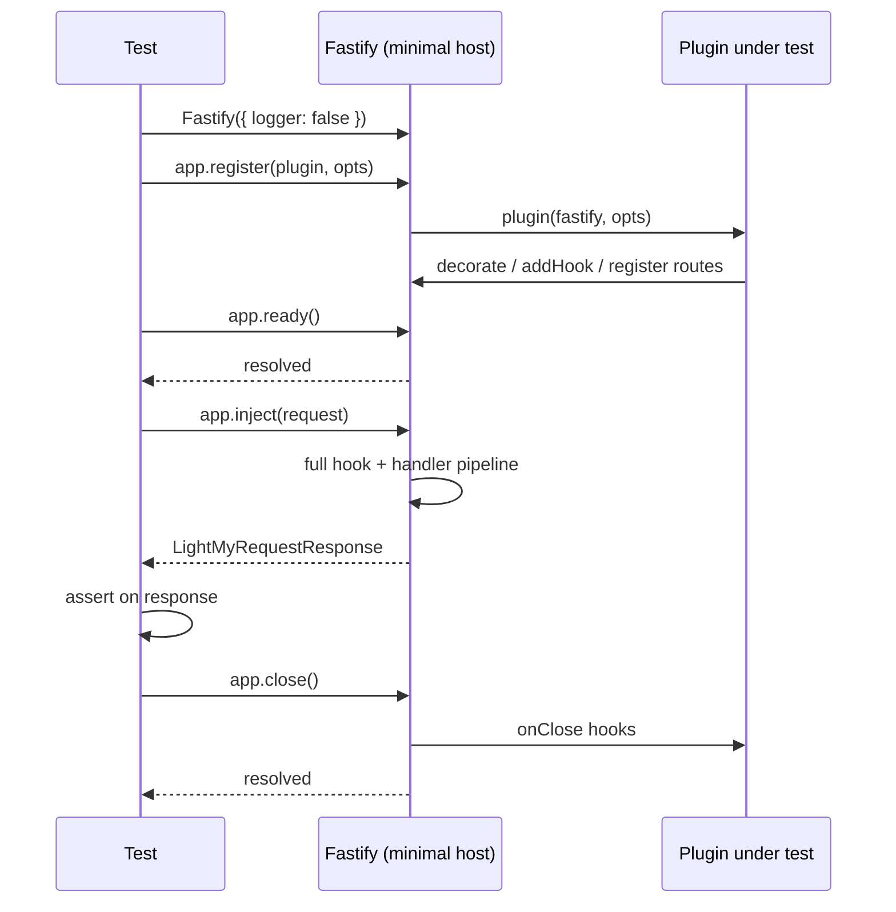

## Integration Testing Plugins

### Overview

A Fastify plugin is a discrete unit of functionality — it may register decorators, add hooks, expose routes, connect to external services, or some combination of these. Integration testing a plugin means mounting it on a minimal Fastify instance and asserting on its observable effects: what it decorates, what routes it registers, how it affects the request lifecycle, and how it behaves under error conditions. This is distinct from testing the full application — only the plugin under test (and its direct dependencies) is loaded.

---

### Why Test Plugins in Isolation

Loading a plugin onto a minimal instance rather than the full application graph produces tests that are:

- **Faster** — only the plugin and its direct dependencies initialize.
- **More precise** — failures point directly at the plugin under test, not at an unrelated part of the app.
- **Independent** — plugin tests do not break when unrelated plugins change.
- **Easier to set up** — no need to satisfy the full dependency tree of the entire application.

[Inference: isolation is most valuable for plugins with non-trivial behavior. Thin plugins that only register a single decorator may not warrant dedicated isolation tests — an integration test through `inject()` on the full app may be sufficient.]

---

### The Minimal Host Pattern

Every plugin integration test follows the same structural pattern: create a bare Fastify instance, register only the plugin under test, call `ready()`, assert, then close.

```typescript
import Fastify from 'fastify'
import myPlugin from '../../src/plugins/my-plugin.js'

test('myPlugin registers correctly', async () => {
  const app = Fastify({ logger: false })

  await app.register(myPlugin, { option: 'value' })
  await app.ready()

  // assert on app state

  await app.close()
})
```

This pattern is the baseline for every example in this document.

---

### Testing Decorator Registration

The most direct plugin test: assert that a decorator is present on the instance after registration.

```typescript
// src/plugins/config.ts
import fp from 'fastify-plugin'
import type { FastifyInstance } from 'fastify'

declare module 'fastify' {
  interface FastifyInstance {
    config: { appName: string; port: number }
  }
}

export default fp(async function configPlugin(fastify: FastifyInstance, opts: { appName: string; port: number }) {
  fastify.decorate('config', {
    appName: opts.appName,
    port: opts.port,
  })
})
```

```typescript
// tests/plugins/config.test.ts
import { test } from 'node:test'
import assert from 'node:assert/strict'
import Fastify from 'fastify'
import configPlugin from '../../src/plugins/config.js'

test('decorates instance with config', async () => {
  const app = Fastify({ logger: false })

  await app.register(configPlugin, { appName: 'TestApp', port: 3000 })
  await app.ready()

  assert.ok(app.config)
  assert.equal(app.config.appName, 'TestApp')
  assert.equal(app.config.port, 3000)

  await app.close()
})

test('config values are accessible from a child scope', async () => {
  const app = Fastify({ logger: false })

  await app.register(configPlugin, { appName: 'TestApp', port: 3000 })

  app.get('/check', async (request, reply) => {
    return { name: request.server.config.appName }
  })

  await app.ready()

  const response = await app.inject({ method: 'GET', url: '/check' })
  assert.equal(response.statusCode, 200)
  assert.equal(response.json().name, 'TestApp')

  await app.close()
})
```

**Key Points:**
- `fastify-plugin` (`fp`) wraps a plugin to break encapsulation — its decorators become visible to the parent scope. Without `fp`, decorators registered inside a plugin are scoped to that plugin's subtree. [Inference: if a plugin is not wrapped with `fp`, accessing its decorator from the host instance in a test will fail — this is expected and is itself a testable behavior.]
- The second test adds a probe route to the minimal host, exercising the decorator through a real request lifecycle.

---

### Testing Request and Reply Decorators

Plugins that decorate `request` or `reply` require a probe route to observe the decorator value at request time:

```typescript
// src/plugins/request-id.ts
import fp from 'fastify-plugin'
import { randomUUID } from 'crypto'

declare module 'fastify' {
  interface FastifyRequest {
    correlationId: string
  }
}

export default fp(async function requestIdPlugin(fastify) {
  fastify.decorateRequest('correlationId', '')

  fastify.addHook('onRequest', async (request) => {
    request.correlationId =
      (request.headers['x-correlation-id'] as string) ?? randomUUID()
  })
})
```

```typescript
// tests/plugins/request-id.test.ts
import { test, describe } from 'node:test'
import assert from 'node:assert/strict'
import Fastify from 'fastify'
import requestIdPlugin from '../../src/plugins/request-id.js'

describe('requestIdPlugin', () => {
  test('uses x-correlation-id header when present', async () => {
    const app = Fastify({ logger: false })
    await app.register(requestIdPlugin)

    app.get('/probe', async (request) => ({
      correlationId: request.correlationId,
    }))

    await app.ready()

    const response = await app.inject({
      method: 'GET',
      url: '/probe',
      headers: { 'x-correlation-id': 'test-id-abc' },
    })

    assert.equal(response.statusCode, 200)
    assert.equal(response.json().correlationId, 'test-id-abc')

    await app.close()
  })

  test('generates a UUID when header is absent', async () => {
    const app = Fastify({ logger: false })
    await app.register(requestIdPlugin)

    app.get('/probe', async (request) => ({
      correlationId: request.correlationId,
    }))

    await app.ready()

    const response = await app.inject({ method: 'GET', url: '/probe' })
    const { correlationId } = response.json()

    assert.match(
      correlationId,
      /^[0-9a-f]{8}-[0-9a-f]{4}-4[0-9a-f]{3}-[89ab][0-9a-f]{3}-[0-9a-f]{12}$/i
    )

    await app.close()
  })
})
```

---

### Testing Hook Behavior

Hooks registered by a plugin affect all requests within their scope. Test them by sending requests through a probe route and asserting on the response or side effects:

```typescript
// src/plugins/rate-limit-header.ts
import fp from 'fastify-plugin'

export default fp(async function rateLimitHeaderPlugin(fastify) {
  fastify.addHook('onSend', async (request, reply) => {
    reply.header('x-ratelimit-limit', '100')
    reply.header('x-ratelimit-remaining', '99')
  })
})
```

```typescript
// tests/plugins/rate-limit-header.test.ts
import { test } from 'node:test'
import assert from 'node:assert/strict'
import Fastify from 'fastify'
import rateLimitHeaderPlugin from '../../src/plugins/rate-limit-header.js'

test('adds rate limit headers to all responses', async () => {
  const app = Fastify({ logger: false })
  await app.register(rateLimitHeaderPlugin)

  app.get('/probe', async () => ({ ok: true }))

  await app.ready()

  const response = await app.inject({ method: 'GET', url: '/probe' })

  assert.equal(response.headers['x-ratelimit-limit'], '100')
  assert.equal(response.headers['x-ratelimit-remaining'], '99')

  await app.close()
})
```

---

### Testing Authentication Plugins

An authentication plugin typically adds an `onRequest` or `preHandler` hook that rejects unauthorized requests. Test both the rejection path and the pass-through path:

```typescript
// src/plugins/api-key-auth.ts
import fp from 'fastify-plugin'

export default fp(async function apiKeyAuth(fastify, opts: { validKey: string }) {
  fastify.addHook('onRequest', async (request, reply) => {
    const key = request.headers['x-api-key']
    if (key !== opts.validKey) {
      reply.code(401).send({ error: 'Unauthorized' })
    }
  })
})
```

```typescript
// tests/plugins/api-key-auth.test.ts
import { describe, test, before, after } from 'node:test'
import assert from 'node:assert/strict'
import Fastify from 'fastify'
import type { FastifyInstance } from 'fastify'
import apiKeyAuth from '../../src/plugins/api-key-auth.js'

describe('apiKeyAuth plugin', () => {
  let app: FastifyInstance

  before(async () => {
    app = Fastify({ logger: false })

    await app.register(apiKeyAuth, { validKey: 'secret-key' })

    app.get('/protected', async () => ({ data: 'sensitive' }))

    await app.ready()
  })

  after(async () => {
    await app.close()
  })

  test('returns 401 when API key is missing', async () => {
    const response = await app.inject({ method: 'GET', url: '/protected' })
    assert.equal(response.statusCode, 401)
    assert.deepEqual(response.json(), { error: 'Unauthorized' })
  })

  test('returns 401 when API key is wrong', async () => {
    const response = await app.inject({
      method: 'GET',
      url: '/protected',
      headers: { 'x-api-key': 'wrong-key' },
    })
    assert.equal(response.statusCode, 401)
  })

  test('returns 200 when API key is correct', async () => {
    const response = await app.inject({
      method: 'GET',
      url: '/protected',
      headers: { 'x-api-key': 'secret-key' },
    })
    assert.equal(response.statusCode, 200)
    assert.deepEqual(response.json(), { data: 'sensitive' })
  })
})
```

---

### Testing Plugins with External Dependencies

Plugins that connect to databases, caches, or external services should receive test doubles via their options object. This avoids real network calls and keeps tests fast and deterministic.

```typescript
// src/plugins/database.ts
import fp from 'fastify-plugin'

export interface Database {
  query<T>(sql: string, params?: unknown[]): Promise<T[]>
  close(): Promise<void>
}

declare module 'fastify' {
  interface FastifyInstance {
    db: Database
  }
}

export default fp(async function databasePlugin(
  fastify,
  opts: { db: Database }
) {
  fastify.decorate('db', opts.db)

  fastify.addHook('onClose', async () => {
    await opts.db.close()
  })
})
```

```typescript
// tests/plugins/database.test.ts
import { test, describe } from 'node:test'
import assert from 'node:assert/strict'
import Fastify from 'fastify'
import databasePlugin from '../../src/plugins/database.js'
import type { Database } from '../../src/plugins/database.js'

function buildFakeDb(overrides: Partial<Database> = {}): Database {
  return {
    query: async () => [],
    close: async () => {},
    ...overrides,
  }
}

describe('databasePlugin', () => {
  test('decorates instance with db', async () => {
    const db = buildFakeDb()
    const app = Fastify({ logger: false })

    await app.register(databasePlugin, { db })
    await app.ready()

    assert.ok(app.db)
    assert.equal(app.db, db)

    await app.close()
  })

  test('calls db.close() on app close', async () => {
    let closeCalled = false
    const db = buildFakeDb({
      close: async () => { closeCalled = true },
    })

    const app = Fastify({ logger: false })
    await app.register(databasePlugin, { db })
    await app.ready()
    await app.close()

    assert.equal(closeCalled, true)
  })
})
```

**Key Points:**
- The `onClose` hook behavior is tested by observing a side effect (the `closeCalled` flag) after calling `app.close()`.
- The fake database is a plain object implementing the `Database` interface — no mocking library required.
- [Inference: this pattern assumes the plugin accepts the dependency as an option. Plugins that construct their own database connection internally are harder to test in isolation and may require network-level interception or environment variable substitution.]

---

### Testing Plugin Encapsulation

Fastify's encapsulation model means a plugin registered without `fastify-plugin` cannot affect its parent scope. This is testable behavior worth asserting on:

```typescript
// src/plugins/scoped-decorator.ts
// NOT wrapped with fp — intentionally scoped
export default async function scopedPlugin(fastify) {
  fastify.decorate('scopedValue', 42)

  fastify.get('/inner', async (request) => ({
    value: request.server.scopedValue,
  }))
}
```

```typescript
// tests/plugins/encapsulation.test.ts
import { test } from 'node:test'
import assert from 'node:assert/strict'
import Fastify from 'fastify'
import scopedPlugin from '../../src/plugins/scoped-decorator.js'

test('scoped decorator is not visible on parent instance', async () => {
  const app = Fastify({ logger: false })

  await app.register(scopedPlugin)
  await app.ready()

  // The decorator is NOT on the parent — hasDecorator returns false
  assert.equal(app.hasDecorator('scopedValue'), false)

  await app.close()
})

test('inner route registered by scoped plugin is reachable', async () => {
  const app = Fastify({ logger: false })

  await app.register(scopedPlugin)
  await app.ready()

  const response = await app.inject({ method: 'GET', url: '/inner' })
  assert.equal(response.statusCode, 200)
  assert.equal(response.json().value, 42)

  await app.close()
})
```

**Key Points:**
- `app.hasDecorator('name')` returns a boolean indicating whether the decorator is visible at the instance level. It is the canonical way to assert on decorator scope.
- Similarly, `app.hasRequestDecorator('name')` and `app.hasReplyDecorator('name')` test request and reply decorator visibility.

---

### Testing Plugin Dependency Ordering

Some plugins depend on decorators registered by other plugins. If the dependency is missing, Fastify throws during `ready()`. This error behavior is testable:

```typescript
// src/plugins/user-service.ts
import fp from 'fastify-plugin'

export default fp(async function userServicePlugin(fastify) {
  // Depends on fastify.db being registered first
  if (!fastify.hasDecorator('db')) {
    throw new Error('userServicePlugin requires the db decorator to be registered first')
  }

  fastify.decorate('userService', {
    getUser: async (id: number) => fastify.db.query('SELECT * FROM users WHERE id = $1', [id]),
  })
})
```

```typescript
test('throws when db decorator is missing', async () => {
  const app = Fastify({ logger: false })

  await app.register(userServicePlugin)

  await assert.rejects(
    () => app.ready(),
    { message: 'userServicePlugin requires the db decorator to be registered first' }
  )

  await app.close()
})

test('registers successfully when db is present', async () => {
  const app = Fastify({ logger: false })

  await app.register(databasePlugin, { db: buildFakeDb() })
  await app.register(userServicePlugin)

  await assert.rejects(
    () => app.ready(),
    // Should NOT throw — if it does, the test fails
  ) // Replace with: await app.ready()

  assert.ok(app.userService)
  await app.close()
})
```

Corrected version of the second test:

```typescript
test('registers successfully when db is present', async () => {
  const app = Fastify({ logger: false })

  await app.register(databasePlugin, { db: buildFakeDb() })
  await app.register(userServicePlugin)
  await app.ready()  // must not throw

  assert.ok(app.userService)

  await app.close()
})
```

---

### Testing Plugins That Register Routes

Plugins that register their own routes are tested by calling `inject()` on the routes they contribute:

```typescript
// src/plugins/health.ts
import fp from 'fastify-plugin'

export default fp(async function healthPlugin(fastify, opts: { version: string }) {
  fastify.get('/health', async () => ({
    status: 'ok',
    version: opts.version,
  }))
})
```

```typescript
// tests/plugins/health.test.ts
import { describe, test, before, after } from 'node:test'
import assert from 'node:assert/strict'
import Fastify from 'fastify'
import type { FastifyInstance } from 'fastify'
import healthPlugin from '../../src/plugins/health.js'

describe('healthPlugin', () => {
  let app: FastifyInstance

  before(async () => {
    app = Fastify({ logger: false })
    await app.register(healthPlugin, { version: '1.2.3' })
    await app.ready()
  })

  after(async () => {
    await app.close()
  })

  test('GET /health returns 200', async () => {
    const response = await app.inject({ method: 'GET', url: '/health' })
    assert.equal(response.statusCode, 200)
  })

  test('response contains status and version', async () => {
    const response = await app.inject({ method: 'GET', url: '/health' })
    assert.deepEqual(response.json(), { status: 'ok', version: '1.2.3' })
  })
})
```

---

### Testing Plugin Error Handling

Plugins can register custom error handlers or transform errors in `onError` hooks. Test these by triggering errors through probe routes:

```typescript
// src/plugins/error-handler.ts
import fp from 'fastify-plugin'

export default fp(async function errorHandlerPlugin(fastify) {
  fastify.setErrorHandler(async (error, request, reply) => {
    const statusCode = error.statusCode ?? 500
    reply.code(statusCode).send({
      error: error.message,
      code: error.code ?? 'INTERNAL_ERROR',
    })
  })
})
```

```typescript
// tests/plugins/error-handler.test.ts
import { describe, test, before, after } from 'node:test'
import assert from 'node:assert/strict'
import Fastify from 'fastify'
import type { FastifyInstance } from 'fastify'
import errorHandlerPlugin from '../../src/plugins/error-handler.js'

describe('errorHandlerPlugin', () => {
  let app: FastifyInstance

  before(async () => {
    app = Fastify({ logger: false })
    await app.register(errorHandlerPlugin)

    app.get('/throw-500', async () => {
      throw new Error('Something broke')
    })

    app.get('/throw-404', async () => {
      const err = Object.assign(new Error('Not found'), {
        statusCode: 404,
        code: 'NOT_FOUND',
      })
      throw err
    })

    await app.ready()
  })

  after(async () => {
    await app.close()
  })

  test('formats 500 errors with INTERNAL_ERROR code', async () => {
    const response = await app.inject({ method: 'GET', url: '/throw-500' })
    assert.equal(response.statusCode, 500)
    assert.deepEqual(response.json(), {
      error: 'Something broke',
      code: 'INTERNAL_ERROR',
    })
  })

  test('preserves statusCode and code from thrown error', async () => {
    const response = await app.inject({ method: 'GET', url: '/throw-404' })
    assert.equal(response.statusCode, 404)
    assert.deepEqual(response.json(), {
      error: 'Not found',
      code: 'NOT_FOUND',
    })
  })
})
```

---

### Lifecycle Diagram for a Plugin Integration Test



---

### Reusable Test Helper for Plugin Tests

When many plugins share the same setup pattern, a helper reduces boilerplate:

```typescript
// tests/helpers/with-plugin.ts
import Fastify from 'fastify'
import type { FastifyInstance, FastifyPlugin, FastifyServerOptions } from 'fastify'

export async function withPlugin<T extends object>(
  plugin: FastifyPlugin<T>,
  opts: T,
  setup?: (app: FastifyInstance) => void,
  fastifyOpts: FastifyServerOptions = { logger: false }
): Promise<FastifyInstance> {
  const app = Fastify(fastifyOpts)
  await app.register(plugin, opts)
  setup?.(app)
  await app.ready()
  return app
}
```

```typescript
// Usage
test('decorates with config', async () => {
  const app = await withPlugin(configPlugin, { appName: 'Test', port: 3000 })

  assert.equal(app.config.appName, 'Test')

  await app.close()
})

test('health route returns 200', async () => {
  const app = await withPlugin(healthPlugin, { version: '1.0.0' })

  const response = await app.inject({ method: 'GET', url: '/health' })
  assert.equal(response.statusCode, 200)

  await app.close()
})
```

---

### Common Issues

**Decorator not visible after `ready()`**

The plugin was not wrapped with `fastify-plugin`. Without `fp`, decorators are scoped to the plugin's own subtree and not visible on the parent instance. Either wrap the plugin with `fp` or assert that the decorator is intentionally not visible (encapsulation test).

**`ready()` resolves but plugin behavior is missing**

The plugin registration is asynchronous but was not awaited correctly. Confirm that `await app.register(...)` and `await app.ready()` are both awaited before assertions run.

**`app.close()` hangs**

The plugin registered an external connection (database, Redis) via an `onClose` hook but the hook itself is async and not completing. Confirm the fake dependency's `close()` method resolves. A real connection was used instead of a fake — confirm the test double is being passed correctly.

**Plugin throws during `ready()` in isolation but not in the full app**

The plugin depends on a decorator registered by another plugin in the full app. In isolation, that decorator is absent. Explicitly register the dependency plugin (or a fake equivalent) before the plugin under test.

---

**Related Topics**
- Testing `fastify-plugin` decorator visibility across scopes
- Testing plugins that wrap third-party Fastify plugins (`@fastify/jwt`, `@fastify/session`)
- Integration testing plugin composition — multiple plugins registered together
- Testing `onClose` hooks and connection teardown behavior
- Using test containers for plugins with real database dependencies
- Asserting on Pino log output from plugins in tests