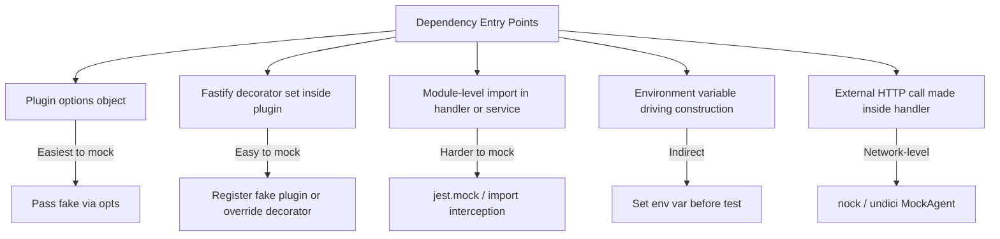

## Mocking Dependencies

### Overview

Mocking in Fastify tests means substituting real dependencies — databases, HTTP clients, queues, external services — with controlled replacements that return predictable values, record how they were called, and avoid network or I/O overhead. Because Fastify uses a plugin-based dependency injection model rather than a framework-level DI container, mocking strategies are architectural: how dependencies enter the application determines how they can be replaced in tests.

---

### Dependency Entry Points in Fastify

Before choosing a mocking strategy, identify where the dependency enters the application:



[Inference: the entry point determines the mocking strategy. Dependencies injected through plugin options are the easiest to replace. Module-level imports are the hardest, because they bypass the plugin system entirely and require either module-level mocking tools or refactoring.]

---

### Strategy 1 — Fake Objects via Plugin Options

The most idiomatic Fastify mocking strategy. The plugin accepts its dependency as an option, and tests pass a plain object implementing the same interface.

```typescript
// src/plugins/mailer.ts
import fp from 'fastify-plugin'

export interface Mailer {
  send(to: string, subject: string, body: string): Promise<void>
}

declare module 'fastify' {
  interface FastifyInstance {
    mailer: Mailer
  }
}

export default fp(async function mailerPlugin(
  fastify,
  opts: { mailer: Mailer }
) {
  fastify.decorate('mailer', opts.mailer)
})
```

```typescript
// tests/plugins/mailer.test.ts
import { test } from 'node:test'
import assert from 'node:assert/strict'
import Fastify from 'fastify'
import mailerPlugin from '../../src/plugins/mailer.js'
import type { Mailer } from '../../src/plugins/mailer.js'

function buildFakeMailer(overrides: Partial<Mailer> = {}): Mailer & {
  calls: Array<{ to: string; subject: string; body: string }>
} {
  const calls: Array<{ to: string; subject: string; body: string }> = []
  return {
    async send(to, subject, body) {
      calls.push({ to, subject, body })
    },
    calls,
    ...overrides,
  } as any
}

test('sends welcome email on user registration', async () => {
  const mailer = buildFakeMailer()
  const app = Fastify({ logger: false })

  await app.register(mailerPlugin, { mailer })
  app.post('/users', async (request, reply) => {
    const { email } = request.body as { email: string }
    await request.server.mailer.send(email, 'Welcome', 'Thanks for signing up')
    reply.code(201).send({ ok: true })
  })

  await app.ready()

  await app.inject({
    method: 'POST',
    url: '/users',
    payload: { email: 'luke@example.com' },
  })

  assert.equal(mailer.calls.length, 1)
  assert.equal(mailer.calls[0].to, 'luke@example.com')
  assert.equal(mailer.calls[0].subject, 'Welcome')

  await app.close()
})
```

**Key Points:**
- The fake mailer is a plain TypeScript object — no mocking library is needed.
- The `calls` array provides introspection: tests can assert on what was sent, to whom, and how many times.
- This approach works without any Jest or `node:test` mock API involvement.

---

### Strategy 2 — Overriding Decorators Directly

When a plugin constructs its own dependency internally (not passed as an option), the decorator it registers can be replaced directly on the Fastify instance after registration but before `ready()`:

```typescript
// src/plugins/database.ts — constructs its own connection
import fp from 'fastify-plugin'
import { createDbConnection } from '../db/connection.js'

export default fp(async function databasePlugin(fastify) {
  const db = await createDbConnection(process.env.DATABASE_URL!)
  fastify.decorate('db', db)

  fastify.addHook('onClose', async () => {
    await db.close()
  })
})
```

```typescript
// tests — override the decorator after registration
import Fastify from 'fastify'
import databasePlugin from '../../src/plugins/database.js'

test('uses injected db in route', async () => {
  const fakeDb = {
    query: async () => [{ id: 1, name: 'Luke' }],
    close: async () => {},
  }

  const app = Fastify({ logger: false })
  await app.register(databasePlugin)

  // Override the decorator before ready()
  app.decorate('db', fakeDb)

  app.get('/users', async () => app.db.query('SELECT * FROM users'))

  await app.ready()

  const response = await app.inject({ method: 'GET', url: '/users' })
  assert.deepEqual(response.json(), [{ id: 1, name: 'Luke' }])

  await app.close()
})
```

[Inference: overriding a decorator that was already set by the plugin may throw `FST_ERR_DEC_ALREADY_PRESENT` depending on the Fastify version and registration order. A safer approach is to build a test-specific `buildApp` factory that accepts overrides and conditionally registers a fake plugin instead of the real one.]

A safer alternative — test-specific factory with conditional registration:

```typescript
// src/app.ts
export interface AppDeps {
  db?: Database
}

export async function buildApp(
  deps: AppDeps = {},
  opts: FastifyServerOptions = {}
): Promise<FastifyInstance> {
  const fastify = Fastify(opts)

  if (deps.db) {
    // Register a thin fake plugin that provides the dep directly
    await fastify.register(fp(async (f) => f.decorate('db', deps.db!)))
  } else {
    await fastify.register(databasePlugin)
  }

  await fastify.register(userRoutes)
  return fastify
}
```

```typescript
// In tests:
const app = await buildApp({ db: fakeDb }, { logger: false })
await app.ready()
```

---

### Strategy 3 — Jest Mock Functions

When using Jest, `jest.fn()` creates mock functions with built-in call tracking, return value configuration, and assertion helpers.

#### Mocking a Service Object

```typescript
import { jest } from '@jest/globals'

function buildMockUserService() {
  return {
    getUser: jest.fn<() => Promise<User | null>>(),
    createUser: jest.fn<() => Promise<User>>(),
    deleteUser: jest.fn<() => Promise<void>>(),
  }
}
```

```typescript
describe('GET /users/:id', () => {
  let app: FastifyInstance
  let userService: ReturnType<typeof buildMockUserService>

  beforeAll(async () => {
    userService = buildMockUserService()
    app = await buildApp({ userService }, { logger: false })
    await app.ready()
  })

  afterAll(async () => {
    await app.close()
  })

  afterEach(() => {
    jest.clearAllMocks()
  })

  test('returns 200 when user exists', async () => {
    userService.getUser.mockResolvedValueOnce({ id: 1, name: 'Luke' })

    const response = await app.inject({ method: 'GET', url: '/users/1' })

    expect(response.statusCode).toBe(200)
    expect(userService.getUser).toHaveBeenCalledWith(1)
    expect(userService.getUser).toHaveBeenCalledTimes(1)
  })

  test('returns 404 when user does not exist', async () => {
    userService.getUser.mockResolvedValueOnce(null)

    const response = await app.inject({ method: 'GET', url: '/users/999' })

    expect(response.statusCode).toBe(404)
  })

  test('returns 500 when service throws', async () => {
    userService.getUser.mockRejectedValueOnce(new Error('DB connection lost'))

    const response = await app.inject({ method: 'GET', url: '/users/1' })

    expect(response.statusCode).toBe(500)
  })
})
```

**Key Points:**
- `mockResolvedValueOnce` sets the return value for a single call. Subsequent calls return `undefined` unless configured otherwise — useful for asserting exact call sequences.
- `mockRejectedValueOnce` simulates a rejected Promise, exercising error handling paths.
- `jest.clearAllMocks()` in `afterEach` resets call history between tests. Without this, call count assertions accumulate across tests.
- `toHaveBeenCalledWith` asserts on argument values — confirms the handler passes the correct ID to the service.

---

### Strategy 4 — node:test Built-in Mocking

From Node.js 20.6.0, `node:test` provides `mock.fn()` and `mock.method()` for creating tracked mock functions without external libraries:

```typescript
import { test, mock } from 'node:test'
import assert from 'node:assert/strict'

test('calls userService.getUser with correct id', async (t) => {
  const mockGetUser = t.mock.fn(async (_id: number) => ({ id: 1, name: 'Luke' }))

  const fakeUserService = { getUser: mockGetUser }
  const app = await buildApp({ userService: fakeUserService as any }, { logger: false })
  await app.ready()

  const response = await app.inject({ method: 'GET', url: '/users/1' })

  assert.equal(response.statusCode, 200)
  assert.equal(mockGetUser.mock.calls.length, 1)
  assert.deepEqual(mockGetUser.mock.calls[0].arguments, [1])

  await app.close()
})
```

**Key Points:**
- `t.mock.fn(implementation)` creates a mock scoped to the test — automatically restored when the test ends.
- `mockFn.mock.calls` is an array of call records. Each record has `.arguments`, `.result`, `.error`, and `.this`.
- `t.mock.method(object, 'methodName', replacement)` replaces a method on an existing object for the duration of the test and restores it afterward.

```typescript
test('replaces a method on an existing object', async (t) => {
  const service = {
    async getUser(id: number) {
      return { id, name: 'Real' }
    },
  }

  t.mock.method(service, 'getUser', async () => ({ id: 99, name: 'Fake' }))

  const result = await service.getUser(1)
  assert.equal(result.name, 'Fake')

  // After the test, service.getUser is restored automatically
})
```

---

### Strategy 5 — Module-Level Mocking with Jest

When a dependency is imported at the module level inside a handler or service — not injected through a plugin — it can only be replaced by intercepting the module system:

```typescript
// src/services/payment.ts
import Stripe from 'stripe'

const stripe = new Stripe(process.env.STRIPE_KEY!, { apiVersion: '2023-10-16' })

export async function chargeCard(amount: number) {
  return stripe.paymentIntents.create({ amount, currency: 'usd' })
}
```

```typescript
// tests/services/payment.test.ts
import { jest } from '@jest/globals'

jest.mock('stripe', () => {
  return jest.fn().mockImplementation(() => ({
    paymentIntents: {
      create: jest.fn().mockResolvedValue({ id: 'pi_test', status: 'succeeded' }),
    },
  }))
})

// Import AFTER jest.mock — hoisting applies
import { chargeCard } from '../../src/services/payment.js'

test('creates a payment intent', async () => {
  const result = await chargeCard(5000)
  expect(result.id).toBe('pi_test')
  expect(result.status).toBe('succeeded')
})
```

**Key Points:**
- `jest.mock()` is hoisted to the top of the file by Jest's Babel transform — it runs before any `import` statements regardless of where it appears in the source.
- The factory function passed to `jest.mock()` replaces the entire module. The replacement must match the shape the code expects.
- [Inference: module-level mocking is fragile — it depends on Jest's module registry and transform pipeline. ESM modules are harder to mock than CommonJS, and `jest.mock()` behavior with native ESM requires `jest.unstable_mockModule()` in some configurations. Verify against your Jest version.]
- Module-level imports that cannot be mocked are a signal that the code may benefit from refactoring to accept dependencies via function parameters or plugin options.

---

### Strategy 6 — Network-Level Interception with nock

For handlers that make outbound HTTP calls using Node's built-in `http`/`https` modules or libraries built on top of them (`node-fetch`, `axios`, `got`), `nock` intercepts at the network layer without requiring any code changes:

```typescript
npm install --save-dev nock
```

```typescript
// src/routes/weather.ts
export async function getWeatherHandler(request, reply) {
  const res = await fetch(`https://api.weather.example.com/current?city=${request.query.city}`)
  const data = await res.json()
  reply.send({ temp: data.temperature })
}
```

```typescript
// tests/routes/weather.test.ts
import nock from 'nock'
import { describe, test, before, after, afterEach } from 'node:test'
import assert from 'node:assert/strict'
import Fastify from 'fastify'

describe('GET /weather', () => {
  let app

  before(async () => {
    app = Fastify({ logger: false })
    app.get('/weather', getWeatherHandler)
    await app.ready()
  })

  after(async () => {
    await app.close()
    nock.cleanAll()
  })

  afterEach(() => {
    nock.cleanAll()
  })

  test('returns temperature from weather API', async () => {
    nock('https://api.weather.example.com')
      .get('/current')
      .query({ city: 'Manila' })
      .reply(200, { temperature: 32 })

    const response = await app.inject({
      method: 'GET',
      url: '/weather',
      query: { city: 'Manila' },
    })

    assert.equal(response.statusCode, 200)
    assert.equal(response.json().temp, 32)
  })

  test('handles upstream 500 error', async () => {
    nock('https://api.weather.example.com')
      .get('/current')
      .query({ city: 'Manila' })
      .reply(500, { error: 'Internal Server Error' })

    const response = await app.inject({
      method: 'GET',
      url: '/weather',
      query: { city: 'Manila' },
    })

    assert.equal(response.statusCode, 500)
  })
})
```

**Key Points:**
- `nock` intercepts requests before they reach the network. No real HTTP connection is made.
- `nock.cleanAll()` in `afterEach` removes all interceptors, preventing leakage between tests.
- `nock` works with Node.js `http`/`https` modules. It does not intercept `undici` requests by default. [Unverified: `nock` and `undici` compatibility varies by version — verify for your environment.]

---

### Strategy 7 — undici MockAgent

For code that uses `undici` (including Node 18+ global `fetch`, which is backed by `undici`), `undici`'s `MockAgent` is the appropriate interception tool:

```typescript
import { MockAgent, setGlobalDispatcher } from 'undici'

test('intercepts global fetch with MockAgent', async () => {
  const agent = new MockAgent()
  agent.disableNetConnect()
  setGlobalDispatcher(agent)

  const mockPool = agent.get('https://api.example.com')
  mockPool.intercept({ path: '/data', method: 'GET' })
    .reply(200, { value: 42 }, { headers: { 'content-type': 'application/json' } })

  const response = await app.inject({ method: 'GET', url: '/data-proxy' })

  assert.equal(response.statusCode, 200)
  assert.equal(response.json().value, 42)

  await agent.close()
})
```

**Key Points:**
- `agent.disableNetConnect()` causes any non-intercepted request to throw, surfacing accidental real network calls during tests.
- `setGlobalDispatcher` replaces the global dispatcher used by `fetch`. Restore it after the test to avoid affecting other tests.
- [Inference: because Node 18+ `fetch` is backed by `undici`, `MockAgent` is the correct interception layer for modern Fastify projects using `fetch`. `nock` may not intercept these requests.]

---

### Comparing Mocking Strategies

| Strategy | Best For | Requires Refactoring | Library |
|---|---|---|---|
| Fake objects via plugin options | Dependencies injected through `opts` | No | None |
| Decorator override / factory override | Plugins that self-construct dependencies | Minimal | None |
| `jest.fn()` mock functions | Call tracking, return value sequences | No | Jest |
| `node:test mock.fn()` | Call tracking without Jest | No | None (Node 20.6+) |
| `jest.mock()` module mocking | Module-level imports | No (but brittle) | Jest |
| `nock` | Outbound HTTP via `http`/`https`/`axios`/`got` | No | nock |
| `undici MockAgent` | Outbound HTTP via `fetch` / `undici` | No | undici (built-in) |

---

### Avoiding Common Mocking Mistakes

**Not resetting mock state between tests**

```typescript
// Jest
afterEach(() => {
  jest.clearAllMocks()   // clears call history
  // jest.resetAllMocks() also resets return values
  // jest.restoreAllMocks() also restores original implementations
})

// node:test — scoped mocks (t.mock.fn) reset automatically
// Module-level mocks need manual cleanup
```

**Mocking too deeply**

Mocking internal implementation details — private methods, internal module state — produces tests that break whenever the implementation changes, even when behavior is unchanged. Mock at the boundary the application uses: the interface, not the internals.

**Sharing mock instances across tests**

```typescript
// Problematic — mock state from test A bleeds into test B
const mockService = buildMockUserService()

test('A', async () => {
  mockService.getUser.mockResolvedValueOnce(user)
  // ...
})

test('B', async () => {
  // mockService.getUser still has call history from test A
  expect(mockService.getUser).toHaveBeenCalledTimes(1) // may fail
})
```

Reset with `jest.clearAllMocks()` in `afterEach`, or construct a fresh mock per test.

**Not asserting that mocks were called**

A test that only asserts on the response but never checks whether the mock was called may pass even if the handler never invokes the dependency:

```typescript
// Incomplete
expect(response.statusCode).toBe(200)

// More complete
expect(response.statusCode).toBe(200)
expect(mockService.getUser).toHaveBeenCalledWith(42)
expect(mockService.getUser).toHaveBeenCalledTimes(1)
```

**Mocking what you do not own**

[Inference: mocking third-party library internals (e.g., replacing methods deep inside a Stripe or Prisma client) is brittle. Prefer wrapping third-party clients behind an interface you control, then mocking the interface. This isolates tests from library version changes.]

---

### Organizing Fakes and Mocks

For larger projects, centralizing fake builders in a `tests/fakes/` directory reduces duplication:

```
tests/
├── fakes/
│   ├── fake-db.ts
│   ├── fake-mailer.ts
│   ├── fake-user-service.ts
│   └── fake-queue.ts
├── helpers/
│   └── build-app.ts
└── routes/
    └── users.test.ts
```

```typescript
// tests/fakes/fake-mailer.ts
import type { Mailer } from '../../src/plugins/mailer.js'

export interface FakeMailer extends Mailer {
  sentEmails: Array<{ to: string; subject: string; body: string }>
  reset(): void
}

export function buildFakeMailer(): FakeMailer {
  const sentEmails: FakeMailer['sentEmails'] = []
  return {
    sentEmails,
    reset() { sentEmails.length = 0 },
    async send(to, subject, body) {
      sentEmails.push({ to, subject, body })
    },
  }
}
```

---

**Related Topics**
- Test doubles taxonomy — fakes, stubs, spies, and mocks defined
- Using Prisma's mock client for database testing in Fastify
- Intercepting and asserting on Pino log output in tests
- Contract testing with mock servers — Pact for Fastify consumer tests
- Managing environment variables in tests with `dotenv` and test-specific `.env` files
- Dependency inversion patterns in Fastify — designing for testability