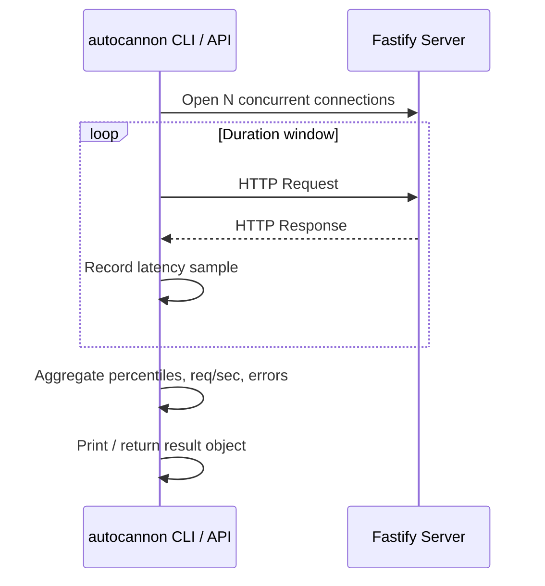

## Benchmarking with autocannon

### Overview

`autocannon` is a Node.js-based HTTP benchmarking tool commonly used to measure Fastify application performance. It is the tool Fastify's own maintainers use in their internal benchmarks. It fires concurrent HTTP requests against a target server and reports throughput, latency, and error statistics.

---

### Installation

```bash
# Global CLI
npm install -g autocannon

# Or as a dev dependency (for programmatic use)
npm install --save-dev autocannon
```

---

### Basic CLI Usage

```bash
autocannon http://localhost:3000/
```

**Common flags:**

| Flag | Description | Default |
|---|---|---|
| `-c` | Number of concurrent connections | 10 |
| `-d` | Duration in seconds | 10 |
| `-p` | Pipelining factor | 1 |
| `-m` | HTTP method | GET |
| `-H` | Custom header (repeatable) | — |
| `-b` | Request body | — |
| `--json` | Output results as JSON | false |
| `-l` | Print latency histogram | false |

**Example — sustained load test:**

```bash
autocannon -c 100 -d 30 http://localhost:3000/api/users
```

This opens 100 concurrent connections for 30 seconds.

---

### Running a Minimal Fastify Server for Benchmarking

```js
// server.js
import Fastify from 'fastify'

const fastify = Fastify({ logger: false }) // disable logger for benchmark accuracy

fastify.get('/', async (request, reply) => {
  return { hello: 'world' }
})

await fastify.listen({ port: 3000, host: '0.0.0.0' })
console.log('Server listening on port 3000')
```

> **Key Point:** Disable the logger (`logger: false`) during benchmarks. The default Pino logger adds measurable I/O overhead that inflates latency numbers and reduces throughput figures. The benchmark should reflect your route logic, not logging cost.

---

### Reading the Output

```
Running 10s test @ http://localhost:3000/
100 connections

┌─────────┬──────┬──────┬───────┬──────┬─────────┬─────────┬──────────┐
│ Stat    │ 2.5% │ 50%  │ 97.5% │ 99%  │ Avg     │ Stdev   │ Max      │
├─────────┼──────┼──────┼───────┼──────┼─────────┼─────────┼──────────┤
│ Latency │ 1 ms │ 2 ms │ 5 ms  │ 6 ms │ 2.14 ms │ 1.06 ms │ 28.00 ms │
└─────────┴──────┴──────┴───────┴──────┴─────────┴─────────┴──────────┘
┌───────────┬─────────┬─────────┬─────────┬────────┬─────────┬───────┬─────────┐
│ Stat      │ 1%      │ 2.5%    │ 50%     │ 97.5%  │ Avg     │ Stdev │ Min     │
├───────────┼─────────┼─────────┼─────────┼────────┼─────────┼───────┼─────────┤
│ Req/Sec   │ 41,983  │ 41,983  │ 45,503  │ 46,655 │ 45,161  │ 1,256 │ 41,983  │
├───────────┼─────────┼─────────┼─────────┼────────┼─────────┼───────┼─────────┤
│ Bytes/Sec │ 6.37 MB │ 6.37 MB │ 6.91 MB │ 7.1 MB │ 6.85 MB │ 191 kB│ 6.37 MB │
└───────────┴─────────┴─────────┴─────────┴────────┴─────────┴───────┴─────────┘
```

**Interpreting results:**

- **Latency table** — percentile distribution of response times. The `97.5%` and `99%` columns expose tail latency, which matters for real-world user experience.
- **Req/Sec** — requests per second throughput. The `1%` column is the worst-second floor; wide spread between `1%` and `50%` indicates inconsistency.
- **Bytes/Sec** — total data transferred per second, useful for payload-heavy routes.
- **Stdev** — standard deviation across samples. High stdev means unstable throughput.

---

### Programmatic API

Autocannon can be driven from Node.js directly, which is useful for automated regression testing or CI pipelines.

```js
import autocannon from 'autocannon'

const result = await autocannon({
  url: 'http://localhost:3000/',
  connections: 100,
  duration: 10,
  pipelining: 1,
})

console.log(autocannon.printResult(result))
```

**Accessing specific metrics:**

```js
const { requests, latency, throughput } = result

console.log('Avg req/sec:', requests.average)
console.log('p99 latency (ms):', latency.p99)
console.log('Errors:', result.errors)
console.log('Timeouts:', result.timeouts)
```

**Example — asserting a performance baseline:**

```js
import autocannon from 'autocannon'
import assert from 'node:assert'

const result = await autocannon({
  url: 'http://localhost:3000/',
  connections: 50,
  duration: 10,
})

assert.ok(
  result.requests.average >= 30_000,
  `Throughput regression: got ${result.requests.average} req/s, expected >= 30000`
)
assert.ok(
  result.latency.p99 <= 10,
  `p99 latency regression: got ${result.latency.p99}ms, expected <= 10ms`
)

console.log('Performance baseline passed.')
```

> [Inference] This pattern can be integrated into a CI step that fails the build on throughput regressions. Actual thresholds depend on hardware, Node.js version, and server load — behavior may vary across environments.

---

### POST Requests with a Body

```bash
autocannon \
  -c 50 \
  -d 10 \
  -m POST \
  -H "Content-Type: application/json" \
  -b '{"name":"Luke","role":"admin"}' \
  http://localhost:3000/api/users
```

**Programmatic equivalent:**

```js
const result = await autocannon({
  url: 'http://localhost:3000/api/users',
  method: 'POST',
  headers: { 'content-type': 'application/json' },
  body: JSON.stringify({ name: 'Luke', role: 'admin' }),
  connections: 50,
  duration: 10,
})
```

---

### Multiple Requests (Request Array)

You can cycle through a list of requests, useful for simulating varied workloads:

```js
const result = await autocannon({
  url: 'http://localhost:3000',
  connections: 50,
  duration: 10,
  requests: [
    { method: 'GET', path: '/api/users' },
    { method: 'GET', path: '/api/products' },
    {
      method: 'POST',
      path: '/api/orders',
      headers: { 'content-type': 'application/json' },
      body: JSON.stringify({ item: 'widget', qty: 2 }),
    },
  ],
})
```

> **Key Point:** Requests are cycled in order, round-robin across connections. This is not a realistic session simulation — there is no guaranteed ordering per connection. Use it to distribute load across routes, not to model user flows.

---

### Pipelining

HTTP pipelining sends multiple requests over the same connection without waiting for each response. It can dramatically increase raw throughput numbers on routes with very low processing time.

```bash
autocannon -c 10 -p 10 -d 10 http://localhost:3000/
```

> **Key Point:** Pipelining numbers are not representative of typical browser or API client behavior. Most HTTP/1.1 clients do not pipeline. Use `-p 1` (default) for realistic latency profiling. Pipelining is useful for finding the absolute ceiling of your server's throughput, not for simulating production traffic.

---

### Warming Up the Server Before Benchmarking

Node.js JIT compilation and V8 optimization passes affect early request performance. A warm-up phase produces more stable results.

```js
import autocannon from 'autocannon'
import { build } from './app.js' // your Fastify app factory

const app = await build()
await app.listen({ port: 3000 })

// Warm-up run — results discarded
await autocannon({ url: 'http://localhost:3000/', connections: 10, duration: 3 })

// Actual benchmark
const result = await autocannon({
  url: 'http://localhost:3000/',
  connections: 100,
  duration: 30,
})

console.log(autocannon.printResult(result))
await app.close()
```

---

### Using `autocannon` with `inject` (No Network Overhead)

For pure route handler benchmarks that isolate application logic from TCP/HTTP stack overhead, Fastify's built-in `inject` can be used. This is not `autocannon` directly, but is a complement to it.

```js
import Fastify from 'fastify'
import { performance } from 'node:perf_hooks'

const fastify = Fastify({ logger: false })

fastify.get('/', async () => ({ hello: 'world' }))
await fastify.ready()

const ITERATIONS = 100_000
const start = performance.now()

for (let i = 0; i < ITERATIONS; i++) {
  await fastify.inject({ method: 'GET', url: '/' })
}

const elapsed = performance.now() - start
console.log(`${ITERATIONS} injected requests in ${elapsed.toFixed(2)}ms`)
console.log(`Avg: ${(elapsed / ITERATIONS).toFixed(4)}ms per request`)

await fastify.close()
```

> [Inference] `inject` bypasses the OS network stack entirely, so numbers will be significantly higher than real-world `autocannon` results. Use it to compare relative performance between route implementations, not absolute throughput.

---

### Benchmark Methodology Notes

These factors affect result reliability:

**Isolate your environment:**
- Do not run other CPU-intensive processes during the benchmark.
- On Linux, consider using `taskset` to pin the server and benchmarker to separate CPU cores to avoid resource contention.
- [Inference] Running both `autocannon` and the Fastify server on the same machine introduces measurement noise, since they compete for CPU time.

**Run multiple iterations:**
- A single run is not statistically reliable. Run at least 3–5 times and compare the median.
- Discard the first run (JIT warm-up).

**Match connection count to your target scenario:**
- `-c 10` simulates low-concurrency APIs.
- `-c 100` to `-c 500` simulates moderate web traffic.
- High connection counts with `-c 1000+` test socket backlog and event loop saturation limits.

**Watch for errors and timeouts:**
- Non-zero `result.errors` or `result.timeouts` values mean the server dropped requests under load — throughput numbers from such runs are not meaningful.

```js
if (result.errors > 0 || result.timeouts > 0) {
  console.warn(`Unreliable run: ${result.errors} errors, ${result.timeouts} timeouts`)
}
```

---

### Visualizing Latency Distribution

A rough ASCII latency histogram is available via the `-l` CLI flag:

```bash
autocannon -c 100 -d 10 -l http://localhost:3000/
```

This appends a percentile histogram to the output, showing how latency is distributed across the full percentile range (not just the table summary).

---

### Diagram — Autocannon Benchmark Flow



---

**Related Topics**

- Profiling Fastify with `0x` (flame graphs)
- Using `clinic.js` (Doctor, Bubbleprof, Flame) for bottleneck analysis
- Node.js `--prof` and V8 tick-profiler output
- Schema serialization performance with `fast-json-stringify`
- Route-level caching strategies and their throughput impact
- Load testing with `k6` for scenario-based traffic simulation
- Connection pooling behavior under high concurrency
- Event loop lag measurement with `perf_hooks` and `diagnostic_channel`