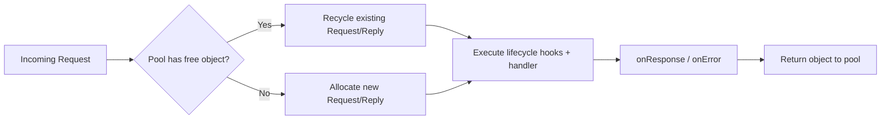
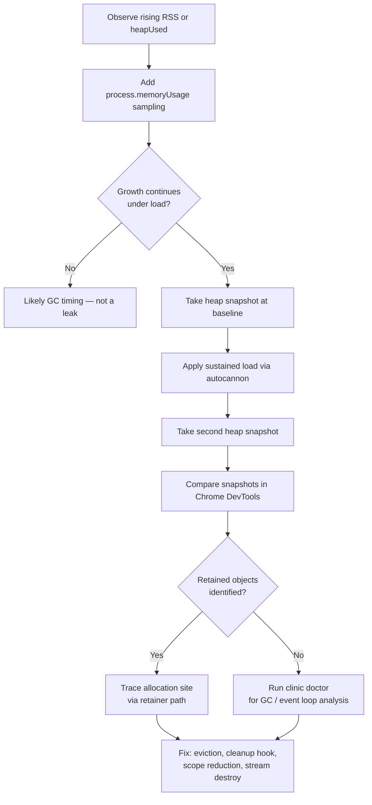

## Memory Management in Fastify

### Overview

Memory management in a Fastify application operates at two levels: the Node.js runtime (V8 heap, garbage collector, Buffer allocations) and application-level patterns (request lifecycle leaks, plugin scope, caching, streams). Understanding both levels is necessary to diagnose and prevent memory growth in long-running Fastify processes.

---

### Node.js Memory Model Basics

Node.js memory is divided into several regions:

| Region | Contents |
|---|---|
| **V8 Heap (Young)** | Short-lived objects; collected by minor GC (Scavenge) |
| **V8 Heap (Old)** | Long-lived objects promoted from young space |
| **Code Space** | JIT-compiled machine code |
| **Large Object Space** | Objects exceeding heap page size (e.g., large Buffers on heap) |
| **Off-heap (ArrayBuffer / Buffer)** | Raw memory outside V8 heap, managed by Node.js |
| **External** | C++ allocations referenced by JS objects |

`process.memoryUsage()` exposes these at runtime:

```js
const mem = process.memoryUsage()
// {
//   rss: 62910464,        // Resident Set Size — total process memory
//   heapTotal: 20971520,  // Total heap allocated by V8
//   heapUsed: 14823312,   // Heap actively used
//   external: 1234567,    // Off-heap C++ / Buffer allocations
//   arrayBuffers: 987654  // ArrayBuffer + SharedArrayBuffer allocations
// }
```

> **Key Point:** `heapUsed` growing continuously across requests without plateauing is the primary indicator of a heap memory leak. `rss` growing without `heapUsed` growing may indicate off-heap (Buffer/ArrayBuffer) growth.

---

### Monitoring Memory During a Running Server

#### Periodic Sampling

```js
import Fastify from 'fastify'

const fastify = Fastify({ logger: true })

setInterval(() => {
  const { heapUsed, heapTotal, rss, external } = process.memoryUsage()
  fastify.log.info({
    heapUsed: (heapUsed / 1024 / 1024).toFixed(2) + ' MB',
    heapTotal: (heapTotal / 1024 / 1024).toFixed(2) + ' MB',
    rss: (rss / 1024 / 1024).toFixed(2) + ' MB',
    external: (external / 1024 / 1024).toFixed(2) + ' MB',
  }, 'memory sample')
}, 10_000).unref() // .unref() prevents the interval from keeping the process alive

fastify.get('/', async () => ({ ok: true }))
await fastify.listen({ port: 3000 })
```

> **Key Point:** `.unref()` on the interval is important. Without it, the interval holds the event loop open and prevents graceful shutdown.

#### Exposing a `/memory` Diagnostic Route

```js
fastify.get('/internal/memory', {
  onRequest: [requireInternalAuth], // protect this route
}, async () => {
  const mem = process.memoryUsage()
  return {
    heapUsedMB: (mem.heapUsed / 1024 / 1024).toFixed(2),
    heapTotalMB: (mem.heapTotal / 1024 / 1024).toFixed(2),
    rssMB: (mem.rss / 1024 / 1024).toFixed(2),
    externalMB: (mem.external / 1024 / 1024).toFixed(2),
  }
})
```

---

### Common Memory Leak Patterns in Fastify Applications

#### 1. Unbounded In-Memory Caches

The most frequent source of memory growth in production Fastify applications.

```js
// LEAK: cache grows without bound
const cache = new Map()

fastify.get('/user/:id', async (request) => {
  const { id } = request.params
  if (cache.has(id)) return cache.get(id)
  const user = await db.findUser(id)
  cache.set(id, user) // never evicted
  return user
})
```

**Fix — LRU eviction with `lru-cache`:**

```js
import { LRUCache } from 'lru-cache'

const cache = new LRUCache({
  max: 500,          // max number of entries
  ttl: 1000 * 60,   // 60 second TTL per entry
})

fastify.get('/user/:id', async (request) => {
  const { id } = request.params
  const cached = cache.get(id)
  if (cached) return cached
  const user = await db.findUser(id)
  cache.set(id, user)
  return user
})
```

---

#### 2. Event Emitter Listener Accumulation

Adding listeners inside request handlers without removing them causes listener count to grow with every request.

```js
// LEAK: new listener registered on every request
fastify.get('/subscribe', async (request, reply) => {
  someEmitter.on('data', (data) => {
    // handler registered per request, never removed
    reply.send(data)
  })
})
```

**Fix — register once at startup, or clean up per request:**

```js
fastify.get('/subscribe', async (request, reply) => {
  const handler = (data) => reply.send(data)
  someEmitter.once('data', handler) // fires once then auto-removes

  request.raw.on('close', () => {
    someEmitter.off('data', handler) // clean up if client disconnects early
  })
})
```

---

#### 3. Closures Capturing Large Scope

Closures defined inside route handlers that capture large objects from outer scope keep those objects alive for the duration of the closure's lifetime.

```js
// LEAK risk: handler closure captures entire `config` object
const config = loadHugeConfigObject()

fastify.get('/info', async () => {
  return { version: config.version } // only needs one field, but holds entire config
})
```

**Fix — extract only what is needed:**

```js
const appVersion = config.version // capture only the scalar

fastify.get('/info', async () => {
  return { version: appVersion }
})
```

---

#### 4. Accumulation on `fastify` or `request` Decorators

Decorating the `fastify` instance with mutable collections that grow per request.

```js
// LEAK: appending to a decoration on every request
fastify.decorate('requestLog', [])

fastify.addHook('onRequest', async (request) => {
  fastify.requestLog.push({ url: request.url, time: Date.now() })
  // array grows indefinitely
})
```

**Fix — use a bounded structure, or log externally:**

```js
fastify.decorate('requestLog', new LRUCache({ max: 1000 }))

fastify.addHook('onRequest', async (request) => {
  fastify.requestLog.set(request.id, { url: request.url, time: Date.now() })
})
```

---

#### 5. Holding References to `request` or `reply` After the Lifecycle

`request` and `reply` objects are pooled and reused across requests in Fastify. [Inference] Retaining a reference to them outside the request lifecycle may prevent garbage collection of the object's properties for longer than expected. Behavior may vary across Fastify versions.

```js
const activeRequests = new Set()

fastify.addHook('onRequest', async (request) => {
  activeRequests.add(request) // holds reference beyond lifecycle
})

fastify.addHook('onResponse', async (request) => {
  activeRequests.delete(request) // must clean up
})
```

> **Key Point:** If you store request or reply references, always clean them up in `onResponse` or `onError`.

---

#### 6. Stream Leaks

Streams that are not consumed or destroyed accumulate in memory.

```js
// LEAK: stream created but never piped or destroyed on error
fastify.get('/download', async (request, reply) => {
  const stream = fs.createReadStream('/large/file.dat')
  // if reply.send throws or client disconnects, stream may not be closed
  return reply.send(stream)
})
```

**Fix — attach error and close handlers:**

```js
fastify.get('/download', async (request, reply) => {
  const stream = fs.createReadStream('/large/file.dat')

  stream.on('error', (err) => {
    stream.destroy()
    reply.send(err)
  })

  request.raw.on('close', () => {
    stream.destroy() // client disconnected
  })

  return reply.send(stream)
})
```

---

### Fastify Request Object Lifecycle and Pooling

Fastify reuses `request` and `reply` objects via an internal pool to reduce GC pressure. Each incoming request recycles an existing object rather than allocating a new one.



> **Key Point:** This is why mutating `request.raw` or `reply.raw` directly with persistent properties is risky — pooled objects carry state across requests if not explicitly cleared. Use `reply.hijack()` or `request.id`-keyed external maps instead of storing state on the raw objects directly.

---

### Plugin Scope and Memory

Each Fastify plugin runs in an encapsulated scope via `fastify-plugin` semantics. Plugins that are not wrapped with `fastify-plugin` do not leak their decorations to the parent scope.

```js
// Scoped plugin — decorations do NOT leak to parent
fastify.register(async (instance) => {
  instance.decorate('privateCache', new Map())
  // privateCache is only accessible inside this scope
})

// fastify.privateCache is undefined here
```

```js
import fp from 'fastify-plugin'

// Unscoped plugin — decorations ARE visible to parent
fastify.register(fp(async (instance) => {
  instance.decorate('sharedCache', new Map())
}))

// fastify.sharedCache is accessible here
```

> **Key Point:** Shared caches registered via `fastify-plugin` live for the entire server lifetime. Scoped caches are eligible for GC when the scope's plugin is torn down during `fastify.close()`. [Inference] For large or bounded caches that do not need to be shared, prefer scoped registration.

---

### Forcing and Observing Garbage Collection

V8 exposes manual GC triggering behind a flag, useful during profiling:

```bash
node --expose-gc server.js
```

```js
fastify.get('/internal/gc', {
  onRequest: [requireInternalAuth],
}, async () => {
  const before = process.memoryUsage().heapUsed
  global.gc()
  const after = process.memoryUsage().heapUsed
  return {
    freedMB: ((before - after) / 1024 / 1024).toFixed(2),
    heapUsedAfterMB: (after / 1024 / 1024).toFixed(2),
  }
})
```

> [Inference] Manually calling `global.gc()` in production is not a recommended pattern. It pauses the event loop for the duration of the GC cycle. Use it only in diagnostic or profiling contexts. Behavior and pause duration vary with heap size and GC strategy.

---

### Taking Heap Snapshots

V8 heap snapshots capture a full object graph at a point in time. Comparing two snapshots (before and after a load pattern) identifies objects that were allocated and not collected.

```js
import v8 from 'node:v8'
import fs from 'node:fs'
import path from 'node:path'

fastify.get('/internal/heapsnapshot', {
  onRequest: [requireInternalAuth],
}, async (request, reply) => {
  const filename = `heap-${Date.now()}.heapsnapshot`
  const filepath = path.join('/tmp', filename)

  const snapshotStream = v8.writeHeapSnapshot(filepath)

  reply.header('Content-Disposition', `attachment; filename="${filename}"`)
  reply.type('application/octet-stream')
  return reply.send(fs.createReadStream(snapshotStream))
})
```

Load the `.heapsnapshot` file in Chrome DevTools → Memory tab → Load snapshot.

> **Key Point:** Taking a heap snapshot is a stop-the-world operation. It will pause your server for the full duration of the snapshot write, which scales with heap size. Do not expose this endpoint without authentication, and do not call it under load in production.

---

### Using `clinic.js` for Memory Profiling

`clinic doctor` detects memory growth trends automatically:

```bash
npm install -g clinic autocannon

clinic doctor -- node server.js
```

In a separate terminal, apply load:

```bash
autocannon -c 100 -d 30 http://localhost:3000/
```

`clinic doctor` produces an HTML report that flags:

- Heap growth over time
- GC frequency and duration
- Event loop delay correlated with GC pauses

> [Inference] `clinic bubbleprof` is more useful for identifying async bottlenecks; `clinic doctor` is the right starting tool for suspected memory issues.

---

### Memory Usage in Fastify Plugins — Reference Table

| Plugin / Pattern | Memory Consideration |
|---|---|
| `@fastify/caching` | Stores responses in memory by default — set `max` and `expiresIn` |
| `@fastify/session` | Session store defaults to in-memory — leaks without TTL/eviction |
| `@fastify/multipart` | Temporary file buffers — call `file.toBuffer()` then discard or stream directly |
| `@fastify/rate-limit` | In-memory rate counters — grows with unique IPs unless using external store (Redis) |
| `@fastify/websocket` | Each open connection holds a socket reference — track and close on server shutdown |

---

### Graceful Shutdown and Memory Cleanup

Releasing resources on shutdown reduces the risk of zombie references during process teardown.

```js
const closeGracefully = async (signal) => {
  fastify.log.info(`Received ${signal}, shutting down`)
  await fastify.close() // triggers onClose hooks, closes plugins
  process.exit(0)
}

process.on('SIGTERM', closeGracefully)
process.on('SIGINT', closeGracefully)
```

Register cleanup in plugins via `addHook('onClose', ...)`:

```js
fastify.register(async (instance) => {
  const cache = new Map()
  instance.decorate('cache', cache)

  instance.addHook('onClose', async () => {
    cache.clear() // release all entries before shutdown
  })
})
```

---

### Diagram — Memory Leak Detection Workflow



---

**Related Topics**

- Profiling with `0x` and V8 flame graphs
- `clinic.js` — Doctor, Bubbleprof, and Flame in depth
- V8 GC tuning flags (`--max-old-space-size`, `--gc-interval`)
- Buffer and `ArrayBuffer` off-heap allocation patterns
- `@fastify/under-pressure` for memory-based backpressure and health checks
- Redis-backed session and rate-limit stores to offload in-memory state
- Worker threads and `SharedArrayBuffer` for CPU-bound isolation
- Heap snapshot diff analysis workflow in Chrome DevTools