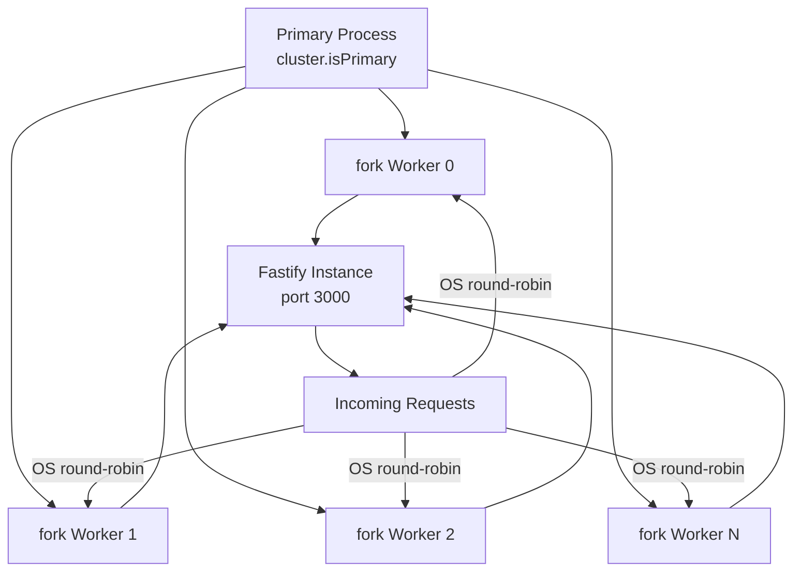
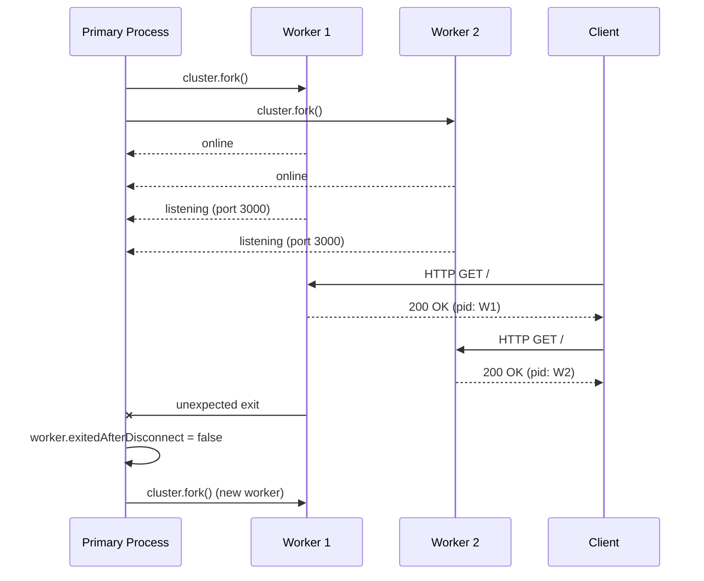

## Cluster Mode with Node.js

### Overview

Node.js runs in a single thread by default, using one CPU core. The built-in `cluster` module allows a primary process to fork multiple worker processes, each running its own event loop and V8 instance, all sharing the same TCP port. For Fastify applications, cluster mode is the standard approach to utilizing all available CPU cores on a single machine without an external process manager.

---

### How the Cluster Module Works



- The primary process does not handle HTTP requests — it only manages worker lifecycle.
- All workers bind to the same port; the OS (or Node.js on some platforms) distributes connections across them.
- Each worker is a fully independent process with its own heap and memory space.
- Workers do not share memory with each other or with the primary.

---

### Basic Cluster Setup with Fastify

```js
// cluster.js
import cluster from 'node:cluster'
import os from 'node:os'
import { fileURLToPath } from 'node:url'

const NUM_WORKERS = os.availableParallelism?.() ?? os.cpus().length

if (cluster.isPrimary) {
  console.log(`Primary ${process.pid} started — forking ${NUM_WORKERS} workers`)

  for (let i = 0; i < NUM_WORKERS; i++) {
    cluster.fork()
  }

  cluster.on('exit', (worker, code, signal) => {
    console.warn(`Worker ${worker.process.pid} exited (code=${code}, signal=${signal}) — reforking`)
    cluster.fork()
  })
} else {
  // Each worker runs this block independently
  const { buildApp } = await import('./app.js')
  const fastify = await buildApp()
  await fastify.listen({ port: 3000, host: '0.0.0.0' })
  console.log(`Worker ${process.pid} listening`)
}
```

```js
// app.js — Fastify app factory
import Fastify from 'fastify'

export async function buildApp() {
  const fastify = Fastify({ logger: true })

  fastify.get('/', async () => ({ pid: process.pid, ok: true }))

  return fastify
}
```

> **Key Point:** The app factory pattern (`buildApp`) is critical for cluster mode. Each worker imports and instantiates its own Fastify instance independently. There is no shared state between workers unless you explicitly implement it via IPC or an external store.

---

### `os.availableParallelism()`

Introduced in Node.js 19. Preferred over `os.cpus().length` because it respects CPU affinity masks and container CPU limits (e.g., cgroups in Docker/Kubernetes).

```js
// Node.js >= 19
const workers = os.availableParallelism()

// Fallback for older Node.js
const workers = os.availableParallelism?.() ?? os.cpus().length
```

> [Inference] In containerized environments with CPU limits (e.g., `--cpus=2` in Docker), `os.cpus().length` returns the host machine's full core count, which causes over-forking. `os.availableParallelism()` is more accurate in those contexts. Behavior may vary across Node.js versions and container runtimes.

---

### Connection Distribution

On Linux, Node.js cluster uses a round-robin scheduling policy by default (since Node.js 0.12). The primary process accepts connections and distributes them to workers in order.

On Windows, the OS handles distribution directly, which can result in uneven load distribution. [Inference] This is generally not a concern in production Linux deployments.

You can explicitly set the scheduling policy:

```js
import cluster from 'node:cluster'

// Round-robin (default on Linux/macOS)
cluster.schedulingPolicy = cluster.SCHED_RR

// OS-level scheduling
cluster.schedulingPolicy = cluster.SCHED_NONE
```

> **Key Point:** `SCHED_RR` must be set before any workers are forked. Setting it after the first `cluster.fork()` call has no effect.

---

### Worker Lifecycle Management

#### Tracking Workers

```js
const workers = new Map()

cluster.on('online', (worker) => {
  workers.set(worker.id, worker)
  console.log(`Worker ${worker.id} (pid ${worker.process.pid}) online`)
})

cluster.on('exit', (worker, code, signal) => {
  workers.delete(worker.id)
  console.warn(`Worker ${worker.id} exited`)

  // Only refork on unexpected exits
  if (!worker.exitedAfterDisconnect) {
    console.log('Unexpected exit — reforking')
    cluster.fork()
  }
})
```

> **Key Point:** `worker.exitedAfterDisconnect` is `true` when the worker was intentionally disconnected via `worker.disconnect()`. Check this flag before reforking to avoid reforking during graceful shutdown.

---

#### Graceful Restart (Zero-Downtime Rolling Restart)

```js
// In primary process
const restartWorkers = async () => {
  const workerList = [...Object.values(cluster.workers)]

  for (const worker of workerList) {
    await new Promise((resolve) => {
      // Wait for new worker to come online before killing current
      const newWorker = cluster.fork()
      newWorker.on('listening', () => {
        console.log(`New worker ${newWorker.process.pid} online — disconnecting old worker ${worker.process.pid}`)
        worker.disconnect()
        resolve()
      })
    })
  }
}

process.on('SIGUSR2', restartWorkers)
```

Trigger from shell:

```bash
kill -SIGUSR2 <primary_pid>
```

> [Inference] This pattern replaces workers one at a time, keeping at least `N-1` workers alive during the restart window. The actual behavior depends on the time it takes each new worker to start and emit `listening`. Behavior may vary under high concurrency. Test under load before relying on this in production.

---

#### Graceful Shutdown

```js
// In primary process
const shutdown = async (signal) => {
  console.log(`${signal} received — shutting down cluster`)

  const workerList = Object.values(cluster.workers)
  let remaining = workerList.length

  if (remaining === 0) process.exit(0)

  for (const worker of workerList) {
    worker.send('shutdown')
    worker.disconnect()
    setTimeout(() => {
      if (!worker.isDead()) {
        console.warn(`Force killing worker ${worker.process.pid}`)
        worker.kill()
      }
    }, 5000).unref()
  }
}

// In worker process
process.on('message', async (msg) => {
  if (msg === 'shutdown') {
    await fastify.close()
    process.exit(0)
  }
})

process.on('SIGTERM', () => shutdown('SIGTERM'))
process.on('SIGINT', () => shutdown('SIGINT'))
```

---

### Inter-Process Communication (IPC)

Workers cannot share memory, but they can pass messages to the primary and to each other (via the primary as relay) using `process.send()` and `worker.send()`.

#### Worker → Primary

```js
// In worker
process.send({ type: 'metrics', pid: process.pid, reqCount: localCounter })

// In primary
cluster.on('message', (worker, message) => {
  if (message.type === 'metrics') {
    console.log(`Worker ${worker.id}: ${message.reqCount} requests`)
  }
})
```

#### Primary → All Workers (Broadcast)

```js
const broadcast = (message) => {
  for (const worker of Object.values(cluster.workers)) {
    worker.send(message)
  }
}

broadcast({ type: 'config-reload', config: newConfig })
```

#### Worker → Worker (via Primary Relay)

```js
// In primary
cluster.on('message', (senderWorker, message) => {
  if (message.type === 'relay') {
    const target = cluster.workers[message.targetWorkerId]
    target?.send({ type: 'relay', payload: message.payload })
  }
})

// In worker — send to worker with id=2
process.send({ type: 'relay', targetWorkerId: 2, payload: { hello: 'from worker 1' } })
```

> **Key Point:** IPC messages are serialized as JSON. Passing large objects or high-frequency messages over IPC adds measurable overhead. [Inference] For high-throughput shared state (e.g., rate limit counters, session data), use an external store (Redis) rather than IPC. Behavior may vary.

---

### Shared State Problem

Each worker has its own memory. In-memory state is not shared:

```js
// This counter is LOCAL to each worker process
let requestCount = 0

fastify.addHook('onResponse', async () => {
  requestCount++ // increments only in this worker
})

fastify.get('/stats', async () => ({
  pid: process.pid,
  requestCount, // reports only this worker's count
}))
```

**Solutions by use case:**

| Use Case | Solution |
|---|---|
| Rate limiting | Redis via `@fastify/rate-limit` with Redis store |
| Session state | Redis via `@fastify/session` + `connect-redis` |
| Aggregated metrics | Prometheus with `prom-client` — each worker exposes `/metrics`, scraper aggregates |
| Pub/sub events | Redis Pub/Sub or a message broker |
| Distributed locks | `redlock` over Redis |
| Simple counters (approx.) | IPC aggregation in primary |

---

### Fastify with `@fastify/rate-limit` in Cluster Mode

Without a shared store, each worker maintains its own rate limit counters — a client can make `limit × numWorkers` requests before being blocked.

```js
import rateLimit from '@fastify/rate-limit'
import Redis from 'ioredis'

const redis = new Redis({ host: 'localhost', port: 6379 })

await fastify.register(rateLimit, {
  max: 100,
  timeWindow: '1 minute',
  redis, // shared across all workers
})
```

---

### Using `pm2` as an Alternative

`pm2` provides cluster mode without managing the `cluster` module manually:

```bash
npm install -g pm2
pm2 start server.js -i max   # fork one process per CPU core
pm2 start server.js -i 4     # fork exactly 4 processes
```

`ecosystem.config.cjs`:

```js
module.exports = {
  apps: [{
    name: 'fastify-app',
    script: './server.js',
    instances: 'max',
    exec_mode: 'cluster',
    watch: false,
    env: {
      NODE_ENV: 'production',
      PORT: 3000,
    },
  }],
}
```

```bash
pm2 start ecosystem.config.cjs
pm2 reload fastify-app   # zero-downtime rolling restart
pm2 logs fastify-app
pm2 monit
```

> **Key Point:** `pm2 reload` performs a rolling restart — it starts a new worker before killing the old one, keeping the port continuously served. `pm2 restart` kills all workers simultaneously and causes a brief downtime window.

---

### Using `@fastify/cluster` (Experimental)

[Unverified] Fastify has an experimental official plugin `@fastify/cluster` that wraps the cluster setup in a Fastify-idiomatic API. Verify current status and API surface in the official repository before using in production, as the API may have changed.

---

### Worker Thread vs Cluster — Distinction

| | `cluster` | `worker_threads` |
|---|---|---|
| **Process isolation** | Full (separate processes) | No (same process, shared memory possible) |
| **Memory** | Independent heaps | Shared `ArrayBuffer` / `SharedArrayBuffer` possible |
| **Use case** | Horizontal scaling of I/O-bound servers | CPU-bound computation offloading |
| **Port sharing** | Built-in | Not applicable |
| **Crash isolation** | Yes — one worker crash does not affect others | No — thread crash can affect process |
| **IPC** | JSON-serialized messages | `MessageChannel`, `SharedArrayBuffer`, `Atomics` |
| **Overhead** | Higher startup cost (full process fork) | Lower startup cost |

> **Key Point:** `cluster` is for scaling Fastify across CPU cores for I/O-bound HTTP workloads. `worker_threads` is for offloading CPU-bound work (e.g., image processing, cryptography, data transformation) from the event loop. These are complementary, not competing approaches.

---

### Diagram — Full Cluster Lifecycle



---

### Performance Considerations

- Cluster mode adds no overhead to request processing — each worker is an independent Fastify process at full speed.
- The primary process is lightweight; its only work is fork management and IPC relay.
- [Inference] Beyond `os.availableParallelism()` workers, additional forks are unlikely to improve throughput and may degrade it due to increased context switching. Behavior depends on workload characteristics.
- Memory usage scales linearly with worker count — each worker holds its own V8 heap. On memory-constrained machines, consider fewer workers with higher `--max-old-space-size`.

```bash
# Example: 4 workers, each capped at 512 MB heap
NODE_OPTIONS=--max-old-space-size=512 node cluster.js
```

---

**Related Topics**

- `worker_threads` for CPU-bound task offloading from Fastify routes
- `pm2` cluster mode, ecosystem files, and zero-downtime deploys
- Redis-backed shared state for clustered Fastify (rate limiting, sessions, pub/sub)
- `prom-client` metrics aggregation across cluster workers
- Kubernetes horizontal pod autoscaling vs single-node cluster mode
- Graceful shutdown patterns under load balancers (SIGTERM handling, readiness probes)
- Connection pooling behavior (database pools) in multi-worker environments
- `--max-old-space-size` tuning per worker under memory constraints