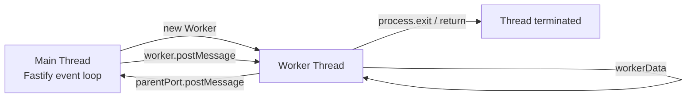
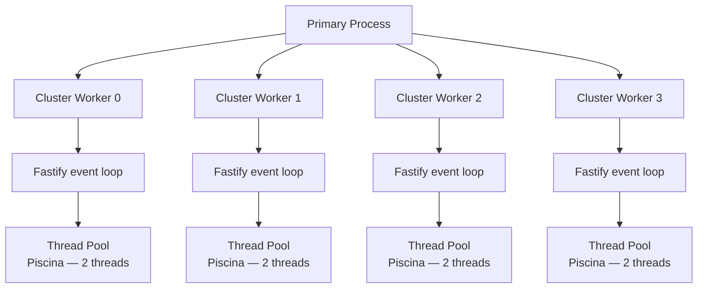

## Worker Threads Integration

### Overview

The `worker_threads` module runs JavaScript in parallel OS threads within the same Node.js process. Unlike `cluster`, worker threads share the same memory address space and can pass data via `SharedArrayBuffer` without serialization. In Fastify, worker threads are used to offload CPU-bound work — cryptography, image processing, data transformation, compression, parsing — that would otherwise block the event loop and degrade request throughput.

---

### When to Use Worker Threads

| Scenario | Worker Threads Appropriate |
|---|---|
| Image resizing / encoding | Yes |
| PDF generation | Yes |
| Heavy JSON parsing (large payloads) | Yes |
| Cryptographic hashing (bcrypt, argon2) | Yes |
| Machine learning inference | Yes |
| CSV / spreadsheet processing | Yes |
| Database queries (I/O bound) | No — use async drivers |
| Outbound HTTP requests | No — async is sufficient |
| Simple route handlers | No — unnecessary overhead |

> **Key Point:** Worker threads do not improve I/O-bound performance. Node.js handles I/O asynchronously without blocking the event loop. Worker threads are exclusively for work that consumes CPU time synchronously.

---

### Core Concepts

#### Thread Lifecycle



#### Communication Primitives

| Primitive | Description |
|---|---|
| `postMessage` / `on('message')` | Structured clone serialization — copies data |
| `SharedArrayBuffer` | Raw shared memory — zero copy, requires `Atomics` for sync |
| `MessageChannel` | Direct channel between any two threads |
| `workerData` | Read-only data passed at thread creation time |
| `receiveMessageOnPort` | Synchronous receive on a `MessagePort` |

---

### Basic Worker Thread in Fastify

#### Worker File

```js
// workers/hash.worker.js
import { workerData, parentPort } from 'node:worker_threads'
import bcrypt from 'bcrypt'

const { password, saltRounds } = workerData

const hash = await bcrypt.hash(password, saltRounds)

parentPort.postMessage({ hash })
```

#### Fastify Route — Spawning a Worker per Request

```js
// routes/auth.js
import Fastify from 'fastify'
import { Worker } from 'node:worker_threads'
import { fileURLToPath } from 'node:url'
import path from 'node:path'

const __dirname = path.dirname(fileURLToPath(import.meta.url))
const fastify = Fastify({ logger: true })

const runWorker = (workerPath, data) =>
  new Promise((resolve, reject) => {
    const worker = new Worker(workerPath, { workerData: data })
    worker.on('message', resolve)
    worker.on('error', reject)
    worker.on('exit', (code) => {
      if (code !== 0) reject(new Error(`Worker exited with code ${code}`))
    })
  })

fastify.post('/register', async (request, reply) => {
  const { password } = request.body

  const { hash } = await runWorker(
    path.join(__dirname, '../workers/hash.worker.js'),
    { password, saltRounds: 12 }
  )

  // store hash in DB...
  return reply.code(201).send({ ok: true })
})
```

> **Key Point:** Spawning a new `Worker` per request has non-trivial startup cost — thread creation, V8 isolate initialization, module loading. [Inference] Under high concurrency, this pattern can become a bottleneck. For sustained load, use a worker pool. Behavior may vary with Node.js version and system resources.

---

### Worker Pool Implementation

A pool maintains a fixed number of worker threads, queuing tasks when all threads are busy.

```js
// lib/worker-pool.js
import { Worker } from 'node:worker_threads'
import path from 'node:path'

export class WorkerPool {
  #workerPath
  #size
  #workers = []
  #queue = []
  #idle = []

  constructor(workerPath, size = 4) {
    this.#workerPath = workerPath
    this.#size = size
    this.#init()
  }

  #init() {
    for (let i = 0; i < this.#size; i++) {
      this.#spawnWorker()
    }
  }

  #spawnWorker() {
    const worker = new Worker(this.#workerPath)

    worker.on('message', (result) => {
      const { resolve, reject } = worker._currentTask
      worker._currentTask = null
      this.#idle.push(worker)
      this.#drain()

      if (result.error) {
        reject(new Error(result.error))
      } else {
        resolve(result.data)
      }
    })

    worker.on('error', (err) => {
      const task = worker._currentTask
      worker._currentTask = null

      // Replace crashed worker
      this.#workers = this.#workers.filter(w => w !== worker)
      this.#spawnWorker()

      if (task) task.reject(err)
      this.#drain()
    })

    worker._currentTask = null
    this.#workers.push(worker)
    this.#idle.push(worker)
  }

  #drain() {
    if (this.#queue.length === 0 || this.#idle.length === 0) return
    const worker = this.#idle.pop()
    const task = this.#queue.shift()
    worker._currentTask = task
    worker.postMessage(task.data)
  }

  run(data) {
    return new Promise((resolve, reject) => {
      this.#queue.push({ data, resolve, reject })
      this.#drain()
    })
  }

  async destroy() {
    await Promise.all(this.#workers.map(w => w.terminate()))
  }
}
```

#### Pool Worker File (Persistent — Handles Multiple Tasks)

```js
// workers/hash.persistent.worker.js
import { parentPort } from 'node:worker_threads'
import bcrypt from 'bcrypt'

parentPort.on('message', async ({ password, saltRounds }) => {
  try {
    const hash = await bcrypt.hash(password, saltRounds)
    parentPort.postMessage({ data: { hash } })
  } catch (err) {
    parentPort.postMessage({ error: err.message })
  }
})
```

#### Registering the Pool as a Fastify Plugin

```js
// plugins/hash-pool.js
import fp from 'fastify-plugin'
import path from 'node:path'
import { fileURLToPath } from 'node:url'
import { WorkerPool } from '../lib/worker-pool.js'

const __dirname = path.dirname(fileURLToPath(import.meta.url))

export default fp(async (fastify) => {
  const pool = new WorkerPool(
    path.join(__dirname, '../workers/hash.persistent.worker.js'),
    4
  )

  fastify.decorate('hashPool', pool)

  fastify.addHook('onClose', async () => {
    await pool.destroy()
  })
})
```

#### Using the Pool in a Route

```js
fastify.post('/register', async (request, reply) => {
  const { password } = request.body
  const { hash } = await fastify.hashPool.run({ password, saltRounds: 12 })
  // persist hash...
  return reply.code(201).send({ ok: true })
})
```

---

### Passing Data: Structured Clone vs Transferable

#### Structured Clone (Default)

`postMessage` uses the structured clone algorithm — data is deep-copied into the receiving thread. Both threads have independent copies after transfer.

```js
worker.postMessage({ buffer: largeBuffer }) // largeBuffer is COPIED
```

#### Transferable Objects (Zero-Copy)

`ArrayBuffer` and `MessagePort` can be transferred — ownership moves to the receiving thread. The original reference becomes detached (unusable) after transfer.

```js
const buffer = new ArrayBuffer(1024 * 1024) // 1 MB

worker.postMessage({ buffer }, [buffer]) // buffer TRANSFERRED — zero copy

console.log(buffer.byteLength) // 0 — detached
```

> **Key Point:** Transfer is appropriate for large binary payloads (images, audio, raw byte buffers) where copying would be expensive. After transfer, the sender cannot access the buffer. Use `SharedArrayBuffer` if both threads need simultaneous access.

---

### SharedArrayBuffer for Zero-Copy Shared State

`SharedArrayBuffer` allocates memory accessible from all threads simultaneously. `Atomics` provides synchronization primitives to prevent data races.

```js
// Allocate shared memory in main thread
const sharedBuffer = new SharedArrayBuffer(4) // 4 bytes = one Int32
const sharedArray = new Int32Array(sharedBuffer)

const worker = new Worker('./counter.worker.js', {
  workerData: { sharedBuffer }
})

// Read from main thread after worker increments
setTimeout(() => {
  console.log('Counter:', Atomics.load(sharedArray, 0))
}, 1000)
```

```js
// counter.worker.js
import { workerData } from 'node:worker_threads'

const sharedArray = new Int32Array(workerData.sharedBuffer)

for (let i = 0; i < 1000; i++) {
  Atomics.add(sharedArray, 0, 1) // atomic increment
}
```

> **Key Point:** `SharedArrayBuffer` requires the response to include specific HTTP headers when served from a browser context (`Cross-Origin-Opener-Policy: same-origin`, `Cross-Origin-Embedder-Policy: require-corp`). In a pure Node.js server context, this restriction does not apply.

> [Inference] `SharedArrayBuffer` with `Atomics` is appropriate for lightweight counters or flags. For complex shared data structures, the synchronization overhead and complexity typically make an external store (Redis) more practical. Behavior is not guaranteed to be race-free unless every access goes through `Atomics`.

---

### `Piscina` — Production Worker Pool Library

`piscina` is a well-maintained worker thread pool library used by Fastify-adjacent projects. It handles pool sizing, task queuing, cancellation, and resource limits.

```bash
npm install piscina
```

```js
// workers/resize.worker.js
import sharp from 'sharp'

export default async ({ imageBuffer, width, height }) => {
  const resized = await sharp(imageBuffer)
    .resize(width, height)
    .toBuffer()
  return resized
}
```

```js
// plugins/image-pool.js
import fp from 'fastify-plugin'
import Piscina from 'piscina'
import { fileURLToPath } from 'node:url'
import path from 'node:path'

const __dirname = path.dirname(fileURLToPath(import.meta.url))

export default fp(async (fastify) => {
  const pool = new Piscina({
    filename: path.join(__dirname, '../workers/resize.worker.js'),
    minThreads: 2,
    maxThreads: 8,
    idleTimeout: 30_000,
  })

  fastify.decorate('imagePool', pool)

  fastify.addHook('onClose', async () => {
    await pool.destroy()
  })
})
```

```js
// Route
fastify.post('/images/resize', async (request, reply) => {
  const imageBuffer = await request.file().toBuffer()

  const resized = await fastify.imagePool.run({
    imageBuffer,
    width: 800,
    height: 600,
  })

  reply.type('image/jpeg')
  return reply.send(resized)
})
```

> **Key Point:** `Piscina` transfers `ArrayBuffer` automatically when it detects transferable objects, avoiding the copy cost on large binary data. [Unverified — verify current `piscina` transfer behavior in its release notes for the version in use.]

---

### MessageChannel for Direct Thread-to-Thread Communication

`MessageChannel` creates a pair of entangled `MessagePort` objects. One port stays in the main thread, the other is transferred to the worker.

```js
import { Worker, MessageChannel } from 'node:worker_threads'

const { port1, port2 } = new MessageChannel()

const worker = new Worker('./bidirectional.worker.js', {
  workerData: { port: port2 },
  transferList: [port2], // transfer ownership of port2
})

port1.on('message', (msg) => {
  console.log('From worker:', msg)
})

port1.postMessage({ command: 'start', payload: { n: 42 } })
```

```js
// bidirectional.worker.js
import { workerData } from 'node:worker_threads'

const port = workerData.port

port.on('message', ({ command, payload }) => {
  if (command === 'start') {
    // do work...
    port.postMessage({ result: payload.n * 2 })
  }
})
```

---

### Error Handling and Worker Crash Recovery

```js
const runWithTimeout = (workerPath, data, timeoutMs = 5000) =>
  new Promise((resolve, reject) => {
    const worker = new Worker(workerPath, { workerData: data })

    const timer = setTimeout(() => {
      worker.terminate()
      reject(new Error(`Worker timed out after ${timeoutMs}ms`))
    }, timeoutMs)

    worker.on('message', (result) => {
      clearTimeout(timer)
      resolve(result)
    })

    worker.on('error', (err) => {
      clearTimeout(timer)
      reject(err)
    })

    worker.on('exit', (code) => {
      clearTimeout(timer)
      if (code !== 0) reject(new Error(`Worker exited with code ${code}`))
    })
  })
```

Surfacing worker errors as Fastify HTTP errors:

```js
import createError from '@fastify/error'

const ProcessingError = createError('PROCESSING_ERROR', 'Worker processing failed: %s', 500)

fastify.post('/process', async (request, reply) => {
  try {
    const result = await fastify.workerPool.run(request.body)
    return result
  } catch (err) {
    throw new ProcessingError(err.message)
  }
})
```

---

### Monitoring Pool Health

```js
fastify.get('/internal/pool-stats', {
  onRequest: [requireInternalAuth],
}, async () => {
  const pool = fastify.imagePool // Piscina instance

  return {
    threads: pool.threads.length,
    queueSize: pool.queueSize,
    completed: pool.completed,
    utilization: pool.utilization,
  }
})
```

> [Inference] `pool.utilization` in `piscina` returns a value between 0 and 1 representing the fraction of thread-time spent on tasks vs idle. Values consistently near 1 indicate the pool is saturated and `maxThreads` may need increasing. Behavior and metric availability may vary across `piscina` versions.

---

### Cluster + Worker Threads Combined

In production, both strategies are complementary: cluster spreads I/O load across cores, and each worker process maintains its own thread pool for CPU-bound work.



> [Inference] On an 8-core machine, 4 cluster workers × 2 Piscina threads = 8 total threads, fully utilizing available cores. Optimal sizing depends on the ratio of I/O to CPU-bound work in the application. Behavior may vary and profiling under realistic load is recommended before committing to a configuration.

---

### Worker Thread Pitfalls

**Do not require/import Fastify inside a worker:**
Workers should be pure computation units. Importing Fastify, connecting to databases, or binding ports inside a worker defeats the purpose and wastes resources.

**Do not share plugin state across threads:**
`fastify.decorate` state lives only in the main thread. Workers cannot access it directly.

**Large `workerData` has copy cost:**
`workerData` is structured-cloned at thread creation. Passing multi-megabyte objects via `workerData` is expensive — prefer `postMessage` with transferables for large binary data.

**Thread count does not scale linearly with throughput:**
[Inference] Beyond the number of physical CPU cores, adding more threads increases context switching overhead without proportional throughput gain. Profile before tuning `maxThreads`.

---

**Related Topics**

- `Piscina` advanced options — `concurrentTasksPerWorker`, `taskQueue`, cancellation tokens
- `SharedArrayBuffer` and `Atomics` synchronization patterns
- Offloading `argon2` / `bcrypt` hashing to worker threads
- Sharp image processing pipeline in a Fastify worker pool
- `worker_threads` with TypeScript — `ts-node` worker setup and type-safe `workerData`
- Combining `cluster` and `worker_threads` — sizing strategies per workload
- `node:diagnostics_channel` for observing worker task lifecycle
- CPU profiling individual worker threads with `--cpu-prof`