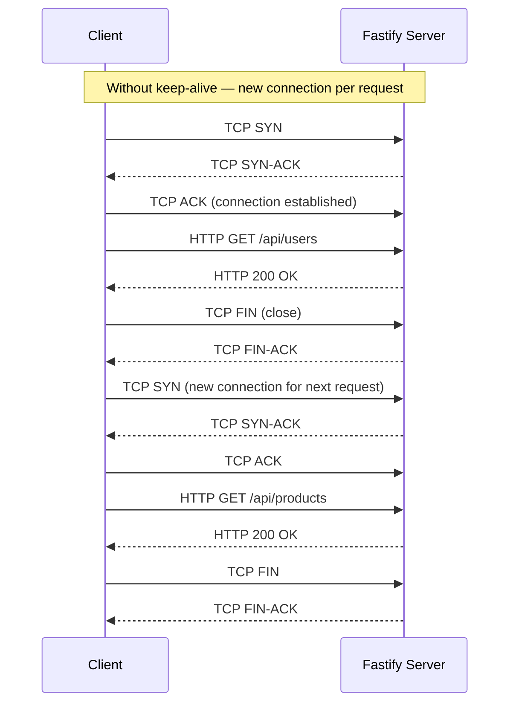
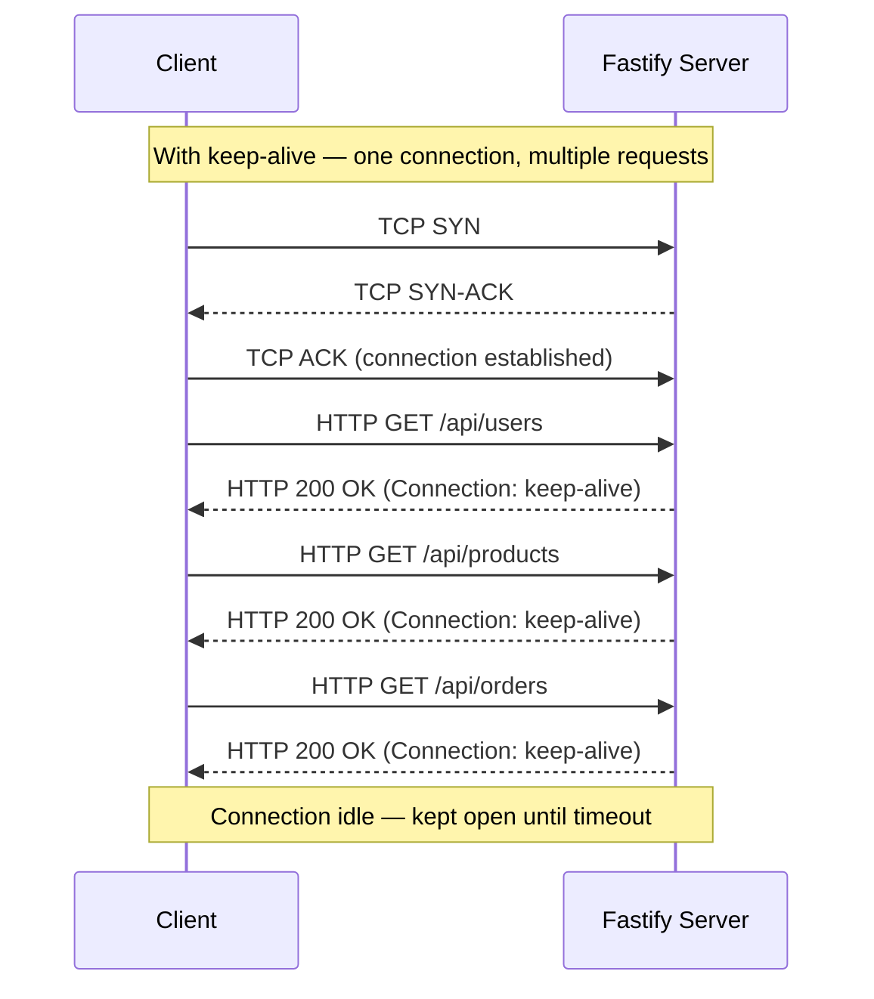
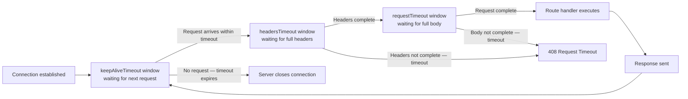
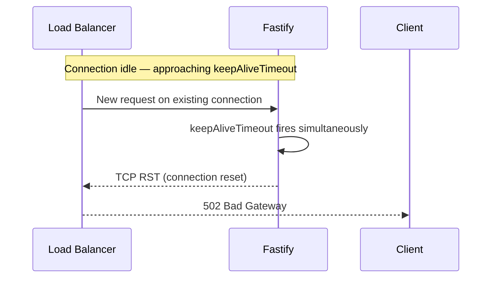

## Keep-Alive and Connection Reuse

### Overview

HTTP keep-alive allows a single TCP connection to carry multiple request/response pairs without the overhead of establishing a new TCP handshake for each request. In Fastify, keep-alive behavior is controlled at three levels: the underlying Node.js `http.Server`, Fastify's server factory options, and the behavior of upstream clients or load balancers connecting to the server. Misunderstanding or misconfiguring keep-alive is a common source of latency, port exhaustion, and connection reset errors under load.

---

### TCP Connection Cost Without Keep-Alive





---

### Default Behavior in Node.js HTTP Server

Node.js `http.Server` has keep-alive enabled by default since Node.js 19. In earlier versions, keep-alive was disabled by default and had to be set explicitly.

```js
import http from 'node:http'

const server = http.createServer()
console.log(server.keepAliveTimeout)    // 5000 ms (Node.js >= 18.0)
console.log(server.headersTimeout)      // 60000 ms
console.log(server.requestTimeout)      // 300000 ms
```

> **Key Point:** `keepAliveTimeout` defaults differ across Node.js versions. Verify the default for your runtime with `server.keepAliveTimeout` before assuming a value. [Unverified — check Node.js release notes for the exact version in your environment.]

---

### Configuring Keep-Alive in Fastify

Fastify exposes the underlying `http.Server` instance via `fastify.server`, allowing direct property assignment after the server is created.

#### Setting Timeouts at Startup

```js
import Fastify from 'fastify'

const fastify = Fastify({ logger: true })

fastify.addHook('onReady', async () => {
  // Set after server is bound but before accepting connections
  fastify.server.keepAliveTimeout = 65_000       // 65 seconds
  fastify.server.headersTimeout = 66_000         // must be > keepAliveTimeout
  fastify.server.requestTimeout = 300_000        // 5 minutes
  fastify.server.timeout = 120_000               // socket inactivity timeout
})

fastify.get('/', async () => ({ ok: true }))

await fastify.listen({ port: 3000, host: '0.0.0.0' })
```

> **Key Point:** `headersTimeout` must be strictly greater than `keepAliveTimeout`. If `headersTimeout` ≤ `keepAliveTimeout`, the server may close connections with a `408 Request Timeout` before the keep-alive window expires, causing spurious errors in clients that reuse connections. This is a common misconfiguration when placing Fastify behind a load balancer.

---

### The `serverFactory` Option

Fastify accepts a custom `serverFactory` function, allowing full control over the `http.Server` or `https.Server` instance — including keep-alive settings — at creation time.

```js
import Fastify from 'fastify'
import http from 'node:http'

const fastify = Fastify({
  logger: true,
  serverFactory: (handler, opts) => {
    const server = http.createServer(handler)

    server.keepAliveTimeout = 65_000
    server.headersTimeout = 66_000
    server.maxHeadersCount = 100
    server.maxRequestsPerSocket = 0  // 0 = unlimited requests per connection

    return server
  },
})
```

> **Key Point:** `maxRequestsPerSocket` (Node.js >= 16.10) limits how many requests a single keep-alive connection can carry before the server forces a close. Setting it to a non-zero value (e.g., `1000`) caps long-lived connections and can prevent memory accumulation from connections that never close naturally.

---

### Timeout Relationships



| Timeout | Scope | Default (Node.js 18+) |
|---|---|---|
| `keepAliveTimeout` | Idle wait between requests on a keep-alive connection | 5000 ms |
| `headersTimeout` | Time to receive complete HTTP headers after connection | 60000 ms |
| `requestTimeout` | Time to receive complete request (headers + body) | 300000 ms |
| `timeout` | Socket inactivity timeout (covers all states) | 0 (disabled) |

---

### Keep-Alive Behind a Load Balancer

Load balancers (AWS ALB, NGINX, HAProxy) maintain their own keep-alive connections to backend instances. A critical failure mode occurs when the backend closes a connection at the same moment the load balancer reuses it for a new request.

**The race condition:**



**Fix — set Fastify's `keepAliveTimeout` higher than the load balancer's:**

```js
// AWS ALB default idle timeout: 60 seconds
// Set Fastify keepAliveTimeout > 60s to ensure ALB closes first
fastify.server.keepAliveTimeout = 65_000  // 65s > ALB's 60s
fastify.server.headersTimeout = 66_000    // > keepAliveTimeout
```

> **Key Point:** The load balancer should always be the one to close idle keep-alive connections. If the backend closes first, the load balancer may forward a request onto an already-closed socket. Setting the backend timeout slightly above the load balancer's idle timeout makes the load balancer close first in normal operation.

---

### HTTP/2 and Multiplexing

HTTP/2 replaces keep-alive with multiplexing — multiple requests share a single connection simultaneously without head-of-line blocking.

```js
import Fastify from 'fastify'
import fs from 'node:fs'

const fastify = Fastify({
  http2: true,
  https: {
    key: fs.readFileSync('./server.key'),
    cert: fs.readFileSync('./server.cert'),
  },
  logger: true,
})

fastify.get('/', async () => ({ protocol: 'h2' }))

await fastify.listen({ port: 3000 })
```

HTTP/2 keep-alive equivalent settings:

```js
fastify.addHook('onReady', async () => {
  // HTTP/2 session timeout (equivalent to keepAliveTimeout)
  fastify.server.setTimeout(120_000)
})
```

> [Inference] For most Fastify deployments behind a reverse proxy (NGINX, Caddy), HTTP/2 is terminated at the proxy and HTTP/1.1 keep-alive is used for proxy-to-Fastify connections. End-to-end HTTP/2 is more common in direct gRPC or API gateway setups. Behavior depends on infrastructure configuration.

---

### Outbound Keep-Alive — Fastify as an HTTP Client

When Fastify routes make outbound HTTP requests to other services, the default `http.globalAgent` in Node.js has `keepAlive: false` prior to Node.js 19. Each outbound request opens a new TCP connection unless an explicit agent is configured.

#### Using `undici` (Recommended)

`undici` is Node.js's built-in HTTP client (used internally by `fetch`). It has connection pooling and keep-alive enabled by default.

```js
import { Pool } from 'undici'

const servicePool = new Pool('https://api.internal.example.com', {
  connections: 10,           // max concurrent connections in pool
  keepAliveTimeout: 30_000,  // idle connection TTL
  keepAliveMaxTimeout: 600_000,
})

fastify.decorate('internalApi', servicePool)

fastify.addHook('onClose', async () => {
  await fastify.internalApi.destroy()
})

fastify.get('/proxy', async (request, reply) => {
  const { statusCode, body } = await fastify.internalApi.request({
    path: '/data',
    method: 'GET',
    headers: { 'accept': 'application/json' },
  })

  const data = await body.json()
  return data
})
```

#### Using `http.Agent` with Keep-Alive

```js
import http from 'node:http'
import https from 'node:https'

const httpAgent = new http.Agent({
  keepAlive: true,
  maxSockets: 50,
  maxFreeSockets: 10,
  timeout: 30_000,
  keepAliveMsecs: 1_000, // interval between keep-alive probes
})

const httpsAgent = new https.Agent({
  keepAlive: true,
  maxSockets: 50,
  maxFreeSockets: 10,
})

fastify.decorate('httpAgent', httpAgent)
fastify.decorate('httpsAgent', httpsAgent)

fastify.addHook('onClose', async () => {
  fastify.httpAgent.destroy()
  fastify.httpsAgent.destroy()
})
```

> **Key Point:** Always call `agent.destroy()` during `onClose`. Agents hold open sockets — failing to destroy them on shutdown prevents the process from exiting cleanly.

---

### `@fastify/undici` Plugin

`@fastify/undici` wraps `undici` as a Fastify plugin with decorator support:

```bash
npm install @fastify/undici
```

```js
import undiciPlugin from '@fastify/undici'

await fastify.register(undiciPlugin, {
  base: 'https://api.example.com',
  undici: {
    connections: 10,
    keepAliveTimeout: 30_000,
  },
})

fastify.get('/data', async (request, reply) => {
  const { statusCode, body } = await fastify.fetch('https://api.example.com/resource')
  return body.json()
})
```

---

### Monitoring Active Connections

```js
fastify.addHook('onReady', async () => {
  setInterval(() => {
    fastify.server.getConnections((err, count) => {
      if (!err) {
        fastify.log.info({ activeConnections: count }, 'connection count')
      }
    })
  }, 15_000).unref()
})
```

#### Exposing via a Diagnostic Route

```js
fastify.get('/internal/connections', {
  onRequest: [requireInternalAuth],
}, async () => {
  return new Promise((resolve, reject) => {
    fastify.server.getConnections((err, count) => {
      if (err) return reject(err)
      resolve({ activeConnections: count })
    })
  })
})
```

---

### Disabling Keep-Alive

In some scenarios — serverless environments, short-lived Lambda-style deployments, debugging — you may want to disable keep-alive entirely.

```js
// Per-response header approach
fastify.addHook('onSend', async (request, reply) => {
  reply.header('Connection', 'close')
})
```

```js
// Server-level approach via serverFactory
const fastify = Fastify({
  serverFactory: (handler) => {
    const server = http.createServer(handler)
    server.keepAliveTimeout = 0 // disables keep-alive
    return server
  },
})
```

> [Inference] Setting `keepAliveTimeout = 0` may not be equivalent across all Node.js versions to fully disabling keep-alive. Sending an explicit `Connection: close` header is more reliable for signaling connection closure to clients. Behavior may vary.

---

### Keep-Alive Header Negotiation

HTTP/1.1 keep-alive is implicit — the default unless `Connection: close` is sent. HTTP/1.0 requires an explicit `Connection: keep-alive` header.

Fastify sets the `Connection` header automatically based on the protocol version and server configuration. [Inference] Manually overriding the `Connection` header in a hook will take precedence over Fastify's default behavior, but this should be done deliberately as it affects all responses on the matched routes.

```js
// Selectively close connections after large responses
fastify.addHook('onSend', async (request, reply, payload) => {
  const contentLength = parseInt(reply.getHeader('content-length') ?? '0')
  if (contentLength > 10 * 1024 * 1024) { // > 10 MB
    reply.header('Connection', 'close')
  }
})
```

---

### Configuration Reference

```js
fastify.server.keepAliveTimeout = 65_000      // ms — idle wait for next request
fastify.server.headersTimeout = 66_000        // ms — must exceed keepAliveTimeout
fastify.server.requestTimeout = 300_000       // ms — full request receive window
fastify.server.timeout = 0                    // ms — socket inactivity (0 = off)
fastify.server.maxRequestsPerSocket = 1000    // requests before forced close (0 = unlimited)
fastify.server.maxHeadersCount = 2000         // max request headers count
```

---

**Related Topics**

- HTTP/2 multiplexing and stream prioritization in Fastify
- TLS session resumption and its interaction with keep-alive
- `undici` connection pool sizing and `ProxyAgent` for outbound requests
- Load balancer idle timeout configuration — AWS ALB, NGINX, HAProxy
- `@fastify/reply-from` for reverse proxy patterns with connection reuse
- TCP socket tuning — `SO_KEEPALIVE`, `TCP_KEEPIDLE`, `TCP_KEEPINTVL` at OS level
- Graceful shutdown — draining in-flight requests before closing keep-alive connections
- Connection metrics in Prometheus via `prom-client` and `fastify-metrics`