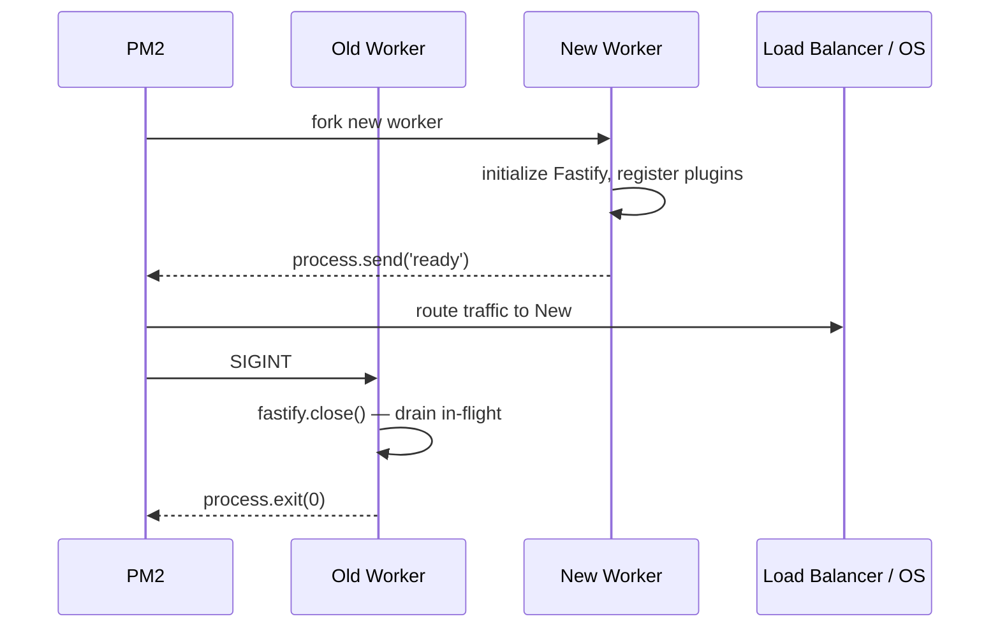
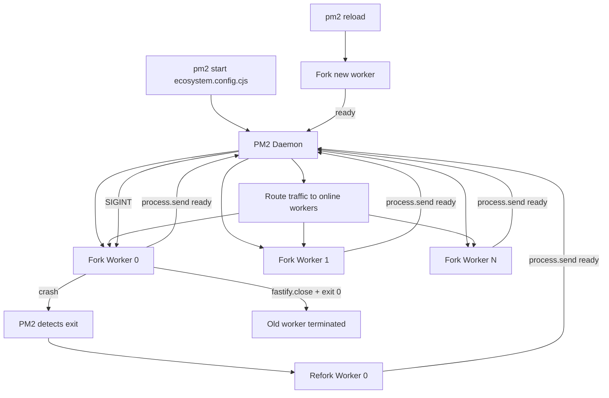

## Running with PM2

### Overview

PM2 is a production process manager for Node.js applications. It handles process supervision, automatic restarts on crash, log aggregation, cluster mode, zero-downtime reloads, and startup script generation. For Fastify, PM2 is a common deployment choice on bare-metal or VM environments where a container orchestrator is not in use. It abstracts the `cluster` module and adds operational tooling around it.

---

### Installation

```bash
npm install -g pm2
```

Verify:

```bash
pm2 --version
```

---

### Starting a Fastify App

#### Minimal Start

```bash
pm2 start server.js --name fastify-app
```

#### With Node.js Flags

```bash
pm2 start server.js \
  --name fastify-app \
  --node-args="--max-old-space-size=512" \
  --time
```

#### Cluster Mode (Multi-Core)

```bash
pm2 start server.js \
  --name fastify-app \
  -i max \
  --exec-mode cluster
```

`-i max` forks one process per available CPU core. `-i 0` is an alias for the same behavior. A specific integer sets the exact count.

---

### Ecosystem File

The ecosystem file is the canonical way to configure PM2 deployments. It replaces CLI flags with a version-controlled configuration.

```js
// ecosystem.config.cjs
module.exports = {
  apps: [
    {
      name: 'fastify-app',
      script: './server.js',
      exec_mode: 'cluster',
      instances: 'max',
      watch: false,
      max_memory_restart: '500M',
      node_args: '--max-old-space-size=450',

      env: {
        NODE_ENV: 'development',
        PORT: 3000,
      },

      env_production: {
        NODE_ENV: 'production',
        PORT: 3000,
      },

      error_file: './logs/pm2-error.log',
      out_file: './logs/pm2-out.log',
      merge_logs: true,
      log_date_format: 'YYYY-MM-DD HH:mm:ss Z',

      wait_ready: true,
      listen_timeout: 10000,
      kill_timeout: 5000,
      shutdown_with_message: true,
    },
  ],
}
```

Start with a specific environment:

```bash
pm2 start ecosystem.config.cjs --env production
```

> **Key Point:** Use `.cjs` extension for ecosystem files when the project has `"type": "module"` in `package.json`. PM2 loads the ecosystem file with `require()`, which does not support ESM `export default` syntax.

---

### ESM Fastify App with PM2

PM2 does not natively execute ESM entry points with `exec_mode: cluster` in all versions. The safest approach for ESM projects is a CJS wrapper or explicit interpreter flag.

#### Option 1 — CJS Entry Wrapper

```js
// server.cjs
require('./dist/server.js') // transpiled output, or use dynamic import
```

Or with dynamic import:

```js
// server.cjs
import('./server.js').catch((err) => {
  console.error(err)
  process.exit(1)
})
```

#### Option 2 — Explicit Interpreter

```js
// ecosystem.config.cjs
module.exports = {
  apps: [{
    name: 'fastify-app',
    script: './server.js',
    interpreter: 'node',
    interpreter_args: '--experimental-vm-modules',
    exec_mode: 'fork', // cluster mode with ESM has caveats — verify per PM2 version
  }],
}
```

> [Inference] PM2 cluster mode with native ESM entry points has had inconsistent behavior across PM2 versions. Using a CJS wrapper that dynamically imports the ESM module is the more reliable approach as of PM2 v5. Verify against the PM2 version in use. Behavior may vary.

---

### `wait_ready` and `listen_timeout` — Signaling Readiness

By default, PM2 considers a process ready when it starts. With `wait_ready: true`, PM2 waits for an explicit `process.send('ready')` signal from the application before marking it online and routing traffic.

```js
// server.js
import Fastify from 'fastify'

const fastify = Fastify({ logger: true })

fastify.get('/', async () => ({ ok: true }))

await fastify.listen({ port: process.env.PORT ?? 3000, host: '0.0.0.0' })

// Signal PM2 that the app is ready to receive traffic
if (process.send) {
  process.send('ready')
}
```

```js
// ecosystem.config.cjs
{
  wait_ready: true,
  listen_timeout: 10000, // ms to wait for 'ready' before marking failed
}
```

> **Key Point:** `wait_ready` is especially important in cluster mode when the app performs async initialization (plugin registration, DB connection, cache warm-up) before it is ready to serve requests. Without it, PM2 may route traffic to a worker that has not finished starting.

---

### Graceful Shutdown with PM2

PM2 sends `SIGINT` to workers on `pm2 stop` or `pm2 reload`. With `shutdown_with_message: true`, PM2 sends a `'shutdown'` IPC message instead (or in addition). Both should be handled.

```js
// server.js
import Fastify from 'fastify'

const fastify = Fastify({ logger: true })

fastify.get('/', async () => ({ ok: true }))

const shutdown = async (signal) => {
  fastify.log.info(`${signal} received — starting graceful shutdown`)
  try {
    await fastify.close()
    fastify.log.info('Server closed cleanly')
    process.exit(0)
  } catch (err) {
    fastify.log.error(err, 'Error during shutdown')
    process.exit(1)
  }
}

process.on('SIGINT', () => shutdown('SIGINT'))
process.on('SIGTERM', () => shutdown('SIGTERM'))

// PM2 shutdown_with_message: true
process.on('message', (msg) => {
  if (msg === 'shutdown') shutdown('PM2 shutdown message')
})

await fastify.listen({ port: process.env.PORT ?? 3000, host: '0.0.0.0' })
if (process.send) process.send('ready')
```

```js
// ecosystem.config.cjs
{
  wait_ready: true,
  listen_timeout: 10000,
  kill_timeout: 5000,         // ms PM2 waits after SIGINT before sending SIGKILL
  shutdown_with_message: true,
}
```

> **Key Point:** `kill_timeout` is the grace period between PM2 sending the shutdown signal and sending `SIGKILL`. If `fastify.close()` takes longer than `kill_timeout`, the process is force-killed. Set `kill_timeout` to exceed your worst-case shutdown duration (DB connection draining, in-flight request completion).

---

### Zero-Downtime Reload

`pm2 reload` replaces workers one at a time. The old worker continues serving requests while the new worker starts. Once the new worker emits `ready`, the old one receives `SIGINT`.

```bash
pm2 reload fastify-app
```



> **Key Point:** Zero-downtime reload depends on `wait_ready: true` and `process.send('ready')` being implemented correctly. Without it, PM2 promotes the new worker immediately on process start — before Fastify finishes binding to the port — which can cause a brief window of `ECONNREFUSED` errors.

`pm2 restart` is **not** zero-downtime — it kills all workers simultaneously:

```bash
pm2 restart fastify-app   # causes brief downtime
pm2 reload fastify-app    # zero-downtime rolling restart
```

---

### Common PM2 Commands

```bash
# Start / stop / restart
pm2 start ecosystem.config.cjs --env production
pm2 stop fastify-app
pm2 restart fastify-app
pm2 reload fastify-app          # zero-downtime
pm2 delete fastify-app          # remove from PM2 process list

# Status and monitoring
pm2 list                        # overview of all managed processes
pm2 show fastify-app            # detailed info for one app
pm2 monit                       # live CPU/memory/log dashboard (terminal UI)

# Logs
pm2 logs fastify-app            # tail live logs
pm2 logs fastify-app --lines 100
pm2 flush fastify-app           # clear log files

# Process management
pm2 scale fastify-app 8         # change instance count live
pm2 scale fastify-app +2        # add 2 more instances
pm2 scale fastify-app -1        # remove 1 instance

# Info
pm2 info fastify-app
pm2 describe fastify-app
```

---

### Startup Script — Surviving Reboots

PM2 can generate a system startup script (systemd, upstart, launchd) that relaunches managed processes after a reboot.

```bash
# Generate and install startup hook for current OS
pm2 startup

# Follow the printed instruction — typically:
sudo env PATH=$PATH:/usr/bin pm2 startup systemd -u $USER --hp $HOME

# Save current process list to be restored on boot
pm2 save
```

To remove the startup hook:

```bash
pm2 unstartup systemd
```

> **Key Point:** `pm2 save` must be run after any change to the process list (start, delete, scale) to persist the new state. A `pm2 startup` without a subsequent `pm2 save` restores the previous saved state after reboot.

---

### Environment Variable Management

PM2 does not reload environment variables on `pm2 reload` by default. To apply updated env:

```bash
pm2 restart fastify-app --update-env
```

For secret management, do not store credentials in the ecosystem file. Use a `.env` file loaded by the app, or an external secrets manager. PM2 itself has no secrets management capability.

```js
// server.js — load .env before registering plugins
import 'dotenv/config'
import Fastify from 'fastify'
// ...
```

> [Inference] Committing an ecosystem file with `env_production` blocks containing real credentials is a common security mistake. Keep only non-secret configuration (port, NODE_ENV, log level) in the ecosystem file. Behavior of secret exposure depends on repository access controls.

---

### Memory Restart Threshold

`max_memory_restart` triggers an automatic restart when the process exceeds the specified RSS memory limit.

```js
{
  max_memory_restart: '500M', // restarts if RSS > 500 MB
}
```

> [Inference] `max_memory_restart` is a blunt instrument — it restarts the process after memory has already grown beyond the threshold rather than preventing growth. It is useful as a backstop for memory leaks in production but should not substitute for leak diagnosis. The RSS threshold does not correspond directly to `heapUsed`. Behavior may vary across Node.js and PM2 versions.

---

### Log Management

PM2 writes logs to `~/.pm2/logs/` by default. Custom paths are set in the ecosystem file.

```js
{
  error_file: './logs/fastify-error.log',
  out_file: './logs/fastify-out.log',
  merge_logs: true,              // merge all cluster worker logs into one file
  log_date_format: 'YYYY-MM-DD HH:mm:ss Z',
  log_type: 'json',              // structured JSON log lines
}
```

#### PM2 Log Rotation

```bash
pm2 install pm2-logrotate

pm2 set pm2-logrotate:max_size 50M
pm2 set pm2-logrotate:retain 10
pm2 set pm2-logrotate:compress true
pm2 set pm2-logrotate:dateFormat YYYY-MM-DD
```

> **Key Point:** Without log rotation, PM2 log files grow without bound. On high-traffic servers, this can fill disk within hours. Install `pm2-logrotate` immediately after setting up PM2 in production.

---

### PM2 Plus (Web Dashboard)

PM2 has a hosted monitoring dashboard at `pm2.io` (formerly Keymetrics).

```bash
pm2 link <secret_key> <public_key>
```

[Unverified — verify current pricing and feature availability at pm2.io, as the product offering has changed over time.]

---

### Cluster Mode vs Fork Mode

| | `cluster` (exec_mode) | `fork` (exec_mode) |
|---|---|---|
| **Process count** | Multiple (`-i`) | Single |
| **Port sharing** | Yes — OS distributes | No — one process, one port |
| **Use case** | Production multi-core | Development, single-instance |
| **IPC** | PM2 ↔ each worker | PM2 ↔ single process |
| **Reload** | Rolling zero-downtime | Single process restart |
| **Shared memory** | No — separate processes | N/A |

---

### PM2 with Docker

Running PM2 inside a Docker container requires `pm2-runtime` instead of `pm2 start`, which runs in the foreground and forwards signals correctly.

```dockerfile
FROM node:20-alpine

WORKDIR /app
COPY package*.json ./
RUN npm ci --omit=dev

COPY . .

RUN npm install -g pm2

EXPOSE 3000

CMD ["pm2-runtime", "ecosystem.config.cjs", "--env", "production"]
```

> **Key Point:** `pm2 start` daemonizes and exits immediately — the container stops. `pm2-runtime` keeps the foreground process alive and correctly handles `SIGTERM` from Docker. Always use `pm2-runtime` in containerized environments.

> [Inference] In Kubernetes or Docker Swarm environments, the orchestrator already handles process supervision, restarts, and scaling. Running PM2 inside a container in those environments adds overhead without benefit and complicates signal handling. PM2 is most appropriate on VMs or bare metal without an orchestrator. Behavior of nested process managers in container environments may vary.

---

### Diagram — PM2 Cluster Lifecycle



---

**Related Topics**

- Kubernetes deployment vs PM2 — when to migrate off PM2
- `systemd` unit files as a PM2 alternative for single-instance Fastify
- Combining PM2 cluster mode with `undici` connection pools
- `pm2-logrotate` configuration and log shipping to external aggregators
- Health check endpoints (`/healthz`, `/readyz`) for load balancer integration
- Zero-downtime deploy pipelines — `pm2 reload` triggered from CI/CD
- Memory profiling PM2-managed workers with `clinic.js`
- `SIGTERM` handling in PM2 cluster mode under Kubernetes `terminationGracePeriodSeconds`