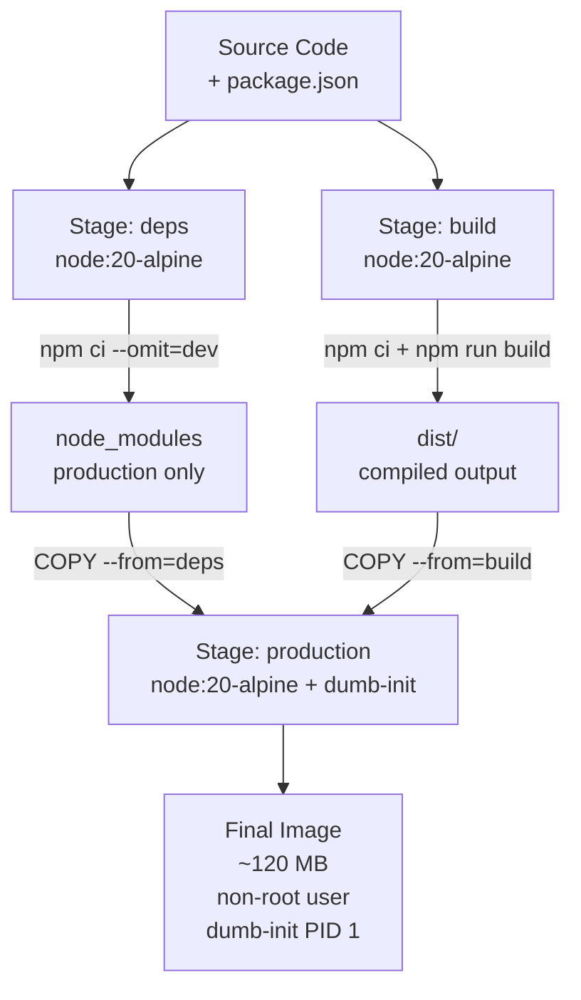
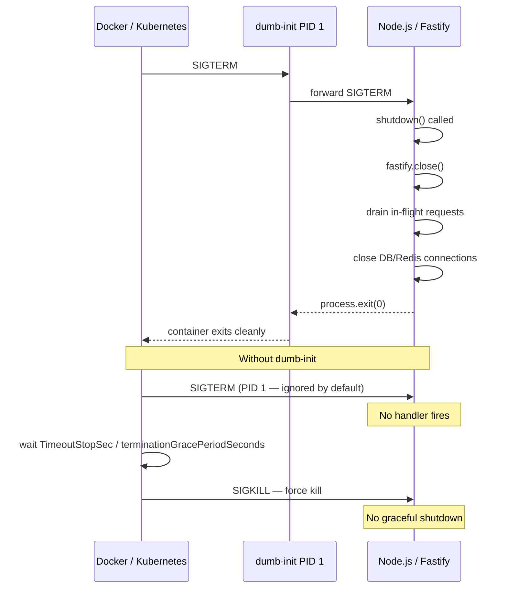

## Dockerizing a Fastify Application

### Overview

Dockerizing a Fastify application packages the runtime, dependencies, and application code into a portable, reproducible image. The primary concerns for production Fastify images are image size, layer caching efficiency, non-root execution, graceful shutdown under container orchestration signals, and correct host binding. Each of these has a specific failure mode if ignored.

---

### Prerequisites — Correct Host Binding

Before containerizing, the Fastify app must bind to `0.0.0.0`, not `127.0.0.1` (localhost). Inside a container, `127.0.0.1` is the container's loopback — traffic from outside the container never reaches it.

```js
// Wrong — unreachable from outside the container
await fastify.listen({ port: 3000 })

// Correct
await fastify.listen({ port: 3000, host: '0.0.0.0' })
```

Or via environment variable:

```js
await fastify.listen({
  port: parseInt(process.env.PORT ?? '3000'),
  host: process.env.HOST ?? '0.0.0.0',
})
```

---

### Project Structure

```
fastify-app/
├── src/
│   ├── server.js
│   ├── app.js
│   ├── plugins/
│   └── routes/
├── package.json
├── package-lock.json
├── .dockerignore
└── Dockerfile
```

---

### `.dockerignore`

Always define `.dockerignore` before writing the `Dockerfile`. Without it, `COPY . .` sends the entire project context to the Docker daemon, including `node_modules`, `.git`, and local environment files.

```dockerignore
# Dependencies — reinstalled inside image
node_modules
npm-debug.log
yarn-error.log

# Version control
.git
.gitignore

# Local environment
.env
.env.*
!.env.example

# Dev tooling
.eslintrc*
.prettierrc*
.editorconfig
*.test.js
*.spec.js
__tests__/
coverage/

# Docker files themselves
Dockerfile*
docker-compose*
.dockerignore

# OS artifacts
.DS_Store
Thumbs.db

# PM2 / logs
logs/
*.log
.pm2/

# IDE
.vscode/
.idea/
```

---

### Base Image Selection

| Image | Compressed Size | Use Case |
|---|---|---|
| `node:20-alpine` | ~50 MB | Production — minimal, musl libc |
| `node:20-slim` | ~90 MB | Production — glibc, fewer native module issues |
| `node:20-bookworm` | ~350 MB | Build stage — full Debian toolchain |
| `node:20` | ~350 MB | Development only |

> **Key Point:** Alpine uses `musl` libc. Some native Node.js modules (e.g., certain database drivers, `sharp`) are compiled against `glibc` and require additional setup or a separate build on Alpine. If native modules cause issues on Alpine, use `node:20-slim` (Debian slim, glibc) instead.

---

### Single-Stage Dockerfile (Development / Simple Apps)

```dockerfile
FROM node:20-alpine

WORKDIR /app

COPY package*.json ./
RUN npm ci --omit=dev

COPY . .

EXPOSE 3000

USER node

CMD ["node", "src/server.js"]
```

---

### Multi-Stage Dockerfile (Production)

Multi-stage builds separate the build environment from the runtime image, keeping the final image small and free of build tooling.

```dockerfile
# ─── Stage 1: Dependencies ───────────────────────────────────────────────────
FROM node:20-alpine AS deps

WORKDIR /app

COPY package*.json ./

RUN npm ci --omit=dev && \
    # Cache clean reduces layer size
    npm cache clean --force


# ─── Stage 2: Build (for TypeScript or bundled projects) ─────────────────────
FROM node:20-alpine AS build

WORKDIR /app

COPY package*.json ./
RUN npm ci

COPY . .
RUN npm run build


# ─── Stage 3: Production Runtime ─────────────────────────────────────────────
FROM node:20-alpine AS production

# Install dumb-init for correct signal handling
RUN apk add --no-cache dumb-init

# Create non-root user
RUN addgroup -S appgroup && adduser -S appuser -G appgroup

WORKDIR /app

# Copy production dependencies from deps stage
COPY --from=deps --chown=appuser:appgroup /app/node_modules ./node_modules

# Copy built application from build stage
COPY --from=build --chown=appuser:appgroup /app/dist ./dist

# Copy package.json for runtime metadata
COPY --chown=appuser:appgroup package*.json ./

USER appuser

EXPOSE 3000

# dumb-init as PID 1 — handles signal forwarding correctly
ENTRYPOINT ["dumb-init", "--"]
CMD ["node", "dist/server.js"]
```

For plain JavaScript (no build step):

```dockerfile
FROM node:20-alpine AS deps
WORKDIR /app
COPY package*.json ./
RUN npm ci --omit=dev && npm cache clean --force

FROM node:20-alpine AS production
RUN apk add --no-cache dumb-init
RUN addgroup -S appgroup && adduser -S appuser -G appgroup
WORKDIR /app
COPY --from=deps --chown=appuser:appgroup /app/node_modules ./node_modules
COPY --chown=appuser:appgroup src/ ./src/
COPY --chown=appuser:appgroup package*.json ./
USER appuser
EXPOSE 3000
ENTRYPOINT ["dumb-init", "--"]
CMD ["node", "src/server.js"]
```

---

### `dumb-init` — Correct Signal Handling

When a Node.js process runs as PID 1 inside a container, it does not have the default signal handlers the kernel installs for non-PID-1 processes. `SIGTERM` sent by Docker or Kubernetes is not forwarded correctly, causing the container to wait for `SIGKILL` after the grace period instead of shutting down cleanly.

`dumb-init` runs as PID 1, correctly handles signals, and forwards them to the Node.js process.

```dockerfile
RUN apk add --no-cache dumb-init        # Alpine
RUN apt-get install -y dumb-init        # Debian/Ubuntu
```

```dockerfile
ENTRYPOINT ["dumb-init", "--"]
CMD ["node", "src/server.js"]
```

Alternatives:

```dockerfile
# tini — similar to dumb-init, included in Docker Desktop
ENTRYPOINT ["/sbin/tini", "--"]

# node --init (Node.js >= 20.18 — experimental built-in init)
CMD ["node", "--init", "src/server.js"]
```

> **Key Point:** Without an init process as PID 1, `docker stop` sends `SIGTERM` to the container, Node.js ignores it (default PID 1 behavior), Docker waits 10 seconds, then sends `SIGKILL`. The Fastify app never gets a chance to call `fastify.close()`. This makes graceful shutdown in Kubernetes impossible without `dumb-init` or equivalent.

---

### Graceful Shutdown Inside a Container

```js
// src/server.js
import Fastify from 'fastify'

const fastify = Fastify({
  logger: {
    level: process.env.LOG_LEVEL ?? 'info',
  },
})

await fastify.register(import('./app.js'))

const shutdown = async (signal) => {
  fastify.log.info({ signal }, 'Shutdown signal received')
  try {
    await fastify.close()
    process.exit(0)
  } catch (err) {
    fastify.log.error(err, 'Error during shutdown')
    process.exit(1)
  }
}

process.on('SIGTERM', () => shutdown('SIGTERM'))
process.on('SIGINT', () => shutdown('SIGINT'))

try {
  await fastify.listen({
    port: parseInt(process.env.PORT ?? '3000'),
    host: '0.0.0.0',
  })
} catch (err) {
  fastify.log.error(err)
  process.exit(1)
}
```

---

### Health Check

Docker and Kubernetes use health checks to determine container readiness and liveness.

#### Fastify Health Route

```js
// Register early — before auth plugins — so it is always reachable
fastify.get('/healthz', {
  logLevel: 'silent', // suppress log noise from frequent polling
}, async () => {
  return { status: 'ok', uptime: process.uptime() }
})
```

#### `HEALTHCHECK` in Dockerfile

```dockerfile
HEALTHCHECK --interval=30s \
            --timeout=5s \
            --start-period=10s \
            --retries=3 \
  CMD wget -qO- http://localhost:3000/healthz || exit 1
```

Or with `curl` (if available):

```dockerfile
HEALTHCHECK --interval=30s --timeout=5s --start-period=10s --retries=3 \
  CMD curl -f http://localhost:3000/healthz || exit 1
```

> **Key Point:** Alpine does not include `curl` by default. Add it explicitly (`apk add --no-cache curl`) or use `wget`, which is included in Alpine's busybox.

---

### Environment Variable Handling

Never bake secrets into the image. Pass them at runtime.

```dockerfile
# Declare expected variables with defaults in Dockerfile
ENV NODE_ENV=production \
    PORT=3000 \
    HOST=0.0.0.0 \
    LOG_LEVEL=info
```

Override at runtime:

```bash
docker run \
  -e DATABASE_URL=postgres://user:pass@db:5432/app \
  -e REDIS_URL=redis://cache:6379 \
  -e JWT_SECRET=supersecret \
  -p 3000:3000 \
  fastify-app:latest
```

Or via `--env-file`:

```bash
docker run --env-file .env.production -p 3000:3000 fastify-app:latest
```

> **Key Point:** `--env-file` is not the same as `.env` file parsing — it does not support variable interpolation or multiline values. Each line must be a plain `KEY=VALUE` pair.

---

### Building and Running

```bash
# Build
docker build -t fastify-app:latest .
docker build -t fastify-app:latest --target production .

# Run
docker run -d \
  --name fastify-app \
  -p 3000:3000 \
  -e NODE_ENV=production \
  fastify-app:latest

# Logs
docker logs -f fastify-app

# Shell into running container
docker exec -it fastify-app sh

# Stop — sends SIGTERM, waits, then SIGKILL
docker stop fastify-app

# Stop with custom grace period
docker stop --time 30 fastify-app
```

---

### Docker Compose

```yaml
# docker-compose.yml
services:
  app:
    build:
      context: .
      dockerfile: Dockerfile
      target: production
    image: fastify-app:latest
    container_name: fastify-app
    restart: unless-stopped
    ports:
      - "3000:3000"
    environment:
      NODE_ENV: production
      PORT: 3000
      LOG_LEVEL: info
    env_file:
      - .env.production
    depends_on:
      db:
        condition: service_healthy
      redis:
        condition: service_healthy
    healthcheck:
      test: ["CMD", "wget", "-qO-", "http://localhost:3000/healthz"]
      interval: 30s
      timeout: 5s
      retries: 3
      start_period: 10s
    stop_grace_period: 30s
    networks:
      - app-network

  db:
    image: postgres:16-alpine
    restart: unless-stopped
    environment:
      POSTGRES_DB: appdb
      POSTGRES_USER: appuser
      POSTGRES_PASSWORD: apppass
    volumes:
      - pg-data:/var/lib/postgresql/data
    healthcheck:
      test: ["CMD-SHELL", "pg_isready -U appuser -d appdb"]
      interval: 10s
      timeout: 5s
      retries: 5
    networks:
      - app-network

  redis:
    image: redis:7-alpine
    restart: unless-stopped
    healthcheck:
      test: ["CMD", "redis-cli", "ping"]
      interval: 10s
      timeout: 3s
      retries: 5
    networks:
      - app-network

volumes:
  pg-data:

networks:
  app-network:
    driver: bridge
```

```bash
docker compose up -d
docker compose logs -f app
docker compose down
docker compose down -v   # also removes volumes
```

---

### Layer Caching Strategy

Docker caches each layer. Place instructions that change rarely at the top and instructions that change frequently (application code) at the bottom.

```dockerfile
# Good layer order — cache-friendly
FROM node:20-alpine AS production
RUN apk add --no-cache dumb-init          # changes: never
WORKDIR /app
COPY package*.json ./                      # changes: when deps change
RUN npm ci --omit=dev                      # invalidated only when package*.json changes
COPY src/ ./src/                           # changes: on every code change
```

```dockerfile
# Bad layer order — cache always invalidated
FROM node:20-alpine
COPY . .                                   # code change invalidates everything below
RUN npm ci --omit=dev                      # re-runs on every code change
```

---

### Non-Root User

Running as `root` inside a container means a process escape gives the attacker root on the host (without additional isolation). Always run as a non-root user.

```dockerfile
# Alpine
RUN addgroup -S appgroup && adduser -S appuser -G appgroup
USER appuser

# Debian/Ubuntu
RUN groupadd -r appgroup && useradd -r -g appgroup appuser
USER appuser
```

The `node` user already exists in official Node.js images:

```dockerfile
# Simplest approach — use built-in node user
USER node
```

> **Key Point:** If the app writes to the filesystem (uploads, logs, temp files), ensure the target directory is owned by the non-root user before switching users.

```dockerfile
RUN mkdir -p /app/logs /app/uploads && \
    chown -R node:node /app/logs /app/uploads
USER node
```

---

### Image Size Optimization

```bash
# Check image size
docker image ls fastify-app

# Inspect layers
docker image history fastify-app:latest

# Dive — interactive layer explorer
docker run --rm -it \
  -v /var/run/docker.sock:/var/run/docker.sock \
  wagoodman/dive fastify-app:latest
```

Common size reduction techniques:

```dockerfile
# Combine RUN commands to reduce layers
RUN apk add --no-cache dumb-init curl && \
    addgroup -S appgroup && \
    adduser -S appuser -G appgroup

# Clean package manager caches in the same layer
RUN npm ci --omit=dev && npm cache clean --force

# Use --no-cache for apk
RUN apk add --no-cache dumb-init
```

---

### Diagram — Multi-Stage Build Flow



---

### Diagram — Container Signal Flow with dumb-init



---

**Related Topics**

- Kubernetes deployment manifests for Fastify — `readinessProbe`, `livenessProbe`, `terminationGracePeriodSeconds`
- Multi-architecture builds with `docker buildx` — `linux/amd64` and `linux/arm64`
- Distroless images (`gcr.io/distroless/nodejs`) for minimal attack surface
- `.env` secret injection at runtime — Docker secrets, Kubernetes `Secret` volumes
- NGINX or Caddy as a reverse proxy sidecar in Docker Compose
- Container registry workflows — tagging, pushing, and pulling with CI/CD
- `docker scout` and `trivy` for vulnerability scanning Fastify images
- Fastify inside Kubernetes — resource requests/limits, HPA, graceful termination