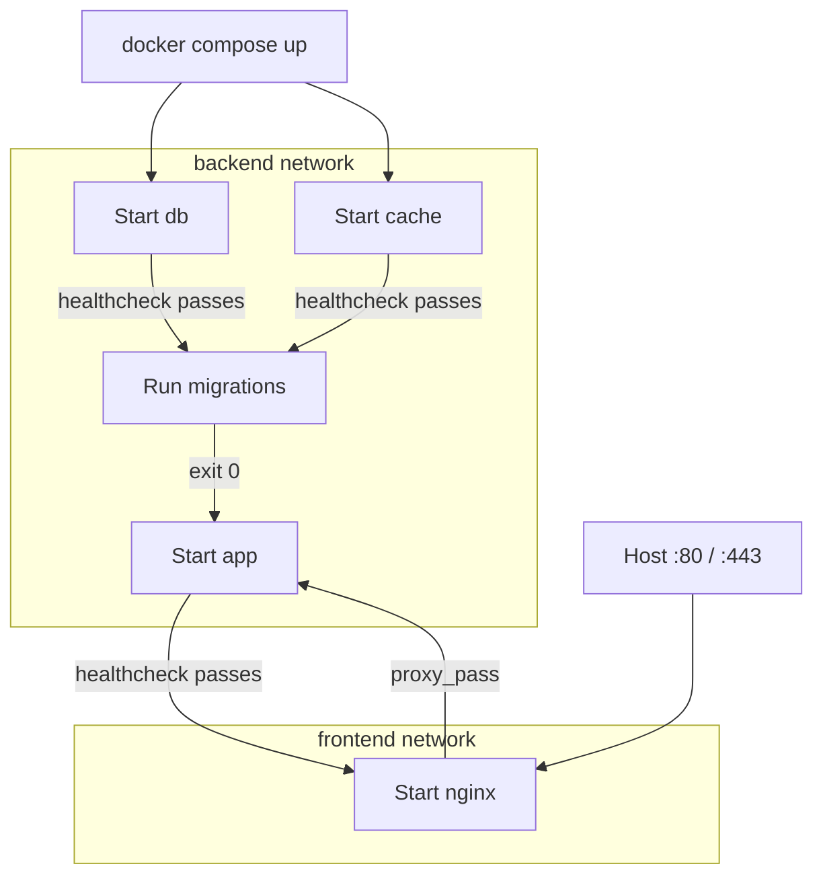

## Docker Compose Setup

### Overview

Docker Compose defines and runs multi-container applications from a single declarative YAML file. For Fastify, a typical Compose setup includes the application container alongside its dependencies — a database, cache, message broker, and reverse proxy. Compose handles network creation, dependency ordering, volume management, and environment configuration. This document covers a production-grade Compose setup with common Fastify companion services.

---

### Compose File Version and Structure

```yaml
# docker-compose.yml
services:     # container definitions
volumes:      # named persistent storage
networks:     # virtual networks
configs:      # non-secret config files (Swarm)
secrets:      # encrypted secrets (Swarm / Docker Desktop)
```

> **Key Point:** The top-level `version:` key is deprecated as of Compose V2 (Docker Desktop >= 4.13, Docker Engine >= 23). Omit it. Including it is harmless but triggers a deprecation warning in current tooling.

---

### Minimal Single-Service Setup

```yaml
# docker-compose.yml
services:
  app:
    build: .
    ports:
      - "3000:3000"
    environment:
      NODE_ENV: development
```

```bash
docker compose up
docker compose up -d        # detached
docker compose down
```

---

### Full Development Stack

```yaml
# docker-compose.yml

services:

  # ── Fastify Application ───────────────────────────────────────────────────
  app:
    build:
      context: .
      dockerfile: Dockerfile
      target: development        # use dev stage with devDependencies + hot reload
    container_name: fastify-app
    restart: unless-stopped
    ports:
      - "3000:3000"
      - "9229:9229"              # Node.js inspector port
    environment:
      NODE_ENV: development
      PORT: 3000
      HOST: 0.0.0.0
      LOG_LEVEL: debug
      DATABASE_URL: postgres://appuser:apppass@db:5432/appdb
      REDIS_URL: redis://cache:6379
    volumes:
      - .:/app                   # bind mount source for hot reload
      - /app/node_modules        # anonymous volume — prevents host node_modules overwriting container's
    depends_on:
      db:
        condition: service_healthy
      cache:
        condition: service_healthy
    networks:
      - backend
    command: node --watch src/server.js   # Node.js 18+ built-in watch mode

  # ── PostgreSQL ────────────────────────────────────────────────────────────
  db:
    image: postgres:16-alpine
    container_name: fastify-db
    restart: unless-stopped
    environment:
      POSTGRES_DB: appdb
      POSTGRES_USER: appuser
      POSTGRES_PASSWORD: apppass
    ports:
      - "5432:5432"              # expose for local tooling (DBeaver, psql)
    volumes:
      - pg-data:/var/lib/postgresql/data
      - ./db/init:/docker-entrypoint-initdb.d  # SQL scripts run on first init
    healthcheck:
      test: ["CMD-SHELL", "pg_isready -U appuser -d appdb"]
      interval: 10s
      timeout: 5s
      retries: 5
      start_period: 10s
    networks:
      - backend

  # ── Redis ─────────────────────────────────────────────────────────────────
  cache:
    image: redis:7-alpine
    container_name: fastify-cache
    restart: unless-stopped
    command: redis-server --save 60 1 --loglevel warning
    ports:
      - "6379:6379"
    volumes:
      - redis-data:/data
    healthcheck:
      test: ["CMD", "redis-cli", "ping"]
      interval: 10s
      timeout: 3s
      retries: 5
    networks:
      - backend

volumes:
  pg-data:
  redis-data:

networks:
  backend:
    driver: bridge
```

---

### Multi-Stage Dockerfile for Compose

The Compose `target:` field selects a specific build stage. Different stages serve development vs production.

```dockerfile
# Dockerfile

# ── Stage: base ──────────────────────────────────────────────────────────────
FROM node:20-alpine AS base
WORKDIR /app
COPY package*.json ./

# ── Stage: development ───────────────────────────────────────────────────────
FROM base AS development
RUN npm install                   # includes devDependencies
COPY . .
EXPOSE 3000 9229
CMD ["node", "--watch", "--inspect=0.0.0.0:9229", "src/server.js"]

# ── Stage: deps ──────────────────────────────────────────────────────────────
FROM base AS deps
RUN npm ci --omit=dev && npm cache clean --force

# ── Stage: production ────────────────────────────────────────────────────────
FROM node:20-alpine AS production
RUN apk add --no-cache dumb-init
RUN addgroup -S appgroup && adduser -S appuser -G appgroup
WORKDIR /app
COPY --from=deps --chown=appuser:appgroup /app/node_modules ./node_modules
COPY --chown=appuser:appgroup src/ ./src/
COPY --chown=appuser:appgroup package*.json ./
USER appuser
EXPOSE 3000
ENTRYPOINT ["dumb-init", "--"]
CMD ["node", "src/server.js"]
```

---

### Production Compose Override Pattern

Compose supports file merging. A base file defines the service topology; override files adjust values per environment.

```yaml
# docker-compose.yml — base (shared across all environments)
services:
  app:
    image: fastify-app:${IMAGE_TAG:-latest}
    networks:
      - backend
  db:
    image: postgres:16-alpine
    volumes:
      - pg-data:/var/lib/postgresql/data
    networks:
      - backend
  cache:
    image: redis:7-alpine
    networks:
      - backend

volumes:
  pg-data:

networks:
  backend:
```

```yaml
# docker-compose.override.yml — development (auto-loaded by Compose)
services:
  app:
    build:
      context: .
      target: development
    ports:
      - "3000:3000"
      - "9229:9229"
    volumes:
      - .:/app
      - /app/node_modules
    environment:
      NODE_ENV: development
      LOG_LEVEL: debug
      DATABASE_URL: postgres://appuser:apppass@db:5432/appdb
      REDIS_URL: redis://cache:6379
    command: node --watch src/server.js
  db:
    ports:
      - "5432:5432"
    environment:
      POSTGRES_DB: appdb
      POSTGRES_USER: appuser
      POSTGRES_PASSWORD: apppass
  cache:
    ports:
      - "6379:6379"
```

```yaml
# docker-compose.prod.yml — production overrides
services:
  app:
    restart: unless-stopped
    ports:
      - "3000:3000"
    environment:
      NODE_ENV: production
      LOG_LEVEL: info
    env_file:
      - .env.production
    deploy:
      resources:
        limits:
          cpus: "1.0"
          memory: 512M
        reservations:
          cpus: "0.25"
          memory: 128M
    healthcheck:
      test: ["CMD", "wget", "-qO-", "http://localhost:3000/healthz"]
      interval: 30s
      timeout: 5s
      retries: 3
      start_period: 15s
    stop_grace_period: 30s
  db:
    environment:
      POSTGRES_DB: ${POSTGRES_DB}
      POSTGRES_USER: ${POSTGRES_USER}
      POSTGRES_PASSWORD: ${POSTGRES_PASSWORD}
    healthcheck:
      test: ["CMD-SHELL", "pg_isready -U ${POSTGRES_USER} -d ${POSTGRES_DB}"]
      interval: 10s
      timeout: 5s
      retries: 5
  cache:
    command: >
      redis-server
      --save 60 1
      --requirepass ${REDIS_PASSWORD}
      --loglevel warning
```

Activate production overrides:

```bash
docker compose -f docker-compose.yml -f docker-compose.prod.yml up -d
```

> **Key Point:** `docker-compose.override.yml` is loaded automatically by Compose when present alongside `docker-compose.yml`. Production override files must be specified explicitly with `-f`. This prevents accidentally running dev settings in production.

---

### Environment Variable Management

#### `.env` File (Compose Variable Substitution)

Compose reads `.env` automatically for variable substitution in the Compose file itself — not for container environment variables unless `env_file:` is also used.

```bash
# .env
IMAGE_TAG=1.4.2
POSTGRES_DB=appdb
POSTGRES_USER=appuser
POSTGRES_PASSWORD=s3cr3t
REDIS_PASSWORD=r3dis
```

```yaml
# Reference in docker-compose.yml
services:
  app:
    image: fastify-app:${IMAGE_TAG:-latest}
  db:
    environment:
      POSTGRES_PASSWORD: ${POSTGRES_PASSWORD}
```

#### `env_file:` for Container Environment

```yaml
services:
  app:
    env_file:
      - .env.production     # loaded into container environment
```

#### Precedence Order (highest to lowest)

1. Values set with `docker compose run -e KEY=val`
2. `environment:` block in Compose file
3. `env_file:` file
4. `ENV` directive in Dockerfile
5. `.env` file (Compose variable substitution only)

---

### Service Dependencies and Health Checks

`depends_on` with `condition: service_healthy` delays a service start until its dependency passes the healthcheck.

```yaml
services:
  app:
    depends_on:
      db:
        condition: service_healthy
      cache:
        condition: service_healthy
      migrations:
        condition: service_completed_successfully
```

#### Database Migration as a One-Shot Service

```yaml
services:
  migrations:
    build:
      context: .
      target: deps              # needs only production deps
    image: fastify-app:latest
    command: node db/migrate.js
    environment:
      DATABASE_URL: postgres://appuser:apppass@db:5432/appdb
    depends_on:
      db:
        condition: service_healthy
    networks:
      - backend
    restart: "no"               # run once and exit — do not restart
```

```yaml
  app:
    depends_on:
      migrations:
        condition: service_completed_successfully
```

> **Key Point:** `condition: service_completed_successfully` waits for the dependent container to exit with code 0. This ensures migrations run and succeed before the app starts. If the migration container exits non-zero, the app container does not start.

---

### Networking

#### Default Network

Compose creates a default bridge network named `<project>_default`. All services join it unless `networks:` is explicitly configured.

```yaml
# Services can reach each other by service name
# app → db via hostname "db"
# app → cache via hostname "cache"
DATABASE_URL: postgres://appuser:apppass@db:5432/appdb
```

#### Network Segmentation

Separate networks restrict inter-service communication.

```yaml
services:
  app:
    networks:
      - frontend
      - backend

  nginx:
    networks:
      - frontend

  db:
    networks:
      - backend       # db is not reachable from nginx directly

  cache:
    networks:
      - backend

networks:
  frontend:
    driver: bridge
  backend:
    driver: bridge
    internal: true    # no external internet access — backend services only
```

#### Aliases

```yaml
services:
  db:
    networks:
      backend:
        aliases:
          - postgres
          - database
# app can connect using hostname "db", "postgres", or "database"
```

---

### Volumes

#### Named Volumes (Persistent)

```yaml
volumes:
  pg-data:                    # managed by Docker, survives container removal
  redis-data:
  app-uploads:
    driver: local
    driver_opts:
      type: none
      o: bind
      device: /srv/uploads    # bind to host path via named volume
```

#### Bind Mounts (Development)

```yaml
services:
  app:
    volumes:
      - .:/app                          # entire project into container
      - /app/node_modules               # anonymous volume shadows host node_modules
      - ./logs:/app/logs                # persist logs to host
```

> **Key Point:** The anonymous volume `/app/node_modules` is a critical pattern. Without it, the bind mount (`. → /app`) overwrites `node_modules` inside the container with the host's `node_modules`, which may be built for a different OS or architecture. The anonymous volume takes precedence over the bind mount for that specific path.

#### Read-Only Mounts

```yaml
services:
  app:
    volumes:
      - ./config/app.json:/app/config/app.json:ro   # read-only config
```

---

### NGINX Reverse Proxy with Fastify

```yaml
services:
  nginx:
    image: nginx:alpine
    container_name: nginx
    restart: unless-stopped
    ports:
      - "80:80"
      - "443:443"
    volumes:
      - ./nginx/nginx.conf:/etc/nginx/nginx.conf:ro
      - ./nginx/conf.d:/etc/nginx/conf.d:ro
      - ./certs:/etc/nginx/certs:ro
    depends_on:
      app:
        condition: service_healthy
    networks:
      - frontend

  app:
    # port NOT exposed to host — only reachable via nginx on internal network
    expose:
      - "3000"
    networks:
      - frontend
      - backend
```

```nginx
# nginx/conf.d/fastify.conf
upstream fastify {
    server app:3000;
    keepalive 32;
}

server {
    listen 80;
    server_name example.com;
    return 301 https://$host$request_uri;
}

server {
    listen 443 ssl;
    server_name example.com;

    ssl_certificate     /etc/nginx/certs/fullchain.pem;
    ssl_certificate_key /etc/nginx/certs/privkey.pem;

    location / {
        proxy_pass         http://fastify;
        proxy_http_version 1.1;
        proxy_set_header   Upgrade $http_upgrade;
        proxy_set_header   Connection '';
        proxy_set_header   Host $host;
        proxy_set_header   X-Real-IP $remote_addr;
        proxy_set_header   X-Forwarded-For $proxy_add_x_forwarded_for;
        proxy_set_header   X-Forwarded-Proto $scheme;
        proxy_cache_bypass $http_upgrade;
    }
}
```

> **Key Point:** Use `expose:` instead of `ports:` for the app service when sitting behind a reverse proxy. `expose:` makes the port available to other containers on the same network but does not bind it to the host. `ports:` binds to the host, bypassing the proxy and exposing the app directly.

---

### Scaling with Compose

```bash
# Scale app to 3 instances
docker compose up -d --scale app=3
```

When scaling, do not use `container_name:` — it prevents multiple instances. Remove fixed port mappings or use a load balancer.

```yaml
services:
  app:
    # No container_name — Compose generates unique names
    # No ports — nginx load balances across instances
    expose:
      - "3000"
    networks:
      - frontend
      - backend
```

```nginx
upstream fastify {
    server fastify-app-1:3000;
    server fastify-app-2:3000;
    server fastify-app-3:3000;
    keepalive 32;
}
```

> [Inference] Hardcoding instance hostnames in NGINX config breaks when the scale count changes. For dynamic scaling in Compose, use NGINX with DNS-based upstream resolution or a service mesh. Compose-level scaling is primarily for development and testing; Kubernetes or Docker Swarm is more appropriate for production autoscaling. Behavior may vary.

---

### Common Compose Commands

```bash
# Lifecycle
docker compose up -d                          # start all services detached
docker compose up -d --build                  # rebuild images before starting
docker compose down                           # stop and remove containers
docker compose down -v                        # also remove named volumes
docker compose down --rmi local               # also remove locally built images
docker compose restart app                    # restart single service
docker compose stop app                       # stop without removing

# Logs
docker compose logs -f                        # tail all services
docker compose logs -f app                    # tail one service
docker compose logs --tail=100 app

# Status
docker compose ps                             # list containers and status
docker compose top                            # running processes inside containers

# Exec
docker compose exec app sh                    # shell into running container
docker compose exec db psql -U appuser appdb  # run command in service

# Build
docker compose build                          # build all
docker compose build app                      # build one service
docker compose build --no-cache app           # force rebuild

# Pull
docker compose pull                           # pull latest base images

# Config
docker compose config                         # print merged effective config
docker compose config --services              # list service names
```

---

### Diagram — Compose Service Dependency Graph



---

### Diagram — Volume Mount Precedence

```mermaid
graph TD
    A[Bind Mount\n. → /app] -->|overwrites| B[/app directory]
    C[Anonymous Volume\n/app/node_modules] -->|takes precedence over bind mount\nfor this specific path| D[/app/node_modules]
    B --> E[/app/src visible from host]
    D --> F[node_modules built inside container\nnot overwritten by host]
```

---

**Related Topics**

- Docker Compose Watch (`docker compose watch`) for file-sync hot reload without full bind mounts
- Docker Swarm mode — promoting Compose files to Swarm stacks with `docker stack deploy`
- Traefik as a dynamic reverse proxy with automatic service discovery in Compose
- Secrets management in Compose — Docker secrets vs `env_file` vs Vault agent sidecar
- Multi-architecture Compose builds with `docker buildx bake`
- Compose health check patterns for TCP-only services (non-HTTP dependencies)
- Migrating Docker Compose to Kubernetes with `kompose convert`
- `profiles:` in Compose — conditionally activating services (e.g., only start monitoring stack when needed)