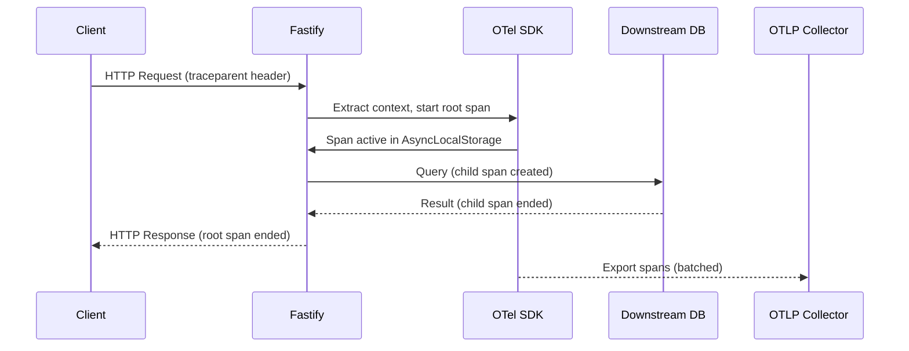

## OpenTelemetry Integration in Fastify

OpenTelemetry (OTel) is a vendor-neutral observability framework for generating, collecting, and exporting telemetry data — traces, metrics, and logs. Integrating it with Fastify provides deep visibility into request lifecycles, performance bottlenecks, and distributed system behavior.

---

### What OpenTelemetry Provides

OpenTelemetry is built around three pillars of observability:

- **Traces** — Represent the journey of a request across services, composed of spans.
- **Metrics** — Numerical measurements over time (e.g., request count, latency histograms).
- **Logs** — Structured event records, optionally correlated with traces.

In the context of Fastify, OTel primarily excels at **distributed tracing** and **HTTP metrics**, with log correlation as a secondary benefit.

---

### Core Concepts

#### Tracer Provider
The central factory for creating tracers. It is configured once at application startup and holds the exporter and sampler configuration.

#### Span
A single unit of work within a trace. Each incoming HTTP request in Fastify maps to a root span. Child spans can be created for downstream calls (database queries, external HTTP requests, etc.).

#### Context Propagation
OTel uses context propagation to pass trace identifiers across process boundaries via HTTP headers (e.g., `traceparent` in W3C Trace Context format). This links spans across microservices into a single distributed trace.

#### Exporter
The component that sends telemetry data to a backend (Jaeger, Zipkin, OTLP-compatible collectors like the OpenTelemetry Collector, Grafana Tempo, etc.).

#### Sampler
Controls which traces are recorded. Common strategies include `AlwaysOn`, `AlwaysOff`, and `TraceIdRatioBased` for probabilistic sampling.

---

### Installation

Install the required OTel packages:

```bash
npm install @opentelemetry/sdk-node \
            @opentelemetry/auto-instrumentations-node \
            @opentelemetry/exporter-trace-otlp-http \
            @opentelemetry/sdk-trace-node \
            @opentelemetry/resources \
            @opentelemetry/semantic-conventions
```

For metrics support, also install:

```bash
npm install @opentelemetry/sdk-metrics \
            @opentelemetry/exporter-metrics-otlp-http
```

---

### Instrumentation Setup

OTel instrumentation must be initialized **before** Fastify (or any other module) is loaded. This is a critical constraint — auto-instrumentation patches modules at import time.

#### `tracing.js` — SDK Bootstrap File

```js
'use strict'

const { NodeSDK } = require('@opentelemetry/sdk-node')
const { OTLPTraceExporter } = require('@opentelemetry/exporter-trace-otlp-http')
const { getNodeAutoInstrumentations } = require('@opentelemetry/auto-instrumentations-node')
const { Resource } = require('@opentelemetry/resources')
const { SEMRESATTRS_SERVICE_NAME, SEMRESATTRS_SERVICE_VERSION } = require('@opentelemetry/semantic-conventions')

const exporter = new OTLPTraceExporter({
  url: process.env.OTEL_EXPORTER_OTLP_ENDPOINT || 'http://localhost:4318/v1/traces',
})

const sdk = new NodeSDK({
  resource: new Resource({
    [SEMRESATTRS_SERVICE_NAME]: 'my-fastify-service',
    [SEMRESATTRS_SERVICE_VERSION]: '1.0.0',
  }),
  traceExporter: exporter,
  instrumentations: [
    getNodeAutoInstrumentations({
      '@opentelemetry/instrumentation-http': { enabled: true },
      '@opentelemetry/instrumentation-fastify': { enabled: true },
      '@opentelemetry/instrumentation-pg': { enabled: true },    // if using PostgreSQL
      '@opentelemetry/instrumentation-redis': { enabled: true }, // if using Redis
    }),
  ],
})

sdk.start()

process.on('SIGTERM', () => {
  sdk.shutdown()
    .then(() => console.log('OTel SDK shut down'))
    .catch(err => console.error('Error shutting down OTel SDK', err))
    .finally(() => process.exit(0))
})
```

#### Startup Command

```bash
node -r ./tracing.js server.js
```

Or with `--require` in `package.json`:

```json
{
  "scripts": {
    "start": "node --require ./tracing.js server.js"
  }
}
```

---

### Fastify Application

```js
'use strict'

const Fastify = require('fastify')

const app = Fastify({ logger: true })

app.get('/users/:id', async (request, reply) => {
  const { id } = request.params
  // Simulated DB fetch — would be traced automatically if using pg/mysql2/etc.
  return { userId: id, name: 'Alice' }
})

app.listen({ port: 3000 }, err => {
  if (err) {
    app.log.error(err)
    process.exit(1)
  }
})
```

With `@opentelemetry/instrumentation-fastify` active, each request automatically generates a span with:

- HTTP method and route
- Status code
- Request duration
- Route pattern (not raw URL, avoiding high cardinality)

---

### Manual Span Creation

Auto-instrumentation covers HTTP-level spans. For internal business logic, create manual child spans:

```js
const { trace, context } = require('@opentelemetry/api')

const tracer = trace.getTracer('my-fastify-service', '1.0.0')

app.get('/orders/:id', async (request, reply) => {
  const parentSpan = trace.getActiveSpan()

  return tracer.startActiveSpan('fetch-order-from-db', async (span) => {
    try {
      span.setAttribute('order.id', request.params.id)
      span.setAttribute('db.system', 'postgresql')

      const order = await db.query('SELECT * FROM orders WHERE id = $1', [request.params.id])

      span.setAttribute('order.status', order.status)
      span.setStatus({ code: SpanStatusCode.OK })

      return order
    } catch (err) {
      span.recordException(err)
      span.setStatus({ code: SpanStatusCode.ERROR, message: err.message })
      throw err
    } finally {
      span.end()
    }
  })
})
```

**Key Points:**
- Always call `span.end()` — use `finally` to avoid orphaned spans.
- Use `span.recordException(err)` to attach error details to a span.
- `span.setAttribute()` adds searchable key-value metadata.

---

### Semantic Conventions for HTTP Attributes

OTel defines standard attribute names to maintain consistency across tools and backends. Fastify's HTTP instrumentation applies many of these automatically:

| Attribute | Description | Example |
|---|---|---|
| `http.method` | HTTP verb | `GET` |
| `http.route` | Matched route pattern | `/users/:id` |
| `http.status_code` | Response status | `200` |
| `http.url` | Full request URL | `http://localhost:3000/users/42` |
| `net.host.name` | Server hostname | `localhost` |
| `net.host.port` | Server port | `3000` |

For custom spans, prefer semantic convention constants from `@opentelemetry/semantic-conventions` over raw strings to maintain interoperability.

---

### Adding Metrics

```js
const { MeterProvider, PeriodicExportingMetricReader } = require('@opentelemetry/sdk-metrics')
const { OTLPMetricExporter } = require('@opentelemetry/exporter-metrics-otlp-http')

const metricExporter = new OTLPMetricExporter({
  url: 'http://localhost:4318/v1/metrics',
})

const meterProvider = new MeterProvider({
  readers: [
    new PeriodicExportingMetricReader({
      exporter: metricExporter,
      exportIntervalMillis: 10_000,
    }),
  ],
})

const meter = meterProvider.getMeter('my-fastify-service')

// Counter: total requests per route
const requestCounter = meter.createCounter('http.server.request.count', {
  description: 'Total number of HTTP requests',
})

// Histogram: request duration
const requestDuration = meter.createHistogram('http.server.duration', {
  description: 'HTTP request duration in milliseconds',
  unit: 'ms',
})

app.addHook('onRequest', (request, reply, done) => {
  request.startTime = Date.now()
  done()
})

app.addHook('onResponse', (request, reply, done) => {
  const duration = Date.now() - request.startTime
  const labels = {
    method: request.method,
    route: request.routeOptions.url || 'unknown',
    status_code: String(reply.statusCode),
  }

  requestCounter.add(1, labels)
  requestDuration.record(duration, labels)
  done()
})
```

---

### Correlating Traces with Pino Logs

Fastify uses Pino for logging. To correlate log entries with active traces, inject trace context into log records:

```js
const { trace, context } = require('@opentelemetry/api')

const app = Fastify({
  logger: {
    level: 'info',
    mixin() {
      const span = trace.getActiveSpan()
      if (!span) return {}
      const spanContext = span.spanContext()
      return {
        traceId: spanContext.traceId,
        spanId: spanContext.spanId,
        traceFlags: spanContext.traceFlags,
      }
    },
  },
})
```

**Key Points:**
- This enriches every Pino log line with `traceId` and `spanId`.
- Backends like Grafana Loki + Tempo can use these fields to jump from a log line directly to the corresponding trace. [Behavior may vary depending on backend configuration.]
- The `mixin` function is called for every log entry, so keep it lightweight.

---

### Context Propagation Across Services

When Fastify calls another service, OTel must inject trace headers into the outgoing request:

```js
const { context, propagation } = require('@opentelemetry/api')
const { AsyncLocalStorageContextManager } = require('@opentelemetry/context-async-hooks')

// Registered automatically by NodeSDK, shown here for clarity

// Outgoing HTTP call with manual propagation (using node-fetch or undici)
async function callDownstreamService(request) {
  const headers = {}
  propagation.inject(context.active(), headers)

  const response = await fetch('http://other-service/api/data', { headers })
  return response.json()
}
```

When using `@opentelemetry/instrumentation-undici` or `@opentelemetry/instrumentation-http`, propagation headers are injected automatically. Manual injection is only needed for custom HTTP clients or non-instrumented transports.

---

### Sampling Strategies

```js
const { TraceIdRatioBasedSampler, ParentBasedSampler } = require('@opentelemetry/sdk-trace-node')

const sdk = new NodeSDK({
  sampler: new ParentBasedSampler({
    root: new TraceIdRatioBasedSampler(0.1), // Sample 10% of new traces
  }),
  // ...
})
```

| Sampler | Behavior |
|---|---|
| `AlwaysOnSampler` | Records every trace (development/debugging) |
| `AlwaysOffSampler` | Records no traces (disables tracing) |
| `TraceIdRatioBasedSampler` | Probabilistic — samples a configured fraction |
| `ParentBasedSampler` | Respects upstream sampling decision; applies root sampler for new traces |

**Key Points:**
- In production, `AlwaysOn` can be expensive at high throughput. Use ratio-based or tail sampling.
- `ParentBasedSampler` is the recommended default because it respects upstream decisions from API gateways or load balancers that may have already sampled the trace.

---

### Exporter Options

| Exporter | Package | Use Case |
|---|---|---|
| OTLP HTTP | `@opentelemetry/exporter-trace-otlp-http` | OpenTelemetry Collector, Grafana Tempo, Honeycomb |
| OTLP gRPC | `@opentelemetry/exporter-trace-otlp-grpc` | High-throughput production environments |
| Jaeger | `@opentelemetry/exporter-jaeger` | Direct to Jaeger (legacy; OTLP preferred) |
| Zipkin | `@opentelemetry/exporter-zipkin` | Direct to Zipkin |
| Console | `@opentelemetry/sdk-trace-node` (built-in) | Local development debugging |

**Example** — Console exporter for development:

```js
const { ConsoleSpanExporter } = require('@opentelemetry/sdk-trace-node')

const sdk = new NodeSDK({
  traceExporter: new ConsoleSpanExporter(),
  // ...
})
```

---

### Environment Variable Configuration

OTel respects standard environment variables, reducing the need for code-level configuration changes between environments:

```bash
OTEL_SERVICE_NAME=my-fastify-service
OTEL_EXPORTER_OTLP_ENDPOINT=http://otel-collector:4318
OTEL_EXPORTER_OTLP_HEADERS=Authorization=Bearer <token>
OTEL_TRACES_SAMPLER=traceidratio
OTEL_TRACES_SAMPLER_ARG=0.25
OTEL_LOG_LEVEL=info
```

These override SDK-level configuration. Using environment variables is the preferred approach for containerized deployments.

---

### Diagram — Trace Flow in a Fastify Request



---

### Plugin Alternative: `@fastify/opentelemetry`

The community plugin `@fastify/opentelemetry` provides Fastify-native integration:

```bash
npm install @fastify/opentelemetry
```

```js
const openTelemetryPlugin = require('@fastify/opentelemetry')

await app.register(openTelemetryPlugin, { exposeApi: true })

app.get('/ping', async (request, reply) => {
  // Access the active span via request context
  const span = request.openTelemetry().activeSpan
  span.setAttribute('custom.key', 'custom-value')
  return { pong: true }
})
```

**Key Points:**
- `exposeApi: true` exposes `request.openTelemetry()` for accessing the tracer and active span within route handlers.
- This plugin integrates with Fastify's request lifecycle hooks natively, making span access ergonomic without importing `@opentelemetry/api` directly in every route.
- [Inference] This plugin is preferred over raw auto-instrumentation when you need fine-grained span control inside Fastify handlers.

---

### Common Pitfalls

#### Instrumentation loaded too late
If `tracing.js` is imported after Fastify or `http`, auto-instrumentation will not patch those modules. Always use `--require` or load the SDK file as the first import.

#### High cardinality spans
Avoid using raw URLs as span names (e.g., `/users/12345`). OTel's Fastify instrumentation uses route patterns (`/users/:id`) by default, which is the correct behavior. Custom spans should follow the same convention.

#### Missing `span.end()`
Spans that are never ended will not be exported. Use `try/finally` blocks to guarantee `span.end()` is called.

#### Context loss with callbacks
OTel uses `AsyncLocalStorage` for context propagation. If you use non-async callback patterns (e.g., `setTimeout`, event emitters without proper context binding), the active span context may be lost. [Behavior may vary depending on Node.js version and OTel SDK version.]

---

### Production Checklist

- [ ] `tracing.js` loaded before all other modules via `--require`
- [ ] Service name and version set via `Resource` or `OTEL_SERVICE_NAME`
- [ ] Sampler configured for production throughput (not `AlwaysOn`)
- [ ] Exporter pointed at a collector, not a backend directly (use OTel Collector as intermediary)
- [ ] `sdk.shutdown()` called on `SIGTERM` to flush pending spans
- [ ] Trace IDs injected into Pino logs for log-trace correlation
- [ ] High-cardinality attributes (user IDs, UUIDs) added as span attributes, not span names
- [ ] Sensitive data (passwords, tokens) explicitly excluded from span attributes

---

**Related Topics:**

- Distributed tracing with Jaeger and Grafana Tempo
- OpenTelemetry Collector configuration and pipelines
- Prometheus metrics with `@fastify/metrics` and `prom-client`
- Pino log transport to Loki for log aggregation
- Tail-based sampling strategies
- `@fastify/opentelemetry` deep dive
- Context propagation in Fastify plugins and decorators
- Alerting on OTel metrics with Grafana or Datadog