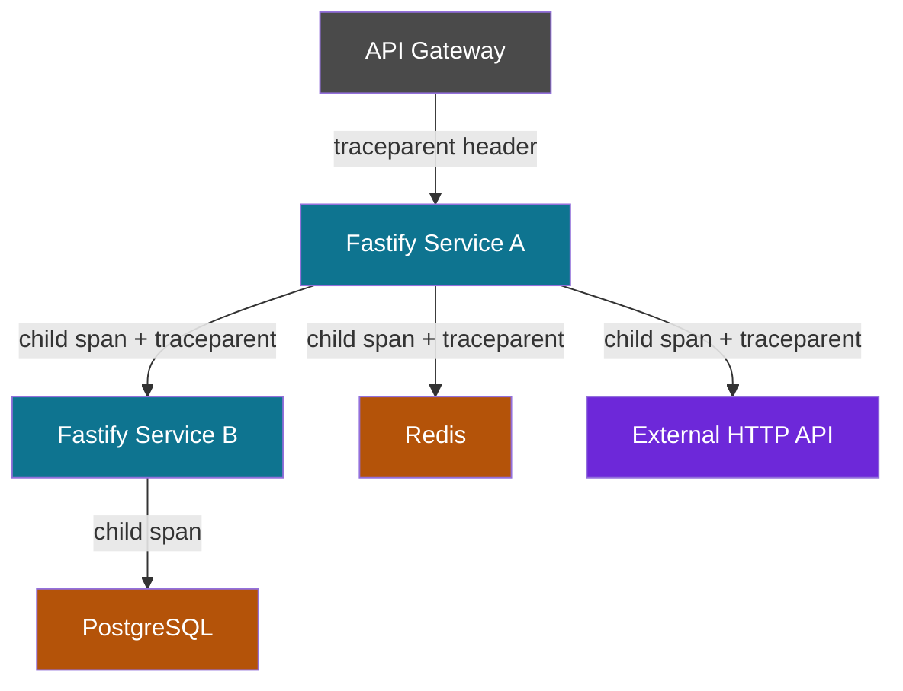

## Distributed Tracing in Fastify

Distributed tracing tracks requests as they flow across multiple services, processes, or machines. In microservice architectures, a single user action may touch dozens of services — distributed tracing stitches these into a single, navigable timeline, exposing latency, failures, and dependencies that are invisible in isolated service logs.

---

### Core Concepts

#### Trace
A complete record of a request's journey through a system. A trace is a directed acyclic graph (DAG) of spans, all sharing a common `traceId`.

#### Span
The atomic unit of a trace. Each span represents a single operation — an HTTP request, a database query, a cache lookup. Spans carry:

- A unique `spanId`
- The parent `spanId` (if any)
- Start and end timestamps
- A status (OK, ERROR, UNSET)
- Attributes (key-value metadata)
- Events (timestamped log-like records within a span)

#### Trace Context
A small set of propagation headers that carry the `traceId` and parent `spanId` across process boundaries. The W3C Trace Context standard defines the `traceparent` and `tracestate` headers as the interoperable format.

#### Parent-Child Relationships
When Service A calls Service B, Service A's active span becomes the parent of the span Service B creates for that request. This forms the tree structure visible in tracing UIs.

---

### W3C Trace Context Headers

```
traceparent: 00-4bf92f3577b34da6a3ce929d0e0e4736-00f067aa0ba902b7-01
             ^^ ^^^^^^^^^^^^^^^^^^^^^^^^^^^^^^^^ ^^^^^^^^^^^^^^^^ ^^
             version  traceId (128-bit hex)      spanId (64-bit)  flags
```

- **Version** — Always `00` in current spec.
- **TraceId** — Globally unique identifier for the entire trace.
- **ParentSpanId** — The span ID of the caller.
- **Flags** — Sampling flag; `01` = sampled, `00` = not sampled.

The `tracestate` header carries vendor-specific metadata alongside `traceparent`.

---

### How Fastify Participates

Fastify acts as both a **producer** (incoming requests start new spans) and a **consumer** (outgoing calls propagate existing context). The OTel SDK and `@fastify/opentelemetry` handle both roles automatically when configured correctly.



---

### Setup: Multi-Service Tracing

#### Shared Tracing Bootstrap (`tracing.js`)

Each service requires its own SDK initialization. Share the pattern, vary the service name:

```js
'use strict'

const { NodeSDK } = require('@opentelemetry/sdk-node')
const { OTLPTraceExporter } = require('@opentelemetry/exporter-trace-otlp-http')
const { getNodeAutoInstrumentations } = require('@opentelemetry/auto-instrumentations-node')
const { Resource } = require('@opentelemetry/resources')
const { SEMRESATTRS_SERVICE_NAME, SEMRESATTRS_SERVICE_VERSION } = require('@opentelemetry/semantic-conventions')
const { ParentBasedSampler, TraceIdRatioBasedSampler } = require('@opentelemetry/sdk-trace-node')

const sdk = new NodeSDK({
  resource: new Resource({
    [SEMRESATTRS_SERVICE_NAME]: process.env.OTEL_SERVICE_NAME || 'fastify-service',
    [SEMRESATTRS_SERVICE_VERSION]: process.env.npm_package_version || '0.0.0',
  }),
  traceExporter: new OTLPTraceExporter({
    url: process.env.OTEL_EXPORTER_OTLP_ENDPOINT || 'http://localhost:4318/v1/traces',
  }),
  sampler: new ParentBasedSampler({
    root: new TraceIdRatioBasedSampler(
      parseFloat(process.env.OTEL_TRACES_SAMPLE_RATE || '1.0')
    ),
  }),
  instrumentations: [getNodeAutoInstrumentations()],
})

sdk.start()

process.on('SIGTERM', async () => {
  try {
    await sdk.shutdown()
  } finally {
    process.exit(0)
  }
})
```

---

### Service A — Receiving and Propagating Context

Service A receives an inbound request (with or without a `traceparent` header) and calls Service B:

```js
'use strict'

const Fastify = require('fastify')
const { trace, context, propagation } = require('@opentelemetry/api')

const app = Fastify({ logger: true })
const tracer = trace.getTracer('service-a', '1.0.0')

app.get('/checkout/:orderId', async (request, reply) => {
  const { orderId } = request.params

  // Child span for internal validation logic
  const order = await tracer.startActiveSpan('validate-order', async (span) => {
    span.setAttribute('order.id', orderId)
    try {
      const result = await validateOrder(orderId)
      span.setAttribute('order.valid', result.valid)
      return result
    } catch (err) {
      span.recordException(err)
      span.setStatus({ code: 2, message: err.message }) // 2 = ERROR
      throw err
    } finally {
      span.end()
    }
  })

  // Call Service B — OTel HTTP instrumentation injects traceparent automatically
  const inventoryResponse = await fetch(
    `http://service-b:3001/inventory/${orderId}`
  )

  const inventory = await inventoryResponse.json()
  return { order, inventory }
})

app.listen({ port: 3000, host: '0.0.0.0' })
```

**Key Points:**
- When using `@opentelemetry/instrumentation-undici` or `@opentelemetry/instrumentation-http`, the `traceparent` header is injected into outgoing `fetch`/`http` calls automatically.
- The child span (`validate-order`) is nested under the root span created by the HTTP instrumentation for the incoming `/checkout/:orderId` request.

---

### Service B — Continuing the Trace

Service B receives the `traceparent` header and continues the trace transparently:

```js
'use strict'

const Fastify = require('fastify')
const { trace } = require('@opentelemetry/api')

const app = Fastify({ logger: true })
const tracer = trace.getTracer('service-b', '1.0.0')

app.get('/inventory/:orderId', async (request, reply) => {
  const { orderId } = request.params

  // The root span here is automatically a child of Service A's span
  // because the OTel SDK extracted the traceparent header on ingress

  return tracer.startActiveSpan('query-inventory-db', async (span) => {
    span.setAttribute('db.system', 'postgresql')
    span.setAttribute('db.statement', 'SELECT * FROM inventory WHERE order_id = $1')
    span.setAttribute('order.id', orderId)

    try {
      const result = await db.query(
        'SELECT * FROM inventory WHERE order_id = $1',
        [orderId]
      )
      span.setAttribute('db.rows_returned', result.rows.length)
      return { items: result.rows }
    } catch (err) {
      span.recordException(err)
      span.setStatus({ code: 2, message: err.message })
      throw err
    } finally {
      span.end()
    }
  })
})

app.listen({ port: 3001, host: '0.0.0.0' })
```

---

### Manual Context Propagation

When using HTTP clients that are not auto-instrumented, inject and extract context manually:

#### Injecting on outgoing requests

```js
const { context, propagation } = require('@opentelemetry/api')

async function callServiceC(orderId) {
  const headers = {
    'Content-Type': 'application/json',
  }

  // Inject active trace context into headers
  propagation.inject(context.active(), headers)

  const response = await someCustomHttpClient.get(
    `http://service-c:3002/pricing/${orderId}`,
    { headers }
  )

  return response.data
}
```

#### Extracting on incoming requests (manual, without auto-instrumentation)

```js
const { context, propagation, trace } = require('@opentelemetry/api')

app.addHook('onRequest', (request, reply, done) => {
  const extractedContext = propagation.extract(context.active(), request.headers)

  // Store the context on the request for use in the handler
  request.otelContext = extractedContext
  done()
})

app.get('/example', (request, reply) => {
  context.with(request.otelContext, () => {
    const span = trace.getTracer('service-c').startSpan('handle-example')
    // span is now a child of the upstream caller's span
    span.end()
  })
  reply.send({ ok: true })
})
```

**Key Points:**
- Manual extraction is rarely necessary when `@opentelemetry/instrumentation-http` is active, which handles this automatically at the Node.js `http` module level.
- Manual injection is needed for non-HTTP transports such as message queues, WebSockets, or gRPC without dedicated instrumentation.

---

### Propagation with Message Queues

Distributed tracing across async boundaries (e.g., RabbitMQ, Kafka) requires embedding trace context in message metadata:

#### Producer (Fastify publishes a message)

```js
const { context, propagation } = require('@opentelemetry/api')

async function publishOrderEvent(orderId, payload) {
  const carrier = {} // Will hold the trace headers
  propagation.inject(context.active(), carrier)

  await channel.publish('orders', 'order.created', Buffer.from(JSON.stringify(payload)), {
    headers: carrier, // Embed trace context in AMQP headers
  })
}
```

#### Consumer (Worker service extracts context)

```js
const { context, propagation, trace } = require('@opentelemetry/api')

channel.consume('orders', (msg) => {
  const carrier = msg.properties.headers || {}
  const parentContext = propagation.extract(context.active(), carrier)

  context.with(parentContext, () => {
    const span = trace.getTracer('order-worker').startSpan('process-order-event')
    span.setAttribute('messaging.system', 'rabbitmq')
    span.setAttribute('messaging.destination', 'orders')

    try {
      const payload = JSON.parse(msg.content.toString())
      processOrder(payload)
      span.setStatus({ code: 1 }) // OK
    } catch (err) {
      span.recordException(err)
      span.setStatus({ code: 2, message: err.message })
    } finally {
      span.end()
      channel.ack(msg)
    }
  })
})
```

---

### Span Events and Links

#### Span Events
Timestamped annotations within a span — lighter than child spans for recording discrete moments:

```js
span.addEvent('cache-miss', {
  'cache.key': `order:${orderId}`,
  'cache.backend': 'redis',
})

span.addEvent('retry-attempt', {
  'retry.count': 2,
  'retry.reason': 'timeout',
})
```

#### Span Links
Links associate a span with another span from a different trace — useful for batch processing where one worker span processes many upstream requests:

```js
const { context, trace } = require('@opentelemetry/api')

const batchSpan = tracer.startSpan('process-batch', {
  links: incomingMessages.map(msg => ({
    context: propagation.extract(context.active(), msg.headers),
    attributes: { 'message.id': msg.id },
  })),
})
```

**Key Points:**
- Span links are distinct from parent-child relationships. A linked span is not a child; it is a related peer.
- Links are useful for fan-in patterns: a single processing span that was triggered by multiple independent upstream traces.

---

### Baggage — Cross-Service Metadata

Baggage carries arbitrary key-value pairs alongside trace context, making them available to all downstream services without passing them as explicit parameters:

```js
const { context, propagation, baggageEntryMetadataFromString } = require('@opentelemetry/api')

// Set baggage in Service A
const baggage = propagation.getBaggage(context.active()) || propagation.createBaggage()
const updatedBaggage = baggage.setEntry('tenant.id', {
  value: 'acme-corp',
  metadata: baggageEntryMetadataFromString(''),
})

const updatedContext = propagation.setBaggage(context.active(), updatedBaggage)

// Run the rest of the handler with baggage in context
context.with(updatedContext, async () => {
  await fetch('http://service-b:3001/data') // baggage propagated automatically
})

// Read baggage in Service B
const baggage = propagation.getBaggage(context.active())
const tenantId = baggage?.getEntry('tenant.id')?.value
```

**Key Points:**
- Baggage is propagated via the `baggage` HTTP header automatically by OTel propagators.
- [Inference] Baggage is suited for low-cardinality, cross-cutting concerns like tenant IDs or feature flags. Avoid high-volume or sensitive data — baggage is transmitted in plaintext headers and logged by many systems. [Behavior may vary depending on propagator configuration.]

---

### Trace Visualization: Waterfall View

A distributed trace across three services visualized as a waterfall:

```
Trace: 4bf92f35...                                          Total: 142ms
│
├── [Service A] GET /checkout/:orderId ─────────────────────────── 142ms
│     ├── [Service A] validate-order ─────────── 12ms
│     ├── [Service B] GET /inventory/:orderId ────────────── 98ms
│     │     └── [Service B] query-inventory-db ──── 61ms
│     └── [Service A] serialize-response ─── 8ms
```

Each indented row is a child span. The horizontal extent represents wall-clock time, making bottlenecks immediately visible.

---

### Attribute Best Practices

| Practice | Correct | Avoid |
|---|---|---|
| Use semantic conventions | `db.system = postgresql` | `database_type = pg` |
| Route pattern, not raw URL | `http.route = /users/:id` | `http.url = /users/12345` |
| UUIDs as attributes, not span names | `span.setAttribute('user.id', id)` | `tracer.startSpan('/users/'+id)` |
| Sanitize sensitive fields | Omit passwords, tokens | Logging `Authorization` header |
| Use consistent naming | `order.id`, `order.status` | `ordId`, `order_status`, `ORDER_ID` |

---

### Sampling in Distributed Systems

Sampling decisions propagate via the `traceflags` byte in `traceparent`. If Service A decides to sample (flag `01`), all downstream services using `ParentBasedSampler` will also sample — ensuring complete traces.

```
Service A (TraceIdRatio 10%) → samples trace → flag: 01
  Service B (ParentBased) → sees flag 01 → samples
    Service C (ParentBased) → sees flag 01 → samples

Service A → does not sample → flag: 00
  Service B (ParentBased) → sees flag 00 → does not sample
    Service C (ParentBased) → sees flag 00 → does not sample
```

**Key Points:**
- Head-based sampling (deciding at trace start) is the default OTel model.
- Tail-based sampling (deciding after the trace completes) requires an OTel Collector with tail sampling processor — the SDK alone cannot implement it.
- [Inference] Tail-based sampling is preferable for capturing rare error traces that would otherwise be dropped by ratio-based head sampling.

---

### Common Failure Patterns

#### Broken trace: missing `traceparent` injection
Symptom — downstream service starts a new root trace instead of continuing the parent.
Cause — outgoing HTTP client not instrumented, or `--require ./tracing.js` not applied to the calling service.

#### Orphaned spans
Symptom — spans appear in the backend but are not attached to any trace.
Cause — `span.end()` called after the exporter flush, or SDK not shut down gracefully on process exit.

#### Context loss in async callbacks
Symptom — child spans created inside `setTimeout`, `EventEmitter`, or stream callbacks show no parent.
Cause — `AsyncLocalStorage` context not propagated across those async boundaries.

```js
// Problematic — context may be lost
const span = tracer.startSpan('my-span')
setTimeout(() => {
  // span may not be the active span here
  doWork()
  span.end()
}, 100)

// Correct — preserve context explicitly
const span = tracer.startSpan('my-span')
const ctx = trace.setSpan(context.active(), span)
setTimeout(
  context.bind(ctx, () => {
    doWork()
    span.end()
  }),
  100
)
```

---

### Integration with `@fastify/opentelemetry`

```js
const openTelemetryPlugin = require('@fastify/opentelemetry')

await app.register(openTelemetryPlugin, { exposeApi: true })

app.get('/orders/:id', async (request, reply) => {
  const { tracer, activeSpan, context: otelContext } = request.openTelemetry()

  activeSpan.setAttribute('order.id', request.params.id)

  return tracer.startActiveSpan('enrich-order', { }, otelContext, async (child) => {
    try {
      const result = await enrichOrder(request.params.id)
      return result
    } finally {
      child.end()
    }
  })
})
```

**Key Points:**
- `request.openTelemetry()` provides the tracer, active span, and context scoped to the current request — avoiding the need to import `@opentelemetry/api` directly in route files.
- The `context` from `request.openTelemetry()` is already the correct request-scoped context, which is important in concurrent environments where multiple requests are in flight simultaneously.

---

### Production Checklist

- [ ] All services use `--require ./tracing.js` before any other module
- [ ] `OTEL_SERVICE_NAME` set uniquely per service
- [ ] `ParentBasedSampler` used to honor upstream sampling decisions
- [ ] Outgoing HTTP clients instrumented (undici, node http, axios, got)
- [ ] Message queue consumers extract and restore trace context
- [ ] `span.end()` always called in `finally` blocks
- [ ] `sdk.shutdown()` registered on `SIGTERM` and `SIGINT`
- [ ] No raw user IDs, UUIDs, or sensitive values used as span names
- [ ] Attribute names follow OTel semantic conventions
- [ ] Tail sampling configured in OTel Collector for error-trace capture

---

**Related Topics:**

- OpenTelemetry Collector — pipelines, processors, and tail sampling
- Jaeger deployment and UI navigation
- Grafana Tempo with TraceQL queries
- Baggage propagation patterns and security considerations
- Instrumentation for specific clients: Prisma, Mongoose, ioredis, undici
- gRPC tracing with Fastify
- Trace-to-log correlation in Grafana Loki
- Sampling strategies — head vs tail vs adaptive