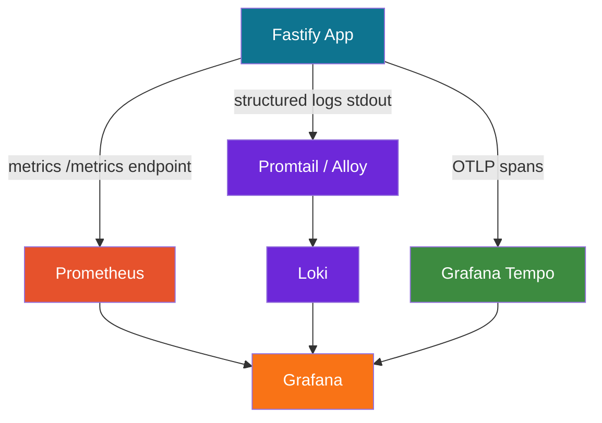

## Grafana Dashboards for Fastify

Grafana is an open-source observability platform for visualizing metrics, logs, and traces. When paired with Fastify, it provides real-time dashboards covering request throughput, latency distributions, error rates, and infrastructure health — drawing from data sources such as Prometheus, Loki, and Tempo.

---

### Architecture Overview



Grafana does not collect data itself — it queries data sources. For Fastify, the typical stack is:

- **Prometheus** — scrapes `/metrics` for time-series metrics
- **Loki** — receives structured Pino logs via Promtail or Grafana Alloy
- **Tempo** — receives OTel traces via OTLP
- **Grafana** — unifies all three into dashboards and alerts

---

### Exposing Metrics from Fastify

Grafana's primary data source for Fastify metrics is Prometheus. The `@fastify/metrics` plugin (backed by `prom-client`) exposes a `/metrics` endpoint in Prometheus exposition format.

#### Installation

```bash
npm install @fastify/metrics prom-client
```

#### Registration

```js
'use strict'

const Fastify = require('fastify')
const metricsPlugin = require('@fastify/metrics')

const app = Fastify({ logger: true })

await app.register(metricsPlugin, {
  endpoint: '/metrics',
  defaultMetrics: { enabled: true },   // process CPU, memory, event loop lag
  routeMetrics: {
    enabled: true,
    routeBlacklist: ['/metrics', '/health'], // exclude internal endpoints
    overrides: {
      histogram: {
        name: 'http_request_duration_seconds',
        buckets: [0.005, 0.01, 0.025, 0.05, 0.1, 0.25, 0.5, 1, 2.5, 5],
      },
      summary: {
        name: 'http_request_summary_seconds',
        percentiles: [0.5, 0.9, 0.95, 0.99],
      },
    },
  },
})

app.listen({ port: 3000, host: '0.0.0.0' })
```

#### Sample `/metrics` Output

```
# HELP http_request_duration_seconds request duration histogram
# TYPE http_request_duration_seconds histogram
http_request_duration_seconds_bucket{le="0.05",method="GET",route="/users/:id",status_code="200"} 142
http_request_duration_seconds_bucket{le="0.1",method="GET",route="/users/:id",status_code="200"} 198
http_request_duration_seconds_sum{method="GET",route="/users/:id",status_code="200"} 14.23
http_request_duration_seconds_count{method="GET",route="/users/:id",status_code="200"} 210

# HELP process_cpu_user_seconds_total Total user CPU time spent in seconds
# TYPE process_cpu_user_seconds_total counter
process_cpu_user_seconds_total 4.312
```

---

### Custom Metrics

Define application-specific metrics beyond HTTP-level instrumentation:

```js
const { Registry, Counter, Histogram, Gauge } = require('prom-client')

const register = new Registry()

const orderCounter = new Counter({
  name: 'orders_total',
  help: 'Total number of orders placed',
  labelNames: ['status', 'payment_method'],
  registers: [register],
})

const queueDepth = new Gauge({
  name: 'job_queue_depth',
  help: 'Current number of jobs in the processing queue',
  labelNames: ['queue_name'],
  registers: [register],
})

const dbQueryDuration = new Histogram({
  name: 'db_query_duration_seconds',
  help: 'Database query execution time',
  labelNames: ['operation', 'table'],
  buckets: [0.001, 0.005, 0.01, 0.05, 0.1, 0.5, 1],
  registers: [register],
})

// Usage in a route handler
app.post('/orders', async (request, reply) => {
  const timer = dbQueryDuration.startTimer({ operation: 'insert', table: 'orders' })
  try {
    const order = await db.insertOrder(request.body)
    timer()  // records duration
    orderCounter.inc({ status: 'success', payment_method: order.paymentMethod })
    return order
  } catch (err) {
    timer()
    orderCounter.inc({ status: 'error', payment_method: 'unknown' })
    throw err
  }
})
```

---

### Prometheus Configuration

Prometheus scrapes Fastify's `/metrics` endpoint at a configured interval:

```yaml
# prometheus.yml
global:
  scrape_interval: 15s
  evaluation_interval: 15s

scrape_configs:
  - job_name: fastify-service
    static_configs:
      - targets:
          - fastify-app:3000
    metrics_path: /metrics
    scrape_interval: 10s

  - job_name: fastify-service-b
    static_configs:
      - targets:
          - fastify-service-b:3001
    metrics_path: /metrics
```

For dynamic service discovery in Kubernetes:

```yaml
scrape_configs:
  - job_name: fastify-pods
    kubernetes_sd_configs:
      - role: pod
    relabel_configs:
      - source_labels: [__meta_kubernetes_pod_annotation_prometheus_io_scrape]
        action: keep
        regex: 'true'
      - source_labels: [__meta_kubernetes_pod_annotation_prometheus_io_path]
        action: replace
        target_label: __metrics_path__
        regex: (.+)
```

---

### Docker Compose: Full Observability Stack

```yaml
version: '3.8'

services:
  fastify-app:
    build: .
    ports:
      - '3000:3000'
    environment:
      - OTEL_SERVICE_NAME=fastify-app
      - OTEL_EXPORTER_OTLP_ENDPOINT=http://tempo:4318
    logging:
      driver: json-file

  prometheus:
    image: prom/prometheus:latest
    volumes:
      - ./prometheus.yml:/etc/prometheus/prometheus.yml
    ports:
      - '9090:9090'

  loki:
    image: grafana/loki:latest
    ports:
      - '3100:3100'

  promtail:
    image: grafana/promtail:latest
    volumes:
      - /var/lib/docker/containers:/var/lib/docker/containers:ro
      - ./promtail.yml:/etc/promtail/config.yml
    depends_on:
      - loki

  tempo:
    image: grafana/tempo:latest
    ports:
      - '4318:4318'
      - '3200:3200'
    volumes:
      - ./tempo.yml:/etc/tempo/config.yml

  grafana:
    image: grafana/grafana:latest
    ports:
      - '3001:3000'
    environment:
      - GF_SECURITY_ADMIN_PASSWORD=admin
    volumes:
      - ./grafana/provisioning:/etc/grafana/provisioning
      - grafana-storage:/var/lib/grafana
    depends_on:
      - prometheus
      - loki
      - tempo

volumes:
  grafana-storage:
```

---

### Grafana Data Source Provisioning

Provision data sources automatically via YAML so dashboards work immediately on startup:

```yaml
# grafana/provisioning/datasources/datasources.yml
apiVersion: 1

datasources:
  - name: Prometheus
    type: prometheus
    access: proxy
    url: http://prometheus:9090
    isDefault: true
    jsonData:
      timeInterval: '10s'
      exemplarTraceIdDestinations:
        - name: traceID
          datasourceUid: tempo

  - name: Loki
    type: loki
    access: proxy
    url: http://loki:3100
    jsonData:
      derivedFields:
        - matcherRegex: '"traceId":"(\w+)"'
          name: TraceID
          url: '$${__value.raw}'
          datasourceUid: tempo

  - name: Tempo
    uid: tempo
    type: tempo
    access: proxy
    url: http://tempo:3200
    jsonData:
      tracesToLogsV2:
        datasourceUid: loki
        filterByTraceID: true
      serviceMap:
        datasourceUid: prometheus
```

**Key Points:**
- `exemplarTraceIdDestinations` links Prometheus exemplars (trace IDs embedded in metric samples) to Tempo — enabling jump-from-metric-to-trace.
- `derivedFields` in Loki extracts `traceId` from JSON log lines and turns it into a clickable link to Tempo.
- These linkages form the basis of Grafana's unified observability — navigating from a slow metric spike → to a trace → to the associated log lines.

---

### Core Dashboard Panels

#### Request Rate (Requests per Second)

```promql
sum(rate(http_request_duration_seconds_count{job="fastify-service"}[1m])) by (route, method)
```

**Panel type:** Time series
**Use:** Observe traffic patterns, detect sudden drops or spikes per route.

---

#### Error Rate

```promql
sum(rate(http_request_duration_seconds_count{job="fastify-service", status_code=~"5.."}[1m]))
/
sum(rate(http_request_duration_seconds_count{job="fastify-service"}[1m]))
```

**Panel type:** Time series or Stat (with thresholds at 1% = yellow, 5% = red)
**Use:** SLO tracking — alert when error rate exceeds acceptable threshold.

---

#### Latency Percentiles (P50, P95, P99)

```promql
histogram_quantile(0.50, sum(rate(http_request_duration_seconds_bucket{job="fastify-service"}[5m])) by (le, route))
histogram_quantile(0.95, sum(rate(http_request_duration_seconds_bucket{job="fastify-service"}[5m])) by (le, route))
histogram_quantile(0.99, sum(rate(http_request_duration_seconds_bucket{job="fastify-service"}[5m])) by (le, route))
```

**Panel type:** Time series (three queries, one panel, labeled P50/P95/P99)
**Use:** Identify tail latency degradation that averages conceal.

---

#### Apdex Score

Apdex (Application Performance Index) normalizes performance into a 0–1 score using satisfied, tolerated, and frustrated thresholds:

```promql
(
  sum(rate(http_request_duration_seconds_bucket{job="fastify-service", le="0.1"}[5m]))
  +
  (sum(rate(http_request_duration_seconds_bucket{job="fastify-service", le="0.5"}[5m]))
  - sum(rate(http_request_duration_seconds_bucket{job="fastify-service", le="0.1"}[5m]))) / 2
)
/
sum(rate(http_request_duration_seconds_count{job="fastify-service"}[5m]))
```

**Panel type:** Stat with color thresholds (green ≥ 0.9, yellow ≥ 0.7, red < 0.7)

---

#### Active Connections / Concurrent Requests

```promql
nodejs_active_handles_total{job="fastify-service"}
```

```promql
nodejs_active_requests_total{job="fastify-service"}
```

**Panel type:** Gauge or Time series

---

#### Event Loop Lag

```promql
nodejs_eventloop_lag_seconds{job="fastify-service"}
```

**Panel type:** Time series with alert threshold at 100ms
**Use:** Event loop lag above ~100ms [Inference] often indicates CPU-bound work blocking the loop, or a GC pause. Behavior may vary by workload and Node.js version.

---

#### Memory Usage

```promql
process_resident_memory_bytes{job="fastify-service"}
nodejs_heap_used_bytes{job="fastify-service"}
nodejs_heap_size_total_bytes{job="fastify-service"}
nodejs_external_memory_bytes{job="fastify-service"}
```

**Panel type:** Time series (stacked or overlapping)
**Use:** Detect memory leaks — heap used growing monotonically without GC recovery is a strong [Inference] indicator of a leak.

---

#### CPU Usage

```promql
rate(process_cpu_user_seconds_total{job="fastify-service"}[1m])
rate(process_cpu_system_seconds_total{job="fastify-service"}[1m])
```

**Panel type:** Time series

---

### Dashboard JSON Provisioning

Grafana dashboards can be provisioned as JSON files, version-controlled alongside the application:

```yaml
# grafana/provisioning/dashboards/dashboards.yml
apiVersion: 1

providers:
  - name: fastify-dashboards
    type: file
    options:
      path: /etc/grafana/provisioning/dashboards/json
      foldersFromFilesStructure: true
```

Place dashboard JSON exports at:

```
grafana/provisioning/dashboards/json/
  fastify-overview.json
  fastify-routes.json
  fastify-node.json
```

**Key Points:**
- Dashboard JSON can be exported from the Grafana UI (Dashboard settings → JSON model) and committed to version control.
- Provisioned dashboards are read-only in the UI by default — set `allowUiUpdates: true` in the provider config to allow edits.

---

### Log Visualization with Loki

#### Promtail Configuration

```yaml
# promtail.yml
server:
  http_listen_port: 9080

clients:
  - url: http://loki:3100/loki/api/v1/push

scrape_configs:
  - job_name: fastify-containers
    docker_sd_configs:
      - host: unix:///var/run/docker.sock
        refresh_interval: 5s
    relabel_configs:
      - source_labels: [__meta_docker_container_name]
        target_label: container
      - source_labels: [__meta_docker_container_label_com_docker_compose_service]
        target_label: service
    pipeline_stages:
      - json:
          expressions:
            level: level
            traceId: traceId
            reqId: reqId
            msg: msg
      - labels:
          level:
          traceId:
      - output:
          source: msg
```

#### LogQL Queries in Grafana

Request errors from Fastify logs:

```logql
{service="fastify-app"} | json | level="error"
```

Slow requests (over 500ms) parsed from Pino's `responseTime` field:

```logql
{service="fastify-app"} | json | responseTime > 500
```

Request volume by route from logs:

```logql
sum(count_over_time({service="fastify-app"} | json | url != "" [1m])) by (url)
```

**Panel type:** Logs panel for raw log lines; Time series for aggregated LogQL queries.

---

### Exemplars: Linking Metrics to Traces

Exemplars are individual high-value samples attached to Prometheus metrics, carrying a `traceId`. When a slow request occurs, its trace ID is embedded in the histogram bucket — making a spike in the latency chart directly navigable to the offending trace in Tempo.

#### Emitting Exemplars from Fastify

```js
const { trace } = require('@opentelemetry/api')
const { Histogram } = require('prom-client')

const requestDuration = new Histogram({
  name: 'http_request_duration_seconds',
  help: 'HTTP request duration',
  labelNames: ['method', 'route', 'status_code'],
  buckets: [0.005, 0.01, 0.05, 0.1, 0.5, 1, 5],
  enableExemplars: true,  // prom-client >= 14
})

app.addHook('onResponse', (request, reply, done) => {
  const span = trace.getActiveSpan()
  const exemplarLabels = span
    ? { traceId: span.spanContext().traceId }
    : {}

  requestDuration.observe(
    {
      method: request.method,
      route: request.routeOptions.url || 'unknown',
      status_code: String(reply.statusCode),
    },
    reply.elapsedTime / 1000,
    exemplarLabels
  )

  done()
})
```

**Key Points:**
- Prometheus must be configured with `--enable-feature=exemplar-storage` to store exemplars.
- Grafana's Prometheus data source must have `exemplarTraceIdDestinations` configured (shown in the provisioning section above) to render exemplar dots on charts.
- [Inference] Exemplars are most valuable on P99 latency charts — clicking a spike point jumps directly to the trace that caused it.

---

### Alerting

#### Prometheus Alerting Rules

```yaml
# alerts.yml
groups:
  - name: fastify-service
    rules:
      - alert: HighErrorRate
        expr: |
          sum(rate(http_request_duration_seconds_count{status_code=~"5.."}[5m]))
          /
          sum(rate(http_request_duration_seconds_count[5m])) > 0.05
        for: 2m
        labels:
          severity: critical
        annotations:
          summary: "High error rate on {{ $labels.job }}"
          description: "Error rate is {{ $value | humanizePercentage }} over the last 5 minutes."

      - alert: HighP99Latency
        expr: |
          histogram_quantile(0.99,
            sum(rate(http_request_duration_seconds_bucket[5m])) by (le, route)
          ) > 1.0
        for: 5m
        labels:
          severity: warning
        annotations:
          summary: "P99 latency above 1s on {{ $labels.route }}"

      - alert: EventLoopLagHigh
        expr: nodejs_eventloop_lag_seconds > 0.1
        for: 1m
        labels:
          severity: warning
        annotations:
          summary: "Node.js event loop lag is high"
          description: "Event loop lag: {{ $value }}s"

      - alert: HeapMemoryPressure
        expr: |
          nodejs_heap_used_bytes / nodejs_heap_size_total_bytes > 0.85
        for: 3m
        labels:
          severity: warning
        annotations:
          summary: "Heap memory usage above 85%"
```

#### Grafana Managed Alerts

Grafana's unified alerting (available in Grafana 8+) allows defining alert rules directly in the UI against any data source — Prometheus, Loki, or Tempo — with routing to notification channels (PagerDuty, Slack, email):

```
Alerting → Alert Rules → New Rule
  Data source: Prometheus
  Query: [PromQL expression]
  Condition: WHEN last() OF A IS ABOVE 0.05
  Evaluate every: 1m for: 2m
  Contact point: ops-slack-channel
```

---

### Recommended Dashboard Layout

A pragmatic Fastify overview dashboard organizes panels into rows:

```
┌─────────────────────────────────────────────────────────────┐
│  ROW: Service Health                                         │
│  [Req/s Stat] [Error Rate Stat] [P99 Latency Stat] [Apdex]  │
├─────────────────────────────────────────────────────────────┤
│  ROW: Traffic                                                │
│  [Req/s by Route — Time Series]                              │
│  [Status Code Distribution — Bar Chart]                      │
├─────────────────────────────────────────────────────────────┤
│  ROW: Latency                                                │
│  [P50 / P95 / P99 by Route — Time Series]                    │
│  [Latency Heatmap — Heatmap panel]                           │
├─────────────────────────────────────────────────────────────┤
│  ROW: Node.js Runtime                                        │
│  [Heap Used vs Total] [Event Loop Lag] [CPU User/System]     │
│  [GC Duration] [Active Handles] [Active Requests]            │
├─────────────────────────────────────────────────────────────┤
│  ROW: Logs                                                   │
│  [Error Logs — Logs Panel (Loki)]                            │
├─────────────────────────────────────────────────────────────┤
│  ROW: Traces                                                 │
│  [Trace Search — Tempo datasource panel]                     │
└─────────────────────────────────────────────────────────────┘
```

---

### Latency Heatmap

A heatmap panel reveals the distribution of request durations over time, exposing bimodal distributions or latency spikes that percentile lines smooth over:

```promql
sum(rate(http_request_duration_seconds_bucket{job="fastify-service"}[$__rate_interval])) by (le)
```

**Panel type:** Heatmap
**Format:** Heatmap (set in panel options → format)
**Y-axis:** Bucket boundaries (le values)
**Color scheme:** Spectral or Plasma

---

### Variables for Dynamic Dashboards

Grafana template variables make dashboards reusable across services and environments:

```
Variable: job
  Type: Query
  Data source: Prometheus
  Query: label_values(http_request_duration_seconds_count, job)

Variable: route
  Type: Query
  Data source: Prometheus
  Query: label_values(http_request_duration_seconds_count{job="$job"}, route)

Variable: instance
  Type: Query
  Data source: Prometheus
  Query: label_values(up{job="$job"}, instance)
```

Use variables in queries:

```promql
histogram_quantile(0.99,
  sum(rate(http_request_duration_seconds_bucket{job="$job", route="$route"}[$__rate_interval]))
  by (le)
)
```

---

### Key PromQL Patterns Reference

| Goal | PromQL |
|---|---|
| Requests per second | `rate(http_request_duration_seconds_count[1m])` |
| Error ratio | `rate(count{status_code=~"5.."}[1m]) / rate(count[1m])` |
| P95 latency | `histogram_quantile(0.95, sum(rate(...bucket[5m])) by (le))` |
| Heap usage % | `nodejs_heap_used_bytes / nodejs_heap_size_total_bytes` |
| Event loop lag | `nodejs_eventloop_lag_seconds` |
| GC duration | `rate(nodejs_gc_duration_seconds_sum[1m])` |
| Active handles | `nodejs_active_handles_total` |

---

**Related Topics:**

- Prometheus recording rules and long-term metric aggregation
- Grafana Tempo and TraceQL for trace search and analysis
- Loki LogQL advanced queries and metric extraction
- SLO dashboards with Grafana SLO plugin or sloth
- Grafana Alloy as a unified collector replacing Promtail
- Alertmanager routing, grouping, and silencing
- Grafana OnCall for alert escalation
- `prom-client` histogram bucket tuning for accurate quantiles
- Multi-instance Fastify metrics aggregation