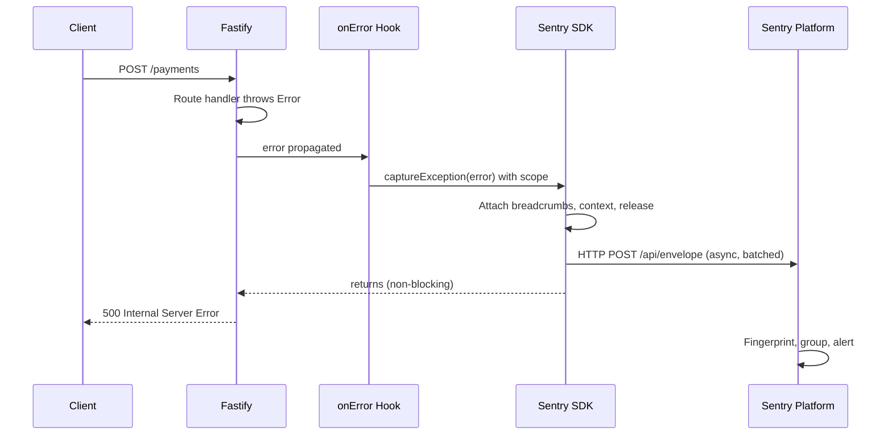

## Error Tracking with Sentry in Fastify

Sentry is an application monitoring platform specializing in error tracking, performance monitoring, and session replay. Integrated with Fastify, it captures unhandled exceptions, request context, breadcrumbs, and performance traces — providing actionable diagnostics rather than raw stack traces.

---

### What Sentry Provides

- **Error capturing** — Unhandled exceptions and rejected promises with full stack traces
- **Request context** — URL, method, headers, body, user identity attached to each error
- **Breadcrumbs** — Chronological log of events leading up to an error
- **Performance monitoring** — Transaction traces, spans, and throughput metrics
- **Release tracking** — Associate errors with specific deployments
- **Source maps** — Map minified/transpiled stack traces back to original source
- **Alerting** — Notify on new issues, regressions, or error rate thresholds

---

### Installation

```bash
npm install @sentry/node @sentry/profiling-node
```

For Fastify-specific integration:

```bash
npm install @sentry/node
```

---

### Initialization

Sentry must be initialized **before** Fastify and all other imports. It instruments Node.js internals at load time.

#### `instrument.js`

```js
'use strict'

const Sentry = require('@sentry/node')
const { nodeProfilingIntegration } = require('@sentry/profiling-node')

Sentry.init({
  dsn: process.env.SENTRY_DSN,

  environment: process.env.NODE_ENV || 'development',
  release: process.env.APP_RELEASE || 'unknown',

  // Trace sampling — 1.0 = 100% in development, lower in production
  tracesSampleRate: parseFloat(process.env.SENTRY_TRACES_SAMPLE_RATE || '0.1'),

  // Profiling sample rate (relative to tracesSampleRate)
  profilesSampleRate: 0.1,

  integrations: [
    nodeProfilingIntegration(),
  ],

  // Filter sensitive data before sending
  beforeSend(event, hint) {
    // Strip authorization headers
    if (event.request?.headers) {
      delete event.request.headers['authorization']
      delete event.request.headers['cookie']
    }
    return event
  },

  // Filter breadcrumbs
  beforeBreadcrumb(breadcrumb) {
    // Drop noisy internal health check breadcrumbs
    if (breadcrumb.data?.url?.includes('/health')) return null
    return breadcrumb
  },
})
```

#### `server.js`

```js
'use strict'

// Must be first
require('./instrument')

const Fastify = require('fastify')
const Sentry = require('@sentry/node')

const app = Fastify({ logger: true })

// ... register plugins, routes

app.listen({ port: 3000, host: '0.0.0.0' }, (err) => {
  if (err) {
    Sentry.captureException(err)
    app.log.error(err)
    process.exit(1)
  }
})
```

---

### Fastify Integration Plugin

Wrap Sentry's error handling and request context capture in a Fastify plugin for clean integration:

```js
'use strict'

const fp = require('fastify-plugin')
const Sentry = require('@sentry/node')

async function sentryPlugin(app, options) {

  // Attach request context to all Sentry events during the request lifecycle
  app.addHook('onRequest', async (request, reply) => {
    Sentry.getCurrentScope().setTag('request_id', request.id)
    Sentry.getCurrentScope().setExtra('route', request.routeOptions?.url)
  })

  // Capture errors from route handlers and hooks
  app.addHook('onError', async (request, reply, error) => {
    // Do not report expected client errors
    if (error.statusCode && error.statusCode < 500) return

    Sentry.withScope((scope) => {
      scope.setTag('method', request.method)
      scope.setTag('route', request.routeOptions?.url || request.url)
      scope.setTag('status_code', String(error.statusCode || 500))

      scope.setUser({
        id: request.user?.id,
        email: request.user?.email,
        ip_address: request.ip,
      })

      scope.setExtra('params', request.params)
      scope.setExtra('query', request.query)
      scope.setExtra('request_id', request.id)

      // Avoid logging raw bodies in production — may contain sensitive data
      if (process.env.NODE_ENV !== 'production') {
        scope.setExtra('body', request.body)
      }

      Sentry.captureException(error)
    })
  })
}

module.exports = fp(sentryPlugin, {
  name: 'sentry',
  fastify: '>=4.0.0',
})
```

#### Registration

```js
await app.register(require('./plugins/sentry'))
```

---

### Manual Error Capturing

Beyond the `onError` hook, capture errors explicitly in specific contexts:

```js
const Sentry = require('@sentry/node')

app.post('/payments', async (request, reply) => {
  const { amount, currency, token } = request.body

  try {
    const charge = await paymentGateway.charge({ amount, currency, token })
    return { chargeId: charge.id, status: 'success' }
  } catch (err) {
    // Capture with additional business context
    Sentry.withScope((scope) => {
      scope.setTag('payment.currency', currency)
      scope.setExtra('payment.amount', amount)
      scope.setLevel('error')
      Sentry.captureException(err)
    })

    // Re-throw so Fastify returns a proper error response
    throw app.httpErrors.internalServerError('Payment processing failed')
  }
})
```

---

### Capturing Messages and Custom Events

Not all notable events are exceptions. Use `captureMessage` for warnings and non-fatal anomalies:

```js
// Business logic anomaly — not an exception, but worth tracking
if (order.totalItems > 1000) {
  Sentry.captureMessage('Unusually large order detected', {
    level: 'warning',
    tags: { 'order.id': order.id },
    extra: { totalItems: order.totalItems, userId: request.user.id },
  })
}

// Capture structured data for later analysis
Sentry.addBreadcrumb({
  category: 'order',
  message: `Order ${order.id} transitioned to ${order.status}`,
  level: 'info',
  data: {
    orderId: order.id,
    previousStatus: order.previousStatus,
    newStatus: order.status,
  },
})
```

---

### User Context

Attaching user identity to Sentry events allows filtering issues by affected users and enabling "who is impacted" counts:

```js
// Set after authentication — typically in an onRequest or preHandler hook
app.addHook('preHandler', async (request, reply) => {
  if (request.user) {
    Sentry.setUser({
      id: String(request.user.id),
      email: request.user.email,
      username: request.user.username,
      // ip_address: request.ip  // only if legally permissible in your jurisdiction
    })
  }
})

// Clear user on response to avoid leaking between requests
app.addHook('onResponse', async (request, reply) => {
  Sentry.setUser(null)
})
```

---

### Performance Monitoring — Transactions and Spans

Sentry performance monitoring tracks request durations, database queries, and external calls as transactions with child spans:

```js
const Sentry = require('@sentry/node')

app.get('/reports/:id', async (request, reply) => {
  return Sentry.startSpan(
    {
      name: `GET /reports/:id`,
      op: 'http.server',
      attributes: { 'report.id': request.params.id },
    },
    async (span) => {
      // Child span: database fetch
      const report = await Sentry.startSpan(
        { name: 'db.query.fetchReport', op: 'db' },
        async () => {
          return db.query('SELECT * FROM reports WHERE id = $1', [request.params.id])
        }
      )

      // Child span: external enrichment
      const enriched = await Sentry.startSpan(
        { name: 'http.client.enrichReport', op: 'http.client' },
        async () => {
          return fetch(`https://enrichment-api.internal/enrich/${report.id}`)
            .then(r => r.json())
        }
      )

      return { ...report, enriched }
    }
  )
})
```

**Key Points:**
- Sentry's Node.js SDK auto-instruments `http`, `https`, `pg`, `mysql2`, `redis`, `mongoose`, and others when initialized before those modules. Manual spans are for business logic not covered by auto-instrumentation.
- `op` is a semantic category used by Sentry UI for grouping (e.g., `db`, `http.client`, `cache`).
- Performance data appears in Sentry under **Performance → Transactions**.

---

### Source Maps

Source maps allow Sentry to display original TypeScript or transpiled source instead of compiled output in stack traces.

#### Upload During Build (Recommended)

```bash
npm install --save-dev @sentry/cli
```

```bash
# In CI/CD pipeline after build
npx sentry-cli releases new $APP_RELEASE
npx sentry-cli releases files $APP_RELEASE upload-sourcemaps ./dist \
  --url-prefix '~/' \
  --rewrite
npx sentry-cli releases finalize $APP_RELEASE
npx sentry-cli releases deploys $APP_RELEASE new -e $NODE_ENV
```

#### Via Sentry Webpack Plugin

```js
// webpack.config.js
const { sentryWebpackPlugin } = require('@sentry/webpack-plugin')

module.exports = {
  devtool: 'source-map',
  plugins: [
    sentryWebpackPlugin({
      org: 'my-org',
      project: 'fastify-service',
      authToken: process.env.SENTRY_AUTH_TOKEN,
    }),
  ],
}
```

**Key Points:**
- Set `release` in `Sentry.init()` to the same value used during upload — Sentry matches stack frames to source maps by release identifier.
- Source map files should not be served publicly. Upload them to Sentry and exclude them from the deployment artifact.

---

### Release Tracking and Deployment Notification

```js
Sentry.init({
  dsn: process.env.SENTRY_DSN,
  release: `fastify-service@${process.env.npm_package_version}`,
  environment: process.env.NODE_ENV,
})
```

Notify Sentry of a deployment via CLI in CI/CD:

```bash
npx sentry-cli releases deploys fastify-service@1.4.2 new \
  --env production \
  --started $(date +%s) \
  --finished $(date +%s) \
  --name "deploy-$(git rev-parse --short HEAD)"
```

Sentry uses this to:
- Show which release introduced a regression
- Display suspect commits for each issue
- Automatically resolve issues not seen since a new release

---

### Filtering and Data Scrubbing

#### `beforeSend` — Drop or Modify Events

```js
Sentry.init({
  beforeSend(event, hint) {
    const error = hint.originalException

    // Drop connection reset errors — typically client-side network issues
    if (error?.code === 'ECONNRESET') return null

    // Drop 429 rate limit errors — expected behavior
    if (error?.statusCode === 429) return null

    // Scrub sensitive query params
    if (event.request?.query_string) {
      event.request.query_string = event.request.query_string
        .replace(/token=[^&]*/g, 'token=[FILTERED]')
        .replace(/password=[^&]*/g, 'password=[FILTERED]')
    }

    return event
  },
})
```

#### `ignoreErrors` — Pattern-Based Filtering

```js
Sentry.init({
  ignoreErrors: [
    'ResizeObserver loop limit exceeded',
    'Non-Error promise rejection captured',
    /^Request aborted$/,
    /NetworkError/,
  ],
})
```

#### Server-Side Data Scrubbing

Sentry's **Data Scrubber** in project settings automatically removes values for keys matching patterns like `password`, `secret`, `token`, `ssn`. This is the last line of defense — `beforeSend` scrubbing in code is preferable as it never transmits the data at all.

---

### Alerting Configuration

Sentry alerts are configured per project under **Alerts → Alert Rules**:

#### Issue Alert (new or regressing error)

```
Conditions:
  - A new issue is created
  - An issue changes state from resolved to unresolved (regression)

Filters:
  - Issue is assigned to Team: backend

Actions:
  - Send notification to Slack #alerts-backend
  - Create PagerDuty incident (severity: critical)
```

#### Metric Alert (error rate threshold)

```
Metric:    Number of errors
Condition: Count > 50 in 5 minutes
Environment: production
Threshold type: Above
Critical: 50 errors / 5 min  → PagerDuty
Warning:  20 errors / 5 min  → Slack
```

---

### Integration with Pino Logging

Correlate Pino log output with Sentry issues by adding Sentry breadcrumbs from Pino:

```js
const pino = require('pino')
const Sentry = require('@sentry/node')

const pinoSentryTransport = {
  write(msg) {
    const parsed = JSON.parse(msg)
    const level = parsed.level

    Sentry.addBreadcrumb({
      category: 'log',
      message: parsed.msg,
      level: level >= 50 ? 'error' : level >= 40 ? 'warning' : 'info',
      timestamp: parsed.time / 1000,
      data: {
        reqId: parsed.reqId,
        module: parsed.module,
      },
    })
  },
}

const app = Fastify({
  loggerInstance: pino(
    { level: 'info' },
    pino.multistream([
      { stream: process.stdout },
      { stream: pinoSentryTransport },
    ])
  ),
})
```

**Key Points:**
- This approach surfaces the last N log lines as breadcrumbs on each Sentry event, providing narrative context for errors.
- Keep breadcrumb payloads small — avoid logging full request bodies here.
- [Inference] `pino-sentry` npm packages exist as alternatives; verify maintenance status before adopting.

---

### Environment-Based Configuration

```js
const isProd = process.env.NODE_ENV === 'production'

Sentry.init({
  dsn: process.env.SENTRY_DSN,
  enabled: isProd || process.env.SENTRY_ENABLED === 'true',
  environment: process.env.NODE_ENV,
  release: process.env.APP_RELEASE,

  tracesSampleRate: isProd ? 0.05 : 1.0,
  profilesSampleRate: isProd ? 0.05 : 0.0,

  // In development, log to console instead of sending
  ...(!isProd && {
    transport: Sentry.createTransport(
      { recordDroppedEvent: () => {} },
      async (envelope) => {
        console.debug('[Sentry envelope]', JSON.stringify(envelope, null, 2))
      }
    ),
  }),
})
```

---

### Testing Sentry Integration

Verify the integration captures and transmits events correctly before relying on it in production:

```js
// Dedicated test route — protect with auth or remove before production
app.get('/_sentry_test', {
  schema: { hide: true },
}, async (request, reply) => {
  throw new Error('Sentry integration test error')
})
```

```bash
curl http://localhost:3000/_sentry_test
# Check Sentry dashboard for the captured event within ~30 seconds
```

Alternatively, use Sentry's SDK verification:

```js
Sentry.captureMessage('Sentry integration active', 'info')
```

---

### Diagram — Error Lifecycle



---

### Common Pitfalls

#### Capturing 4xx errors as issues
Client errors (400, 401, 404, 422) are expected behavior, not bugs. Tracking them inflates issue counts and obscures real errors. Filter by `statusCode < 500` in the `onError` hook.

#### Not calling `Sentry.flush()` in serverless
In AWS Lambda or short-lived processes, the SDK may not transmit events before the process exits. Call `await Sentry.flush(2000)` before the handler returns.

```js
exports.handler = async (event) => {
  try {
    return await handleRequest(event)
  } catch (err) {
    Sentry.captureException(err)
    await Sentry.flush(2000)
    throw err
  }
}
```

#### Missing `instrument.js` as first import
If Sentry is initialized after `http`, `pg`, or other modules, auto-instrumentation for those modules will not apply. [Behavior will vary — some integrations may still partially work.]

#### Leaking user context between requests
Sentry scopes are global by default in some SDK versions. Always use `Sentry.withScope()` for per-request context, or explicitly call `Sentry.setUser(null)` in `onResponse`.

#### High `tracesSampleRate` in production
At 100% sampling on high-traffic services, Sentry performance data volume can become expensive. Start at 5–10% and adjust based on quota and visibility needs.

---

### Production Checklist

- [ ] `instrument.js` required before all other modules
- [ ] `SENTRY_DSN` set via environment variable, not hardcoded
- [ ] `release` identifier set and matches source map upload
- [ ] `environment` set (`production`, `staging`, `development`)
- [ ] `beforeSend` scrubs sensitive headers, query params, and body fields
- [ ] 4xx errors excluded from `onError` capture
- [ ] `tracesSampleRate` tuned for production traffic volume
- [ ] Source maps uploaded in CI/CD pipeline
- [ ] `Sentry.setUser(null)` called in `onResponse` hook
- [ ] Alert rules configured for new issues and error rate thresholds
- [ ] `Sentry.flush()` called in serverless or short-lived process contexts

---

**Related Topics:**

- Sentry performance monitoring and transaction sampling strategies
- Source map generation with esbuild, tsc, and Webpack for Node.js
- Sentry `beforeSend` and PII scrubbing for GDPR compliance
- Integrating Sentry with Grafana for unified dashboards
- Sentry Crons for scheduled job monitoring
- Custom Sentry integrations and SDK extensions
- Error budgets and SLO alerting with Sentry metric alerts
- Comparing Sentry with self-hosted alternatives (GlitchTip, Highlight.io)