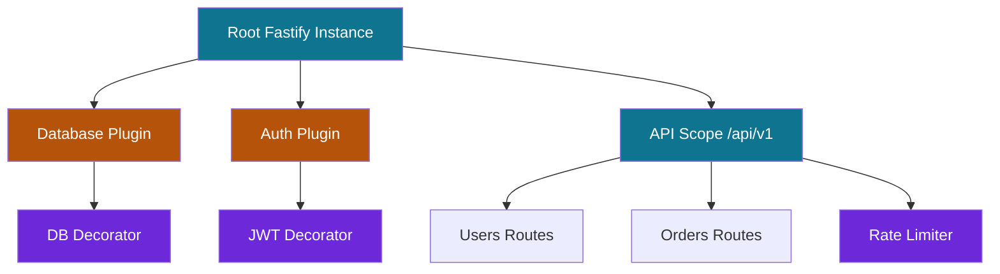

## Plugin Composition and Layering in Fastify

Plugin composition is Fastify's foundational architectural pattern. Every capability in a Fastify application — routes, decorators, hooks, middleware, database connections — is registered through plugins. Understanding how plugins compose, scope, and layer determines how well an application scales in complexity, testability, and team ownership.

---

### The Plugin System Model

Fastify's plugin system is built on **Avvio**, an asynchronous plugin loader that manages dependency order and initialization lifecycle. Every Fastify instance is itself a plugin host. Plugins form a directed acyclic graph (DAG) of encapsulated scopes.



---

### Plugin Fundamentals

A Fastify plugin is a function with the signature `(instance, options, done)` or its async equivalent `async (instance, options)`:

```js
// Callback style
function myPlugin(fastify, options, done) {
  fastify.decorate('myUtil', () => 'hello')
  done()
}

// Async style
async function myPlugin(fastify, options) {
  fastify.decorate('myUtil', () => 'hello')
}

// Registration
fastify.register(myPlugin, { option1: 'value' })
```

The `instance` parameter is a **child scope** — a new Fastify context descended from the registering instance. Modifications to `instance` do not leak upward to the parent or sideways to sibling scopes unless explicitly declared with `fastify-plugin`.

---

### Encapsulation: The Core Mechanic

Encapsulation is Fastify's default behavior. Each `register` call creates a new child context that inherits from its parent but isolates its own additions.

```js
const Fastify = require('fastify')
const app = Fastify()

app.decorate('shared', 'I am visible everywhere')

app.register(async function scopeA(instance) {
  instance.decorate('localA', 'only in scope A')

  instance.get('/a', async () => ({
    shared: instance.shared,   // ✓ inherited from parent
    localA: instance.localA,   // ✓ exists here
  }))
})

app.register(async function scopeB(instance) {
  instance.get('/b', async () => ({
    shared: instance.shared,   // ✓ inherited from parent
    // instance.localA         // ✗ does not exist — different scope
  }))
})
```

**Key Points:**
- Decorators, hooks, and route prefixes defined inside a `register` callback are scoped to that child instance and its descendants.
- Hooks defined in a child scope apply only to routes within that scope.
- This is the mechanism that enables per-scope authentication, rate limiting, and error handling without global configuration.

---

### `fastify-plugin`: Breaking Encapsulation Intentionally

`fastify-plugin` (abbreviated `fp`) wraps a plugin to signal that its registrations should be applied to the **parent scope** rather than a new child scope. Use it for shared infrastructure — database connections, decorators, utility functions — that all routes need.

```js
const fp = require('fastify-plugin')

async function dbPlugin(fastify, options) {
  const client = await createDbClient(options.connectionString)

  fastify.decorate('db', client)

  fastify.addHook('onClose', async (instance) => {
    await instance.db.close()
  })
}

// Without fp: db decorator is scoped to a child instance, invisible to siblings
// With fp:    db decorator is applied to the registering parent — visible everywhere
module.exports = fp(dbPlugin, {
  name: 'db',
  fastify: '>=4.0.0',
  dependencies: [],
})
```

```js
// In app.js
await app.register(require('./plugins/db'), {
  connectionString: process.env.DATABASE_URL,
})

// All routes registered after this point can access app.db
app.get('/users', async (request) => {
  return request.server.db.query('SELECT * FROM users')
})
```

**Key Points:**
- `fp` is for **shared infrastructure**. Route plugins, scope-specific auth, and feature modules should not use `fp` — they benefit from encapsulation.
- The `name` and `dependencies` metadata in `fp` enables Fastify to detect missing dependencies and emit descriptive errors at startup.
- [Inference] A common mistake is wrapping everything in `fp` to avoid scoping issues, which defeats the encapsulation model and makes the application harder to reason about.

---

### Decorator Pattern

Decorators extend the Fastify instance, request, or reply objects with custom properties:

```js
// Instance decorator — shared utility or connection
fastify.decorate('config', {
  jwtSecret: process.env.JWT_SECRET,
  dbUrl: process.env.DATABASE_URL,
})

// Request decorator — per-request state
fastify.decorateRequest('user', null)

// Reply decorator — response helper
fastify.decorateReply('sendSuccess', function (data) {
  return this.code(200).send({ success: true, data })
})
```

#### Decorator Initialization Pattern

For object decorators, always initialize with `null` (not the object itself) and assign in a hook. This is required by Fastify's internal property allocation optimization:

```js
// ✓ Correct
fastify.decorateRequest('user', null)
fastify.addHook('preHandler', async (request) => {
  request.user = await resolveUser(request)
})

// ✗ Incorrect — will throw if the object has properties
fastify.decorateRequest('user', { id: null, role: null })
```

---

### Layered Plugin Architecture

A well-structured Fastify application layers plugins in order of dependency:

```
app.js
│
├── Layer 1: Infrastructure (fp-wrapped, shared globally)
│     config, logger, database, cache, event bus
│
├── Layer 2: Cross-Cutting Concerns (fp-wrapped or scoped)
│     auth, rate limiting, request validation, telemetry
│
├── Layer 3: Feature Scopes (encapsulated, prefixed)
│     /api/v1/users, /api/v1/orders, /api/v1/payments
│
└── Layer 4: Utilities (encapsulated, no prefix)
      health check, metrics, documentation
```

#### `app.js` — Orchestration Entry Point

```js
'use strict'

const Fastify = require('fastify')

async function buildApp(options = {}) {
  const app = Fastify({
    logger: options.logger ?? { level: 'info' },
    ajv: { customOptions: { allErrors: true } },
  })

  // ── Layer 1: Infrastructure ──────────────────────────────
  await app.register(require('./plugins/config'))
  await app.register(require('./plugins/db'))
  await app.register(require('./plugins/redis'))

  // ── Layer 2: Cross-Cutting Concerns ──────────────────────
  await app.register(require('./plugins/auth'))
  await app.register(require('@fastify/rate-limit'), {
    max: 100,
    timeWindow: '1 minute',
  })
  await app.register(require('./plugins/telemetry'))

  // ── Layer 3: Feature Scopes ───────────────────────────────
  await app.register(require('./routes/users'), { prefix: '/api/v1/users' })
  await app.register(require('./routes/orders'), { prefix: '/api/v1/orders' })
  await app.register(require('./routes/payments'), { prefix: '/api/v1/payments' })

  // ── Layer 4: Utilities ────────────────────────────────────
  await app.register(require('./routes/health'))
  await app.register(require('@fastify/swagger'), { ... })

  return app
}

module.exports = buildApp
```

**Key Points:**
- `buildApp` is a factory function — it returns the configured instance without calling `.listen()`. This makes the application directly testable via `app.inject()` without binding a port.
- `await` on each `register` call is optional (Avvio queues registrations) but aids readability and makes async initialization errors surface predictably.

---

### Infrastructure Plugin Example

```js
// plugins/db.js
'use strict'

const fp = require('fastify-plugin')
const { Pool } = require('pg')

async function dbPlugin(fastify, options) {
  const pool = new Pool({
    connectionString: fastify.config.DATABASE_URL,
    max: options.poolSize ?? 10,
    idleTimeoutMillis: 30_000,
    connectionTimeoutMillis: 2_000,
  })

  // Verify connectivity at startup
  const client = await pool.connect()
  client.release()

  fastify.decorate('db', {
    query: (text, params) => pool.query(text, params),
    transaction: async (fn) => {
      const client = await pool.connect()
      try {
        await client.query('BEGIN')
        const result = await fn(client)
        await client.query('COMMIT')
        return result
      } catch (err) {
        await client.query('ROLLBACK')
        throw err
      } finally {
        client.release()
      }
    },
  })

  fastify.addHook('onClose', async () => {
    await pool.end()
  })
}

module.exports = fp(dbPlugin, {
  name: 'db',
  fastify: '>=4.0.0',
  dependencies: ['config'],  // config plugin must be registered first
})
```

---

### Feature Scope Plugin Example

Feature plugins are encapsulated (no `fp`) and own their routes, hooks, and schemas:

```js
// routes/orders/index.js
'use strict'

const orderSchemas = require('./schemas')
const orderHandlers = require('./handlers')

async function ordersPlugin(fastify, options) {
  // Register schemas local to this scope
  fastify.addSchema(orderSchemas.createOrder)
  fastify.addSchema(orderSchemas.orderResponse)

  // Scope-specific hook — applies only to routes in this plugin
  fastify.addHook('preHandler', fastify.authenticate)

  // Routes
  fastify.get('/', {
    schema: {
      querystring: orderSchemas.listOrdersQuery,
      response: { 200: orderSchemas.orderListResponse },
    },
    handler: orderHandlers.listOrders,
  })

  fastify.post('/', {
    schema: {
      body: { $ref: 'createOrder#' },
      response: { 201: { $ref: 'orderResponse#' } },
    },
    handler: orderHandlers.createOrder,
  })

  fastify.get('/:orderId', {
    schema: {
      params: orderSchemas.orderParams,
      response: { 200: { $ref: 'orderResponse#' } },
    },
    handler: orderHandlers.getOrder,
  })
}

module.exports = ordersPlugin
```

---

### Nested Scopes and Sub-Plugins

Scopes compose recursively. A feature plugin can register its own child scopes for admin vs. public access:

```js
// routes/users/index.js
async function usersPlugin(fastify, options) {

  // Public routes — no auth
  fastify.register(async function publicRoutes(instance) {
    instance.post('/register', { schema: ... }, handlers.register)
    instance.post('/login', { schema: ... }, handlers.login)
  })

  // Authenticated routes — scoped preHandler hook
  fastify.register(async function protectedRoutes(instance) {
    instance.addHook('preHandler', instance.authenticate)

    instance.get('/me', { schema: ... }, handlers.getProfile)
    instance.patch('/me', { schema: ... }, handlers.updateProfile)
    instance.delete('/me', { schema: ... }, handlers.deleteAccount)
  })

  // Admin routes — separate auth check
  fastify.register(async function adminRoutes(instance) {
    instance.addHook('preHandler', instance.requireRole('admin'))

    instance.get('/', { schema: ... }, handlers.listAllUsers)
    instance.delete('/:userId', { schema: ... }, handlers.deleteUser)
  }, { prefix: '/admin' })
}
```

The resulting route tree for `{ prefix: '/api/v1/users' }`:

```
POST   /api/v1/users/register        — no auth
POST   /api/v1/users/login           — no auth
GET    /api/v1/users/me              — authenticate hook
PATCH  /api/v1/users/me              — authenticate hook
DELETE /api/v1/users/me              — authenticate hook
GET    /api/v1/users/admin/          — requireRole('admin') hook
DELETE /api/v1/users/admin/:userId   — requireRole('admin') hook
```

---

### Hook Scoping in Composed Plugins

Hooks respect encapsulation boundaries:

```js
// Root-level hook — applies to ALL routes
app.addHook('onRequest', async (request) => {
  request.startTime = Date.now()
})

app.register(async function apiScope(instance) {
  // Applies only to routes within apiScope and its children
  instance.addHook('preHandler', async (request) => {
    await instance.authenticate(request)
  })

  instance.register(async function adminScope(instance) {
    // Applies only to routes within adminScope
    instance.addHook('preHandler', async (request) => {
      if (request.user.role !== 'admin') throw instance.httpErrors.forbidden()
    })

    instance.get('/admin/dashboard', handlers.adminDashboard)
    // Effective hooks for this route:
    // 1. Root onRequest (timing)
    // 2. apiScope preHandler (authenticate)
    // 3. adminScope preHandler (role check)
    // All three execute in registration order
  })
})
```

**Key Points:**
- Hooks stack — a route in a deeply nested scope executes all ancestor scope hooks in order, then its own scope hooks.
- This eliminates the need for per-route `preHandler` arrays in most cases — define the hook once at the right scope level.
- [Inference] Hook stacking is one of Fastify's most powerful compositional features and is frequently underutilized in favor of repetitive per-route authentication checks.

---

### Plugin Dependencies and Load Order

Avvio loads plugins in registration order. When a plugin depends on a decorator set by another plugin, registration order is the dependency contract:

```js
// config must be registered before db, because db reads fastify.config
await app.register(require('./plugins/config'))   // sets fastify.config
await app.register(require('./plugins/db'))        // reads fastify.config
await app.register(require('./plugins/auth'))      // reads fastify.config + fastify.db
```

Declare dependencies explicitly in `fp` metadata for early error detection:

```js
module.exports = fp(authPlugin, {
  name: 'auth',
  dependencies: ['config', 'db'],  // Fastify throws if these are not registered first
})
```

```
Error: The dependency 'db' of plugin 'auth' is not registered.
```

This error surfaces at startup, not at runtime during a request.

---

### Plugin Options and Configuration Injection

Pass configuration into plugins via the options parameter:

```js
// Plugin definition
async function rateLimitPlugin(fastify, options) {
  const { max = 100, timeWindow = '1 minute', skip } = options

  await fastify.register(require('@fastify/rate-limit'), {
    max,
    timeWindow,
    skipOnError: true,
    keyGenerator: (request) => request.user?.id ?? request.ip,
    skip: skip ?? (() => false),
  })
}

module.exports = fp(rateLimitPlugin, { name: 'rate-limit' })

// Registration with options
await app.register(require('./plugins/rate-limit'), {
  max: 1000,
  timeWindow: '1 hour',
  skip: (request) => request.routeOptions.url === '/health',
})
```

---

### Shared Schema Composition

Schemas can be registered at the appropriate scope level and referenced via `$ref` within that scope and its descendants:

```js
// plugins/schemas.js — fp-wrapped, shared globally
const fp = require('fastify-plugin')

async function schemasPlugin(fastify) {
  fastify.addSchema({
    $id: 'pagination',
    type: 'object',
    properties: {
      page: { type: 'integer', minimum: 1, default: 1 },
      limit: { type: 'integer', minimum: 1, maximum: 100, default: 20 },
    },
  })

  fastify.addSchema({
    $id: 'errorResponse',
    type: 'object',
    properties: {
      statusCode: { type: 'integer' },
      error: { type: 'string' },
      message: { type: 'string' },
    },
  })
}

module.exports = fp(schemasPlugin, { name: 'schemas' })

// Usage in any route plugin
fastify.get('/users', {
  schema: {
    querystring: { $ref: 'pagination#' },
    response: {
      400: { $ref: 'errorResponse#' },
      500: { $ref: 'errorResponse#' },
    },
  },
  handler: handlers.listUsers,
})
```

---

### Plugin File Structure

A scalable directory layout for a medium-to-large Fastify application:

```
src/
├── app.js                    # buildApp factory
├── server.js                 # calls buildApp, binds port
│
├── plugins/                  # fp-wrapped shared infrastructure
│     ├── config.js           # env var loading, validation
│     ├── db.js               # database pool
│     ├── redis.js            # cache client
│     ├── auth.js             # JWT / session decorator
│     ├── schemas.js          # shared JSON schemas
│     └── telemetry.js        # OTel / Sentry init
│
├── routes/                   # encapsulated feature scopes
│     ├── health/
│     │     └── index.js
│     ├── users/
│     │     ├── index.js      # plugin registration, hooks
│     │     ├── schemas.js    # feature-local schemas
│     │     └── handlers.js   # route handler functions
│     ├── orders/
│     │     ├── index.js
│     │     ├── schemas.js
│     │     └── handlers.js
│     └── payments/
│           ├── index.js
│           ├── schemas.js
│           └── handlers.js
│
└── lib/                      # pure functions, no Fastify dependency
      ├── validators.js
      ├── formatters.js
      └── errors.js
```

**Key Points:**
- `plugins/` holds `fp`-wrapped shared infrastructure — things every part of the app needs.
- `routes/` holds encapsulated feature modules — things owned by a specific domain.
- `lib/` holds pure utility functions with no Fastify coupling — maximally testable.
- `server.js` is the only file that calls `.listen()` — `app.js` only builds and returns the instance.

---

### Autoload with `@fastify/autoload`

For large applications, `@fastify/autoload` eliminates repetitive `register` calls by loading entire directories:

```bash
npm install @fastify/autoload
```

```js
const autoload = require('@fastify/autoload')
const path = require('path')

async function buildApp() {
  const app = Fastify({ logger: true })

  // Load all plugins in order
  await app.register(autoload, {
    dir: path.join(__dirname, 'plugins'),
    options: { prefix: false },
  })

  // Load all routes with directory structure as prefix
  await app.register(autoload, {
    dir: path.join(__dirname, 'routes'),
    routeParams: true,
    options: { prefix: '/api/v1' },
  })

  return app
}
```

With autoload, directory structure maps to route prefixes:

```
routes/
  users/
    index.js       → /api/v1/users
    _userId/       → /api/v1/users/:userId   (underscore = param)
      index.js
      orders.js    → /api/v1/users/:userId/orders
```

**Key Points:**
- Autoload uses filename conventions to determine prefix and param segments. Review its documentation carefully — behavior may vary across versions.
- [Inference] Autoload is most valuable when the directory structure naturally mirrors the route hierarchy. When routes do not map to directories cleanly, explicit `register` calls in `app.js` are more legible.

---

### Testing Composed Plugins in Isolation

Encapsulation makes individual plugins independently testable:

```js
// test/routes/orders.test.js
const { test } = require('node:test')
const assert = require('node:assert')
const Fastify = require('fastify')
const fp = require('fastify-plugin')

// Build a minimal test harness — mock dependencies
async function buildTestApp() {
  const app = Fastify({ logger: false })

  // Mock the db decorator that ordersPlugin depends on
  app.register(fp(async (instance) => {
    instance.decorate('db', {
      query: async () => ({ rows: [{ id: 1, status: 'pending' }] }),
      transaction: async (fn) => fn({ query: async () => ({}) }),
    })
  }))

  // Mock auth decorator
  app.register(fp(async (instance) => {
    instance.decorate('authenticate', async (request) => {
      request.user = { id: 42, role: 'user' }
    })
  }))

  // Register only the plugin under test
  app.register(require('../../routes/orders'), { prefix: '/orders' })

  return app
}

test('GET /orders returns order list', async () => {
  const app = await buildTestApp()
  await app.ready()

  const response = await app.inject({
    method: 'GET',
    url: '/orders',
    headers: { authorization: 'Bearer test-token' },
  })

  assert.equal(response.statusCode, 200)
  const body = response.json()
  assert.ok(Array.isArray(body.data))
})
```

**Key Points:**
- `app.inject()` performs a full in-process HTTP request without a network socket — the complete Fastify lifecycle (hooks, validation, serialization) executes.
- Mock only the infrastructure decorators the plugin depends on — test the plugin's own logic, not its dependencies.
- This pattern scales to testing individual route handlers, entire scopes, or the full application.

---

### Common Composition Mistakes

#### Registering infrastructure without `fp`

```js
// ✗ db decorator is scoped to a child — routes registered afterward cannot see it
app.register(async function (instance) {
  instance.decorate('db', pool)
})

app.get('/users', async (request) => {
  request.server.db.query(...)  // TypeError: db is not a function
})

// ✓ Use fp to apply the decorator to the parent scope
app.register(fp(async (instance) => {
  instance.decorate('db', pool)
}))
```

#### Decorating inside a route handler

```js
// ✗ Decorators must be applied at plugin registration time, not in handlers
app.get('/setup', async (request) => {
  request.server.decorate('lateDecoration', 'too late')  // throws
})
```

#### Mutating shared state via decorators

```js
// ✗ Decorating with a mutable object shared across all requests
fastify.decorateRequest('cart', [])  // Same array reference for every request

// ✓ Use null and assign fresh state per request in a hook
fastify.decorateRequest('cart', null)
fastify.addHook('onRequest', async (request) => {
  request.cart = []
})
```

#### Circular plugin dependencies
If plugin A depends on B and B depends on A, Avvio will deadlock at startup. Resolve by extracting the shared concern into a third plugin C that both A and B depend on.

---

**Related Topics:**

- `@fastify/autoload` configuration and directory conventions
- Fastify lifecycle hooks — full sequence and scoping rules
- Schema composition and `$ref` resolution across scopes
- Decorators — performance implications and property allocation
- Building reusable npm packages as Fastify plugins
- Dependency injection patterns in Fastify
- Testing strategies — unit, integration, and full-app with `app.inject()`
- Plugin versioning and compatibility metadata with `fastify-plugin`