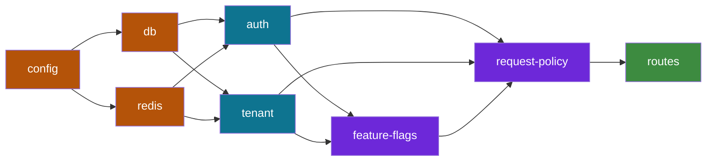

## Context-Aware Plugins in Fastify

Context-aware plugins adapt their behavior based on runtime conditions — the request being processed, the environment they run in, the tenant making the call, or the state of the application at a given moment. They go beyond static configuration, reading and reacting to context at each layer of the request lifecycle.

---

### What Makes a Plugin Context-Aware

A standard plugin applies uniform behavior to all requests. A context-aware plugin varies its behavior based on one or more context dimensions:

| Context Dimension | Examples |
|---|---|
| **Request identity** | Authenticated user, role, permissions |
| **Tenant / organization** | Multi-tenant SaaS, per-tenant config or DB |
| **Route metadata** | Custom route options, tags, feature flags |
| **Environment** | Production vs. staging vs. development |
| **Runtime state** | Feature flags, circuit breaker status, A/B assignments |
| **Request headers** | Accept-Language, X-API-Version, X-Tenant-ID |

---

### Foundational Mechanism: `request` and `reply` Decorators

The request lifecycle is the primary vehicle for carrying context. Decorators reserve slots on the request object; hooks populate them:

```js
'use strict'

const fp = require('fastify-plugin')

async function contextPlugin(fastify, options) {
  // Reserve slots — always initialize decorators with null
  fastify.decorateRequest('context', null)

  fastify.addHook('onRequest', async (request, reply) => {
    request.context = {
      requestId:  request.id,
      startTime:  Date.now(),
      tenantId:   request.headers['x-tenant-id'] ?? null,
      apiVersion: request.headers['x-api-version'] ?? 'v1',
      locale:     request.headers['accept-language']?.split(',')[0] ?? 'en',
    }
  })
}

module.exports = fp(contextPlugin, { name: 'context' })
```

Downstream plugins, hooks, and handlers read from `request.context` without re-deriving values:

```js
app.get('/products', async (request, reply) => {
  const { tenantId, locale } = request.context
  return productService.list({ tenantId, locale })
})
```

---

### Route-Level Context with `routeOptions`

Fastify exposes route configuration metadata through `request.routeOptions`. This allows plugins to read per-route declarations and adapt behavior without modifying handler code.

#### Declaring Route Metadata

```js
// Attach arbitrary config to a route via the config property
fastify.get('/admin/users', {
  config: {
    requireRole: 'admin',
    rateLimit: { max: 10, timeWindow: '1m' },
    audit: true,
    cache: false,
  },
  schema: { ... },
  handler: handlers.listUsers,
})

fastify.get('/products', {
  config: {
    requireRole: null,       // public
    cache: true,
    cacheTtl: 60,
    audit: false,
  },
  handler: handlers.listProducts,
})
```

#### Reading Route Config in a Plugin

```js
const fp = require('fastify-plugin')

async function authPlugin(fastify, options) {
  fastify.decorateRequest('user', null)

  fastify.addHook('preHandler', async (request, reply) => {
    const { requireRole } = request.routeOptions.config ?? {}

    // Route opts out of auth entirely
    if (requireRole === null) return

    // All other routes require authentication
    const user = await verifyToken(request.headers.authorization)
    if (!user) throw fastify.httpErrors.unauthorized('Invalid token')

    request.user = user

    // Role check if route specifies one
    if (requireRole && user.role !== requireRole) {
      throw fastify.httpErrors.forbidden(
        `Role '${requireRole}' required, got '${user.role}'`
      )
    }
  })
}

module.exports = fp(authPlugin, { name: 'auth' })
```

**Key Points:**
- `request.routeOptions.config` is the intended extension point for route-level metadata. It is separate from JSON schema and does not affect validation or serialization.
- This pattern eliminates the need for per-route `preHandler` arrays or conditional logic inside handlers.
- [Inference] Reading `config` in a hook is more maintainable than wrapping handlers with higher-order functions, because the hook logic is centralized and the route declaration remains declarative.

---

### Multi-Tenant Context

Multi-tenant applications resolve tenant identity early, then use it to load per-tenant configuration, select the correct database schema, or apply tenant-specific business rules.

#### Tenant Resolution Plugin

```js
'use strict'

const fp = require('fastify-plugin')

async function tenantPlugin(fastify, options) {
  fastify.decorateRequest('tenant', null)

  fastify.addHook('onRequest', async (request, reply) => {
    // Resolve tenant from header, subdomain, or JWT claim
    const tenantId = resolveTenantId(request)

    if (!tenantId) {
      throw fastify.httpErrors.badRequest('Tenant identifier missing')
    }

    // Load from cache or DB
    const tenant = await fastify.tenantCache.get(tenantId)
      ?? await fastify.db.query(
          'SELECT * FROM tenants WHERE id = $1 AND active = true',
          [tenantId]
        ).then(r => r.rows[0])

    if (!tenant) throw fastify.httpErrors.notFound('Tenant not found')

    // Cache for next request
    await fastify.tenantCache.set(tenantId, tenant, { ttl: 300 })

    request.tenant = tenant
  })
}

function resolveTenantId(request) {
  // Strategy 1: explicit header
  if (request.headers['x-tenant-id']) return request.headers['x-tenant-id']

  // Strategy 2: subdomain (e.g., acme.api.myapp.com)
  const host = request.headers.host ?? ''
  const subdomain = host.split('.')[0]
  if (subdomain && subdomain !== 'api') return subdomain

  // Strategy 3: JWT claim (if already parsed)
  return request.user?.tenantId ?? null
}

module.exports = fp(tenantPlugin, {
  name: 'tenant',
  dependencies: ['auth', 'cache', 'db'],
})
```

#### Per-Tenant Database Routing

```js
const fp = require('fastify-plugin')

async function tenantDbPlugin(fastify, options) {
  const pools = new Map()

  fastify.decorate('getTenantDb', async (tenantId) => {
    if (pools.has(tenantId)) return pools.get(tenantId)

    const tenant = await fastify.db.query(
      'SELECT db_connection_string FROM tenants WHERE id = $1',
      [tenantId]
    ).then(r => r.rows[0])

    const pool = new Pool({ connectionString: tenant.db_connection_string })
    pools.set(tenantId, pool)
    return pool
  })

  fastify.addHook('onClose', async () => {
    for (const pool of pools.values()) await pool.end()
  })

  // Convenience: attach tenant-specific db to each request
  fastify.decorateRequest('tenantDb', null)

  fastify.addHook('preHandler', async (request) => {
    if (!request.tenant) return
    request.tenantDb = await fastify.getTenantDb(request.tenant.id)
  })
}

module.exports = fp(tenantDbPlugin, {
  name: 'tenant-db',
  dependencies: ['tenant'],
})
```

---

### Feature Flag Context

Feature flags allow behavior to change per request based on user, tenant, environment, or percentage rollout — without redeployment.

```js
'use strict'

const fp = require('fastify-plugin')

async function featureFlagsPlugin(fastify, options) {
  const { provider } = options  // e.g., LaunchDarkly, Unleash, or a DB-backed store

  fastify.decorateRequest('flags', null)

  fastify.addHook('preHandler', async (request, reply) => {
    const context = {
      userId:   request.user?.id,
      tenantId: request.tenant?.id,
      env:      process.env.NODE_ENV,
      ip:       request.ip,
    }

    // Evaluate all relevant flags for this request context
    request.flags = {
      newCheckoutFlow:   await provider.isEnabled('new-checkout-flow', context),
      betaPricingEngine: await provider.isEnabled('beta-pricing-engine', context),
      enhancedLogging:   await provider.isEnabled('enhanced-logging', context),
    }
  })
}

module.exports = fp(featureFlagsPlugin, {
  name: 'feature-flags',
  dependencies: ['auth', 'tenant'],
})
```

```js
// In a handler
app.post('/checkout', async (request, reply) => {
  if (request.flags.newCheckoutFlow) {
    return newCheckoutService.process(request.body)
  }
  return legacyCheckoutService.process(request.body)
})
```

**Key Points:**
- [Inference] Evaluate all flags in a single `preHandler` hook rather than calling the provider inside individual handlers — this centralizes flag resolution, avoids repeated async calls per handler, and makes flag usage auditable.
- Flag evaluation should be fast (cached). If the provider call is slow, use `onRequest` with a stale-while-revalidate pattern.
- Flag context should include enough dimensions to support targeting rules without coupling handlers to the flag provider SDK.

---

### Context-Aware Caching Plugin

A caching plugin that varies cache keys and TTLs based on route config, user identity, and tenant:

```js
'use strict'

const fp = require('fastify-plugin')

async function cachePlugin(fastify, options) {
  fastify.decorateReply('_cacheHit', false)

  fastify.addHook('onRequest', async (request, reply) => {
    const { cache: enabled, cacheTtl, cacheScope } = request.routeOptions.config ?? {}

    // Route opts out of caching
    if (!enabled) return

    // Never cache authenticated user-specific responses unless explicitly scoped
    const scope = cacheScope ?? (request.user ? 'private' : 'public')

    const cacheKey = buildCacheKey(request, scope)
    const cached = await fastify.redis.get(cacheKey)

    if (cached) {
      reply._cacheHit = true

      // Short-circuit — send cached response and skip handler
      reply
        .header('X-Cache', 'HIT')
        .header('X-Cache-Key', cacheKey)
        .type('application/json')
        .send(JSON.parse(cached))
    }
  })

  fastify.addHook('onSend', async (request, reply, payload) => {
    const { cache: enabled, cacheTtl = 60, cacheScope } = request.routeOptions.config ?? {}

    if (!enabled || reply._cacheHit || reply.statusCode !== 200) return payload

    const scope = cacheScope ?? (request.user ? 'private' : 'public')
    const cacheKey = buildCacheKey(request, scope)

    await fastify.redis.set(cacheKey, payload, { EX: cacheTtl })
    reply.header('X-Cache', 'MISS')

    return payload
  })
}

function buildCacheKey(request, scope) {
  const base = `cache:${request.routeOptions.url}:${request.url}`
  if (scope === 'private' && request.user) {
    return `${base}:user:${request.user.id}`
  }
  if (request.tenant) {
    return `${base}:tenant:${request.tenant.id}`
  }
  return base
}

module.exports = fp(cachePlugin, {
  name: 'cache',
  dependencies: ['redis'],
})
```

#### Route Usage

```js
fastify.get('/products', {
  config: {
    cache: true,
    cacheTtl: 300,
    cacheScope: 'public',
  },
  handler: handlers.listProducts,
})

fastify.get('/me/orders', {
  config: {
    cache: true,
    cacheTtl: 30,
    cacheScope: 'private',  // keyed per user
  },
  handler: handlers.myOrders,
})

fastify.post('/orders', {
  config: { cache: false },  // mutations never cached
  handler: handlers.createOrder,
})
```

---

### Context-Aware Rate Limiting

Rate limits that vary by user role, tenant plan, or route classification:

```js
'use strict'

const fp = require('fastify-plugin')

async function adaptiveRateLimitPlugin(fastify, options) {

  await fastify.register(require('@fastify/rate-limit'), {
    global: false,  // disable global default — configure per-route or per-hook
    keyGenerator: (request) => {
      // Rate limit key: per-user if authenticated, per-IP otherwise
      return request.user
        ? `rl:user:${request.user.id}`
        : `rl:ip:${request.ip}`
    },
    max: async (request, key) => {
      // Dynamic limit based on context
      if (request.user?.role === 'admin')          return 10_000
      if (request.tenant?.plan === 'enterprise')   return 5_000
      if (request.tenant?.plan === 'pro')          return 1_000
      if (request.user)                            return 200
      return 50  // unauthenticated
    },
    timeWindow: '1 minute',
    errorResponseBuilder: (request, context) => ({
      statusCode: 429,
      error: 'Too Many Requests',
      message: `Rate limit exceeded. Retry after ${context.after}.`,
      retryAfter: context.after,
    }),
  })
}

module.exports = fp(adaptiveRateLimitPlugin, {
  name: 'rate-limit',
  dependencies: ['auth', 'tenant'],
})
```

---

### Context-Aware Audit Logging

An audit plugin that logs only routes declaring `audit: true`, enriched with full request context:

```js
'use strict'

const fp = require('fastify-plugin')

async function auditPlugin(fastify, options) {
  const { auditStore } = options  // e.g., a DB table or audit log service

  fastify.addHook('onResponse', async (request, reply) => {
    const { audit } = request.routeOptions.config ?? {}
    if (!audit) return

    const entry = {
      timestamp:    new Date().toISOString(),
      requestId:    request.id,
      method:       request.method,
      route:        request.routeOptions.url,
      url:          request.url,
      statusCode:   reply.statusCode,
      durationMs:   Date.now() - (request.context?.startTime ?? Date.now()),
      userId:       request.user?.id ?? null,
      tenantId:     request.tenant?.id ?? null,
      ip:           request.ip,
      userAgent:    request.headers['user-agent'] ?? null,
      // Selectively include params — avoid logging sensitive body fields
      params:       request.params,
      query:        request.query,
    }

    // Fire-and-forget — do not await to avoid delaying the response
    auditStore.insert(entry).catch(err => {
      fastify.log.error({ err, entry }, 'Failed to write audit log entry')
    })
  })
}

module.exports = fp(auditPlugin, { name: 'audit' })
```

```js
// Route declares audit requirement
fastify.delete('/users/:userId', {
  config: { audit: true, requireRole: 'admin' },
  handler: handlers.deleteUser,
})
```

---

### Environment-Aware Plugin Behavior

A plugin that adjusts behavior based on the runtime environment:

```js
'use strict'

const fp = require('fastify-plugin')

async function errorHandlerPlugin(fastify, options) {
  const isProd = process.env.NODE_ENV === 'production'

  fastify.setErrorHandler(async (error, request, reply) => {
    const statusCode = error.statusCode ?? 500
    const isServerError = statusCode >= 500

    // Always log server errors
    if (isServerError) {
      request.log.error({
        err: error,
        requestId: request.id,
        route: request.routeOptions?.url,
        userId: request.user?.id,
      }, 'Unhandled server error')
    }

    // Capture to Sentry in production
    if (isProd && isServerError) {
      fastify.sentry?.captureException(error)
    }

    const response = {
      statusCode,
      error: error.name ?? 'InternalServerError',
      message: isServerError && isProd
        ? 'An unexpected error occurred'   // hide details in production
        : error.message,
    }

    // Include stack trace only in development
    if (!isProd && isServerError) {
      response.stack = error.stack
      response.context = {
        route: request.routeOptions?.url,
        params: request.params,
        query: request.query,
      }
    }

    reply.status(statusCode).send(response)
  })
}

module.exports = fp(errorHandlerPlugin, { name: 'error-handler' })
```

---

### Context Propagation Across Async Boundaries

`AsyncLocalStorage` preserves context through async operations that would otherwise lose it — useful when context must survive across callbacks, event emitters, or third-party library calls:

```js
'use strict'

const { AsyncLocalStorage } = require('node:async_hooks')
const fp = require('fastify-plugin')

const requestContext = new AsyncLocalStorage()

async function asyncContextPlugin(fastify, options) {
  // Expose a getter for use anywhere in the call stack
  fastify.decorate('getRequestContext', () => requestContext.getStore())

  fastify.addHook('onRequest', async (request, reply) => {
    const store = {
      requestId: request.id,
      userId:    null,      // populated after auth
      tenantId:  null,      // populated after tenant resolution
      startTime: Date.now(),
    }

    // Run the rest of the request lifecycle inside the async store
    // Note: this pattern requires careful integration with Fastify's lifecycle
    await new Promise((resolve) => {
      requestContext.run(store, resolve)
    })
  })
}

// Accessing context deep in the call stack without passing parameters
function someDeepUtilityFunction() {
  const ctx = requestContext.getStore()
  if (!ctx) return  // outside request context

  ctx.userId     // available here without being passed down
  ctx.tenantId
  ctx.requestId
}

module.exports = fp(asyncContextPlugin, { name: 'async-context' })
```

**Key Points:**
- [Inference] `AsyncLocalStorage` is powerful but adds complexity. Prefer passing context explicitly through function parameters where feasible — reserve `AsyncLocalStorage` for cases where the call stack is deep or crosses library boundaries.
- The `requestContext.run()` call must wrap the entire async lifecycle for context to be available throughout. Integrating this correctly with Fastify's hook system requires care. [Behavior may vary depending on Fastify version and hook execution model.]
- OpenTelemetry's context propagation uses `AsyncLocalStorage` internally — if OTel is already in the stack, its context API (`context.active()`) may serve this need without an additional `AsyncLocalStorage` instance.

---

### Combining Context Dimensions — Full Example

A plugin that reads multiple context dimensions to produce a composite behavior:

```js
'use strict'

const fp = require('fastify-plugin')

async function requestPolicyPlugin(fastify, options) {

  fastify.addHook('preHandler', async (request, reply) => {
    const routeConfig = request.routeOptions.config ?? {}

    const policy = {
      // Auth: from route config + user context
      authenticated: !!request.user,
      role:          request.user?.role ?? 'anonymous',
      authorized:    checkAuthorization(request.user, routeConfig),

      // Tenant: from resolved tenant
      tenantId:      request.tenant?.id ?? null,
      tenantPlan:    request.tenant?.plan ?? 'free',

      // Feature flags: from pre-evaluated flags
      features:      request.flags ?? {},

      // Route-level overrides
      skipCache:     routeConfig.cache === false,
      auditRequired: routeConfig.audit === true,
      sensitive:     routeConfig.sensitive === true,
    }

    request.policy = policy

    // Enforce authorization centrally
    if (routeConfig.requireAuth !== false && !policy.authenticated) {
      throw fastify.httpErrors.unauthorized('Authentication required')
    }

    if (routeConfig.requireRole && policy.role !== routeConfig.requireRole) {
      throw fastify.httpErrors.forbidden('Insufficient permissions')
    }

    // Enforce plan-gating
    if (routeConfig.requirePlan && !planSatisfies(policy.tenantPlan, routeConfig.requirePlan)) {
      throw fastify.httpErrors.paymentRequired('Plan upgrade required')
    }
  })
}

function checkAuthorization(user, config) {
  if (!config.requireRole) return true
  return user?.role === config.requireRole
}

function planSatisfies(currentPlan, requiredPlan) {
  const tiers = { free: 0, starter: 1, pro: 2, enterprise: 3 }
  return (tiers[currentPlan] ?? 0) >= (tiers[requiredPlan] ?? 0)
}

module.exports = fp(requestPolicyPlugin, {
  name: 'request-policy',
  dependencies: ['auth', 'tenant', 'feature-flags'],
})
```

```js
// Route declaration is now fully declarative
fastify.get('/analytics/export', {
  config: {
    requireAuth: true,
    requireRole: 'analyst',
    requirePlan: 'pro',
    audit: true,
    cache: false,
    sensitive: true,
  },
  handler: handlers.exportAnalytics,
})
```

---

### Plugin Execution Order for Context

Context-aware plugins have a natural dependency order that must be reflected in registration sequence:



```js
// Registration order in app.js must mirror this dependency graph
await app.register(require('./plugins/config'))
await app.register(require('./plugins/db'))
await app.register(require('./plugins/redis'))
await app.register(require('./plugins/auth'))
await app.register(require('./plugins/tenant'))
await app.register(require('./plugins/feature-flags'))
await app.register(require('./plugins/request-policy'))
await app.register(require('./plugins/cache'))
await app.register(require('./plugins/audit'))

// Routes registered last — all context is available
await app.register(require('./routes/users'), { prefix: '/api/v1/users' })
await app.register(require('./routes/orders'), { prefix: '/api/v1/orders' })
```

---

### Testing Context-Aware Plugins

Test each context dimension independently using `app.inject()` with crafted headers and mocked decorators:

```js
const { test } = require('node:test')
const assert = require('node:assert')
const buildApp = require('../app')

test('blocks request without required role', async () => {
  const app = await buildApp({ logger: false })
  await app.ready()

  const response = await app.inject({
    method: 'GET',
    url: '/api/v1/users/admin/',
    headers: {
      authorization: 'Bearer user-level-token',  // resolves to role: 'user'
      'x-tenant-id': 'acme',
    },
  })

  assert.equal(response.statusCode, 403)
  assert.equal(response.json().error, 'Forbidden')
})

test('allows admin request with correct role', async () => {
  const app = await buildApp({ logger: false })
  await app.ready()

  const response = await app.inject({
    method: 'GET',
    url: '/api/v1/users/admin/',
    headers: {
      authorization: 'Bearer admin-level-token',
      'x-tenant-id': 'acme',
    },
  })

  assert.equal(response.statusCode, 200)
})

test('applies tenant-scoped cache key', async () => {
  const app = await buildApp({ logger: false })
  await app.ready()

  // First request — cold cache
  const first = await app.inject({
    method: 'GET',
    url: '/api/v1/products',
    headers: { 'x-tenant-id': 'acme' },
  })
  assert.equal(first.headers['x-cache'], 'MISS')

  // Second request — same tenant, warm cache
  const second = await app.inject({
    method: 'GET',
    url: '/api/v1/products',
    headers: { 'x-tenant-id': 'acme' },
  })
  assert.equal(second.headers['x-cache'], 'HIT')
})
```

---

### Common Pitfalls

#### Reading context before it is populated
Hooks execute in lifecycle order. Reading `request.user` in `onRequest` when auth resolves in `preHandler` yields `null`. Map each context dimension to the correct lifecycle hook.

#### Mutable shared context objects
If a context object is shared across requests (e.g., a decorator set to a reference value), mutations in one request affect others. Always construct fresh context objects per request in hooks.

#### Silent context misses
When a context value is `null` because resolution failed silently, downstream handlers may produce wrong results without errors. Validate required context fields and throw explicitly:

```js
fastify.addHook('preHandler', async (request) => {
  if (!request.tenant && request.routeOptions.config?.requireTenant !== false) {
    throw fastify.httpErrors.badRequest('Tenant context could not be resolved')
  }
})
```

#### Over-centralizing unrelated concerns
A single `requestPolicyPlugin` that handles auth, tenant, caching, flags, and audit becomes a maintenance liability. Compose discrete, single-responsibility plugins that each handle one context dimension.

---

**Related Topics:**

- Plugin composition and layering — encapsulation and `fastify-plugin`
- Fastify lifecycle hooks — full execution order and scoping
- Multi-tenancy architecture patterns in Node.js
- `AsyncLocalStorage` and Node.js async context tracking
- Feature flag providers — LaunchDarkly, Unleash, GrowthBook integration
- Per-route schema and config type safety with TypeScript
- Decorators — performance, allocation, and initialization constraints
- Testing strategies for context-dependent behavior