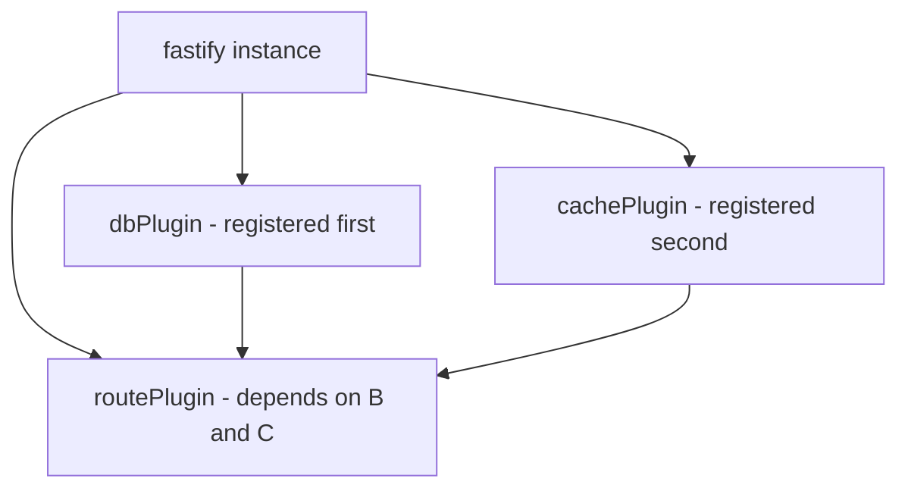

## Plugin Versioning and Compatibility

Fastify's plugin system includes a first-class versioning and compatibility mechanism built on top of `fastify-plugin` and Fastify's own `version` and `dependencies` metadata fields. This system allows plugin authors to declare what version of Fastify they support, what other plugins they depend on, and what version of themselves they are exposing — enabling Fastify to enforce compatibility at registration time rather than at runtime failure.

---

### The `fastify-plugin` Decorator

`fastify-plugin` (commonly aliased as `fp`) is a utility that strips a plugin's encapsulation boundary. When combined with versioning metadata, it becomes the standard mechanism for declaring reusable, dependency-aware plugins.

```js
const fp = require('fastify-plugin')

async function myPlugin(fastify, opts) {
  fastify.decorate('myService', {})
}

module.exports = fp(myPlugin, {
  fastify: '4.x',
  name: 'my-plugin',
})
```

**Key Points:**
- `fastify: '4.x'` declares the range of Fastify versions this plugin supports
- `name` gives the plugin a resolvable identity for dependency tracking
- Semver range strings are evaluated using the `avvio` dependency resolution layer that Fastify is built on

---

### Fastify Version Compatibility Declaration

#### The `fastify` Metadata Field

When a plugin is wrapped with `fp`, the second argument accepts a `fastify` field containing a semver range string.

```js
module.exports = fp(plugin, {
  fastify: '>=4.0.0 <5.0.0'
})
```

If the host application is running a version of Fastify outside this range, registration will throw synchronously:

```
Error: fastify-my-plugin requires fastify >= 4.0.0 <5.0.0 but got 3.29.0
```

**Key Points:**
- Fastify exposes its own version via `fastify.version`
- The check happens during `fastify.register()` before the plugin body executes
- [Inference] This check relies on `avvio`'s internal version assertion; behavior may vary across Fastify major versions

#### Checking Fastify Version at Runtime

```js
console.log(fastify.version) // e.g. "4.26.0"
```

This is useful inside plugin bodies when conditional logic is needed across versions.

---

### Plugin Identity and the `name` Field

The `name` field in `fp` metadata assigns an identity to a plugin. This identity is used for:

- Dependency declarations by other plugins
- Deduplication detection
- Debugging (Fastify's plugin tree uses names in error messages)

```js
module.exports = fp(plugin, {
  name: 'my-database-plugin',
  fastify: '4.x'
})
```

Without a `name`, the plugin is anonymous. [Inference] Anonymous plugins can still be depended upon if registered before the dependent plugin, but named plugins provide explicit guarantees through the dependency resolution system.

---

### Plugin Dependencies

#### Declaring Dependencies with `dependencies`

A plugin can declare that it requires other named plugins to already be registered before it runs. This is done via the `dependencies` array in the `fp` metadata:

```js
const fp = require('fastify-plugin')

async function myRoutePlugin(fastify, opts) {
  // Assumes fastify.db is available from 'my-database-plugin'
  fastify.get('/users', async () => {
    return fastify.db.query('SELECT * FROM users')
  })
}

module.exports = fp(myRoutePlugin, {
  name: 'my-route-plugin',
  fastify: '4.x',
  dependencies: ['my-database-plugin']
})
```

If `my-database-plugin` has not been registered before `my-route-plugin`, Fastify will throw:

```
Error: The dependency 'my-database-plugin' of plugin 'my-route-plugin' is not registered
```

**Key Points:**
- Dependencies are checked by name, not by module reference
- The check is performed after the encapsulation graph is resolved, before async plugin bodies execute
- `dependencies` only enforces that the named plugin was registered; it does not validate the version of that plugin — [Inference] version-to-version compatibility between plugins must be managed by the plugin author through documentation or manual checks

#### Dependency Resolution Order

```
fastify.register(dbPlugin)       // name: 'my-database-plugin'
fastify.register(cachePlugin)    // name: 'my-cache-plugin'
fastify.register(routePlugin)    // dependencies: ['my-database-plugin', 'my-cache-plugin']
```

Fastify processes registrations using `avvio`'s topological loading order. [Inference] Circular dependencies will cause a deadlock or error during boot; the exact error message may vary.

---

### The `avvio` Loading Model

Fastify's plugin lifecycle is managed by `avvio`, an async plugin loader that implements a directed acyclic graph (DAG) of initialization order.



**Key Points:**
- `avvio` guarantees that a plugin's `ready` callback fires only after all its dependencies have completed their own async initialization
- [Inference] This means decorators added during a dependency's initialization are available when the dependent plugin body runs — but this is contingent on correct registration order and naming

---

### Versioning Your Own Plugin for Consumers

When publishing a plugin for others to use, follow these conventions:

#### Package Version vs. `fastify` Compatibility Field

| Field | Purpose |
|---|---|
| `package.json` `version` | Your plugin's own release version (semver) |
| `fp` `fastify` field | The Fastify host version your plugin supports |
| `fp` `name` field | The identity used for dependency resolution |

```js
// package.json
{
  "name": "fastify-my-plugin",
  "version": "2.3.0",
  "peerDependencies": {
    "fastify": "^4.0.0"
  }
}

// plugin.js
module.exports = fp(plugin, {
  name: 'fastify-my-plugin',
  fastify: '4.x'
})
```

**Key Points:**
- `peerDependencies` in `package.json` communicates compatibility to npm/yarn for install-time warnings
- The `fastify` field in `fp` metadata enforces it at runtime registration
- Both should be kept in sync

---

### Plugin Versioning Across Fastify Major Versions

When maintaining a plugin across Fastify v3 and v4 (or v4 and v5), the conventional approach is to maintain separate major branches:

```
fastify-my-plugin@1.x  →  supports Fastify 3.x
fastify-my-plugin@2.x  →  supports Fastify 4.x
fastify-my-plugin@3.x  →  supports Fastify 5.x
```

Inside a plugin, conditional compatibility shims can be applied:

```js
async function plugin(fastify, opts) {
  const majorVersion = parseInt(fastify.version.split('.')[0], 10)

  if (majorVersion >= 5) {
    // use new API
  } else {
    // use legacy API
  }
}

module.exports = fp(plugin, {
  fastify: '>=3.0.0',
  name: 'my-compat-plugin'
})
```

[Inference] This pattern is viable but can become difficult to maintain; discrete major branches are generally preferable for long-term maintainability.

---

### Deduplication and Singleton Plugins

When the same named plugin is registered multiple times (e.g., by two different upstream plugins that both depend on it), Fastify [Inference] may or may not deduplicate it depending on how it was wrapped. `fastify-plugin` does not natively deduplicate by default.

To implement singleton behavior manually:

```js
const fp = require('fastify-plugin')
const PLUGIN_KEY = Symbol.for('my-singleton-plugin')

async function plugin(fastify, opts) {
  if (fastify[PLUGIN_KEY]) return  // already registered
  fastify[PLUGIN_KEY] = true

  fastify.decorate('myService', createService(opts))
}

module.exports = fp(plugin, {
  name: 'my-singleton-plugin',
  fastify: '4.x'
})
```

**Key Points:**
- `Symbol.for()` creates a global symbol that survives across module instances in the same process
- The early return prevents double-initialization
- [Inference] This pattern is particularly useful in monorepo or micro-frontend setups where the same plugin may be pulled in by multiple sub-packages — behavior depends on module resolution and Node.js module caching

---

### Debugging Plugin Registration

Fastify exposes `fastify.printPlugins()` to inspect the registered plugin tree at boot time:

```js
await fastify.ready()
console.log(fastify.printPlugins())
```

**Output** (approximate):
```
bound root {
  bound my-database-plugin {},
  bound my-cache-plugin {},
  bound my-route-plugin {}
}
```

This output reflects the encapsulation tree and is useful for verifying dependency resolution order and confirming plugin names.

---

### Error Reference

| Error | Cause |
|---|---|
| `requires fastify X but got Y` | `fastify` version field mismatch |
| `dependency 'X' is not registered` | Named dependency not registered before dependent plugin |
| `Plugin did not start in time` | Async plugin body did not call `done()` or resolve promise in time |

---

**Related Topics:**
- `avvio` internals and the async plugin DAG
- Plugin encapsulation scoping (`fastify-plugin` vs. raw `register`)
- Writing testable plugins with `fastify.inject()`
- Fastify v5 migration — breaking changes in plugin and hook API
- Publishing Fastify plugins to npm — conventions and peer dependency management
- Plugin composition patterns — combining multiple plugins into a single distributable