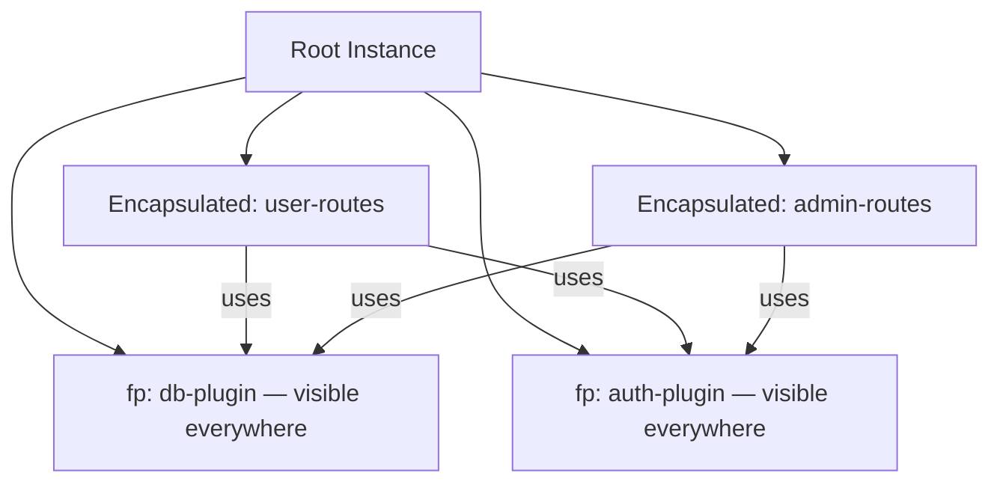

## Building Internal Plugin Libraries

An internal plugin library is a collection of reusable Fastify plugins maintained within a single codebase or monorepo, shared across multiple Fastify applications or services. Unlike published npm packages, internal libraries are consumed via local paths, workspace references, or a private registry. The design principles overlap heavily with public plugin authorship but with additional concerns around discoverability, versioning discipline, and cross-service consistency.

---

### Directory Structure Conventions

A well-organized internal plugin library separates plugins by domain and exposes a clean entry point.

#### Flat Library Structure

```
libs/fastify-plugins/
├── index.js               ← barrel export
├── package.json
├── plugins/
│   ├── auth.js
│   ├── db.js
│   ├── cache.js
│   └── logger.js
├── test/
│   ├── auth.test.js
│   └── db.test.js
└── README.md
```

#### Monorepo Package Structure (npm workspaces / pnpm)

```
packages/
├── plugin-auth/
│   ├── index.js
│   └── package.json       ← name: "@internal/plugin-auth"
├── plugin-db/
│   ├── index.js
│   └── package.json       ← name: "@internal/plugin-db"
└── plugin-cache/
    ├── index.js
    └── package.json       ← name: "@internal/plugin-cache"
```

**Key Points:**
- The monorepo approach enables independent versioning per plugin
- The flat structure is simpler to maintain when plugins are tightly coupled or share utilities
- Both approaches are valid; the choice depends on how independently each plugin evolves

---

### Anatomy of an Internal Plugin

Every internal plugin should follow a consistent structure regardless of its domain.

```js
// plugins/db.js
'use strict'

const fp = require('fastify-plugin')
const { Pool } = require('pg')

async function dbPlugin(fastify, opts) {
  const {
    connectionString,
    poolSize = 10,
  } = opts

  if (!connectionString) {
    throw new Error('[plugin-db] connectionString is required')
  }

  const pool = new Pool({
    connectionString,
    max: poolSize,
  })

  fastify.decorate('db', pool)

  fastify.addHook('onClose', async () => {
    await pool.end()
  })
}

module.exports = fp(dbPlugin, {
  name: 'internal-db-plugin',
  fastify: '4.x',
})
```

**Key Points:**
- Validate required options explicitly and throw descriptive errors with the plugin name as a prefix
- Always register cleanup logic via `onClose` for any stateful resource
- Use `fp` with a `name` so dependent plugins can declare it in `dependencies`

---

### Barrel Export Pattern

A barrel file (`index.js`) at the library root makes consumption uniform and avoids consumers needing to know internal file paths.

```js
// libs/fastify-plugins/index.js
'use strict'

module.exports = {
  authPlugin: require('./plugins/auth'),
  dbPlugin: require('./plugins/db'),
  cachePlugin: require('./plugins/cache'),
  loggerPlugin: require('./plugins/logger'),
}
```

**Consumer usage:**

```js
const { dbPlugin, cachePlugin } = require('@internal/fastify-plugins')

fastify.register(dbPlugin, { connectionString: process.env.DATABASE_URL })
fastify.register(cachePlugin, { ttl: 300 })
```

**Key Points:**
- Named exports prevent accidental default-import confusion
- The barrel is also where you can re-export shared schemas or utility functions used across plugins

---

### Shared Schema and Type Utilities

Internal libraries benefit from centralizing schemas that are reused across plugins and route handlers.

```js
// plugins/schemas/pagination.js
'use strict'

const paginationQuerySchema = {
  type: 'object',
  properties: {
    page: { type: 'integer', minimum: 1, default: 1 },
    limit: { type: 'integer', minimum: 1, maximum: 100, default: 20 },
  },
}

module.exports = { paginationQuerySchema }
```

```js
// plugins/shared-schemas.js
const fp = require('fastify-plugin')
const { paginationQuerySchema } = require('./schemas/pagination')

async function sharedSchemasPlugin(fastify, opts) {
  fastify.addSchema({
    $id: 'pagination',
    ...paginationQuerySchema,
  })
}

module.exports = fp(sharedSchemasPlugin, {
  name: 'internal-shared-schemas',
  fastify: '4.x',
})
```

**Key Points:**
- Registering schemas via a named plugin enables other plugins to declare `dependencies: ['internal-shared-schemas']`
- `$id`-based schema references work across route definitions once registered on the root instance
- [Inference] Schema plugins must be registered before any route plugin that references them; dependency declarations enforce this ordering

---

### Options Validation with JSON Schema

Internal plugins serving multiple teams benefit from validating their options at registration time rather than failing silently at use time.

```js
const fp = require('fastify-plugin')
const Ajv = require('ajv')

const ajv = new Ajv()

const optionsSchema = {
  type: 'object',
  required: ['connectionString'],
  properties: {
    connectionString: { type: 'string' },
    poolSize: { type: 'integer', minimum: 1, maximum: 50 },
  },
  additionalProperties: false,
}

const validate = ajv.compile(optionsSchema)

async function dbPlugin(fastify, opts) {
  if (!validate(opts)) {
    throw new Error(
      `[internal-db-plugin] Invalid options: ${ajv.errorsText(validate.errors)}`
    )
  }
  // ...
}

module.exports = fp(dbPlugin, { name: 'internal-db-plugin', fastify: '4.x' })
```

**Key Points:**
- Fail fast at registration rather than at the first use of a decorator
- Include the plugin name in the error message to make tracing faster in multi-plugin apps
- `additionalProperties: false` catches typos in option keys early

---

### Encapsulation Strategy

Internal plugins must make a deliberate choice about encapsulation scope.

#### When to Use `fp` (Skip Encapsulation)

Use `fp` when the plugin adds decorators, hooks, or schemas that must be visible across the entire application:

```js
// db, auth, cache — shared infrastructure
module.exports = fp(plugin, { name: 'internal-db-plugin', fastify: '4.x' })
```

#### When to Omit `fp` (Preserve Encapsulation)

Omit `fp` when the plugin registers routes or adds hooks that should be scoped to a specific context:

```js
// Route plugin — encapsulated, not shared globally
async function userRoutes(fastify, opts) {
  fastify.get('/users', handler)
  fastify.post('/users', handler)
}

module.exports = userRoutes  // no fp wrapper
```



**Key Points:**
- A common mistake is wrapping route plugins in `fp`, which leaks route-specific hooks to sibling scopes
- Infrastructure plugins (db, cache, auth) almost always use `fp`
- Feature plugins (routes, business logic) almost never use `fp`

---

### Plugin Composition — Combining into a Suite

For applications that need multiple infrastructure plugins, a composition plugin bundles them:

```js
// plugins/suite.js
const fp = require('fastify-plugin')
const dbPlugin = require('./db')
const cachePlugin = require('./cache')
const authPlugin = require('./auth')
const sharedSchemas = require('./shared-schemas')

async function internalSuite(fastify, opts) {
  const {
    db: dbOpts = {},
    cache: cacheOpts = {},
    auth: authOpts = {},
  } = opts

  await fastify.register(sharedSchemas)
  await fastify.register(dbPlugin, dbOpts)
  await fastify.register(cachePlugin, cacheOpts)
  await fastify.register(authPlugin, authOpts)
}

module.exports = fp(internalSuite, {
  name: 'internal-suite',
  fastify: '4.x',
})
```

**Consumer usage:**

```js
fastify.register(require('@internal/fastify-plugins').suite, {
  db: { connectionString: process.env.DB_URL },
  cache: { ttl: 60 },
  auth: { secret: process.env.JWT_SECRET },
})
```

**Key Points:**
- The suite plugin is itself wrapped in `fp` so all child decorators propagate to the root
- Individual plugins within the suite retain their own `name` fields for dependency resolution
- [Inference] Registering with `await` inside the suite body forces sequential initialization, which may be intentional when one plugin depends on another's side effects

---

### Testing Internal Plugins in Isolation

Each plugin should be independently testable without requiring the full application stack.

```js
// test/db.test.js
const { test } = require('node:test')
const assert = require('node:assert')
const Fastify = require('fastify')
const dbPlugin = require('../plugins/db')

test('db plugin decorates fastify.db', async (t) => {
  const app = Fastify()

  await app.register(dbPlugin, {
    connectionString: 'postgres://localhost/test_db',
  })

  await app.ready()

  assert.ok(app.db, 'fastify.db should be defined')
  await app.close()
})

test('db plugin throws without connectionString', async (t) => {
  const app = Fastify()

  await assert.rejects(
    () => app.register(dbPlugin, {}).then(() => app.ready()),
    /connectionString is required/
  )

  await app.close()
})
```

**Key Points:**
- Always call `app.close()` in test teardown; plugins that register `onClose` hooks require it to release resources
- Test both the happy path and invalid options
- [Inference] Using `fastify.inject()` for route plugins and direct decorator assertions for infrastructure plugins covers the two main categories of internal plugin behavior — actual behavior depends on implementation

---

### Versioning Internal Libraries

Even without publishing to npm, internal libraries benefit from semantic versioning discipline.

#### Versioning Strategies

| Strategy | When to Use |
|---|---|
| Single package version | Flat library, all plugins versioned together |
| Independent package versions | Monorepo, each plugin versioned separately |
| Git tags only | Small team, infrequent changes |
| Private npm registry | Multiple consuming services, strict dependency pinning |

#### Changelog Discipline

Maintain a `CHANGELOG.md` per library or per package:

```
## [2.1.0] - 2024-11-01
### Added
- `cachePlugin` now accepts `keyPrefix` option

## [2.0.0] - 2024-09-15
### Breaking
- `dbPlugin` option `url` renamed to `connectionString`
- Minimum Fastify version bumped to 4.20.0
```

**Key Points:**
- Breaking changes to plugin option shapes should be major version bumps
- Consumers pinned to a version should not receive unexpected breakage from patch updates

---

### Documenting Internal Plugins

Each plugin file should carry a header block documenting its contract:

```js
/**
 * @plugin internal-db-plugin
 * @description Decorates fastify with a PostgreSQL connection pool via `fastify.db`
 *
 * @param {object}  opts
 * @param {string}  opts.connectionString  - Required. PostgreSQL connection string.
 * @param {number}  [opts.poolSize=10]     - Optional. Max pool connections.
 *
 * @decorates fastify.db {pg.Pool}
 * @hook onClose — drains and ends the connection pool
 * @dependency none
 *
 * @fastify ^4.0.0
 */
```

A `README.md` at the library root should list all plugins, their decorators, dependencies, and options in a table:

| Plugin | Decorator | Dependencies | Key Options |
|---|---|---|---|
| `internal-db-plugin` | `fastify.db` | none | `connectionString`, `poolSize` |
| `internal-cache-plugin` | `fastify.cache` | none | `ttl`, `keyPrefix` |
| `internal-auth-plugin` | `fastify.authenticate` | `internal-db-plugin` | `secret`, `issuer` |
| `internal-shared-schemas` | none | none | none |

---

### Common Pitfalls

**Decorator name collisions:** If two plugins in the library attempt to add the same decorator name, Fastify will throw. Use namespaced decorator names or check existence before decorating:

```js
if (!fastify.hasDecorator('myService')) {
  fastify.decorate('myService', service)
}
```

**Circular dependencies:** Plugin A declares a dependency on Plugin B which declares a dependency on Plugin A. [Inference] This causes an unresolvable boot cycle; restructure to extract shared logic into a third plugin that neither depends on.

**Missing `onClose` teardown:** Stateful plugins (db pools, Redis clients, file watchers) that do not register `onClose` will leave connections open during testing, causing test runners to hang.

**Leaking encapsulation unintentionally:** Wrapping a route plugin in `fp` causes its hooks (e.g., `preHandler` authentication) to leak to sibling scopes, potentially applying auth to routes that should be public.

---

**Related Topics:**
- Plugin versioning and compatibility (`fastify-plugin` metadata, semver enforcement)
- Monorepo tooling for plugin libraries (npm workspaces, pnpm, Turborepo)
- Private npm registry setup (Verdaccio, GitHub Packages, Nexus)
- Plugin encapsulation deep dive — scope inheritance and context isolation
- Integration testing multi-plugin applications with `fastify.inject()`
- Auto-loading plugins with `@fastify/autoload`