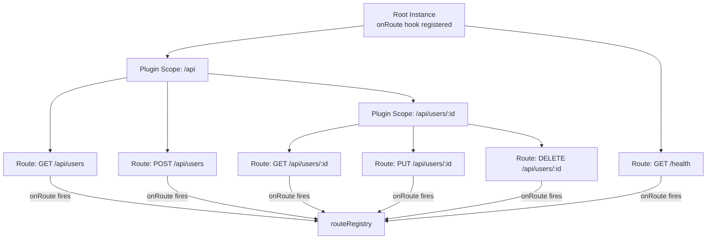

## Route Enumeration and Introspection

Route enumeration and introspection refers to programmatic access to the routes registered on a Fastify instance — their methods, URLs, schemas, constraints, and associated metadata. This is the foundation for auto-generated API documentation, health checks that report available endpoints, admin dashboards, testing utilities that enumerate routes to assert coverage, and tooling that validates route configurations against external specifications.

---

### `fastify.printRoutes()`

`fastify.printRoutes()` returns a human-readable string representation of the registered route tree, organized by the underlying radix tree structure.

```js
await app.ready()
console.log(app.printRoutes())
```

**Output:**
```
└── /
    ├── users (GET, POST)
    │   └── /:id (GET, PUT, DELETE)
    ├── products (GET, POST)
    │   └── /:id (GET)
    └── health (GET)
```

#### Options

```js
// Include hooks in the output
console.log(app.printRoutes({ includeHooks: true }))

// Show only routes matching a specific method
console.log(app.printRoutes({ method: 'GET' }))

// Output as a flat list rather than a tree
console.log(app.printRoutes({ commonPrefix: false }))
```

**Output** (`commonPrefix: false`):
```
GET /users
POST /users
GET /users/:id
PUT /users/:id
DELETE /users/:id
GET /products
POST /products
GET /products/:id
GET /health
```

**Key Points:**
- `printRoutes()` is intended for human consumption — logging, debugging, startup output
- It returns a string, not a structured data object; it is not suitable as input for programmatic processing
- Must be called after `app.ready()`
- [Inference] Output format may differ across Fastify major versions; do not parse its output as a stable data format

---

### `fastify.hasRoute()`

`fastify.hasRoute()` checks whether a specific route is registered, returning a boolean.

```js
await app.ready()

app.hasRoute({ method: 'GET', url: '/users' })         // true
app.hasRoute({ method: 'DELETE', url: '/users' })      // false
app.hasRoute({ method: 'GET', url: '/users/:id' })     // true
```

With constraints:

```js
app.hasRoute({
  method: 'GET',
  url: '/users',
  constraints: { version: '2.0.0' },
})
```

**Key Points:**
- URL must match exactly as registered, including parameter placeholders (`:id`, not a real value)
- Returns `false` for routes registered in sibling or child encapsulation scopes that are not visible from the calling context — [Inference] calling `hasRoute()` on the root instance should see all routes since all scopes ultimately attach to the root router; behavior in deeply nested scopes is less predictable
- Useful in tests to assert that a plugin registered the expected routes

---

### `fastify.findRoute()`

`fastify.findRoute()` returns the internal route object for a given method and URL, or `null` if not found. This is the primary API for structured programmatic introspection.

```js
await app.ready()

const route = app.findRoute({
  method: 'GET',
  url: '/users/:id',
})

console.log(route)
```

**Output** (approximate shape):
```js
{
  method: 'GET',
  url: '/users/:id',
  params: { id: ':id' },
  store: {
    schema: { ... },
    config: { ... },
    handler: [Function: handler],
  }
}
```

**Key Points:**
- `findRoute()` performs a lookup against the live router, not a metadata registry — it resolves the actual handler and schema stored at that node
- The `store` object contains the data attached to the route at registration time
- [Inference] The exact shape of the returned object is an internal implementation detail and may change across Fastify versions; treat specific field names as unverified unless confirmed against your version's source or changelog

---

### `fastify.routes` — Internal Route Store

Fastify does not expose a public `fastify.routes` array by default. Route metadata is stored internally in the find-my-way router instance. However, Fastify provides access to the underlying router via `fastify.router` in some contexts, and route data can be extracted through `printRoutes({ commonPrefix: false })` or via a custom tracking plugin.

#### Custom Route Registry Plugin

The most reliable way to enumerate all registered routes programmatically is to intercept registration via the `onRoute` hook:

```js
const fp = require('fastify-plugin')

async function routeRegistryPlugin(fastify, opts) {
  const registry = []

  fastify.addHook('onRoute', (routeOptions) => {
    registry.push({
      method: routeOptions.method,
      url: routeOptions.url,
      schema: routeOptions.schema ?? null,
      config: routeOptions.config ?? null,
      constraints: routeOptions.constraints ?? null,
    })
  })

  fastify.decorate('routeRegistry', registry)
}

module.exports = fp(routeRegistryPlugin, {
  name: 'route-registry',
  fastify: '4.x',
})
```

```js
await app.register(routeRegistryPlugin)
// ... register other plugins and routes ...
await app.ready()

console.log(app.routeRegistry)
```

**Output:**
```js
[
  { method: 'GET',    url: '/users',     schema: { ... }, config: null, constraints: null },
  { method: 'POST',   url: '/users',     schema: { ... }, config: null, constraints: null },
  { method: 'GET',    url: '/users/:id', schema: { ... }, config: null, constraints: null },
  { method: 'DELETE', url: '/users/:id', schema: null,    config: null, constraints: null },
]
```

**Key Points:**
- `onRoute` fires synchronously each time `fastify.route()` (or any shorthand) is called
- Because the registry plugin uses `fp`, the `onRoute` hook is registered on the root instance and fires for routes in all child scopes
- The `routeOptions` object passed to `onRoute` contains the full options object as passed to `fastify.route()`, including `schema`, `config`, `constraints`, `preHandler`, and other lifecycle hooks
- This is the pattern used internally by documentation plugins such as `@fastify/swagger`

---

### The `onRoute` Hook in Depth

`onRoute` is a Fastify application hook that fires after each route is added to the router. It is the primary extension point for route introspection tooling.

```js
fastify.addHook('onRoute', (routeOptions) => {
  // routeOptions is the full route configuration object
  console.log(`Registered: ${routeOptions.method} ${routeOptions.url}`)
})
```

#### `routeOptions` Shape

```js
{
  method: 'GET',                     // string or string[]
  url: '/users/:id',                 // as registered
  path: '/users/:id',                // alias for url
  routePath: '/users/:id',           // path without prefix
  prefix: '/api',                    // prefix applied by register()
  schema: {
    params: { ... },
    body: { ... },
    response: { ... },
    headers: { ... },
    querystring: { ... },
  },
  config: { },                       // arbitrary user-defined config
  constraints: { version: '1.0.0' },
  handler: [Function],
  preHandler: [...],
  onRequest: [...],
  // ... other lifecycle arrays
}
```

**Key Points:**
- `url` includes the prefix applied by `register({ prefix })`; `routePath` is the path without the prefix
- `schema` may be `undefined` if no schema was declared on the route
- Mutating `routeOptions` inside `onRoute` [Inference] may affect the route as registered — this is intentional in some plugin patterns (e.g., `@fastify/swagger` injects schema metadata) but should be done with care
- `onRoute` fires for HEAD routes that Fastify auto-generates from GET routes — filter by `method` if HEAD duplicates are unwanted in a registry

---

### Extracting Route Metadata for Documentation

The `onRoute` hook combined with schema introspection is the foundation for generating OpenAPI specs, route tables, and API reference documentation.

```js
async function openapiCollector(fastify, opts) {
  const paths = {}

  fastify.addHook('onRoute', (routeOptions) => {
    const { method, url, schema = {}, config = {} } = routeOptions
    const methods = Array.isArray(method) ? method : [method]

    if (!paths[url]) paths[url] = {}

    for (const m of methods) {
      if (m === 'HEAD') continue

      paths[url][m.toLowerCase()] = {
        summary: config.summary ?? '',
        tags: config.tags ?? [],
        parameters: extractParameters(url, schema.params, schema.querystring),
        requestBody: schema.body ? { content: { 'application/json': { schema: schema.body } } } : undefined,
        responses: buildResponses(schema.response),
      }
    }
  })

  fastify.decorate('openapiPaths', paths)
}
```

**Key Points:**
- `config` on a route is an arbitrary object — documentation plugins conventionally use `config.summary`, `config.tags`, `config.description`, and `config.operationId` as documentation metadata
- This is exactly the pattern `@fastify/swagger` uses; the hook-based approach means documentation is always in sync with the actual registered routes
- [Inference] Schema objects collected via `onRoute` are the raw input schemas, not the compiled validators; `$ref` references within them may need resolution against `fastify.getSchemas()` for complete output

---

### `fastify.getSchemas()` and `fastify.getSchema()`

`fastify.getSchemas()` returns all schemas registered via `fastify.addSchema()` on the current scope. This complements route introspection by providing the shared schema definitions that route schemas may reference.

```js
fastify.addSchema({ $id: 'User', type: 'object', properties: { id: { type: 'string' } } })
fastify.addSchema({ $id: 'Error', type: 'object', properties: { message: { type: 'string' } } })

await fastify.ready()

console.log(fastify.getSchemas())
// {
//   User:  { $id: 'User', type: 'object', ... },
//   Error: { $id: 'Error', type: 'object', ... },
// }

console.log(fastify.getSchema('User'))
// { $id: 'User', type: 'object', properties: { id: { type: 'string' } } }
```

**Key Points:**
- `getSchemas()` returns schemas registered on the current scope and its ancestors — child scope schemas are not visible from the parent
- Used in conjunction with `onRoute` data to resolve `$ref` URIs in route schemas for documentation generation
- Returns a plain object keyed by `$id`; mutating the returned object [Inference] may affect internal schema resolution — treat as read-only

---

### Route Enumeration for Test Coverage

A test utility that asserts every registered route has a corresponding test case:

```js
// test/route-coverage.test.js
const { test } = require('node:test')
const assert = require('node:assert/strict')
const buildApp = require('../app')

const KNOWN_ROUTES = new Set([
  'GET /users',
  'POST /users',
  'GET /users/:id',
  'PUT /users/:id',
  'DELETE /users/:id',
  'GET /health',
])

test('all registered routes are covered by KNOWN_ROUTES', async (t) => {
  const app = await buildApp()
  t.after(() => app.close())

  const registered = app.routeRegistry
    .filter(r => r.method !== 'HEAD')
    .map(r => `${r.method} ${r.url}`)

  for (const route of registered) {
    assert.ok(
      KNOWN_ROUTES.has(route),
      `Unexpected route registered: ${route} — add it to KNOWN_ROUTES or remove it`
    )
  }

  for (const known of KNOWN_ROUTES) {
    assert.ok(
      registered.includes(known),
      `Expected route not registered: ${known}`
    )
  }
})
```

**Key Points:**
- This test fails if a route is added or removed without updating `KNOWN_ROUTES`, acting as a change detection guard
- [Inference] This pattern is most useful in teams where accidental route registration (e.g., from a plugin update) could have security implications — actual utility depends on team discipline around maintaining the set

---

### Introspecting Hooks Attached to Routes

`onRoute` provides access to the hook arrays attached to each route. This enables tooling to assert that security-critical hooks are applied consistently.

```js
async function hookCoveragePlugin(fastify, opts) {
  const { requiredHook = 'preHandler', requiredFn = 'authenticate' } = opts
  const violations = []

  fastify.addHook('onRoute', (routeOptions) => {
    const hooks = routeOptions[requiredHook] ?? []
    const names = hooks.map(fn => fn.name)

    if (!names.includes(requiredFn)) {
      violations.push(`${routeOptions.method} ${routeOptions.url}`)
    }
  })

  fastify.addHook('onReady', async () => {
    if (violations.length > 0) {
      throw new Error(
        `Routes missing '${requiredFn}' ${requiredHook}:\n${violations.join('\n')}`
      )
    }
  })
}
```

**Key Points:**
- `onReady` fires just before `fastify.ready()` resolves, making it the correct place to assert post-registration invariants
- [Inference] Function identity checks via `fn.name` depend on functions having consistent names — anonymous arrow functions assigned to variables may report empty or unexpected names; named function declarations are more reliable for this pattern
- This pattern is used in security auditing tooling to guarantee authentication hooks are not accidentally omitted

---

### Visualizing the Route Tree



---

### `@fastify/swagger` as an Introspection Consumer

`@fastify/swagger` is the canonical example of a plugin built entirely on route introspection. Understanding its approach clarifies what is possible with `onRoute`.

```js
await app.register(require('@fastify/swagger'), {
  openapi: {
    info: { title: 'My API', version: '1.0.0' },
  },
})

await app.register(require('@fastify/swagger-ui'), {
  routePrefix: '/docs',
})

// Routes defined after swagger registration are automatically included
app.get('/users', {
  schema: {
    summary: 'List users',
    tags: ['users'],
    response: { 200: { type: 'array', items: { $ref: 'User#' } } },
  },
  handler: async () => [],
})

await app.ready()

// Retrieve the generated spec programmatically
const spec = app.swagger()
console.log(JSON.stringify(spec, null, 2))
```

**Key Points:**
- `app.swagger()` returns the fully assembled OpenAPI document after `ready()`
- `@fastify/swagger` uses `onRoute` internally, the same hook available to custom registry plugins
- `config.summary`, `config.tags`, `config.description`, and `config.operationId` on route definitions feed directly into the generated spec — these are conventions, not enforced by Fastify itself

---

### Introspection Utility Reference

| API | Returns | Use Case |
|---|---|---|
| `printRoutes()` | Formatted string | Human-readable startup log |
| `printRoutes({ commonPrefix: false })` | Flat string list | Simple route auditing |
| `hasRoute({ method, url })` | Boolean | Test assertions |
| `findRoute({ method, url })` | Route object or null | Deep per-route inspection |
| `onRoute` hook | `routeOptions` per route | Registry building, documentation |
| `getSchemas()` | Schema map | `$ref` resolution in docs |
| `getSchema('$id')` | Single schema | Per-schema lookup |

---

**Related Topics:**
- `@fastify/swagger` and `@fastify/swagger-ui` — full OpenAPI generation from route schemas
- `onRoute` hook contract — mutation semantics and interaction with schema compilation
- Custom constraints — introspecting constraint metadata alongside route definitions
- Route-level `config` object — conventions for documentation, authorization, and audit metadata
- Dynamic route registration — combining enumeration with boot-time route generation
- Testing route coverage — using registry plugins to enforce test completeness