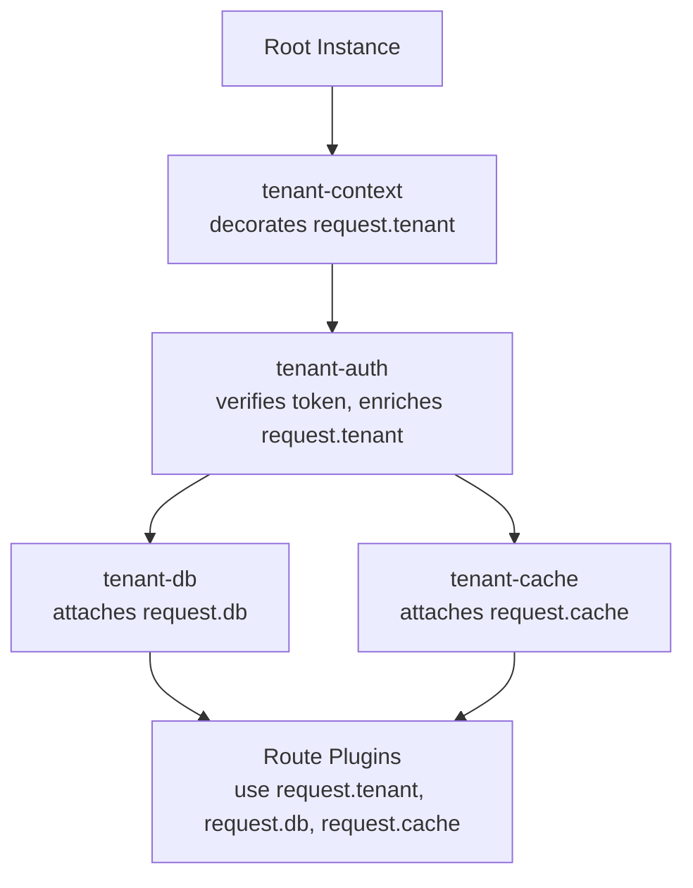

## Multi-Tenant Routing

Multi-tenant routing in Fastify refers to patterns where a single server instance handles requests for multiple tenants — organizations, customers, or isolated user groups — and routes, resolves context, and enforces isolation based on tenant identity. Tenant identity is typically derived from the request itself: a subdomain, a URL path segment, a header, a JWT claim, or an API key. The routing and isolation strategy chosen has direct implications for encapsulation, performance, data access patterns, and security boundaries.

---

### Tenant Identity Sources

Before any routing decision can be made, tenant identity must be extracted from the incoming request. The extraction point determines which Fastify lifecycle hook is appropriate.

| Source | Example | Extraction Hook |
|---|---|---|
| Subdomain | `acme.api.myapp.com` | `onRequest` |
| URL prefix | `/tenants/acme/users` | `onRequest` or route param |
| Custom header | `X-Tenant-ID: acme` | `onRequest` |
| JWT claim | `{ sub: '...', tenant: 'acme' }` | `preHandler` (post-auth) |
| API key lookup | key → tenant mapping | `onRequest` or `preHandler` |
| Query parameter | `?tenant=acme` | `onRequest` |

**Key Points:**
- Subdomain and header extraction can happen in `onRequest` — the earliest hook — because they require no authentication
- JWT claim extraction must happen after token verification, making `preHandler` the appropriate stage
- [Inference] Query parameter–based tenant identity is convenient for development but is generally discouraged in production due to accidental logging and caching risks — treat as unverified for your specific security context

---

### Request Decoration for Tenant Context

The standard Fastify pattern for tenant context is to extract identity early and attach it to the request object via a decorator, making it available to all downstream handlers and hooks.

```js
const fp = require('fastify-plugin')

async function tenantContextPlugin(fastify, opts) {
  fastify.decorateRequest('tenant', null)

  fastify.addHook('onRequest', async (request, reply) => {
    const tenantId = extractTenantId(request)

    if (!tenantId) {
      return reply.code(400).send({ error: 'Tenant identity could not be resolved' })
    }

    request.tenant = { id: tenantId }
  })
}

function extractTenantId(request) {
  // Header-based
  const fromHeader = request.headers['x-tenant-id']
  if (fromHeader) return fromHeader

  // Subdomain-based
  const host = request.hostname
  const subdomain = host.split('.')[0]
  if (subdomain && subdomain !== 'api' && subdomain !== 'www') return subdomain

  // URL prefix-based (if using /tenants/:tenantId pattern)
  const match = request.url.match(/^\/tenants\/([^/]+)/)
  if (match) return match[1]

  return null
}

module.exports = fp(tenantContextPlugin, {
  name: 'tenant-context',
  fastify: '4.x',
})
```

**Key Points:**
- `decorateRequest('tenant', null)` must be called before the hook that populates it — this registers the property on the request prototype, avoiding dynamic property assignment which [Inference] may inhibit V8 hidden class optimizations
- The `extractTenantId` function consolidates all resolution strategies; only one should be active per deployment
- Downstream handlers access tenant identity via `request.tenant.id` without re-parsing the request

---

### Subdomain-Based Routing

Subdomain routing dispatches requests based on the `Host` header. Each subdomain maps to a tenant, and routing decisions are made in `onRequest`.

```js
async function subdomainTenantPlugin(fastify, opts) {
  const { tenantRegistry } = opts  // Map of subdomain → tenant config

  fastify.decorateRequest('tenant', null)

  fastify.addHook('onRequest', async (request, reply) => {
    const host = request.hostname  // 'acme.api.myapp.com'
    const subdomain = host.split('.')[0]
    const tenant = tenantRegistry.get(subdomain)

    if (!tenant) {
      return reply.code(404).send({ error: `Unknown tenant: ${subdomain}` })
    }

    request.tenant = tenant
  })
}
```

#### Constraints-Based Subdomain Routing

Fastify's constraint system can route to different handlers based on the `Host` header natively, without hook-based dispatch:

```js
// Built-in host constraint
fastify.get('/dashboard', {
  constraints: { host: 'acme.api.myapp.com' },
  handler: async (request) => ({ tenant: 'acme', dashboard: true }),
})

fastify.get('/dashboard', {
  constraints: { host: 'globex.api.myapp.com' },
  handler: async (request) => ({ tenant: 'globex', dashboard: true }),
})
```

**Key Points:**
- Built-in `host` constraint matches the full `Host` header value exactly — it does not perform subdomain extraction
- [Inference] For wildcard subdomain matching (`*.api.myapp.com`), a custom constraint strategy is required; the built-in host constraint does not support glob patterns — verify against your Fastify version
- Constraints-based routing is handled at the router level before hooks execute, making it faster than hook-based dispatch for route selection

#### Custom Subdomain Constraint

```js
const subdomainStrategy = {
  name: 'subdomain',
  storage() {
    const tenants = {}
    return {
      get(subdomain) { return tenants[subdomain] ?? null },
      set(subdomain, store) { tenants[subdomain] = store },
      del(subdomain) { delete tenants[subdomain] },
      empty() { Object.keys(tenants).forEach(k => delete tenants[k]) },
    }
  },
  deriveConstraint(request) {
    return request.hostname.split('.')[0]
  },
  validate(subdomain) {
    if (typeof subdomain !== 'string') throw new Error('Subdomain must be a string')
  },
}

const app = Fastify({ constraints: { subdomain: subdomainStrategy } })

app.get('/data', {
  constraints: { subdomain: 'acme' },
  handler: async () => ({ tenant: 'acme' }),
})

app.get('/data', {
  constraints: { subdomain: 'globex' },
  handler: async () => ({ tenant: 'globex' }),
})
```

**Key Points:**
- Custom constraint strategies are registered at Fastify instantiation time via the `constraints` option
- `deriveConstraint` runs on every request at the router level — keep it lightweight
- The same URL can be registered multiple times with different constraint values, each routing to a different handler

---

### URL Prefix–Based Tenant Routing

The simplest and most explicit strategy: tenant identity is embedded in the URL path.

```js
// /tenants/:tenantId/...
async function tenantPrefixRoutes(fastify, opts) {
  fastify.register(async (instance) => {
    // Resolve and attach tenant before child routes execute
    instance.addHook('onRequest', async (request, reply) => {
      const { tenantId } = request.params
      const tenant = await resolveTenant(tenantId)

      if (!tenant) {
        return reply.code(404).send({ error: 'Tenant not found' })
      }

      request.tenant = tenant
    })

    instance.get('/users', async (request) => {
      return listUsers(request.tenant.id)
    })

    instance.get('/settings', async (request) => {
      return getSettings(request.tenant.id)
    })

  }, { prefix: '/tenants/:tenantId' })
}
```

**Key Points:**
- Fastify supports parameters in `register()` prefix strings — `request.params.tenantId` is populated in all child routes
- The scoped `onRequest` hook applies only within this registered scope, not to sibling routes
- This pattern makes tenant identity explicit and auditable in URLs, access logs, and API documentation
- [Inference] URL prefix–based tenancy makes caching easier since tenant identity is part of the cache key in the URL — actual caching behavior depends on the cache layer used

---

### Per-Tenant Database Connection Routing

A critical isolation requirement in many multi-tenant systems is routing each request to the correct database or schema. This integrates with the tenant context plugin.

#### Database-Per-Tenant

```js
const fp = require('fastify-plugin')

async function tenantDbPlugin(fastify, opts) {
  const { connectionConfigs } = opts  // Map<tenantId, connectionString>
  const pools = new Map()

  // Pre-initialize pools for all known tenants at boot
  for (const [tenantId, connStr] of connectionConfigs.entries()) {
    pools.set(tenantId, new Pool({ connectionString: connStr }))
  }

  fastify.decorateRequest('db', null)

  fastify.addHook('onRequest', async (request, reply) => {
    const tenantId = request.tenant?.id
    if (!tenantId) return  // tenant-context plugin handles the error case

    const pool = pools.get(tenantId)
    if (!pool) {
      return reply.code(503).send({ error: 'No database configured for tenant' })
    }

    request.db = pool
  })

  fastify.addHook('onClose', async () => {
    for (const pool of pools.values()) {
      await pool.end()
    }
  })
}

module.exports = fp(tenantDbPlugin, {
  name: 'tenant-db',
  fastify: '4.x',
  dependencies: ['tenant-context'],
})
```

#### Schema-Per-Tenant (Single Database)

```js
fastify.addHook('onRequest', async (request, reply) => {
  const tenantId = request.tenant?.id
  if (!tenantId) return

  // Attach a scoped query function that sets search_path per request
  request.db = {
    query: async (sql, params) => {
      const client = await fastify.pgPool.connect()
      try {
        await client.query(`SET search_path TO tenant_${tenantId}, public`)
        return client.query(sql, params)
      } finally {
        client.release()
      }
    },
  }
})
```

**Key Points:**
- Database-per-tenant provides the strongest isolation but has higher resource overhead (multiple connection pools)
- Schema-per-tenant in PostgreSQL via `search_path` is a common middle ground — [Inference] the `SET search_path` approach requires careful handling of connection pooling since `search_path` is a session-level setting; using a fresh client per request and releasing it afterward is essential
- Row-level security (RLS) in PostgreSQL is a third option and shifts isolation enforcement to the database layer entirely

---

### Tenant-Aware Caching

Cache keys must include tenant identity to prevent cross-tenant data leakage.

```js
async function tenantCachePlugin(fastify, opts) {
  const { redis } = fastify

  fastify.decorateRequest('cache', null)

  fastify.addHook('onRequest', async (request) => {
    const tenantId = request.tenant?.id

    request.cache = {
      async get(key) {
        return redis.get(`tenant:${tenantId}:${key}`)
      },
      async set(key, value, ttl = 300) {
        return redis.set(`tenant:${tenantId}:${key}`, JSON.stringify(value), 'EX', ttl)
      },
      async del(key) {
        return redis.del(`tenant:${tenantId}:${key}`)
      },
      async flush() {
        const keys = await redis.keys(`tenant:${tenantId}:*`)
        if (keys.length) await redis.del(...keys)
      },
    }
  })
}
```

**Key Points:**
- The `tenant:${tenantId}:` key prefix is the critical isolation mechanism — omitting it would allow tenants to read each other's cached data
- `flush()` using `KEYS` is acceptable for low-cardinality key sets but [Inference] may block the Redis event loop for large key sets; `SCAN`-based iteration is preferable at scale — behavior depends on Redis version and key count
- Cache TTLs should be consistent with the tenant's data freshness requirements

---

### Tenant Isolation and Security Boundaries

Multi-tenant systems must prevent one tenant from accessing another's data. Fastify's hook system enforces this at the request level.

#### Tenant Scope Assertion Hook

```js
// Asserts that any resource ID referenced in the request belongs to the active tenant
fastify.addHook('preHandler', async (request, reply) => {
  const resourceId = request.params.id
  if (!resourceId) return

  const resource = await fastify.db.query(
    'SELECT tenant_id FROM resources WHERE id = $1',
    [resourceId]
  )

  if (!resource.rows[0]) {
    return reply.code(404).send({ error: 'Resource not found' })
  }

  if (resource.rows[0].tenant_id !== request.tenant.id) {
    // Return 404 rather than 403 to avoid confirming resource existence
    return reply.code(404).send({ error: 'Resource not found' })
  }
})
```

**Key Points:**
- Returning `404` instead of `403` for cross-tenant access is a deliberate security choice — it avoids confirming that a resource exists in another tenant's context
- This hook should be scoped to authenticated routes only, not public endpoints
- [Inference] This pattern performs an additional database query per request for parameterized routes; at scale, caching resource-to-tenant mappings may reduce overhead — actual performance depends on query patterns and cache hit rates

---

### Plugin Architecture for Multi-Tenancy

A complete multi-tenant plugin stack composes several concerns in dependency order:



```js
// app.js
const app = Fastify({ logger: true })

await app.register(require('./plugins/tenant-context'))
await app.register(require('./plugins/tenant-auth'), { secret: process.env.JWT_SECRET })
await app.register(require('./plugins/tenant-db'), { connectionConfigs })
await app.register(require('./plugins/tenant-cache'))

await app.register(require('./routes/users'), { prefix: '/users' })
await app.register(require('./routes/settings'), { prefix: '/settings' })

await app.listen({ port: 3000 })
```

**Key Points:**
- Registration order enforces initialization order via `fp` dependencies
- Route plugins receive a fully hydrated `request.tenant`, `request.db`, and `request.cache` without needing to perform any resolution themselves
- Each concern is independently testable by stubbing the decorator it depends on

---

### Testing Multi-Tenant Routes

Multi-tenant routes require test fixtures that simulate different tenant contexts.

```js
const { test } = require('node:test')
const assert = require('node:assert/strict')
const Fastify = require('fastify')
const userRoutes = require('../routes/users')

function buildApp(tenantOverride = null) {
  const app = Fastify({ logger: false })

  // Stub tenant-context plugin
  app.decorateRequest('tenant', null)
  app.addHook('onRequest', async (request) => {
    request.tenant = tenantOverride ?? { id: 'acme', plan: 'pro' }
  })

  // Stub db
  app.decorate('db', {
    query: async () => ({ rows: [{ id: '1', name: 'Alice', tenant_id: 'acme' }] }),
  })

  app.register(userRoutes)
  return app
}

test('returns users for active tenant', async (t) => {
  const app = buildApp({ id: 'acme' })
  await app.ready()
  t.after(() => app.close())

  const res = await app.inject({ method: 'GET', url: '/users' })

  assert.strictEqual(res.statusCode, 200)
  assert.ok(res.json().every(u => u.tenant_id === 'acme'))
})

test('missing tenant returns 400', async (t) => {
  const app = buildApp(null)

  // Override to simulate missing tenant
  app.decorateRequest('tenant', null)
  app.addHook('onRequest', async (request, reply) => {
    reply.code(400).send({ error: 'Tenant identity could not be resolved' })
  })

  await app.ready()
  t.after(() => app.close())

  const res = await app.inject({ method: 'GET', url: '/users' })
  assert.strictEqual(res.statusCode, 400)
})
```

---

### Common Pitfalls

**Shared mutable state across tenants:** Global variables, module-level caches, or decorated instance-level state that is not keyed by tenant ID will leak data across tenants. All mutable state must be request-scoped or explicitly keyed.

**Missing tenant validation on nested resources:** A handler that resolves `/users/:userId/documents/:docId` must verify that both `userId` and `docId` belong to the active tenant — validating only the top-level resource is insufficient.

**Cache key collisions:** Any cache that does not include tenant identity in its key prefix risks cross-tenant reads. This applies to both application-level caches and HTTP caching layers.

**Logging tenant identity:** Ensure `request.tenant.id` is included in structured log output for all requests. [Inference] Fastify's `req.log` serializer can be extended to include tenant context automatically — actual configuration depends on your logger setup.

**Relying on URL prefix for security:** URL prefix–based tenant routing is a routing mechanism, not a security boundary. A hook-based assertion that validates the resolved tenant against the authenticated identity is still required.

---

**Related Topics:**
- Custom constraint strategies — deriving and matching constraints beyond host and version
- Row-level security in PostgreSQL — database-enforced tenant isolation
- `@fastify/jwt` claims extraction — enriching `request.tenant` from token payload
- Connection pool management for database-per-tenant architectures
- Rate limiting per tenant — `@fastify/rate-limit` with dynamic key generators
- Tenant onboarding patterns — dynamic route registration for newly provisioned tenants