# Syllabus

## Module 1: OpenAPI Fundamentals

- What is OpenAPI and API specification standards
- OpenAPI vs Swagger terminology and history
- API-first development methodology
- Benefits of API documentation and contracts
- OpenAPI ecosystem and tooling overview
- Version differences (2.0, 3.0, 3.1)

## Module 2: API Design Prerequisites

- RESTful API design principles
- HTTP methods and status codes
- API versioning strategies
- Resource modeling and naming conventions
- Content negotiation basics
- API design best practices

## Module 3: OpenAPI Specification Structure

- Document structure and root object
- Required fields and metadata
- Info object and API information
- Servers object and base URLs
- Security definitions overview
- External documentation references

## Module 4: Path and Operation Definition

- Paths object structure
- HTTP operation objects (GET, POST, PUT, DELETE)
- Operation IDs and tags
- Summary and description fields
- Parameters and request bodies
- Response definitions

## Module 5: Data Models and Schemas

- Schema object fundamentals
- JSON Schema integration
- Primitive data types and formats
- Object and array schemas
- Schema composition (allOf, oneOf, anyOf)
- Schema references and reusability

## Module 6: Parameters and Requests

- Path parameters definition
- Query parameters specification
- Header parameters
- Cookie parameters
- Request body schemas
- Form data and file uploads

## Module 7: Response Specifications

- Response object structure
- HTTP status code mapping
- Response headers definition
- Response content and media types
- Default responses
- Error response patterns

## Module 8: Components and Reusability

- Components object overview
- Schema component definitions
- Response component reuse
- Parameter component patterns
- Example components
- Header and link components

## Module 9: Security Schemes

- Security scheme types overview
- API key authentication
- HTTP authentication (Basic, Bearer)
- OAuth 2.0 flow definitions
- OpenID Connect integration
- Security requirement application

## Module 10: Advanced Schema Features

- Schema validation keywords
- String patterns and formats
- Numeric constraints and ranges
- Array item specifications
- Object property requirements
- Conditional schemas and dependencies

## Module 11: Media Types and Content

- Media type specifications
- JSON content definitions
- XML content handling
- Binary content and file uploads
- Form encoding types
- Content negotiation patterns

## Module 12: Examples and Documentation

- Example object structure
- Request and response examples
- Schema-level examples
- External example references
- Documentation best practices
- Rich text formatting with Markdown

## Module 13: API Versioning in OpenAPI

- Version information specification
- Path-based versioning patterns
- Header-based versioning
- Query parameter versioning
- Schema evolution strategies
- Backward compatibility considerations

## Module 14: Extensions and Vendor Specifics

- OpenAPI extension mechanism
- Vendor-specific extensions (x- prefixed)
- Tool-specific annotations
- Custom validation rules
- Implementation hints and directives
- Extension best practices

## Module 15: OpenAPI Tools and Editors

- Swagger Editor usage and features
- Visual API design tools
- Command-line specification tools
- IDE plugins and extensions
- Validation and linting tools
- Collaborative editing platforms

## Module 16: Code Generation

- Server stub generation
- Client SDK generation
- Language-specific generators
- Custom template development
- Generator configuration options
- Generated code customization

## Module 17: Documentation Generation

- Interactive documentation with Swagger UI
- Static documentation generation
- Custom documentation themes
- API explorer and testing interfaces
- Documentation hosting strategies
- Multi-format output generation

## Module 18: Validation and Testing

- Specification validation tools
- Schema validation implementation
- Request/response validation
- Contract testing approaches
- Mock server generation
- Testing automation integration

## Module 19: API Mocking and Prototyping

- Mock server creation from specifications
- Dynamic response generation
- Example-based mocking
- Stateful mock implementations
- Mock server deployment
- Prototype-to-production workflows

## Module 20: OpenAPI in CI/CD Pipelines

- Specification version control
- Automated validation in pipelines
- Breaking change detection
- Documentation deployment automation
- Code generation automation
- Quality gate implementation

## Module 21: Microservices and OpenAPI

- Service specification management
- API gateway integration
- Service mesh documentation
- Inter-service contract validation
- Distributed API documentation
- Service discovery integration

## Module 22: Enterprise API Management

- API governance frameworks
- Specification standardization
- Review and approval processes
- API lifecycle management
- Compliance and regulatory requirements
- Enterprise tooling integration

## Module 23: Advanced Schema Patterns

- Polymorphism and inheritance
- Dynamic schemas and composition
- Recursive schema definitions
- Union types and discriminators
- Generic and template schemas
- Schema transformation patterns

## Module 24: Security Documentation

- Authentication flow documentation
- Authorization scope definitions
- Security requirement combinations
- Vulnerability documentation
- Compliance mapping
- Security testing integration

## Module 25: Performance and Optimization

- Large specification management
- Schema optimization techniques
- Documentation performance tuning
- Bundle size optimization
- Lazy loading strategies
- Caching implementation

## Module 26: Multi-API Management

- API catalog organization
- Cross-API dependency management
- Shared component libraries
- API portfolio documentation
- Version compatibility matrices
- Migration planning documentation

## Module 27: OpenAPI Ecosystem Integration

- API management platform integration
- Monitoring and analytics tools
- Developer portal integration
- Marketplace and directory publishing
- Third-party service integration
- Plugin and extension development

## Module 28: Quality Assurance

- Specification quality metrics
- Automated quality checks
- Style guide enforcement
- Consistency validation
- Documentation completeness audits
- User experience testing

## Module 29: Migration and Transformation

- Swagger 2.0 to OpenAPI 3.x migration
- Legacy API documentation conversion
- Format transformation tools
- Specification refactoring strategies
- Breaking change management
- Version upgrade planning

## Module 30: Advanced Tooling Development

- Custom validator development
- OpenAPI parser implementation
- Tool plugin architecture
- Extension mechanism utilization
- Custom generator development
- Integration library creation

## Module 31: GraphQL and OpenAPI

- GraphQL to OpenAPI conversion
- Hybrid API documentation
- Schema mapping strategies
- Tool interoperability
- Migration considerations
- Best practice integration

## Module 32: Event-Driven APIs

- Webhook specification patterns
- Event schema documentation
- Asynchronous API integration
- Callback documentation
- Event flow visualization
- Subscription model documentation

## Module 33: Real-World Implementation

- E-commerce API specification
- Financial services API documentation
- IoT platform API design
- Healthcare API compliance
- Government API standards
- Multi-tenant API patterns

## Module 34: Troubleshooting and Debugging

- Common specification errors
- Validation failure diagnosis
- Tool compatibility issues
- Performance problem identification
- Documentation rendering issues
- Integration debugging strategies

## Module 35: Future of OpenAPI

- OpenAPI specification roadmap
- Emerging patterns and practices
- Tool ecosystem evolution
- Standards integration trends
- Community contribution guidelines
- Industry adoption patterns

---

# OpenAPI Complete Handbook: From Foundations to Expert-Level Mastery

> **Accuracy policy:** This document follows a strict labeling convention.
> 
> - `[Inference]` — logically reasoned from known facts, not independently confirmed
> - `[Speculation]` — an unconfirmed possibility
> - `[Unverified]` — no reliable primary source available at time of writing
> 
> Claims about LLM or tooling behavior include a disclaimer where appropriate. No term listed as "prevents," "guarantees," "ensures," or "eliminates" is used outside direct quotation or citation.

---

## Table of Contents

1. [API Fundamentals](https://claude.ai/chat/e8b24807-d37b-46a7-993f-febb8a017289#1-api-fundamentals)
2. [OpenAPI Fundamentals](https://claude.ai/chat/e8b24807-d37b-46a7-993f-febb8a017289#2-openapi-fundamentals)
3. [OpenAPI Document Structure](https://claude.ai/chat/e8b24807-d37b-46a7-993f-febb8a017289#3-openapi-document-structure)
4. [Paths and Operations](https://claude.ai/chat/e8b24807-d37b-46a7-993f-febb8a017289#4-paths-and-operations)
5. [Parameters](https://claude.ai/chat/e8b24807-d37b-46a7-993f-febb8a017289#5-parameters)
6. [Request Bodies](https://claude.ai/chat/e8b24807-d37b-46a7-993f-febb8a017289#6-request-bodies)
7. [Responses](https://claude.ai/chat/e8b24807-d37b-46a7-993f-febb8a017289#7-responses)
8. [Schema Design](https://claude.ai/chat/e8b24807-d37b-46a7-993f-febb8a017289#8-schema-design)
9. [Components](https://claude.ai/chat/e8b24807-d37b-46a7-993f-febb8a017289#9-components)
10. [Security](https://claude.ai/chat/e8b24807-d37b-46a7-993f-febb8a017289#10-security)
11. [Authentication vs Authorization](https://claude.ai/chat/e8b24807-d37b-46a7-993f-febb8a017289#11-authentication-vs-authorization)
12. [OpenAPI Tooling](https://claude.ai/chat/e8b24807-d37b-46a7-993f-febb8a017289#12-openapi-tooling)
13. [Contract-First Development](https://claude.ai/chat/e8b24807-d37b-46a7-993f-febb8a017289#13-contract-first-development)
14. [OpenAPI in Popular Frameworks](https://claude.ai/chat/e8b24807-d37b-46a7-993f-febb8a017289#14-openapi-in-popular-frameworks)
15. [Code Generation](https://claude.ai/chat/e8b24807-d37b-46a7-993f-febb8a017289#15-code-generation)
16. [API Testing](https://claude.ai/chat/e8b24807-d37b-46a7-993f-febb8a017289#16-api-testing)
17. [API Versioning](https://claude.ai/chat/e8b24807-d37b-46a7-993f-febb8a017289#17-api-versioning)
18. [API Governance](https://claude.ai/chat/e8b24807-d37b-46a7-993f-febb8a017289#18-api-governance)
19. [OpenAPI and Microservices](https://claude.ai/chat/e8b24807-d37b-46a7-993f-febb8a017289#19-openapi-and-microservices)
20. [Event-Driven APIs](https://claude.ai/chat/e8b24807-d37b-46a7-993f-febb8a017289#20-event-driven-apis)
21. [Advanced OpenAPI Topics](https://claude.ai/chat/e8b24807-d37b-46a7-993f-febb8a017289#21-advanced-openapi-topics)
22. [OpenAPI Ecosystem Standards](https://claude.ai/chat/e8b24807-d37b-46a7-993f-febb8a017289#22-openapi-ecosystem-standards)
23. [Production API Design](https://claude.ai/chat/e8b24807-d37b-46a7-993f-febb8a017289#23-production-api-design)
24. [Enterprise Architecture Perspective](https://claude.ai/chat/e8b24807-d37b-46a7-993f-febb8a017289#24-enterprise-architecture-perspective)
25. [Learning Roadmap](https://claude.ai/chat/e8b24807-d37b-46a7-993f-febb8a017289#25-learning-roadmap)
26. [Reference Appendices](https://claude.ai/chat/e8b24807-d37b-46a7-993f-febb8a017289#26-reference-appendices)

---

## 1. API Fundamentals

### What Is an API

#### What It Is

An **API (Application Programming Interface)** is a defined contract that specifies how two software components can communicate with each other. It is an abstraction boundary: one side (the **provider** or **server**) exposes capabilities through a stable interface; the other side (the **consumer** or **client**) calls those capabilities without needing to know the internal implementation.

An API is not a URL, not a library, and not a protocol on its own — it is the _contract_ that defines what requests are valid, what responses are expected, and what errors mean.

#### Why It Exists

Software systems would be impossible to compose without interfaces. Without APIs:

- Every consumer would need to understand the internal code of every provider.
- Internal changes to a system would break all consumers.
- Cross-language, cross-platform, and cross-organization communication would require bespoke integration work for every pair of systems.

APIs create a **stable surface** that decouples implementation from consumption.

#### Key Concepts

- **Contract**: The formal description of valid inputs, outputs, and error conditions.
- **Provider / Server**: The system that exposes functionality.
- **Consumer / Client**: The system that calls that functionality.
- **Abstraction boundary**: The API hides implementation details; only the interface is visible.
- **Versioning**: When the contract changes in incompatible ways, a new version is created to avoid breaking existing consumers.

#### Common Mistakes

- Conflating "API" with "REST API" or "web API" — APIs exist at every layer (OS APIs, library APIs, hardware APIs).
- Treating an API as a permanent contract before the design is stable — premature stability leads to painful versioning.
- Not distinguishing between the _interface_ (what is promised) and the _implementation_ (how it is done).

#### Related Topics

Client-server architecture, HTTP, REST, OpenAPI Specification.

---

### Client-Server Architecture

#### What It Is

**Client-server architecture** is a computing model in which two distinct roles exist: the **client** initiates requests, and the **server** fulfills them. They communicate across a network using a shared protocol.

#### Why It Exists

Before client-server architecture, software was often monolithic or tightly coupled to specific hardware. Separating responsibilities into clients and servers enables:

- Independent scaling of servers without changing clients.
- Multiple clients using a single server.
- Clear ownership of data and business logic.

#### Key Concepts

- **Stateless interaction**: Each request from client to server is self-contained; the server does not retain client state between requests (this is a property of HTTP and REST, not all client-server systems).
- **Network boundary**: The client and server may be on different machines, different networks, or different geographic regions.
- **Protocol**: The communication rules both sides agree to follow (e.g., HTTP/1.1, HTTP/2, gRPC over HTTP/2).

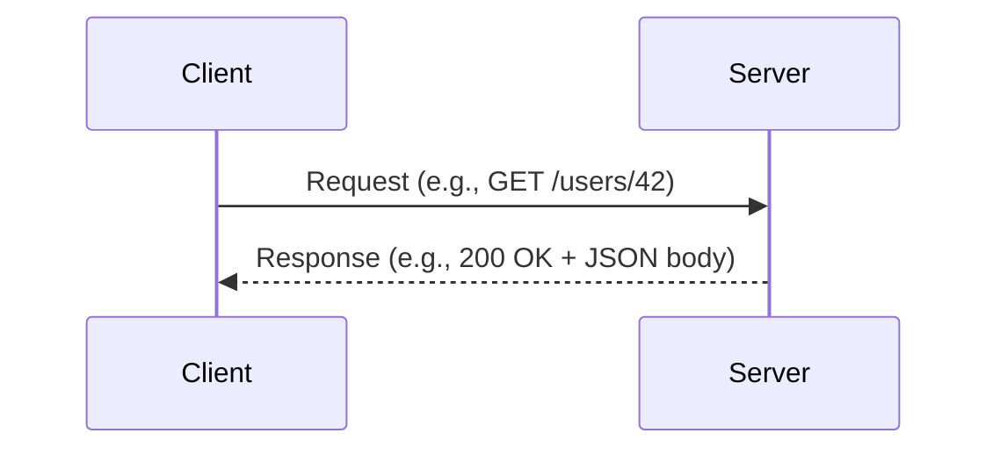

#### Common Mistakes

- Assuming the client and server are always on different machines — they may run on the same host.
- Ignoring latency: network round trips are expensive and must be accounted for in design.

#### Related Topics

HTTP fundamentals, REST, API lifecycle.

---

### HTTP Fundamentals

#### What It Is

**HTTP (HyperText Transfer Protocol)** is the foundational application-layer protocol for data exchange on the web. It is a request-response protocol: a client sends a request message; the server sends a response message.

HTTP is defined in a series of RFCs. HTTP/1.1 is defined in RFC 9110–9114 (2022 revision). HTTP/2 is defined in RFC 9113. HTTP/3 uses QUIC (RFC 9000) as the transport.

#### Why It Exists

HTTP was designed by Tim Berners-Lee at CERN in 1989 to transfer hypertext documents. It has since become the dominant protocol for all web-based API communication because it is:

- Universally supported.
- Human-readable (in HTTP/1.1).
- Easily proxied, cached, and logged.
- Stateless by design, which simplifies server implementation.

#### Key Concepts

**Request Structure**

```
METHOD /path?query HTTP/version
Header-Name: Header-Value
Header-Name: Header-Value

[Optional body]
```

**Response Structure**

```
HTTP/version STATUS_CODE Reason-Phrase
Header-Name: Header-Value

[Optional body]
```

**HTTP Methods (Verbs)**

|Method|Semantics|Safe|Idempotent|
|---|---|---|---|
|GET|Retrieve a resource|Yes|Yes|
|POST|Submit data; create a resource|No|No|
|PUT|Replace a resource entirely|No|Yes|
|PATCH|Partially update a resource|No|No*|
|DELETE|Remove a resource|No|Yes|
|HEAD|Like GET but response body is omitted|Yes|Yes|
|OPTIONS|Describe communication options|Yes|Yes|
|TRACE|Echo the request (diagnostic)|Yes|Yes|

> *PATCH idempotency depends on implementation — it is not guaranteed by the spec.

**Safe**: A method is _safe_ if it does not modify server state. Clients may call it freely without side effects.

**Idempotent**: A method is _idempotent_ if calling it N times has the same effect as calling it once. This property matters for retry logic.

**Status Code Families**

|Range|Meaning|Examples|
|---|---|---|
|1xx|Informational|100 Continue, 101 Switching|
|2xx|Success|200 OK, 201 Created, 204 No Content|
|3xx|Redirection|301 Moved Permanently, 304 Not Modified|
|4xx|Client error|400 Bad Request, 401 Unauthorized, 404 Not Found|
|5xx|Server error|500 Internal Server Error, 503 Service Unavailable|

**Key Headers**

- `Content-Type`: Describes the media type of the body (e.g., `application/json`).
- `Accept`: Tells the server what media types the client will accept.
- `Authorization`: Carries authentication credentials.
- `Cache-Control`: Directives for caching behavior.
- `ETag`: An identifier for a specific version of a resource.
- `Location`: URL of a newly created or moved resource.

#### Example

```http
POST /api/users HTTP/1.1
Host: example.com
Content-Type: application/json
Accept: application/json
Authorization: Bearer eyJhbGci...

{
  "name": "Maria Santos",
  "email": "maria@example.com"
}
```

```http
HTTP/1.1 201 Created
Content-Type: application/json
Location: /api/users/99

{
  "id": 99,
  "name": "Maria Santos",
  "email": "maria@example.com"
}
```

#### Common Mistakes

- Using `GET` with a body — HTTP allows it technically, but many proxies and servers discard GET bodies.
- Misusing status codes (e.g., returning `200 OK` for errors with an error object in the body).
- Confusing "safe" with "read-only from the user's perspective" — safety is about server state.

#### Related Topics

REST, content negotiation, OpenAPI responses.

---

### REST (Representational State Transfer)

#### What It Is

**REST** is an architectural style for distributed hypermedia systems, defined by Roy Fielding in his 2000 doctoral dissertation. It is not a protocol or standard — it is a set of architectural constraints. An API that satisfies all REST constraints is called **RESTful**.

#### Why It Exists

REST was defined to describe the architectural properties that made the web scalable and evolvable. It provides a model for building networked systems that can grow without requiring clients to be updated every time the server changes.

#### Key Concepts

**The Six REST Constraints**

1. **Client-Server**: Separate concerns. The client manages the UI; the server manages data and logic.
2. **Stateless**: No client session state is stored on the server. Every request is self-contained.
3. **Cacheable**: Responses must declare whether they are cacheable. Caching reduces latency.
4. **Uniform Interface**: All interactions use a consistent interface. This is REST's most important constraint. It consists of four sub-constraints:
    - _Identification of resources_: Resources are identified by URIs.
    - _Manipulation through representations_: Clients interact with representations (JSON, XML) of resources, not with resources directly.
    - _Self-descriptive messages_: Each message contains enough information to describe how to process it.
    - _HATEOAS (Hypermedia as the Engine of Application State)_: Responses include links to related actions.
5. **Layered System**: Clients cannot tell if they are connected to the origin server or an intermediary (proxy, gateway).
6. **Code on Demand** (optional): Servers may transfer executable code to clients (e.g., JavaScript).

**Resources and Representations**

A **resource** is any named information (a user, an order, a document). A **representation** is a snapshot of a resource's state at a given time, encoded in a particular format (JSON, XML, etc.).

**Richardson Maturity Model**

A useful (though not official) framework for measuring how RESTful an API is:

|Level|Name|Description|
|---|---|---|
|0|The Swamp of POX|Single URI, single method (e.g., XML-RPC over HTTP)|
|1|Resources|Multiple URIs; still only POST|
|2|HTTP Verbs|Correct use of GET, POST, PUT, DELETE|
|3|Hypermedia|Responses include links (HATEOAS)|

Most production REST APIs operate at Level 2. Level 3 (true HATEOAS) is rarely implemented in practice.

#### Example

```yaml
# REST resource URL design
GET    /users          # List all users
POST   /users          # Create a user
GET    /users/{id}     # Get a specific user
PUT    /users/{id}     # Replace a user
PATCH  /users/{id}     # Partially update a user
DELETE /users/{id}     # Delete a user

GET    /users/{id}/orders   # List orders for a user
POST   /users/{id}/orders   # Create an order for a user
```

#### Common Mistakes

- **REST is not just JSON over HTTP** — JSON is a common representation, but REST is architectural.
- **Not all HTTP APIs are RESTful** — Many claim to be REST but violate statelessness or the uniform interface.
- **Using verbs in URLs** — `/getUsers` or `/createOrder` violates the uniform interface; the HTTP verb carries the action.
- **Ignoring HATEOAS** — Most real-world "REST" APIs skip this, making them technically REST Level 2.

#### Related Topics

HTTP methods, OpenAPI, resource design, HATEOAS, JSON:API.

---

### RPC (Remote Procedure Call)

#### What It Is

**RPC (Remote Procedure Call)** is a paradigm in which a client invokes a function (procedure) on a remote server as if it were a local function call. The network transport and marshaling of arguments is hidden from the caller.

#### Why It Exists

REST's resource-oriented model is natural for CRUD operations but becomes awkward for action-oriented operations (e.g., `processPayment`, `sendVerificationEmail`). RPC is more natural for these use cases.

#### Key Concepts

- **Stub/Proxy**: Client-side code that looks like a local function but actually sends a network request.
- **Marshaling / Serialization**: Converting function arguments into a transmittable format (e.g., JSON, Protocol Buffers).
- **IDL (Interface Definition Language)**: A language-neutral description of the available procedures and their signatures (e.g., Protocol Buffers `.proto` files).

Modern RPC implementations include:

- **JSON-RPC**: Lightweight RPC over JSON.
- **gRPC**: Google's high-performance RPC framework using Protocol Buffers.
- **tRPC**: Type-safe RPC for TypeScript full-stack apps without a separate IDL.
- **Thrift**: Facebook's cross-language RPC framework.

#### Common Mistakes

- Modeling every API operation as an RPC action, even when resource-oriented design would be cleaner.
- Treating RPC and REST as mutually exclusive — hybrid designs exist.

#### Related Topics

gRPC, REST, OpenRPC, tRPC.

---

### SOAP (Simple Object Access Protocol)

#### What It Is

**SOAP** is an XML-based messaging protocol for exchanging structured information in web services. It uses a strict message format, relies on WSDL (Web Services Description Language) for interface description, and can run over multiple transports (HTTP, SMTP, TCP).

#### Why It Exists

SOAP was designed (late 1990s, standardized by W3C in 2003) to enable interoperable enterprise web services in a language- and platform-neutral way. It was the dominant enterprise integration approach before REST became mainstream.

#### Key Concepts

- **Envelope**: The root XML element wrapping the message.
- **Header**: Optional metadata (authentication, transaction ID).
- **Body**: The actual message payload.
- **WSDL (Web Services Description Language)**: An XML document that formally describes the SOAP service's operations, messages, and bindings. Analogous to OpenAPI for REST.
- **WS-Security**: SOAP extension for message-level security.

#### Example (SOAP Request)

```xml
<soap:Envelope xmlns:soap="http://schemas.xmlsoap.org/soap/envelope/">
  <soap:Header>
    <auth:Credentials xmlns:auth="http://example.com/auth">
      <auth:Username>admin</auth:Username>
      <auth:Password>secret</auth:Password>
    </auth:Credentials>
  </soap:Header>
  <soap:Body>
    <user:GetUser xmlns:user="http://example.com/users">
      <user:UserId>42</user:UserId>
    </user:GetUser>
  </soap:Body>
</soap:Envelope>
```

#### Common Mistakes

- Building new SOAP services for greenfield projects — REST or gRPC is generally preferred today.
- Confusing SOAP with XML REST APIs — they are different paradigms.

#### Relationship to OpenAPI

OpenAPI does not describe SOAP services. WSDL is the SOAP equivalent of OpenAPI. OpenAPI is specifically designed for HTTP/REST and HTTP-based RPC.

---

### GraphQL

#### What It Is

**GraphQL** is a query language for APIs and a runtime for fulfilling those queries, developed by Facebook (now Meta) and open-sourced in 2015. Clients specify exactly the data they need in a single query; the server returns exactly that structure.

#### Why It Exists

REST APIs suffer from two problems in complex UIs:

- **Over-fetching**: Getting more data than needed (e.g., fetching a full user object to display just a name).
- **Under-fetching**: Needing to make multiple round trips to assemble a complete view (e.g., fetch user, then fetch their orders, then fetch order items).

GraphQL addresses both with a single flexible endpoint.

#### Key Concepts

- **Schema**: A type system that describes all available data and operations.
- **Query**: A read operation.
- **Mutation**: A write operation.
- **Subscription**: A real-time data stream.
- **Resolver**: Server-side function that retrieves data for a field.
- **Introspection**: Clients can query the schema itself to discover available types and fields.

#### Relationship to OpenAPI

GraphQL has its own schema description language (SDL) and tooling. OpenAPI does not model GraphQL APIs — they are separate ecosystems. [Inference: some teams maintain both a GraphQL schema and an OpenAPI document for REST portions of their API surface, but this is not a standard practice and is not verified as common.]

---

### gRPC

#### What It Is

**gRPC** is an open-source, high-performance RPC framework developed by Google and released in 2016. It uses **Protocol Buffers (protobuf)** as the IDL and serialization format, and runs over **HTTP/2**.

#### Why It Exists

gRPC addresses use cases where REST's overhead (JSON parsing, text encoding, HTTP/1.1 limitations) is a bottleneck:

- Inter-service communication in microservices.
- Real-time streaming (bidirectional).
- Mobile clients on limited bandwidth.
- Polyglot service meshes.

#### Key Concepts

- **`.proto` file**: Defines service methods and message types. This is the contract — analogous to an OpenAPI document.
- **Streaming modes**: Unary (one request, one response), server streaming, client streaming, bidirectional streaming.
- **Code generation**: Protobuf compiler generates client and server stubs in multiple languages automatically.
- **Deadlines**: Every gRPC call can carry a deadline, after which the call is canceled.

#### Relationship to OpenAPI

gRPC uses `.proto` files as its contract format, not OpenAPI. However, the **gRPC-Gateway** project can generate a REST/JSON proxy from a `.proto` file and expose it with an OpenAPI document. [Unverified: the degree to which gRPC-Gateway is used in production at scale — consider verifying with primary sources.]

---

### WebSockets

#### What It Is

**WebSockets** is a protocol (RFC 6455) that provides full-duplex communication channels over a single TCP connection, initiated via an HTTP upgrade handshake. Once established, either party can send messages at any time.

#### Why It Exists

HTTP's request-response model requires a client to poll the server for updates. WebSockets enable real-time bidirectional communication without polling, which is more efficient for use cases like:

- Chat applications.
- Live dashboards.
- Collaborative editing.
- Gaming.

#### Relationship to OpenAPI

OpenAPI 3.x does not model WebSocket connections directly. **AsyncAPI** is the appropriate specification for describing event-driven, WebSocket, and message-based APIs (see Section 20).

---

### SSE (Server-Sent Events)

#### What It Is

**SSE (Server-Sent Events)** is a server push technology (part of the HTML Living Standard) that allows a server to push events to a client over a persistent HTTP connection. Unlike WebSockets, SSE is unidirectional: server to client only. The client uses the `EventSource` API.

#### Why It Exists

SSE is simpler than WebSockets for use cases where only the server needs to push data: live feeds, notifications, progress updates.

#### Relationship to OpenAPI

OpenAPI 3.x can partially describe SSE endpoints (the initial GET request that establishes the stream), but it cannot describe the event stream format. **AsyncAPI** or documentation annotations are used for the event structure.

---

### API Lifecycle

#### What It Is

The **API lifecycle** describes the stages an API passes through from conception to retirement:

```
Design → Build → Test → Deploy → Publish → Monitor → Version → Deprecate → Retire
```

#### Stages

|Stage|Activities|OpenAPI Role|
|---|---|---|
|Design|Define resources, operations, schemas|Authoring the OpenAPI document|
|Build|Implement the server logic|OpenAPI as implementation reference|
|Test|Unit, integration, contract, fuzz testing|OpenAPI drives test generation|
|Deploy|CI/CD pipeline, environment configuration|OpenAPI for gateway configuration|
|Publish|Documentation, developer portal, SDKs|OpenAPI powers doc sites and SDKs|
|Monitor|Observability, error tracking, usage metrics|OpenAPI enables traffic analysis|
|Version|Breaking changes, new capabilities|OpenAPI versioned alongside the API|
|Deprecate|Sunset notices, migration guidance|OpenAPI `deprecated` flag|
|Retire|Decommission|Archive the OpenAPI document|

OpenAPI participates in every stage of this lifecycle.

---

## 2. OpenAPI Fundamentals

### OpenAPI Specification (OAS)

#### What It Is

The **OpenAPI Specification (OAS)** is a language-agnostic, machine-readable description format for HTTP APIs. An OpenAPI document describes:

- The base URL(s) of the API.
- The available paths (endpoints) and HTTP operations.
- The parameters, request bodies, and response schemas for each operation.
- Authentication and authorization requirements.
- Reusable components (schemas, parameters, responses).

An OpenAPI document is written in either **YAML** or **JSON** and can be processed by a wide ecosystem of tools.

#### Why It Exists

Before OpenAPI, API documentation was either:

- Written by hand (prose or informal HTML) — difficult to keep in sync with the implementation.
- Non-existent — consumers had to read source code or reverse-engineer behavior.
- Proprietary — each vendor had a different description format.

OpenAPI provides a **standard contract** that both humans and machines can read. This enables tooling (documentation generators, SDK generators, validators, mock servers) to operate on any API described with it.

#### Key Concepts

- **Machine-readable**: Parseable by software, not just human-readable.
- **Language-agnostic**: Describes the API interface independent of the implementation language.
- **Ecosystem**: A large set of tools that consume OpenAPI documents.
- **Contract**: An agreement between API provider and consumer.

#### Relationship to Other Concepts

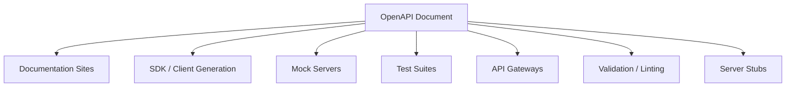

---

### History of OpenAPI

#### What It Is

A chronological account of how the specification evolved.

#### Timeline

|Year|Event|
|---|---|
|2010|Tony Tam at Wordnik creates **Swagger** to document their API|
|2011|Swagger 1.0 released publicly|
|2012|Swagger 1.1 — parameter improvements|
|2014|Swagger 2.0 — major redesign; becomes widely adopted|
|2015|SmartBear acquires Wordnik's Swagger; donates to Linux Foundation|
|2016|**OpenAPI Initiative (OAI)** formed; Swagger 2.0 renamed **OpenAPI 2.0**|
|2017|**OpenAPI 3.0.0** released — significant redesign|
|2019|OpenAPI 3.0.3 (patch release)|
|2021|**OpenAPI 3.1.0** released — aligns with JSON Schema Draft 2020-12|

The OpenAPI Initiative is a consortium under the Linux Foundation. Members include Google, Microsoft, IBM, Atlassian, MuleSoft, and others.

---

### Swagger → OpenAPI Transition

#### What It Is

"Swagger" and "OpenAPI" are frequently confused because they refer to the same specification at different points in its history.

|Term|Meaning|
|---|---|
|Swagger 2.0|The specification document (now called OpenAPI 2.0)|
|OpenAPI 2.0|Same document; the name used after the rebrand|
|Swagger UI|A documentation rendering tool (still called Swagger UI)|
|Swagger Editor|An online editor (still called Swagger Editor)|
|Swagger Codegen|A code generation tool (still called Swagger Codegen)|

**Key distinction**: "Swagger" as a specification is deprecated. "OpenAPI" is the current specification. "Swagger UI," "Swagger Editor," and "Swagger Codegen" are _tools_ that still use the Swagger brand name.

#### Common Mistakes

- Using "Swagger" to mean the specification when referring to OAS 3.x.
- Assuming "Swagger tools" only work with Swagger 2.0 — most have been updated for OAS 3.x.

---

### OAS 2.0 (Swagger 2.0)

#### What It Is

OpenAPI 2.0 (released 2014 as Swagger 2.0) was the first broadly adopted version. Its key characteristics:

- Top-level fields: `swagger`, `info`, `host`, `basePath`, `schemes`, `paths`, `definitions`, `parameters`, `responses`, `securityDefinitions`, `tags`.
- Request body defined inline using `in: body` parameter (only one allowed).
- Limited content type control (global `consumes`/`produces`).
- No native support for `oneOf`, `anyOf`, `not` (JSON Schema draft 4 subset only).
- Security schemes: `basic`, `apiKey`, `oauth2`.

#### Example (OAS 2.0 Snippet)

```yaml
swagger: "2.0"
info:
  title: Example API
  version: "1.0"
host: api.example.com
basePath: /v1
schemes:
  - https
paths:
  /users/{id}:
    get:
      summary: Get a user
      parameters:
        - name: id
          in: path
          required: true
          type: integer
      responses:
        200:
          description: User found
          schema:
            $ref: '#/definitions/User'
definitions:
  User:
    type: object
    properties:
      id:
        type: integer
      name:
        type: string
```

---

### OAS 3.0

#### What It Is

OpenAPI 3.0 (released 2017) was a significant redesign addressing limitations in 2.0:

**Key changes from 2.0:**

|Feature|OAS 2.0|OAS 3.0|
|---|---|---|
|Request body|`in: body` parameter|Separate `requestBody` object|
|Multiple servers|`host` + `basePath` (single)|`servers` array (multiple)|
|Components|`definitions`, `parameters`, `responses` (separate)|Single `components` section|
|Content types|Global `consumes`/`produces`|Per-operation `content` map|
|Links|Not supported|`links` object|
|Callbacks|Not supported|`callbacks` object|
|JSON Schema|Draft 4 subset|Extended draft 4 (with `nullable`)|
|Security|Basic, API key, OAuth2|Added `openIdConnect`, `http` (bearer)|

#### Example (OAS 3.0 Snippet)

```yaml
openapi: "3.0.3"
info:
  title: Example API
  version: "1.0.0"
servers:
  - url: https://api.example.com/v1
paths:
  /users/{id}:
    get:
      summary: Get a user
      parameters:
        - name: id
          in: path
          required: true
          schema:
            type: integer
      responses:
        "200":
          description: User found
          content:
            application/json:
              schema:
                $ref: '#/components/schemas/User'
components:
  schemas:
    User:
      type: object
      properties:
        id:
          type: integer
        name:
          type: string
```

---

### OAS 3.1

#### What It Is

OpenAPI 3.1 (released February 2021) is the current major version. Its most significant change is **full alignment with JSON Schema Draft 2020-12**, replacing the previously divergent schema dialect.

**Key changes from 3.0:**

|Feature|OAS 3.0|OAS 3.1|
|---|---|---|
|JSON Schema alignment|Extended draft 4|Full Draft 2020-12|
|Nullable types|`nullable: true` (OAS extension)|`type: ["string", "null"]` (JSON Schema standard)|
|`$schema`|Not supported|Supported per-schema|
|`$vocabulary`|Not supported|Supported|
|Webhooks|Not supported (workarounds via callbacks)|First-class `webhooks` field|
|`type` field|Single string|Can be array or string|
|`exclusiveMinimum`/`exclusiveMaximum`|Boolean flags|Numeric values (JSON Schema standard)|
|`pathItems` in components|Not supported|Supported|

#### The `nullable` Migration

This is the most common OAS 3.0 → 3.1 migration pain point:

```yaml
# OAS 3.0 — nullable
name:
  type: string
  nullable: true

# OAS 3.1 — JSON Schema standard
name:
  type: ["string", "null"]
```

#### Example (OAS 3.1 Snippet)

```yaml
openapi: "3.1.0"
info:
  title: Example API
  version: "1.0.0"
  summary: A user management API
webhooks:
  userCreated:
    post:
      requestBody:
        content:
          application/json:
            schema:
              $ref: '#/components/schemas/User'
      responses:
        "200":
          description: Webhook received
servers:
  - url: https://api.example.com/v1
paths:
  /users/{id}:
    get:
      summary: Get a user
      parameters:
        - name: id
          in: path
          required: true
          schema:
            type: integer
      responses:
        "200":
          description: User found
          content:
            application/json:
              schema:
                $ref: '#/components/schemas/User'
components:
  schemas:
    User:
      type: object
      required:
        - id
        - name
      properties:
        id:
          type: integer
        name:
          type: string
        email:
          type: ["string", "null"]
```

---

### Version Comparison Table

|Feature|OAS 2.0|OAS 3.0|OAS 3.1|
|---|---|---|---|
|Top-level key|`swagger: "2.0"`|`openapi: "3.0.x"`|`openapi: "3.1.x"`|
|JSON Schema|Draft 4 subset|Extended Draft 4|Full Draft 2020-12|
|Request body|`in: body` param|`requestBody` object|`requestBody` object|
|Servers|`host` + `basePath`|`servers[]`|`servers[]`|
|Components|Scattered top-level|`components`|`components` (+ pathItems)|
|Webhooks|No|No|Yes (`webhooks`)|
|Links|No|Yes|Yes|
|Callbacks|No|Yes|Yes|
|OpenID Connect|No|Yes|Yes|
|`nullable`|Not native|`nullable: true`|JSON Schema `type` array|
|Tooling support|Widely supported|Widely supported|Growing support|

---

### Relationship to JSON Schema

#### What It Is

**JSON Schema** is a vocabulary for annotating and validating JSON documents. OpenAPI uses JSON Schema (or a dialect of it) to describe the structure of request bodies, response bodies, and parameters.

#### The Historical Divergence and Convergence

OAS 2.0 and 3.0 used modified subsets of JSON Schema that added OpenAPI-specific keywords (`nullable`, `discriminator`, `example`) and omitted or changed others. This caused incompatibility between OpenAPI schema validators and standard JSON Schema validators.

OAS 3.1 resolved this by adopting JSON Schema Draft 2020-12 as its schema dialect, with OpenAPI-specific vocabulary added via the `$vocabulary` mechanism. This means:

- A valid OAS 3.1 schema is also a valid JSON Schema (with the appropriate vocabulary).
- Standard JSON Schema validators can process OAS 3.1 schemas.

#### Key JSON Schema Keywords Used in OpenAPI

|Keyword|Purpose|
|---|---|
|`type`|Data type (`string`, `integer`, `number`, `boolean`, `array`, `object`, `null`)|
|`properties`|Named sub-schemas for object fields|
|`required`|Array of required property names|
|`items`|Schema for array elements|
|`enum`|Allowed values|
|`format`|Semantic format hint (`date-time`, `email`, `uuid`, etc.)|
|`minimum`, `maximum`|Numeric range constraints|
|`minLength`, `maxLength`|String length constraints|
|`pattern`|Regex constraint on strings|
|`allOf`, `oneOf`, `anyOf`, `not`|Schema composition|
|`$ref`|Reference to another schema|
|`additionalProperties`|Schema for properties not listed in `properties`|
|`default`|Default value|
|`description`|Human-readable description|

---

## 3. OpenAPI Document Structure

### Overview

An OpenAPI document is a single JSON or YAML file (or a set of files connected by `$ref` references) that describes an API. The document has a defined set of top-level fields.

```yaml
openapi: "3.1.0"         # Required
info: {...}               # Required
servers: [...]            # Optional
paths: {...}              # Required (or webhooks)
webhooks: {...}           # Optional (OAS 3.1+)
components: {...}         # Optional
security: [...]           # Optional
tags: [...]               # Optional
externalDocs: {...}       # Optional
```

---

### The `openapi` Field

#### What It Is

A required string declaring the OpenAPI Specification version used by the document.

```yaml
openapi: "3.1.0"
```

This field tells tooling which version of the spec to use when parsing and validating the document. It is **not** the API version (that goes in `info.version`).

#### Common Mistakes

- Setting `openapi: "3.0"` instead of `openapi: "3.0.3"` — the value must be the full semantic version.
- Confusing the spec version with the API version.

---

### The `info` Object

#### What It Is

The `info` object provides metadata about the API.

```yaml
info:
  title: "User Management API"          # Required
  version: "2.1.0"                      # Required
  description: |
    This API manages user accounts.
    Supports CRUD operations and authentication.
  summary: "User account management"   # OAS 3.1+
  termsOfService: "https://example.com/terms"
  contact:
    name: "API Support"
    url: "https://example.com/support"
    email: "api@example.com"
  license:
    name: "Apache 2.0"
    url: "https://www.apache.org/licenses/LICENSE-2.0.html"
    identifier: "Apache-2.0"           # OAS 3.1+ (SPDX identifier)
```

#### Fields

|Field|Required|Description|
|---|---|---|
|`title`|Yes|Human-readable name of the API|
|`version`|Yes|Version of the _API_ (not the spec)|
|`description`|No|CommonMark markdown description|
|`summary`|No (3.1+)|Short one-line summary|
|`termsOfService`|No|URL to the terms of service|
|`contact`|No|Contact information object|
|`license`|No|License information object|

#### Common Mistakes

- Setting `version` to the OAS spec version instead of the API version.
- Leaving `description` empty — it is the primary place to document auth requirements, rate limits, and conventions.

---

### The `servers` Array

#### What It Is

Declares one or more base URLs for the API. Every path in the document is relative to these base URLs.

```yaml
servers:
  - url: "https://api.example.com/v1"
    description: "Production"
  - url: "https://staging-api.example.com/v1"
    description: "Staging"
  - url: "http://localhost:3000/v1"
    description: "Local development"
```

#### Server Variables

Server URLs can include template variables for dynamic base URLs:

```yaml
servers:
  - url: "https://{tenant}.api.example.com/{version}"
    description: "Multi-tenant API"
    variables:
      tenant:
        default: "demo"
        description: "Tenant subdomain"
      version:
        enum:
          - "v1"
          - "v2"
        default: "v1"
```

#### Common Mistakes

- Omitting the `servers` field — if absent, the default is `[{url: "/"}]`, meaning a relative path. This can break absolute URL resolution in tooling.
- Including trailing slashes — by convention, server URLs do not include trailing slashes.

---

### The `paths` Object

#### What It Is

The core of the OpenAPI document. A map of path template strings to **Path Item Objects**, each describing the operations available at that path.

```yaml
paths:
  /users:
    get:
      summary: List users
      ...
    post:
      summary: Create a user
      ...
  /users/{id}:
    parameters:
      - name: id
        in: path
        required: true
        schema:
          type: integer
    get:
      summary: Get a user
      ...
    put:
      summary: Replace a user
      ...
    delete:
      summary: Delete a user
      ...
```

#### Path Templating

Curly braces define path parameters: `/users/{id}`. The parameter must be declared either at the path item level or in each operation.

#### Common Mistakes

- Defining paths that overlap (e.g., `/users/me` and `/users/{id}`) without understanding that tooling resolves these in declaration order.
- Using query parameters in the path string — query parameters belong in the `parameters` list, not the path template.

---

### The `components` Object

#### What It Is

A container for reusable objects. Anything defined in `components` does nothing on its own — it must be referenced via `$ref` to be active.

```yaml
components:
  schemas: {}
  responses: {}
  parameters: {}
  examples: {}
  requestBodies: {}
  headers: {}
  securitySchemes: {}
  links: {}
  callbacks: {}
  pathItems: {}        # OAS 3.1+
```

#### Common Mistakes

- Defining schemas in `components` but forgetting to `$ref` them anywhere — they have no effect.
- Not using `components` and instead repeating schemas inline — this violates DRY and makes maintenance harder.

---

### The `security` Array (Top Level)

#### What It Is

Declares the default security requirements for all operations in the document. Each element is a **Security Requirement Object**: a map of security scheme names to scopes.

```yaml
security:
  - bearerAuth: []        # Requires bearerAuth scheme; no scopes needed
  - oauth2:
      - read:users
      - write:users
```

Individual operations can override or remove the top-level security requirement.

---

### The `tags` Array

#### What It Is

Provides metadata for tags used to group operations. Tags can have descriptions and external documentation links.

```yaml
tags:
  - name: users
    description: "Operations related to user accounts"
    externalDocs:
      url: "https://docs.example.com/users"
  - name: orders
    description: "Order management operations"
```

Operations reference tags by name. Documentation tools (Swagger UI, ReDoc) use tags to group and organize endpoints in the rendered view.

---

### The `externalDocs` Object

#### What It Is

A link to external documentation for the API or a specific component.

```yaml
externalDocs:
  description: "Full developer documentation"
  url: "https://docs.example.com"
```

Can appear at the top level, on individual operations, and on schema objects.

---

## 4. Paths and Operations

### Path Item Object

#### What It Is

Each entry in the `paths` map is a **Path Item Object** that may contain:

- HTTP operation objects (`get`, `post`, `put`, `patch`, `delete`, `head`, `options`, `trace`)
- Shared `parameters` (applied to all operations on this path)
- A `summary` and `description` for the path
- A `$ref` to another path item

```yaml
paths:
  /users/{id}:
    summary: "Operations on a specific user"
    description: "Read, update, or delete a user by their unique ID."
    parameters:
      - name: id
        in: path
        required: true
        schema:
          type: integer
          minimum: 1
    get:
      ...
    put:
      ...
    delete:
      ...
```

---

### Operation Object

#### What It Is

An **Operation Object** describes a single HTTP operation on a path. It is the most detail-rich object in OpenAPI.

```yaml
get:
  tags:
    - users
  summary: "Get a user by ID"
  description: |
    Returns a single user. The caller must be authenticated.
    Returns 404 if the user does not exist.
  operationId: getUserById
  externalDocs:
    url: "https://docs.example.com/users/get"
  parameters:
    - $ref: '#/components/parameters/UserIdParam'
  requestBody:
    ...  # Not applicable for GET; used in POST/PUT/PATCH
  responses:
    "200":
      ...
    "404":
      ...
  callbacks:
    ...
  deprecated: false
  security:
    - bearerAuth: []
  servers:
    - url: "https://api.example.com/v1"
```

#### Key Fields

|Field|Required|Description|
|---|---|---|
|`tags`|No|Groups for documentation|
|`summary`|No|Short description (≤120 chars recommended)|
|`description`|No|Full CommonMark description|
|`operationId`|No|Unique string identifier for the operation|
|`parameters`|No|Parameters for this operation (merged with path-level)|
|`requestBody`|No|Request body (POST, PUT, PATCH)|
|`responses`|Yes|Map of status codes to response definitions|
|`callbacks`|No|Out-of-band callbacks|
|`deprecated`|No|`true` marks the operation as deprecated|
|`security`|No|Overrides top-level security|
|`servers`|No|Overrides top-level servers|

---

### `operationId`

#### What It Is

A case-sensitive string that must be unique across all operations in the document. It identifies an operation.

```yaml
get:
  operationId: getUserById
post:
  operationId: createUser
put:
  operationId: updateUser
delete:
  operationId: deleteUser
```

#### Why It Matters

Code generators use `operationId` as the function/method name in generated clients. If absent, generators derive a name from the path and method (often ugly). If not unique, behavior is undefined.

#### Naming Conventions

- Use camelCase: `getUserById`
- Use verb + noun pattern: `listUsers`, `createOrder`, `updateUserEmail`
- Be consistent — choose a convention and apply it everywhere

#### Common Mistakes

- Duplicate `operationId` values — this is a spec violation.
- Generic names like `get1`, `post2` — these produce unusable generated clients.

---

### HTTP Methods in Detail

#### GET

Used to retrieve a resource or collection. Must be safe and idempotent. Must not have a request body (by convention — tooling and proxies may discard it).

```yaml
get:
  operationId: listUsers
  summary: "List all users"
  parameters:
    - name: page
      in: query
      schema:
        type: integer
        default: 1
    - name: limit
      in: query
      schema:
        type: integer
        default: 20
        maximum: 100
  responses:
    "200":
      description: "A page of users"
      content:
        application/json:
          schema:
            $ref: '#/components/schemas/UserPage'
```

#### POST

Used to submit data to create a new resource or trigger a process. Not idempotent (calling twice may create two resources). Returns `201 Created` with a `Location` header for resource creation, or `200 OK` for processing operations.

```yaml
post:
  operationId: createUser
  summary: "Create a new user"
  requestBody:
    required: true
    content:
      application/json:
        schema:
          $ref: '#/components/schemas/CreateUserRequest'
  responses:
    "201":
      description: "User created"
      headers:
        Location:
          schema:
            type: string
            example: "/users/99"
      content:
        application/json:
          schema:
            $ref: '#/components/schemas/User'
    "422":
      description: "Validation error"
      content:
        application/json:
          schema:
            $ref: '#/components/schemas/ValidationError'
```

#### PUT

Replaces a resource entirely. Idempotent — calling the same PUT twice results in the same state. The client must send the complete resource representation.

```yaml
put:
  operationId: replaceUser
  summary: "Replace a user's data"
  requestBody:
    required: true
    content:
      application/json:
        schema:
          $ref: '#/components/schemas/UserInput'
  responses:
    "200":
      description: "User replaced"
      content:
        application/json:
          schema:
            $ref: '#/components/schemas/User'
    "404":
      $ref: '#/components/responses/NotFound'
```

#### PATCH

Partially updates a resource. Only the provided fields are updated. Not inherently idempotent (depends on implementation). Uses **JSON Patch** (RFC 6902), **JSON Merge Patch** (RFC 7396), or a custom partial object format.

```yaml
patch:
  operationId: updateUser
  summary: "Partially update a user"
  requestBody:
    required: true
    content:
      application/merge-patch+json:
        schema:
          $ref: '#/components/schemas/UserPatch'
  responses:
    "200":
      description: "User updated"
      content:
        application/json:
          schema:
            $ref: '#/components/schemas/User'
```

#### DELETE

Removes a resource. Idempotent — deleting an already-deleted resource should return `404` (not an error from the client's perspective per idempotency). Returns `204 No Content` (no body) or `200 OK` with the deleted resource.

```yaml
delete:
  operationId: deleteUser
  summary: "Delete a user"
  responses:
    "204":
      description: "User deleted"
    "404":
      $ref: '#/components/responses/NotFound'
```

#### HEAD

Identical to GET but the server must not send a response body. Used to check resource existence or retrieve metadata (headers) without transferring the full body.

```yaml
head:
  operationId: checkUser
  summary: "Check if user exists"
  responses:
    "200":
      description: "User exists"
    "404":
      description: "User not found"
```

#### OPTIONS

Returns the communication options for the target resource. Used by browsers for **CORS preflight requests**. Typically handled by the framework, not manually defined in OpenAPI.

#### TRACE

Echoes the received request back to the client. Used for diagnostic purposes. Rarely exposed in public APIs due to security concerns (can leak authentication headers).

---

### Responses Object

#### What It Is

A map of HTTP status codes (as strings) to **Response Objects**. At least one response must be defined.

```yaml
responses:
  "200":
    description: "Success"
    content:
      application/json:
        schema:
          $ref: '#/components/schemas/User'
  "400":
    $ref: '#/components/responses/BadRequest'
  "401":
    $ref: '#/components/responses/Unauthorized'
  "404":
    $ref: '#/components/responses/NotFound'
  "500":
    $ref: '#/components/responses/InternalServerError'
  default:
    $ref: '#/components/responses/UnexpectedError'
```

The `default` key catches any status code not explicitly listed.

---

### Callbacks

#### What It Is

A **Callback Object** describes out-of-band asynchronous operations that the server will call on the client (webhook-style). The server sends requests to a URL provided in the original request.

```yaml
post:
  operationId: subscribeToEvents
  summary: "Subscribe to order events"
  requestBody:
    required: true
    content:
      application/json:
        schema:
          type: object
          properties:
            callbackUrl:
              type: string
              format: uri
  callbacks:
    onOrderShipped:
      "{$request.body#/callbackUrl}":
        post:
          summary: "Order shipped notification"
          requestBody:
            content:
              application/json:
                schema:
                  $ref: '#/components/schemas/OrderShippedEvent'
          responses:
            "200":
              description: "Callback received"
  responses:
    "201":
      description: "Subscription created"
```

`{$request.body#/callbackUrl}` is a **Runtime Expression** (see Section 21).

---

### Links

#### What It Is

A **Link Object** describes a possible operation that may be performed using the response. Links model state transitions — they tell clients what they can do next.

```yaml
responses:
  "201":
    description: "User created"
    content:
      application/json:
        schema:
          $ref: '#/components/schemas/User'
    links:
      GetUserById:
        operationId: getUserById
        parameters:
          id: "$response.body#/id"
        description: "Use the `id` from this response to call `getUserById`"
```

Links are similar to HATEOAS but described at design time rather than embedded in runtime responses.

---

## 5. Parameters

### Parameter Object

#### What It Is

A **Parameter Object** describes a single input to an operation. Parameters are in one of four locations (`in` field): `path`, `query`, `header`, `cookie`.

```yaml
parameters:
  - name: id              # Required
    in: path              # Required: path | query | header | cookie
    description: "User ID"
    required: true        # Required for path params; optional otherwise
    deprecated: false
    schema:
      type: integer
      minimum: 1
    example: 42
```

---

### Path Parameters

#### What It Is

Variables embedded in the URL path, denoted by curly braces. Must have `required: true`.

```yaml
# Path: /users/{userId}/orders/{orderId}
parameters:
  - name: userId
    in: path
    required: true
    schema:
      type: integer
  - name: orderId
    in: path
    required: true
    schema:
      type: string
      format: uuid
```

---

### Query Parameters

#### What It Is

Key-value pairs appended to the URL after `?`. Optional by default.

```yaml
parameters:
  - name: status
    in: query
    schema:
      type: string
      enum: [active, inactive, pending]
  - name: tags
    in: query
    schema:
      type: array
      items:
        type: string
    style: form
    explode: true
```

---

### Header Parameters

#### What It Is

Custom HTTP request headers. Note: `Authorization`, `Content-Type`, and `Accept` are not defined as parameters — they are handled by the security and content negotiation machinery.

```yaml
parameters:
  - name: X-Request-ID
    in: header
    required: false
    schema:
      type: string
      format: uuid
    description: "Client-provided idempotency key"
```

---

### Cookie Parameters

#### What It Is

Parameters sent in the `Cookie` header.

```yaml
parameters:
  - name: session_id
    in: cookie
    schema:
      type: string
```

---

### Serialization Styles

#### What It Is

The `style` and `explode` fields control how parameter values are serialized into strings.

#### Style Reference Table

|Style|Applies To|Primitive|Array|Object|
|---|---|---|---|---|
|`simple`|path, header|`/users/5`|`/users/3,4,5`|`/users/role,admin,active,true`|
|`label`|path|`/users/.5`|`/users/.3,4,5`|`/users/.role=admin.active=true`|
|`matrix`|path|`/users/;id=5`|`/users/;id=3,4,5`|`/users/;role=admin;active=true`|
|`form`|query, cookie|`?id=5`|`?id=3,4,5` or `?id=3&id=4&id=5`|`?role=admin&active=true`|
|`spaceDelimited`|query|—|`?id=3%204%205`|—|
|`pipeDelimited`|query|—|`?id=3\|4\|5`|—|
|`deepObject`|query|—|—|`?filter[role]=admin&filter[active]=true`|

#### `explode` Field

When `explode: true`, arrays and objects are expanded into separate key-value pairs. When `false`, they are comma-separated.

```yaml
# Array with style: form, explode: true (default for form)
# ?tags=typescript&tags=nodejs&tags=api

# Array with style: form, explode: false
# ?tags=typescript,nodejs,api

parameters:
  - name: tags
    in: query
    schema:
      type: array
      items:
        type: string
    style: form
    explode: true
```

#### `deepObject` Example

Used for serializing objects as query parameters:

```yaml
parameters:
  - name: filter
    in: query
    style: deepObject
    explode: true
    schema:
      type: object
      properties:
        status:
          type: string
        role:
          type: string
# Produces: ?filter[status]=active&filter[role]=admin
```

#### `pipeDelimited` Example

```yaml
parameters:
  - name: ids
    in: query
    style: pipeDelimited
    explode: false
    schema:
      type: array
      items:
        type: integer
# Produces: ?ids=1|2|3
```

#### Common Mistakes

- Not specifying `style` for array query parameters — the default `form` + `explode: true` produces `?id=1&id=2`, which some servers don't parse.
- Using `deepObject` style without confirming the server framework supports it.

---

## 6. Request Bodies

### Request Body Object

#### What It Is

The `requestBody` object describes the body of a request for operations that accept one (POST, PUT, PATCH, and sometimes DELETE).

```yaml
requestBody:
  description: "User creation payload"
  required: true
  content:
    application/json:
      schema:
        $ref: '#/components/schemas/CreateUserRequest'
      examples:
        standard:
          summary: "Standard user creation"
          value:
            name: "Maria Santos"
            email: "maria@example.com"
            role: "member"
        admin:
          summary: "Admin user creation"
          value:
            name: "Juan dela Cruz"
            email: "juan@example.com"
            role: "admin"
```

The `content` field is a map of media type strings to **Media Type Objects**.

---

### JSON Request Bodies

The most common format. Media type: `application/json`.

```yaml
content:
  application/json:
    schema:
      type: object
      required:
        - name
        - email
      properties:
        name:
          type: string
          minLength: 1
          maxLength: 100
        email:
          type: string
          format: email
        age:
          type: integer
          minimum: 0
          maximum: 150
```

---

### XML Request Bodies

Media type: `application/xml`. OpenAPI supports XML with the `xml` keyword on schemas.

```yaml
content:
  application/xml:
    schema:
      type: object
      xml:
        name: "User"
      properties:
        name:
          type: string
          xml:
            attribute: false
        id:
          type: integer
          xml:
            attribute: true
            name: "user_id"
```

---

### Form Data

URL-encoded form data. Media type: `application/x-www-form-urlencoded`.

```yaml
content:
  application/x-www-form-urlencoded:
    schema:
      type: object
      properties:
        username:
          type: string
        password:
          type: string
          format: password
    encoding:
      password:
        contentType: text/plain
```

---

### Multipart Data

Used for forms that contain files or mixed content. Media type: `multipart/form-data`.

```yaml
content:
  multipart/form-data:
    schema:
      type: object
      properties:
        file:
          type: string
          format: binary
        description:
          type: string
        metadata:
          type: object
          properties:
            category:
              type: string
    encoding:
      file:
        contentType: image/png, image/jpeg
      metadata:
        contentType: application/json
```

---

### File Uploads

#### Binary Upload (raw body)

```yaml
content:
  application/octet-stream:
    schema:
      type: string
      format: binary
```

#### Multipart File Upload

```yaml
content:
  multipart/form-data:
    schema:
      type: object
      required:
        - file
      properties:
        file:
          type: string
          format: binary
          description: "The file to upload (max 10MB)"
        filename:
          type: string
          description: "Override filename"
```

---

### Content Negotiation

**Content negotiation** is the mechanism by which a client and server agree on the format of exchanged data.

- The client sends `Accept: application/json` to indicate what it can receive.
- The client sends `Content-Type: application/json` to indicate what it is sending.
- The server sends `Content-Type: application/json` to indicate what it is returning.

In OpenAPI, the `content` map supports multiple media types per operation:

```yaml
requestBody:
  content:
    application/json:
      schema:
        $ref: '#/components/schemas/User'
    application/xml:
      schema:
        $ref: '#/components/schemas/User'
    text/plain:
      schema:
        type: string
```

---

## 7. Responses

### Response Object

#### What It Is

Describes a single response from an operation.

```yaml
"200":
  description: "User retrieved successfully"   # Required
  headers:
    X-RateLimit-Remaining:
      schema:
        type: integer
      description: "Remaining rate limit"
  content:
    application/json:
      schema:
        $ref: '#/components/schemas/User'
  links:
    GetUserOrders:
      operationId: listUserOrders
      parameters:
        userId: "$response.body#/id"
```

---

### HTTP Status Code Selection

#### Success Codes

|Code|Meaning|When to Use|
|---|---|---|
|200 OK|General success|GET, PUT, PATCH with response body|
|201 Created|Resource created|POST that creates a resource|
|202 Accepted|Request accepted, processing async|Long-running operations|
|204 No Content|Success, no body|DELETE, POST/PUT with no response body|
|206 Partial Content|Partial GET response|Range requests, streaming|

#### Client Error Codes

|Code|Meaning|When to Use|
|---|---|---|
|400 Bad Request|Malformed request syntax|Invalid JSON, missing required fields|
|401 Unauthorized|Authentication required or failed|Missing or invalid credentials|
|403 Forbidden|Authenticated but not authorized|Insufficient permissions|
|404 Not Found|Resource does not exist|Unknown ID|
|405 Method Not Allowed|HTTP method not supported|POST to a read-only endpoint|
|409 Conflict|State conflict|Duplicate creation, optimistic lock failure|
|410 Gone|Resource permanently deleted|Intentional tombstone|
|422 Unprocessable Entity|Semantically invalid request|Validation errors (business rules)|
|429 Too Many Requests|Rate limit exceeded|Throttling|

#### Server Error Codes

|Code|Meaning|When to Use|
|---|---|---|
|500 Internal Server Error|Unexpected server failure|Unhandled exceptions|
|502 Bad Gateway|Upstream server error|Proxy/gateway failures|
|503 Service Unavailable|Temporarily unavailable|Maintenance, overload|
|504 Gateway Timeout|Upstream timeout|Slow upstream services|

---

### Error Response Design

#### RFC 7807 (Problem Details)

RFC 7807 defines a standard JSON format for HTTP error responses. Using it makes errors machine-readable and consistent.

```json
{
  "type": "https://example.com/errors/validation-failed",
  "title": "Validation Failed",
  "status": 422,
  "detail": "The 'email' field must be a valid email address.",
  "instance": "/api/users/create-request-2024-001",
  "errors": [
    {
      "field": "email",
      "message": "Invalid email format"
    }
  ]
}
```

OpenAPI schema for RFC 7807:

```yaml
components:
  schemas:
    ProblemDetails:
      type: object
      properties:
        type:
          type: string
          format: uri
          description: "URI identifying the error type"
        title:
          type: string
          description: "Short human-readable summary"
        status:
          type: integer
          description: "HTTP status code"
        detail:
          type: string
          description: "Detailed human-readable explanation"
        instance:
          type: string
          format: uri
          description: "URI identifying this specific occurrence"
      required:
        - type
        - title
```

---

### Response Headers

Headers returned by the server are documented in the response's `headers` field:

```yaml
"200":
  description: "Success"
  headers:
    X-Total-Count:
      description: "Total number of items across all pages"
      schema:
        type: integer
    X-RateLimit-Limit:
      description: "Maximum requests per window"
      schema:
        type: integer
    X-RateLimit-Remaining:
      description: "Remaining requests in current window"
      schema:
        type: integer
    X-RateLimit-Reset:
      description: "Epoch timestamp when the window resets"
      schema:
        type: integer
        format: int64
```

---

### Default Response

The `default` response acts as a catch-all for any status code not explicitly listed:

```yaml
responses:
  "200":
    description: "Success"
    content:
      application/json:
        schema:
          $ref: '#/components/schemas/User'
  default:
    description: "Unexpected error"
    content:
      application/json:
        schema:
          $ref: '#/components/schemas/ProblemDetails'
```

---

## 8. Schema Design

### JSON Schema Fundamentals in OpenAPI

#### Data Types

OAS 3.1 uses JSON Schema Draft 2020-12 types:

|Type|Description|Example|
|---|---|---|
|`string`|Text|`"hello"`|
|`integer`|Whole numbers|`42`|
|`number`|Any number|`3.14`|
|`boolean`|True/false|`true`|
|`array`|Ordered list|`[1, 2, 3]`|
|`object`|Key-value map|`{"a": 1}`|
|`null`|Null value|`null`|

```yaml
# OAS 3.1 — type can be an array
properties:
  count:
    type: integer
  ratio:
    type: number
  name:
    type: string
  active:
    type: boolean
  nullable_field:
    type: ["string", "null"]   # OAS 3.1
  tags:
    type: array
    items:
      type: string
  address:
    type: object
    properties:
      street:
        type: string
      city:
        type: string
```

---

### String Formats

The `format` keyword provides a semantic hint but does not automatically validate:

|Format|Description|
|---|---|
|`date`|RFC 3339 date: `2024-01-15`|
|`date-time`|RFC 3339 datetime: `2024-01-15T10:30:00Z`|
|`time`|RFC 3339 time: `10:30:00Z`|
|`duration`|ISO 8601 duration: `P1Y2M3D`|
|`email`|Email address|
|`idn-email`|Internationalized email|
|`hostname`|Hostname|
|`uri`|URI|
|`uri-reference`|URI or relative reference|
|`uuid`|UUID: `550e8400-e29b-41d4-a716-446655440000`|
|`ipv4`|IPv4 address|
|`ipv6`|IPv6 address|
|`password`|Hint to UIs to mask input|
|`byte`|Base64-encoded data|
|`binary`|Raw binary (file uploads)|
|`int32`|32-bit signed integer|
|`int64`|64-bit signed integer|
|`float`|32-bit float|
|`double`|64-bit float|

---

### Validation Keywords

```yaml
# String validation
name:
  type: string
  minLength: 1
  maxLength: 100
  pattern: "^[A-Za-z ]+$"

# Number validation
age:
  type: integer
  minimum: 0
  maximum: 150
  exclusiveMinimum: 0    # OAS 3.0: boolean; OAS 3.1: numeric
  multipleOf: 1

# Array validation
tags:
  type: array
  minItems: 1
  maxItems: 10
  uniqueItems: true
  items:
    type: string

# Object validation
user:
  type: object
  minProperties: 1
  maxProperties: 50
  required:
    - id
    - name
  properties:
    id:
      type: integer
    name:
      type: string
  additionalProperties: false   # Disallow undocumented properties
```

---

### Required Fields

```yaml
type: object
required:
  - id
  - email
properties:
  id:
    type: integer
  email:
    type: string
    format: email
  name:
    type: string      # Optional — not in required array
```

`required` is an array on the _object schema_, not a property of each field.

---

### Enumerations

```yaml
status:
  type: string
  enum:
    - active
    - inactive
    - pending
    - banned
  default: active
  description: "User account status"
```

For typed enums with descriptions, consider using `oneOf` with `const`:

```yaml
status:
  oneOf:
    - const: active
      description: "Account is active and can authenticate"
    - const: inactive
      description: "Account is disabled by administrator"
    - const: pending
      description: "Awaiting email verification"
```

---

### `allOf` — Schema Intersection

#### What It Is

The instance must be valid against **all** of the listed schemas. Used for schema composition and inheritance.

```yaml
# Base schema
components:
  schemas:
    BaseEntity:
      type: object
      required:
        - id
        - createdAt
        - updatedAt
      properties:
        id:
          type: integer
        createdAt:
          type: string
          format: date-time
        updatedAt:
          type: string
          format: date-time

    User:
      allOf:
        - $ref: '#/components/schemas/BaseEntity'
        - type: object
          required:
            - email
          properties:
            email:
              type: string
              format: email
            name:
              type: string
```

#### Common Mistakes

- Using `allOf` with schemas that have conflicting `additionalProperties: false` — this creates an unsatisfiable schema.
- Confusing `allOf` with `oneOf` — `allOf` means "and", `oneOf` means "exactly one of".

---

### `oneOf` — Exclusive Union

#### What It Is

The instance must be valid against **exactly one** of the listed schemas. Used for polymorphic types.

```yaml
components:
  schemas:
    PaymentMethod:
      oneOf:
        - $ref: '#/components/schemas/CreditCard'
        - $ref: '#/components/schemas/BankTransfer'
        - $ref: '#/components/schemas/Cryptocurrency'
      discriminator:
        propertyName: type
        mapping:
          credit_card: '#/components/schemas/CreditCard'
          bank_transfer: '#/components/schemas/BankTransfer'
          cryptocurrency: '#/components/schemas/Cryptocurrency'
```

#### Performance Note

`oneOf` requires validating against every listed schema and checking that exactly one matches. With many schemas or deep nesting, this can be expensive. [Inference: this concern applies primarily to runtime request validation, not document-level linting.]

---

### `anyOf` — Non-exclusive Union

#### What It Is

The instance must be valid against **at least one** of the listed schemas. Less strict than `oneOf`.

```yaml
# An address that can be domestic or international (or both)
address:
  anyOf:
    - $ref: '#/components/schemas/DomesticAddress'
    - $ref: '#/components/schemas/InternationalAddress'
```

---

### `not` — Negation

#### What It Is

The instance must **not** be valid against the provided schema.

```yaml
# Any value except null
value:
  not:
    type: "null"

# Any string that is not an email
identifier:
  type: string
  not:
    format: email
```

---

### The `discriminator` Object

#### What It Is

A hint to tooling and validators that identifies which specific schema in a `oneOf`, `anyOf`, or `allOf` applies to a given instance, based on the value of a specific property.

```yaml
components:
  schemas:
    Animal:
      oneOf:
        - $ref: '#/components/schemas/Dog'
        - $ref: '#/components/schemas/Cat'
        - $ref: '#/components/schemas/Bird'
      discriminator:
        propertyName: animalType
        mapping:
          dog: '#/components/schemas/Dog'
          cat: '#/components/schemas/Cat'
          bird: '#/components/schemas/Bird'

    Dog:
      type: object
      required:
        - animalType
        - breed
      properties:
        animalType:
          type: string
          const: dog
        breed:
          type: string

    Cat:
      type: object
      required:
        - animalType
        - indoor
      properties:
        animalType:
          type: string
          const: cat
        indoor:
          type: boolean
```

The discriminator property (`animalType`) must be present in each concrete schema and its value must match the mapping key.

---

### Examples

```yaml
properties:
  email:
    type: string
    format: email
    example: "user@example.com"

# Multiple examples using the `examples` keyword (OAS 3.0+)
requestBody:
  content:
    application/json:
      schema:
        $ref: '#/components/schemas/User'
      examples:
        basicUser:
          summary: "A basic user"
          value:
            name: "Maria Santos"
            email: "maria@example.com"
        adminUser:
          summary: "An admin user"
          value:
            name: "Juan dela Cruz"
            email: "juan@admin.example.com"
            role: "admin"
        externalExample:
          summary: "From external file"
          externalValue: "https://example.com/examples/user.json"
```

---

## 9. Components

### What It Is

The `components` section is a registry of reusable objects. Everything defined here is only active when referenced elsewhere via `$ref`.

### Using `$ref`

`$ref` is a JSON Reference — a pointer to another location in the same document or an external document.

```yaml
# Local reference
schema:
  $ref: '#/components/schemas/User'

# External file reference
schema:
  $ref: './schemas/user.yaml'

# External URL reference (not recommended for production)
schema:
  $ref: 'https://raw.githubusercontent.com/example/api/main/schemas/user.yaml'
```

---

### Reusable Schemas

```yaml
components:
  schemas:
    User:
      type: object
      required: [id, email]
      properties:
        id:
          type: integer
        email:
          type: string
          format: email
        name:
          type: string

    UserList:
      type: object
      properties:
        data:
          type: array
          items:
            $ref: '#/components/schemas/User'
        pagination:
          $ref: '#/components/schemas/Pagination'

    Pagination:
      type: object
      properties:
        page:
          type: integer
        limit:
          type: integer
        total:
          type: integer
        totalPages:
          type: integer
```

---

### Reusable Parameters

```yaml
components:
  parameters:
    UserIdParam:
      name: userId
      in: path
      required: true
      schema:
        type: integer
        minimum: 1

    PageParam:
      name: page
      in: query
      schema:
        type: integer
        default: 1
        minimum: 1

    LimitParam:
      name: limit
      in: query
      schema:
        type: integer
        default: 20
        minimum: 1
        maximum: 100
```

---

### Reusable Responses

```yaml
components:
  responses:
    NotFound:
      description: "The requested resource was not found"
      content:
        application/json:
          schema:
            $ref: '#/components/schemas/ProblemDetails'
          example:
            type: "https://example.com/errors/not-found"
            title: "Not Found"
            status: 404

    Unauthorized:
      description: "Authentication is required"
      content:
        application/json:
          schema:
            $ref: '#/components/schemas/ProblemDetails'
      headers:
        WWW-Authenticate:
          schema:
            type: string
            example: 'Bearer realm="API"'

    UnprocessableEntity:
      description: "Validation error"
      content:
        application/json:
          schema:
            $ref: '#/components/schemas/ValidationError'
```

---

### Reusable Request Bodies

```yaml
components:
  requestBodies:
    CreateUserBody:
      required: true
      description: "New user creation payload"
      content:
        application/json:
          schema:
            $ref: '#/components/schemas/CreateUserRequest'
```

---

### Reusable Headers

```yaml
components:
  headers:
    X-RateLimit-Limit:
      description: "Rate limit ceiling for this endpoint"
      schema:
        type: integer
    X-Request-ID:
      description: "Unique request identifier"
      schema:
        type: string
        format: uuid
```

---

### Reusable Examples

```yaml
components:
  examples:
    UserExample:
      summary: "A typical user object"
      value:
        id: 42
        email: "user@example.com"
        name: "Maria Santos"

    ValidationErrorExample:
      summary: "A validation error"
      value:
        type: "https://example.com/errors/validation"
        title: "Validation Failed"
        status: 422
        errors:
          - field: "email"
            message: "Must be a valid email address"
```

---

### Reusable Security Schemes

```yaml
components:
  securitySchemes:
    bearerAuth:
      type: http
      scheme: bearer
      bearerFormat: JWT

    apiKey:
      type: apiKey
      in: header
      name: X-API-Key

    oauth2:
      type: oauth2
      flows:
        authorizationCode:
          authorizationUrl: "https://auth.example.com/authorize"
          tokenUrl: "https://auth.example.com/token"
          scopes:
            read:users: "Read user data"
            write:users: "Create and modify users"
```

---

### DRY Principles in OpenAPI

**DRY (Don't Repeat Yourself)** applied to OpenAPI:

- Define a schema once in `components/schemas`, reference it everywhere.
- Use `$ref` for any structure used more than once.
- Define common parameters (pagination, auth headers) in `components/parameters`.
- Define standard error responses in `components/responses`.

**Anti-pattern**: Inline duplication

```yaml
# BAD — duplicated schema
paths:
  /users/{id}:
    get:
      responses:
        "200":
          content:
            application/json:
              schema:
                type: object
                properties:
                  id:
                    type: integer
                  email:
                    type: string
  /admins/{id}:
    get:
      responses:
        "200":
          content:
            application/json:
              schema:
                type: object
                properties:
                  id:
                    type: integer
                  email:
                    type: string
```

```yaml
# GOOD — centralized schema
components:
  schemas:
    Principal:
      type: object
      properties:
        id:
          type: integer
        email:
          type: string

paths:
  /users/{id}:
    get:
      responses:
        "200":
          content:
            application/json:
              schema:
                $ref: '#/components/schemas/Principal'
  /admins/{id}:
    get:
      responses:
        "200":
          content:
            application/json:
              schema:
                $ref: '#/components/schemas/Principal'
```

---

## 10. Security

### Security Overview

OpenAPI describes _how_ an API is secured — the schemes that clients must use. It does not describe the security implementation inside the server. Declared security requirements are documentation and tooling hints, not enforcement mechanisms.

Security is declared in two places:

1. `components/securitySchemes` — defines the available security schemes.
2. `security` (top-level or per-operation) — specifies which schemes apply.

---

### API Key Security

```yaml
components:
  securitySchemes:
    ApiKeyHeader:
      type: apiKey
      in: header
      name: X-API-Key
      description: "Pass your API key in the X-API-Key header"

    ApiKeyQuery:
      type: apiKey
      in: query
      name: api_key
      description: "Pass your API key as a query parameter"

    ApiKeyCookie:
      type: apiKey
      in: cookie
      name: api_key

security:
  - ApiKeyHeader: []
```

**Security considerations**: API keys in query strings appear in server logs and browser history. Header-based keys are preferable. Cookie-based keys require CSRF protection.

---

### HTTP Basic Authentication

```yaml
components:
  securitySchemes:
    basicAuth:
      type: http
      scheme: basic
      description: "Base64-encoded username:password in Authorization header"
```

Basic auth transmits credentials as base64 (not encrypted). It must only be used over HTTPS.

---

### Bearer Token / JWT

```yaml
components:
  securitySchemes:
    bearerAuth:
      type: http
      scheme: bearer
      bearerFormat: JWT
      description: "JWT Bearer token. Obtain from POST /auth/token"
```

The `bearerFormat` field is documentation-only — it does not affect validation.

Usage in operations:

```yaml
security:
  - bearerAuth: []
```

To make an operation public (override top-level security):

```yaml
get:
  operationId: getPublicData
  security: []   # Empty array = no security required
```

---

### OAuth 2.0

**OAuth 2.0** (RFC 6749) is an authorization framework that enables a third-party application to obtain limited access to an HTTP service on behalf of a resource owner.

#### OAuth 2.0 Terminology

|Term|Description|
|---|---|
|Resource Owner|The user who owns the data|
|Client|The application requesting access|
|Authorization Server|Issues tokens after authenticating the resource owner|
|Resource Server|The API being accessed|
|Access Token|Credential that grants access to the resource server|
|Refresh Token|Used to obtain a new access token without re-authentication|
|Scope|Named permission (e.g., `read:users`, `write:orders`)|

#### Authorization Code Flow

The most secure flow for server-side applications.

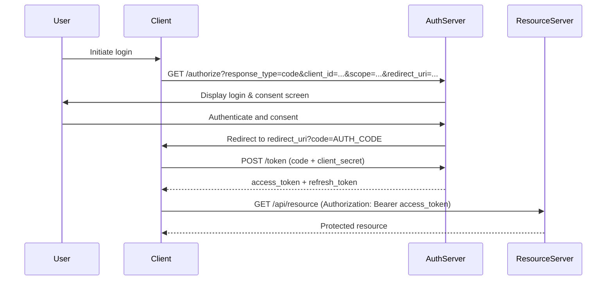

#### Authorization Code + PKCE

**PKCE (Proof Key for Code Exchange)** (RFC 7636) protects the authorization code flow for public clients (mobile apps, SPAs) that cannot securely store a client secret.

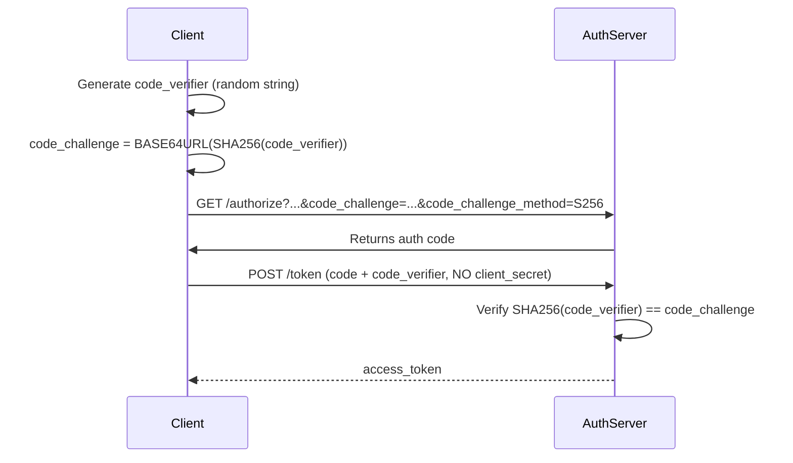

#### Client Credentials Flow

For machine-to-machine communication where no user is involved.

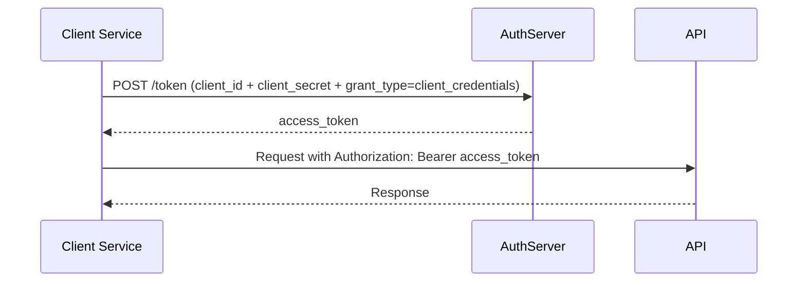

#### Device Authorization Flow

For devices with limited input capability (smart TVs, IoT devices).

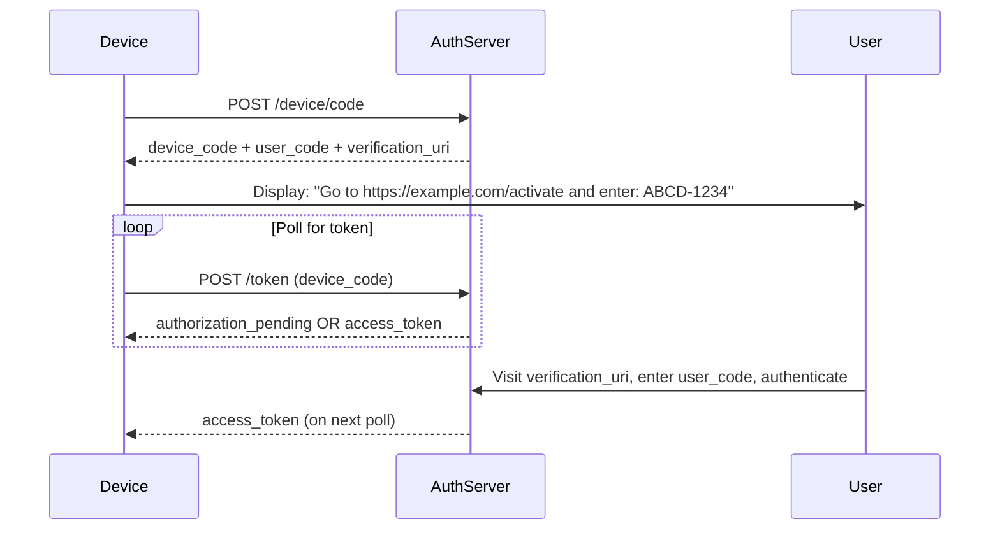

#### OAuth 2.0 in OpenAPI

```yaml
components:
  securitySchemes:
    oauth2:
      type: oauth2
      flows:
        authorizationCode:
          authorizationUrl: "https://auth.example.com/authorize"
          tokenUrl: "https://auth.example.com/token"
          refreshUrl: "https://auth.example.com/refresh"
          scopes:
            read:users: "Read user profiles"
            write:users: "Create and modify users"
            delete:users: "Delete users"
        clientCredentials:
          tokenUrl: "https://auth.example.com/token"
          scopes:
            api:read: "Read access to all resources"
            api:write: "Write access to all resources"
        deviceCode:
          authorizationUrl: "https://auth.example.com/device/code"
          tokenUrl: "https://auth.example.com/token"
          scopes:
            profile: "Access user profile"
        implicit:
          authorizationUrl: "https://auth.example.com/authorize"
          scopes:
            profile: "Access user profile"

# Applying specific scopes to an operation
paths:
  /users:
    post:
      security:
        - oauth2:
            - write:users
```

> **Note**: The implicit flow is deprecated by OAuth 2.1 and should not be used in new implementations.

---

### OpenID Connect

**OpenID Connect (OIDC)** is an identity layer built on top of OAuth 2.0. OAuth 2.0 handles _authorization_ (access to resources); OIDC handles _authentication_ (verifying user identity). OIDC adds an **ID token** (a JWT) that contains user identity claims.

```yaml
components:
  securitySchemes:
    openIdConnect:
      type: openIdConnect
      openIdConnectUrl: "https://auth.example.com/.well-known/openid-configuration"
```

The `openIdConnectUrl` points to a discovery document that describes the OIDC provider's endpoints, supported scopes, and signing keys.

---

### Mutual TLS (mTLS)

In standard TLS, only the server presents a certificate. In **mTLS (Mutual TLS)**, both the client and server present certificates, providing strong client authentication.

```yaml
components:
  securitySchemes:
    mutualTLS:
      type: mutualTLS
      description: "Client certificate required"
```

mTLS is the `mutualTLS` security scheme type added in OAS 3.1.

---

### Security Requirement Objects

A **Security Requirement Object** specifies which security scheme(s) must be satisfied. Multiple schemes within one object mean AND; multiple objects in the array mean OR.

```yaml
# AND: requires BOTH apiKey AND bearerAuth
security:
  - apiKey: []
    bearerAuth: []

# OR: requires EITHER oauth2 OR bearerAuth
security:
  - oauth2:
      - read:users
  - bearerAuth: []
```

---

## 11. Authentication vs Authorization

### Definitions

|Term|Definition|
|---|---|
|**Authentication (AuthN)**|Verifying _who_ a user is ("Are you who you claim to be?")|
|**Authorization (AuthZ)**|Determining _what_ an authenticated user may do ("Are you allowed to do this?")|
|**Identity**|The unique representation of a user or entity in the system|
|**Principal**|The authenticated entity (user, service, system) making a request|
|**Role**|A named collection of permissions (e.g., `admin`, `member`, `read-only`)|
|**Permission**|The right to perform a specific action on a specific resource|
|**Scope**|An OAuth 2.0 mechanism to limit the access granted by a token|
|**Claim**|A statement about an entity in a JWT (e.g., `sub`, `email`, `roles`)|

---

### Authentication Flows Summary

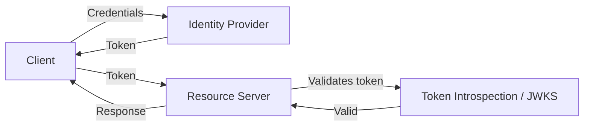

---

### JWT Structure

A **JWT (JSON Web Token)** consists of three base64url-encoded parts separated by dots:

```
HEADER.PAYLOAD.SIGNATURE
```

**Header:**

```json
{
  "alg": "RS256",
  "typ": "JWT",
  "kid": "key-id-2024"
}
```

**Payload (Claims):**

```json
{
  "sub": "user-123",
  "iss": "https://auth.example.com",
  "aud": "https://api.example.com",
  "exp": 1704067200,
  "iat": 1704063600,
  "email": "user@example.com",
  "roles": ["member", "buyer"],
  "scope": "read:users write:orders"
}
```

**Signature**: `RS256` signature of `base64url(header) + "." + base64url(payload)` using the issuer's private key.

---

### Modeling RBAC in OpenAPI

OpenAPI does not have a native mechanism for expressing role-based access at the operation level — it models which security _scheme_ applies, not which _role_ or _permission_ is required. This detail is documented in `description` fields and in API governance documentation.

```yaml
paths:
  /admin/users:
    get:
      summary: "List all users (admin only)"
      description: |
        **Required role**: `admin`

        This endpoint is restricted to users with the `admin` role.
        Access attempts by non-admin users will return `403 Forbidden`.
      security:
        - bearerAuth: []
      responses:
        "200":
          description: "User list"
          content:
            application/json:
              schema:
                $ref: '#/components/schemas/UserList'
        "403":
          $ref: '#/components/responses/Forbidden'
```

[Inference: some teams use vendor extensions (`x-required-roles`, `x-permissions`) to express authorization requirements in a machine-readable way, but there is no standard for this.]

---

### Scopes as Authorization Signals

OAuth 2.0 scopes are a coarse-grained authorization mechanism. They are the primary machine-readable authorization signal in OpenAPI.

```yaml
paths:
  /users:
    get:
      security:
        - oauth2:
            - read:users       # Read scope required
    post:
      security:
        - oauth2:
            - write:users      # Write scope required
  /users/{id}:
    delete:
      security:
        - oauth2:
            - delete:users     # Delete scope required
```

---

## 12. OpenAPI Tooling

### Documentation Tools

#### Swagger UI

**What it is**: An open-source, browser-based UI that renders an OpenAPI document as interactive documentation. Users can read operation descriptions and execute requests directly from the browser.

**Strengths**:

- Free, open source, widely recognized.
- Built-in "Try it out" functionality.
- Easy to self-host.

**Weaknesses**:

- Default visual design is dated.
- Handling of very large documents can be slow.
- Limited customization without forking.

**When to use**: Fast, free documentation for internal tools and developer portals.

---

#### ReDoc

**What it is**: An open-source documentation renderer with a clean, responsive three-panel layout. Focuses on readability over interactivity.

**Strengths**:

- Clean, professional default design.
- Excellent handling of nested schemas.
- Supports code samples via vendor extensions.

**Weaknesses**:

- No "Try it out" in the open-source version.
- Advanced features require ReDoc paid plan.

**When to use**: Public-facing documentation where readability is a priority.

---

#### Stoplight

**What it is**: A commercial API design and documentation platform. Includes Elements (a documentation renderer), Spectral (a linter), and a visual design UI.

**Strengths**:

- Full-featured API design platform.
- Hosted documentation.
- Enterprise governance features.

**Weaknesses**:

- Paid product for most features.

---

### Editors

#### Swagger Editor

**What it is**: An open-source, browser-based YAML/JSON editor for OpenAPI documents with real-time validation and Swagger UI preview.

**Strengths**:

- Free, no installation required (online at editor.swagger.io).
- Instant validation feedback.

**Weaknesses**:

- Basic text editing; limited IDE features.
- No team collaboration.

---

#### Stoplight Studio

**What it is**: A desktop and web application for visual OpenAPI design. Supports both form-based and text-based editing.

**Strengths**:

- Visual editing reduces YAML syntax errors.
- Built-in linting with Spectral.
- Git integration.

**Weaknesses**:

- Paid for team/enterprise features.

---

### Validation / Linting Tools

#### Spectral

**What it is**: An open-source JSON/YAML linter by Stoplight. Supports built-in OAS rules and fully custom rulesets.

**Strengths**:

- Highly customizable rulesets.
- Integrates into CI/CD pipelines.
- Active community ruleset ecosystem.

**Basic usage:**

```bash
npm install -g @stoplight/spectral-cli
spectral lint openapi.yaml
```

**Custom ruleset example (`spectral.yaml`):**

```yaml
extends: ["spectral:oas"]
rules:
  operation-must-have-tags:
    description: "Every operation must have at least one tag"
    given: "$.paths[*][get,post,put,patch,delete]"
    severity: error
    then:
      field: tags
      function: truthy

  operationId-kebab-case:
    description: "operationId must use camelCase"
    given: "$.paths[*][*].operationId"
    severity: warn
    then:
      function: pattern
      functionOptions:
        match: "^[a-z][a-zA-Z0-9]*$"
```

---

#### openapi-cli (Redocly CLI)

**What it is**: A CLI tool from Redocly for linting, bundling, splitting, and previewing OpenAPI documents.

**Strengths**:

- Bundles multi-file documents.
- Preview server with ReDoc.
- Custom plugin support.

```bash
npm install -g @redocly/cli
redocly lint openapi.yaml
redocly bundle openapi.yaml -o bundled.yaml
```

---

### Mocking Tools

#### Prism

**What it is**: An open-source HTTP mock server by Stoplight. Reads an OpenAPI document and serves mock responses based on schema examples.

**Strengths**:

- Zero-config mock server from an OpenAPI document.
- Validates incoming requests against the spec.
- Dynamic mock generation from schemas.

```bash
npm install -g @stoplight/prism-cli
prism mock openapi.yaml
# Server runs on http://localhost:4010
```

**Weaknesses**:

- Mock responses may not match complex business logic.
- Dynamic generation can produce unrealistic data.

---

#### WireMock

**What it is**: A Java-based HTTP mock server with an OpenAPI import capability. Supports stateful mocking, conditional responses, and proxying.

**Strengths**:

- Highly configurable stub matching.
- Can record and replay real API responses.
- Mature, battle-tested.

**Weaknesses**:

- Java runtime required.
- More configuration overhead than Prism.

---

### Testing Tools

#### Postman

**What it is**: A GUI and CLI API development platform. Supports importing OpenAPI documents to generate collections, and writing tests in JavaScript.

**Strengths**:

- Excellent developer experience.
- Supports environments, variables, pre-request scripts.
- Team collaboration and sharing.

**Weaknesses**:

- GUI-heavy; less suited for pure CI pipelines without Newman.

---

#### Newman

**What it is**: The command-line runner for Postman collections. Enables running Postman collections in CI/CD pipelines.

```bash
npm install -g newman
newman run collection.json -e environment.json --reporters cli,junit
```

---

#### Dredd

**What it is**: An open-source HTTP API testing tool that validates API implementations against their OpenAPI (or API Blueprint) document.

**Strengths**:

- Contract-first testing — verifies the implementation matches the spec.
- Supports hooks for test setup/teardown.

**Weaknesses**:

- [Unverified: current maintenance status. Verify against the Dredd GitHub repository before adopting for new projects.]

---

#### Schemathesis

**What it is**: An open-source property-based and fuzz testing tool for web APIs based on OpenAPI schemas.

**Strengths**:

- Automatically generates test cases from the OpenAPI schema.
- Finds edge cases not covered by hand-written tests.
- Supports stateful testing (dependent operations).
- CI/CD friendly.

```bash
pip install schemathesis
schemathesis run https://api.example.com/openapi.json --checks all
```

---

### SDK Generation

#### OpenAPI Generator

**What it is**: An open-source code generation tool (fork of Swagger Codegen) that generates client SDKs, server stubs, and documentation in 40+ languages.

**Strengths**:

- Broad language support.
- Customizable templates (Mustache).
- Active community.

```bash
# Generate a TypeScript Axios client
npx @openapitools/openapi-generator-cli generate \
  -i openapi.yaml \
  -g typescript-axios \
  -o ./generated/client
```

**Weaknesses**:

- Generated code quality varies by generator.
- Template customization has a learning curve.
- Not all generators are equally well-maintained. [Unverified: specific generator quality — evaluate each target language generator independently.]

---

#### Swagger Codegen

**What it is**: The original code generation tool from SmartBear. OpenAPI Generator is a community fork with more active development.

[Inference: OpenAPI Generator is generally preferred for new projects over Swagger Codegen, but this depends on specific language targets and organizational preferences.]

---

### API Gateways

#### Kong

**What it is**: An open-source API gateway built on NGINX. Supports OpenAPI document import for route configuration, rate limiting, authentication, and more.

**Strengths**:

- Highly extensible plugin ecosystem.
- Both open-source and enterprise editions.
- Supports declarative configuration (Kong Deck).

---

#### Tyk

**What it is**: An open-source API management platform. Supports OpenAPI document import and API lifecycle management.

**Strengths**:

- Full API management suite.
- Go-based (high performance).
- Self-hosted and cloud options.

---

#### Apigee

**What it is**: Google Cloud's enterprise API management platform. Supports OpenAPI for documentation, proxying, and governance.

**Strengths**:

- Full enterprise feature set.
- Deep Google Cloud integration.
- Advanced analytics.

**Weaknesses**:

- Significant cost for enterprise usage.
- Complex configuration.

---

## 13. Contract-First Development

### API Design Paradigms

#### Code-First (Implementation-First)

The implementation is written first; the OpenAPI document is generated from code annotations or reflection.

**Advantages**:

- Developers work in familiar tools (IDE, language).
- Always in sync with implementation (generated, not hand-written).
- Faster initial development.

**Disadvantages**:

- API design is constrained by code structure.
- Design quality depends on developer discipline.
- Consumers cannot work in parallel with implementation.
- Risk of poor API design driven by implementation convenience.

**Example tools**: FastAPI (auto-generates from Python type hints), NestJS decorators, Spring Boot Springdoc.

---

#### Design-First / Contract-First

The OpenAPI document is written first, before any implementation. The contract drives development.

**Advantages**:

- Forces deliberate API design decisions.
- Enables parallel development (server + client teams work simultaneously using mocks).
- Document is the source of truth — no implementation drift.
- Consumer feedback can be gathered before a line of implementation code is written.

**Disadvantages**:

- Requires developers to be comfortable with YAML/JSON.
- Changes to the design require updating the document and then the implementation.
- Tooling setup cost.

---

#### Design-First Workflow

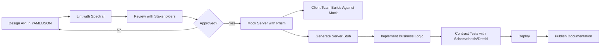

---

### Contract Drift

**Contract drift** occurs when the implementation diverges from the OpenAPI document. This is a critical problem that must be actively managed.

Prevention strategies:

- Generate the document from code (code-first) — but sacrifices design quality.
- Run contract tests in CI/CD — fail the build if the implementation doesn't match the spec.
- Use Schemathesis or Dredd as part of the test suite.
- Treat the OpenAPI document as a first-class artifact with code review.

---

### Example: Design-First Project Structure

```
my-api/
├── openapi/
│   ├── openapi.yaml           # Main document (entry point)
│   ├── paths/
│   │   ├── users.yaml
│   │   └── orders.yaml
│   └── components/
│       ├── schemas/
│       │   ├── User.yaml
│       │   └── Order.yaml
│       ├── responses/
│       │   ├── NotFound.yaml
│       │   └── Unauthorized.yaml
│       └── parameters/
│           └── pagination.yaml
├── src/
│   └── ...implementation...
└── tests/
    └── contract/
        └── schemathesis.yaml
```

---

## 14. OpenAPI in Popular Frameworks

### JavaScript / TypeScript

#### Express

Express has no native OpenAPI support. Third-party middleware is required.

**`express-openapi-validator`** — validates requests and responses against an OpenAPI document at runtime.

```typescript
import * as OpenApiValidator from 'express-openapi-validator';
import express from 'express';

const app = express();
app.use(express.json());

app.use(
  OpenApiValidator.middleware({
    apiSpec: './openapi.yaml',
    validateRequests: true,
    validateResponses: true,
  })
);

app.get('/users/:id', (req, res) => {
  res.json({ id: req.params.id, name: 'Maria Santos' });
});
```

**`swagger-jsdoc`** — generates OpenAPI documents from JSDoc comments.

---

#### Fastify

Fastify has first-class JSON Schema integration. Route schemas validate input and output and can be used to generate OpenAPI documents.

```typescript
import Fastify from 'fastify';
import fastifySwagger from '@fastify/swagger';
import fastifySwaggerUi from '@fastify/swagger-ui';

const app = Fastify();

await app.register(fastifySwagger, {
  openapi: {
    openapi: '3.1.0',
    info: {
      title: 'User API',
      version: '1.0.0',
    },
  },
});

await app.register(fastifySwaggerUi, {
  routePrefix: '/docs',
});

const getUserSchema = {
  schema: {
    params: {
      type: 'object',
      properties: {
        id: { type: 'integer' },
      },
      required: ['id'],
    },
    response: {
      200: {
        type: 'object',
        properties: {
          id: { type: 'integer' },
          name: { type: 'string' },
        },
      },
    },
  },
};

app.get('/users/:id', getUserSchema, async (request, reply) => {
  const { id } = request.params as { id: number };
  return { id, name: 'Maria Santos' };
});

await app.ready();
```

---

#### NestJS

NestJS provides first-class OpenAPI support via the `@nestjs/swagger` package and decorators.

```typescript
import { ApiProperty, ApiOperation, ApiResponse } from '@nestjs/swagger';
import { Controller, Get, Param } from '@nestjs/common';

class UserDto {
  @ApiProperty({ description: 'User ID', example: 42 })
  id: number;

  @ApiProperty({ description: 'Full name', example: 'Maria Santos' })
  name: string;
}

@Controller('users')
export class UsersController {
  @Get(':id')
  @ApiOperation({ summary: 'Get a user by ID' })
  @ApiResponse({ status: 200, type: UserDto })
  @ApiResponse({ status: 404, description: 'User not found' })
  async getUser(@Param('id') id: number): Promise<UserDto> {
    return { id, name: 'Maria Santos' };
  }
}
```

```typescript
// main.ts — setup Swagger UI
import { SwaggerModule, DocumentBuilder } from '@nestjs/swagger';

const config = new DocumentBuilder()
  .setTitle('User API')
  .setVersion('1.0')
  .addBearerAuth()
  .build();

const document = SwaggerModule.createDocument(app, config);
SwaggerModule.setup('api-docs', app, document);
```

---

### Python

#### FastAPI

FastAPI is designed around OpenAPI. It generates an OpenAPI 3.x document automatically from Python type hints and Pydantic models.

```python
from fastapi import FastAPI
from pydantic import BaseModel, EmailStr
from typing import Optional

app = FastAPI(
    title="User API",
    version="1.0.0",
    description="A user management API",
)

class UserCreate(BaseModel):
    name: str
    email: EmailStr
    age: Optional[int] = None

class User(UserCreate):
    id: int

@app.post("/users", response_model=User, status_code=201)
async def create_user(user: UserCreate) -> User:
    """
    Create a new user.

    - **name**: Full name (required)
    - **email**: Valid email address (required)
    - **age**: Age in years (optional)
    """
    return User(id=99, **user.dict())

@app.get("/users/{user_id}", response_model=User)
async def get_user(user_id: int) -> User:
    """Get a user by their ID."""
    return User(id=user_id, name="Maria Santos", email="maria@example.com")

# Swagger UI available at /docs
# ReDoc available at /redoc
# OpenAPI JSON at /openapi.json
```

---

#### Django REST Framework

```python
# With drf-spectacular for OpenAPI generation
from drf_spectacular.utils import extend_schema, OpenApiParameter
from rest_framework import viewsets
from rest_framework.decorators import action

class UserViewSet(viewsets.ModelViewSet):
    @extend_schema(
        summary="List users",
        parameters=[
            OpenApiParameter(name="status", type=str, location="query"),
        ],
        responses={200: UserSerializer(many=True)},
    )
    def list(self, request):
        ...
```

---

#### Flask

```python
# With flask-openapi3
from flask_openapi3 import OpenAPI, Info
from pydantic import BaseModel

app = OpenAPI(__name__, info=Info(title="User API", version="1.0.0"))

class UserPath(BaseModel):
    user_id: int

class UserResponse(BaseModel):
    id: int
    name: str

@app.get("/users/<int:user_id>", responses={"200": UserResponse})
def get_user(path: UserPath):
    return UserResponse(id=path.user_id, name="Maria Santos").dict()
```

---

### Java — Spring Boot

```java
// With springdoc-openapi
import io.swagger.v3.oas.annotations.*;
import io.swagger.v3.oas.annotations.media.*;
import io.swagger.v3.oas.annotations.responses.*;

@RestController
@RequestMapping("/api/users")
@Tag(name = "Users", description = "User management operations")
public class UserController {

    @GetMapping("/{id}")
    @Operation(summary = "Get a user by ID")
    @ApiResponses({
        @ApiResponse(responseCode = "200", description = "User found",
            content = @Content(schema = @Schema(implementation = User.class))),
        @ApiResponse(responseCode = "404", description = "User not found")
    })
    public ResponseEntity<User> getUser(@PathVariable Long id) {
        return ResponseEntity.ok(new User(id, "Maria Santos"));
    }
}
```

OpenAPI JSON is available at `/v3/api-docs`.

---

### Go

#### Gin with swaggo

```go
// @title User API
// @version 1.0
// @description A user management API
// @host localhost:8080
// @BasePath /api/v1

// @Summary Get a user
// @Description Get a user by their ID
// @Tags users
// @Produce json
// @Param id path int true "User ID"
// @Success 200 {object} User
// @Failure 404 {object} ErrorResponse
// @Router /users/{id} [get]
func GetUser(c *gin.Context) {
    id, _ := strconv.Atoi(c.Param("id"))
    c.JSON(200, User{ID: id, Name: "Maria Santos"})
}
```

---

### .NET — ASP.NET Core

```csharp
// With Swashbuckle or NSwag
[ApiController]
[Route("api/[controller]")]
[Produces("application/json")]
public class UsersController : ControllerBase
{
    /// <summary>Get a user by ID</summary>
    /// <param name="id">The user ID</param>
    /// <returns>The user object</returns>
    /// <response code="200">Returns the user</response>
    /// <response code="404">User not found</response>
    [HttpGet("{id}")]
    [ProducesResponseType(typeof(User), StatusCodes.Status200OK)]
    [ProducesResponseType(StatusCodes.Status404NotFound)]
    public ActionResult<User> GetUser(int id)
    {
        return Ok(new User { Id = id, Name = "Maria Santos" });
    }
}
```

---

## 15. Code Generation

### Overview

Code generation reads an OpenAPI document and produces source code — client SDKs, server stubs, or documentation. This reduces boilerplate, keeps code in sync with the spec, and speeds up integration.

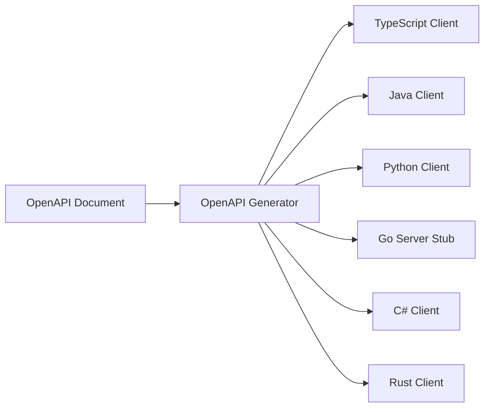

---

### Client Generation

Clients handle authentication, request serialization, response deserialization, and error handling.

#### TypeScript (Axios)

```bash
npx @openapitools/openapi-generator-cli generate \
  -i openapi.yaml \
  -g typescript-axios \
  -o ./src/generated/api \
  --additional-properties=supportsES6=true,withInterfaces=true
```

Generated usage:

```typescript
import { UsersApi, Configuration } from './generated/api';

const config = new Configuration({
  basePath: 'https://api.example.com/v1',
  accessToken: 'my-jwt-token',
});

const usersApi = new UsersApi(config);
const user = await usersApi.getUserById(42);
```

---

#### Python

```bash
openapi-generator-cli generate \
  -i openapi.yaml \
  -g python \
  -o ./generated/python-client \
  --additional-properties=packageName=my_api_client
```

Generated usage:

```python
import my_api_client
from my_api_client.api import users_api

configuration = my_api_client.Configuration(
    host="https://api.example.com/v1",
    access_token="my-jwt-token"
)

with my_api_client.ApiClient(configuration) as api_client:
    api = users_api.UsersApi(api_client)
    user = api.get_user_by_id(user_id=42)
```

---

#### Java

```bash
openapi-generator-cli generate \
  -i openapi.yaml \
  -g java \
  -o ./generated/java-client \
  --additional-properties=library=okhttp-gson,invokerPackage=com.example.client
```

---

#### Go

```bash
openapi-generator-cli generate \
  -i openapi.yaml \
  -g go \
  -o ./generated/go-client \
  --additional-properties=packageName=userclient
```

---

### Server Stub Generation

Server stubs provide the routing and interface structure; developers fill in the business logic.

```bash
# Generate a Spring Boot server stub
openapi-generator-cli generate \
  -i openapi.yaml \
  -g spring \
  -o ./generated/spring-server \
  --additional-properties=interfaceOnly=true,java8=true

# Generate a Node.js/Express stub
openapi-generator-cli generate \
  -i openapi.yaml \
  -g nodejs-express-server \
  -o ./generated/node-server
```

---

### Generation Workflow

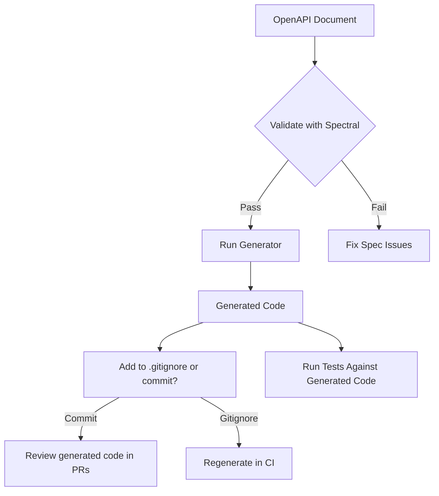

**To commit or not to commit generated code?**

|Approach|Pros|Cons|
|---|---|---|
|Commit|Deterministic builds; reviewable diffs|Merge conflicts; stale generated code|
|Generate in CI|Always fresh; no maintenance|Slower builds; generator version drift|

---

### Common Generation Mistakes

- **Not pinning the generator version** — generators change behavior between versions. Always pin: `@openapitools/openapi-generator-cli@7.x.x`.
- **Editing generated code directly** — changes will be lost on next regeneration.
- **Ignoring `operationId`** — missing or duplicate IDs produce ugly method names.
- **Using formats generators don't support** — some generators have limited support for OAS 3.1 features. [Unverified: specific version compatibility — verify generator changelog for your target language.]

---

## 16. API Testing

### Unit Testing

Tests individual functions, validators, or schema objects in isolation. OpenAPI schemas can be used as input fixtures and output contracts.

```javascript
// Using ajv to validate a schema
import Ajv from 'ajv';
import addFormats from 'ajv-formats';
import userSchema from './schemas/user.json';

const ajv = new Ajv();
addFormats(ajv);

const validate = ajv.compile(userSchema);

test('valid user passes schema', () => {
  const valid = validate({ id: 1, email: 'user@example.com', name: 'Maria' });
  expect(valid).toBe(true);
});

test('user without email fails schema', () => {
  const valid = validate({ id: 1, name: 'Maria' });
  expect(valid).toBe(false);
  expect(validate.errors).toHaveLength(1);
});
```

---

### Integration Testing

Tests the full HTTP request-response cycle. OpenAPI documents enable asserting that responses match their declared schemas.

```javascript
// Using supertest + openapi-response-validator
import request from 'supertest';
import app from '../src/app';

test('GET /users/1 returns valid user schema', async () => {
  const response = await request(app)
    .get('/users/1')
    .set('Authorization', 'Bearer test-token')
    .expect(200);

  // Validate response body matches User schema
  expect(response.body).toMatchObject({
    id: expect.any(Number),
    email: expect.stringMatching(/@/),
  });
});
```

---

### Contract Testing

**Contract testing** verifies that the API implementation conforms to its declared contract (the OpenAPI document). The spec is the source of truth; the implementation must match it.

Tools: Schemathesis, Dredd, Pact (for consumer-driven contracts).

```bash
# Schemathesis contract test
schemathesis run \
  https://api.example.com/openapi.json \
  --auth "Authorization: Bearer $TOKEN" \
  --checks all \
  --report
```

---

### Schema Validation Testing

```python
# Using schemathesis as a pytest plugin
import schemathesis

schema = schemathesis.from_uri("https://api.example.com/openapi.json")

@schema.parametrize()
def test_api(case):
    response = case.call()
    case.validate_response(response)
```

---

### Fuzz Testing / Property-Based Testing

**Fuzz testing** sends unexpected, random, or edge-case inputs to find crashes and unexpected behaviors. Schemathesis excels at this.

```bash
# Stateful fuzz test with link following
schemathesis run openapi.yaml \
  --stateful=links \
  --checks all \
  --hypothesis-max-examples=200
```

OpenAPI enables fuzz testing because the schema defines valid input bounds — the fuzzer can generate boundary cases (min/max values, empty strings, null fields) automatically.

---

### Consumer-Driven Contract Testing (Pact)

**Pact** enables consumer-driven contract testing: the consumer defines the contract (what it expects), and the provider must satisfy it.

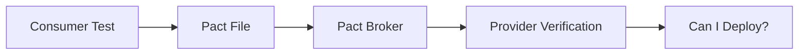

Pact and OpenAPI are complementary: OpenAPI documents the full API surface; Pact tests the specific interactions a consumer relies on.

---

## 17. API Versioning

### Why Versioning Is Necessary

APIs change over time. Some changes are **backward compatible** (additive); others are **breaking changes** (require consumer updates). Versioning gives consumers time to migrate.

**Breaking changes include:**

- Removing a field from a response.
- Renaming a field.
- Changing a field's type.
- Making a previously optional field required.
- Changing error codes or error formats.
- Removing an endpoint.
- Changing URL structure.

**Non-breaking changes include:**

- Adding a new optional field to a response.
- Adding a new optional request parameter.
- Adding a new endpoint.
- Adding new enum values (with caution).

---

### URI Versioning

The version is embedded in the URL path.

```
GET /v1/users/42
GET /v2/users/42
```

**In OpenAPI:**

```yaml
servers:
  - url: "https://api.example.com/v1"
    description: "Version 1"
  - url: "https://api.example.com/v2"
    description: "Version 2"
```

**Advantages**: Explicit, easy to route in gateways, easy to cache. **Disadvantages**: Not "RESTful" in the strict sense; creates URL proliferation.

---

### Header Versioning

The version is passed as a custom HTTP header.

```
GET /users/42
API-Version: 2024-01-15
```

**In OpenAPI:**

```yaml
parameters:
  - name: API-Version
    in: header
    required: true
    schema:
      type: string
      format: date
      example: "2024-01-15"
```

**Advantages**: Cleaner URLs. **Disadvantages**: Less visible; harder to test in browsers; harder to cache.

---

### Media Type Versioning (Content Negotiation)

The version is embedded in the Accept header.

```
GET /users/42
Accept: application/vnd.example.users.v2+json
```

**In OpenAPI:**

```yaml
responses:
  "200":
    content:
      application/vnd.example.users.v2+json:
        schema:
          $ref: '#/components/schemas/UserV2'
      application/vnd.example.users.v1+json:
        schema:
          $ref: '#/components/schemas/UserV1'
```

**Advantages**: Fully RESTful; each version is a distinct media type. **Disadvantages**: Complex; poor tooling support.

---

### Deprecation and Sunset

The `deprecated: true` flag marks individual operations:

```yaml
paths:
  /v1/users/{id}:
    get:
      deprecated: true
      summary: "Get a user (deprecated — use /v2/users/{id})"
      description: |
        **Deprecated**: This endpoint will be removed on 2025-06-01.
        Please migrate to [GET /v2/users/{id}](#operation/getUserV2).
```

**Sunset headers** (RFC 8594) communicate removal dates to API consumers:

```yaml
responses:
  "200":
    headers:
      Sunset:
        schema:
          type: string
          format: date-time
          example: "2025-06-01T00:00:00Z"
        description: "Date this endpoint will be retired"
      Deprecation:
        schema:
          type: string
          example: "true"
```

---

### Versioning in the OpenAPI Document

Each API version should have its own OpenAPI document. Maintain documents for all supported versions.

```yaml
# v1 document
openapi: "3.1.0"
info:
  title: "User API"
  version: "1.0.0"
  description: |
    **Deprecated**: Version 1 will be retired 2025-06-01.
    Please migrate to [Version 2](/docs/v2).
```

---

## 18. API Governance

### What Is API Governance

**API governance** is the set of policies, processes, and tooling that ensures APIs are designed, built, and maintained consistently across an organization.

Goals:

- Consistency across teams and services.
- Design quality and consumer friendliness.
- Security compliance.
- Discoverability (APIs can be found and understood).
- Lifecycle management (deprecation, retirement).

---

### Style Guides

A **style guide** defines conventions for API design. It is the input to automated linting rules.

**Example style guide rules:**

|Category|Rule|
|---|---|
|Naming|Resource names must be plural nouns (`/users`, not `/user`)|
|Naming|`operationId` must use camelCase|
|Naming|Path parameters must use camelCase|
|Schema|All schemas must have `description`|
|Schema|Response schemas must define all properties|
|Security|All operations must declare security|
|Responses|All operations must define `400`, `401`, `500` responses|
|Versioning|Major versions must use URI versioning|
|Formats|Date fields must use `format: date-time`|

---

### Linting with Spectral in CI/CD

```yaml
# .github/workflows/api-lint.yml
name: API Lint
on:
  pull_request:
    paths:
      - 'openapi/**'

jobs:
  lint:
    runs-on: ubuntu-latest
    steps:
      - uses: actions/checkout@v4
      - name: Install Spectral
        run: npm install -g @stoplight/spectral-cli
      - name: Lint OpenAPI
        run: spectral lint openapi/openapi.yaml --ruleset spectral.yaml
```

---

### Naming Conventions

```yaml
# GOOD — REST naming conventions
paths:
  /users:                    # Plural noun
    get:
      operationId: listUsers # camelCase verb + noun
    post:
      operationId: createUser
  /users/{userId}:           # camelCase path param
    get:
      operationId: getUserById
    put:
      operationId: updateUser
    delete:
      operationId: deleteUser
  /users/{userId}/orders:    # Nested resource
    get:
      operationId: listUserOrders
```

```yaml
# BAD — common naming violations
paths:
  /getUsers:                 # Verb in URL
  /User:                     # Singular noun, PascalCase
  /user-management:          # Kebab-case (acceptable but inconsistent)
  /users/{id}:
    get:
      operationId: get_user  # Snake_case instead of camelCase
```

---

### API Review Processes

**Lightweight review:**

1. Author submits PR with OpenAPI document changes.
2. Automated Spectral lint runs in CI — must pass.
3. One peer reviews for design quality.
4. Merge on approval.

**Enterprise review:**

1. Author submits OpenAPI document to API design platform (Stoplight, Apigee).
2. Automated linting checks run.
3. API governance committee reviews.
4. Published to internal API catalog.
5. Consumer teams are notified.

---

### API Catalog / Registry

An **API catalog** is a searchable registry of all APIs in an organization with their OpenAPI documents, ownership, and status.

Tools:

- **Backstage** (Spotify's open-source developer portal)
- **Stoplight Hub**
- **Apigee Developer Portal**
- **Redocly Portal**
- **SwaggerHub**

---

## 19. OpenAPI and Microservices

### Service Contracts

In a microservices architecture, each service's OpenAPI document is its **service contract** — the interface other services agree to. Contracts enable:

- Independent deployment (teams don't need to coordinate release timing).
- Consumer-driven contract testing (each consumer tests against the contract it relies on).
- Clear ownership (the team that owns the service owns the contract).

---

### Multi-Service Documentation

In large systems, developers need to find and understand dozens of microservice APIs. Strategies:

**Federated Documentation**: Each service publishes its own docs. Discoverable through an API catalog.

**Aggregated Documentation**: Multiple OpenAPI documents are merged and presented as a unified portal.

Tools: Redocly's Portal, Backstage, Swagger Hub.

---

### Gateway Integration

API gateways use OpenAPI documents for:

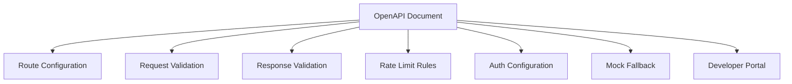

Example with Kong Deck (declarative configuration from OpenAPI):

```bash
deck convert --from openapi --to kong openapi.yaml > kong-config.yaml
deck sync --config kong-config.yaml
```

---

### Service Discovery Integration

[Inference: In Kubernetes environments, some teams auto-register OpenAPI documents to a catalog when services are deployed, but this is not a universal pattern and specific implementation varies widely.]

---

## 20. Event-Driven APIs

### Where OpenAPI Stops

OpenAPI describes **synchronous request-response interactions**. It does not model:

- Asynchronous message streams.
- Event emissions.
- Subscription-based data flows.
- Message queue interactions.

For these, **AsyncAPI** is the appropriate specification.

---

### AsyncAPI

**AsyncAPI** is an open-source specification for event-driven APIs, conceptually similar to OpenAPI but designed for message-driven and streaming architectures.

```yaml
asyncapi: '2.6.0'
info:
  title: User Events API
  version: '1.0.0'
channels:
  user/created:
    subscribe:
      summary: "A new user has been created"
      message:
        payload:
          type: object
          properties:
            userId:
              type: integer
            email:
              type: string
              format: email
            timestamp:
              type: string
              format: date-time
  user/deleted:
    subscribe:
      summary: "A user has been deleted"
      message:
        payload:
          type: object
          properties:
            userId:
              type: integer
```

---

### Webhooks in OAS 3.1

OAS 3.1 added first-class webhook support, covering server-initiated HTTP callbacks:

```yaml
webhooks:
  orderShipped:
    post:
      summary: "Order shipped event"
      description: "Called when an order transitions to shipped status"
      requestBody:
        required: true
        content:
          application/json:
            schema:
              type: object
              required:
                - orderId
                - shippedAt
                - trackingNumber
              properties:
                orderId:
                  type: string
                  format: uuid
                shippedAt:
                  type: string
                  format: date-time
                trackingNumber:
                  type: string
      responses:
        "200":
          description: "Webhook received and acknowledged"
        "400":
          description: "Invalid payload"
```

---

### Comparison: OpenAPI vs AsyncAPI

|Feature|OpenAPI|AsyncAPI|
|---|---|---|
|Pattern|Request-Response|Publish-Subscribe, Event-Driven|
|Protocols|HTTP/1.1, HTTP/2, HTTP/3|Kafka, AMQP, MQTT, WebSockets, HTTP|
|Interactions|Synchronous|Asynchronous|
|Use cases|REST APIs, RPC|Message queues, event streams, IoT|
|Schema format|JSON Schema|JSON Schema|
|Webhooks|OAS 3.1+|Native|
|Tooling|Mature|Growing|

---

### Event Streaming: Kafka, RabbitMQ, NATS

These message brokers are not described by OpenAPI. They require AsyncAPI or platform-specific documentation:

- **Apache Kafka**: High-throughput distributed log. Use AsyncAPI with the Kafka binding.
- **RabbitMQ**: AMQP-based message broker. Use AsyncAPI with the AMQP binding.
- **NATS**: Lightweight, high-performance messaging. Use AsyncAPI with the NATS binding.

```yaml
# AsyncAPI with Kafka binding
channels:
  user.created:
    bindings:
      kafka:
        topic: user-events
        partitions: 3
        replicas: 3
```

---

## 21. Advanced OpenAPI Topics

### Runtime Expressions

**Runtime expressions** are evaluated at runtime to extract values from the current request or response. They are used in `links` and `callbacks`.

Syntax: `{$source.path}` or `{$source.pointer}`

|Expression|Description|
|---|---|
|`$url`|Full request URL|
|`$method`|HTTP method|
|`$statusCode`|Response status code|
|`$request.path.{name}`|Path parameter value|
|`$request.query.{name}`|Query parameter value|
|`$request.header.{name}`|Request header value|
|`$request.body`|Entire request body|
|`$request.body#/pointer`|JSONPointer into request body|
|`$response.header.{name}`|Response header value|
|`$response.body`|Entire response body|
|`$response.body#/pointer`|JSONPointer into response body|

**Example in a Link:**

```yaml
links:
  GetOrderDetails:
    operationId: getOrderById
    parameters:
      orderId: "$response.body#/id"     # Use the id from the response body
      userId: "$request.path.userId"    # Use the userId from the request path
```

---

### Specification Extensions (`x-*`)

#### What They Are

Vendor extensions are custom fields prefixed with `x-`. They are permitted anywhere in an OpenAPI document where the spec allows additional properties. They are ignored by tools that don't understand them.

```yaml
info:
  title: "User API"
  version: "1.0.0"
  x-logo:
    url: "https://example.com/logo.png"
    altText: "Example Inc."

paths:
  /users/{id}:
    get:
      operationId: getUser
      x-rate-limit: 100
      x-internal: false
      x-code-samples:
        - lang: curl
          source: |
            curl -H "Authorization: Bearer TOKEN" \
              https://api.example.com/v1/users/42
        - lang: python
          source: |
            import requests
            r = requests.get('/users/42', headers={'Authorization': 'Bearer TOKEN'})
```

#### Common Extension Patterns

|Extension|Purpose|
|---|---|
|`x-logo`|API logo for documentation|
|`x-code-samples`|Code examples for docs (ReDoc)|
|`x-tagGroups`|Group tags in ReDoc sidebar|
|`x-internal`|Mark internal-only endpoints|
|`x-rate-limit`|Document rate limit for an operation|
|`x-permissions`|Document required permissions|
|`x-sdk-operations`|SDK generation hints|
|`x-amazon-apigateway-*`|AWS API Gateway integration|
|`x-google-backend`|Google Cloud API Gateway backend|

---

### Webhooks (OAS 3.1)

Covered in Section 20. Key distinction from callbacks:

- **Callbacks**: Defined relative to a specific subscription operation.
- **Webhooks**: Defined at the document level; not tied to a specific operation.

---

### `$ref` in OAS 3.1

OAS 3.1 aligns `$ref` more closely with JSON Schema's `$ref`:

- A `$ref` can be used alongside `summary` and `description` (OAS 3.0 does not allow siblings of `$ref`).
- `$ref` can point to `components/pathItems` (new in 3.1).

```yaml
# OAS 3.1 — sibling properties allowed
schema:
  $ref: '#/components/schemas/User'
  description: "Overrides the referenced schema's description"
```

---

## 22. OpenAPI Ecosystem Standards

### Comparison Table

|Standard|Focus|Format|Maturity|Best For|
|---|---|---|---|---|
|OpenAPI (OAS)|HTTP REST APIs|YAML/JSON|Very mature|RESTful HTTP APIs|
|AsyncAPI|Event-driven APIs|YAML/JSON|Growing|Kafka, AMQP, WebSocket|
|OpenRPC|JSON-RPC APIs|JSON|Niche|JSON-RPC 2.0 services|
|RAML|HTTP APIs|YAML|Declining|RESTful APIs (MuleSoft ecosystem)|
|API Blueprint|HTTP APIs|Markdown|Declining|Human-readable API docs|
|JSON Schema|Data validation|JSON|Very mature|Data validation|
|JSON:API|REST response format|JSON|Stable|Standardized REST responses|
|HAL|Hypermedia|JSON/XML|Niche|HATEOAS REST APIs|
|GraphQL SDL|GraphQL APIs|SDL|Very mature|GraphQL type definitions|

---

### JSON Schema

**JSON Schema** is used as OpenAPI's schema language. It can also be used independently for validating JSON documents at any layer of an application.

Key libraries:

- `ajv` (JavaScript/TypeScript) — fastest JSON Schema validator
- `jsonschema` (Python)
- `networknt/json-schema-validator` (Java)
- `santhosh-tekuri/jsonschema` (Go)

---

### AsyncAPI

Covered in Section 20. AsyncAPI 3.0 (released 2023) introduced significant changes to the channel and operation model. [Unverified: verify current version status at asyncapi.com.]

---

### RAML (RESTful API Modeling Language)

RAML is a YAML-based API description language developed by MuleSoft. It was competitive with Swagger in the early 2010s but has largely been supplanted by OpenAPI. [Inference: RAML is still used within MuleSoft/Anypoint Platform ecosystems, but new adoption is minimal compared to OpenAPI.]

---

### API Blueprint

API Blueprint uses Markdown syntax for API description. Human-readable but limited tooling support. Not recommended for new projects.

---

### HAL (Hypertext Application Language)

HAL is a standard for embedding hyperlinks in JSON/XML responses, enabling HATEOAS. Media type: `application/hal+json`.

```json
{
  "_links": {
    "self": { "href": "/users/42" },
    "orders": { "href": "/users/42/orders" }
  },
  "id": 42,
  "name": "Maria Santos"
}
```

---

### JSON:API

JSON:API is a specification for how clients should request resources and how servers should respond. Media type: `application/vnd.api+json`.

```json
{
  "data": {
    "type": "users",
    "id": "42",
    "attributes": {
      "name": "Maria Santos",
      "email": "maria@example.com"
    },
    "relationships": {
      "orders": {
        "links": {
          "related": "/users/42/orders"
        }
      }
    }
  }
}
```

---

## 23. Production API Design

### Pagination

For large collections, return data in pages rather than all at once.

#### Cursor-Based Pagination (recommended)

```yaml
components:
  schemas:
    UserListResponse:
      type: object
      properties:
        data:
          type: array
          items:
            $ref: '#/components/schemas/User'
        pagination:
          type: object
          properties:
            cursor:
              type: string
              description: "Pass as `cursor` parameter to get next page"
              example: "eyJpZCI6NDJ9"
            hasMore:
              type: boolean
            total:
              type: integer

parameters:
  - name: cursor
    in: query
    schema:
      type: string
    description: "Pagination cursor from previous response"
  - name: limit
    in: query
    schema:
      type: integer
      default: 20
      minimum: 1
      maximum: 100
```

#### Offset-Based Pagination

```yaml
parameters:
  - name: page
    in: query
    schema:
      type: integer
      default: 1
  - name: perPage
    in: query
    schema:
      type: integer
      default: 20
      maximum: 100

responses:
  "200":
    headers:
      X-Total-Count:
        schema:
          type: integer
      Link:
        schema:
          type: string
          description: "RFC 5988 Link header with prev/next/first/last"
          example: '<https://api.example.com/users?page=2>; rel="next", <https://api.example.com/users?page=10>; rel="last"'
```

---

### Filtering and Sorting

```yaml
parameters:
  # Simple filter
  - name: status
    in: query
    schema:
      type: string
      enum: [active, inactive, pending]

  # Deep object filter
  - name: filter
    in: query
    style: deepObject
    explode: true
    schema:
      type: object
      properties:
        createdAfter:
          type: string
          format: date
        createdBefore:
          type: string
          format: date
        status:
          type: string

  # Sorting
  - name: sort
    in: query
    schema:
      type: array
      items:
        type: string
        pattern: "^[+-]?[a-zA-Z_]+$"
      example: ["-createdAt", "+name"]
    style: form
    explode: false
    description: "Sort fields. Prefix with `-` for descending, `+` for ascending."
```

---

### Idempotency Keys

For non-idempotent operations (POST, PATCH), clients can provide an idempotency key to make them safe to retry.

```yaml
parameters:
  - name: Idempotency-Key
    in: header
    schema:
      type: string
      format: uuid
      example: "a1b2c3d4-e5f6-7890-abcd-ef1234567890"
    description: |
      A unique key for this request. If a request with this key was previously
      received and completed, the server returns the same response without
      executing the operation again.
```

---

### Rate Limiting

```yaml
responses:
  "429":
    description: "Rate limit exceeded"
    headers:
      Retry-After:
        schema:
          type: integer
          description: "Seconds to wait before retrying"
      X-RateLimit-Limit:
        schema:
          type: integer
      X-RateLimit-Remaining:
        schema:
          type: integer
      X-RateLimit-Reset:
        schema:
          type: integer
          format: int64
          description: "Unix timestamp when the window resets"
    content:
      application/json:
        schema:
          $ref: '#/components/schemas/ProblemDetails'
```

---

### Caching and ETags

**ETags** identify a specific version of a resource, enabling conditional requests that avoid unnecessary transfers.

```yaml
# GET response includes ETag
responses:
  "200":
    headers:
      ETag:
        schema:
          type: string
          example: '"d41d8cd98f00b204e9800998ecf8427e"'
      Cache-Control:
        schema:
          type: string
          example: "max-age=300, must-revalidate"

# Conditional GET — client sends If-None-Match
parameters:
  - name: If-None-Match
    in: header
    schema:
      type: string
      example: '"d41d8cd98f00b204e9800998ecf8427e"'

# 304 response
"304":
  description: "Not modified — client's cached version is still current"
```

---

### Optimistic Concurrency

Prevents lost updates when multiple clients modify the same resource concurrently.

```yaml
# Client reads ETag from GET response
# Sends it in If-Match when updating
parameters:
  - name: If-Match
    in: header
    required: true
    schema:
      type: string
      description: "ETag from previous GET. Update rejected if resource has changed."

responses:
  "412":
    description: "Precondition failed — resource was modified by another client"
    content:
      application/json:
        schema:
          $ref: '#/components/schemas/ProblemDetails'
```

---

### Field Selection (Sparse Fieldsets)

Allows clients to request only specific fields, reducing payload size.

```yaml
parameters:
  - name: fields
    in: query
    schema:
      type: array
      items:
        type: string
    style: form
    explode: false
    example: "id,name,email"
    description: "Comma-separated list of fields to include in response"
```

---

### Search

```yaml
paths:
  /users/search:
    get:
      operationId: searchUsers
      parameters:
        - name: q
          in: query
          required: true
          schema:
            type: string
            minLength: 1
          description: "Full-text search query"
        - name: fields
          in: query
          schema:
            type: array
            items:
              type: string
              enum: [name, email, bio]
          description: "Fields to search in"
      responses:
        "200":
          description: "Search results"
          content:
            application/json:
              schema:
                type: object
                properties:
                  results:
                    type: array
                    items:
                      $ref: '#/components/schemas/User'
                  total:
                    type: integer
                  took:
                    type: number
                    description: "Search execution time in milliseconds"
```

---

## 24. Enterprise Architecture Perspective

### OpenAPI in System Architecture

OpenAPI documents are first-class artifacts in an enterprise API platform:

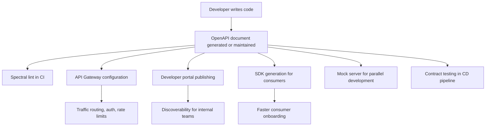

---

### Platform Engineering Perspective

**Platform engineers** provide the toolchain that makes consistent API development possible across teams:

- **API scaffolding**: New services start from a template with OpenAPI document, Spectral config, and CI pipeline pre-configured.
- **API catalog**: All OpenAPI documents published to a central registry.
- **Gateway integration**: OpenAPI documents automatically configure gateway routes.
- **Observability**: API traffic can be analyzed against the OpenAPI document to detect drift or undocumented endpoints.

---

### Developer Experience (DX)

A good API developer experience, enabled by OpenAPI:

1. **Discovery**: Find the API in the catalog.
2. **Understanding**: Read clear, complete documentation (ReDoc, Swagger UI).
3. **Experimentation**: Try the API in Swagger UI or Postman without writing code.
4. **Integration**: Download a generated SDK in the preferred language.
5. **Confidence**: Contract tests confirm the API behaves as documented.
6. **Support**: Error messages reference `type` URIs from RFC 7807 that link to documentation.

---

### API Platforms

An **API platform** is the combined set of tools, processes, and infrastructure that manages the full API lifecycle across an organization. Components:

|Component|Examples|
|---|---|
|Design editor|Stoplight Studio, Swagger Editor|
|Version control|Git (GitHub, GitLab, Bitbucket)|
|Linting|Spectral, Redocly CLI|
|Mock server|Prism, WireMock|
|API gateway|Kong, Tyk, AWS API Gateway, Apigee|
|Developer portal|Backstage, Redocly, Stoplight|
|SDK generation|OpenAPI Generator|
|Testing|Schemathesis, Postman|
|Monitoring|Datadog, Prometheus + Grafana|

---

## 25. Learning Roadmap

### Beginner Stage

**Goal**: Understand what APIs are, read an existing OpenAPI document, and use tools to interact with documented APIs.

**Topics:**

- HTTP fundamentals (methods, status codes, headers).
- REST concepts (resources, representations, CRUD).
- Reading an OpenAPI document (YAML/JSON basics, paths, operations).
- `info`, `servers`, `paths`, `components` top-level fields.
- Using Swagger UI to explore a documented API.
- Basic schema types (`string`, `integer`, `array`, `object`).
- Understanding `$ref` and component reuse.

**Practical Projects:**

1. Find a public OpenAPI document (e.g., Petstore) and explore it in Swagger UI.
2. Write a simple OpenAPI document for a to-do list API by hand.
3. Use Prism to mock the to-do API and make requests with curl.

**Tools to learn**: Swagger Editor, Swagger UI, Prism, curl/Postman.

**Expected competencies:**

- Read and understand any well-written OpenAPI document.
- Write basic schemas with properties, types, and required fields.
- Identify path parameters, query parameters, and request bodies.

---

### Intermediate Stage

**Goal**: Write production-quality OpenAPI documents, implement contract-first development, and integrate OpenAPI into a backend framework.

**Topics:**

- All parameter types and serialization styles.
- Request body and content negotiation.
- Response design and error handling (RFC 7807).
- Schema composition (`allOf`, `oneOf`, `anyOf`).
- Security schemes (API key, bearer, OAuth 2.0).
- Components and DRY principles.
- Using Spectral for linting.
- Code generation (client and server stubs).
- Framework integration (FastAPI, NestJS, or equivalent).
- API versioning strategies.
- The `deprecated` flag and sunset headers.

**Practical Projects:**

1. Design a RESTful API for an e-commerce system (products, orders, users) using contract-first approach.
2. Set up a CI/CD pipeline with Spectral linting.
3. Generate a TypeScript client from your OpenAPI document.
4. Implement the API in a framework and run Schemathesis contract tests.

**Tools to learn**: Spectral, OpenAPI Generator, Schemathesis, Redocly CLI.

**Expected competencies:**

- Write complete, production-quality OpenAPI 3.1 documents.
- Set up and enforce a linting ruleset.
- Integrate OpenAPI into a CI/CD pipeline.
- Generate usable clients and verify implementation against spec.

---

### Advanced Stage

**Goal**: Govern APIs across a team or organization, handle complex schema patterns, and architect API platforms.

**Topics:**

- Enterprise API governance and style guides.
- Complex schema patterns (polymorphism, discriminator, recursive schemas).
- Advanced security (OAuth 2.0 flows, PKCE, OIDC).
- API gateway configuration from OpenAPI documents.
- Multi-file OpenAPI documents with external `$ref`.
- Callbacks and webhooks (OAS 3.1).
- Links and runtime expressions.
- Specification extensions (`x-*`).
- AsyncAPI for event-driven systems.
- API catalog and developer portal setup.
- Consumer-driven contract testing with Pact.
- Performance considerations for large OpenAPI documents.

**Practical Projects:**

1. Build a custom Spectral ruleset for organizational style enforcement.
2. Design a multi-service microservices system with individual OpenAPI contracts and an aggregated developer portal.
3. Implement OAuth 2.0 authorization code + PKCE flow fully described in OpenAPI.
4. Add AsyncAPI documentation for event-driven portions of a system.

**Tools to learn**: Backstage, Kong/Tyk, Pact, custom Spectral rules.

**Expected competencies:**

- Lead API design reviews.
- Build and enforce governance pipelines.
- Design complex polymorphic schemas.
- Architect an API platform for an organization.

---

### Expert Stage

**Goal**: Contribute to API ecosystem standards, build custom tooling, and lead platform engineering for API infrastructure.

**Topics:**

- JSON Schema Draft 2020-12 internals (`$vocabulary`, `$schema`, `$anchor`).
- OpenAPI 3.1 specification internals and edge cases.
- Building custom OpenAPI Generator templates.
- Building Spectral custom functions.
- Contributing to OpenAPI Initiative working groups.
- API security threat modeling (OWASP API Security Top 10).
- API observability and contract drift detection.
- AI-assisted API design and documentation.

**Practical Projects:**

1. Build a custom code generator for a target language or framework.
2. Build an API observability tool that compares live traffic against an OpenAPI document.
3. Design an API platform architecture for a 100+ service enterprise.
4. Write a technical RFC proposing an API design standard for your organization.

**Expected competencies:**

- Deep expertise in JSON Schema and OpenAPI specification internals.
- Ability to build custom tooling.
- Organizational leadership in API strategy.

---

## 26. Reference Appendices

### Complete OpenAPI 3.1 Object Reference

|Object|Key Fields|Notes|
|---|---|---|
|**OpenAPI Object**|`openapi`, `info`, `servers`, `paths`, `webhooks`, `components`, `security`, `tags`, `externalDocs`|Root document object|
|**Info Object**|`title`, `version`, `summary`, `description`, `termsOfService`, `contact`, `license`|API metadata|
|**Contact Object**|`name`, `url`, `email`|Contact information|
|**License Object**|`name`, `url`, `identifier`|License info; `identifier` is SPDX in 3.1|
|**Server Object**|`url`, `description`, `variables`|Base URL declarations|
|**Server Variable Object**|`enum`, `default`, `description`|Template variable definition|
|**Components Object**|`schemas`, `responses`, `parameters`, `examples`, `requestBodies`, `headers`, `securitySchemes`, `links`, `callbacks`, `pathItems`|Reusable definitions|
|**Path Item Object**|`$ref`, `summary`, `description`, `get`, `put`, `post`, `delete`, `options`, `head`, `patch`, `trace`, `servers`, `parameters`|Operations on a path|
|**Operation Object**|`tags`, `summary`, `description`, `externalDocs`, `operationId`, `parameters`, `requestBody`, `responses`, `callbacks`, `deprecated`, `security`, `servers`|Single API operation|
|**External Documentation Object**|`description`, `url`|Link to external docs|
|**Parameter Object**|`name`, `in`, `description`, `required`, `deprecated`, `allowEmptyValue`, `style`, `explode`, `allowReserved`, `schema`, `example`, `examples`, `content`|Input parameter|
|**Request Body Object**|`description`, `content`, `required`|Request payload|
|**Media Type Object**|`schema`, `example`, `examples`, `encoding`|Per-content-type definition|
|**Encoding Object**|`contentType`, `headers`, `style`, `explode`, `allowReserved`|Multipart field encoding|
|**Responses Object**|Map of HTTP status codes to Response Objects|Operation responses|
|**Response Object**|`description`, `headers`, `content`, `links`|Single response|
|**Callback Object**|Map of runtime expressions to Path Item Objects|Out-of-band callbacks|
|**Example Object**|`summary`, `description`, `value`, `externalValue`|Reusable example|
|**Link Object**|`operationRef`, `operationId`, `parameters`, `requestBody`, `description`, `server`|State transition|
|**Header Object**|Same fields as Parameter Object minus `name` and `in`|Response header|
|**Tag Object**|`name`, `description`, `externalDocs`|Tag metadata|
|**Schema Object**|Full JSON Schema 2020-12 vocabulary + OAS extensions|Data type definition|
|**Discriminator Object**|`propertyName`, `mapping`|Polymorphism hint|
|**XML Object**|`name`, `namespace`, `prefix`, `attribute`, `wrapped`|XML serialization hints|
|**Security Scheme Object**|`type`, `description`, `name`, `in`, `scheme`, `bearerFormat`, `flows`, `openIdConnectUrl`|Auth scheme definition|
|**OAuth Flows Object**|`implicit`, `password`, `clientCredentials`, `authorizationCode`|OAuth flow definitions|
|**OAuth Flow Object**|`authorizationUrl`, `tokenUrl`, `refreshUrl`, `scopes`|Single OAuth flow|
|**Security Requirement Object**|Map of scheme name to scope arrays|Required auth|

---

### HTTP Status Code Reference

#### 1xx — Informational

|Code|Name|Description|
|---|---|---|
|100|Continue|Server received request headers; client may proceed with body|
|101|Switching Protocols|Server is switching protocols as requested|
|102|Processing|Server is processing (WebDAV)|
|103|Early Hints|Preload hints before final response|

#### 2xx — Success

|Code|Name|Description|
|---|---|---|
|200|OK|Standard success|
|201|Created|Resource created; `Location` header recommended|
|202|Accepted|Async processing started|
|203|Non-Authoritative Information|Transformed proxy response|
|204|No Content|Success; no body|
|205|Reset Content|Client should reset the document view|
|206|Partial Content|Response to range request|
|207|Multi-Status|Multiple independent operations (WebDAV)|
|208|Already Reported|WebDAV|
|226|IM Used|Delta encoding|

#### 3xx — Redirection

|Code|Name|Description|
|---|---|---|
|300|Multiple Choices|Multiple options for the resource|
|301|Moved Permanently|Permanent redirect; update bookmarks|
|302|Found|Temporary redirect|
|303|See Other|Redirect to a different URL; use GET|
|304|Not Modified|Conditional GET; use cached version|
|307|Temporary Redirect|Temporary redirect; keep method|
|308|Permanent Redirect|Permanent redirect; keep method|

#### 4xx — Client Errors

|Code|Name|Description|
|---|---|---|
|400|Bad Request|Malformed syntax or invalid request|
|401|Unauthorized|Authentication required|
|402|Payment Required|Reserved; used by some payment APIs|
|403|Forbidden|Authenticated but not authorized|
|404|Not Found|Resource does not exist|
|405|Method Not Allowed|HTTP method not supported|
|406|Not Acceptable|No response format matches Accept header|
|407|Proxy Authentication Required|Proxy auth needed|
|408|Request Timeout|Client too slow|
|409|Conflict|State conflict|
|410|Gone|Resource permanently removed|
|411|Length Required|`Content-Length` header missing|
|412|Precondition Failed|`If-Match` or `If-None-Match` failed|
|413|Content Too Large|Request body exceeds limit|
|414|URI Too Long|URI exceeds limit|
|415|Unsupported Media Type|`Content-Type` not supported|
|416|Range Not Satisfiable|Range header invalid|
|417|Expectation Failed|`Expect` header not met|
|418|I'm a Teapot|RFC 2324 (humorous; sometimes used to block bots)|
|422|Unprocessable Content|Semantically invalid entity|
|423|Locked|Resource is locked (WebDAV)|
|424|Failed Dependency|Dependency failed (WebDAV)|
|425|Too Early|Server unwilling to process potential replayed request|
|426|Upgrade Required|Client must upgrade protocol|
|428|Precondition Required|Request must be conditional|
|429|Too Many Requests|Rate limit exceeded|
|431|Request Header Fields Too Large|Header fields too large|
|451|Unavailable For Legal Reasons|Legal restriction|

#### 5xx — Server Errors

|Code|Name|Description|
|---|---|---|
|500|Internal Server Error|Generic server failure|
|501|Not Implemented|Method not supported by server|
|502|Bad Gateway|Invalid upstream response|
|503|Service Unavailable|Temporarily unavailable|
|504|Gateway Timeout|Upstream timeout|
|505|HTTP Version Not Supported|HTTP version not supported|
|507|Insufficient Storage|WebDAV storage failure|
|511|Network Authentication Required|Client must authenticate to access network|

---

### Security Scheme Reference

|Type|`type` value|Required Fields|Optional Fields|
|---|---|---|---|
|API Key (header)|`apiKey`|`name: X-API-Key`, `in: header`|`description`|
|API Key (query)|`apiKey`|`name: api_key`, `in: query`|`description`|
|API Key (cookie)|`apiKey`|`name: session`, `in: cookie`|`description`|
|HTTP Basic|`http`|`scheme: basic`|`description`|
|HTTP Bearer|`http`|`scheme: bearer`|`bearerFormat`, `description`|
|HTTP Digest|`http`|`scheme: digest`|`description`|
|OAuth2 (Auth Code)|`oauth2`|`flows.authorizationCode.authorizationUrl`, `flows.authorizationCode.tokenUrl`, `flows.authorizationCode.scopes`|`refreshUrl`|
|OAuth2 (Client Creds)|`oauth2`|`flows.clientCredentials.tokenUrl`, `flows.clientCredentials.scopes`|`refreshUrl`|
|OAuth2 (Device Code)|`oauth2`|`flows.deviceCode.authorizationUrl`, `flows.deviceCode.tokenUrl`|—|
|OpenID Connect|`openIdConnect`|`openIdConnectUrl`|`description`|
|Mutual TLS|`mutualTLS`|—|`description`|

---

### Tool Comparison Matrix

|Tool|Category|Open Source|OAS 2.0|OAS 3.0|OAS 3.1|Language|
|---|---|---|---|---|---|---|
|Swagger UI|Documentation|Yes|Yes|Yes|Yes|JavaScript|
|ReDoc|Documentation|Yes (core)|Yes|Yes|Yes|JavaScript|
|Swagger Editor|Editor|Yes|Yes|Yes|Partial|JavaScript|
|Stoplight Studio|Editor|Freemium|Yes|Yes|Yes|Electron|
|Spectral|Linting|Yes|Yes|Yes|Yes|TypeScript|
|Redocly CLI|Linting/Bundling|Yes|Yes|Yes|Yes|JavaScript|
|Prism|Mocking|Yes|Yes|Yes|Partial|TypeScript|
|WireMock|Mocking|Yes (core)|Yes|Yes|Partial|Java|
|Postman|Testing/Dev|Freemium|Yes|Yes|Yes|Electron|
|Schemathesis|Testing|Yes|Yes|Yes|Yes|Python|
|Dredd|Testing|Yes|Yes|Yes|No|JavaScript|
|OpenAPI Generator|Code Gen|Yes|Yes|Yes|Partial|Java|
|Swagger Codegen|Code Gen|Yes|Yes|Partial|No|Java|
|Kong|Gateway|Yes (core)|Yes|Yes|Partial|Lua/Go|
|Tyk|Gateway|Yes (core)|Yes|Yes|Partial|Go|
|Apigee|Gateway|No|Yes|Yes|Partial|—|

> [Unverified: OAS 3.1 support status changes rapidly. Verify current support with each tool's documentation before adoption.]

---

### OpenAPI Glossary

|Term|Definition|
|---|---|
|**API**|Application Programming Interface — a defined contract for software communication|
|**AsyncAPI**|Specification for event-driven and message-based APIs|
|**Bearer Token**|An HTTP authentication token transmitted in the `Authorization: Bearer` header|
|**Callback**|An out-of-band HTTP request made by the server to a URL provided by the client|
|**Claim**|A statement about an entity in a JWT (e.g., `sub`, `roles`, `email`)|
|**Client**|The software component consuming an API|
|**Components**|The OAS section for reusable definitions|
|**Contract**|The formal description of an API's inputs, outputs, and error conditions|
|**Contract-first**|Development approach where the API contract is defined before implementation|
|**Content Negotiation**|HTTP mechanism for agreeing on data format between client and server|
|**Discriminator**|An OAS field that helps identify which schema in a `oneOf`/`anyOf` applies|
|**DRY**|Don't Repeat Yourself — software principle favoring code/definition reuse|
|**ETag**|An HTTP header identifying a specific version of a resource|
|**Endpoint**|A specific URL + HTTP method combination that provides functionality|
|**GraphQL**|A query language for APIs, alternative to REST|
|**gRPC**|Google's high-performance RPC framework using Protocol Buffers|
|**HATEOAS**|Hypermedia as the Engine of Application State — REST constraint|
|**Header**|An HTTP key-value pair in the request or response metadata|
|**HTTP**|HyperText Transfer Protocol — foundation of web communication|
|**Idempotent**|An operation whose repeated application has the same effect as a single application|
|**JWT**|JSON Web Token — a self-contained, signed token for conveying claims|
|**JSON Schema**|A vocabulary for annotating and validating JSON documents|
|**Link Object**|An OAS object describing possible operations using a response's data|
|**Media Type**|A string identifying a data format (e.g., `application/json`)|
|**Mutual TLS**|TLS variant where both client and server authenticate with certificates|
|**OAS**|OpenAPI Specification|
|**OAuth 2.0**|Authorization framework for delegated access|
|**OIDC**|OpenID Connect — identity layer on top of OAuth 2.0|
|**operationId**|A unique identifier for an OAS operation|
|**Parameter**|An input to an API operation (path, query, header, or cookie)|
|**Path Item**|An OAS object describing operations available at a specific path|
|**PKCE**|Proof Key for Code Exchange — OAuth 2.0 extension for public clients|
|**Polymorphism**|The ability for data to take multiple forms, modeled with `oneOf`/`anyOf`|
|**Request Body**|The payload sent with a POST, PUT, or PATCH request|
|**Resource**|A named concept in a REST API (e.g., User, Order)|
|**REST**|Representational State Transfer — architectural style for web APIs|
|**Richardson Maturity Model**|A framework for measuring REST API maturity|
|**RFC 7807**|Problem Details for HTTP APIs — standard error response format|
|**RPC**|Remote Procedure Call — invoking a function on a remote server|
|**Runtime Expression**|An OAS syntax for extracting values from requests/responses at runtime|
|**Safe**|An HTTP method that does not modify server state|
|**Schema**|A JSON Schema definition describing the structure of data|
|**Scope**|An OAuth 2.0 access permission (e.g., `read:users`)|
|**Security Requirement**|An OAS object declaring which security scheme(s) apply to an operation|
|**Security Scheme**|An OAS definition of an authentication/authorization mechanism|
|**Server**|The software component exposing an API|
|**Server Variable**|A template variable in a server URL|
|**SOAP**|Simple Object Access Protocol — XML-based messaging protocol|
|**Spectral**|An open-source JSON/YAML linter for OpenAPI documents|
|**SSE**|Server-Sent Events — server push mechanism over HTTP|
|**Style**|An OAS serialization style for parameter values|
|**Sunset Header**|HTTP header (RFC 8594) announcing a resource's planned retirement date|
|**Swagger**|The original name for the OpenAPI Specification (now refers to the tooling brand)|
|**Tag**|An OAS grouping mechanism for operations|
|**Vendor Extension**|A custom OAS field prefixed with `x-`|
|**Webhook**|An HTTP callback triggered by a server event|
|**WebSocket**|A protocol for full-duplex, persistent communication channels|
|**WSDL**|Web Services Description Language — the SOAP equivalent of OpenAPI|
|**`$ref`**|A JSON Reference pointer to another object in the same or external document|
|**`additionalProperties`**|JSON Schema keyword controlling unknown properties in an object|
|**`allOf`**|JSON Schema composition — valid against all listed schemas|
|**`anyOf`**|JSON Schema composition — valid against at least one listed schema|
|**`discriminator`**|OAS field for polymorphic type resolution|
|**`explode`**|OAS parameter field controlling array/object serialization|
|**`format`**|A JSON Schema semantic hint for string or number fields|
|**`not`**|JSON Schema — valid only if the given schema does not match|
|**`nullable`**|OAS 3.0 extension (replaced by `type: ["x", "null"]` in OAS 3.1)|
|**`oneOf`**|JSON Schema composition — valid against exactly one listed schema|
|**`operationId`**|Unique identifier for an API operation|
|**`required`**|JSON Schema array of required property names on an object|

---

### Migration Guide: Swagger 2.0 → OAS 3.1

#### Step 1: Update the root version key

```yaml
# Before (Swagger 2.0)
swagger: "2.0"

# After (OAS 3.1)
openapi: "3.1.0"
```

#### Step 2: Update `info`

`info` is largely unchanged. Remove nothing.

#### Step 3: Replace `host`, `basePath`, `schemes` with `servers`

```yaml
# Before
host: api.example.com
basePath: /v1
schemes:
  - https

# After
servers:
  - url: https://api.example.com/v1
```

#### Step 4: Replace `in: body` parameters with `requestBody`

```yaml
# Before
parameters:
  - name: user
    in: body
    required: true
    schema:
      $ref: '#/definitions/User'

# After
requestBody:
  required: true
  content:
    application/json:
      schema:
        $ref: '#/components/schemas/User'
```

#### Step 5: Rename `definitions` → `components/schemas`

```yaml
# Before
definitions:
  User:
    type: object
    ...

# After
components:
  schemas:
    User:
      type: object
      ...
```

Update all `$ref: '#/definitions/...'` to `$ref: '#/components/schemas/...'`.

#### Step 6: Move `parameters`, `responses` into `components`

```yaml
# Before (top-level)
parameters:
  UserIdParam: ...
responses:
  NotFoundResponse: ...

# After
components:
  parameters:
    UserIdParam: ...
  responses:
    NotFoundResponse: ...
```

#### Step 7: Replace global `consumes`/`produces` with per-operation `content`

Remove global `consumes` and `produces`. Each request body and response now declares its own `content` map.

#### Step 8: Update security definitions

```yaml
# Before
securityDefinitions:
  bearerAuth:
    type: apiKey
    in: header
    name: Authorization

# After
components:
  securitySchemes:
    bearerAuth:
      type: http
      scheme: bearer
      bearerFormat: JWT
```

#### Step 9: Update `nullable` fields (OAS 3.0 → 3.1 only)

```yaml
# OAS 3.0
name:
  type: string
  nullable: true

# OAS 3.1
name:
  type: ["string", "null"]
```

#### Step 10: Update `$ref` siblings (OAS 3.0 → 3.1)

In OAS 3.0, `$ref` siblings are not allowed. In OAS 3.1, `description` and `summary` are permitted alongside `$ref`.

#### Migration Checklist

- [ ] Root key updated to `openapi: "3.1.0"`
- [ ] `host`/`basePath`/`schemes` replaced with `servers`
- [ ] All `in: body` parameters converted to `requestBody`
- [ ] `definitions` renamed to `components/schemas`
- [ ] Top-level `parameters` / `responses` moved to `components`
- [ ] Global `consumes` / `produces` removed
- [ ] `securityDefinitions` renamed to `components/securitySchemes`
- [ ] Security scheme `type: apiKey` auth header replaced with `type: http, scheme: bearer` where applicable
- [ ] All `$ref` paths updated from `#/definitions/` to `#/components/schemas/`
- [ ] `nullable: true` replaced with `type: ["x", "null"]` (if targeting 3.1 strictly)
- [ ] Document validated with `redocly lint --extends recommended` or Spectral

---

### Interview Questions

#### Foundational

1. What is the difference between OpenAPI and Swagger?
2. What problem does an OpenAPI document solve? Name three tools that consume it.
3. What is the difference between OAS 3.0 and OAS 3.1?
4. What is a `$ref` and why would you use it?
5. What is the difference between `in: path`, `in: query`, `in: header`, and `in: cookie` parameters?
6. When would you use `PUT` vs `PATCH`?
7. What HTTP status code should a successful POST that creates a resource return?
8. What is the `operationId` and why is it important for code generation?
9. What is `additionalProperties: false` and when would you use it?
10. Explain the difference between `allOf`, `oneOf`, and `anyOf`.

#### Intermediate

11. How do you model a nullable field in OAS 3.0 vs OAS 3.1?
12. What is a discriminator and when would you use it?
13. How does the `default` response differ from an explicitly listed status code response?
14. What is the `components` section and what types of objects can it contain?
15. How would you document OAuth 2.0 Authorization Code + PKCE in OpenAPI?
16. Describe three serialization styles for query parameters and when you'd use each.
17. What is Spectral and how would you integrate it into a CI/CD pipeline?
18. What is the difference between design-first and code-first API development? What are the tradeoffs?
19. How do you document a file upload endpoint in OpenAPI?
20. What is RFC 7807 and how would you apply it to API error responses?

#### Advanced

21. What are runtime expressions in OpenAPI and where are they used?
22. How does OpenAPI 3.1's relationship with JSON Schema differ from 3.0?
23. Explain the difference between OAS callbacks and webhooks.
24. How would you handle versioning for a large enterprise API across 20+ microservices?
25. What is consumer-driven contract testing? How does it complement OpenAPI?
26. Describe the OWASP API Security Top 10. How does OpenAPI tooling help address some of these?
27. How would you model a polymorphic request body (e.g., a payment method that can be credit card, bank transfer, or crypto) in OAS 3.1?
28. When is OpenAPI insufficient for describing an API? What would you use instead?
29. How would you design an API governance system for a company with 50 development teams?
30. What are the tradeoffs of committing generated code to version control vs generating in CI?

---

### Production Recommendations Summary

1. **Use OAS 3.1** for new projects. Broad tooling support is growing, and full JSON Schema alignment simplifies the ecosystem.
2. **Design-first** for public APIs and team-exposed internal APIs. Code-first is acceptable for internal-only, rapidly changing APIs with a single consumer.
3. **Lint every PR** with Spectral. Enforce a documented style guide as code.
4. **Define `operationId` everywhere** using a consistent naming convention. Code generators depend on it.
5. **Use `components` aggressively**. Any schema or response used more than once belongs in `components`.
6. **Document all error responses** for every operation. At minimum: `400`, `401`, `403`, `404`, `422`, `500`.
7. **Use RFC 7807** for error bodies. It is a widely recognized, machine-readable standard.
8. **Run contract tests in CI/CD** with Schemathesis. Do not let implementation drift from spec.
9. **Separate the OpenAPI document into multiple files** for documents over ~1,000 lines. Use Redocly CLI to bundle.
10. **Pin all tool versions**. OpenAPI Generator, Spectral, and Prism have breaking changes between major versions.
11. **Never put secrets in OpenAPI documents**. Bearer format examples, OAuth URLs, and example tokens should use placeholder values.
12. **Add `sunset` and `deprecation` headers** to deprecated operations. Consumers need time to migrate.
13. **Provide realistic examples** in every schema. Good examples are worth more than long descriptions.
14. **Version your API and your OpenAPI document together**. Each API version has its own document, committed and tagged in source control.

---

_End of handbook._