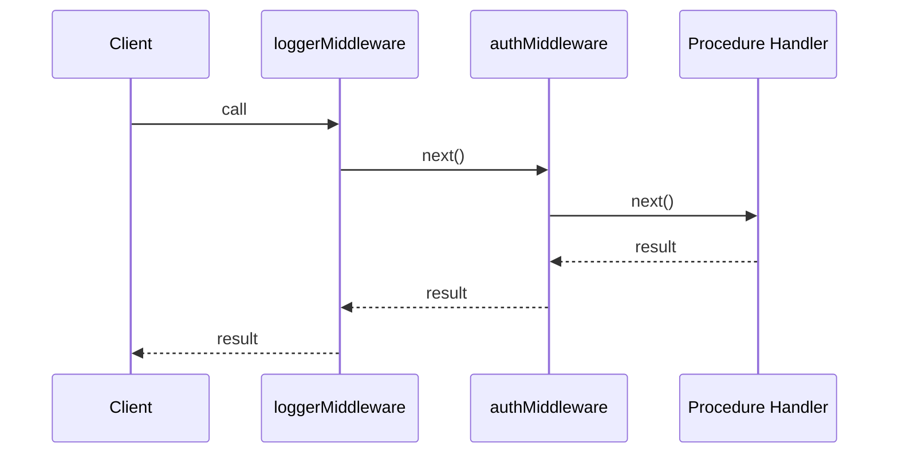

## Chaining Multiple Middleware

Middleware in tRPC can be composed in sequence, where each middleware in the chain can perform work before and after the next middleware (or procedure) executes. This is conceptually similar to middleware in Express or Koa, but typed end-to-end.

---

### How Chaining Works

When you attach multiple `.use()` calls to a procedure or router, tRPC executes them in the order they are defined. Each middleware receives a `next()` function that, when called, passes control to the next middleware in the chain, and ultimately to the procedure handler itself.

**Key Points**
- Middleware is executed top-to-bottom in the order `.use()` is called.
- Each middleware must call `next()` to continue the chain. If it does not, the chain stops and the procedure does not execute.
- Context (`ctx`) can be extended at each step. Each middleware can pass a new, augmented context object forward.
- The return value of `next()` carries the result of everything downstream.

---

### Basic Chain Structure

```ts
import { initTRPC } from '@trpc/server';

const t = initTRPC.context<{ userId?: string }>().create();

const loggerMiddleware = t.middleware(async ({ path, type, next }) => {
  console.log(`[${type}] ${path} — start`);
  const result = await next();
  console.log(`[${type}] ${path} — end`);
  return result;
});

const authMiddleware = t.middleware(async ({ ctx, next }) => {
  if (!ctx.userId) {
    throw new TRPCError({ code: 'UNAUTHORIZED' });
  }
  return next({
    ctx: {
      ...ctx,
      userId: ctx.userId, // narrowed: confirmed non-null
    },
  });
});

const protectedProcedure = t.procedure
  .use(loggerMiddleware)   // runs first
  .use(authMiddleware);    // runs second
```

**Execution order for a call to `protectedProcedure`:**
1. `loggerMiddleware` starts (logs "start")
2. `loggerMiddleware` calls `next()` → hands off to `authMiddleware`
3. `authMiddleware` checks `ctx.userId`
4. `authMiddleware` calls `next()` → hands off to the procedure handler
5. Procedure handler executes and returns
6. Control returns to `authMiddleware` (after its `next()` call)
7. Control returns to `loggerMiddleware` (logs "end")

---

### Context Augmentation Across the Chain

Each middleware can extend `ctx` for the next step. Downstream middleware and the procedure handler receive the merged context.

```ts
const withRequestId = t.middleware(async ({ ctx, next }) => {
  return next({
    ctx: {
      ...ctx,
      requestId: crypto.randomUUID(),
    },
  });
});

const withUser = t.middleware(async ({ ctx, next }) => {
  const user = await getUserFromToken(ctx.token);
  return next({
    ctx: {
      ...ctx,
      user, // added on top of requestId already in ctx
    },
  });
});

const enrichedProcedure = t.procedure
  .use(withRequestId)
  .use(withUser);
```

**Key Points**
- `withRequestId` runs first and adds `requestId` to `ctx`.
- `withUser` receives a `ctx` that already has `requestId`, and adds `user`.
- The final procedure handler receives a `ctx` with both `requestId` and `user`.
- TypeScript infers the accumulated context type across the chain. [Inference: this relies on tRPC's internal generic chaining; behavior may vary across versions.]

---

### Reusing Middleware Across Chains

Middleware instances are plain values and can be composed into reusable base procedures.

```ts
// Base procedures as building blocks
export const publicProcedure   = t.procedure.use(loggerMiddleware);
export const authedProcedure   = publicProcedure.use(authMiddleware);
export const adminProcedure    = authedProcedure.use(adminCheckMiddleware);
```

This creates a hierarchy:
- `publicProcedure` → logger only
- `authedProcedure` → logger → auth
- `adminProcedure` → logger → auth → admin check

Each level inherits the full chain of the level above it.

---

### Visualizing the Chain



---

### Short-Circuiting the Chain

A middleware can stop the chain by throwing an error or returning a response without calling `next()`.

```ts
const maintenanceMiddleware = t.middleware(async ({ next }) => {
  if (process.env.MAINTENANCE_MODE === 'true') {
    throw new TRPCError({
      code: 'PRECONDITION_FAILED',
      message: 'Service is under maintenance.',
    });
  }
  return next();
});
```

If `MAINTENANCE_MODE` is `true`, `next()` is never called. No subsequent middleware or procedure handler executes.

> [Inference] Short-circuiting via a thrown `TRPCError` is the idiomatic pattern. Returning without calling `next()` in any other way may produce unexpected behavior depending on tRPC version — always verify against your version's documentation.

---

### Error Handling Within a Chain

Middleware can wrap `next()` in a `try/catch` to observe or handle errors from downstream steps.

```ts
const errorReporterMiddleware = t.middleware(async ({ next, path }) => {
  try {
    return await next();
  } catch (err) {
    console.error(`Error in procedure "${path}":`, err);
    throw err; // re-throw so tRPC handles it normally
  }
});
```

**Key Points**
- Errors thrown by the procedure handler or any downstream middleware bubble up through the chain.
- Re-throwing after logging preserves tRPC's normal error-handling behavior.
- Swallowing the error without re-throwing may cause the client to receive an unexpected response. [Inference: actual behavior depends on tRPC internals and version.]

---

### Order Matters: A Practical Example

Consider logging, authentication, and rate limiting applied in different orders:

```ts
// Order A — recommended
const procedureA = t.procedure
  .use(loggerMiddleware)      // 1. log all requests
  .use(authMiddleware)        // 2. reject unauthenticated early
  .use(rateLimitMiddleware);  // 3. check rate limit for authenticated users

// Order B — less efficient
const procedureB = t.procedure
  .use(rateLimitMiddleware)   // 1. consumes rate limit budget even for unauthenticated
  .use(authMiddleware)        // 2. then rejects unauthenticated
  .use(loggerMiddleware);     // 3. logs only if both above passed
```

Placing cheaper or more broadly applicable middleware (like logging) first, and more specific or costly middleware later, is a common convention. [Inference: performance impact depends on the actual work each middleware performs; no absolute ordering rule applies universally.]

---

### Common Pitfalls

| Pitfall | Description |
|---|---|
| Forgetting to `return` `next()` | The chain resolves but the result is lost; the caller may receive `undefined`. |
| Not spreading `ctx` | Passing a partial object to `next({ ctx })` can drop earlier context properties. |
| Incorrect chain order | Placing auth after expensive operations wastes resources on unauthorized calls. |
| Assuming context types are auto-merged | TypeScript inference of chained context has limits; explicit typing may be required in complex chains. [Unverified — verify with your tRPC version.] |

---

**Conclusion**

Chaining middleware in tRPC is the primary mechanism for composing cross-cutting concerns — logging, authentication, authorization, rate limiting, and more — in a layered, type-safe way. Each middleware in the chain receives an augmented context from those before it and can pass a further-augmented context downstream. The order of `.use()` calls determines execution order, and each step must explicitly call `next()` to continue. Building a hierarchy of base procedures (`publicProcedure`, `authedProcedure`, etc.) from reusable middleware is the idiomatic pattern for managing these chains at scale.