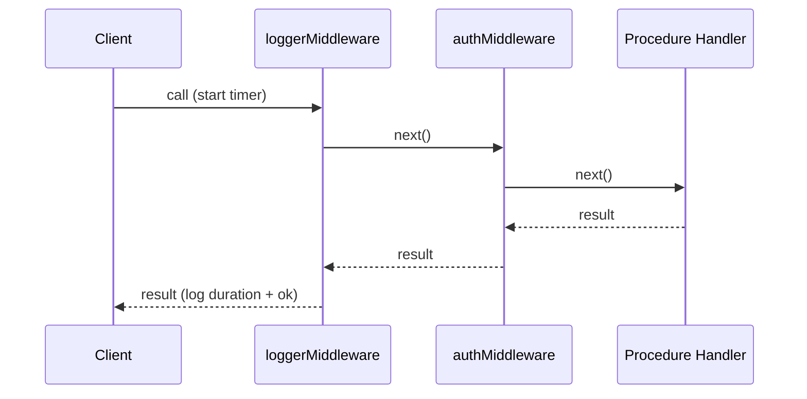

## Logging Middleware

Logging middleware in tRPC intercepts every procedure call at a central point, making it the standard place to record request metadata, measure duration, and capture errors — without adding logging logic to each individual procedure.

---

### What Logging Middleware Can Observe

A logging middleware has access to the following from its arguments:

| Property | Description |
|---|---|
| `path` | The procedure path, e.g. `user.getById` |
| `type` | The procedure type: `query`, `mutation`, or `subscription` |
| `ctx` | The current context object |
| `input` | The raw input (available after input parsing, depending on placement) |
| `next` | Function to continue the chain |

> [Inference] `input` may not always be available depending on when in the middleware chain logging is applied and how tRPC internally parses input. Verify against your tRPC version.

---

### Minimal Logging Middleware

```ts
import { initTRPC } from '@trpc/server';

const t = initTRPC.context<Context>().create();

const loggerMiddleware = t.middleware(async ({ path, type, next }) => {
  const result = await next();

  console.log(`[tRPC] ${type} ${path} — ok: ${result.ok}`);

  return result;
});
```

`result.ok` is a boolean indicating whether the procedure completed without throwing. This is part of tRPC's middleware result shape.

---

### Timing Requests

Wrapping `next()` with `Date.now()` before and after measures total procedure duration, including all downstream middleware and the handler itself.

```ts
const loggerMiddleware = t.middleware(async ({ path, type, next }) => {
  const start = Date.now();

  const result = await next();

  const durationMs = Date.now() - start;

  console.log(`[tRPC] ${type} ${path} — ${result.ok ? 'OK' : 'ERR'} — ${durationMs}ms`);

  return result;
});
```

**Example output:**
```
[tRPC] query user.getById — OK — 42ms
[tRPC] mutation post.create — ERR — 11ms
```

---

### Logging Errors

The `result` object exposes an `error` property when the procedure fails. You can branch on `result.ok` to log errors separately.

```ts
const loggerMiddleware = t.middleware(async ({ path, type, next }) => {
  const start = Date.now();
  const result = await next();
  const durationMs = Date.now() - start;

  if (!result.ok) {
    console.error(`[tRPC] ERROR — ${type} ${path} — ${durationMs}ms`, result.error);
  } else {
    console.log(`[tRPC] ${type} ${path} — ${durationMs}ms`);
  }

  return result;
});
```

> [Inference] The shape of `result.error` reflects a `TRPCError` instance. The exact properties available on it may vary by tRPC version — check your version's type definitions.

---

### Logging Input

Input can be logged for debugging purposes, with the important caveat that inputs may contain sensitive data.

```ts
const loggerMiddleware = t.middleware(async ({ path, type, input, next }) => {
  console.log(`[tRPC] ${type} ${path} — input:`, input);
  return next();
});
```

> ⚠️ **Never log raw input in production without sanitization.** Input may contain passwords, tokens, PII, or other sensitive data. Consider logging only specific fields or omitting input logging in production environments entirely.

---

### Logging Context Fields

If your context carries useful request metadata — such as a user ID, request ID, or tenant — these can be included in log output.

```ts
type Context = {
  userId?: string;
  requestId: string;
};

const loggerMiddleware = t.middleware(async ({ ctx, path, type, next }) => {
  const start = Date.now();
  const result = await next();

  console.log({
    type,
    path,
    userId: ctx.userId ?? 'unauthenticated',
    requestId: ctx.requestId,
    durationMs: Date.now() - start,
    ok: result.ok,
  });

  return result;
});
```

Structured log objects (plain JSON-serializable values) integrate more cleanly with log aggregation tools than plain strings.

---

### Structured Logging with a Logger Library

For production use, replacing `console.log` with a structured logger such as `pino` or `winston` is common practice.

```ts
import pino from 'pino';

const logger = pino();

const loggerMiddleware = t.middleware(async ({ ctx, path, type, next }) => {
  const start = Date.now();
  const result = await next();

  logger.info({
    trpc: { type, path },
    userId: ctx.userId,
    durationMs: Date.now() - start,
    ok: result.ok,
  });

  return result;
});
```

**Key Points**
- `pino` is a high-throughput JSON logger commonly used in Node.js servers. [Inference: performance claims about `pino` come from its documentation; verify independently.]
- The log shape above is illustrative; adapt field names to your logging schema.

---

### Applying the Middleware

Attach the logging middleware to a base procedure, then derive all other procedures from it.

```ts
export const baseProcedure = t.procedure.use(loggerMiddleware);

export const publicProcedure  = baseProcedure;
export const authedProcedure  = baseProcedure.use(authMiddleware);
export const adminProcedure   = authedProcedure.use(adminMiddleware);
```

Because all derived procedures inherit from `baseProcedure`, every call across the router is logged automatically.

---

### Placement in the Middleware Chain

Logging middleware is typically placed first in the chain so it captures timing and outcome across all subsequent middleware and the handler.



Placing logging last would only measure the final leg of the chain and would miss time spent in earlier middleware.

---

### Conditional Logging by Environment

It is common to vary logging behavior based on the runtime environment.

```ts
const loggerMiddleware = t.middleware(async ({ path, type, next }) => {
  const start = Date.now();
  const result = await next();

  if (process.env.NODE_ENV !== 'production') {
    console.log(`[tRPC:dev] ${type} ${path} — ${Date.now() - start}ms — ok: ${result.ok}`);
  } else {
    productionLogger.info({ type, path, ok: result.ok, ms: Date.now() - start });
  }

  return result;
});
```

> [Inference] This pattern is illustrative. The specific logger or transport used in production is application-specific and not prescribed by tRPC itself.

---

### Summary Table

| Concern | Approach |
|---|---|
| Basic request logging | Log `path`, `type`, `result.ok` after `next()` |
| Duration measurement | Record `Date.now()` before and after `next()` |
| Error logging | Branch on `result.ok`; log `result.error` when false |
| Input logging | Log `input` — only with sanitization in production |
| Contextual metadata | Read fields from `ctx` (userId, requestId, etc.) |
| Structured logging | Use `pino`, `winston`, or equivalent |
| Applying globally | Attach to a base procedure; derive all others from it |

---

**Conclusion**

Logging middleware is one of the most practical uses of tRPC's middleware system. By positioning it first in the chain and attaching it to a shared base procedure, you gain consistent observability across every procedure in your router with a single, centralized implementation. The approach scales from simple `console.log` output during development to structured, production-grade log pipelines by swapping the logging backend.