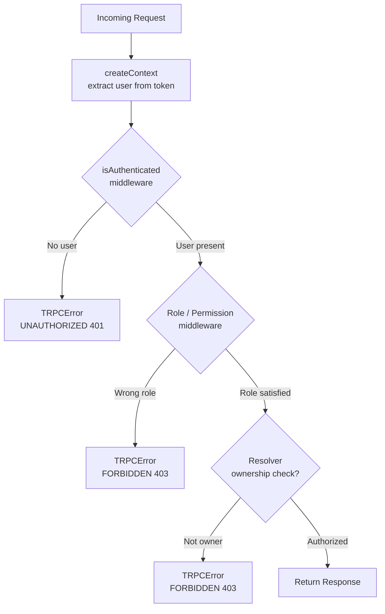

## Authorization and Role-Based Middleware

Authorization in tRPC extends authentication by answering not just _who_ the user is, but _what they are permitted to do_. Role-based access control (RBAC) is the most common pattern, where a user's role determines which procedures they can invoke.

---

### Authentication vs. Authorization

These are distinct concerns, though they are often conflated:

|Concern|Question|tRPC mechanism|
|---|---|---|
|Authentication|Is the caller who they claim to be?|`isAuthenticated` middleware|
|Authorization|Is the caller allowed to do this?|Role/permission middleware|

Authorization middleware always assumes authentication has already occurred. It should never be used as a replacement for authentication checks.

---

### Defining a Role Model

Before writing middleware, your user type must carry role information. A minimal example:

```ts
// types/user.ts
export type Role = 'user' | 'editor' | 'admin';

export interface AuthUser {
  id: string;
  email: string;
  role: Role;
}
```

This type flows from your database or session into the context, and then into middleware.

---

### Foundational Pattern: Single-Role Middleware

The simplest authorization middleware checks for one specific role:

```ts
import { TRPCError } from '@trpc/server';
import { t } from './trpc';

const isAdmin = t.middleware(({ ctx, next }) => {
  if (!ctx.user) {
    throw new TRPCError({ code: 'UNAUTHORIZED' });
  }

  if (ctx.user.role !== 'admin') {
    throw new TRPCError({
      code: 'FORBIDDEN',
      message: 'Admin access required.',
    });
  }

  return next({
    ctx: {
      ...ctx,
      user: ctx.user,
    },
  });
});

export const adminProcedure = t.procedure.use(isAdmin);
```

**Key Points:**

- Always check for `ctx.user` existence first — do not assume authentication ran upstream unless middleware chaining is enforced
- `FORBIDDEN` (403) is the correct code when the user is authenticated but lacks permission
- `UNAUTHORIZED` (401) is correct when no valid user exists at all

---

### Scalable Pattern: Role Factory Middleware

Defining a separate middleware for every role does not scale. A factory function produces role-checking middleware dynamically:

```ts
import { TRPCError } from '@trpc/server';
import { t } from './trpc';
import { Role } from './types/user';

const hasRole = (requiredRole: Role) =>
  t.middleware(({ ctx, next }) => {
    if (!ctx.user) {
      throw new TRPCError({ code: 'UNAUTHORIZED' });
    }

    if (ctx.user.role !== requiredRole) {
      throw new TRPCError({
        code: 'FORBIDDEN',
        message: `Required role: ${requiredRole}`,
      });
    }

    return next({
      ctx: {
        ...ctx,
        user: ctx.user,
      },
    });
  });

export const editorProcedure = t.procedure.use(hasRole('editor'));
export const adminProcedure  = t.procedure.use(hasRole('admin'));
```

**Key Points:**

- The factory closes over `requiredRole`, keeping each middleware instance focused
- New roles require only a new `export const` line, not a new middleware function
- [Inference] This pattern assumes roles are mutually exclusive; if a user can have multiple roles simultaneously, a different model is needed

---

### Hierarchical Roles

In many systems, higher roles inherit the permissions of lower ones (e.g., `admin` can do everything an `editor` can). A role hierarchy can be encoded as an ordered array:

```ts
const ROLE_HIERARCHY: Role[] = ['user', 'editor', 'admin'];

const hasMinimumRole = (minimumRole: Role) =>
  t.middleware(({ ctx, next }) => {
    if (!ctx.user) {
      throw new TRPCError({ code: 'UNAUTHORIZED' });
    }

    const userRoleIndex    = ROLE_HIERARCHY.indexOf(ctx.user.role);
    const requiredRoleIndex = ROLE_HIERARCHY.indexOf(minimumRole);

    if (userRoleIndex < requiredRoleIndex) {
      throw new TRPCError({
        code: 'FORBIDDEN',
        message: `Minimum role required: ${minimumRole}`,
      });
    }

    return next({
      ctx: {
        ...ctx,
        user: ctx.user,
      },
    });
  });

// An admin can access editor procedures; a user cannot
export const editorProcedure = t.procedure.use(hasMinimumRole('editor'));
export const adminProcedure  = t.procedure.use(hasMinimumRole('admin'));
```

**Key Points:**

- `indexOf` returns `-1` for unknown roles, which will always fail the comparison — a safe default
- The hierarchy is defined in one place and is easy to extend
- [Inference] This model breaks down if roles are non-linear (e.g., `moderator` and `billing-manager` at the same level with different permissions); a permission-based model is more appropriate in that case

---

### Permission-Based Authorization

Roles can be coarse-grained. A permission-based model gives finer control by checking specific capabilities rather than role names:

```ts
export type Permission =
  | 'post:read'
  | 'post:write'
  | 'post:delete'
  | 'user:manage';

export interface AuthUser {
  id: string;
  email: string;
  role: Role;
  permissions: Permission[];
}
```

**Middleware:**

```ts
const hasPermission = (required: Permission) =>
  t.middleware(({ ctx, next }) => {
    if (!ctx.user) {
      throw new TRPCError({ code: 'UNAUTHORIZED' });
    }

    if (!ctx.user.permissions.includes(required)) {
      throw new TRPCError({
        code: 'FORBIDDEN',
        message: `Missing permission: ${required}`,
      });
    }

    return next({
      ctx: {
        ...ctx,
        user: ctx.user,
      },
    });
  });

export const postWriteProcedure  = t.procedure.use(hasPermission('post:write'));
export const userManageProcedure = t.procedure.use(hasPermission('user:manage'));
```

**Key Points:**

- Permissions are checked as an array inclusion — a user may hold many permissions simultaneously
- This model is more flexible than pure RBAC but requires permissions to be stored and loaded with the user (e.g., from a database join)
- [Inference] For large permission sets, `Set` lookup (`new Set(permissions).has(required)`) is more efficient than `.includes()`; for small arrays this difference is negligible

---

### Composing Authentication and Authorization

The cleanest composition is to separate the two concerns into distinct middleware and chain them:

```ts
// trpc.ts
const isAuthenticated = t.middleware(({ ctx, next }) => {
  if (!ctx.user) {
    throw new TRPCError({ code: 'UNAUTHORIZED' });
  }
  return next({ ctx: { ...ctx, user: ctx.user } });
});

const isAdmin = t.middleware(({ ctx, next }) => {
  // At this point ctx.user may still be User | null
  // unless isAuthenticated has already narrowed it upstream
  if (!ctx.user || ctx.user.role !== 'admin') {
    throw new TRPCError({ code: 'FORBIDDEN' });
  }
  return next({ ctx: { ...ctx, user: ctx.user } });
});

export const protectedProcedure = t.procedure.use(isAuthenticated);
export const adminProcedure     = t.procedure.use(isAuthenticated).use(isAdmin);
```

> [Inference] tRPC does not currently provide a built-in mechanism to enforce middleware ordering at the type level. Whether `isAuthenticated` has run before `isAdmin` depends entirely on how you chain `.use()` calls. Behavior may vary and is not guaranteed by the framework.

---

### Resource Ownership Checks

A common authorization requirement is ensuring a user can only access their own resources. This is a form of authorization that cannot be fully handled at middleware level — it requires the resource ID from the input:

```ts
export const userRouter = t.router({
  getPost: protectedProcedure
    .input(z.object({ postId: z.string() }))
    .query(async ({ ctx, input }) => {
      const post = await getPostById(input.postId);

      if (!post) {
        throw new TRPCError({ code: 'NOT_FOUND' });
      }

      if (post.authorId !== ctx.user.id) {
        throw new TRPCError({
          code: 'FORBIDDEN',
          message: 'You do not own this resource.',
        });
      }

      return post;
    }),
});
```

**Key Points:**

- Ownership checks live in the resolver, not middleware, because they require fetching the resource first
- Middleware is appropriate for role/permission checks that do not depend on input data
- [Inference] If ownership checks are repeated across many procedures, a shared utility function (not middleware) may reduce duplication

---

### Visual Overview



---

### Error Code Reference

|Situation|Code|HTTP|
|---|---|---|
|No user in context|`UNAUTHORIZED`|401|
|User present, wrong role|`FORBIDDEN`|403|
|User present, missing permission|`FORBIDDEN`|403|
|Resource exists, wrong owner|`FORBIDDEN`|403|
|Resource does not exist|`NOT_FOUND`|404|

---

### Common Mistakes

**1. Using `UNAUTHORIZED` for role failures**

`UNAUTHORIZED` implies the caller is not authenticated. If the caller _is_ authenticated but lacks a role, `FORBIDDEN` is the semantically correct code.

**2. Putting ownership checks in middleware**

Middleware runs before input is parsed by the resolver. You cannot reliably access `input.postId` in a middleware function in the standard tRPC flow.

> [Unverified] Some community patterns pass input into middleware via context manipulation, but this is non-standard and may not be supported across tRPC versions.

**3. Duplicating auth checks inside resolvers**

If middleware already enforces authentication and role, repeating those checks in every resolver adds noise and creates drift risk when requirements change.

---

**Conclusion**

Authorization middleware in tRPC builds directly on the authentication pattern by adding role or permission checks before the resolver runs. The key design decisions are: whether roles are flat, hierarchical, or permission-based; how to compose authentication and authorization middleware cleanly; and where to draw the line between middleware-level and resolver-level checks. Ownership checks belong in resolvers; role and permission checks belong in middleware.

**Next Steps:** Middleware — Logging and observability middleware