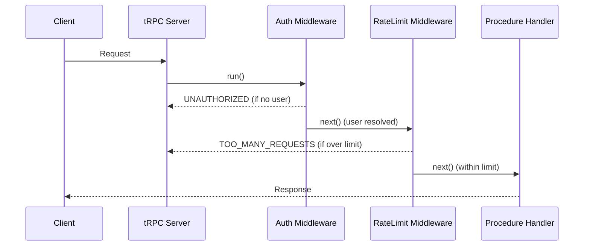

## Rate Limiting Middleware

Rate limiting middleware in tRPC controls how frequently clients can invoke procedures, protecting backend resources from abuse, runaway clients, or unintentional flooding. It is implemented as tRPC middleware using the `t.middleware()` API and integrates naturally into the procedure builder chain.

---

### Why Rate Limit at the Middleware Level

Rate limiting can be applied at multiple layers — reverse proxies, API gateways, or application code. Applying it in tRPC middleware specifically allows:

- Per-procedure or per-router granularity
- Access to parsed context (e.g., authenticated user ID, IP address)
- Consistent enforcement regardless of transport (HTTP, WebSocket, etc.)
- Reuse across procedure builders via `.use()`

---

### Prerequisites

tRPC does not ship a built-in rate limiter. You supply the limiting logic. Common backing libraries include:

- [`rate-limiter-flexible`](https://github.com/animir/node-rate-limiter-flexible) — versatile, supports Redis and in-memory
- [`upstash/ratelimit`](https://github.com/upstash/ratelimit) — designed for edge/serverless with Redis backend
- Custom in-memory stores using `Map` — suitable for single-instance development environments

> [Inference] In production, an in-memory store is generally insufficient for multi-instance deployments because each instance maintains its own counter. Behavior may vary depending on your deployment topology.

---

### Basic Structure of Rate Limiting Middleware

```ts
import { TRPCError } from '@trpc/server';
import { t } from './trpc'; // your tRPC instance

const rateLimitMiddleware = t.middleware(async ({ ctx, next }) => {
  // 1. Identify the client
  const identifier = ctx.user?.id ?? ctx.ip ?? 'anonymous';

  // 2. Check rate limit
  const allowed = await checkRateLimit(identifier);

  if (!allowed) {
    throw new TRPCError({
      code: 'TOO_MANY_REQUESTS',
      message: 'Rate limit exceeded. Please try again later.',
    });
  }

  // 3. Proceed if within limit
  return next();
});
```

**Key Points**
- `ctx` carries identifying information (user ID, IP, API key, etc.)
- Throwing `TRPCError` with code `'TOO_MANY_REQUESTS'` maps to HTTP 429 when using the HTTP adapter
- `next()` is only called when the request is permitted

---

### Implementing the Limit Check

#### In-Memory Store (Development / Single Instance)

```ts
const requestCounts = new Map<string, { count: number; resetAt: number }>();

function checkRateLimit(identifier: string, limit = 10, windowMs = 60_000): boolean {
  const now = Date.now();
  const record = requestCounts.get(identifier);

  if (!record || now > record.resetAt) {
    requestCounts.set(identifier, { count: 1, resetAt: now + windowMs });
    return true;
  }

  if (record.count >= limit) {
    return false;
  }

  record.count++;
  return true;
}
```

> [Inference] This implementation is not thread-safe in environments with concurrent async operations and may not behave reliably under high concurrency. Behavior may vary.

---

#### Using `rate-limiter-flexible` (Redis-backed)

```ts
import { RateLimiterRedis } from 'rate-limiter-flexible';
import { redisClient } from './redis';

const rateLimiter = new RateLimiterRedis({
  storeClient: redisClient,
  keyPrefix: 'trpc_rl',
  points: 10,       // maximum requests
  duration: 60,     // per 60 seconds
});

async function checkRateLimit(identifier: string): Promise<boolean> {
  try {
    await rateLimiter.consume(identifier);
    return true;
  } catch {
    return false;
  }
}
```

**Key Points**
- `points` is the request budget per window
- `duration` is the window length in seconds
- `.consume()` throws a `RateLimiterRes` object (not a standard `Error`) when the limit is exceeded — the `catch` block here treats any rejection as a limit violation

---

#### Using Upstash Ratelimit (Edge / Serverless)

```ts
import { Ratelimit } from '@upstash/ratelimit';
import { Redis } from '@upstash/redis';

const ratelimit = new Ratelimit({
  redis: Redis.fromEnv(),
  limiter: Ratelimit.slidingWindow(10, '60 s'),
});

async function checkRateLimit(identifier: string): Promise<boolean> {
  const { success } = await ratelimit.limit(identifier);
  return success;
}
```

**Key Points**
- `slidingWindow` spreads the budget across time more smoothly than a fixed window
- `fromEnv()` reads `UPSTASH_REDIS_REST_URL` and `UPSTASH_REDIS_REST_TOKEN` from environment variables

---

### Attaching the Middleware to Procedures

Rate limiting middleware is composed the same way as any other tRPC middleware.

#### Applied to a specific procedure builder

```ts
export const rateLimitedProcedure = t.procedure.use(rateLimitMiddleware);

// Usage
export const appRouter = t.router({
  sendMessage: rateLimitedProcedure
    .input(z.object({ text: z.string() }))
    .mutation(async ({ input }) => {
      // handler
    }),
});
```

#### Applied to an entire router

```ts
export const messagingRouter = t.router({
  send: rateLimitedProcedure.input(...).mutation(...),
  list: rateLimitedProcedure.query(...),
});
```

---

### Combining with Authentication Middleware

Rate limiting commonly sits after authentication so the identifier is a resolved user ID rather than a raw IP address, which is more reliable and less prone to spoofing.

```ts
const authMiddleware = t.middleware(async ({ ctx, next }) => {
  if (!ctx.user) {
    throw new TRPCError({ code: 'UNAUTHORIZED' });
  }
  return next({ ctx: { ...ctx, user: ctx.user } });
});

const rateLimitMiddleware = t.middleware(async ({ ctx, next }) => {
  const identifier = ctx.user.id; // user is guaranteed present by prior middleware
  const allowed = await checkRateLimit(identifier);

  if (!allowed) {
    throw new TRPCError({ code: 'TOO_MANY_REQUESTS' });
  }

  return next();
});

export const protectedRateLimitedProcedure = t.procedure
  .use(authMiddleware)
  .use(rateLimitMiddleware);
```

> [Inference] Middleware executes in the order `.use()` calls are chained. Behavior may vary if middleware order is changed or if the tRPC version handles chaining differently.

---

### Per-Procedure Rate Limit Configuration

You can parameterize rate limit middleware using a factory function to allow different limits per procedure.

```ts
function createRateLimitMiddleware(limit: number, windowMs: number) {
  return t.middleware(async ({ ctx, next }) => {
    const identifier = ctx.user?.id ?? ctx.ip ?? 'anonymous';
    const allowed = checkRateLimit(`${identifier}:${limit}:${windowMs}`, limit, windowMs);

    if (!allowed) {
      throw new TRPCError({ code: 'TOO_MANY_REQUESTS' });
    }

    return next();
  });
}

// Usage
const strictLimit = createRateLimitMiddleware(3, 60_000);   // 3 req/min
const looseLimit  = createRateLimitMiddleware(100, 60_000); // 100 req/min

export const sensitiveRouter = t.router({
  requestPasswordReset: t.procedure.use(strictLimit).mutation(...),
  listItems:            t.procedure.use(looseLimit).query(...),
});
```

---

### Returning Rate Limit Headers (Optional)

When using HTTP adapters, you may want to surface rate limit metadata in response headers. tRPC does not natively support setting response headers from middleware, but the HTTP adapter exposes `res` (for Express/Fastify) or `resHeaders` (for fetch-based adapters) through context.

```ts
// Express-based example — depends on how your context is constructed
const rateLimitMiddleware = t.middleware(async ({ ctx, next }) => {
  const identifier = ctx.user?.id ?? ctx.ip;
  const result = await rateLimiter.get(identifier);

  ctx.res?.setHeader('X-RateLimit-Remaining', result?.remainingPoints ?? 0);

  const allowed = await checkRateLimit(identifier);
  if (!allowed) throw new TRPCError({ code: 'TOO_MANY_REQUESTS' });

  return next();
});
```

> [Unverified] Header-setting behavior depends on the specific HTTP adapter and server framework in use. Verify against the adapter's documentation for your setup.

---

### Diagram — Middleware Execution Flow



---

### Error Codes Reference

| Scenario | tRPC Error Code | HTTP Status (HTTP adapter) |
|---|---|---|
| Limit exceeded | `TOO_MANY_REQUESTS` | 429 |
| Not authenticated | `UNAUTHORIZED` | 401 |
| Internal limiter failure | `INTERNAL_SERVER_ERROR` | 500 |

---

### Caveats and Considerations

- **Clock drift** — Fixed window counters can allow up to 2× the intended limit at window boundaries. Sliding window algorithms reduce this but are more expensive. [Inference] Behavior depends on the algorithm chosen and the precision of the backing store's clock.
- **Distributed deployments** — In-memory stores are per-instance. A Redis-backed or external store is necessary for consistent limits across multiple server instances.
- **Serverless cold starts** — Stateful in-memory stores reset on each cold start. Use a persistent external store in serverless environments.
- **Anonymous traffic** — IP-based identification can be unreliable behind NAT or shared proxies.