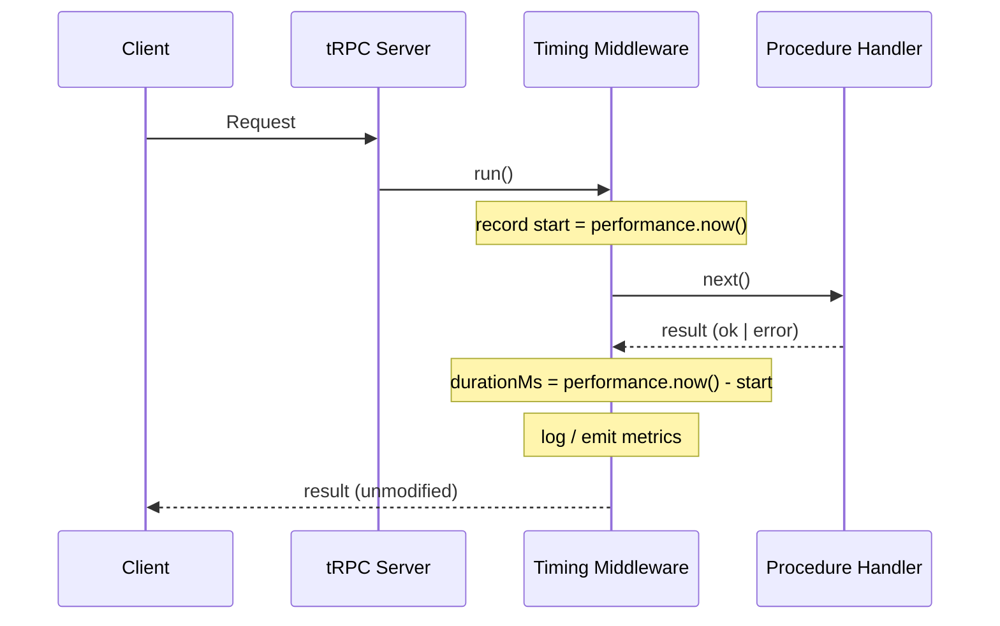

## Timing and Performance Middleware

Timing and performance middleware in tRPC measures how long procedures take to execute, surfaces that data for logging or monitoring, and optionally exposes it to clients via response metadata. It is implemented using `t.middleware()` and wraps the `next()` call to capture elapsed time.

---

### Purpose and Use Cases

- Identifying slow procedures during development and production
- Feeding latency data into observability platforms (Datadog, Grafana, OpenTelemetry)
- Alerting when procedures exceed acceptable thresholds
- Annotating logs with duration for structured log analysis
- Surfacing timing hints to clients via response headers or metadata

---

### Basic Timing Middleware

The core pattern is straightforward: record a timestamp before calling `next()`, then compute the delta from the result.

```ts
import { t } from './trpc';

const timingMiddleware = t.middleware(async ({ path, type, next }) => {
  const start = performance.now();

  const result = await next();

  const durationMs = performance.now() - start;

  console.log(`[tRPC] ${type} ${path} — ${durationMs.toFixed(2)}ms`);

  return result;
});
```

**Key Points**
- `performance.now()` is preferred over `Date.now()` for measuring elapsed time because it uses a monotonic high-resolution clock, avoiding issues with system clock adjustments
- `path` is the procedure path string (e.g., `user.getById`)
- `type` is `'query'`, `'mutation'`, or `'subscription'`
- The middleware returns `result` unmodified — it only observes, it does not alter the response

---

### Accessing `ok` Status

The object returned by `next()` includes an `ok` boolean indicating whether the procedure succeeded or threw.

```ts
const timingMiddleware = t.middleware(async ({ path, type, next }) => {
  const start = performance.now();

  const result = await next();

  const durationMs = performance.now() - start;
  const status = result.ok ? 'OK' : 'ERROR';

  console.log(`[tRPC] ${type} ${path} — ${status} — ${durationMs.toFixed(2)}ms`);

  return result;
});
```

> [Inference] Even when a procedure throws, `next()` resolves rather than rejects — the error is captured in `result.ok === false`. Behavior may vary; verify against the tRPC version in use.

---

### Structured Log Output

For production observability, flat strings are less useful than structured objects that log collectors can parse and index.

```ts
import { t } from './trpc';

const timingMiddleware = t.middleware(async ({ path, type, ctx, next }) => {
  const start = performance.now();

  const result = await next();

  const durationMs = parseFloat(performance.now().toFixed(2) - start.toFixed(2));

  const logEntry = {
    timestamp: new Date().toISOString(),
    procedure: path,
    type,
    userId: ctx.user?.id ?? null,
    durationMs: parseFloat((performance.now() - start).toFixed(2)),
    success: result.ok,
  };

  console.log(JSON.stringify(logEntry));

  return result;
});
```

**Example output**

```json
{
  "timestamp": "2024-11-01T10:42:00.000Z",
  "procedure": "post.create",
  "type": "mutation",
  "userId": "user_abc123",
  "durationMs": 143.87,
  "success": true
}
```

---

### Slow Procedure Detection

You can emit a distinct warning when a procedure exceeds a defined threshold.

```ts
const SLOW_THRESHOLD_MS = 500;

const timingMiddleware = t.middleware(async ({ path, type, next }) => {
  const start = performance.now();

  const result = await next();

  const durationMs = performance.now() - start;

  if (durationMs > SLOW_THRESHOLD_MS) {
    console.warn(`[tRPC] SLOW ${type} ${path} — ${durationMs.toFixed(2)}ms`);
  } else {
    console.log(`[tRPC] ${type} ${path} — ${durationMs.toFixed(2)}ms`);
  }

  return result;
});
```

> [Inference] What constitutes "slow" is application-dependent. The threshold above is illustrative. Behavior of downstream systems (alerts, dashboards) depends on your observability setup.

---

### Integrating with OpenTelemetry

For teams using distributed tracing, timing middleware can create and close spans around procedure execution.

```ts
import { trace, SpanStatusCode } from '@opentelemetry/api';

const tracer = trace.getTracer('trpc-server');

const tracingMiddleware = t.middleware(async ({ path, type, next }) => {
  return tracer.startActiveSpan(`trpc.${type}.${path}`, async (span) => {
    span.setAttribute('trpc.procedure', path);
    span.setAttribute('trpc.type', type);

    const result = await next();

    if (!result.ok) {
      span.setStatus({ code: SpanStatusCode.ERROR });
    } else {
      span.setStatus({ code: SpanStatusCode.OK });
    }

    span.end();
    return result;
  });
});
```

**Key Points**
- `startActiveSpan` automatically propagates the span context through the async call stack
- `span.end()` must always be called — placing `return result` after it ensures the span closes even when `result.ok` is false
- This assumes an OpenTelemetry SDK is already configured and a trace exporter is connected

> [Unverified] Full distributed trace propagation (e.g., from client to server) requires additional context propagation setup in your HTTP adapter and client. Verify against OpenTelemetry and tRPC adapter documentation.

---

### Exposing Timing to Clients

tRPC does not have a native mechanism for attaching arbitrary metadata to procedure responses. However, timing data can be surfaced via:

#### Response headers (HTTP adapters)

```ts
const timingMiddleware = t.middleware(async ({ ctx, path, next }) => {
  const start = performance.now();

  const result = await next();

  const durationMs = (performance.now() - start).toFixed(2);

  // Express-based context
  ctx.res?.setHeader('Server-Timing', `trpc;dur=${durationMs};desc="${path}"`);

  return result;
});
```

The `Server-Timing` header is a standard HTTP header that browsers and tools like Chrome DevTools display natively in the Network panel.

> [Unverified] Header injection depends on your HTTP adapter and how `ctx` is constructed. This may not work with all adapters. Verify against your specific adapter's documentation.

---

#### Diagram — Timing Middleware Execution



---

### Composing with Other Middleware

Timing middleware is most useful when it wraps all other middleware, so the measured duration includes authentication, authorization, and rate limiting overhead.

```ts
export const baseProcedure = t.procedure
  .use(timingMiddleware)   // outermost — measures total time
  .use(authMiddleware)
  .use(rateLimitMiddleware);
```

> [Inference] Because middleware executes in chain order and `next()` delegates to the next layer, placing timing middleware first means its measured window includes all subsequent middleware and the procedure handler. Behavior may vary depending on tRPC version and async scheduling.

If you want to measure only the procedure handler's execution time, place the timing middleware last in the chain.

```ts
export const baseProcedure = t.procedure
  .use(authMiddleware)
  .use(rateLimitMiddleware)
  .use(timingMiddleware);  // innermost — measures handler only
```

---

### Middleware Position and What It Measures

| Position in chain | Measures |
|---|---|
| First (outermost) | Total request time including all middleware |
| Last (innermost) | Procedure handler time only |
| Between others | Time from that point inward |

---

### Considerations and Caveats

- **`performance.now()` availability** — Available in Node.js 16+ and all modern browsers. In older Node.js environments, use `process.hrtime.bigint()` instead.
- **Async overhead** — The measured duration includes event loop scheduling delays, not just pure handler execution time. [Inference] This is generally acceptable for observability purposes but is not a precise CPU-time measurement.
- **Subscriptions** — For subscription procedures, `next()` resolves when the subscription is established, not when it completes. Timing middleware applied to subscriptions measures setup time, not total stream duration.
- **Side effects in logging** — Avoid blocking the return path with slow log writes (e.g., synchronous file I/O). Use asynchronous log transports.