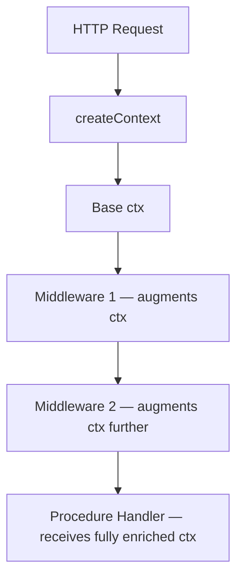
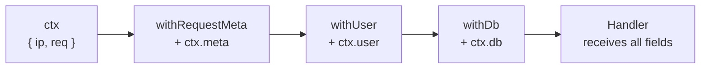

## Context Augmentation in Middleware

Context augmentation is the practice of enriching the `ctx` object inside middleware before passing it downstream to procedures. Rather than repeating data-fetching or transformation logic in every procedure handler, middleware resolves shared dependencies once and injects them into context, where all subsequent middleware and handlers can access them in a type-safe way.

---

### How tRPC Context Flows

tRPC initializes a base context via the `createContext` function you supply to the adapter. This base context is available to all middleware and procedures. Middleware can extend it by passing a new `ctx` object to `next()`.



---

### The Augmentation Mechanism

The `next()` function accepted inside middleware optionally takes an object with a `ctx` property. Whatever is passed there becomes the context for all layers below.

```ts
const myMiddleware = t.middleware(async ({ ctx, next }) => {
  const extraData = await fetchSomething();

  return next({
    ctx: {
      ...ctx,          // preserve existing context
      extraData,       // inject new field
    },
  });
});
```

**Key Points**

- Spreading `...ctx` is necessary to preserve fields set by earlier middleware or `createContext`
- Fields added here are visible to all middleware and handlers chained after this one
- Fields are not visible to middleware that ran before this one

> [Inference] tRPC infers the augmented context type from the argument passed to `next()`. If the spread is omitted, earlier context fields may appear missing to TypeScript's type checker. Behavior may vary by tRPC version.

---

### Type Inference of Augmented Context

tRPC uses TypeScript inference to propagate the augmented context type automatically. You do not need to declare the output type manually — it is derived from what you pass to `next()`.

```ts
import { initTRPC } from '@trpc/server';

type BaseContext = {
  ip: string;
  req: Request;
};

const t = initTRPC.context<BaseContext>().create();

const withUser = t.middleware(async ({ ctx, next }) => {
  const user = await getUserFromRequest(ctx.req);

  return next({
    ctx: {
      ...ctx,
      user, // type inferred from getUserFromRequest return type
    },
  });
});

// Downstream procedures see ctx.user with full type information
const authedProcedure = t.procedure.use(withUser);
```

**Key Points**

- `ctx.user` in handlers using `authedProcedure` will be typed as the return type of `getUserFromRequest`
- No manual type casting or declaration is needed in most cases
- The base context type is declared once at `initTRPC`

---

### Common Augmentation Patterns

#### User / Session Injection

The most frequent use case — resolve a user from a session token or cookie and make it available everywhere.

```ts
const withUser = t.middleware(async ({ ctx, next }) => {
  const token = ctx.req.headers.authorization?.split(' ')[1];

  if (!token) {
    return next({ ctx: { ...ctx, user: null } });
  }

  const user = await verifyToken(token);

  return next({
    ctx: {
      ...ctx,
      user,
    },
  });
});
```

Downstream procedures can then check `ctx.user` rather than repeating token verification logic.

---

#### Database Client Injection

Attach a request-scoped database connection or transaction to context.

```ts
const withDb = t.middleware(async ({ ctx, next }) => {
  const db = await createDbConnection();

  try {
    return await next({
      ctx: {
        ...ctx,
        db,
      },
    });
  } finally {
    await db.close();
  }
});
```

**Key Points**

- The `try/finally` block ensures the connection is closed regardless of whether the procedure succeeds or throws
- Procedures receive `ctx.db` typed as the return type of `createDbConnection()`

> [Inference] Whether a per-request connection is appropriate depends on your database driver and connection pooling strategy. Behavior and performance implications vary by environment.

---

#### Feature Flags

Resolve feature flag state once per request and inject it for use in handlers.

```ts
const withFeatureFlags = t.middleware(async ({ ctx, next }) => {
  const flags = await featureFlagClient.getFlags({
    userId: ctx.user?.id,
  });

  return next({
    ctx: {
      ...ctx,
      flags,
    },
  });
});

// In a handler
const myProcedure = authedProcedure.query(({ ctx }) => {
  if (ctx.flags.newDashboard) {
    return getNewDashboardData();
  }
  return getLegacyDashboardData();
});
```

---

#### Request Metadata

Attach parsed or derived request metadata for use in logging or auditing.

```ts
const withRequestMeta = t.middleware(async ({ ctx, next }) => {
  return next({
    ctx: {
      ...ctx,
      meta: {
        ip: ctx.req.headers['x-forwarded-for'] ?? ctx.req.socket.remoteAddress,
        userAgent: ctx.req.headers['user-agent'] ?? 'unknown',
        requestId: crypto.randomUUID(),
      },
    },
  });
});
```

---

### Chaining Multiple Augmentations

Multiple middleware layers can each add their own fields. Each layer receives the context as augmented by all prior layers.

```ts
export const baseProcedure = t.procedure
  .use(withRequestMeta)   // adds ctx.meta
  .use(withUser)          // adds ctx.user — can read ctx.meta
  .use(withDb)            // adds ctx.db  — can read ctx.meta and ctx.user
  .use(timingMiddleware); // can read all of the above
```



> [Inference] Each `.use()` call layers context additively from the perspective of the type system, provided each middleware spreads `...ctx`. TypeScript infers the cumulative type through the chain. Behavior may vary if any middleware omits the spread.

---

### Narrowing Context for Protected Procedures

A common pattern is to produce a narrowed, guaranteed-non-null context type for procedures that require authentication, avoiding optional chaining throughout handler code.

```ts
type AuthedContext = {
  user: NonNullable<BaseContext['user']>;
};

const enforceAuth = t.middleware(({ ctx, next }) => {
  if (!ctx.user) {
    throw new TRPCError({ code: 'UNAUTHORIZED' });
  }

  return next({
    ctx: {
      ...ctx,
      user: ctx.user, // narrowed: no longer possibly null
    },
  });
});

export const protectedProcedure = t.procedure
  .use(withUser)
  .use(enforceAuth);

// ctx.user in handlers on protectedProcedure is typed as non-null
```

**Key Points**

- `withUser` resolves and attaches the user (possibly `null`)
- `enforceAuth` throws if null, then re-passes `ctx.user` — TypeScript narrows the type because the throw eliminates the null branch
- Handlers on `protectedProcedure` access `ctx.user` without null checks

---

### Avoiding Common Mistakes

#### Forgetting to spread `ctx`

```ts
// Incorrect — drops all prior context fields
return next({
  ctx: {
    user,
  },
});

// Correct
return next({
  ctx: {
    ...ctx,
    user,
  },
});
```

#### Mutating `ctx` directly

```ts
// Incorrect — ctx mutation is not reflected downstream in all tRPC versions
ctx.user = await getUser();
return next();

// Correct — pass augmented ctx explicitly
return next({ ctx: { ...ctx, user: await getUser() } });
```

> [Inference] Direct mutation of `ctx` may appear to work in some cases but is not the documented pattern. Behavior is not guaranteed and may vary across tRPC versions.

---

#### Performing expensive work unconditionally

If augmentation middleware performs costly operations (e.g., database queries, external API calls), it runs for every procedure that uses it — including procedures that do not need that data.

```ts
// [Inference] One mitigation is lazy evaluation via getters, though
// this pattern is less common and type inference behavior may vary.
return next({
  ctx: {
    ...ctx,
    getUser: () => fetchUser(ctx.req), // deferred, called only if needed
  },
});
```

> [Speculation] Lazy context fields could reduce unnecessary work in high-traffic scenarios, but this has tradeoffs in ergonomics and type complexity. Evaluate based on your specific performance profile.

---

### Summary of Augmentation Responsibilities

| Middleware         | Adds to `ctx`                     | Typical position      |
| ------------------ | --------------------------------- | --------------------- |
| `withRequestMeta`  | `meta` (IP, requestId, userAgent) | First                 |
| `withUser`         | `user` (resolved or null)         | Early                 |
| `enforceAuth`      | `user` (narrowed, non-null)       | After `withUser`      |
| `withDb`           | `db` (connection/client)          | After auth            |
| `withFeatureFlags` | `flags`                           | After user resolution |
| `timingMiddleware` | Nothing (observes only)           | First or last         |

