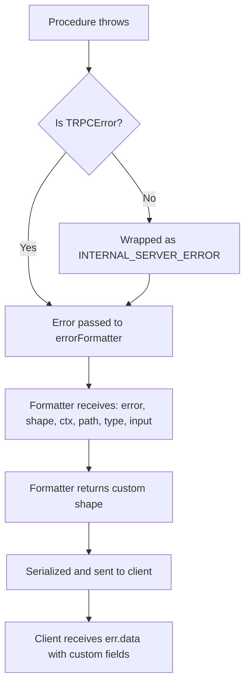

## Custom Error Formatting

### What Is a Custom Error Formatter

tRPC provides a default error format that includes `message`, `code`, and basic metadata. A custom error formatter replaces or extends this default shape, allowing you to control exactly what the client receives when an error occurs — including additional fields, sanitized messages, or structured validation error details.

The formatter runs on the server and its output is what gets serialized and sent to the client.

---

### Where It Is Configured

The error formatter is set on the tRPC initialization object via `initTRPC`, using the `.create()` call's `errorFormatter` option. It applies globally to all procedures in the router built from that `t` instance.

```ts
import { initTRPC } from '@trpc/server';

const t = initTRPC.context<Context>().create({
  errorFormatter({ shape, error }) {
    return shape; // default passthrough
  },
});
```

---

### The errorFormatter Signature

```ts
errorFormatter<TContext, TMeta>(opts: {
  error: TRPCError;
  type: 'query' | 'mutation' | 'subscription' | 'unknown';
  path: string | undefined;
  input: unknown;
  ctx: TContext | undefined;
  shape: DefaultErrorShape;
}): unknown;
```

**Key Points**
- `error` — the raw `TRPCError` that was thrown, including `cause`
- `type` — the procedure type that threw the error
- `path` — the procedure path (e.g., `"user.getById"`)
- `input` — the raw input passed to the procedure
- `ctx` — the request context; may be `undefined` if context creation itself failed
- `shape` — the default error shape tRPC would send without customization

The return value of `errorFormatter` becomes the error object the client receives. [Inference] tRPC likely serializes this return value using its standard serialization pipeline. Behavior may vary depending on the transformer in use.

---

### Default Shape

Before customizing, it helps to understand what `shape` contains by default.

```ts
{
  message: string;
  code: number;        // numeric HTTP-equivalent code
  data: {
    code: string;      // tRPC error code, e.g. "NOT_FOUND"
    httpStatus: number;
    path: string | undefined;
    stack: string | undefined; // only in development
  };
}
```

**Key Points**
- `shape.data.code` is the string tRPC code (e.g., `"FORBIDDEN"`)
- `shape.code` is the numeric representation
- `stack` is included in development mode only by default; [Inference] this behavior is controlled by tRPC internally and may vary across versions

---

### Extending the Default Shape

The most common pattern is spreading `shape` and appending additional fields under `data`.

**Example**

```ts
const t = initTRPC.context<Context>().create({
  errorFormatter({ shape, error }) {
    return {
      ...shape,
      data: {
        ...shape.data,
        cause: error.cause instanceof Error
          ? error.cause.message
          : undefined,
      },
    };
  },
});
```

**Output** (client-side `err.data`)

```json
{
  "code": "INTERNAL_SERVER_ERROR",
  "httpStatus": 500,
  "path": "sendEmail",
  "cause": "ECONNREFUSED: Connection refused"
}
```

---

### Including Zod Validation Errors

A very common use case is surfacing Zod field-level validation errors in a structured format so the client can map errors to specific form fields.

**Example**

```ts
import { ZodError } from 'zod';

const t = initTRPC.context<Context>().create({
  errorFormatter({ shape, error }) {
    return {
      ...shape,
      data: {
        ...shape.data,
        zodError:
          error.cause instanceof ZodError
            ? error.cause.flatten()
            : null,
      },
    };
  },
});
```

**Key Points**
- `ZodError.flatten()` produces `{ fieldErrors, formErrors }` — a structured map of field-level failures
- `error.cause` is the raw `ZodError` when a Zod validation fails; tRPC sets this internally [Inference: behavior may vary across versions]
- When a manual `TRPCError` is thrown without a `ZodError` cause, `zodError` will be `null`

**Output** (client-side `err.data.zodError`)

```json
{
  "fieldErrors": {
    "email": ["Invalid email"],
    "age": ["Expected number, received string"]
  },
  "formErrors": []
}
```

---

### Accessing ctx Inside the Formatter

`ctx` is available inside the formatter, though it may be `undefined` if the context function threw before completing. This allows you to conditionally include sensitive information only for certain roles.

**Example**

```ts
const t = initTRPC.context<Context>().create({
  errorFormatter({ shape, error, ctx }) {
    return {
      ...shape,
      data: {
        ...shape.data,
        internalMessage:
          ctx?.user?.role === 'admin'
            ? error.message
            : undefined,
      },
    };
  },
});
```

**Key Points**
- Non-admin clients receive `internalMessage: undefined`
- Admin clients receive the full error message
- [Inference] Whether `ctx` is populated depends on whether context creation completed before the error was thrown. This is not guaranteed.

---

### Sanitizing Error Messages

In production, raw error messages may leak internal details. A formatter can replace messages based on the error code or environment.

**Example**

```ts
const t = initTRPC.context<Context>().create({
  errorFormatter({ shape, error }) {
    const isProduction = process.env.NODE_ENV === 'production';

    return {
      ...shape,
      message:
        isProduction && shape.data.code === 'INTERNAL_SERVER_ERROR'
          ? 'An unexpected error occurred.'
          : shape.message,
    };
  },
});
```

---

### Inferring the Error Shape on the Client

When using tRPC with TypeScript, the client can infer the custom error shape if you export the router type. The client-side `err.data` type will reflect your formatter's return shape.

**Example**

```ts
// server: router.ts
export type AppRouter = typeof appRouter;

// client: trpc.ts
import type { AppRouter } from './server/router';
import { createTRPCClient } from '@trpc/client';

const client = createTRPCClient<AppRouter>({ ... });

// err.data is now typed to your custom shape
```

[Inference] Full end-to-end type inference of the error shape depends on the tRPC version and client setup used. Behavior may vary. Verify against the version in use.

---

### Full Example — Combined Formatter

```ts
import { initTRPC } from '@trpc/server';
import { ZodError } from 'zod';

const t = initTRPC.context<Context>().create({
  errorFormatter({ shape, error, ctx, path, type }) {
    const isProduction = process.env.NODE_ENV === 'production';

    return {
      ...shape,
      message:
        isProduction && shape.data.code === 'INTERNAL_SERVER_ERROR'
          ? 'An unexpected error occurred.'
          : shape.message,
      data: {
        ...shape.data,
        zodError:
          error.cause instanceof ZodError
            ? error.cause.flatten()
            : null,
        cause:
          !isProduction && error.cause instanceof Error
            ? error.cause.message
            : undefined,
        meta: {
          path,
          type,
          userId: ctx?.user?.id ?? null,
        },
      },
    };
  },
});
```

---

### Formatter Execution Flow



---

### Common Mistakes

| Mistake | Effect |
|---|---|
| Not spreading `...shape` | Loses default fields like `code` and `httpStatus`; client may break |
| Not spreading `...shape.data` | Loses `code`, `path`, `stack` from `data` |
| Returning sensitive data unconditionally | Exposes internal details to all clients |
| Assuming `ctx` is always defined | `ctx` may be `undefined` if context creation failed |
| Expecting `zodError` on manual throws | Only present when `error.cause` is a `ZodError` instance |

---

**Conclusion**

The `errorFormatter` option in `initTRPC.create()` is the single configuration point for shaping all error responses in a tRPC application. It provides access to the thrown error, the default shape, the context, and procedure metadata. The most useful patterns are extending the default shape with Zod field errors, sanitizing messages by environment, and conditionally surfacing internal details based on user role.

**Next Steps** — Error handling on the client with `TRPCClientError`, and reacting to specific error codes in UI logic.