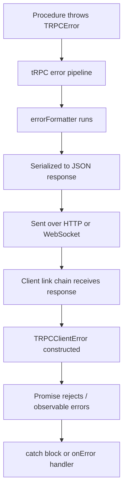
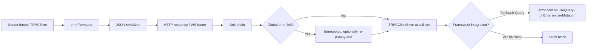

## Error Propagation to the Client

### Overview

When a tRPC procedure throws a `TRPCError`, the error travels through tRPC's internal pipeline, gets passed through the error formatter, is serialized, and is transmitted to the client over the transport layer. On the client side, tRPC reconstructs the error as a `TRPCClientError` instance. Understanding this propagation path determines how errors are caught, inspected, and handled in client code.

---

### Propagation Path



---

### TRPCClientError

`TRPCClientError` is the error class tRPC constructs on the client when a procedure call fails. It is importable from `@trpc/client`.

```ts
import { TRPCClientError } from '@trpc/client';
```

**Key Properties**

|Property|Type|Description|
|---|---|---|
|`message`|`string`|The error message from the server|
|`data`|`object \| undefined`|The `data` field from the formatted error shape|
|`data.code`|`string`|The tRPC error code string (e.g., `"NOT_FOUND"`)|
|`data.httpStatus`|`number`|The HTTP status code equivalent|
|`data.path`|`string \| undefined`|The procedure path that threw|
|`data.stack`|`string \| undefined`|Stack trace (development only)|
|`shape`|`object \| undefined`|The full raw error shape from the server|

[Inference] The exact shape of `data` depends on what your `errorFormatter` returns. The above reflects the default shape. Behavior may vary if a custom formatter is configured.

---

### Catching Errors with try/catch

For vanilla tRPC client calls (without a framework integration), errors are caught with standard `try/catch` in async functions.

**Example**

```ts
import { TRPCClientError } from '@trpc/client';

async function loadUser(id: string) {
  try {
    const user = await trpc.user.getById.query({ id });
    return user;
  } catch (err) {
    if (err instanceof TRPCClientError) {
      console.log(err.message);           // "User not found."
      console.log(err.data?.code);        // "NOT_FOUND"
      console.log(err.data?.httpStatus);  // 404
      console.log(err.data?.path);        // "user.getById"
    }
  }
}
```

**Key Points**

- Always narrow with `instanceof TRPCClientError` before accessing `.data`
- Non-tRPC errors (network failures, timeouts) may also reach this catch block and will not be `TRPCClientError` instances
- `err.data` may be `undefined` if the server returned a malformed or unexpected response

---

### Checking the Error Code

The most common client-side pattern is branching on `err.data?.code` to handle specific failure modes differently.

**Example**

```ts
try {
  await trpc.post.delete.mutate({ id: postId });
} catch (err) {
  if (err instanceof TRPCClientError) {
    switch (err.data?.code) {
      case 'UNAUTHORIZED':
        redirectToLogin();
        break;
      case 'FORBIDDEN':
        showToast('You do not have permission to delete this post.');
        break;
      case 'NOT_FOUND':
        showToast('Post no longer exists.');
        break;
      default:
        showToast('Something went wrong. Please try again.');
    }
  }
}
```

---

### Using isTRPCClientError

tRPC also provides a static type guard method for narrowing without `instanceof`. This can be useful in environments where class identity checks may be unreliable across module boundaries. [Inference] Behavior of `instanceof` across bundler module boundaries may vary; the static method is a safer alternative in those cases.

```ts
if (TRPCClientError.isTRPCClientError(err)) {
  console.log(err.data?.code);
}
```

---

### Error Propagation with TanStack Query

When tRPC is used with TanStack Query (React Query), errors surface through the query or mutation result object rather than a catch block. The error is still a `TRPCClientError`.

**Example — query**

```tsx
const { data, error, isError } = trpc.post.getById.useQuery({ id });

if (isError) {
  if (error instanceof TRPCClientError) {
    if (error.data?.code === 'NOT_FOUND') {
      return <p>Post not found.</p>;
    }
  }
}
```

**Example — mutation**

```tsx
const deletePost = trpc.post.delete.useMutation({
  onError(err) {
    if (err.data?.code === 'FORBIDDEN') {
      showToast('Permission denied.');
    }
  },
});
```

**Key Points**

- In TanStack Query, the `error` object from `useQuery` is typed as `TRPCClientError` automatically when using tRPC's React integration
- `onError` on `useMutation` receives the `TRPCClientError` directly
- [Inference] Type inference of the error shape depends on the tRPC version and React integration in use. Behavior may vary.

---

### Accessing Custom Error Formatter Fields

If a custom `errorFormatter` was configured on the server to add fields such as `zodError`, those fields are accessible on the client via `err.data`.

**Example**

```ts
try {
  await trpc.user.create.mutate({ email: 'invalid' });
} catch (err) {
  if (err instanceof TRPCClientError) {
    const zodError = err.data?.zodError;

    if (zodError) {
      console.log(zodError.fieldErrors);
      // { email: ["Invalid email"] }
    }
  }
}
```

**Key Points**

- `err.data?.zodError` is only present if the server's formatter includes it
- If the formatter returns `null` for `zodError` on non-Zod errors, the client receives `null` — not `undefined`
- TypeScript will infer the `data` shape from the router type if the client is properly typed

---

### Network-Level Errors vs Procedure Errors

Not all errors reaching the client originate from a thrown `TRPCError`. Network failures, DNS errors, and connection timeouts produce errors that are not `TRPCClientError` instances.

|Error Origin|`instanceof TRPCClientError`|`err.data?.code`|
|---|---|---|
|`throw new TRPCError(...)` in procedure|Yes|Set by server|
|Zod input validation failure|Yes|`"BAD_REQUEST"`|
|Unhandled throw in procedure|Yes|`"INTERNAL_SERVER_ERROR"`|
|Network timeout / DNS failure|No|N/A|
|Server offline / 502 from proxy|No|N/A|

**Key Points**

- Always check `instanceof TRPCClientError` or use `isTRPCClientError` before accessing `.data`
- Handling the non-tRPC error case separately covers network-level failures

---

### Global Error Handling via Links

tRPC's link chain allows intercepting errors globally before they reach individual call sites. This is useful for logging, token refresh on `UNAUTHORIZED`, or global toast notifications.

**Example**

```ts
import { TRPCLink } from '@trpc/client';
import { observable } from '@trpc/server/observable';

const errorLink: TRPCLink<AppRouter> = () => {
  return ({ next, op }) => {
    return observable((observer) => {
      return next(op).subscribe({
        next(value) {
          observer.next(value);
        },
        error(err) {
          if (err instanceof TRPCClientError) {
            if (err.data?.code === 'UNAUTHORIZED') {
              redirectToLogin();
            }
          }
          observer.error(err);
        },
        complete() {
          observer.complete();
        },
      });
    });
  };
};

const client = createTRPCClient<AppRouter>({
  links: [errorLink, httpBatchLink({ url: '/api/trpc' })],
});
```

**Key Points**

- The error link sits before the transport link in the chain
- Calling `observer.error(err)` after handling re-propagates the error to individual call sites
- Omitting `observer.error(err)` suppresses the error downstream — [Inference] this may cause pending queries to hang. Use with care.

---

### onError on the Server (Not Propagated to Client)

tRPC also provides a server-side `onError` callback in the adapter configuration. This is distinct from client-side error handling and does not affect what the client receives. It is used for server-side logging and monitoring.

**Example**

```ts
createHTTPServer({
  router: appRouter,
  createContext,
  onError({ error, path, type, ctx }) {
    console.error(`[${type}] ${path} threw:`, error.message);
  },
});
```

**Key Points**

- `onError` here is a server adapter option, not a client feature
- It runs after the `errorFormatter` but before the response is sent
- [Inference] The `onError` callback does not modify what the client receives; it is side-effect only. Behavior may vary across adapters.

---

### Error Propagation Summary



---

**Conclusion**

Errors thrown from tRPC procedures are reliably reconstructed as `TRPCClientError` instances on the client, carrying the code, message, and any custom formatter fields. Client code should narrow with `instanceof TRPCClientError` or `isTRPCClientError` before accessing typed error data. Global interception via a custom link covers cross-cutting concerns like auth redirects and logging, while call-site handling covers procedure-specific reactions. Network-level errors are not `TRPCClientError` instances and require separate handling.

**Next Steps** — Input validation integration with Zod, and how validation errors flow through the same error pipeline.

===END_SYLLABOT_RESPONSE_e32aa8bf2dca4a09===