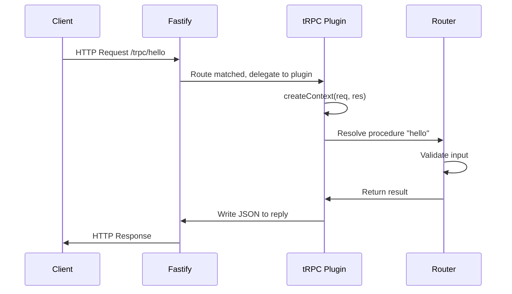

## tRPC Fastify Adapter Setup

The Fastify adapter allows tRPC to run as a Fastify plugin, integrating tRPC's type-safe RPC layer into one of the fastest Node.js HTTP frameworks available. This setup is distinct from the Express adapter and takes advantage of Fastify's plugin architecture and lifecycle hooks.

---

### Prerequisites

Before setting up the adapter, the following packages are required:

```bash
npm install @trpc/server fastify @trpc/server/adapters/fastify
```

Fastify v4+ is the commonly tested version with the tRPC Fastify adapter. [Unverified: Fastify v5 compatibility may vary depending on the `@trpc/server` version in use.]

---

### Project Structure Overview

A typical layout separating router logic from the server entry point:

```
src/
├── router/
│   └── index.ts       # tRPC root router
├── context.ts         # Context factory
└── server.ts          # Fastify server + adapter registration
```

---

### Defining the tRPC Router

```ts
// src/router/index.ts
import { initTRPC } from '@trpc/server';

const t = initTRPC.create();

export const appRouter = t.router({
  hello: t.procedure
    .input((val: unknown) => {
      if (typeof val === 'string') return val;
      throw new Error('Input must be a string');
    })
    .query(({ input }) => {
      return { greeting: `Hello, ${input}` };
    }),
});

export type AppRouter = typeof appRouter;
```

---

### Creating the Context

The Fastify adapter passes `req` and `res` as Fastify-typed objects, not Node's raw `IncomingMessage`/`ServerResponse`. This is a key difference from the Express and standalone adapters.

```ts
// src/context.ts
import { type CreateFastifyContextOptions } from '@trpc/server/adapters/fastify';

export function createContext({ req, res }: CreateFastifyContextOptions) {
  const user = req.headers['x-user'] ?? null;
  return { user };
}

export type Context = Awaited<ReturnType<typeof createContext>>;
```

---

### Registering the Fastify Plugin

The tRPC Fastify adapter exposes a Fastify plugin via `fastifyTRPCPlugin`. It is registered using `fastify.register()` like any other Fastify plugin.

```ts
// src/server.ts
import Fastify from 'fastify';
import {
  fastifyTRPCPlugin,
  type FastifyTRPCPluginOptions,
} from '@trpc/server/adapters/fastify';
import { appRouter, type AppRouter } from './router/index';
import { createContext } from './context';

const fastify = Fastify({ logger: true });

fastify.register(fastifyTRPCPlugin, {
  prefix: '/trpc',
  trpcOptions: {
    router: appRouter,
    createContext,
    onError({ path, error }) {
      console.error(`Error on path: ${path}`, error);
    },
  } satisfies FastifyTRPCPluginOptions<AppRouter>['trpcOptions'],
});

fastify.listen({ port: 3000 }, (err, address) => {
  if (err) {
    fastify.log.error(err);
    process.exit(1);
  }
  console.log(`Server listening at ${address}`);
});
```

**Key Points:**
- `prefix` sets the base path for all tRPC routes (e.g., `/trpc/hello`)
- `trpcOptions` accepts `router`, `createContext`, and `onError`
- `satisfies FastifyTRPCPluginOptions<AppRouter>['trpcOptions']` provides type safety for the options object — this is a TypeScript 4.9+ pattern

---

### WebSocket Support (Optional)

The Fastify adapter supports WebSocket subscriptions through `@fastify/websocket`. This enables tRPC subscriptions over the same server.

```bash
npm install @fastify/websocket
```

```ts
import websocket from '@fastify/websocket';

fastify.register(websocket);

fastify.register(fastifyTRPCPlugin, {
  prefix: '/trpc',
  useWSS: true,           // enable WebSocket support
  trpcOptions: {
    router: appRouter,
    createContext,
  },
});
```

**Key Points:**
- `useWSS: true` activates WebSocket handling within the plugin
- `@fastify/websocket` must be registered *before* the tRPC plugin
- Subscriptions defined in the router become available over `ws://`

[Inference: Registration order matters because Fastify resolves plugin dependencies sequentially; registering `@fastify/websocket` after tRPC may cause the WebSocket handler to be unavailable.]

---

### Adapter Behavior and Request Lifecycle

The Fastify adapter maps tRPC procedure calls to Fastify's request/reply cycle. Behavior may vary depending on Fastify version and plugin configuration.

```
Client Request
      │
      ▼
Fastify Route Matching (/trpc/*)
      │
      ▼
fastifyTRPCPlugin handler
      │
      ├── Calls createContext(req, res)
      │
      ├── Resolves procedure from URL path
      │
      ├── Validates input
      │
      ├── Executes procedure handler
      │
      └── Sends JSON response via Fastify reply
```

The Mermaid diagram below shows this flow more formally:



---

### `prefix` Routing Behavior

All procedures are accessible under the registered prefix:

| Procedure | HTTP Method | URL |
|---|---|---|
| `hello` (query) | GET | `/trpc/hello?input=...` |
| `createUser` (mutation) | POST | `/trpc/createUser` |
| `onUpdate` (subscription) | WS | `ws://host/trpc/onUpdate` |

Query inputs are passed as a JSON-encoded `input` query parameter for GET requests. Mutations send input in the POST body.

---

### Fastify-Specific Considerations

**Content-Type handling:** Fastify's built-in JSON parser handles request body parsing. The tRPC adapter relies on this — avoid disabling Fastify's default content type parser unless you re-implement it.

**`addContentTypeParser` conflicts:** If another plugin registers a conflicting content type parser for `application/json`, the tRPC adapter's behavior may be unpredictable. [Unverified: behavior in such conflict scenarios is not formally documented.]

**Logger integration:** Passing `{ logger: true }` to `Fastify()` enables Pino logging. tRPC errors logged via `onError` will appear alongside Fastify's structured logs, which aids debugging.

**`req.server` access in context:** Because the adapter exposes the full Fastify `req` object, `req.server` is available inside `createContext`, giving access to plugins like decorators and database clients registered on the Fastify instance.

```ts
export async function createContext({ req, res }: CreateFastifyContextOptions) {
  return {
    db: req.server.db,   // assumes `db` was decorated onto the Fastify instance
    user: req.headers['x-user'] ?? null,
  };
}
```

---

### TypeScript Configuration Notes

The tRPC Fastify adapter makes use of TypeScript generics tied to `AppRouter`. Ensure `strict: true` is set in `tsconfig.json` to catch type mismatches in procedure definitions and context shapes. [Inference: Without strict mode, some type errors in context or input validators may silently pass.]

---

### Common Setup Errors

| Error | Likely Cause |
|---|---|
| `Cannot find module '@trpc/server/adapters/fastify'` | Incorrect package version or missing install |
| `Error: Plugin already registered` | `fastifyTRPCPlugin` registered twice |
| WebSocket handler not responding | `@fastify/websocket` not registered before tRPC plugin |
| `req.body` undefined in context | Fastify content-type parser conflict |

---

**Conclusion:** The Fastify adapter integrates tRPC as a native Fastify plugin, providing full access to Fastify's request/reply objects in context, optional WebSocket support for subscriptions, and structured logging out of the box. Its plugin-based registration model differs meaningfully from Express and standalone adapters, requiring attention to plugin ordering and content-type parser compatibility.

**Next Steps:** Explore how `createContext` in the Fastify adapter can leverage Fastify decorators for dependency injection, or proceed to configuring tRPC with the Next.js adapter for full-stack setups.